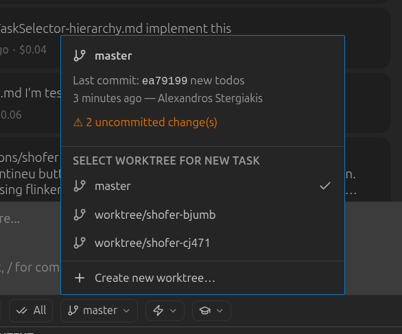
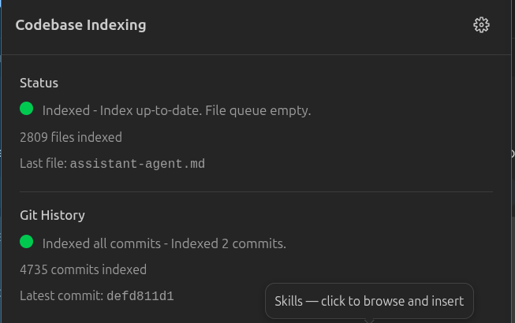
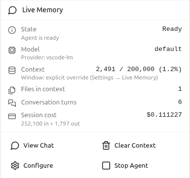

# Shofer

> Shofer (derived from Roo-Code) is an open-source, complete replacement for GitHub Copilot — built for full control over your data, your models, and how your tools work.

---

## Quick Start

1. **Open Shofer** — Click the Shofer icon in the Activity Bar, or press the assigned keyboard shortcut
2. **Configure a Provider** — Open Settings → **Providers** → **New Profile**. Shofer works with Anthropic, OpenAI, Google Gemini, DeepSeek, OpenRouter, Ollama (local), and more. Your API keys are stored securely in your OS credential store.
3. **Start a Task** — Type a message in the chat input bar. Shofer reads your workspace, searches code, runs commands, and edits files. Review every change in the **File Changes Panel** — accept, revert, or diff each one.

Try the built-in `/init` slash command to analyze your codebase and create an `AGENTS.md` file with build commands, code style, and project conventions.

## What You'll See


| UI Element              | Purpose                                                           |
| ----------------------- | ----------------------------------------------------------------- |
| **Chat View**           | Interact with the AI — type messages, see results                 |
| **Task Selector**       | Switch between multiple parallel tasks in a tree hierarchy        |
| **Mode Selector**       | Choose Code, Architect, Ask, Debug, Orchestrator, or custom modes |
| **API Config Selector** | Pick which AI provider and model to use per task                  |
| **Worktree Selector**   | Create and select git worktrees for isolated parallel work        |
| **File Changes Panel**  | Review, accept, revert, or diff every file Shofer modifies        |
| **Context Window Bar**  | Monitor token usage and cost for the current task                 |

## Modes

Shofer ships with 5 built-in modes — choose from the Mode Selector dropdown in the chat input bar:

| Mode                | Best For                                                                 |
| ------------------- | ------------------------------------------------------------------------ |
| 💻 **Code**         | Writing, modifying, and refactoring code. Broadest tool access.          |
| 🏗️ **Architect**    | Planning and designing before writing code. Read + markdown-only writes. |
| ❓ **Ask**          | Getting explanations, answers, or recommendations. Read-only + MCP.      |
| 🪲 **Debug**        | Troubleshooting errors and diagnosing root causes.                       |
| 🪃 **Orchestrator** | Coordinating complex multi-step work by delegating to sub-tasks.         |

Create your own modes (Reviewer, Search, Opinion, Browser, and more) via [`.shofermodes`](src/USER_MANUAL.md#4-custom-modes) files at the project or global level. Control exactly which tool categories are available per mode, with file-scoped restrictions.

Learn more: [User Manual](src/USER_MANUAL.md) • [Custom Modes](src/USER_MANUAL.md#4-custom-modes)

## Parallel Tasks & Worktrees

Shofer supports **true parallel tasks** organized in a tree hierarchy. Start multiple conversations simultaneously — each runs independently with its own mode, provider, and context.

- **Background subtasks** — fan out work without blocking the parent. The Orchestrator mode delegates to specialized sub-tasks automatically.
- **Message queuing** — type ahead while the AI is working. Click **Send Now** to redirect it immediately.
- **Task states** — colored dots show each task's status: idle, running, waiting for input, waiting on subtask, completed, or errored.

### Git Worktrees



Run parallel tasks on different branches — all in one VS Code window:

- Worktrees live at `.shofer/worktrees/<name>/` inside your workspace
- Create, switch, and delete worktrees from the **Worktree Selector** in the Task Header
- Each task can be scoped to a specific worktree for branch-isolated parallel work
- No more stash/commit gymnastics or multiple VS Code windows for PRs

[Read the full worktree documentation](https://github.com/shofer-dev/shofer/blob/master/docs/worktrees.md)

## RAG Indexing



Build a **semantic search index** of your codebase and git history so the AI can find code and commits by _meaning_ — not just keywords.

| Index           | What It Searches                    | Tool         |
| --------------- | ----------------------------------- | ------------ |
| **Code**        | Functions, classes, types, comments | `rag_search` |
| **Git History** | Commit messages and metadata        | `git_search` |

Requires a reachable **Qdrant v1.14.x** server (local or remote). Configure in Settings → **RAG Indexing** — pick an embedding provider, point to your Qdrant instance, and click **Start Indexing**. A file watcher keeps the index up to date as you edit.

[Read the full RAG indexing documentation](https://github.com/shofer-dev/shofer/blob/master/docs/rag_indexing.md)

## Assistant Agent



The **Assistant Agent** is a persistent, read-only AI companion that accumulates codebase knowledge over time — surviving task completion and VS Code restarts.

- Runs on a **low-cost model with a large context window** (you choose the model)
- Answers questions from any task via the [`ask_assistant_agent`]() tool
- **Strictly read-only** — can read files, search code, and look up symbols; cannot write or execute
- **KV-cache friendly** — append-only context window keeps provider costs minimal
- Learns organically — each question adds context, building an ever-richer understanding of your codebase

Enable in Settings and choose a lightweight model (e.g., Gemini Flash, GPT-4o-mini).

[Read the full Assistant Agent documentation](https://github.com/shofer-dev/shofer/blob/master/docs/assistant_agent.md)

## Special Files

Shofer recognizes several files in your workspace that control its behavior. These files are **write-protected** — Shofer cannot modify them without your explicit approval.

| File / Directory        | Purpose                                              |
| ----------------------- | ---------------------------------------------------- |
| `.shoferignore`         | Hide files from Shofer (same syntax as `.gitignore`) |
| `.shofermodes`          | Define custom AI modes for your project              |
| `AGENTS.md`             | Project rules injected into every task               |
| `.shofer/rules/`        | Mode-agnostic rules (always active)                  |
| `.shofer/rules-<mode>/` | Rules for a specific mode (e.g., `rules-code/`)      |
| `.shofer/commands/`     | Custom slash commands                                |
| `.shofer/skills/`       | Domain-specific skill instructions                   |
| `.shofer/mcp.json`      | Per-project MCP server configuration                 |

## Settings at a Glance

| Section                | What You Can Do                                            |
| ---------------------- | ---------------------------------------------------------- |
| **Providers**          | Add API profiles, switch models, configure endpoints       |
| **Modes**              | Create and edit custom modes with per-tool access control  |
| **Auto-Approval**      | Toggle which tool categories run without asking permission |
| **MCP Servers**        | Connect external tools (browser, databases, Kubernetes)    |
| **RAG Indexing**       | Build a semantic search index of your codebase             |
| **Context Management** | Control when conversations get condensed                   |
| **Limits**             | Set per-task USD cost caps and API request limits          |

Key recommendations: start with auto-approval toggles **OFF** and enable incrementally. Set `shofer.defaultCostLimit` to cap spending. Configure a command allowlist for shell operations.

## Migration Paths

**Coming from Roo-Code?** Shofer is a major architectural improvement with parallel tasks, async MCP calling, semantic code & git log indexing, native worktree support, and background subtasks. Run `/migrate-from-roocode` to migrate your configuration. [Read the migration guide →](https://github.com/shofer-dev/shofer/blob/master/docs/shofer_for_roocode_users.md)

**Coming from GitHub Copilot?** Shofer gives you full model choice, local-first privacy, 50+ native tools, and parallel task execution. Run `/migrate-from-copilot` to migrate your configuration. [Read the migration guide →](https://github.com/shofer-dev/shofer/blob/master/docs/shofer_for_copilot_users.md)

## Community

- **[Discord](https://discord.gg/x39UEEQ2)** — Chat with the team, get help, share feedback
- **[Reddit](https://reddit.com/r/Shofer_dev)** — Community discussions and tips
- **[GitHub Issues](https://github.com/shofer-dev/shofer/issues)** — Bug reports and tracking

Shofer is open source (Apache 2.0). Contributions are welcome — read [`CONTRIBUTING.md`](CONTRIBUTING.md) and check the [roadmap](https://github.com/orgs/shofer/projects/1).

## Resources

- **[User Manual](USER_MANUAL.md):** The complete guide to every feature, setting, and concept in Shofer.
- **[Developer Documentation](https://shofer.dev/docs):** Official docs for installing, configuring, and mastering Shofer.
- **[GitHub Issues and Feature Requests](https://github.com/shofer-dev/shofer/issues):** Report bugs, feature requests, and track development.

---

## Local Setup & Development

1. **Clone** the repo:

```sh
git clone https://github.com/shofer-dev/shofer.git
```

2. **Install dependencies**:

```sh
pnpm install
```

3. **Run the extension**:

There are several ways to run the Shofer extension:

### Development Mode (F5)

For active development, use VSCode's built-in debugging:

Press `F5` (or go to **Run** → **Start Debugging**) in VSCode. This will open a new VSCode window with the Shofer extension running.

- Changes to the webview will appear immediately.
- Changes to the core extension will also hot reload automatically.

### Automated VSIX Installation

To build and install the extension as a VSIX package directly into VSCode:

```sh
pnpm install:vsix [-y] [--editor=<command>]
```

This command will:

- Ask which editor command to use (code/cursor/code-insiders) - defaults to 'code'
- Uninstall any existing version of the extension.
- Build the latest VSIX package.
- Install the newly built VSIX.
- Prompt you to restart VS Code for changes to take effect.

Options:

- `-y`: Skip all confirmation prompts and use defaults
- `--editor=<command>`: Specify the editor command (e.g., `--editor=cursor` or `--editor=code-insiders`)

### Manual VSIX Installation

If you prefer to install the VSIX package manually:

1.  First, build the VSIX package:
    ```sh
    pnpm vsix
    ```
2.  A `.vsix` file will be generated in the `bin/` directory (e.g., `bin/shofer-<version>.vsix`).
3.  Install it manually using the VSCode CLI:
    ```sh
    code --install-extension bin/shofer-<version>.vsix
    ```

---

We use [changesets](https://github.com/changesets/changesets) for versioning and publishing. Check our `CHANGELOG.md` for release notes.

---

## Disclaimer

**Please note** that Shofer, Inc does **not** make any representations or warranties regarding any code, models, or other tools provided or made available in connection with Shofer, any associated third-party tools, or any resulting outputs. You assume **all risks** associated with the use of any such tools or outputs; such tools are provided on an **"AS IS"** and **"AS AVAILABLE"** basis. Such risks may include, without limitation, intellectual property infringement, cyber vulnerabilities or attacks, bias, inaccuracies, errors, defects, viruses, downtime, property loss or damage, and/or personal injury. You are solely responsible for your use of any such tools or outputs (including, without limitation, the legality, appropriateness, and results thereof).

---

## Contributing

We love community contributions! Get started by reading our [CONTRIBUTING.md](CONTRIBUTING.md).

---

## License

[Apache 2.0 © 2026 Shofer, Inc.](./LICENSE)
