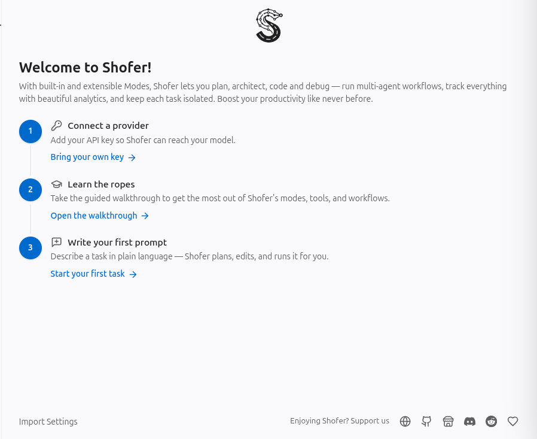
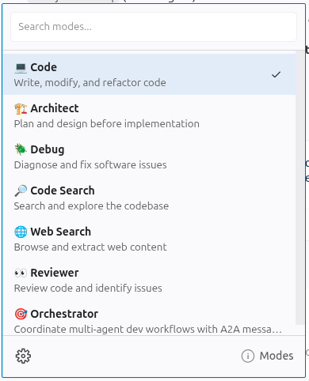
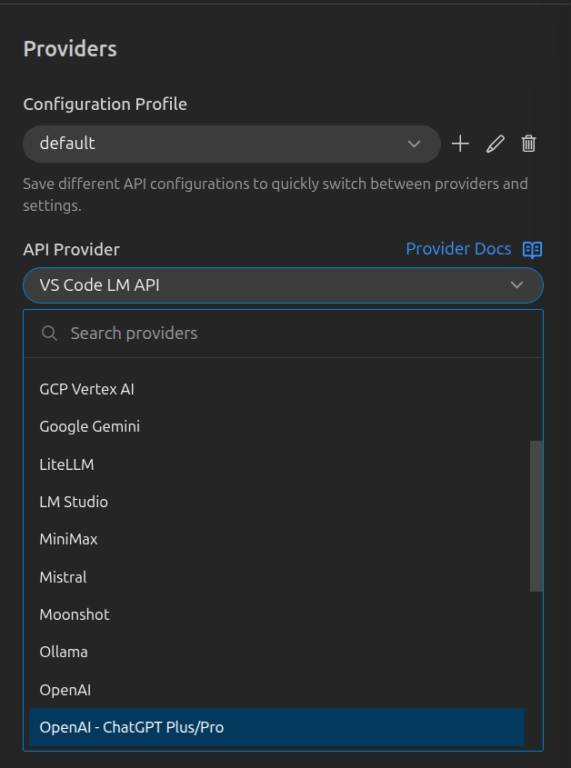
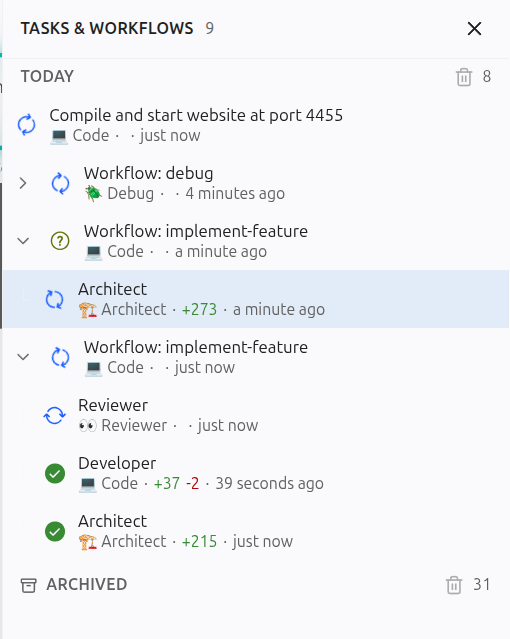
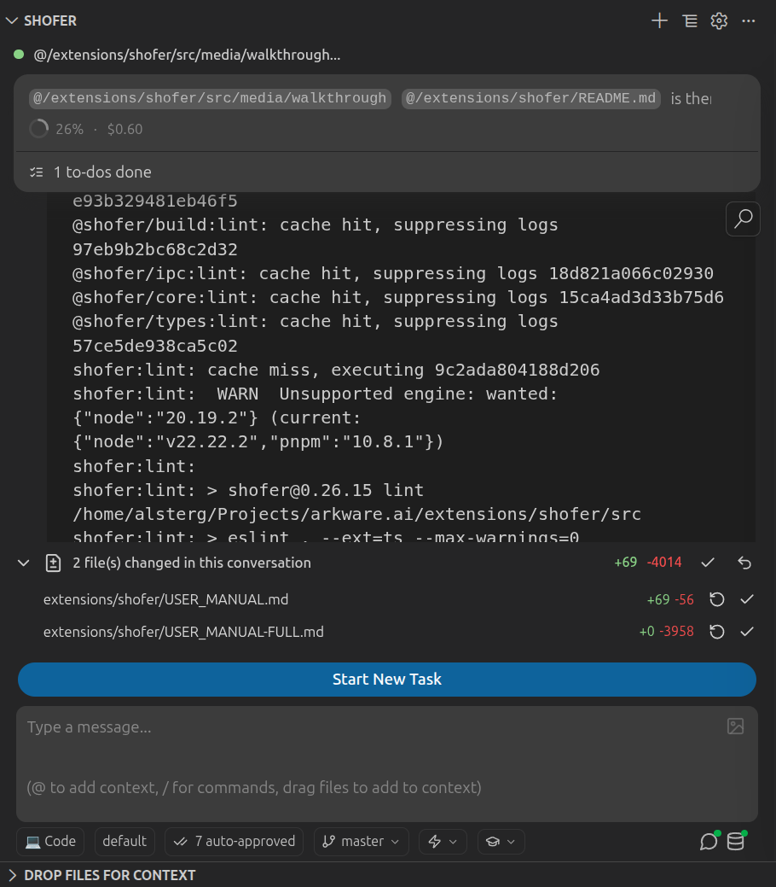
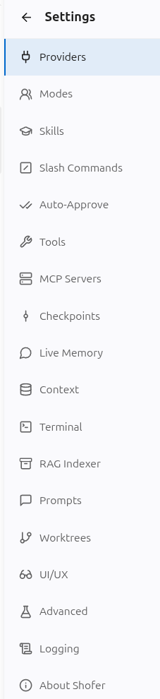
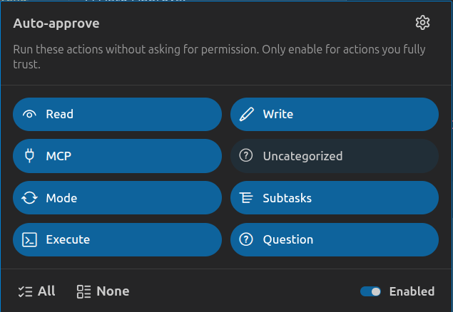
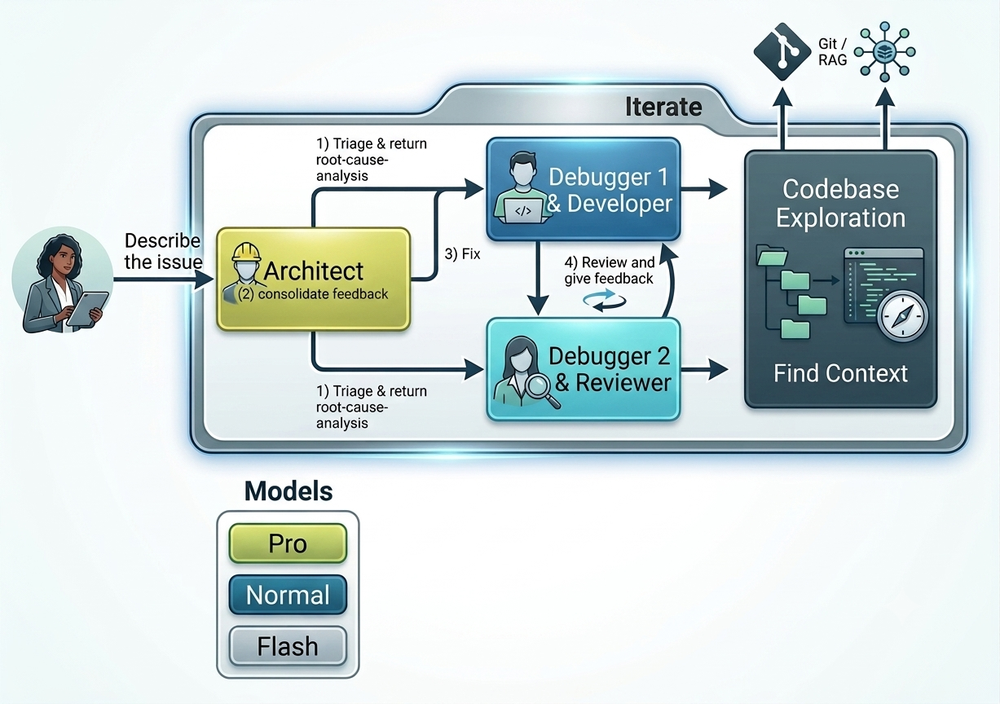
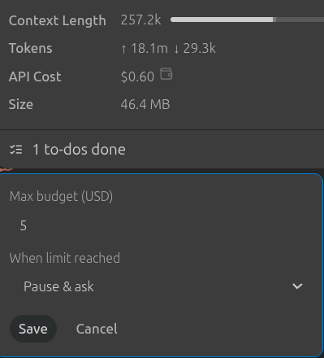

# Shofer User Manual

Welcome to Shofer (from the French _chauffeur_ — driver). This manual covers the concepts and configuration you need to use Shofer effectively.

---

## Table of Contents

1. [Getting Started](#1-getting-started)
2. [Settings](#2-settings)
3. [Custom Modes](#3-custom-modes)
4. [Auto-Approval](#4-auto-approval)
5. [Parallel Tasks & Sub-tasks](#5-parallel-tasks--sub-tasks)
6. [MCP Servers](#6-mcp-servers)
7. [Semantic Code Search (RAG)](#7-semantic-code-search-rag)
8. [Skills](#8-skills)
9. [Workflows](#9-workflows)
10. [Git Worktrees](#10-git-worktrees)
11. [Per-Task Cost Limit](#11-per-task-cost-limit)
12. [Slash Commands](#12-slash-commands)
13. [Special Files](#13-special-files)
14. [Assistant Agent](#14-assistant-agent)
15. [Community](#15-community)

---

## 1. Getting Started

## Home Screen



| UI Element              | Purpose                                                           |
| ----------------------- | ----------------------------------------------------------------- |
| **Chat View**           | Interact with the AI — type messages, see results                 |
| **Task Selector**       | Switch between multiple parallel tasks in a tree hierarchy        |
| **Mode Selector**       | Choose Code, Architect, Ask, Debug, Orchestrator, or custom modes |
| **API Config Selector** | Pick which AI provider and model to use per task                  |
| **Worktree Selector**   | Create and select git worktrees for isolated parallel work        |
| **File Changes Panel**  | Review, accept, revert, or diff every file Shofer modifies        |
| **Context Window Bar**  | Monitor token usage and cost for the current task                 |

### Modes

Shofer ships with five built-in modes that control what tools and models the AI can use:

| Mode               | Icon | Best For                                                         |
| ------------------ | ---- | ---------------------------------------------------------------- |
| **Code** (default) | 💻   | Writing, modifying, and refactoring code.                        |
| **Architect**      | 🏗️   | Planning and designing before writing code.                      |
| **Ask**            | ❓   | Getting explanations, answers, or recommendations.               |
| **Debug**          | 🪲   | Troubleshooting errors and diagnosing root causes.               |
| **Orchestrator**   | 🪃   | Coordinating complex multi-step work by delegating to sub-tasks. |



You can add any number of custom modes via [`.shofer/shofermodes`](#3-custom-modes). Common examples include a read-only **Reviewer**, a fast **Search** agent, or a **Browser** mode for web interaction.

### API Provider Profiles

An API Provider Profile bundles your API key, model selection, and endpoint URL into a named configuration. Switch between profiles via the API Config Selector dropdown. Each task remembers its profile — switching tasks restores that task's profile.



### Switching Tasks



Shofer supports **true parallel tasks** organized in a tree hierarchy. Use the **Task Selector** dropdown in the Task Header to switch between them:

- **Colored dots** show each task's state: Idle (gray), Running (green), Waiting for Input (yellow), Waiting on Subtask (blue), Paused (orange), Completed (green ✓), Error (red)
- Completed tasks carry a self-assessed rating: Poor, Well, or Excellent
- **Pin** important tasks to keep them at the top, **Archive** completed ones, **Rename** or **Delete** as needed
- Parent-child hierarchy — subtasks indent under their parent in the list

### Task Screen

Once a task is running, the chat view shows:



| Element                | What It Shows                                                    |
| ---------------------- | ---------------------------------------------------------------- |
| **Task Header**        | Task title, state dot, context window bar, todo list progress    |
| **Context Window Bar** | Horizontal bar filling up as tokens accumulate; hover for counts |
| **API Cost**           | Running total in USD, with inline pencil to edit the cost limit  |
| **File Changes Panel** | Collapsible list of every file modified, with Accept / Revert    |
| **Message Queue**      | Messages you typed while Shofer was busy, with Send Now button   |

---

## 2. Settings



Shofer's settings are organized by tab in the Settings panel (⚙️ gear icon):

| Tab                 | What You Configure                                         |
| ------------------- | ---------------------------------------------------------- |
| **Providers**       | API profiles, models, endpoints, pricing overrides         |
| **Auto-Approve**    | Toggle which tool categories run without asking permission |
| **Tools**           | Global tool disable list and tool group assignments        |
| **Slash Commands**  | Configure built-in and custom slash commands               |
| **Skills**          | Browse, load, and manage skill packs                       |
| **Checkpoints**     | Git-based workspace snapshots for diff and revert          |
| **Notifications**   | Telemetry, error reporting, and notification preferences   |
| **Assistant Agent** | Configure the persistent read-only AI companion            |
| **Context**         | Adjust condensation thresholds and context window limits   |
| **Terminal**        | Configure command execution timeouts and allowlists        |
| **RAG Indexer**     | Semantic code and git log search index configuration       |
| **Modes**           | Create and edit built-in and custom modes                  |
| **MCP Servers**     | Connect external tools (browser, databases, Kubernetes)    |
| **Worktrees**       | Manage git worktrees (create, delete, view status)         |
| **Prompts**         | Customize per-mode system prompts and instructions         |
| **UI**              | Chat view and sidebar display preferences                  |
| **Experimental**    | Feature flags and opt-in experimental capabilities         |
| **Language**        | Change the display language                                |
| **About**           | Export, import, or reset all Shofer settings               |

### Settings Backup & Reset

Settings → About → **Export** saves your full configuration as `shofer-code-settings.json` (API profiles, keys, modes, auto-approval). **Import** restores from a previous export. **Reset** wipes everything to defaults. MCP server configs are NOT included in export — copy `mcp_settings.json` separately from your data directory.

---

## 3. Custom Modes

Define custom modes in a `.shofer/shofermodes` file at your project root (or globally at `~/.shofer/shofermodes`).

### Tool Access Fields

| Field           | Purpose                                                                                                          |
| --------------- | ---------------------------------------------------------------------------------------------------------------- |
| `groups`        | Grants broad categories of tools (`read`, `write`, `execute`, `mcp`, `browser`, `mode`, `subtasks`, `questions`) |
| `tools_allowed` | Grants individual tools outside the listed groups                                                                |
| `tools_denied`  | Unconditionally blocks specific tools (always wins)                                                              |

**Rule:** `(in groups OR in tools_allowed) AND NOT in tools_denied`

### Examples

**Read-only reviewer:**

```yaml
customModes:
    - slug: my-reviewer
      name: 🔍 My Reviewer
      roleDefinition: You are a code reviewer. You read code, find issues, and propose fixes — but you never edit files.
      groups:
          - read
```

**Docs-only editor (write restricted to Markdown):**

```yaml
- slug: docs-editor
  name: 📝 Docs Editor
  roleDefinition: You write and edit documentation.
  groups:
      - read
      - - write
        - fileRegex: "\\.(md|mdx)$"
```

A mode must have at least `groups` or `tools_allowed`. Project-level modes override global modes with the same slug.

---

## 4. Auto-Approval

Auto-approval controls when Shofer acts without asking permission. Configure it via the **AutoApproveDropdown** (shield icon) in the chat input bar.



### Toggles

| Toggle        | Controls                                           |
| ------------- | -------------------------------------------------- |
| **Read-Only** | Reading files, searching code, listing directories |
| **Write**     | Creating, editing, deleting files                  |
| **Execute**   | Running shell commands                             |
| **Browser**   | Browser automation tools                           |
| **MCP**       | MCP tool calls and resource access                 |
| **Mode**      | Switching between modes                            |
| **Subtasks**  | Spawning and managing background tasks             |
| **Questions** | Auto-selecting follow-up question answers          |

Each mode has its own set of toggles. Toggling Read-Only ON in Code mode does not affect Architect mode.

### Command Allowlisting

The **Execute** toggle requires a list of allowed command prefixes to have any effect. When enabled, each shell command is matched against the allowlist using a "longest prefix wins" rule. A denylist can override specific commands.

**Security:** Start with toggles OFF and enable incrementally. Use the denylist for destructive commands (`rm`, `git push --force`). Keep "Protected Files" and "Outside Workspace" options OFF unless you genuinely need them.

---

## 5. Parallel Tasks & Sub-tasks

Shofer can run multiple tasks at the same time. Start a new task from the title bar — your current task moves to the background.

### Background Sub-tasks

The model can spawn background children via `new_task` with `is_background: true`. The parent continues working and polls results:

| Tool                      | Purpose                                    |
| ------------------------- | ------------------------------------------ |
| `check_task_status`       | Query a child's state without blocking     |
| `wait_for_task`           | Block until one or more children finish    |
| `list_background_tasks`   | List all running children                  |
| `cancel_tasks`            | Stop children early                        |
| `answer_subtask_question` | Answer a question a background child asked |

When a background child needs clarification, its question is routed to the **parent task** (not to you). Canceling a parent automatically cancels all its children.

### Limits

- Background tasks are aborted when their parent finishes or is stopped.
- After a VS Code restart, running tasks are reset to Idle.

---

## 6. MCP Servers

Connect external tools via MCP (Model Context Protocol) servers. Configure them in Settings → Tools → MCP Servers (global) or `.shofer/mcp.json` (project).

### Configuration

**Local Node.js server (stdio):**

```json
{
	"my-tools": {
		"type": "stdio",
		"command": "node",
		"args": ["./mcp-servers/my-tools/dist/server.js"],
		"timeout": 60
	}
}
```

**Remote HTTP server:**

```json
{
	"arkware-tools": {
		"type": "streamable-http",
		"url": "http://localhost:30089"
	}
}
```

### Tool Group Assignment

Assign tool groups to control auto-approval per tool:

```json
{
	"readonly-server": {
		"command": "node",
		"args": ["server.js"],
		"toolGroups": {
			"search_tool": "read",
			"fetch_tool": "read"
		}
	}
}
```

Disable individual tools with `disabledTools`, or an entire server with `"disabled": true`. Config files are watched automatically — saving triggers a reconnect.

---

## 7. Semantic Code Search (RAG)

Shofer can build a semantic search index of your codebase using Qdrant and an embedding provider. Once configured, the agent can use `rag_search` to find code by meaning.

### Setup

1. Have a running Qdrant instance.
2. Choose an embedding provider (OpenAI, Ollama, Gemini, etc.) in Settings → RAG / Code Index.
3. Enter credentials and enable indexing.

Shofer scans workspace files, builds embeddings, and stores them in Qdrant. The indexing status badge in the chat input bar shows progress.

`rag_search` complements `lsp_search` (symbol search) and `grep_search` (text search) — the agent picks the right tool automatically. Git commit history can also be indexed via the same infrastructure (Settings → RAG / Code Index → Git History).

### Git Commit History Search (`git_search`)

Shofer can also index your **git commit history** for semantic search. When enabled (Settings → RAG Indexer → Git History), `git_search` lets the agent search commit messages by meaning — discovering who changed what, when, and why without exact keyword matching.

| Aspect                 | Code Index (`rag_search`)                  | Git Index (`git_search`)                        |
| ---------------------- | ------------------------------------------ | ----------------------------------------------- |
| **What it searches**   | Source code (functions, classes, comments) | Commit messages (subject + body)                |
| **Qdrant collection**  | `ws-<hash>`                                | `git-<hash>`                                    |
| **Embedding provider** | Shared (same as code index)                | Shared                                          |
| **Result fields**      | File snippets with scores                  | Commit hash, author, date, subject, body, score |

Enable it by toggling **Git History** in the RAG Indexer popover or Settings → RAG Indexer. Configure max history days, max commits, and poll interval. Once indexed, the agent automatically uses `git_search` alongside `rag_search` when historical context would help.

---

## 8. Skills

Skills are reusable instruction packs for specific tasks. Each skill is a folder with a `SKILL.md` file.

### Where Skills Live

| Directory                   | Scope   |
| --------------------------- | ------- |
| `{project}/.shofer/skills/` | Project |
| `~/.shofer/skills/`         | Global  |

### Creating a Skill

```
.shofer/skills/
└── my-skill/
    └── SKILL.md
```

`SKILL.md` uses YAML frontmatter followed by markdown instructions:

```markdown
---
name: my-skill
description: Brief description (1-1024 characters)
modeSlugs:
    - code
    - architect
---

# My Skill

Full instructions Shofer will follow when this skill is loaded...
```

Skills are discovered automatically. Use the 🎓 button in the chat input bar to browse and load them. Project-level skills override global skills with the same name.

---

## 9. Workflows

Workflows are **formal, multi-agent specifications** that coordinate multiple AI agents
through a deterministic, non-LLM execution engine. Unlike ad-hoc Orchestrator tasks
(where the LLM decides what to do next), workflows are specified in `.slang` files
that define exactly which agents run, in what order, with what control flow.

Shofer ships with **two built-in workflows** available out of the box:

### Built-in Workflows

#### 🪲 Debug



A collaborative debugging workflow with three agents:

- **How it works:** Two developer agents independently investigate the issue in parallel,
  compare their findings, converge on a root cause through peer review, get your sign-off,
  then one fixes while the other reviews — iterating until both are satisfied.
- **Agents:** Orchestrator (`orchestrator` mode), Developer1 (`code` mode), Developer2 (`code` mode)
- **Launch:** Click **New…** → **New Workflow** → pick "Collaborative Debug"

#### 🔧 Implement a Feature


A feature implementation pipeline with three agents:

- **How it works:** The Architect creates a design document, you review and approve it,
  then a Developer implements the feature in slices while a Reviewer evaluates each slice.
  The loop continues until both Developer and Reviewer are satisfied.
- **Agents:** Architect (`orchestrator` mode), Developer (`code` mode), Reviewer (`reviewer` mode)
- **Launch:** Click **New…** → **New Workflow** → pick "Implement a Feature"

### Launching a Workflow

1. Click the **+** button in the task header, then select **New Workflow**
2. Choose a workflow from the launcher (built-in or custom)
3. If the workflow has parameters (e.g., an issue description or feature name),
   the executor prompts you for them
4. The workflow starts — agents appear as child tasks in the Task Selector tree

The Workflow Task itself has a dedicated chat view that shows parameter prompts,
`escalate @Human` interactions, and agent question relays.

### Creating Custom Workflows

Define your own workflows as `.slang` files under `.shofer/workflows/` (project)
or `~/.shofer/workflows/` (global). Each file defines one `flow` with named agents,
their modes, and the control flow between them.

A minimal single-agent workflow:

```slang
flow "my-workflow" (name: "string") {
  title: "My Workflow"
  description: "A simple custom workflow."
  icon: "rocket"

  agent Greeter {
    mode: "code"
    role: "You are a friendly greeter."

    stake greet(name: name, task: "Say hello and give a warm greeting.")
    commit
  }

  converge when: @Greeter.committed
}
```

**Discovery priority** (lower-numbered sources are overridden by higher ones):

| Priority | Source                            | Scope             |
| -------- | --------------------------------- | ----------------- |
| 1        | Built-in (shipped with extension) | All workspaces    |
| 2        | `~/.shofer/workflows/*.slang`     | Global (per-user) |
| 3        | `.shofer/workflows/*.slang`       | Project           |

If you create a `.shofer/workflows/debug.slang` in your project, it **completely
replaces** the built-in Debug workflow. There is no partial merging.

### How it Works Under the Hood

Workflows are executed by a **Workflow Task** — a deterministic state machine
that makes zero LLM calls itself. It dispatches agent Tasks as background children
using the mode slug declared in each agent's `.slang` block, waits for their
`attempt_completion` results, routes outputs between agents via mailboxes, and
evaluates control flow (`repeat until`, `when/otherwise`, `converge`).

Agents in a workflow are regular Shofer Tasks with full tool access in their
assigned mode. The Workflow Task coordinates them at the parent level — you can
inspect each agent's chat, messages, and tool calls from the Task Selector tree.

Learn more:

- [Built-in Workflows SoT](https://github.com/shofer-dev/shofer/blob/master/docs/built-in-workflows.md) — the full pipeline from `.slang` → discovery → execution
- [Slang Language Spec](https://github.com/shofer-dev/shofer/blob/master/docs/slang_specs.md) — grammar, operations, control flow, output contracts
- [Workflow Design](https://github.com/shofer-dev/shofer/blob/master/docs/workflow_design.md) — architecture and design decisions

---

## 9. Git Worktrees

Shofer manages git worktrees for parallel tasks, letting multiple tasks run on different branches simultaneously in the same VS Code window. Worktrees live under `.shofer/worktrees/`.


### Creating a Worktree

1. Click the branch chip in the chat input bar.
2. Click "Create new worktree…".
3. Confirm the branch and path (auto-generated).
4. A new task spawns automatically in that worktree.

### `.shofer/worktreeinclude`

By default, only tracked git files are present in a new worktree. Create a `.shofer/worktreeinclude` file to specify which gitignored files (e.g., `node_modules/`) to copy automatically. Only files matching **both** `.gitignore` and `.shofer/worktreeinclude` are copied.

Manage worktrees from Settings → Worktrees (view, delete, force-delete with uncommitted changes). Multi-root workspaces are not supported.

**Limitations:**

- Git submodules are not initialized automatically. You must run `git submodule update --init` in the worktree manually.
- Merging and rebasing should be done manually. For safety, Shofer only provides create, delete, and select operations on worktrees — it does not merge, rebase, or push.

---

## 10. Per-Task Cost Limit

Set a USD budget cap on any task. When reached, Shofer pauses, aborts, or kills the task.

Edit a running task's cap by clicking the wallet icon next to the cost display in the Task Header. Actions: `pause` (ask you what to do), `abort` (clean stop), `kill` (immediate stop).



The displayed cost includes all descendant sub-tasks.

---

## 11. Slash Commands

Slash commands are quick actions you can trigger by typing `/` in the chat input bar. Shofer ships with built-in commands and supports custom commands defined in your project.

### Built-in Commands

| Command                 | Purpose                                              |
| ----------------------- | ---------------------------------------------------- |
| `/init`                 | Analyze your codebase and create an `AGENTS.md` file |
| `/migrate-from-roocode` | Migrate settings and modes from Roo-Code             |
| `/migrate-from-copilot` | Migrate settings from GitHub Copilot                 |
| `/loaded`               | List skills currently loaded into the task context   |
| `/search`               | Search for skills by keyword                         |

### Custom Commands

Define your own slash commands as `.md` files under `.shofer/commands/` (project) or `~/.shofer/commands/` (global). Each file name becomes the command name.

```markdown
---
description: Summarize the current project structure
modeSlugs:
    - code
    - architect
---

Read the project structure and provide a concise summary of the architecture, key directories, and entry points.
```

Commands accept arguments — everything after `/command-name ` is passed to the command template as `$ARGUMENTS`. Use the Settings → **Slash Commands** tab to browse and manage all registered commands.

## 12. Special Files

Shofer recognizes these files in your project:

| File / Directory        | Purpose                                       | Location               |
| ----------------------- | --------------------------------------------- | ---------------------- |
| `.shofer/shoferignore`  | Hides files from the AI (`.gitignore` syntax) | Workspace root         |
| `.shofer/shofermodes`   | Custom AI modes for this project              | Workspace root         |
| `AGENTS.md`             | Project rules injected into every task        | Workspace root         |
| `.shofer/rules/`        | Mode-agnostic rules (always active)           | Project or `~/.shofer` |
| `.shofer/rules-<mode>/` | Rules active only in a specific mode          | Project or `~/.shofer` |
| `.shofer/commands/`     | Slash commands                                | Project or `~/.shofer` |
| `.shofer/skills/`       | Domain-specific skills                        | Project or `~/.shofer` |
| `.shofer/mcp.json`      | MCP server config for this project            | Workspace `.shofer/`   |

### Write-Protected Files

The AI cannot modify these files without explicit approval: `.shofer/shoferignore`, `.shofer/shofermodes`, everything inside `.shofer/`, `.vscode/settings.json`, `*.code-workspace`, `AGENTS.md`.

### `.shofer/shoferignore`

Same syntax as `.gitignore`. Files matching the patterns are invisible to Shofer's tools. The "Show ignored files" setting (in Settings) controls whether ignored files appear in directory listings with a 🔒 badge.

---

## 13. Assistant Agent

The **Assistant Agent** is a persistent, read-only AI companion that accumulates codebase knowledge over time — surviving task completion and VS Code restarts.

### What It Does

- Runs on a **low-cost model with a large context window** (you choose the model)
- Conversation history persists across tasks and VS Code restarts
- Learns organically — each question asked by a task adds context
- **Strictly read-only** — can only read files, search code, and look up symbols. Cannot write, execute, or use MCP tools

### How Tasks Use It

Any task can call the `ask_assistant_agent` tool to ask the Assistant Agent a question. The agent answers from its accumulated knowledge, saving the calling task from re-loading files into its own context window.

### Setup

1. Open **Settings** → enable the Assistant Agent
2. Link an **API Configuration profile** with a lightweight model (e.g., Gemini Flash, GPT-4o-mini, Claude Haiku)
3. The agent starts with an empty context and fills it as tasks ask questions

The **Assistant Agent Status** badge in the Shofer sidebar shows whether the agent is active and processing.

### Key Benefits

- **Context reuse** — knowledge persists across tasks, no redundant file loading
- **Cost efficient** — uses a cheap model; each answer costs a fraction of a cent
- **KV-cache friendly** — append-only context window keeps the provider's attention cache warm
- **File-aware** — notified of file changes to keep its knowledge fresh

[Read the full Assistant Agent documentation](https://github.com/shofer-dev/shofer/blob/master/docs/assistant_agent.md)

---

## 14. Community

- **[Discord](https://discord.gg/x39UEEQ2)** — Chat with the team, get help, share feedback
- **[Reddit](https://reddit.com/r/Shofer_dev)** — Community discussions and tips
- **[GitHub Issues and Feature Requests](https://github.com/shofer-dev/shofer/issues)** — Bug reports, feature requests, and tracking

Shofer is open source (Apache 2.0). Contributions are welcome — read [`CONTRIBUTING.md`](https://github.com/shofer-dev/shofer/blob/main/CONTRIBUTING.md) and check the [roadmap](https://github.com/orgs/shofer/projects/1).
