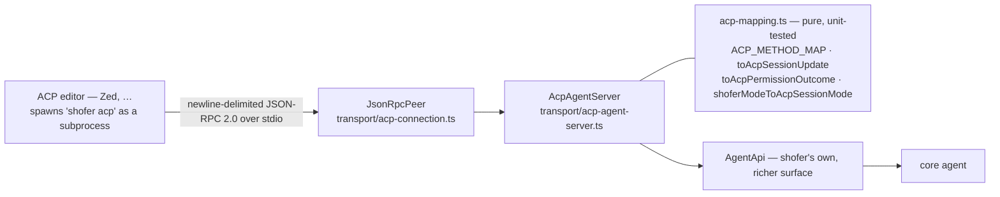
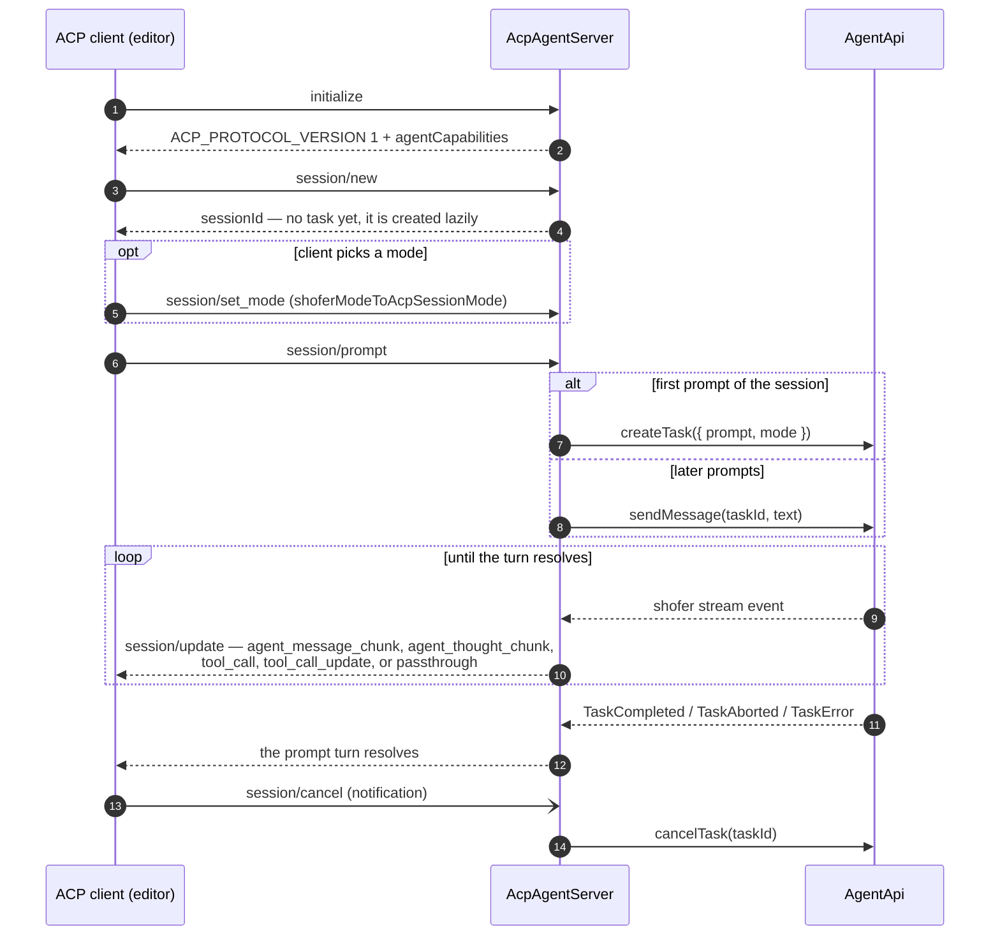

# ACP — Agent Client Protocol backend

Shofer implements the **agent side of ACP** so any ACP-speaking editor (Zed today, more
over time) can drive shofer as a backend agent with **zero per-editor work** — instead of N
bespoke editor integrations. ACP is an *external standard*; shofer's job is to map its own
session/mode/model/permission/event surface onto ACP's method set.

- **Mapping (pure, tested):** [`transport/acp-mapping.ts`](../packages/core/src/transport/acp-mapping.ts)
- **Agent server:** [`transport/acp-agent-server.ts`](../packages/core/src/transport/acp-agent-server.ts)
- **JSON-RPC peer:** [`transport/acp-connection.ts`](../packages/core/src/transport/acp-connection.ts)
- **Entrypoint:** `shofer acp` (stdio) → `transport/run-acp-agent.ts`
- **Surface it adapts:** [`agentapi.md`](./agentapi.md) — read that first.

## What ACP actually is

ACP is a **full RPC protocol**, not just a payload format:

- **Mechanism** — JSON-RPC 2.0 (requests / responses / notifications), framed as
  **newline-delimited JSON**, one object per line, over **stdio** (the editor spawns
  `shofer acp` as a subprocess). Our `JsonRpcPeer` is transport-agnostic (a `write(line)`
  sink + `receive()`), but the standard wrapping is stdio.
- **Schema + semantics** — a *fixed* method set and session lifecycle defined by the
  standard: `initialize` (capability negotiation) → `session/new` → `session/prompt`
  (streaming `session/update` notifications) → `session/cancel`.
- **Version** — `ACP_PROTOCOL_VERSION = 1`.

So ACP defines both *how* messages are exchanged and *what* they mean. The point is
**interop** across agents and editors.

### Distinct from

- **MCP** — tools shofer *calls* (outbound). ACP is inbound: clients drive shofer.
- **shofer's multi-agent orchestration** (`new_task`, peer messaging) — internal, not a wire protocol.
- **[AgentApi](./agentapi.md)** — shofer's own richer surface. ACP is a *lossy adapter* over it (see [below](#how-acp-differs-from-agentapi)).

ACP here is **agent-side** (clients drive shofer). Acting as an ACP *client* (shofer driving
external ACP agents) is a separate, lower-priority direction.

## Method map (ACP → shofer concept)

The method set shofer maps, from `ACP_METHOD_MAP` (asserted in tests so `shofer acp` can be
checked for completeness against the protocol):

| ACP method | shofer concept |
| --- | --- |
| `initialize` | capability negotiation |
| `authenticate` | provider credentials |
| `newSession` | create Task |
| `loadSession` | resume Task from history |
| `listSessions` | task history |
| `prompt` | send user message to Task |
| `cancel` | `Task.abortTask` |
| `setSessionMode` | switch mode (`shoferModeToAcpSessionMode`) |
| `setSessionModel` | select model (catalog) |
| `requestPermission` | auto-approval decision (`toAcpPermissionOutcome`) |
| `sessionUpdate` | typed events → notifications (`toAcpSessionUpdate`) |

### Currently wired on the agent server

The live `AcpAgentServer` handles: `initialize`, `session/new`, `session/prompt`
(streaming `session/update`, resolving the turn on `TaskCompleted`/`TaskAborted`/
`TaskError`), `session/set_mode`, and the `session/cancel` notification. `initialize`
advertises `agentCapabilities: { loadSession: false, promptCapabilities: { image: false }
}`. The remaining rows (auth, `loadSession`/`listSessions`, `setSessionModel`,
`requestPermission`) are the deferred surface — see [Status](#status--deferred).

## Event mapping

Shofer stream events → ACP `session/update` notifications (`toAcpSessionUpdate`). Common
cases get dedicated variants; **nothing is dropped** — the fallback wraps the raw event:

| shofer event | ACP `sessionUpdate` |
| --- | --- |
| `assistant` / `text` | `agent_message_chunk` (text) |
| `thinking` / `reasoning` | `agent_thought_chunk` (text) |
| `tool_use` | `tool_call` (id, title) |
| `tool_result` | `tool_call_update` (status `completed`, content) |
| *anything else* | `passthrough` (raw event) |

## Permissions & modes

An interactive tool approval maps a shofer auto-approval decision onto an ACP
`requestPermission` outcome (`toAcpPermissionOutcome`):

| shofer decision | ACP outcome |
| --- | --- |
| `approve` | `selected: allow_once` (no user prompt) |
| `deny` | `selected: reject` |
| `ask` | `prompt` (defer to the client's permission UI) |

Modes map **1:1** — the shofer mode slug *is* the ACP session-mode id (a named passthrough,
`shoferModeToAcpSessionMode` / `acpSessionModeToShoferMode`, so there's one place to diverge).

## How ACP differs from AgentApi

Both let arbitrary front-ends drive the core, but they are **different contracts**, not two
pipes for one contract:

| | ACP | [AgentApi](./agentapi.md) (HTTP/SSE) |
| --- | --- | --- |
| Owner | External standard (Zed-originated) | Shofer's own |
| Schema | **Fixed, narrow** ACP method set | **Full, faithful** shofer surface |
| Notably **absent** | checkpoints, changed-files diff/restore/accept/revert (no such concept in ACP) | — (exposes all of it) |
| Wire | JSON-RPC 2.0 over stdio (subprocess) | REST + SSE, bearer auth + version handshake |
| Purpose | Interop with ACP editors | Remote headless execution (**Shofer Nodes**) |

Key point: `AgentApi` is **richer than ACP**. ACP is a lowest-common-denominator adapter;
HTTP/SSE is the full-fidelity binding. Even running ACP JSON-RPC over a socket would still
be the narrow ACP surface — the difference is the **schema**, not the pipe.

## Plugins over ACP

Plugin **behavior** (contributed tools like `ask_live_memory`, `transformSystemPrompt`,
lifecycle hooks) rides ACP transparently: it's baked into what the core emits, so an ACP
client's `session/update` stream reflects plugin-shaped turns (given the executor host
wired the plugin `ctx` seams). Plugin **UI** does **not** cross ACP — it's a VS Code webview
concern (see [agentapi.md](./agentapi.md#where-plugins-fit)).

## Running it

`shofer acp` boots a headless host (`ShoferApiAgent` → `AcpAgentServer`) and runs on
stdin/stdout (`disableOutput` keeps stdout clean for the protocol). An editor configures it
as its ACP agent command.

## Status / deferred

The mapping is pure + fully unit-tested; the `shofer acp` shell runs on the host-agnostic
core (no VS Code needed). Deferred:

1. Swap the direct JSON-RPC framing for the upstream `@agentclientprotocol/sdk` once it's in
   the registry (drop-in — `JsonRpcPeer` mirrors its connection).
2. Wire `requestPermission` (agent→client) onto the auto-approval flow — the mapping exists;
   it needs an approval hook on `AgentApi`.
3. `loadSession`/`listSessions`, `setSessionModel`, and end-to-end validation against a live
   ACP client (Zed), reconciling raw-event → `ShoferStreamEvent` normalization with real payloads.

See [`v3_architecture.md`](./v3_architecture.md) initiative §11.
