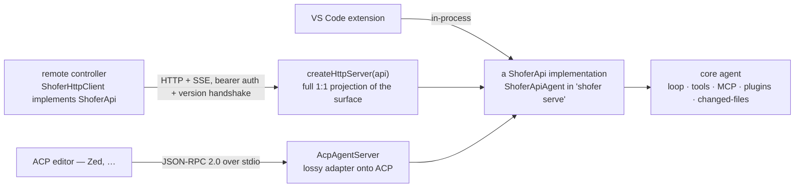
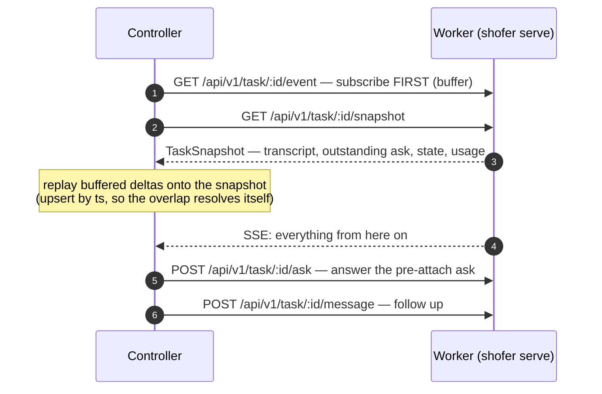
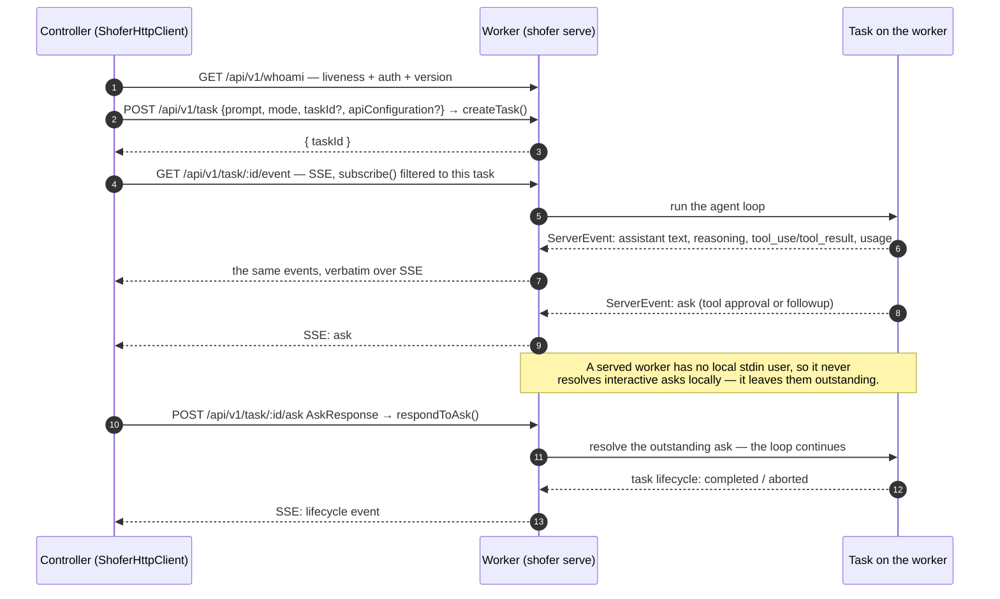
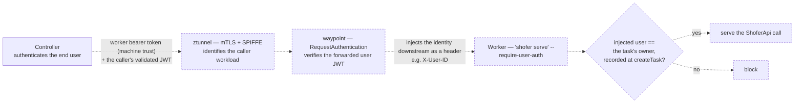

# ShoferApi — the transport-agnostic agent surface

`ShoferApi` is the **one control-plane interface** every front-end and transport drives.
It decouples the core agent (loop, tools, MCP, plugins, changed-files) from _how_ a
UI reaches it, so arbitrary front-ends (VS Code, an editor over [ACP](./acp.md), a CLI, a
remote controller) can drive the same core without touching it.

- **Definition:** [`packages/types/src/shofer-api.ts`](../packages/types/src/shofer-api.ts)
  (in `@shofer/types`, vscode-free, so both the core implementations and the wire-protocol
  modules share it).
- **Strategic context:** [`host-boundary.md`](./host-boundary.md) (host boundary,
  HTTP/SDK, distributed execution).

## Why it exists

The decoupling seam is `ShoferApi`, **not** any single wire protocol. Everything else is a
_transport_ that binds to it:

| Binding        | Implementer                                                                                             | Role                                                                                                                                                                                 |
| -------------- | ------------------------------------------------------------------------------------------------------- | ------------------------------------------------------------------------------------------------------------------------------------------------------------------------------------ |
| **In-process** | `ShoferApiAgent implements ShoferApi` (`transport/shofer-api-agent.ts`)                                 | The live core agent, backed by the extension's `ShoferExtensionApi`.                                                                                                                 |
| **HTTP/SSE**   | `createHttpServer(api)` + `ShoferHttpClient implements ShoferApi` (`transport/http-{server,client}.ts`) | A **1:1 projection of the full surface** (see [routes](#httpsse-binding)). The native transport for driving a served executor (`shofer serve`) from any client (`ShoferHttpClient`). |
| **ACP**        | `AcpAgentServer` over `ShoferApi` (`transport/acp-*.ts`)                                                | A **lossy adapter** onto the external [Agent Client Protocol](./acp.md) so ACP editors (Zed, …) can drive shofer. Narrower than `ShoferApi` — see [acp.md](./acp.md).                |



Because `ShoferHttpClient` _implements_ `ShoferApi`, client and server can't drift: the same
interface is the wire contract.

## The surface

The full method set (see the source for exact signatures):

### Control plane

| Method                                                                    | Purpose                                                                                                                                                                                                                                     |
| ------------------------------------------------------------------------- | ------------------------------------------------------------------------------------------------------------------------------------------------------------------------------------------------------------------------------------------- |
| `createTask({ prompt, mode, taskId?, apiConfiguration? })` → `{ taskId }` | Start a task. `mode` (**required**) is the mode slug it runs in. `apiConfiguration` ships the controller's resolved [API Configuration](#per-task-api-configuration) so a remote task runs on the same provider/model the front-end picked. |
| `sendMessage(taskId, message)`                                            | Send a follow-up message to a running task.                                                                                                                                                                                                 |
| `cancelTask(taskId)`                                                      | Abort a task.                                                                                                                                                                                                                               |
| `respondToAsk(taskId, AskResponse)`                                       | Answer an outstanding `ask` (interactive tool approval / follow-up). The reverse of the `ask` events on the stream, so a remote task's approvals round-trip like a local one's.                                                             |
| `getTaskSnapshot(taskId)` → `TaskSnapshot \| undefined`                   | The task's state so far — see [Task snapshots](#task-snapshots-attaching-to-a-running-task). `undefined` when the host owns no such task.                                                                                                   |
| `subscribe(listener)` → `unsubscribe`                                     | Subscribe to the agent event stream ([`ServerEvent`](#event-model)).                                                                                                                                                                        |

### Reverse data channel

Any **plugin-owned** per-task feature for a **remote (shadow) task**: the controller
reads and mutates it on the owning executor exactly like a local task drives its own
in-process plugin. One generic method carries all of them, so a new feature never means a
new wire method:

| Method                                                       | Purpose                                                                                                                                                                                                                                                |
| ------------------------------------------------------------ | ------------------------------------------------------------------------------------------------------------------------------------------------------------------------------------------------------------------------------------------------------ |
| `pluginRequest(taskId, plugin, method, params?)` → `unknown` | Call a plugin's `handleRequest` on the executor that owns the task — how the file-changes panel's list/revert/accept and the checkpoints feature's diff/restore reach their per-task state. `params`/result are plugin-defined JSON; errors propagate. |

### Event model

`subscribe()` delivers `ServerEvent { type: string; …event-specific }` — a **superset,
open-ended** stream (assistant text, reasoning, tool-call start/result, asks, task
lifecycle, token usage, changed-files, …). Front-ends match on `type`. An `ask` event is
answered back via `respondToAsk` (`AskResponse { askResponse, text?, images?, askId?, mode? }`;
`mode` switches the task to that mode slug as part of the answer — for an
`ask_followup_question` suggestion that carries one).

Transports project this stream onto their own shape: HTTP/SSE emits it verbatim over SSE;
ACP maps the common cases onto its typed `session/update` variants and wraps the rest as
`passthrough` (see [acp.md](./acp.md#event-mapping)).

## HTTP/SSE binding

Shofer's **native, full-fidelity** transport (`transport/http-server.ts`). All
routes under `/api/v1` except `/health`; bearer-token auth + version handshake.

```
GET  /health                      liveness + version (open)
GET  /api/v1/whoami               { version } (authed; one-shot liveness+auth)
GET  /api/v1/event                SSE event stream (worker-wide: ALL tasks) → subscribe()
GET  /api/v1/task/:id/event       SSE event stream filtered to ONE task   → subscribe() + filter
GET  /api/v1/task/:id/snapshot    TaskSnapshot (404 = not this host's task) → getTaskSnapshot()
POST /api/v1/task                 { prompt, mode, taskId?, apiConfiguration? } → createTask()
POST /api/v1/task/:id/message     { message }                 → sendMessage()
POST /api/v1/task/:id/cancel                                  → cancelTask()
POST /api/v1/task/:id/ask         AskResponse                 → respondToAsk()
POST /api/v1/task/:id/plugin-request        { plugin, method, params? } → { result }
```

`GET /api/v1/event` is the whole worker's firehose — every task's events. `GET
/api/v1/task/:id/event` is the same SSE filtered to one task (by `args[0]` /
`args[0].taskId`). A controller multiplexing many users' tasks on a **shared**
executor subscribes per authorized task, so it never receives — or has to demux —
other tenants' content; the worker-wide stream stays for single-tenant / whole-worker
consumers.

## Task snapshots — attaching to a running task

`subscribe` only carries what happens NEXT. A controller that reaches a task already in
flight — the normal case for a dispatched task, and for any controller that restarted —
needs what came before, so the surface has one read method: `getTaskSnapshot(taskId)`,
served over `GET /api/v1/task/:id/snapshot` (bearer-authed like every other `/api/v1`
route; `404` when the host owns no such task).

[`taskSnapshotSchema`](../packages/types/src/shofer-api.ts) is the wire shape:

| Field            | Meaning                                                                                             |
| ---------------- | --------------------------------------------------------------------------------------------------- |
| `taskId`         | The task, on the host that owns it.                                                                 |
| `summary`        | Its title (the first prompt) — what a synthetic task header renders.                                |
| `createdAt`      | Creation timestamp, when the host knows one.                                                        |
| `state`          | `TaskState` — lifecycle, plus the completion rating when there is one.                              |
| `messages`       | The WHOLE `ShoferMessage` conversation, not a tail.                                                 |
| `outstandingAsk` | The ask the task is blocked on: `{ ask, askId?, text?, ts }` — enough to answer via `respondToAsk`. |
| `tokenUsage`     | Authoritative counters, so an attached view's token/cost meter is the executor's, not a guess.      |

`outstandingAsk` matters more than it looks: a served worker **never resolves an
interactive ask locally**, so a task found mid-flight is very often blocked on one raised
before anyone attached. It is derived from the transcript — the last message is an ask,
complete, not auto-approved, not already answered — which means the same rule applies to a
live task and to one rehydrated from disk.

Backfill + the per-task stream are the two halves of **attaching**:



Subscribing before fetching is what closes the hole a busy task would otherwise fall
into; because message deltas are keyed by `ts`, replaying the buffered ones over the
snapshot is idempotent.

## Running `shofer serve`

`shofer serve` boots the headless executor and exposes the surface above; a controller
connects with `ShoferHttpClient`. Every option is a CLI flag (defined in
[`apps/cli/src/index.ts`](../apps/cli/src/index.ts), handled in
[`commands/cli/serve.ts`](../apps/cli/src/commands/cli/serve.ts)):

| Flag                     | Default                                          | Meaning                                                                                                                                                                                                                                                                                                                                                                                                                                  |
| ------------------------ | ------------------------------------------------ | ---------------------------------------------------------------------------------------------------------------------------------------------------------------------------------------------------------------------------------------------------------------------------------------------------------------------------------------------------------------------------------------------------------------------------------------- |
| `-p, --port <port>`      | `30099`                                          | Port to listen on.                                                                                                                                                                                                                                                                                                                                                                                                                       |
| `--host <host>`          | `127.0.0.1`                                      | Bind address. **Use `0.0.0.0` to accept traffic from outside the process** (e.g. in a container).                                                                                                                                                                                                                                                                                                                                        |
| `-w, --workspace <path>` | cwd                                              | Workspace directory. Custom modes are read from `<workspace>/.shofer/shofermodes`.                                                                                                                                                                                                                                                                                                                                                       |
| `-e, --extension <path>` | auto (`ROO_EXTENSION_PATH` → sibling `src/dist`) | Path to the built extension bundle (`extension.js`).                                                                                                                                                                                                                                                                                                                                                                                     |
| `--provider <provider>`  | `openrouter`                                     | LLM provider. Any of `--provider/--model/--api-key/--base-url` **pins** the worker to that config (per-task `apiConfiguration` from the controller is then ignored).                                                                                                                                                                                                                                                                     |
| `-m, --model <model>`    | provider default                                 | Model id. The `shofer` provider has **no** default model — pass one or task creation errors.                                                                                                                                                                                                                                                                                                                                             |
| `-k, --api-key <key>`    | –                                                | Provider API key.                                                                                                                                                                                                                                                                                                                                                                                                                        |
| `--base-url <url>`       | –                                                | Provider base URL (e.g. `http://llm-router:3000/v1`).                                                                                                                                                                                                                                                                                                                                                                                    |
| `-t, --token <token>`    | `$SHOFER_NODE_TOKEN`                             | Bearer token required on every `/api/v1/*` call. Omit for an open (dev) worker. **Machine trust** (authenticates the controller, not the end user).                                                                                                                                                                                                                                                                                      |
| `--require-user-auth`    | off _(proposed)_                                 | **User-identity enforcement (launch-time only).** When on, the worker trusts a **validated end-user identity** injected upstream (Istio `RequestAuthentication` → header — see _User-identity enforcement_) and **blocks** any ShoferApi call whose user is not the task's owner. Operator-set at launch like `--provider`; **no in-session user or agent can change it.** The `--token` worker bearer is unaffected and still required. |
| `--interactive`          | off                                              | **Approval mode.** Off = non-interactive: the worker **auto-approves every tool** (no local user to ask). On = the worker surfaces approvals — `autoApprovalEnabled` is off, so a dangerous tool raises an `ask` over ShoferApi that the controller brokers to its user via `respondToAsk`.                                                                                                                                              |
| `-q, --quiet`            | off                                              | Suppress the per-task activity log on stderr.                                                                                                                                                                                                                                                                                                                                                                                            |
| `-d, --debug`            | off                                              | Debug logging to `~/.shofer/cli-debug.log`.                                                                                                                                                                                                                                                                                                                                                                                              |

**Ask brokering (contract).** A served worker has no local stdin user, so it **never
resolves interactive asks locally** — tool/command/MCP approvals _and_ `followup`
questions are left outstanding for the controller to surface and answer via
`respondToAsk`. (Idle / flow-control asks — `api_req_failed`, `resume_task`, … — are
worker policy and are still handled on the worker.) A controller that drives a served
worker MUST answer brokered asks, or the task blocks: approvals with
`yesButtonClicked`/`noButtonClicked`, a `followup` with `messageResponse` + `text`.
`--interactive` only decides whether _approvals arise at all_ (auto-approve vs
surface); `followup` questions are brokered in either mode.

One task's round trip over the HTTP/SSE binding, ask brokering included:



## User-identity enforcement (proposed)

The `--token` worker bearer is **machine trust** — it authenticates the _controller_ (e.g.
user-console) to the worker, not the end user. On a shared worker pool the controller is
trusted to only ever open/drive tasks for the user it authenticated; the worker itself does not
know _which_ user is behind a call. To make that a defense-in-depth invariant rather than a
controller-only guarantee, the worker is fronted by the **Istio ambient mesh** and given the
end-user identity — the worker token is **kept**, this layers on top:

- **Connection authN** — ztunnel **mTLS + SPIFFE** identifies the _caller workload_; an
  `AuthorizationPolicy` can restrict the ShoferApi to the controller's identity.
- **End-user identity** — the controller forwards the caller's **validated JWT**; Istio
  `RequestAuthentication` verifies it at the worker's waypoint and **injects the identity
  downstream as a header** (`outputClaimToHeaders`, e.g. `X-User-ID`), so the worker reads a
  _trusted_ user id it did not have to take on faith from the controller.
- **Enforcement** — with `--require-user-auth` on, the worker **blocks** any call whose injected
  user is not the task's owner (recorded at `createTask`). This is **launch-time,
  integrator-owned**: no in-session user or agent can disable it (same principle as provider
  pinning).



Everything dashed above is _proposed_. What exists today is the `--token` worker
bearer, which this layers on top of and does not replace.

Full model + rationale: `docs/authnz_arch.md` §11.2.

## Per-task API Configuration

A remote worker runs each task on the **API Configuration the controlling front-end picked
for that task** — resolved controller-side (named profile → mode's profile → global
default) and shipped in `createTask`'s `apiConfiguration`. It can differ per task, and it
carries the provider/model/base-URL/key (over the bearer-token-authed channel), so the
worker needs no provider setup of its own. This is what lets a controller point every worker
at a shared endpoint (e.g. an `llm-router` service reachable from both hosts).

**Manual override.** Start the worker with any of `--provider` / `--model` / `--api-key` /
`--base-url` and it pins to that config: the incoming per-task `apiConfiguration` is
ignored and the worker's own config always wins. With none of those flags, the worker defers
to the controller (per task). The gate is computed once at boot (`serve.ts` →
`allowClientConfig`) and enforced in `ShoferApiAgent.createTask`; the in-process Local
adapter never receives a remote config (it reads the provider's live config directly).

## Where plugins fit

The [plugin system](../PLUGINS.md) runs **inside** the core agent, so plugin _behavior_
(contributed tools, `transformSystemPrompt`, lifecycle hooks) is baked into what the core
emits over `ShoferApi` — it rides **any** binding transparently (given the executor host
wired the plugin `ctx` seams). Plugin **UI** (badge, panel, settings, `ctx.ui`) is a
VS-Code-webview concern wired in `ShoferProvider` over `postMessage`; it is **not** part of
`ShoferApi` and does not cross any of these transports. A non-VS-Code front-end gets plugin
behavior, not plugin UI, unless it implements its own plugin-UI host.

## See also

- [acp.md](./acp.md) — the ACP adapter and how it differs from this surface.
- [host-boundary.md](./host-boundary.md) — the architecture this transport plugs into.
- [public_api.md](./public_api.md) / [cli.md](./cli.md) — the `ShoferExtensionApi` / CLI surface `ShoferApiAgent` is built on.
