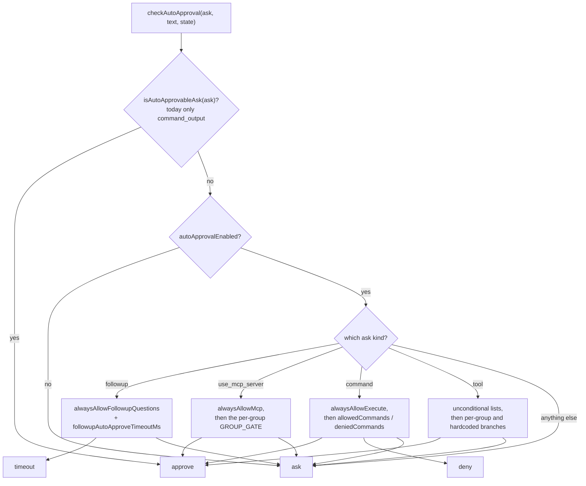
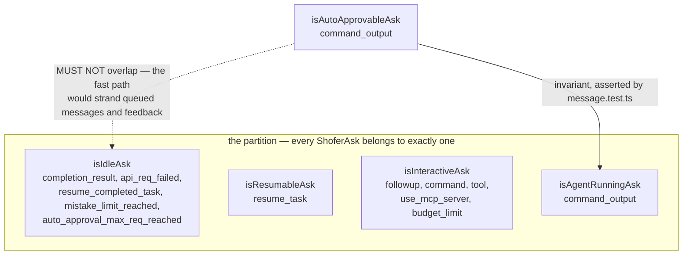
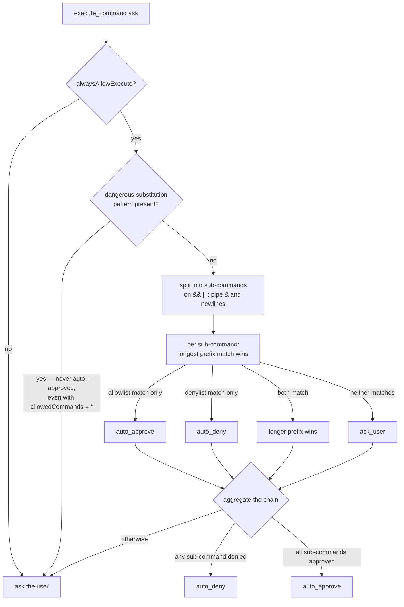
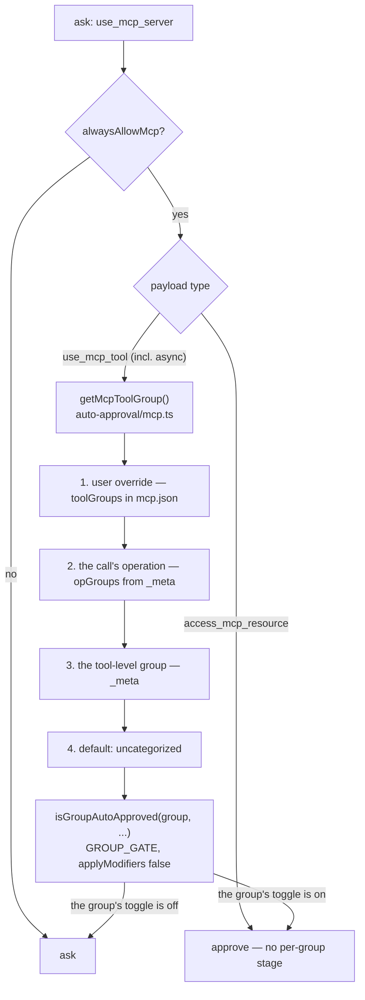

# Shofer Auto-Approval System

Complete reference for how tool auto-approval works in Shofer. This document describes
the decision flow, the available categories/toggles, and which tools fall under each category.

Source: [`packages/core/src/auto-approval/index.ts`](../packages/core/src/auto-approval/index.ts)

**Where the toggles come from.** `checkAutoApproval()` reads them through
`ContextProxy` like any other setting, so on a VS Code host they are what the user
set in the Settings UI, and on **any** host they are overridden by the layered
`.shofer/settings.json` scopes. A headless host (`shofer serve`, `--print`) has no
user to have set them, so it seeds a posture at startup — for the keys no scope
supplies, and never for one a scope does. A served node seeds one key,
`autoApprovalEnabled: false`, and leaves the rest ABSENT, which denies: nothing
auto-approves unless a `.shofer/` scope states it `true`. A local unattended run
(`shofer run` without `--require-approval`, `shofer acp`) states the opposite seed
for itself — every DECLARED capability (`read`, `write`, `execute`, `browser`,
`mcp`, `mode`, `subtasks`) plus `allowedCommands: ["*"]` — because the person who
typed the command is the author of that grant. `alwaysAllowUncategorized` and
`alwaysAllowFollowupQuestions` are in neither seed. Configuration wins over both. See
[`configuration.md`](configuration.md#headless-hosts-the-approval-posture-is-configuration-not-a-flag).

---

## Decision Flow

Every user-facing ask (tool use, command execution, MCP access, follow-up question, mode
switch) passes through `checkAutoApproval()`. The decision order is:

1. **Non-blocking asks** — unconditionally approved (no UI interaction needed).
2. **`autoApprovalEnabled` gate** — if the master toggle is off, everything goes to the user.
3. **Per-category checks** — evaluated in a fixed order (followup → MCP → command → tool).
4. **Fallback** — anything not matched returns `{ decision: "ask" }`.

The possible decisions are:

| Decision  | Meaning                                                    |
| --------- | ---------------------------------------------------------- |
| `approve` | Tool runs immediately without user interaction.            |
| `deny`    | Tool is blocked without asking the user.                   |
| `ask`     | User is prompted for approval.                             |
| `timeout` | Auto-approve after a countdown (follow-up questions only). |

### The ask-level fast path, and why idle asks are excluded

Step 1 above is not a convenience: `isAutoApprovableAsk` short-circuits
`Task.ask()` **synchronously**, without entering `pWaitFor` — so it never drains
the message queue and never handles a `messageResponse`. `ShoferAsk` is
partitioned across four _state_ categorizers, and the auto-approvable set is an
**orthogonal policy predicate** layered on top of that partition, not a fifth
member of it:

An auto-approvable ask **implies** an agent-running ask; an idle ask (one that
ends a turn) must never be auto-approvable. The two sets happen to share the same
single member today, but they encode different policies and must stay separate
declarations.

---

## Auto-Approval Categories (Toggles)

These are the boolean toggles exposed in the UI. Each controls a specific class of actions.

| Toggle (`alwaysAllow*`)        | Controls                                                                       | Additional Options                                                              |
| ------------------------------ | ------------------------------------------------------------------------------ | ------------------------------------------------------------------------------- |
| `alwaysAllowReadOnly`          | Tools in the `read` ToolGroup                                                  | `alwaysAllowReadOnlyOutsideWorkspace`                                           |
| `alwaysAllowWrite`             | Tools in the `write` ToolGroup                                                 | `alwaysAllowWriteOutsideWorkspace`, `alwaysAllowWriteProtected`                 |
| `alwaysAllowBrowser`           | Tools in the `browser` ToolGroup                                               | –                                                                               |
| `alwaysAllowMcp`               | Master gate for MCP tool calls and resource access                             | Per-group toggle for the tool's group (see [`alwaysAllowMcp`](#alwaysallowmcp)) |
| `alwaysAllowModeSwitch`        | `switch_mode` tool                                                             | –                                                                               |
| `alwaysAllowSubtasks`          | `new_task`, `finishTask`, `cancel_tasks`, `answer_subtask_question`            | –                                                                               |
| `alwaysAllowExecute`           | Shell command execution (gate — requires `allowedCommands` to have any effect) | `allowedCommands`, `deniedCommands`                                             |
| `alwaysAllowFollowupQuestions` | Follow-up question suggestions                                                 | `followupAutoApproveTimeoutMs`                                                  |

> **Each toggle maps to a ToolGroup** (see [`tool-categories.md`](tool-categories.md)).
> Adding a new group to `TOOL_GROUPS` in [`packages/types/src/tool.ts`](../packages/types/src/tool.ts)
> automatically makes it available for auto-approval — a tool inherits the toggle of the group
> it belongs to.

---

## Unconditionally Auto-Approved Tools

These tools bypass **all** toggles and are always approved. The system considers them
either harmless meta-operations or purely informational queries against in-memory state.

### Meta-Operations

| Tool               | Rationale                                                                                                                                                                                                                                                                          |
| ------------------ | ---------------------------------------------------------------------------------------------------------------------------------------------------------------------------------------------------------------------------------------------------------------------------------- |
| `update_todo_list` | Updates the task checklist — UI-only, no side effects.                                                                                                                                                                                                                             |
| `skills`           | Loads pre-defined instructions — skills must be user-installed.                                                                                                                                                                                                                    |
| `set_task_title`   | Renames the task in UI and history — non-destructive.                                                                                                                                                                                                                              |
| `give_feedback`    | Appends a feedback line to the extension output channel.                                                                                                                                                                                                                           |
| `sleep`            | Pauses execution for a fixed delay — no I/O. Note: it is in `TOOL_GROUPS.execute`, but is approved **unconditionally**, independent of `alwaysAllowExecute`. Gating a harmless pause would only prompt the user on every delay (and, without a chat row, look like a silent hang). |

### Inter-Task Questions

A **question directed at another task** is always auto-approved. `ask_followup_question`
only reaches the `tool` ask path here when a background child routes its question **up to
its parent** (see [`AskFollowupQuestionTool`](../packages/core/src/tools/AskFollowupQuestionTool.ts) —
the `task.parentTaskId && task.isBackgroundTask` branch calls
`askApproval("tool", { tool: "askFollowupQuestion", … })`). No human is interrupted: the
parent fields the question and answers via `answer_subtask_question`. Gating it behind a user
prompt would be meaningless and would silently hang the child (no resolver exists for an
auto-context).

| Tool                                | Rationale                                                         |
| ----------------------------------- | ----------------------------------------------------------------- |
| `ask_followup_question` (to parent) | Routed up the task tree; answered by another agent, not the user. |

> **Distinction:** A question directed at the **user** instead flows through the
> `followup` **ask** category (`task.ask("followup", …)`), which is gated by
> `alwaysAllowFollowupQuestions` (see [below](#alwaysallowfollowupquestions)). The tool name
> is the same (`ask_followup_question`); the **destination** — parent task vs. user —
> determines the path and therefore the gating. See
> [`task_messaging.md`](task_messaging.md#ask_followup_question-from-a-task-in-a-peer-exchange)
> and [`parallelism.md`](parallelism.md#ask_followup_question-routing).

### Background-Task Status Tools

These query **in-memory state** owned by the parent task. They never touch the filesystem
or network and mutate nothing:

| Tool                    | Description                                                                   |
| ----------------------- | ----------------------------------------------------------------------------- |
| `check_task_status`     | Check status/result of a background child task.                               |
| `wait_for_task`         | Block until one or more background tasks complete (event-driven, no polling). |
| `list_background_tasks` | List all background child tasks started by this task.                         |

> **Important distinction:** The _status_ tools are unconditionally approved, but
> **`new_task`**, `cancel_tasks`, `finishTask`, and `answer_subtask_question` are
> all gated behind `alwaysAllowSubtasks`. If that toggle is off, the model must ask
> permission before spawning, cancelling, or completing a subtask. This prevents
> uncontrolled task-tree growth while still letting the model inspect tasks it has
> already spawned.

> **`send_message_to_task` is split by mode:** the **async** (fire-and-forget,
> `wait: false`) form is approved **unconditionally** — it only enqueues a message
> and returns immediately. The **sync** (`wait: true`) form blocks the caller on the
> target's reply and is gated behind `alwaysAllowSubtasks`, like the other
> control-plane subtask tools. See the `sendMessageToTask` branch in
> [`checkAutoApproval`](../packages/core/src/auto-approval/index.ts).

### Lightweight Read-Only Tools

These tools query in-memory editor/LSP state, fetch public URLs, or list workspace
metadata. They cannot mutate user state and are unconditionally approved (independent
of `alwaysAllowReadOnly`):

| Tool                     | What it queries                                    |
| ------------------------ | -------------------------------------------------- |
| `find_files`             | File-name glob matching against workspace index.   |
| `view_image`             | Reads an image file for visual analysis.           |
| `get_errors`             | Language-server diagnostics for open files.        |
| `get_changed_files`      | Files modified during the current task session.    |
| `get_project_setup_info` | Detected languages, frameworks, and build systems. |
| `read_project_structure` | Directory tree of the workspace.                   |
| `list_code_usages`       | LSP "find all references" for a symbol.            |
| `lsp_search`             | LSP workspace symbol search.                       |

### Async MCP Call Status Tools

These tools query in-memory state of async MCP calls. They mutate nothing and are
unconditionally approved:

| Tool                    | Description                                          |
| ----------------------- | ---------------------------------------------------- |
| `check_mcp_call_status` | Check status/result of an async MCP tool call.       |
| `wait_for_mcp_call`     | Block until async MCP calls complete (event-driven). |

---

## Conditional Auto-Approval (Toggle-Gated)

### `alwaysAllowSubtasks`

Controls **task creation, completion, cancellation, and subtask question answering**.
The background-task status tools (`check_task_status`, `wait_for_task`,
`list_background_tasks`) are **not** gated by this toggle (see
[Unconditionally Auto-Approved](#unconditionally-auto-approved-tools)).

| Tool                      | Toggle ON                 | Toggle OFF            |
| ------------------------- | ------------------------- | --------------------- |
| `new_task`                | `{ decision: "approve" }` | `{ decision: "ask" }` |
| `finishTask`              | `{ decision: "approve" }` | `{ decision: "ask" }` |
| `cancel_tasks`            | `{ decision: "approve" }` | `{ decision: "ask" }` |
| `answer_subtask_question` | `{ decision: "approve" }` | `{ decision: "ask" }` |

### `alwaysAllowModeSwitch`

Controls the `switch_mode` tool only.

### `alwaysAllowReadOnly`

Controls the read-only tool actions as classified by `isReadOnlyToolAction()`:

| Tool                     |
| ------------------------ |
| `read_file`              |
| `list_files`             |
| `grep_search`            |
| `rag_search`             |
| `lsp_search`             |
| `find_files`             |
| `view_image`             |
| `get_errors`             |
| `get_changed_files`      |
| `get_project_setup_info` |
| `list_code_usages`       |
| `git_search`             |
| `ask_live_memory`        |

> **Note:** Some tools appear both here and in the unconditionally-approved list.
> The unconditional path takes precedence — these tools are approved before the
> `alwaysAllowReadOnly` check runs.

When a tool operates **outside the workspace**, `alwaysAllowReadOnlyOutsideWorkspace`
must also be `true` for auto-approval.

### `alwaysAllowWrite`

Controls the write tool actions as classified by `isWriteToolAction()`:

| Tool                 |
| -------------------- |
| `editedExistingFile` |
| `appliedDiff`        |
| `newFileCreated`     |
| `generate_image`     |

Additional constraints:

- **Outside workspace:** requires `alwaysAllowWriteOutsideWorkspace`.
- **Protected files:** requires `alwaysAllowWriteProtected`.

### `alwaysAllowExecute`

Controls shell command execution. **This toggle is a gate — it does NOT auto-approve any
command on its own.** Turning it ON merely enables the allowlist/denylist evaluation
pipeline; without entries in `allowedCommands`, every command still prompts the user.

When enabled, each command is first parsed into sub-commands (split by `&&`, `||`, `;`,
`|`, `&`, and newlines), then each sub-command is evaluated against `allowedCommands` and
`deniedCommands` using prefix-matching with a "longest match wins" rule:

| allowedCommands          | deniedCommands | Command              | Result                            |
| ------------------------ | -------------- | -------------------- | --------------------------------- |
| `["git"]`                | `[]`           | `git status`         | `auto_approve`                    |
| `["git"]`                | `["git push"]` | `git push origin`    | `auto_deny` (denylist longer)     |
| `["git push --dry-run"]` | `["git push"]` | `git push --dry-run` | `auto_approve` (allowlist longer) |
| `["*"]`                  | `["rm"]`       | `rm -rf /`           | `auto_deny`                       |
| `["*"]`                  | `[]`           | `echo hello`         | `auto_approve`                    |
| `["git"]`                | `[]`           | `npm install`        | `ask_user` (no match)             |
| `[]` (empty)             | `[]`           | `anything`           | `ask_user` (nothing matches)      |

**Decision logic per sub-command:**

- If only an allowlist match → `auto_approve`
- If only a denylist match → `auto_deny`
- If both match → longer prefix wins
- If neither matches → `ask_user`

**Aggregation across sub-commands:** If **any** sub-command is denied, the whole command
chain is `auto_deny`. Only when **all** sub-commands are approved does the chain get
`auto_approve`.

**Wildcard `*`** in `allowedCommands` matches any command, but denylist entries can still
block specific commands via longer-prefix-match.

**Dangerous substitution patterns** are **never** auto-approved — even with `allowedCommands = ["*"]`.
These always force an explicit user prompt:

- `${var@P}` — Prompt string expansion (executes embedded commands)
- `${var@Q}`, `${var@E}`, `${var@A}`, `${var@a}` — Parameter expansion operators
- `${!var}` — Indirect variable references
- `<<<$(...)` or `<<<\`...\`` — Here-strings with command substitution
- `=(...)` — Zsh process substitution (except array assignments like `var=(...)`)
- `*(e:...:)`, `?(e:...:)` — Zsh glob qualifiers with code execution

If `alwaysAllowExecute` is **OFF**, every shell command always prompts the user for
approval, regardless of `allowedCommands` or `deniedCommands` configuration.

### `alwaysAllowMcp`

The **master gate** for auto-approving MCP tool calls and resource access — if it is
off, every MCP call prompts. When it is on, `use_mcp_tool` calls go through a second,
**per-group** gate that mirrors the per-group control applied to native tools:
[`getMcpToolGroup()`](../packages/core/src/auto-approval/mcp.ts) resolves the group
**for this call** (user override in `mcp.json` → the call's operation → the
tool-level group → default `"uncategorized"`; see
[Per-operation groups](#per-operation-groups) below) and the shared
`GROUP_GATE` table in [`auto-approval/group-gates.ts`](../packages/core/src/auto-approval/group-gates.ts)
maps it to the toggle that must **also** be enabled:

| Resolved group  | Required toggle (in addition to `alwaysAllowMcp`) |
| --------------- | ------------------------------------------------- |
| `read`          | `alwaysAllowReadOnly`                             |
| `write`         | `alwaysAllowWrite`                                |
| `execute`       | `alwaysAllowExecute`                              |
| `browser`       | `alwaysAllowBrowser`                              |
| `mode`          | `alwaysAllowModeSwitch`                           |
| `subtasks`      | `alwaysAllowSubtasks`                             |
| `questions`     | `alwaysAllowFollowupQuestions`                    |
| `uncategorized` | `alwaysAllowUncategorized`                        |

The `mcp` gateway grants **visibility**, not auto-execution: an ungrouped MCP
tool resolves to `uncategorized` and therefore still needs
`alwaysAllowUncategorized` on top of `alwaysAllowMcp`.

> **One source of truth (§4).** `GROUP_GATE` is the single per-group gating table,
> evaluated via `isGroupAutoApproved()` by **both** the MCP path (above) and the
> native-tool path (`read`/`write`/`browser`). The native path additionally enforces
> the outside-workspace / protected-file modifier toggles (`applyModifiers: true`);
> the MCP path does not. Previously these were two separate declarations
> (`MCP_GROUP_APPROVAL_GATE` plus inline `if` branches) that could drift.

Ungrouped MCP tools default to `"uncategorized"`, so they require `alwaysAllowUncategorized`
**in addition to** `alwaysAllowMcp` to auto-approve — the `mcp` gateway grants _visibility_, not
auto-execution. A browser tool served over MCP honors `alwaysAllowBrowser` exactly like a native
browser tool. Groups genuinely absent from the map (e.g. the bare `mcp` protocol group itself)
are approved by `alwaysAllowMcp` alone, but `getMcpToolGroup()` never returns `mcp` for a
`use_mcp_tool` call — it returns the tool's resolved group or `uncategorized`. For
`access_mcp_resource`, the `alwaysAllowMcp` toggle alone is sufficient (no per-group stage).

#### Per-operation groups

A **verb-multiplexing tool** takes an `operation` argument naming the verb to
run, so one tool name covers verbs of different danger — `list` beside `delete`.
Servers use the shape to keep the number of tool descriptions in front of the
model down; a group carried only per tool would pay for that by collapsing
"allow the read verbs, gate the mutating ones" into all-or-nothing.

So the server declares BOTH, in `tools/list` `_meta`:

| `_meta` key            | Meaning                                                                  |
| ---------------------- | ------------------------------------------------------------------------ |
| `shofer.dev/toolGroup` | the tool-level group — for a family, the **maximum** over its operations |
| `shofer.dev/opGroups`  | an object mapping each `operation` to its own group                      |

`McpHub.fetchToolsList` sanitizes the map entry by entry into `McpTool.opGroups`
(an unknown group string is dropped, exactly as an unknown tool-level
declaration is) and records in `McpTool.groupIsUserOverride` whether the
tool-level group came from the user's own `toolGroups` assignment.
`getMcpToolGroup()` then resolves per call: a user override wins outright,
otherwise the operation's group, otherwise the tool-level group.

Two properties make this safe rather than merely convenient:

- **The verb that is gated is the verb that runs.** The operation is read from
  the ask envelope's `arguments`, which
  [`mcpApprovalEnvelope`](../packages/core/src/tools/mcp/use-mcp-shared.ts)
  produces from the very object handed to `runMcpToolCall`. There is no second
  parse of the model's output that could drift from the executed call.
- **Every failure over-gates.** An operation absent from the map, a non-string
  or empty `operation`, an unparsable or non-object `arguments` blob, and a tool
  with no map at all all fall back to the tool-level group — the maximum. A
  client that ignores `opGroups` entirely behaves the same way. Nothing in this
  path can widen a gate.

### `alwaysAllowFollowupQuestions`

Governs **user-directed** follow-up questions only — those that reach the `followup` **ask**
category via `task.ask("followup", …)`. When ON and a `followupAutoApproveTimeoutMs` is
configured, follow-up question suggestions auto-select after a countdown. Without a timeout,
the toggle alone does not auto-approve — the user is still asked.

> A `ask_followup_question` that a background child routes **up to its parent** never reaches
> this toggle. It arrives on the `tool` ask path and is **unconditionally approved** (see
> [Inter-Task Questions](#inter-task-questions)). Same tool, different destination.

---

## `ALWAYS_AVAILABLE_TOOLS` vs Auto-Approval

These are **separate concepts**:

| Concept                  | Defined in                                                                                | What it controls                                     |
| ------------------------ | ----------------------------------------------------------------------------------------- | ---------------------------------------------------- |
| `ALWAYS_AVAILABLE_TOOLS` | [`packages/types/src/tool.ts`](../packages/types/src/tool.ts)                             | Which tools the model can _see and use_ in any mode  |
| Auto-approval            | [`packages/core/src/auto-approval/index.ts`](../packages/core/src/auto-approval/index.ts) | Whether a tool invocation requires user confirmation |

A tool being in `ALWAYS_AVAILABLE_TOOLS` does **not** mean it's auto-approved. For example,
`send_message_to_task` (sync mode) is always available but still requires the
`alwaysAllowSubtasks` toggle for auto-approval. Conversely, `grep_search` is
not in `ALWAYS_AVAILABLE_TOOLS` but is gated by `alwaysAllowReadOnly` — it is
available through the mode's `read` group, and auto-approved only when that
toggle is on.

---

## Cost & Request Limits

In addition to per-tool approval, the [`AutoApprovalHandler`](../packages/core/src/auto-approval/AutoApprovalHandler.ts)
tracks consecutive API requests and cumulative cost (`allowedMaxRequests`, `allowedMaxCost`).
When either limit is exceeded, the user is prompted regardless of per-tool toggle state.

---

## Related Files

| File                                                                                                                  | Purpose                                                                 |
| --------------------------------------------------------------------------------------------------------------------- | ----------------------------------------------------------------------- |
| [`packages/core/src/auto-approval/index.ts`](../packages/core/src/auto-approval/index.ts)                             | Main decision logic                                                     |
| [`packages/core/src/auto-approval/group-gates.ts`](../packages/core/src/auto-approval/group-gates.ts)                 | `GROUP_GATE` single-source per-group gating + `isGroupAutoApproved`     |
| [`packages/core/src/auto-approval/tools.ts`](../packages/core/src/auto-approval/tools.ts)                             | `getToolGroupForSayTool` (+ deprecated `isReadOnlyToolAction` etc.)     |
| [`packages/core/src/auto-approval/mcp.ts`](../packages/core/src/auto-approval/mcp.ts)                                 | MCP tool group resolution (`getMcpToolGroup`, `isMcpToolUncategorized`) |
| [`packages/core/src/auto-approval/commands.ts`](../packages/core/src/auto-approval/commands.ts)                       | Command allowlist/denylist evaluation                                   |
| [`packages/core/src/auto-approval/AutoApprovalHandler.ts`](../packages/core/src/auto-approval/AutoApprovalHandler.ts) | Cost & request limit tracking                                           |
| [`packages/types/src/tool.ts`](../packages/types/src/tool.ts)                                                         | `ALWAYS_AVAILABLE_TOOLS`, tool groups                                   |

---

## Gaps, Issues & Improvement Areas

_Discovered during the 2026-05-20 verification review against source at [`index.ts`](../packages/core/src/auto-approval/index.ts) (rev ffde35c) and
[`tools.ts`](../packages/core/src/auto-approval/tools.ts)._

### Documentation Gaps (Corrected)

1. **Missing unconditionally-approved tools** — `give_feedback`, `check_mcp_call_status`, and `wait_for_mcp_call`
   were unconditionally approved in code but absent from the doc. Added as Meta-Operations and
   Async MCP Call Status Tools respectively.

2. **Missing `cancel_tasks` / `answer_subtask_question` from `alwaysAllowSubtasks`** — the doc claimed
   the toggle controlled only `new_task` and `finishTask`. The actual gate covers all four
   control-plane subtask tools. Expanded the toggles table, subtasks table, and callout.

3. **Missing `alwaysAllowUncategorized` toggle** — defined as an `AutoApprovalState`
   variant in code but absent from the toggles table. Added as additional option for `alwaysAllowMcp`.

4. **Missing `git_search` and `ask_live_memory`** from the `alwaysAllowReadOnly` tool table.
   Both are in `TOOL_GROUPS.read` and therefore gated by this toggle.

5. **Incorrect `run_slash_command` in `alwaysAllowReadOnly` table** — `run_slash_command` is
   NOT in `TOOL_GROUPS.read` (it lives in `ALWAYS_AVAILABLE_TOOLS` only). Removing it from
   the gated table was correct; the old listing would mislead readers into thinking the
   toggle gates the tool.

### Factual Errors (Corrected)

6. **`skill` / `skills` name mismatch** — the doc used the canonical tool name `skill`; the
   code uses the SayTool name `skills`. Changed to match code.

7. **MCP per-tool `alwaysAllow` flag** — the `McpTool` type has no `alwaysAllow` field
   (only `name`, `description`, `inputSchema`, `enabledForPrompt`, `group`, `opGroups`,
   `groupIsUserOverride`). Rewrote the MCP
   section to describe the actual mechanism (group-based gating + `alwaysAllowUncategorized`).

8. **`rag_search` not unconditionally auto-approved** — the doc's `ALWAYS_AVAILABLE_TOOLS` vs
   Auto-Approval section used `rag_search` as an example of unconditional auto-approval, but
   it's actually gated by `alwaysAllowReadOnly`. Replaced with `grep_search` which correctly
   illustrates a tool that is available through group membership but gated by a toggle.

### Structural / Completeness Issues (Open)

9. **No mention of `call_mcp_tool_async` routing** — `call_mcp_tool_async` goes through the
   `use_mcp_server` ask gate rather than the `tool` ask path, so it gets `alwaysAllowMcp` **and**
   the same per-group / per-operation resolution a synchronous `use_mcp_tool` call gets: both
   build the envelope through `mcpApprovalEnvelope`, which stamps `type: "use_mcp_tool"` (the
   async flavour adds only `async: true`). The `check_mcp_call_status` / `wait_for_mcp_call` pair
   goes through the `tool` ask path and is unconditionally approved. This asymmetry is not
   documented in the body.

10. **"Non-blocking asks" terminology ambiguous** — step 1 of the Decision Flow says "Non-blocking
    asks" but the actual code calls `isAutoApprovableAsk()`. Today this is only `command_output`,
    which is indeed non-blocking, but the underlying concept is "auto-approvable at the ask level"
    rather than "non-blocking." The two may diverge if additional asks are added to `autoApprovableAsks`.

11. **No test coverage reference** — the auto-approval system has tests (e.g.,
    [`auto-approval/__tests__/`](../packages/core/src/auto-approval/__tests__/) if it exists) but the
    doc doesn't link to them. Adding test references would help developers verify behavior.

12. **Multiple independent lists of unconditionally-approved tools** — the `index.ts` code
    has four separate `if` blocks that unconditionally approve different tool sets
    (meta-operations, subtask status, async MCP status, lightweight read-only). These are
    conceptually related but not labelled in code. A consolidated comment or helper function
    would reduce the risk of the next tool being added to the wrong block.

13. **`mcp.ts` purpose description in Related Files is stale** — the table says "MCP per-tool
    `alwaysAllow` check" but the function `isMcpToolUncategorized` checks the `group` field,
    not `alwaysAllow`. The description should read "uncategorized MCP tool check" or similar.
