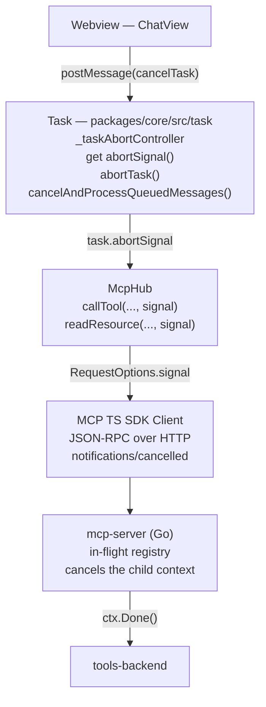
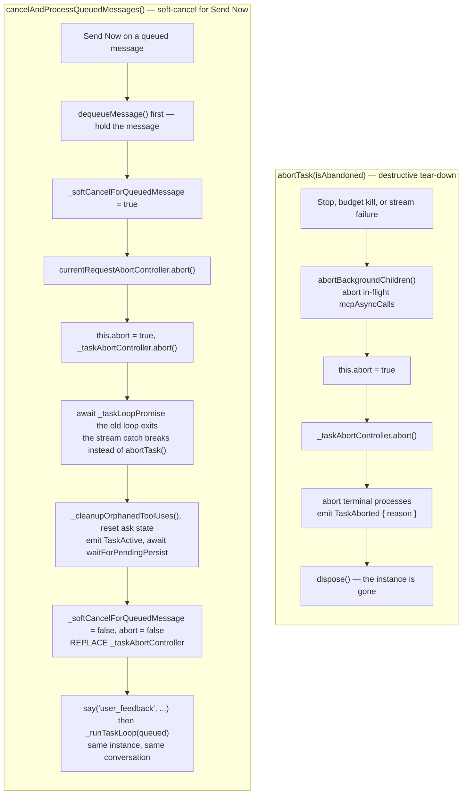
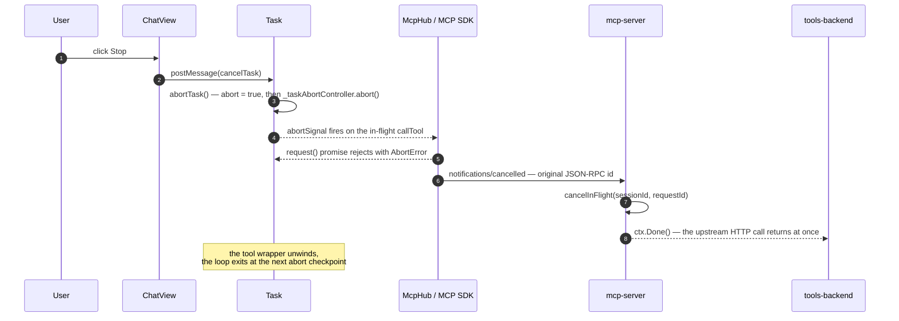

# Cancellation Flow

This document describes how a user-initiated **Stop** in the Shofer webview
propagates all the way down to the upstream tool execution, so that long-running
MCP tool calls and resource reads are aborted immediately instead of being left
to run until their server-side timeout expires.

## Goals

1. The **Stop** button must always be available while any work is happening on
   the user's behalf — including while an auto-approved MCP tool call is
   in flight.
2. Pressing **Stop** must abort the current activity _promptly_, without
   waiting for network/tool timeouts.
3. Cancellation must propagate end-to-end: webview → extension Task → MCP
   client (`@modelcontextprotocol/sdk`) → `mcp-server` → `tools-backend`.

## Components and responsibilities



### 1. Webview — [`ChatView.tsx`](../webview-ui/src/components/chat/ChatView.tsx)

The Stop button visibility is driven by `canStop`, which previously inspected
only the local `shoferAsk` state. That left a gap: when an auto-approved tool
call (e.g. a long-running browser action) is executing, `shoferAsk` is `undefined`
but the Task is still actively working.

`canStop` was extended with a `currentTaskRuntimeState` lookup against
`parallelTasks`:

```ts
const currentTaskRuntimeState = useMemo(
	() => parallelTasks?.find((p) => p.id === currentTaskItem?.id)?.state,
	[parallelTasks, currentTaskItem?.id],
)

// Stop is also available whenever the task runtime reports it as "running",
// covering the auto-approved tool-execution window.
if (currentTaskRuntimeState?.lifecycle === "running") return true
```

This guarantees that **Stop is always visible while the agent is doing work**.

### 2. Task — [`Task.ts`](../packages/core/src/task/Task.ts)

`Task` owns a single `AbortController` whose `signal` lives for the whole task:

```ts
private _taskAbortController: AbortController = new AbortController()

public get abortSignal(): AbortSignal {
    return this._taskAbortController.signal
}
```

Two paths fire it:

- `abortTask()` — user clicked Stop and the task is being torn down. The
  controller is aborted _after_ `this.abort = true` so any synchronous
  observers see the boolean flag first.
- `cancelAndProcessQueuedMessages()` — user submitted a message while a tool
  was in flight. The controller is aborted to cancel the in-flight work, then
  **replaced with a fresh `AbortController`** before the loop is restarted, so
  subsequent tool calls get a live signal.

The two paths share the signal but **must never be conflated** (AGENTS.md,
"Dual Cancellation-Path Rule"): one destroys the Task, the other keeps it and
restarts it.



The ordering in the left column is an invariant: `this.abort = true` is set
**before** `_taskAbortController.abort()` so synchronous observers see the
boolean first. In the right column the flag is what stops the streaming catch
block from taking the left column's path.

The signal is exposed to tool implementations via `task.abortSignal`.

### 3. Tool call sites

The two MCP tool classes thread the signal differently — note the indirection
for `callTool` (see the "MCP Call-Site Indirection Rule" in `AGENTS.md`):

- **Tool calls** go through the shared helper
  [`runMcpToolCall`](../packages/core/src/tools/mcp/use-mcp-shared.ts:232), **not** the tool
  classes directly. `UseMcpToolTool.ts` and `CallMcpToolAsyncTool.ts` both delegate
  to it, and it is where the signal is actually passed:
  `mcpHub.callTool(serverName, toolName, args, source, task.taskId, signal ?? task.abortSignal)`.
  A reader sent to `UseMcpToolTool.ts` will find no direct `mcpHub.callTool` there.
- **Resource reads** are called directly in
  [`accessMcpResourceTool.ts`](../packages/core/src/tools/accessMcpResourceTool.ts:56):
  `mcpHub.readResource(server, uri, undefined, task.abortSignal)`.

### 4. McpHub — [`McpHub.ts`](../src/services/mcp/McpHub.ts)

Both `callTool` and `readResource` accept an optional
`signal?: AbortSignal` and forward it to the MCP SDK as part of
`RequestOptions`:

```ts
await connection.client.request(
	{ method: "tools/call", params: { name, arguments: toolArguments } },
	CallToolResultSchema,
	{ timeout, signal },
)
```

When `signal` aborts, the SDK:

1. Rejects the local `request()` promise with an `AbortError`.
2. Sends a `notifications/cancelled` JSON-RPC message to the server with the
   original request id, per the MCP spec.

### 5. mcp-server — [`mcp.go`](../../../mcp-server/internal/handlers/mcp.go)

The Go server keeps an **in-flight request registry** keyed by
`(sessionId, requestId)`:

```go
inFlightMu sync.Mutex
inFlight   map[string]map[string]context.CancelFunc
```

Helpers:

- `requestIDKey(id)` — normalizes JSON-RPC ids (numbers arrive as `float64`)
  to a stable string key, so the cancellation lookup matches regardless of
  the wire encoding.
- `registerInFlight(parent, sessionId, requestId)` — derives a cancellable
  child context, stores its `CancelFunc`, returns the context plus a `cleanup`
  closure that removes the entry on completion.
- `cancelInFlight(sessionId, requestId)` — fires the matching cancel function
  if present.

`handleToolCall` and `handleResourcesRead` register themselves before calling
into `tools-backend`, defer the cleanup, and treat `context.Canceled`
distinctly so a client-initiated abort is not surfaced as a 5xx in metrics:

```go
ctx, cleanup := h.registerInFlight(c.Request.Context(), mcpSessionId, req.ID)
defer cleanup()
result, err := h.backendClient.CallTool(ctx, ...)
if err != nil {
    if ctx.Err() == context.Canceled { /* log + structured cancel response */ }
    ...
}
```

`handleCancelledNotification` no longer just logs — it invokes
`cancelInFlight`, which propagates the cancel into the upstream
`http.NewRequestWithContext` call and short-circuits the wait.

A late `notifications/cancelled` for an already-completed request is a
harmless no-op because `cleanup` has removed the entry.

## End-to-end sequence (Stop during an MCP tool call)

1. User clicks **Stop** in the webview.
2. `ChatView` posts `cancelTask` to the extension host.
3. `Task.abortTask()` runs:
    - Sets `this.abort = true`.
    - Calls `_taskAbortController.abort()`.
4. The `AbortSignal` previously passed into `mcpHub.callTool(...)` fires.
5. The MCP SDK:
    - Rejects the awaited `client.request(...)` promise locally.
    - Emits `notifications/cancelled` over the HTTP transport with the original
      JSON-RPC id.
6. `mcp-server` receives the notification, looks up the registered cancel
   function for `(sessionId, requestId)`, and fires it.
7. The cancelled `context.Context` propagates into the in-flight HTTP call to
   `tools-backend`, which returns immediately.
8. The Task's tool wrapper observes the rejected promise and unwinds; the loop
   exits at the next abort checkpoint.



## Gaps and Known Issues

### 1. Tool call site indirection — ✅ resolved

§3 now documents the indirection: `callTool` is threaded by the shared
[`runMcpToolCall`](../packages/core/src/tools/mcp/use-mcp-shared.ts:232) helper (which
`UseMcpToolTool` and `CallMcpToolAsyncTool` delegate to), while `readResource` is
called directly in `accessMcpResourceTool.ts`.

### 2. Async MCP tool calls (`call_mcp_tool_async`) not covered

The cancellation flow diagram and end-to-end sequence only cover synchronous MCP
tool calls through `mcpHub.callTool()`. However, `Task.abortTask()` at
[`Task.ts:2887-2901`](../packages/core/src/task/Task.ts:2887) also handles async MCP tool
calls (`mcpAsyncCalls`) with per-call `AbortController` instances, capturing
cancellation telemetry via `captureMcpAsyncCallCancelled`. This path is not documented.

### 3. `_softCancelForQueuedMessage` not mentioned

The doc describes `cancelAndProcessQueuedMessages` replacing the abort controller
but does not mention the `_softCancelForQueuedMessage` flag. When the streaming
catch block detects this flag, it `break`s out of the loop instead of calling
`abortTask()` -- preserving the Task instance for restart. Without this detail,
the mechanism that prevents the task from being destroyed during Send Now is opaque.

### 4. Only MCP-layer cancellation is detailed

The cancellation flow is scoped to MCP tool calls. The same `task.abortSignal`
is also relevant for LLM API calls (via `currentRequestAbortController` at
[`Task.ts:5356`](../packages/core/src/task/Task.ts:5356)) and other long-running operations
subscribed to the signal. The doc does not mention these.

### 5. End-to-end sequence only describes Stop, not Send Now

The end-to-end sequence (§"End-to-end sequence") covers only the user-clicked-Stop
path. The Send Now path (`cancelAndProcessQueuedMessages`) uses the same abort
signal but follows a different flow: soft-cancel → abort controller → replace
controller → restart loop. A parallel sequence diagram for Send Now would be useful.

## Testing notes

- Manual: trigger any slow MCP tool (e.g. a `browser_*` action with a
  long-running page), click **Stop**, and verify in `mcp-server` logs that you
  see `Cancellation notification processed cancelled=true` followed by
  `Tool call cancelled by client`. The HTTP request to `tools-backend` should
  terminate immediately rather than at its server-side timeout.
- Regression: pressing Stop while idle, or after the tool has already
  returned, must not produce errors and must log
  `cancelled=false` on the server.
