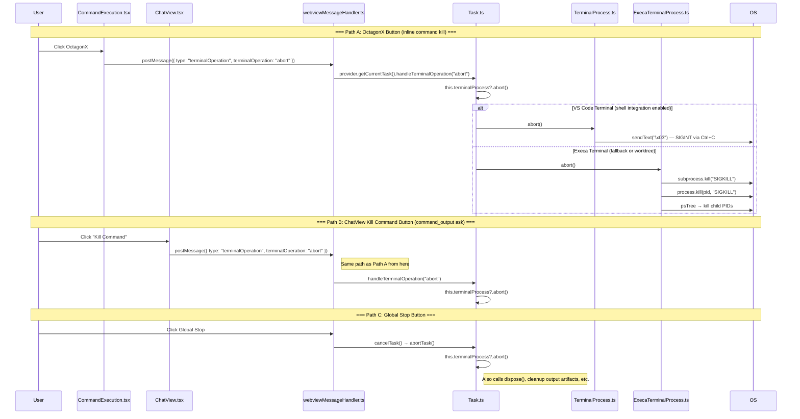

# Command Termination (User-Initiated Kill via UI X Button)

Design for the user-initiated terminate/kill of a running command from the chat UI. **The feature is already implemented.** This document captures the existing architecture, data flow, and identifies areas for improvement.

---

## 1. User-Visible Behavior

When a command is running (status `"started"`), the [`CommandExecution`](webview-ui/src/components/chat/CommandExecution.tsx) component renders an **OctagonX** icon button (from `lucide-react` — a stop-sign octagon with an X) next to the process PID:

```tsx
// CommandExecution.tsx:170-186
{
	status?.status === "started" && (
		<div className="flex flex-row items-center gap-2 font-mono text-xs">
			{status.pid && <div className="whitespace-nowrap">(PID: {status.pid})</div>}
			<StandardTooltip content={t("chat:commandExecution.abort")}>
				<Button
					variant="ghost"
					size="icon"
					onClick={() =>
						vscode.postMessage({
							type: "terminalOperation",
							terminalOperation: "abort",
						})
					}>
					<OctagonX className="size-4" />
				</Button>
			</StandardTooltip>
		</div>
	)
}
```

The tooltip reads "Abort" (i18n key `chat:commandExecution.abort`). On click, the button sends a `terminalOperation: "abort"` IPC message to the extension host. This is the **exact same IPC path** used by the "Kill Command" secondary button in [`ChatView`](webview-ui/src/components/chat/ChatView.tsx:1304-1305) for the `command_output` ask flow.

---

## 2. Data Flow Diagram



---

## 3. IPC Message Contract

### 3.1 Webview → Host: `terminalOperation`

```typescript
// WebviewMessage type (from @shofer/types)
{
	type: "terminalOperation"
	terminalOperation: "abort" | "continue"
}
```

The `"abort"` operation kills the running command. The `"continue"` operation (used by the "Proceed While Running" button during `command_output` asks) backgrounds the process so the agent can monitor it.

### 3.2 Routing

| Step                 | File                                                                           | Lines                       | Role                                                   |
| -------------------- | ------------------------------------------------------------------------------ | --------------------------- | ------------------------------------------------------ |
| Button click         | [`CommandExecution.tsx`](webview-ui/src/components/chat/CommandExecution.tsx)  | 170-186                     | Posts `terminalOperation: "abort"`                     |
| ChatView Kill button | [`ChatView.tsx`](webview-ui/src/components/chat/ChatView.tsx)                  | 1304-1305                   | Posts `terminalOperation: "abort"` on secondary button |
| IPC handler          | [`webviewMessageHandler.ts`](src/core/webview/webviewMessageHandler.ts)        | 1008-1011                   | Routes to `task.handleTerminalOperation()`             |
| Task dispatch        | [`Task.ts`](src/core/task/Task.ts)                                             | `handleTerminalOperation()` | Calls `terminalProcess?.abort()`                       |
| VS Code kill         | [`TerminalProcess.ts`](src/integrations/terminal/TerminalProcess.ts)           | 259-263                     | Sends `\x03` (Ctrl+C) via `terminal.sendText()`        |
| Execa kill           | [`ExecaTerminalProcess.ts`](src/integrations/terminal/ExecaTerminalProcess.ts) | 163-221                     | `SIGKILL` on subprocess + stored PID + `psTree`        |

---

## 4. Kill Mechanisms by Backend

### 4.1 VS Code Terminal (Shell Integration)

```typescript
// TerminalProcess.ts:259-263
public override abort() {
    if (this.isListening) {
        // Send SIGINT using CTRL+C
        this.terminal.terminal.sendText("\x03")
    }
}
```

The `\x03` byte is the ASCII control character for Ctrl+C, which sends `SIGINT` to the foreground process group. This is a **best-effort** kill — if the process traps or ignores `SIGINT`, the command will continue running after the button is clicked. The guard `this.isListening` prevents sending Ctrl+C to a terminal that has no active process.

After Ctrl+C is sent, the VS Code terminal shell integration catches the shell execution end event via [`TerminalRegistry.onDidEndTerminalShellExecution`](src/integrations/terminal/TerminalRegistry.ts:77). The `ExitCodeDetails` are interpreted (signals detected from exit codes > 128, e.g., 130 = killed by SIGINT) by [`BaseTerminalProcess.interpretExitCode`](src/integrations/terminal/BaseTerminalProcess.ts:16).

### 4.2 Execa Terminal (Fallback / Worktree Tasks)

```typescript
// ExecaTerminalProcess.ts:163-221
public override abort() {
    this.aborted = true

    const performKill = () => {
        // 1. Kill the Node.js subprocess object
        if (this.subprocess) {
            try { this.subprocess.kill("SIGKILL") } catch (e) { ... }
        }

        // 2. Kill the stored PID (shell process)
        if (this.pid) {
            try { process.kill(this.pid, "SIGKILL") } catch (e) { ... }
        }
    }

    // If PID update is in progress, wait for it before killing
    if (this.pidUpdatePromise) {
        this.pidUpdatePromise.then(performKill).catch(() => performKill())
    } else {
        performKill()
    }

    // 3. Kill the entire process tree to catch orphans
    if (this.pid) {
        psTree(this.pid, async (err, children) => {
            if (!err) {
                for (const child of children) {
                    try { process.kill(parseInt(child.PID), "SIGKILL") } catch (e) { ... }
                }
            }
        })
    }
}
```

The execa backend uses `SIGKILL` (which cannot be caught, blocked, or ignored by the process) and walks the process tree via `psTree` to kill all child processes. The `pidUpdatePromise` guard ensures the PID is resolved before attempting to kill (the execa process initially reports the wrapper shell PID, then updates to the child command's PID).

### 4.3 Global Stop Button (Task-Level Abort)

When the user clicks the global **Stop** button, the flow is:

1. [`ShoferProvider.cancelTask()`](src/core/webview/ShoferProvider.ts) → `cancelAndProcessQueuedMessages()`
2. If the task is running, calls [`task.abortTask()`](src/core/task/Task.ts) which includes:
    ```typescript
    this.terminalProcess?.abort()
    ```
3. Then `TerminalRegistry.releaseTerminalsForTask()` disassociates the terminal from the task
4. `OutputInterceptor.cleanup()` deletes command output artifacts

This is a more comprehensive cleanup — it not only kills the process but also releases terminal resources and cleans up artifacts. The per-command OctagonX and Kill Command buttons **only kill the process** without releasing terminal resources (this is by design, as the agent may re-run commands or inspect output in the same terminal).

---

## 5. UI State on Abort

When a command is killed, three things happen:

1. **The OctagonX button disappears** — `CommandExecution.tsx:170` only renders the button when `status?.status === "started"`. Once the process is killed, the shell execution end event fires, and the status transitions to `"exited"` with the signal exit code. The button is no longer rendered.

2. **The exit status dot appears** — `CommandExecution.tsx:154` renders a colored dot (green for exit code 0, red otherwise) next to the title when `status?.status === "exited"`.

3. **"Killed" badge for user kills** — When the user kills a command via the Abort/Kill Command button, `onShellExecutionComplete` emits the `"terminated"` status and `CommandExecution.tsx` renders a distinct red **"Killed"** badge (`data-testid="command-terminated-badge"`) in place of the exit dot, with a tooltip carrying the signal exit code (e.g., `137` for SIGKILL). A natural failure still shows the red exit dot, so the two are visually distinct.

### Current Status Values in `CommandExecutionStatus`

From [`packages/types/src/terminal.ts`](packages/types/src/terminal.ts):7-32:

| Status         | Meaning                                               | When Emitted                                                                               |
| -------------- | ----------------------------------------------------- | ------------------------------------------------------------------------------------------ |
| `"started"`    | Command has begun executing                           | `onShellExecutionStarted` callback (shows PID and OctagonX)                                |
| `"output"`     | New output received                                   | `onLine` callback (streamed to `TerminalOutput`)                                           |
| `"exited"`     | Command finished naturally or by signal               | `onShellExecutionComplete` callback (shows exit dot)                                       |
| `"terminated"` | **User-initiated kill** (Abort / Kill Command button) | `onShellExecutionComplete` when `task.userTerminatedCommand` is set (shows "Killed" badge) |
| `"fallback"`   | Shell integration error, retrying with execa          | Middle of `ExecuteCommandTool.execute()` catch block                                       |
| `"timeout"`    | Killed by user-configured timeout                     | User timeout path in `executeCommandInTerminal`                                            |

The `"terminated"` status distinguishes user-initiated kills (the inline Abort/Kill
Command button) from natural exits and from user timeouts. It is emitted by
`onShellExecutionComplete` when [`Task.userTerminatedCommand`](src/core/task/Task.ts)
is set — a flag raised by `handleTerminalOperation("abort")` and cleared when the
next command starts or completes. The user-timeout path aborts the process
directly (not via `handleTerminalOperation`), so it keeps its own `"timeout"`
status.

---

## 6. Comparison: Three Kill Entry Points

| Entry Point                                  | Kills Process? | Releases Terminal? | Cleans Artifacts? | UI Feedback                     |
| -------------------------------------------- | :------------: | :----------------: | :---------------: | ------------------------------- |
| **OctagonX button** (per-command)            |       ✅       |         ❌         |        ❌         | Exit dot shows signal exit code |
| **Kill Command button** (command_output ask) |       ✅       |         ❌         |        ❌         | Same path as OctagonX           |
| **Global Stop button**                       |       ✅       |         ✅         |        ✅         | Task stops, terminal released   |
| **User timeout** (commandExecutionTimeout)   |       ✅       |         ❌         |        ❌         | `"timeout"` status emitted      |

---

## 7. Identified Gaps & Improvement Opportunities

### 7.1 "Terminated by User" Status Distinction — ✅ Implemented

A `"terminated"` variant was added to `CommandExecutionStatus` (`commandExecutionStatusSchema`). `Task.handleTerminalOperation("abort")` sets `Task.userTerminatedCommand`; `onShellExecutionComplete` reads that flag and emits `"terminated"` (carrying the signal exit code) instead of `"exited"`, then clears it (also cleared on the next `onShellExecutionStarted`). `CommandExecution.tsx` renders a red **"Killed"** badge for `"terminated"`. The user-timeout path is unaffected (it aborts directly and keeps `"timeout"`). Covered by `CommandExecution.spec.tsx` (see §8).

### 7.2 SIGINT is Best-Effort on VS Code Terminal

**Current state:** The VS Code terminal path sends `\x03` (Ctrl+C), which delivers `SIGINT` to the foreground process group. A process that traps or ignores `SIGINT` will **not die**. The user sees the button disappear (the `shellExecutionComplete` event fires when the shell itself continues after the foreground process ignores the signal), but the command may still be running.

**Improvement:** For the VS Code path, consider a fallback: if `shellExecutionComplete` fires with no exit code or an exit code indicating the process is still alive, send a follow-up `\x03\x03` or send `Ctrl+Z` followed by `kill %1`. Alternatively, force-kill the terminal entirely via `terminal.dispose()` as a last resort.

### 7.3 Per-Command Kill Button is Missing When Command is Backgrounded

**Current state:** The OctagonX button in `CommandExecution.tsx` only appears when `status?.status === "started"`. Once the agent timeout fires and the process is backgrounded (`process.continue()` is called), the `"started"` status may still be set, but the `"output"` status overrides it. In background mode, the user has no way to kill the command from the command block itself — they must use the global Stop button.

**Improvement:** Show a "Kill" button for backgrounded processes too (when the command is still running but the agent has moved on). This would require the host to track whether a process is still alive and communicate that state to the webview.

### 7.4 No Confirmation Before Kill

**Current state:** Clicking the OctagonX immediately sends the abort without confirmation. This is consistent with the "Kill Command" button behavior, but a misclick could terminate a long-running command (e.g., `npm install`).

**Improvement:** Consider a confirmation dialog for non-interactive/backgrounded commands, or make the kill undoable for a short window (e.g., 2 seconds with a "Undo" snackbar). This is a product decision, not an architectural one.

---

## 8. Test Plan

### 8.1 Unit Tests

| Test                                                                      | File                           | What It Covers             | Status     |
| ------------------------------------------------------------------------- | ------------------------------ | -------------------------- | ---------- |
| Kill button renders + posts `terminalOperation:"abort"` while `"started"` | `CommandExecution.spec.tsx`    | UI rendering + IPC message | ✅         |
| Kill button hides after status → `"exited"`                               | `CommandExecution.spec.tsx`    | UI state cleanup           | ✅         |
| `"terminated"` status renders the "Killed" badge (and no kill button)     | `CommandExecution.spec.tsx`    | §7.1 indicator             | ✅         |
| Status pushes for a different `executionId` are ignored                   | `CommandExecution.spec.tsx`    | Per-command scoping        | ✅         |
| `handleTerminalOperation("abort")` calls `terminalProcess?.abort()`       | `Task.test.ts`                 | Task-level dispatch        | ☐ proposed |
| `TerminalProcess.abort()` sends `\x03` when listening                     | `TerminalProcess.spec.ts`      | VS Code kill path          | ☐ proposed |
| `ExecaTerminalProcess.abort()` kills subprocess + process tree            | `ExecaTerminalProcess.spec.ts` | Execa kill path            | ☐ proposed |

### 8.2 Integration Tests (proposed)

| Test                                                        | What It Covers            |
| ----------------------------------------------------------- | ------------------------- |
| Full flow: user clicks OctagonX → process exits with signal | End-to-end kill via UI    |
| Kill during background mode → process terminates            | Backgrounded process kill |
| Kill with shell integration disabled → execa path used      | Backend fallback test     |
| Kill after user timeout already fired → graceful no-op      | Race condition handling   |

---

## 9. Related Documentation

- [`command-execution.md`](command-execution.md) — Full command execution lifecycle
- [`cancellation.md`](cancellation.md) — Global Stop button propagation
- [`task_states.md`](task_states.md) — Task lifecycle states (including `aborted`)

---

## 10. Key Files

| File                                                                                   | Role                                                                                        |
| -------------------------------------------------------------------------------------- | ------------------------------------------------------------------------------------------- |
| [`CommandExecution.tsx`](webview-ui/src/components/chat/CommandExecution.tsx:170-186)  | OctagonX button + click handler                                                             |
| [`ChatView.tsx`](webview-ui/src/components/chat/ChatView.tsx:1304-1305)                | Kill Command button during `command_output` ask                                             |
| [`webviewMessageHandler.ts`](src/core/webview/webviewMessageHandler.ts:1008-1011)      | IPC routing for `terminalOperation`                                                         |
| [`Task.ts`](src/core/task/Task.ts)                                                     | `handleTerminalOperation()` dispatch + `abortTask()` — both call `terminalProcess?.abort()` |
| [`TerminalProcess.ts`](src/integrations/terminal/TerminalProcess.ts:259-263)           | VS Code SIGINT kill (`\x03`)                                                                |
| [`ExecaTerminalProcess.ts`](src/integrations/terminal/ExecaTerminalProcess.ts:163-221) | Execa SIGKILL + process tree kill                                                           |
| [`TerminalRegistry.ts`](src/integrations/terminal/TerminalRegistry.ts:77-119)          | Shell execution end event → exit code interpretation                                        |
| [`packages/types/src/terminal.ts`](packages/types/src/terminal.ts:7-32)                | `CommandExecutionStatus` discriminated union schema                                         |
| [`BaseTerminalProcess.ts`](src/integrations/terminal/BaseTerminalProcess.ts:16)        | `interpretExitCode()` maps exit codes to signals                                            |
