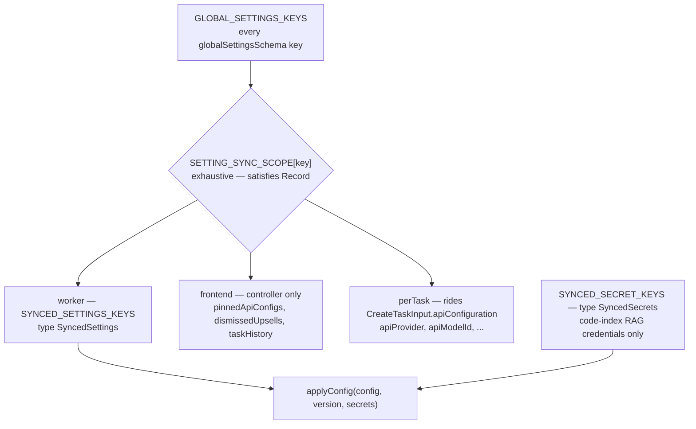
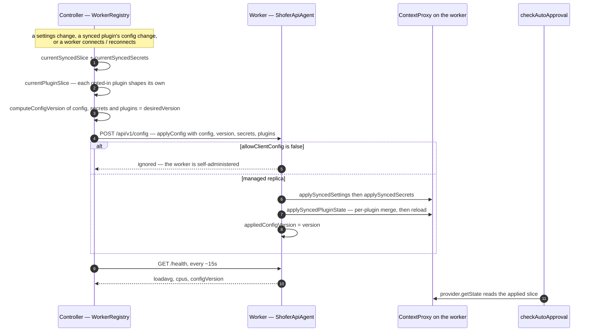
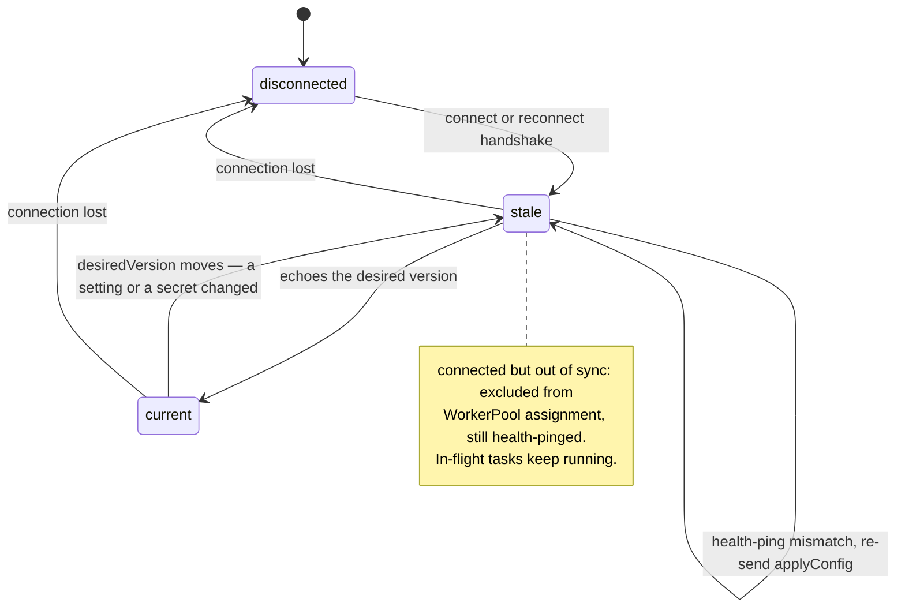

# Controller → Worker Configuration Sync

**Related:** [`v3_architecture.md`](v3_architecture.md), [`settings_overlay.md`](settings_overlay.md), [`agentapi.md`](agentapi.md), [`headless.md`](headless.md), [`plugin_system.md`](plugin_system.md), [`outside-workspace-path-allowlist.md`](outside-workspace-path-allowlist.md) (a consumer)

---

## 1. What this solves

In the [Shofer Workers](v3_architecture.md#distributed-execution-horizontal-scaling) model, a
task can run on a **remote executor** (`shofer serve` on another host). The agent core —
including every decision that reads settings — runs **on that executor**, not on the
controller's VS Code front-end, and a worker serves everything else executor-locally: its
filesystem, its terminal, its own state.

Configuration cannot work that way, because the settings that matter are the ones the user
sets in the controller's UI:

- **Auto-approval** (`checkAutoApproval`, `@shofer/core`) reads `provider.getState()` on the
  executor. Without replication, a path or command the user trusts in the controller's
  Settings UI is invisible to a remote worker, which re-prompts (RPC an ask back to the
  controller) or diverges from what the user asked for.
- Every other node-scoped setting the front-end owns (context-management thresholds,
  write-delay, followup timeout, disabled tools, …) would be stranded the same way.
- A plugin that owns a workspace-scoped resource has the same problem one level up: the
  bundled `rag-indexing` plugin must reach a worker with the controller's index identity and
  credentials, and as a **reader** ([§4b-2](#4b-2-the-plugin-half--syncedpluginstate)).

The narrow precedent this generalizes is **per-task provider config**:
`CreateTaskInput.apiConfiguration` ([`agent-api.ts`](../packages/types/src/agent-api.ts)),
applied by `ShoferApiAgent.createTask`
([`shofer-api-agent.ts`](../packages/core/src/transport/shofer-api-agent.ts)) so a task runs
on the provider/model the front-end picked. That is per-task; this channel is the
node-scoped, continuous equivalent.

The goal is a worker that requires **zero local administration**: the user (or an external
service) configures once, **on the controller**, and it propagates.

## 2. Goal & principle

**Controller-authoritative configuration; workers are replicas.**

- Configure trust/behavior **once on the controller**; it replicates to every node.
- **On registration** and **on every change** — so a worker is correct the moment it connects
  and stays correct as settings change mid-session (no restart, no node-side edit).
- **Generalize the existing `apiConfiguration` pattern** — same idea (controller-resolved
  state the executor must honor), lifted from _per-task provider config_ to _node-scoped
  settings replicated continuously_.
- **No new source of truth.** The controller's globalState (`globalSettingsSchema`) stays
  authoritative; this is a _transport_ that mirrors a slice of it onto workers.

Non-goals: syncing per-task provider config (that stays on `CreateTaskInput.apiConfiguration`
— it is per-task, not node-scoped); a bidirectional/merge model (workers never push settings
up); the future split-host `HostConfig`-over-RPC model ([§9](#9-relationship-to-other-mechanisms)).

## 3. What is synced (and what is not)

Two axes decide whether a setting belongs on this channel:

| Setting kind                                          | Channel                                                                            |
| ----------------------------------------------------- | ---------------------------------------------------------------------------------- |
| **Per-task** provider/model/key/base-url              | Stays on `CreateTaskInput.apiConfiguration` (already shipped; can differ per task) |
| **Node-scoped** behavior settings (auto-approval, …)  | **This channel** — one node-wide config, replicated on registration + on change    |
| **LLM provider keys**                                 | _Not_ on this channel — per-task via `apiConfiguration` (see below)                |
| **Code-index (RAG) credentials**                      | **This channel**, as the separate `SyncedSecrets` argument → SecretStorage         |
| **A plugin's config + credentials**                   | **This channel**, as the separate `SyncedPluginState` argument — opt-in per plugin |
| **Front-end-only** UI state (pinned tabs, dismissals) | Not synced (no executor effect)                                                    |

**In scope: the whole node-scoped `globalSettings` set** — _every_ `globalSettingsSchema`
field that changes how the agent core behaves on the executor, not just the auto-approval
ones. Concretely that includes:

- **Auto-approval** (the motivating consumer): `autoApprovalEnabled`,
  `alwaysAllowReadOnly`/`Write`/`Browser`/`Mcp`/`ModeSwitch`/`Subtasks`/`Execute`/`Uncategorized`,
  the modifier toggles (`alwaysAllow*OutsideWorkspace`, `alwaysAllowWriteProtected`),
  `allowedCommands`/`deniedCommands`, the
  [path allowlist](outside-workspace-path-allowlist.md) (`allowedReadPaths`/`allowedWritePaths`),
  `followupAutoApproveTimeoutMs`.
- **Behavioral limits & context management** — `allowedMaxRequests`, `allowedMaxCost`,
  `autoCondenseContext`, `autoCondenseContextPercent`, `writeDelayMs`,
  `consecutiveMistakeLimit`, `commandExecutionTimeout`/`commandTimeoutAllowlist`,
  `preventCompletionWithOpenTodos`, `disabledTools`, environment-detail toggles, …

The synced slice is a **positive allowlist** (`SyncedSettings`), not "all of `GlobalSettings`
minus exclusions" — a newly added setting is _not_ silently synced until it is classified,
safer than an implicit catch-all.

**Encode the scope in the schema so the classification is authored once and never re-done.**
Rather than a hand-maintained `Pick<GlobalSettings, …>` that drifts every time a setting is
added, annotate each key's scope **at the schema**, co-located with `globalSettingsSchema` in
[`global-settings.ts`](../packages/types/src/global-settings.ts), and **derive** the synced
key list + `SyncedSettings` type from it. This mirrors the file's existing key-classification
pattern (`GLOBAL_SETTINGS_KEYS = globalSettingsSchema.keyof().options`,
[`global-settings.ts:338`](../packages/types/src/global-settings.ts); the `SECRET_STATE_KEYS`
array + `isSecretStateKey` predicate, `:351`/`:399`). Concretely:

```ts
// Exhaustive over every globalSettings key — TS errors if a key is missing or misspelled,
// so adding a setting FORCES declaring its sync scope (no silent default, no future pass).
export const SETTING_SYNC_SCOPE = {
	autoApprovalEnabled: "worker",
	alwaysAllowWrite: "worker",
	allowedCommands: "worker",
	allowedReadPaths: "worker",
	allowedMaxCost: "worker",
	writeDelayMs: "worker" /* … */,
	pinnedApiConfigs: "frontend",
	dismissedUpsells: "frontend",
	taskHistory: "frontend",
	// per-task/provider selection is shipped via apiConfiguration, not this channel:
	apiProvider: "perTask",
	apiModelId: "perTask" /* … */,
} satisfies Record<(typeof GLOBAL_SETTINGS_KEYS)[number], "worker" | "frontend" | "perTask">

export const SYNCED_SETTINGS_KEYS = GLOBAL_SETTINGS_KEYS.filter((k) => SETTING_SYNC_SCOPE[k] === "worker")
export type SyncedSettings = Pick<GlobalSettings, (typeof SYNCED_SETTINGS_KEYS)[number]>
```

The `satisfies Record<…>` is the key move: it makes the map **exhaustive over the live
schema**, so the "classification pass" is a _compile-time obligation on whoever adds a
setting_, not a periodic manual audit. (Zod 3.25's `.meta()` could instead carry the scope on
each field; the co-located `satisfies` map is chosen to match the file's existing
array+predicate idiom and to keep the exhaustiveness guarantee obvious.)

**Classification rule (two-part test).** A key is `"worker"` iff **both**: (1) the behavior it
controls runs in `@shofer/core` on the executor — a fast proxy is "consumed under
`packages/core`" vs only `src/` (the controller); **and** (2) its value is host-portable — a
boolean/count/byte-cap/timeout, not a machine-specific path or a front-end-only integration.
Failing (1) → controller-only, `frontend` (e.g. `defaultCostLimit`, applied at task creation
on the controller — `allowedMaxCost` is the synced enforcement knob; `enableLlmProviderIntegration`,
a VS Code LM companion). Passing (1) but failing (2) → executor behavior but the worker must own
its own value, still excluded (e.g. `execaShellPath`, a host shell path). Two further
exclusions: a key already shipped per-task via `apiConfiguration` (`rateLimitSeconds` — also a
`ProviderSettings` field) is left out to avoid a double source; and `mcpEnabled` is **held**
(not synced): in the shipped shared-workspace-FS worker model the worker already has the mirrored
project `.shofer/mcp.json` and launches **stdio** servers node-locally, so it _self-determines_
MCP — syncing the global toggle is unnecessary and could override a locally-correct node. The
genuine cross-host gaps are narrow — the **global** `mcp_settings.json` (in globalStorage,
outside the workspace, so not mirrored) and **loopback/controller-hosted** HTTP servers a
remote worker can't reach — and both are out of config-sync's scope; revisit with remote-MCP
support. These calls are pinned by the `SETTING_SYNC_SCOPE` classification tests.

Both allow-lists, and where a key that is _not_ on them goes instead:



**Excluded** (per [the table above](#3-what-is-synced-and-what-is-not)): per-task provider
config (`apiConfiguration`) and front-end-only UI state (`pinnedApiConfigs`,
`dismissedUpsells`, `lastShownAnnouncementId`, task history) that has no executor effect.

**Secrets travel on their own allow-list, not in `SyncedSettings`.** Credentials are never
plaintext _settings_ — `SyncedSettings` carries none, and a secret key in that slice is a
bug. They ride the same `applyConfig` call as a separate `SyncedSecrets` argument, written
on the worker through `ContextProxy.storeSecret` (SecretStorage), never into globalState JSON.
The allow-list is deliberately narrow: only the code-index (RAG) credentials, because a
search-only worker must embed a query and authenticate to Qdrant, and both keys are secrets
rather than settings — so the synced index config would otherwise describe a store the worker
cannot open. **LLM provider keys are NOT on this channel**: they already reach a worker
per-task via `apiConfiguration` (resolved by the controller, gated by `allowClientConfig`),
and replicating them globally would create a second, unversioned source for the same
credential. Adding a key to `SYNCED_SECRET_KEYS` means the controller pushes it to every
managed worker — justify it before extending the list.

## 4. Design

Three thin additions, each mirroring an existing seam.

### 4a. `AgentApi.applyConfig` (the wire method)

One method on the transport-agnostic surface
([`AgentApi`](../packages/types/src/agent-api.ts)):

```ts
/** Node-scoped settings + secrets the controller replicates to this executor (§config_sync).
 *  A Partial<GlobalSettings> restricted to the synced allowlist; authoritative
 *  (last-write-wins) for the keys present. `version` is the controller-assigned,
 *  node-opaque token (a content hash of the canonical slice, §6) the worker stores
 *  and echoes back on /health so the controller can detect drift. `secrets` is the
 *  allow-listed credential slice the worker needs to act on `config` — `{}` when there
 *  is nothing to replicate. Both are ignored when the worker has local CLI overrides
 *  (allowClientConfig === false), same rule as apiConfiguration. */
applyConfig(
  config: SyncedSettings,
  version: string,
  secrets: SyncedSecrets,
  plugins?: SyncedPluginState,
): Promise<void>
```

`SyncedSettings` is a `Pick<GlobalSettings, …node-scoped keys…>` in `@shofer/types`
(vscode-free, so both sides share it) — the positive allowlist defined in
[§3](#3-what-is-synced-and-what-is-not) (auto-approval + behavioral/context-management keys),
not just the auto-approval subset. `SyncedSecrets` is its credential counterpart: a
`Partial<Record<SYNCED_SECRET_KEYS[number], string>>` over the code-index (RAG) credentials,
which are secrets rather than settings and so cannot ride in `SyncedSettings`. LLM provider
keys are deliberately NOT in it — they already travel per-task on
`CreateTaskInput.apiConfiguration`. Transport bindings follow the existing pattern exactly:

- **HTTP route** ([`http-server.ts`](../packages/core/src/transport/http-server.ts)):
  `POST /api/v1/config → { config, version, secrets, plugins } → 202` (token-authed like
  every `/api/v1/*` route; an absent `secrets` defaults to `{}`, an absent `plugins` means
  "no plugin state to apply").
- **Client** ([`http-client.ts`](../packages/core/src/transport/http-client.ts)):
  `applyConfig(config, version, secrets, plugins) → this.post("/config", { … })`.

Because `ShoferHttpClient implements AgentApi`, adding the method to the interface makes
client/server drift a compile error (the property the doc-comment at
[`http-client.ts:17`](../packages/core/src/transport/http-client.ts) relies on).

### 4b. Worker side — apply to local state

`ShoferApiAgent.applyConfig`
([`shofer-api-agent.ts`](../packages/core/src/transport/shofer-api-agent.ts)) writes the
slice into the worker's in-process settings so the very next `provider.getState()` (and thus
`checkAutoApproval`) sees it:

```ts
async applyConfig(config, version, secrets, plugins?): Promise<void> {
  if (!this.options.allowClientConfig) return   // worker CLI override wins — ignore, like apiConfiguration
  await this.api.applySyncedSettings(config)     // → ContextProxy.setValues(slice) on the worker
  await this.api.applySyncedSecrets(secrets)     // → ContextProxy.storeSecret per allow-listed key
  if (plugins) await this.api.applySyncedPluginState(plugins)  // → per-plugin merge + reload
  this.appliedConfigVersion = version            // opaque; echoed on /health (§6) so the controller sees convergence
}
```

Credentials are written after the settings they belong to, so a worker never briefly holds a
store/embedder config it has no key for. `applySyncedSecrets` iterates `SYNCED_SECRET_KEYS`
rather than the payload's own keys — the slice arrives as untrusted JSON off the wire, so
driving the loop from the allow-list is what stops a controller writing a secret outside the
synced scope. A key the controller omits is left untouched, not cleared.

Reuse the **same `allowClientConfig` gate** that already governs `apiConfiguration`
([`shofer-api-agent.ts:14`](../packages/core/src/transport/shofer-api-agent.ts)): a worker
started with explicit CLI config is self-administered and ignores controller pushes; a
"managed" worker (no overrides) is a pure replica. **For a `shofer serve` worker the gate
defaults open** (accept controller config) — see [§10](#10-decisions--open-questions); it
flips closed only when the operator supplies explicit local config, so the zero-node-admin
replica is the default and self-administration is the opt-out. The node-side apply is a `ContextProxy.setValues`
of the slice (the same write path `importConfiguration` uses,
[`settings_overlay.md` §10c](settings_overlay.md)), **not** a full import (no provider
profiles; the only secrets written are the `SYNCED_SECRET_KEYS` allow-list).

### 4b-2. The plugin half — `SyncedPluginState`

A plugin's settings are host-local by default, which is right for anything describing THIS
machine and wrong for a plugin whose feature actually **runs on the executor**: the bundled
codebase indexer asked to answer a search there needs its embedder settings and its store
credentials, and neither is in `globalSettingsSchema`.

So a manifest may declare **`"syncConfig": true`**, and the controller then sends that
plugin's config and its `secret` properties as
`SyncedPluginState = Record<pluginName, { config?, secrets? }>`:

- **Opt-in, per plugin.** Nothing is synced for a plugin that does not ask. The set is not a
  host allow-list, because the host has no way to know which of a third-party plugin's
  settings describe the machine it is on.
- **The plugin shapes its own slice.** Before sending, the controller asks each opted-in
  plugin the `"node-config"` request with its stored config+secrets; whatever it returns is
  what goes on the wire. That is the seam that lets a plugin pin a worker to a different mode
  of itself — the indexer's "workers are search-only, against the collection I resolved" —
  instead of the host encoding a feature's semantics on its behalf. A plugin that does not
  answer sends its stored values unchanged.
- **Merged on the worker, never replaced** ([`applySyncedPluginState`](../src/extension/api.ts)):
  per plugin, and per key within it. A worker may hold local config for plugins the controller
  does not sync at all, and replacing the whole map would erase it — the same reasoning that
  makes `applySyncedSecrets` leave an omitted key alone. Touched plugins are then reloaded so
  `ctx.config` is live without a restart.
- **Hashed into the version** (§6), so a change that touches only a plugin's own config still
  moves the version and converges. Without that, a rotated embedder key would sit unnoticed:
  nothing in the settings slice moved.

### 4c. Controller side — push on registration + on change

`WorkerRegistry` ([`src/core/workers/WorkerRegistry.ts`](../src/core/workers/WorkerRegistry.ts)) already
owns the connection lifecycle (`connections` map, each `WorkerConnection` exposing `.api` when
`connected`, [`WorkerRegistry.ts:140`](../src/core/workers/WorkerRegistry.ts)) and the load-balancer
config subscription ([`WorkerRegistry.ts:213`](../src/core/workers/WorkerRegistry.ts)). Two hooks:

- **On registration** — when a worker transitions to `connected` (its handshake completes,
  [`worker-connection.ts`](../packages/core/src/transport/worker-connection.ts)), push the current
  slice: `conn.api.applyConfig(resolveSyncedSettings())`. Do the same on **reconnect** (state
  on the worker may be stale or a fresh process).
- **On change** — subscribe to controller settings mutations and **broadcast** the new slice
  to every `connected` connection. The triggers are the existing write points:

    - Settings panel save (`updateSettings`),
    - the interactive **“approve this path / command”** grant (which already posts
      `updateSettings`),
    - auto-import / `importConfiguration`.

    Hook the broadcast to the controller's post-mutation signal (the same
    `ContextProxy`/`postStateToWebview` beat that refreshes the webview), filtered to the synced
    keys so unrelated state changes don't spam workers.

`resolveSyncedSettings()` reads the authoritative controller state (mirrors how the webview
resolves `apiConfiguration` before `pool.createTaskOn(owner, { apiConfiguration })`,
[`WorkerRegistry.ts:311`](../src/core/workers/WorkerRegistry.ts)) and projects it to the slice.

### 4d. Flow



## 5. Semantics

- **Authoritative, last-write-wins** for the keys present in a payload. Every push carries
  the full slice (small, simple, idempotent); diffing is a possible later optimization.
- **Node-override precedence.** `allowClientConfig === false` (worker launched with CLI
  provider/model/key/base-url overrides) ⇒ the worker ignores pushes entirely, consistent with
  `apiConfiguration`. (Whether _settings_ overrides should be independent of _provider_
  overrides is a decided trade-off, not an open one — [§10](#10-decisions--open-questions).)
- **Union with local grants?** No. Unlike the [path-allowlist doc's](outside-workspace-path-allowlist.md)
  intra-controller union of config + interactive grants, the _controller→node_ relationship
  is **replace**: the worker mirrors the controller's resolved state. A managed worker has no
  independent grants to preserve (interactive approvals on a worker RPC back to the controller,
  which then re-broadcasts).
- **Version-locked.** Same guarantee as the whole session transport
  ([`v3_architecture.md`](v3_architecture.md#two-seams--and-why-category-i-pays-off-here)):
  a controller only drives a worker on the exact same build (the `whoami` version check,
  [`worker-connection.ts:197`](../packages/core/src/transport/worker-connection.ts)), so
  `SyncedSettings` shape can't skew across versions.

## 6. Convergence — config version & pool gating

Fire-and-forget is not enough: a push can fail for one worker while succeeding for others, and
a just-connected or reconnected worker may hold stale config. The model is a **controller-driven
convergence loop keyed on a config version**, so that **no task is ever routed to a worker
running stale config**, yet a lagging worker self-heals without manual intervention.

**The version.** The controller computes
`desiredVersion = hash(canonicalSerialize({ config, secrets }))` — a **content hash**, not a
monotonic counter. Content-addressing makes it stateless (survives a controller restart with
no drift), idempotent (identical content ⇒ identical version ⇒ no spurious churn), and
**opaque to the worker**: it travels _with_ the config
(`applyConfig(config, version, secrets)`, [§4a](#4a-agentapiapplyconfig-the-wire-method)), and
the worker merely stores and echoes it — the two sides never need matching hash logic.

The **secrets participate in the hash**. Hashing the settings slice alone would leave a
rotated credential invisible to the convergence loop: the settings never changed, so the
version never moves, so the reconciliation never re-pushes and the worker holds the stale key
indefinitely. Note the consequence for `/health`, below.

**Reporting (piggybacked on the health ping).** The worker echoes its last-applied version on
the `GET /health` body, which already carries `loadavg`/`cpus` and is parsed every ~15 s by
`WorkerConnection.ping()` ([`worker-connection.ts`](../packages/core/src/transport/worker-connection.ts)).
`configVersion` rides alongside the load sample, so the controller learns each worker's applied
version **for free**, on a channel that already exists (and again on the `whoami` handshake
for the connect-time read); it surfaces as `conn.configVersion`.

**Three worker states** — connectedness alone does not decide eligibility:

| State                     | Connected? | Takes a new task?                                                  |
| ------------------------- | ---------- | ------------------------------------------------------------------ |
| `disconnected`            | no         | no — not in the pool at all                                        |
| **`connected` but stale** | yes        | **no** — in the pool, but skipped until it echoes `desiredVersion` |
| `connected` and current   | yes        | yes                                                                |



**Where the gate lives.** Membership and eligibility are separate. `WorkerRegistry` adds a worker
to the pool on connectedness alone (`status === "connected" && !!conn.api && !disabled`,
[`WorkerRegistry.ts`](../src/core/workers/WorkerRegistry.ts)); the version gate is evaluated
**per assignment** inside `WorkerPool`, which holds `setDesiredConfigVersion(version)` and
reads each executor's live `configVersion()` in `configMatches()`
([`worker-pool.ts`](../packages/types/src/worker-pool.ts)). A stale worker therefore stays
in the pool, connected and health-pinged, but takes no _new_ task — **recoverable**, and
in-flight tasks are untouched. Two escapes are deliberate: no desired version yet (gating
off), and an executor reporting `managed() === false` — a self-administered worker (and the
Local in-process executor, which reads controller state directly) is exempt rather than
permanently stale.

**The loop.**

- **On any settings change** — the controller recomputes `desiredVersion`, broadcasts
  `applyConfig(slice, desiredVersion, secrets, plugins)` to all connected workers, and passes
  the new desired version to the pool, which skips any worker whose reported version ≠
  `desiredVersion` until it converges.
- **On a synced plugin's config change** — the same loop. The plugin slice is rebuilt
  asynchronously (each plugin shapes its own) and compared by value first, so a plugin
  reload that produces an identical slice does not bump the version and make every worker
  re-apply the same payload.
- **On each health ping** — the controller compares reported vs desired; on mismatch it
  **re-sends** `applyConfig` (idempotent) and the worker keeps taking no new work. This is the
  self-heal path for a worker whose earlier push failed.
- **On (re)connect** — `WorkerConnection` re-probes with backoff and re-enters `connected`
  ([`worker-connection.ts`](../packages/core/src/transport/worker-connection.ts)); it reports its
  (stale) version, gets pushed, converges, and only then becomes assignable again.

**This subsumes the connect-time race** (the former "gate the first task on the first ack"
question): version-match gating covers connect, reconnect, and mid-session change with one
uniform rule — no defaults window, no special first-task case.

**In-flight tasks are not killed.** The gate means _no new assignment_; a task already
running on a now-stale worker keeps running and picks up the new config on its next
`getState()` read once the worker applies it (same as a local task reacting to a mid-task
settings change — no per-task snapshotting). _Optional hardening, not built:_ the controller
stamps `desiredVersion` on `createTask` and the worker rejects a task whose expected version ≠
its applied version — defense-in-depth against a pool-gating race.

## 7. Security

- **Authed transport.** `applyConfig` rides the token-gated `/api/v1/*` surface
  ([`http-server.ts:104`](../packages/core/src/transport/http-server.ts)); an unauthenticated
  caller cannot push config (which could otherwise widen auto-approval on a worker).
- **Narrow credential allow-list.** The only secrets on this channel are
  `SYNCED_SECRET_KEYS` — the code-index (RAG) credentials
  ([§3](#3-what-is-synced-and-what-is-not)). They are written to SecretStorage via
  `ContextProxy.storeSecret`, never to globalState JSON, and the receiving loop iterates the
  allow-list rather than the wire payload's keys, so a compromised or buggy controller cannot
  write a secret outside that scope. LLM provider keys stay off this channel entirely.
- **Blast radius.** This channel can grant readwrite/exec auto-approval on a worker
  non-interactively — treat `resolveSyncedSettings` output with the same care as
  `allowedCommands: ["*"]`. It only ever carries what the controller already trusts locally.
- **Version lock** prevents a newer controller from pushing keys an older worker would
  mis-apply.
- **The `configVersion` on `/health` is an opaque digest.** `/health` is unauthenticated
  ([`http-server.ts:99`](../packages/core/src/transport/http-server.ts)), but a content hash
  leaks no settings content — it only lets the controller (and any prober) see _whether_ a
  worker is current, not _what_ the config is. Config **writes** stay on the authed
  `/api/v1/config` route.

    Since [§6](#6-convergence--config-version--pool-gating) folds the synced secrets into that
    hash, the digest is now taken over credential values too. It stays a 32-bit non-cryptographic
    FNV-1a digest of the _whole_ slice, so it is not a practical oracle for any individual key —
    but it is **not** a secrecy boundary and must never be treated as proof of knowing a secret,
    nor compared against an attacker-supplied value to authorize anything. It exists solely so
    the controller can tell a converged worker from a stale one.

## 8. Failure handling

The convergence loop ([§6](#6-convergence--config-version--pool-gating)) is the failure model;
this section is what it implies.

- **Partial-fleet failure (push succeeds for some, fails for others).** Worker A applies and
  echoes `desiredVersion` → stays poolable. Worker B's push fails → keeps echoing the old
  version → **removed from the pool**, so no task lands on it while stale. The health-ping
  comparison keeps re-sending `applyConfig` to B until it echoes `desiredVersion`, then
  re-admits it. Fully per-connection; one worker's failure never blocks others.
- **Worker offline** — already pool-excluded (`disconnected`); on reconnect it reports its stale
  version, gets pushed, and is version-gated back in.
- **Delivery guarantee** — at-least-once is sufficient: the slice is tiny and `applyConfig` is
  idempotent, and the periodic health-ping reconciliation is the backstop that eventually
  converges every reachable node. No exactly-once machinery.
- **Malformed payload** — the worker validates against the `SyncedSettings` Zod pick, rejects
  (`4xx`) **without** advancing its applied version, and logs. It therefore stays out of the
  pool (still echoing the old version) rather than partially applying — a rejected push can't
  masquerade as converged.
- **Controller restart** — `desiredVersion` is recomputed from the controller's authoritative
  globalState (content hash), so it is identical across restarts for identical content; workers'
  echoed versions reconcile against it with no drift (a key reason to hash rather than count).

## 9. Relationship to other mechanisms

| Mechanism                               | Role                                                                                                                                                                                                                                              |
| --------------------------------------- | ------------------------------------------------------------------------------------------------------------------------------------------------------------------------------------------------------------------------------------------------- |
| **`CreateTaskInput.apiConfiguration`**  | Per-task provider config. Stays. This channel is its node-scoped, continuously-synced sibling.                                                                                                                                                    |
| **Auto-import / `importConfiguration`** | Bootstrap/whole-config import on a standalone executor (CLI, or a worker pre-seed _stopgap_). Not controller-driven.                                                                                                                              |
| **`HostConfig` over RPC (future)**      | The split-host model where an executor reads the _controller's_ config live over Category I RPC. Would **supersede** this push model (config becomes pull-through, no replication). Deferred substrate; this channel is the shipped-model answer. |
| **CLI overrides (`allowClientConfig`)** | Escape hatch: a self-administered worker opts out of controller config entirely.                                                                                                                                                                  |

This channel is the pragmatic fit for the **shared-workspace worker model** shipped today; if
the split-host `HostConfig`-RPC model lands later, config replication can be retired in favor
of pull-through.

## 10. Decisions & open questions

### Decided

- **Worker availability is gated on a successful config sync.** A worker becomes poolable _only_
  after it has applied the current config and echoes `desiredVersion`; connected-but-stale
  workers are excluded until they converge. This is the version-gating in
  [§6](#6-convergence--config-version--pool-gating) — there is no "defaults window."
- **The broader node-scoped `globalSettings` set is synced**, not just the auto-approval
  slice — defined as the positive allowlist in [§3](#3-what-is-synced-and-what-is-not).
- **One gate, not two — and it opens by default.** `allowClientConfig` governs whether a worker
  honors _both_ the controller's per-task provider config and these synced settings; there is
  no separate `allowClientSettings` opt-out. `shofer serve` passes `allowClientConfig: !hasOverride`
  ([`serve.ts`](../apps/cli/src/commands/cli/serve.ts)), so a freshly-provisioned worker is an
  open, managed replica with zero node-side setup and flips closed only when the operator
  supplies explicit local config (CLI provider/model/key/base-url). The option's own default is
  `false`, which is the in-process/local adapter's value — it never receives a remote config
  anyway ([`shofer-api-agent.ts`](../packages/core/src/transport/shofer-api-agent.ts)). A closed
  worker advertises `managed: false` and is exempted from version-gating rather than treated as
  permanently stale ([§6](#6-convergence--config-version--pool-gating)). Splitting the gate
  (front-end policy + worker's own provider) is a later refinement if a use-case appears.
- **Full-slice pushes, not diffs.** Each push carries the entire `SyncedSettings` slice
  (last-write-wins, idempotent); no per-key diffing. The slice is tiny, so there is no
  payload/perf reason to complicate it, and the content-hash version works unchanged.
- **Live reads, not per-task snapshots.** A running task always reads current config via
  `getState()`; it does **not** freeze the config at task start. Matches local-task behavior —
  a mid-task settings change (or a controller broadcast) takes effect on the task's next read.

- **Scope is annotated in the schema, not re-derived each time.** Each `globalSettings` key
  declares its sync scope (`worker` / `frontend` / `perTask`) in a co-located, `satisfies`-guarded
  map next to `globalSettingsSchema`; `SyncedSettings` is _derived_ from it
  ([§3](#3-what-is-synced-and-what-is-not)). Adding a setting is then a compile-time obligation
  to classify it — no recurring manual pass, no silent drift.

### Open

None. `SETTING_SYNC_SCOPE` is authored for every `globalSettingsSchema` key, and its
`satisfies Record<…>` guard makes classifying a new setting a compile-time obligation rather
than a recurring manual pass ([§3](#3-what-is-synced-and-what-is-not)).
