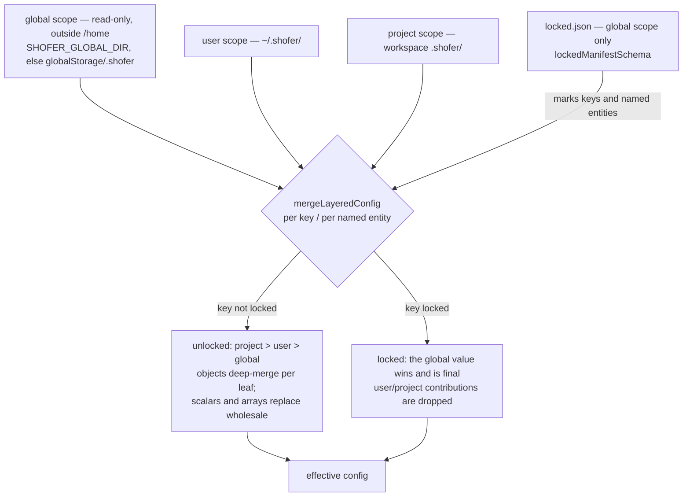
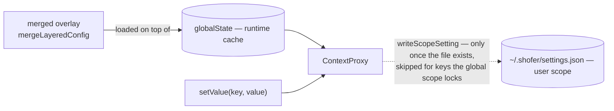

# Shofer Configuration Reference

Reference for Shofer's runtime settings. **Most settings now live in
`ContextProxy`/`globalState` (the `globalSettingsSchema` keys), not in
`settings.json`** — they are edited through the Shofer **Settings** panel and read
via `ContextProxy.getValue` (or, from `@shofer/core`, the `getHost().config` seam,
which resolves them from `globalState`). Only a small set of **bootstrap** keys
that must be read before `ContextProxy` exists remain as `shofer.*` VS Code
`settings.json` entries: `shofer.customStoragePath`, `shofer.autoImportSettingsPath`
(plus `shofer.commandExecutionTimeout` / `shofer.commandTimeoutAllowlist` /
`shofer.preventCompletionWithOpenTodos` / `shofer.codeIndex.embeddingBatchSize` /
`shofer.nodes.loadBalancer`, pending migration). Non-secret configuration has a
single file-based source of truth under `.shofer/` — see
[Layered `.shofer/` configuration](#layered-shofer-configuration) below.

The sections below describe each setting's meaning; where a setting was migrated
off VS Code config, set it via the Settings panel rather than `settings.json`.

---

## Layered `.shofer/` configuration

Every non-secret Shofer configuration item lives in a file under a `.shofer/`
directory, resolved across **three scopes** and merged at runtime. Secrets are the
sole exception: provider API keys stay in VS Code `SecretStorage`, and
`settings.json` references a provider profile **by name/id only**, never by key
value (see [`settings_overlay.md`](settings_overlay.md) §1 and
[`shofer_special_files.md`](shofer_special_files.md)).

### The three scopes

| Scope       | Root                                                                                                                                             | Writable by the workspace? | Who writes it                         |
| ----------- | ------------------------------------------------------------------------------------------------------------------------------------------------ | -------------------------- | ------------------------------------- |
| **global**  | a **read-only path outside `/home`** — `SHOFER_GLOBAL_DIR` if set (SaaS: a ConfigMap mount, e.g. `/etc/shofer/`), else `<globalStorage>/.shofer` | **no** (RO)                | a host/integration (config-manager)   |
| **user**    | `~/.shofer/`                                                                                                                                     | yes                        | the user                              |
| **project** | `<workspace>/.shofer/`                                                                                                                           | yes                        | committed to the repo, shared via git |

The roots are resolved by `resolveScopeRoots` in
[`layeredSettingsLoader.ts`](../src/core/config/layeredSettingsLoader.ts). The
global root being **read-only and outside `/home`** is a hard requirement: it is
what makes org-policy locking (below) enforceable rather than advisory — a global
layer the workspace could edit would make locking meaningless.

Each scope's `.shofer/` holds the same file set:

```
.shofer/
├── settings.json        # the globalSettings keys (JSON)
├── locked.json          # (global scope only) org-policy lock manifest
├── plugins.json         # plugin declarations (see PLUGINS.md)
├── mcp.json             # MCP servers
├── shofermodes          # custom modes (YAML)
├── commands/            # slash commands (*.md)
└── rules/  rules-<mode>/ # rules / custom instructions
```

### Merge order — per-key locked-vs-default

The effective config is a per-key / per-named-entity merge across the three
scopes, computed by the pure engine `mergeLayeredConfig` in
[`layered-config.ts`](../packages/core/src/config/layered-config.ts):

- **Unlocked** key/entity → normal **more-specific-wins**: `project > user > global`,
  with global as the default. Plain objects deep-merge per leaf; scalars and arrays
  are replaced wholesale. This is Shofer's existing mode/rules precedence.
- **Locked** key/entity (the global scope marks it — below) → the **global** value
  **wins and is final**; user/project contributions to that key/entity are dropped.
  For locked keys this **inverts** the usual "project overrides global": org policy
  cannot be overridden downstream.
- A user/project may always **add** keys/entities the global layer does not define;
  locking a key global never set is inert and falls back to the unlocked merge.



`globalState` remains the runtime cache: `ContextProxy` loads the merged overlay on
top of it, and a `setValue` for a globalSettings key mirrors the write into the
**user** scope's `~/.shofer/settings.json` (via `writeScopeSetting`). That
write-through is opt-in — it fires only once a `~/.shofer/settings.json` exists
(materialized by an import/unzip), so a deployment that has not adopted file-backed
settings keeps the old `globalState`-only behavior. A key the global scope locks is
never persisted downstream (the write is skipped).



### `locked.json` — the org-policy lock manifest

`locked.json` lives in the **global scope only** (a user/project `locked.json` is
never read). Its schema (`lockedManifestSchema` in
[`layered-config.ts`](../packages/core/src/config/layered-config.ts)) is a versioned,
fail-closed list of locked paths and named entities:

```json
{
	"version": 1,
	"locked": ["autoApprovalEnabled", "modes/Code", "providers/default", "plugins/git-guard"]
}
```

Each `locked` entry is one of:

- a bare settings key (`"autoApprovalEnabled"`) — locks that top-level key;
- a collection namespace (`"modes"`, `"providers"`, `"plugins"`) — locks the whole
  collection; or
- a `"<namespace>/<id>"` entry (`"modes/Code"`, `"providers/default"`,
  `"plugins/git-guard"`) — locks a single named entity, leaving its siblings on the
  unlocked merge.

Named-entity collections known to the settings engine are `modes` (→ `customModes`,
keyed by `slug`) and `providers` (→ `listApiConfigMeta`, keyed by `name`); `plugins`
is governed by the same manifest for `.shofer/plugins.json` (see
[`PLUGINS.md`](../PLUGINS.md)). A corrupt or version-mismatched manifest is
discarded as "nothing locked" rather than throwing.

### Export / import = a scope's `.shofer/` as a `.tar.gz`

Because everything non-secret is a file under `.shofer/`, export is simply
"archive the scope's `.shofer/` tree" and import is "unpack it into a scope root".
`exportScopeArchive` / `importScopeArchive` / `listScopeArchiveEntries` in
[`scope-archive.ts`](../packages/core/src/config/scope-archive.ts) produce and
consume a single **gzipped tar** (`.tar.gz`); the host wrappers
`exportScopeSettingsArchive` / `importScopeSettingsArchive` in
[`importExport.ts`](../src/core/config/importExport.ts) default to the user scope.

Secrets are out of the archive **by construction** — they live in `SecretStorage`,
outside `.shofer/`, and `settings.json` references profiles by name only — which is
exactly what makes a `.shofer/` bundle safe to hand around. A host/integration
provisions org policy by unpacking a bundle into the **global** (RO) location; the
workspace's own user/project `.shofer/` still override anything the global scope
does not lock.

## Command Execution

### `shofer.allowedCommands`

|         |                                       |
| ------- | ------------------------------------- |
| Type    | `string[]`                            |
| Default | `["git log", "git diff", "git show"]` |
| Scope   | window                                |

Commands that can be automatically executed when "Always approve
execute operations" is enabled. Each entry is matched as a **prefix** —
`"git"` allows all git commands.

### `shofer.deniedCommands`

|         |            |
| ------- | ---------- |
| Type    | `string[]` |
| Default | `[]`       |
| Scope   | window     |

Command prefixes that are automatically denied without asking for
approval. When conflicting with `allowedCommands`, the **longest
prefix** wins. Use `"*"` to deny all commands.

### `shofer.commandExecutionTimeout`

|         |                  |
| ------- | ---------------- |
| Type    | `number`         |
| Default | `0` (no timeout) |
| Range   | 0–600 seconds    |
| Scope   | window           |

Maximum time to wait for a command to complete. `0` disables the
timeout.

### `shofer.commandTimeoutAllowlist`

|         |            |
| ------- | ---------- |
| Type    | `string[]` |
| Default | `[]`       |
| Scope   | window     |

Command prefixes exempt from the execution timeout. Commands matching
these prefixes run without time restrictions.

---

## Task Behaviour

### `shofer.preventCompletionWithOpenTodos`

|         |           |
| ------- | --------- |
| Type    | `boolean` |
| Default | `false`   |
| Scope   | window    |

When enabled, `attempt_completion` is refused if the task has
incomplete todo items.

### `shofer.newTaskRequireTodos`

|         |           |
| ------- | --------- |
| Type    | `boolean` |
| Default | `false`   |
| Scope   | window    |

When enabled, the `new_task` tool requires a `todos` parameter.

---

## API & Providers

### `shofer.apiRequestTimeout`

|         |                    |
| ------- | ------------------ |
| Type    | `number`           |
| Default | `600` (10 minutes) |
| Range   | 0–3600 seconds     |
| Scope   | window             |

Maximum time to wait for API responses. Higher values recommended for
local providers (LM Studio, Ollama).

### `shofer.vsCodeLmModelSelector`

|         |          |
| ------- | -------- |
| Type    | `object` |
| Default | `{}`     |
| Scope   | window   |

Model selector for the VS Code Language Model API. Configures which
`vendor` and `family` the `vscode-lm` provider connects to.

| Child key | Type     | Description                         |
| --------- | -------- | ----------------------------------- |
| `vendor`  | `string` | Provider vendor (e.g., `"copilot"`) |
| `family`  | `string` | Model family (e.g., `"gpt-4"`)      |

### `shofer.enableLlmProviderIntegration`

|         |           |
| ------- | --------- |
| Type    | `boolean` |
| Default | `false`   |
| Scope   | window    |
| Since   | 3.56.x    |

Enable the companion-extension integration. When enabled, the `vscode-lm`
provider queries well-known commands for:

- `llmLocalRouter.getModelPricing` — per-token USD rates (Path 1)
- `llmLocalRouter.getRequestCost` — per-conversation cumulative cost (Path 2)
- `llmLocalRouter.getModelCapabilities` — tool calling, image input, prompt cache

> **Naming wart:** despite the `LlmProvider` in the setting name, `vscode-lm.ts`
> actually calls the `llmLocalRouter.*` commands registered by the **`llm-local-router`**
> extension (`extensions/llm-local-router/`), not the `shofer.llm.*` commands of
> `extensions/llm-provider/`. Both register the same logical commands under different
> namespaces — an unresolved inconsistency (see [`images.md`](images.md) gaps).

These are **required** for cost-limit enforcement
([`cost-calculation-and-limits.md`](cost-calculation-and-limits.md)) and for the API Cost row to show
USD amounts. Without this setting, only token counts are available.

> **Note:** The llm-provider extension must be installed and active
> for this to work. If enabled but the commands are unavailable, the
> Shofer output channel will log a one-shot warning.

---

## Storage & UI

### Message storage (§5)

A task's conversation/UI messages are stored in **SQLite** (`node:sqlite`) — see
[`message-store.ts`](../packages/core/src/task-persistence/message-store.ts) and the
`SqliteMessagePersistence` adapter. Rows are keyed by `(task_id, kind, ts)` with
last-write-wins per `ts`. This replaced the prior flat-file (JSONL) layer and its
performance machinery (debounced saves, append logs, tail-window reads,
atomic-rewrite compaction); there is no configuration knob.

### `shofer.customStoragePath`

|         |                         |
| ------- | ----------------------- |
| Type    | `string`                |
| Default | `""` (default location) |
| Scope   | window                  |

Custom storage path for task history, plugin storage, and other
persistent data. Supports absolute paths (e.g.,
`"D:\\ShoferStorage"`).

### `shofer.enableCodeActions`

|         |           |
| ------- | --------- |
| Type    | `boolean` |
| Default | `true`    |
| Scope   | window    |

Enable Shofer Quick Fix code actions in the editor.

### `shofer.autoImportSettingsPath`

|         |                 |
| ------- | --------------- |
| Type    | `string`        |
| Default | `""` (disabled) |
| Scope   | window          |

Path to a Shofer configuration file to automatically import on
extension startup. Supports absolute paths and home-relative paths
(e.g., `"~/Documents/shofer-code-settings.json"`).

---

## Code Index & Search

### `shofer.maximumIndexedFilesForFileSearch`

|         |             |
| ------- | ----------- |
| Type    | `number`    |
| Default | `10000`     |
| Range   | 5000–500000 |
| Scope   | window      |

Maximum number of files to index for the `@`-file search feature.
Higher values improve search in large projects but consume more memory.

### `shofer.codeIndex.embeddingBatchSize`

|         |          |
| ------- | -------- |
| Type    | `number` |
| Default | `60`     |
| Scope   | window   |

Batch size for embedding operations during code indexing. Adjust to
match your API provider's limits.

---

## Debug & Diagnostics

### `shofer.debug`

|         |           |
| ------- | --------- |
| Type    | `boolean` |
| Default | `false`   |
| Scope   | window    |

Enable debug mode. Shows additional buttons for viewing the API
conversation history and UI messages as formatted JSON in temporary
files.

### `shofer.debugProxy.enabled`

|         |           |
| ------- | --------- |
| Type    | `boolean` |
| Default | `false`   |
| Scope   | window    |

Route all outgoing network requests through a proxy for MITM
debugging. Only active in debug mode (F5).

### `shofer.debugProxy.serverUrl`

|         |                           |
| ------- | ------------------------- |
| Type    | `string`                  |
| Default | `"http://127.0.0.1:8888"` |
| Scope   | window                    |

Proxy URL. Only used when `debugProxy.enabled` is `true`.

### `shofer.debugProxy.tlsInsecure`

|         |           |
| ------- | --------- |
| Type    | `boolean` |
| Default | `false`   |
| Scope   | window    |

Accept self-signed certificates from the proxy. Required for MITM
inspection. Use only for local debugging.

---

## Global Settings (JSON-only, no settings UI)

These settings are stored via `contextProxy.getValue()` and are
available in `globalSettingsSchema` but do not have settings-panel
rows yet. Configure them directly in `settings.json`.

### `shofer.defaultCostLimit`

```jsonc
{
	// Cost limiting ON: maxUsd must be a POSITIVE number (the schema is
	// z.number().positive() — 0 is rejected by Zod validation).
	"shofer.defaultCostLimit": {
		"maxUsd": 5.0, // cap in USD (must be > 0)
		"action": "pause", // "pause" | "abort" | "kill"
	},
	// Cost limiting OFF: use null (not 0).
	// "shofer.defaultCostLimit": null,
}
```

Default per-root-task USD budget cap applied to all new tasks. To **disable**
cost limiting, set `defaultCostLimit` to `null` — **not** `maxUsd: 0`, which the
`z.number().positive()` schema rejects. See
[`cost-calculation-and-limits.md`](cost-calculation-and-limits.md) for details.

### `shofer.disabledTools`

```jsonc
{
	"shofer.disabledTools": ["tool_name_1", "tool_name_2"],
}
```

List of native tool names to globally disable. Tools in this list are
excluded from prompt generation and rejected at execution time.

### `shofer.useAgentRules`

```jsonc
{
	"shofer.useAgentRules": true,
}
```

Enable loading `AGENTS.md` files for agent-specific rules. See
[agent-rules.org](https://agent-rules.org/). Defaults to `true`.

---

## Gaps & Known Issues

This document was verified against [`src/package.json`](../src/package.json)
`contributes.configuration` and
[`globalSettingsSchema`](../packages/types/src/global-settings.ts) on
2026-05-20. The following gaps and issues were identified.

### Configuration-key sources

Shofer has **two** setting storage backends and it is critical to
document which one a setting uses:

| Storage                  | Declaration                                                       | Settings UI                                                     |
| ------------------------ | ----------------------------------------------------------------- | --------------------------------------------------------------- |
| VS Code configuration    | `contributes.configuration.properties` in `src/package.json`      | Has settings-panel rows (API & Providers, Debug, etc.)          |
| ContextProxy GlobalState | `globalSettingsSchema` in `packages/types/src/global-settings.ts` | No settings-panel rows (configure via `settings.json` directly) |

A setting that appears in **both** places (e.g. `enableLlmProviderIntegration`)
is stored in both backends, but the GlobalState copy is what ContextProxy
serves to runtime code. The two copies can drift if a user edits
`settings.json` directly for one but not the other.

### `commandExecutionTimeout` / `commandTimeoutAllowlist` naming bug — ✅ fixed

Previously, `contributes.configuration` registered these as
`shofer.devmandExecutionTimeout` / `shofer.devmandTimeoutAllowlist` — a
find-replace accident (`command` with `com`→`dev` becomes `devmand`). The
runtime, however, reads `shofer.commandExecutionTimeout` /
`shofer.commandTimeoutAllowlist` via
`vscode.workspace.getConfiguration("shofer").get(...)`
([`ExecuteCommandTool.ts`](../packages/core/src/tools/ExecuteCommandTool.ts)). So the
registered setting (default/range/description) was dead and the key the
runtime actually reads had no UI/schema row. The `package.json` keys were
renamed to `shofer.commandExecutionTimeout` / `shofer.commandTimeoutAllowlist`,
reconnecting the UI registration to the consumed key.

### `maxUsd: 0` is invalid per the schema

The [`costLimitSchema`](../packages/types/src/history.ts:74) requires
`maxUsd: z.number().positive()` — strictly greater than zero. The
`defaultCostLimit` example in this doc shows `"maxUsd": 0`, which would
be rejected by Zod validation. Cost limiting is actually disabled by
setting `defaultCostLimit: null` (the `nullish()` wrapper on the
[`globalSettingsSchema`](../packages/types/src/global-settings.ts:234)
default).

### `enableLlmProviderIntegration` "Since 3.56.x" is unverifiable

No source file, changelog entry, or tag in the repository contains
`3.56`. The version string appears only in this document.

### `codeIndex.embeddingBatchSize` missing range

The doc omits the Range row that `package.json` declares: `minimum: 1`,
`maximum: 200` at [`src/package.json`](../src/package.json:440-442).

### Missing setting sections

The `globalSettingsSchema` defines ~80+ keys. Only **5** are documented
here (`defaultCostLimit`, `disabledTools`, `useAgentRules`,
`commandExecutionTimeout`, `commandTimeoutAllowlist` — the last two
with the naming confusion noted above). Entire functional areas are
absent:

- **Auto-approval** — `autoApprovalEnabled`, `alwaysAllowReadOnly`,
  `alwaysAllowWrite`, `alwaysAllowBrowser`, `alwaysAllowMcp`,
  `alwaysAllowExecute`, `alwaysAllowModeSwitch`, `alwaysAllowSubtasks`
- **Context window** — `autoCondenseContext`,
  `autoCondenseContextPercent`, `maxOpenTabsContext`, `maxWorkspaceFiles`
- **Terminal** — `terminalOutputPreviewSize`,
  `terminalShellIntegrationTimeout`, `terminalCommandDelay`
- **Modes** — `mode`, `customModes`, `customModePrompts` (per-mode API
  profile assignments live in the SecretStorage provider-profiles blob
  as `modeApiConfigs`, not in `globalSettingsSchema`)
- **Rate limiting** — `allowedMaxRequests`, `allowedMaxCost`,
  `rateLimitSeconds`
- **Images** — `maxImageFileSize`, `maxTotalImageSize`
- **Environment details** — `includeCurrentTime`, `includeCurrentCost`,
  `maxGitStatusFiles`, `includeDiagnosticMessages`,
  `maxDiagnosticMessages`
- **Write delay** — `writeDelayMs`

### `newTaskRequireTodos` — wired up (earlier "dead config" note was wrong)

This setting **is** consumed:
[`NewTaskTool.ts`](../packages/core/src/tools/NewTaskTool.ts) reads
`getConfiguration("shofer").get<boolean>("newTaskRequireTodos", false)` and,
when true, rejects `new_task` calls lacking a `todos` parameter. (The previous
revision of this gap claimed zero references — it was stale.)

### Inaccurate "debug mode (F5)" description

The doc says `debugProxy.enabled` is "Only active in debug mode (F5)".
The actual gate is
[`extensionContext.extensionMode === vscode.ExtensionMode.Development`](../src/utils/networkProxy.ts:207),
not the F5 key — these are different concepts (the extension can run in
development mode from a `.vsix` install too).

### Missing `enabled`-style column for non-stored settings

The doc does not distinguish between settings that are stored in
`contributes.configuration` (VS Code schema, UI controls) and settings
that are stored in `globalSettingsSchema` (ContextProxy, JSON-only).
This distinction is material because Global Settings bypass the VS Code
`settings.json` schema validation. A typo in a Global Setting value
(e.g. `"maxUsd": "0"` as a string) passes silently through VS Code
validation and is only caught at runtime by Zod.
