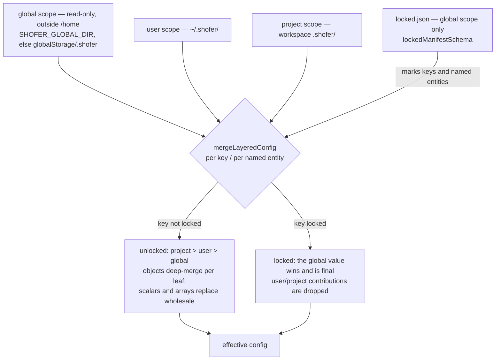
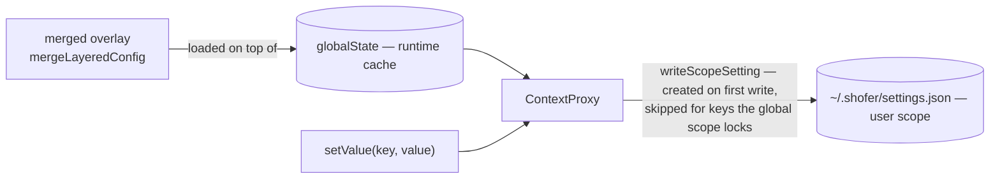

# Shofer Configuration Reference

Reference for Shofer's runtime settings. **Most settings now live in
`ContextProxy`/`globalState` (the `globalSettingsSchema` keys), not in
`settings.json`** — they are edited through the Shofer **Settings** panel and read
via `ContextProxy.getValue` (or, from `@shofer/core`, the `getHost().config` seam,
which resolves them from `globalState`). Only the two **bootstrap** keys
that must be read before `ContextProxy` exists remain as `shofer.*` VS Code
`settings.json` entries: `shofer.customStoragePath` and
`shofer.autoImportSettingsPath`. Non-secret configuration has a
single file-based source of truth under `.shofer/` — see
[Layered `.shofer/` configuration](#layered-shofer-configuration) below.

The sections below describe each setting's meaning; where a setting was migrated
off VS Code config, set it via the Settings panel rather than `settings.json`.

---

## Layered `.shofer/` configuration

Every non-secret Shofer configuration item lives in a file under a `.shofer/`
directory, resolved across **three scopes** and merged at runtime. Secrets are the
sole exception: provider API keys stay in VS Code `SecretStorage`, and
`settings.json` references a provider profile **by name/id only**, never by key
value (see [`settings_overlay.md`](settings_overlay.md) §1 and
[`shofer_special_files.md`](shofer_special_files.md)).

### The three scopes

| Scope       | Root                                                                                                                                             | Writable by the workspace? | Who writes it                         |
| ----------- | ------------------------------------------------------------------------------------------------------------------------------------------------ | -------------------------- | ------------------------------------- |
| **global**  | a **read-only path outside `/home`** — `SHOFER_GLOBAL_DIR` if set (SaaS: a ConfigMap mount, e.g. `/etc/shofer/`), else `<globalStorage>/.shofer` | **no** (RO)                | a host/integration (config-manager)   |
| **user**    | `~/.shofer/`                                                                                                                                     | yes                        | the user                              |
| **project** | `<workspace>/.shofer/`                                                                                                                           | yes                        | committed to the repo, shared via git |

The roots are resolved by `resolveScopeRoots` in
[`scope-roots.ts`](../packages/core/src/config/scope-roots.ts) (shared by the host
config loaders and the portable services — settings, modes, MCP, commands, skills
and rules all resolve the same three roots). The
global root being **read-only and outside `/home`** is a hard requirement: it is
what makes org-policy locking (below) enforceable rather than advisory — a global
layer the workspace could edit would make locking meaningless.

Each scope's `.shofer/` holds the same file set:

```
.shofer/
├── settings.json        # the globalSettings keys (JSON)
├── locked.json          # (global scope only) org-policy lock manifest
├── plugins.json         # plugin declarations (see PLUGINS.md)
├── providers.json       # provider profiles (non-secret fields; keys stay in SecretStorage)
├── workers.json           # Shofer Worker declarations (below)
├── mcp.json             # MCP servers
├── shofermodes          # custom modes (YAML)
├── skills/  skills-<mode>/ # skills
├── commands/            # slash commands (*.md)
└── rules/  rules-<mode>/ # rules / custom instructions
```

Every file in the tree is read from **all three scopes**: `settings.json`,
`plugins.json` and `workers.json` through their loaders, `shofermodes`,
`mcp.json` and `providers.json` per named entity (slug / server name / profile
name) through the same locked-vs-default rule, and `commands/`, `skills*/`,
`rules*/` by directory order (org, then user, then project — later wins per
filename). Skills are the one directory namespace that additionally honors the
lock manifest: a skill name the org scope defines and `locked.json` names
(`skills` / `skills/<name>`) is org-final — `SkillsManager` purges same-name
entries from every other scope and refuses create/delete/move of that name. Provider profiles are the one split store: non-secret fields in
`providers.json`, locally-entered API keys in `SecretStorage` (the local key
wins over an org-supplied file default) — see
[`settings_overlay.md`](settings_overlay.md) §1.

### Merge order — per-key locked-vs-default

The effective config is a per-key / per-named-entity merge across the three
scopes, computed by the pure engine `mergeLayeredConfig` in
[`layered-config.ts`](../packages/core/src/config/layered-config.ts):

- **Unlocked** key/entity → normal **more-specific-wins**: `project > user > global`,
  with global as the default. Plain objects deep-merge per leaf; scalars and arrays
  are replaced wholesale. This is Shofer's existing mode/rules precedence.
- **Locked** key/entity (the global scope marks it — below) → the **global** value
  **wins and is final**; user/project contributions to that key/entity are dropped.
  For locked keys this **inverts** the usual "project overrides global": org policy
  cannot be overridden downstream.
- A user/project may always **add** keys/entities the global layer does not define;
  locking a key global never set is inert and falls back to the unlocked merge.



The files are the source of truth; `globalState` is only the runtime cache.
`ContextProxy` loads the merged overlay on top of it, and every `setValue` for a
globalSettings key mirrors the write into the **user** scope's
`~/.shofer/settings.json` (via `writeScopeSetting`), creating the file on the
first write. On activation, values still resident only in `globalState` (from
before the file layer) are seeded into the user file once (`seedScopeSettingsFile`
— create-only, never overwrites an existing file). A key the global scope locks
is never persisted downstream (the write is skipped), and a file-layer failure
degrades that write to cache-only rather than failing it.



### `locked.json` — the org-policy lock manifest

`locked.json` lives in the **global scope only** (a user/project `locked.json` is
never read). Its schema (`lockedManifestSchema` in
[`layered-config.ts`](../packages/core/src/config/layered-config.ts)) is a versioned,
fail-closed list of locked paths and named entities:

```json
{
	"version": 1,
	"locked": ["autoApprovalEnabled", "modes/Code", "providers/default", "plugins/git-guard"]
}
```

Each `locked` entry is one of:

- a bare settings key (`"autoApprovalEnabled"`) — locks that top-level key;
- a collection namespace (`"modes"`, `"providers"`, `"plugins"`) — locks the whole
  collection; or
- a `"<namespace>/<id>"` entry (`"modes/Code"`, `"providers/default"`,
  `"plugins/git-guard"`) — locks a single named entity, leaving its siblings on the
  unlocked merge.

Named-entity collections known to the settings engine are `modes` (→ `customModes`,
keyed by `slug`) and `providers` (→ `listApiConfigMeta`, keyed by `name`); `plugins`
is governed by the same manifest for `.shofer/plugins.json` (see
[`PLUGINS.md`](../PLUGINS.md)), `mcp` for `mcp.json` (per server name, in
`McpHub`) and `skills` for the skill directories (in `SkillsManager`). A corrupt
or version-mismatched manifest is discarded as "nothing locked" rather than
throwing.

Locked entities are also **surfaced**: the host assembles the org-locked mode
slugs, MCP server names, provider profile names and skill names into
`ExtensionState.orgLockedResources`, and the Settings UI disables their
edit/rename/delete affordances (ModesView, the MCP panel, `ApiConfigManager`).
The managers additionally refuse mutations of locked entities loudly
(`CustomModesManager`, `McpHub`, `ProviderSettingsManager.deleteConfig`,
`SkillsManager`) instead of letting the write land in a weaker scope where the
merge would silently shadow it. The one deliberate exception: a locked provider
profile still accepts a locally-entered API key (the secret overlay), so a user
can supply their own credential for an org-shipped keyless profile.

### `workers.json` — Shofer Worker declarations

`.shofer/workers.json` declares the **remote executors** this host should be talking to
(see [`v3_architecture.md` §Distributed execution](v3_architecture.md) for what a worker is). Its schema and merge
are in [`worker-declaration.ts`](../packages/core/src/config/worker-declaration.ts):

```json
{
	"version": 1,
	"workers": {
		"pool-0": {
			"label": "runner-0",
			"host": "ws-42-runner-0.ws-42-runner.proj-ns.svc.cluster.local:30099",
			"tokenFile": "/var/run/secrets/arkware/node-token",
			"autoConnect": true
		}
	}
}
```

It exists so a worker set can be **provisioned by writing a file** rather than only
through the Settings UI — which is the only way a headless host (which has no UI at
all) can have workers, and the only way a platform can provision a pool.

- **Per-entity merge**, keyed by worker id, exactly like `plugins.json`: locking
  `workers/<id>` makes the global scope's entry final while the user may still add
  workers of their own. A worker _list_ under a `settings.json` key could not do this —
  arrays are replaced wholesale, so any user entry would destroy the platform's.
- **No secrets.** The bearer token is named by reference — `tokenFile` (typically a
  projected Kubernetes Secret) or `tokenEnv` (the name of an environment variable,
  which is the shape a k8s `secretKeyRef` produces) — and resolved at connect time,
  so rotating it needs no edit here. A `token` field is rejected by the schema.
- **Declared workers are reconciled live.** `WorkerRegistry` re-reads the file whenever
  it changes (below): an added entry appears and connects, a withdrawn one
  disconnects and disappears, a changed `host` reconnects. The declaration owns
  identity (`host`/`tls`/`tokenFile`/`label`); the user still owns the runtime flags
  (`disabled`, `autoConnect`) unless the entry states them. Such a worker carries
  `declared: true` and the UI offers no Edit/Remove for it — the file is its source
  of truth — but Disable still applies.
- **A corrupt `workers.json` changes nothing.** The last good worker set stands, which is
  a deliberate deviation from the fail-closed rule everywhere else here: emptying a
  project's pool over a typo is worse than running on a stale list.

### Live reload — the scope watcher

The overlay is not only read at start. Every host watches the three scopes'
`.shofer/` directories ([`scopeWatcher.ts`](../src/core/config/scopeWatcher.ts)) and
re-reads `settings.json`, `locked.json` and `workers.json` when they change, so an edit
made by a person, by another host sharing the volume, or by a ConfigMap rewrite takes
effect **without a restart**. `ContextProxy` refreshes the merged overlay and
announces the keys that actually moved (`onDidRefreshOverlay`); `WorkerRegistry`
reconciles its declared workers; and `ShoferProvider` **reloads any plugin whose
`pluginConfigs` entry changed**, because a plugin holds the `config` object it was
handed at load — without the reload the overlay would report the new value while the
plugin kept running on the old one. Only the plugins whose own entry moved are
reloaded: `pluginConfigs` merges whole-value, so one plugin's edit re-reports the
whole map and reloading all of them would tear down unrelated services for nothing.

A key served by the overlay is **not editable in the UI**. The overlay wins in
`getValue`, so a local write would be silently shadowed; surfaces ask
`ContextProxy.isManagedByFileLayer(key)` and render the value read-only with its
source instead of offering an edit that does nothing (the Plugins panel does this for
`pluginConfigs`).

Directories are watched rather than files, because both writers that matter replace
rather than mutate: settings are written to a temp file and renamed over the target,
and a Kubernetes ConfigMap update swaps the `..data` symlink under the mount. A file
watch would see neither. `vscode.workspace.createFileSystemWatcher` is deliberately
not used — two of the three scopes live outside the workspace, and the headless
host's shim implements it as an emitter that never fires.

### Export / import = a scope's `.shofer/` as a `.tar.gz`

Because everything non-secret is a file under `.shofer/`, export is simply
"archive the scope's `.shofer/` tree" and import is "unpack it into a scope root".
`exportScopeArchive` / `importScopeArchive` / `listScopeArchiveEntries` in
[`scope-archive.ts`](../packages/core/src/config/scope-archive.ts) produce and
consume a single **gzipped tar** (`.tar.gz`); the host wrappers
`exportScopeSettingsArchive` / `importScopeSettingsArchive` in
[`importExport.ts`](../src/core/config/importExport.ts) default to the user scope.

Secrets are out of the archive **by construction** — they live in `SecretStorage`,
outside `.shofer/`, and `settings.json` references profiles by name only — which is
exactly what makes a `.shofer/` bundle safe to hand around. A host/integration
provisions org policy by unpacking a bundle into the **global** (RO) location; the
workspace's own user/project `.shofer/` still override anything the global scope
does not lock.

## Settings reference

Two different things are documented below, and they are set in different places:

- **`globalSettings` keys** (most of them) live in the layered
  `.shofer/settings.json` described above, and are edited through the Settings UI or
  delivered as org policy. They are **not** VS Code settings — putting
  `"shofer.allowedCommands"` in VS Code's `settings.json` does nothing.
- **VS Code settings** (`shofer.*`, two of them) are real
  `contributes.configuration` entries in `src/package.json`, set in VS Code's own
  settings UI/JSON. They are the ones that must be readable _before_ the extension's
  own config layer exists, or that VS Code itself consumes.

Headings below use each setting's real identity: a bare name is a `globalSettings`
key, a `shofer.`-prefixed name is a VS Code setting.

This document is the per-setting reference. For how the storage backends, merge
order, write paths, file watchers and Settings View actually work, see
[`settings_overlay.md`](settings_overlay.md).

## Command Execution

### `allowedCommands`

|         |                                                 |
| ------- | ----------------------------------------------- |
| Type    | `string[]`                                      |
| Default | `["git log", "git diff", "git show"]`           |
| Where   | layered `.shofer/settings.json` (+ Settings UI) |

Commands that can be automatically executed when "Always approve
execute operations" is enabled. Each entry is matched as a **prefix** —
`"git"` allows all git commands.

### `deniedCommands`

|         |                                                 |
| ------- | ----------------------------------------------- |
| Type    | `string[]`                                      |
| Default | `[]`                                            |
| Where   | layered `.shofer/settings.json` (+ Settings UI) |

Command prefixes that are automatically denied without asking for
approval. When conflicting with `allowedCommands`, the **longest
prefix** wins. Use `"*"` to deny all commands.

### `commandExecutionTimeout`

|         |                                 |
| ------- | ------------------------------- |
| Type    | `number`                        |
| Default | `0` (no timeout)                |
| Range   | 0–600 seconds                   |
| Where   | layered `.shofer/settings.json` |

Maximum time to wait for a command to complete. `0` disables the
timeout.

### `commandTimeoutAllowlist`

|         |                                 |
| ------- | ------------------------------- |
| Type    | `string[]`                      |
| Default | `[]`                            |
| Where   | layered `.shofer/settings.json` |

Command prefixes exempt from the execution timeout. Commands matching
these prefixes run without time restrictions.

---

## Task Behaviour

### `preventCompletionWithOpenTodos`

|         |                                 |
| ------- | ------------------------------- |
| Type    | `boolean`                       |
| Default | `false`                         |
| Where   | layered `.shofer/settings.json` |

When enabled, `attempt_completion` is refused if the task has
incomplete todo items.

### `newTaskRequireTodos`

|         |                                                 |
| ------- | ----------------------------------------------- |
| Type    | `boolean`                                       |
| Default | `false`                                         |
| Where   | layered `.shofer/settings.json` (+ Settings UI) |

When enabled, the `new_task` tool requires a `todos` parameter.

---

## API & Providers

### `apiRequestTimeout`

|         |                                                 |
| ------- | ----------------------------------------------- |
| Type    | `number`                                        |
| Default | `600` (10 minutes)                              |
| Range   | 0–3600 seconds                                  |
| Where   | layered `.shofer/settings.json` (+ Settings UI) |

Maximum time to wait for API responses. Higher values recommended for
local providers (LM Studio, Ollama).

### `vsCodeLmModelSelector`

|         |                                                 |
| ------- | ----------------------------------------------- |
| Type    | `object`                                        |
| Default | `{}`                                            |
| Where   | layered `.shofer/settings.json` (+ Settings UI) |

Model selector for the VS Code Language Model API. Configures which
`vendor` and `family` the `vscode-lm` provider connects to.

| Child key | Type     | Description                         |
| --------- | -------- | ----------------------------------- |
| `vendor`  | `string` | Provider vendor (e.g., `"copilot"`) |
| `family`  | `string` | Model family (e.g., `"gpt-4"`)      |

### `enableLlmProviderIntegration`

|         |                                                 |
| ------- | ----------------------------------------------- |
| Type    | `boolean`                                       |
| Default | `false`                                         |
| Where   | layered `.shofer/settings.json` (+ Settings UI) |
| Since   | 3.56.x                                          |

Enable the companion-extension integration. When enabled, the `vscode-lm`
provider queries well-known commands for:

- `llmLocalRouter.getModelPricing` — per-token USD rates (Path 1)
- `llmLocalRouter.getRequestCost` — per-conversation cumulative cost (Path 2)
- `llmLocalRouter.getModelCapabilities` — tool calling, image input, prompt cache

> **Naming wart:** despite the `LlmProvider` in the setting name, `vscode-lm.ts`
> actually calls the `llmLocalRouter.*` commands registered by the **`llm-local-router`**
> extension (`extensions/llm-local-router/`), not the `shofer.llm.*` commands of
> `extensions/llm-provider/`. Both register the same logical commands under different
> namespaces — an unresolved inconsistency (see [`images.md`](images.md) gaps).

These are **required** for cost-limit enforcement
([`cost-calculation-and-limits.md`](cost-calculation-and-limits.md)) and for the API Cost row to show
USD amounts. Without this setting, only token counts are available.

> **Note:** The llm-provider extension must be installed and active
> for this to work. If enabled but the commands are unavailable, the
> Shofer output channel will log a one-shot warning.

---

## Storage & UI

### Message storage (§5)

A task's conversation/UI messages are stored in **SQLite** (`node:sqlite`) — see
[`message-store.ts`](../packages/core/src/task-persistence/message-store.ts) and the
`SqliteMessagePersistence` adapter. Rows are keyed by `(task_id, kind, ts)` with
last-write-wins per `ts`. This replaced the prior flat-file (JSONL) layer and its
performance machinery (debounced saves, append logs, tail-window reads,
atomic-rewrite compaction); there is no configuration knob.

### `shofer.customStoragePath`

|         |                         |
| ------- | ----------------------- |
| Type    | `string`                |
| Default | `""` (default location) |
| Scope   | window                  |

Custom storage path for task history, plugin storage, and other
persistent data. Supports absolute paths (e.g.,
`"D:\\ShoferStorage"`).

### `enableCodeActions`

|         |                                                 |
| ------- | ----------------------------------------------- |
| Type    | `boolean`                                       |
| Default | `true`                                          |
| Where   | layered `.shofer/settings.json` (+ Settings UI) |

Enable Shofer Quick Fix code actions in the editor.

### `settingsWriteScope`

|         |                                                         |
| ------- | ------------------------------------------------------- |
| Type    | `"user"` \| `"project"`                                 |
| Default | `"user"`                                                |
| Where   | layered `.shofer/settings.json` (+ Settings UI → About) |

Which writable `.shofer/` scope Settings edits persist to: the user scope
(`~/.shofer`, this machine only) or the project scope (the workspace's
committed `.shofer/`, shared via git). The selector itself always persists at
the user scope, and org-locked keys are never persisted downstream either way.

### `shofer.autoImportSettingsPath`

|         |                 |
| ------- | --------------- |
| Type    | `string`        |
| Default | `""` (disabled) |
| Scope   | window          |

Path to a **scope archive** (`.tgz`, as produced by Settings → Export) to
pre-seed a fresh install from: on activation, when the user scope has no
`settings.json` yet, the archive is unpacked into `~/.shofer`. A materialized
user scope is never overwritten. Supports absolute and home-relative paths
(e.g., `"~/seed.tgz"`). For standing org policy use the `SHOFER_GLOBAL_DIR`
mount instead.

---

## Code Index & Search

### `maximumIndexedFilesForFileSearch`

|         |                                                 |
| ------- | ----------------------------------------------- |
| Type    | `number`                                        |
| Default | `10000`                                         |
| Range   | 5000–500000                                     |
| Where   | layered `.shofer/settings.json` (+ Settings UI) |

Maximum number of files to index for the `@`-file search feature.
Higher values improve search in large projects but consume more memory.

### `embeddingBatchSize` (rag-indexing plugin config)

|         |                                                                                       |
| ------- | ------------------------------------------------------------------------------------- |
| Type    | `number`                                                                              |
| Default | `60`                                                                                  |
| Where   | `pluginConfigs["rag-indexing"].embeddingBatchSize` in layered `.shofer/settings.json` |

Batch size for embedding operations during code indexing. Adjust to
match your API provider's limits. The former
`shofer.codeIndex.embeddingBatchSize` VS Code setting was read by nothing —
the real knob is the rag-indexing plugin's config.

### `workersLoadBalancer`

|         |                                                                           |
| ------- | ------------------------------------------------------------------------- |
| Type    | `"round-robin" \| "least-load-1m" \| "least-load-5m" \| "least-load-15m"` |
| Default | `"round-robin"`                                                           |
| Where   | layered `.shofer/settings.json` (+ the Workers panel)                     |

How the Shofer Workers executor pool assigns each new task across the Local
and remote executors: rotate evenly, or pick the executor with the lowest
normalized CPU load average over the given window.

---

## Debug & Diagnostics

### `debug`

|         |                                                 |
| ------- | ----------------------------------------------- |
| Type    | `boolean`                                       |
| Default | `false`                                         |
| Where   | layered `.shofer/settings.json` (+ Settings UI) |

Enable debug mode. Shows additional buttons for viewing the API
conversation history and UI messages as formatted JSON in temporary
files.

### `debugProxyEnabled`

|         |                                                 |
| ------- | ----------------------------------------------- |
| Type    | `boolean`                                       |
| Default | `false`                                         |
| Where   | layered `.shofer/settings.json` (+ Settings UI) |

Route all outgoing network requests through a proxy for MITM
debugging. Only active in debug mode (F5).

### `debugProxyServerUrl`

|         |                                                 |
| ------- | ----------------------------------------------- |
| Type    | `string`                                        |
| Default | `"http://127.0.0.1:8888"`                       |
| Where   | layered `.shofer/settings.json` (+ Settings UI) |

Proxy URL. Only used when `debugProxy.enabled` is `true`.

### `debugProxyTlsInsecure`

|         |                                                 |
| ------- | ----------------------------------------------- |
| Type    | `boolean`                                       |
| Default | `false`                                         |
| Where   | layered `.shofer/settings.json` (+ Settings UI) |

Accept self-signed certificates from the proxy. Required for MITM
inspection. Use only for local debugging.

---

## Global Settings (JSON-only, no settings UI)

These settings are stored via `contextProxy.getValue()` and are
available in `globalSettingsSchema` but do not have settings-panel
rows yet. Configure them directly in `settings.json`.

### `defaultCostLimit`

```jsonc
{
	// Cost limiting ON: maxUsd must be a POSITIVE number (the schema is
	// z.number().positive() — 0 is rejected by Zod validation).
	"defaultCostLimit": {
		"maxUsd": 5.0, // cap in USD (must be > 0)
		"action": "pause", // "pause" | "abort" | "kill"
	},
	// Cost limiting OFF: use null (not 0).
	// "defaultCostLimit": null,
}
```

Default per-root-task USD budget cap applied to all new tasks. To **disable**
cost limiting, set `defaultCostLimit` to `null` — **not** `maxUsd: 0`, which the
`z.number().positive()` schema rejects. See
[`cost-calculation-and-limits.md`](cost-calculation-and-limits.md) for details.

### `disabledTools`

```jsonc
{
	"disabledTools": ["tool_name_1", "tool_name_2"],
}
```

List of native tool names to globally disable. Tools in this list are
excluded from prompt generation and rejected at execution time.

### `useAgentRules`

```jsonc
{
	"useAgentRules": true,
}
```

Enable loading `AGENTS.md` files for agent-specific rules. See
[agent-rules.org](https://agent-rules.org/). Defaults to `true`.

---

## Gaps & Known Issues

This document was verified against [`src/package.json`](../src/package.json)
`contributes.configuration` and
[`globalSettingsSchema`](../packages/types/src/global-settings.ts) on
2026-05-20. The following gaps and issues were identified.

### Configuration-key sources

Shofer has **two** setting storage backends and it is critical to
document which one a setting uses:

| Storage                  | Declaration                                                       | Settings UI                                                     |
| ------------------------ | ----------------------------------------------------------------- | --------------------------------------------------------------- |
| VS Code configuration    | `contributes.configuration.properties` in `src/package.json`      | Has settings-panel rows (API & Providers, Debug, etc.)          |
| ContextProxy GlobalState | `globalSettingsSchema` in `packages/types/src/global-settings.ts` | No settings-panel rows (configure via `settings.json` directly) |

A setting that appears in **both** places (e.g. `enableLlmProviderIntegration`)
is stored in both backends, but the GlobalState copy is what ContextProxy
serves to runtime code. The two copies can drift if a user edits
`settings.json` directly for one but not the other.

### `maxUsd: 0` is invalid per the schema

The [`costLimitSchema`](../packages/types/src/history.ts:74) requires
`maxUsd: z.number().positive()` — strictly greater than zero. The
`defaultCostLimit` example in this doc shows `"maxUsd": 0`, which would
be rejected by Zod validation. Cost limiting is actually disabled by
setting `defaultCostLimit: null` (the `nullish()` wrapper on the
[`globalSettingsSchema`](../packages/types/src/global-settings.ts:234)
default).

### `enableLlmProviderIntegration` "Since 3.56.x" is unverifiable

No source file, changelog entry, or tag in the repository contains
`3.56`. The version string appears only in this document.

### Missing setting sections

The `globalSettingsSchema` defines ~80+ keys. Only **5** are documented
here (`defaultCostLimit`, `disabledTools`, `useAgentRules`,
`commandExecutionTimeout`, `commandTimeoutAllowlist` — the last two
with the naming confusion noted above). Entire functional areas are
absent:

- **Auto-approval** — `autoApprovalEnabled`, `alwaysAllowReadOnly`,
  `alwaysAllowWrite`, `alwaysAllowBrowser`, `alwaysAllowMcp`,
  `alwaysAllowExecute`, `alwaysAllowModeSwitch`, `alwaysAllowSubtasks`
- **Context window** — `autoCondenseContext`,
  `autoCondenseContextPercent`, `maxOpenTabsContext`, `maxWorkspaceFiles`
- **Terminal** — `terminalOutputPreviewSize`,
  `terminalShellIntegrationTimeout`, `terminalCommandDelay`
- **Modes** — `mode`, `customModes`, `customModePrompts` (per-mode API
  profile assignments live in the SecretStorage provider-profiles blob
  as `modeApiConfigs`, not in `globalSettingsSchema`)
- **Rate limiting** — `allowedMaxRequests`, `allowedMaxCost`,
  `rateLimitSeconds`
- **Images** — `maxImageFileSize`, `maxTotalImageSize`
- **Environment details** — `includeCurrentTime`, `includeCurrentCost`,
  `maxGitStatusFiles`, `includeDiagnosticMessages`,
  `maxDiagnosticMessages`
- **Write delay** — `writeDelayMs`

### `newTaskRequireTodos` — wired up (earlier "dead config" note was wrong)

This setting **is** consumed:
[`NewTaskTool.ts`](../packages/core/src/tools/NewTaskTool.ts) reads
`getConfiguration("shofer").get<boolean>("newTaskRequireTodos", false)` and,
when true, rejects `new_task` calls lacking a `todos` parameter. (The previous
revision of this gap claimed zero references — it was stale.)

### Inaccurate "debug mode (F5)" description

The doc says `debugProxy.enabled` is "Only active in debug mode (F5)".
The actual gate is
[`extensionContext.extensionMode === vscode.ExtensionMode.Development`](../src/utils/networkProxy.ts:207),
not the F5 key — these are different concepts (the extension can run in
development mode from a `.vsix` install too).

### Missing `enabled`-style column for non-stored settings

The doc does not distinguish between settings that are stored in
`contributes.configuration` (VS Code schema, UI controls) and settings
that are stored in `globalSettingsSchema` (ContextProxy, JSON-only).
This distinction is material because Global Settings bypass the VS Code
`settings.json` schema validation. A typo in a Global Setting value
(e.g. `"maxUsd": "0"` as a string) passes silently through VS Code
validation and is only caught at runtime by Zod.
