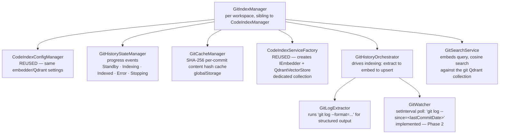
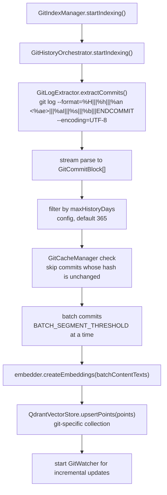
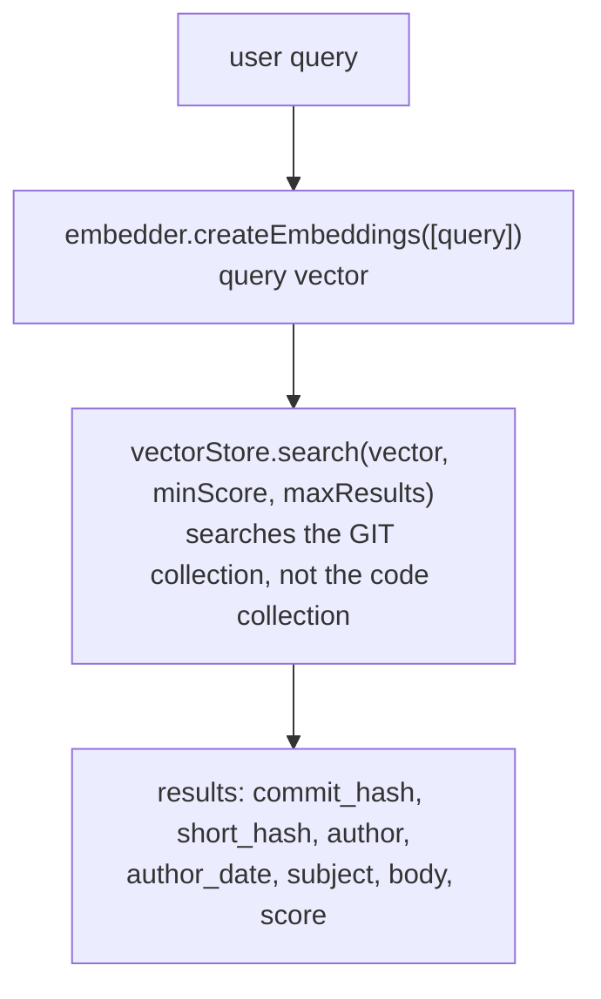
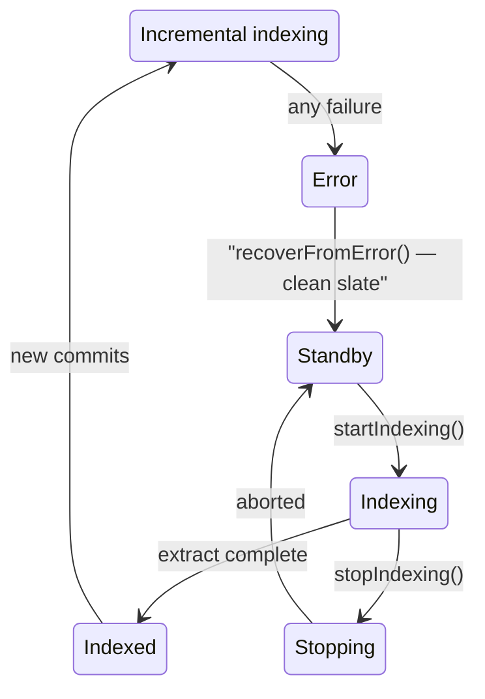

# `git_search` — Git Commit History RAG Tool

## Purpose

`git_search` is a **semantic search tool over git commit history**. It indexes commit messages (subject + body, **not diffs**) into a Qdrant vector collection separate from the code index. The agent can then discover relevant commit context — who changed what, when, and why — by searching by meaning rather than exact keywords. This complements [`rag_search`](rag_indexing.md) (which indexes source code) with historical rationale and change narrative.

**Non-goals:** This tool does NOT index diffs, file contents, or blame data. It is strictly commit-message search.

---

## Architecture



### Relationship to existing Code Index

| Aspect                | Code Index (`rag_search`)    | Git Index (`git_search`)          | Shared?           |
| --------------------- | ---------------------------- | --------------------------------- | ----------------- |
| **Qdrant collection** | `ws-<hash>`                  | `git-<hash>`                      | ✗ No — dedicated  |
| **Embedder**          | `IEmbedder` (8 providers)    | `IEmbedder` (8 providers)         | ✓ Yes — same pool |
| **Qdrant URL**        | `codebaseIndexQdrantUrl`     | `codebaseIndexQdrantUrl`          | ✓ Yes             |
| **Config manager**    | `CodeIndexConfigManager`     | `CodeIndexConfigManager`          | ✓ Yes             |
| **Service factory**   | `CodeIndexServiceFactory`    | `CodeIndexServiceFactory`         | ✓ Yes             |
| **Cache manager**     | `CacheManager` (file hashes) | `GitCacheManager` (commit hashes) | ✗ Separate        |
| **State manager**     | `CodeIndexStateManager`      | `GitHistoryStateManager`          | ✗ Separate        |
| **Search service**    | `CodeIndexSearchService`     | `GitSearchService`                | ✗ Separate        |

---

## Data Model

### GitCommitBlock — a parsed commit message segment

```typescript
{
	commit_hash: string // full SHA
	short_hash: string // 7-char abbrev
	author: string // "Name <email>"
	author_date: string // ISO 8601
	subject: string // first line of commit message
	body: string // remaining lines (may be empty)
	content: string // subject + "\n\n" + body — what gets embedded
	contentHash: string // SHA-256 of content (for cache skipping; named contentHash not fileHash — this is a commit, not a file)
}
```

### GitSearchResult — returned by the search

```typescript
{
	id: string | number
	score: number
	payload: {
		commit_hash: string
		short_hash: string
		author: string
		author_date: string
		subject: string
		body: string
	}
}
```

### Qdrant Point Structure

Each commit message chunk is stored as one Qdrant point:

```typescript
{
	id: uuidv5(commit_hash, QDRANT_GIT_NAMESPACE)
	vector: number[]   // embedding of (subject + "\n\n" + body)
	payload: {
		commit_hash: string
		short_hash: string
		author: string
		author_date: string
		subject: string
		body: string
	}
}
```

---

## Data Flow

### Indexing Pipeline (Phase 1)



### Search Pipeline



---

## Tool Schema (`native-tools/git_search.ts`)

```typescript
export default {
	type: "function",
	function: {
		name: "git_search",
		description: `Search git commit history (messages only) using semantic search. ...
Parameters:
- query: (required) The search query. ...
- maxResults: (optional) Maximum number of results (default 20, max 50).`,
		strict: true,
		parameters: {
			type: "object",
			properties: {
				query: {
					type: "string",
					description: "Meaning-based search query...",
				},
				maxResults: {
					type: ["number", "null"],
					description: "Maximum number of results (default 20, max 50).",
				},
			},
			required: ["query", "maxResults"],
			additionalProperties: false,
		},
	},
} satisfies OpenAI.Chat.ChatCompletionTool
```

---

## Configuration

Reuses existing `codebaseIndex*` settings. New git-specific settings:

| Setting                               | Type    | Default | Description                           |
| ------------------------------------- | ------- | ------- | ------------------------------------- |
| `codebaseIndexGitEnabled`             | boolean | false   | Enable git history indexing           |
| `codebaseIndexGitMaxHistoryDays`      | number  | 365     | Max days of commit history to index   |
| `codebaseIndexGitMaxCommits`          | number  | 10000   | Hard cap on number of commits indexed |
| `codebaseIndexGitPollIntervalMinutes` | number  | 5       | Poll interval for incremental updates |
| `codebaseIndexGitSearchMinScore`      | number  | 0.4     | Cosine similarity threshold           |
| `codebaseIndexGitBranch`              | string  | ""      | Branch (ref) to index, empty = HEAD   |
| `codebaseIndexGitSearchMaxResults`    | number  | 20      | Default max results per query         |

These are added to [`packages/types/src/codebase-index.ts`](../packages/types/src/codebase-index.ts) (the existing Zod schema).

---

## Phased Implementation Plan

### Phase 1: Core Indexing + Search (MVP) ✅ Complete

**Goal:** Single-workspace, full-scan-only, working search tool.

**Files to create:**

| File                                                         | Purpose                                                                  |
| ------------------------------------------------------------ | ------------------------------------------------------------------------ | -------- | ------- | ----- |
| `src/services/git-index/interfaces/git.ts`                   | `GitCommitBlock`, `IGitLogExtractor`, `IGitWatcher`, `IGitSearchService` |
| `src/services/git-index/processors/git-log-extractor.ts`     | `GitLogExtractor`: runs `git log`, parses output                         |
| `src/services/git-index/processors/git-watcher.ts`           | Stub (no-op in Phase 1, implemented in Phase 2)                          |
| `src/services/git-index/git-cache-manager.ts`                | `GitCacheManager`: per-commit SHA-256 hash cache                         |
| `src/services/git-index/git-state-manager.ts`                | `GitHistoryStateManager`: Standby                                        | Indexing | Indexed | Error |
| `src/services/git-index/git-search-service.ts`               | `GitSearchService`: embed query → Qdrant search                          |
| `src/services/git-index/git-index-manager.ts`                | `GitIndexManager`: singleton, orchestrates lifecycle                     |
| `packages/core/src/tools/GitSearchTool.ts`                   | `GitSearchTool`: `BaseTool<"git_search">` handler                        |
| `packages/core/src/prompts/tools/native-tools/git_search.ts` | Tool schema definition                                                   |

**Files to modify:**

| File                                                             | Change                                                                                                                                                |
| ---------------------------------------------------------------- | ----------------------------------------------------------------------------------------------------------------------------------------------------- |
| `packages/types/src/tool.ts`                                     | Add `"git_search"` to `toolNames`, `TOOL_GROUPS` (`read` group), and `TOOL_DISPLAY_NAMES`                                                             |
| `packages/types/src/codebase-index.ts`                           | Add git-specific config fields to Zod schema                                                                                                          |
| `packages/types/src/vscode-extension-host.ts`                    | Add `"gitSearch"` to `ShoferSayTool.tool` union                                                                                                       |
| `src/shared/tools.ts`                                            | Add `git_search` to `NativeToolArgs` type                                                                                                             |
| `packages/core/src/prompts/tools/native-tools/index.ts`          | Import + register `gitSearch` tool schema                                                                                                             |
| `packages/core/src/task/build-tools.ts`                          | Import `GitIndexManager`, pass to filter                                                                                                              |
| `packages/core/src/prompts/tools/filter-tools-for-mode.ts`       | Accept `gitIndexManager` param; conditionally exclude `git_search` when not configured (mirrors the `rag_search` / `codeIndexManager` gating pattern) |
| `packages/core/src/assistant-message/presentAssistantMessage.ts` | Add dispatch case (mirrors `rag_search`)                                                                                                              |
| `packages/core/src/assistant-message/NativeToolCallParser.ts`    | Add switch cases for `git_search`                                                                                                                     |
| `packages/core/src/auto-approval/tools.ts`                       | Add `gitSearch: "git_search"` to auto-approved tools                                                                                                  |
| `src/extension.ts`                                               | Initialize `GitIndexManager` per workspace (mirrors `CodeIndexManager` initialization)                                                                |

**Key design decisions:**

1. **Separate Qdrant collection name**: `git-<sha256-of-workspace-path, first 16 chars>` — distinct from code's `ws-<hash>` pattern.
2. **UUID namespace**: `QDRANT_GIT_NAMESPACE = "a1b2c3d4-..."` — separate UUID v5 namespace from code blocks.
3. **Reuse embedder**: Same `IEmbedder` instance. No new API keys or provider config needed.
4. **Same Qdrant client**: Same URL, same `QdrantClient` instance (just a different collection).
5. **Per-workspace singleton**: `GitIndexManager` follows the same `Map<string, GitIndexManager>` pattern as `CodeIndexManager`. Access via `GitIndexManager.getInstance(context, workspacePath)` — never `new GitIndexManager(...)` directly (Lazy Service Singleton Rule).
6. **Git command execution**: Use `child_process.execFile("git", ["log", ...])` in the workspace directory. Handle missing git, non-git workspaces.
7. **Commit message chunking**: Whole commit messages are embedded as single units. No splitting within a commit. If a single message is too large (>8K tokens), it is truncated.
8. **Config gating**: `git_search` is only available when `codebaseIndexGitEnabled === true` AND the code index infrastructure is configured (embedder + Qdrant URL).

### Phase 2: Incremental Updates ✅ Complete

**Goal:** Watch for new commits, index only changes.

**Changes:**

- Implement `GitWatcher` — polls `git log --since=<last-indexed-date>` every N minutes (configurable, default 5).
- `GitCacheManager` tracks `lastCommitDate` in addition to per-commit hashes.
- On workspace open, catch up any new commits since last index.

### Phase 3: UI Integration ✅ Complete

**Goal:** Surface git index status and controls in the chat UI, and consolidate all indexer configuration into Settings → RAG Indexer.

**Deviations from plan:**

- **3.1 badge location**: The badge was already in `ChatTextArea.tsx`; no location change was needed. `IndexingStatusBadge` received the git status via an internal `useEffect` + `window.addEventListener` (same pattern as code-index), not via a prop from ChatTextArea.
- **3.2 enable toggle in popover**: The popover enable toggle posts `updateSettings` immediately on change (not buffered through `cachedState`). This matches the existing code-index enable toggle behaviour in the same popover — it's intentional for the transient popover overlay vs. the SettingsView where the full buffer/Save cycle applies.
- **3.3 code index knobs not yet migrated**: The plan called for moving all code-index sliders from `CodeIndexPopover` into the new "RAG Indexer" settings tab. Only the git index sliders were added; existing code-index config sliders remain in `CodeIndexPopover`. This migration is deferred.
- **3.4 TelemetryService not yet added**: Structured telemetry for git index lifecycle events is deferred.

---

#### 3.1 ChatToolbar Status Badge — extend `IndexingStatusBadge`

**Location:** `webview-ui/src/components/chat/ChatTextArea.tsx` (badge row, right side, next to the LiveMemory badge)

The existing `IndexingStatusBadge` component currently reflects only the code index state.

**Changes:**

- Add a new `"gitIndexingStatusUpdate"` message type to `ExtensionMessage` (`@shofer/types`).
- Extend `IndexingStatusBadge` to listen for `"gitIndexingStatusUpdate"` alongside the existing code-index message and derive a combined status (e.g. either indexer in progress → spinner, either in error → error icon, both idle → checkmark with combined tooltip).
- Clicking the badge opens `CodeIndexPopover` (unchanged trigger behaviour).
- Extension side: `GitIndexManager` emits `"gitIndexingStatusUpdate"` on state transitions, mirroring the pattern in `CodeIndexManager`.

---

#### 3.2 `CodeIndexPopover` — Informational Status Only

**Location:** `webview-ui/src/components/chat/CodeIndexPopover.tsx`

The popover should be **informational only** — no detailed configuration knobs.

**Changes:**

- Add a **"Git History" section** below the existing code index section showing:
    - Enabled/disabled toggle (`codebaseIndexGitEnabled`)
    - Status line: "Indexed N commits" / "Indexing…" / "Error"
    - **Start / Stop / Clear** action buttons (no config sliders)
- Keep the code index section similarly lean (enable toggle + status + Start/Stop/Clear).
- Wire `"startGitIndexing"` / `"stopGitIndexing"` / `"clearGitIndexData"` to new `WebviewMessage` types handled in `webviewMessageHandler.ts`, and register corresponding `CommandId` entries in `registerCommands.ts` + `ShoferProvider.ts`.

---

#### 3.3 Settings Tab → **RAG Indexer** Section (new consolidated tab/section)

**Location:** `webview-ui/src/components/settings/SettingsView.tsx`

Move all detailed configuration for **both** the code index and the git index out of the status popover and into a single **"RAG Indexer"** settings section (or tab, following the existing tab pattern).

**Code index settings to move here (away from popover):**

- All existing sliders/inputs currently in `CodeIndexPopover` that are config (chunk size, overlap, min score, etc.)

**Git index settings to add here:**

- Toggle: `codebaseIndexGitEnabled`
- Slider: history days (1–365), label "Max history"
- Slider: max commits (100–10,000), label "Max commits"
- Slider: poll interval (1–60 min), label "Poll interval"
- Slider: search min score (0–1, step 0.01), label "Min similarity"
- Slider: search max results (1–50), label "Max results"

All inputs must bind to `cachedState` (Settings View Pattern — see `AGENTS.md`).

---

#### 3.4 Supporting Infrastructure

- Wire new `WebviewMessage` types (`startGitIndexing`, `stopGitIndexing`, `clearGitIndexData`) in `webviewMessageHandler.ts`.
- Add `CommandId` entries for start/stop/clear git index in `packages/types/src/vscode.ts`; register handlers in `registerCommands.ts`.
- Structured logging via `TelemetryService` for indexing lifecycle events.
- Extend `chat.json` i18n with git index popover strings (status, button labels).

---

## Integration Checklist

Following the [adding-new-tools.md](adding-new-tools.md) 11-step checklist:

| #   | Location                                                         | Item                                      |
| --- | ---------------------------------------------------------------- | ----------------------------------------- |
| 1   | `packages/core/src/prompts/tools/native-tools/git_search.ts`     | Tool schema                               |
| 2   | `packages/types/src/tool.ts`                                     | Add `"git_search"` to `toolNames`         |
| 3   | `packages/types/src/tool.ts`                                     | Add to `TOOL_GROUPS` (`read` group)       |
| 4   | `packages/core/src/tools/GitSearchTool.ts`                       | `BaseTool<"git_search">` handler          |
| 5   | `packages/core/src/assistant-message/presentAssistantMessage.ts` | Dispatch case + `toolDescription()` case  |
| 6   | `src/shared/tools.ts`                                            | `NativeToolArgs` type entry               |
| 7   | `packages/core/src/assistant-message/NativeToolCallParser.ts`    | 2 switch cases (partial + complete)       |
| 8   | `packages/types/src/vscode-extension-host.ts`                    | `ShoferSayTool.tool` union                |
| 9   | `webview-ui/src/components/chat/ChatRow.tsx`                     | ChatRow rendering case                    |
| 10  | `packages/core/src/auto-approval/tools.ts`                       | Auto-approval entry (mirrors `ragSearch`) |
| 11  | `webview-ui/src/i18n/locales/en/chat.json`                       | i18n strings                              |

---

## Error Handling & Edge Cases

| Scenario                       | Behavior                                                                   |
| ------------------------------ | -------------------------------------------------------------------------- |
| Not a git repository           | `git_search` tool unavailable; `GitIndexManager` stays in `Standby`        |
| `git` binary not found         | Graceful error logged; manager stays in `Error` state                      |
| Qdrant connection fails        | Same recovery path as code index; cache preserved                          |
| Empty commit history           | Indexing completes with 0 points; search returns "No results"              |
| Very large commit message      | Truncated to 4000 characters before embedding                              |
| Encoding issues (non-UTF-8)    | `git log` is forced to UTF-8 via `--encoding=UTF-8`; replace invalid chars |
| Workspace with 50,000+ commits | Capped by `codebaseIndexGitMaxCommits`; only most recent N are indexed     |

---

## Gaps, Issues & Improvement Areas

_These items were identified during verification of this document against the live codebase (2026-05-20)._

1. **Config table was missing `codebaseIndexGitPollIntervalMinutes`** — the Zod schema at [`codebase-index.ts`](packages/types/src/codebase-index.ts:137) defines this field, but the configuration table in §"Configuration" omitted it. Added during correction.

2. **Config table had wrong default for `codebaseIndexGitBranch`** — the table said `"master"` but the source default in [`git-index-manager.ts`](src/services/git-index/git-index-manager.ts) is the empty string `""` (meaning HEAD). Corrected.

3. **Truncation limit was wrong** — the error-handling table claimed commit messages are truncated at 8000 characters; the actual constant `MAX_CONTENT_LENGTH` in [`git-log-extractor.ts`](src/services/git-index/processors/git-log-extractor.ts:38) is `4000`. Corrected.

4. **Data-flow diagram used wrong class name `GitHistoryManager`** — no such class exists. The entry-point is `GitIndexManager`, which delegates to `GitHistoryOrchestrator`. Corrected and added the intermediate `GitHistoryOrchestrator.startIndexing()` call.

5. **Data-flow diagram omitted `--encoding=UTF-8` flag** — the actual `_buildLogArgs()` method always appends this flag. Added.

6. **Indexing pipeline description misses the catch-up step** — the prose says "filter by maxHistoryDays" after extraction, but the actual `startIndexing()` in [`git-history-orchestrator.ts`](src/services/git-index/git-history-orchestrator.ts:88) performs a catch-up incremental scan first (when `lastCommitDate` exists in cache), then the full scan. The data-flow diagram does not show this catch-up path.

7. **No mention of `GitCacheManager.lastCommitDate`** — the data model section (§Data Model) describes `GitCommitBlock` and the Qdrant point structure but does not mention the `lastCommitDate` field persisted in the cache, which drives Phase 2 incremental indexing.

8. ~~**`GitWatcher` described as "stub in Phase 1"**~~ — ✅ fixed: the architecture tree now reflects the implemented Phase 2 `setInterval`/`git log --since` watcher (`git-watcher.ts`, ~199 lines).

9. **`toolDescription()` case is trivial** — the doc references a `toolDescription()` switch case in the integration checklist, but the actual implementation in [`presentAssistantMessage.ts`](packages/core/src/assistant-message/presentAssistantMessage.ts:417) is a one-liner: `` `[${block.name} for '${block.params.query}']` ``. Any new parameter added to the tool must also update this string, but the doc doesn't call this out.

10. **No coverage of submodule-aware scanning** — the git-index subsystem descends into submodules (via `listSubmoduleDisplayPaths()` in [`git-history-orchestrator.ts`](src/services/git-index/git-history-orchestrator.ts)), but this is not documented.

## State Machine


