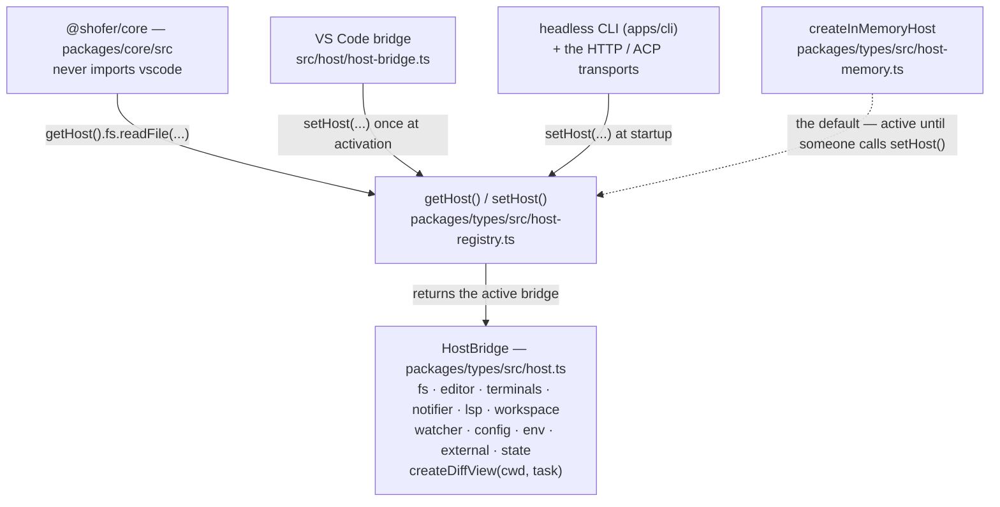
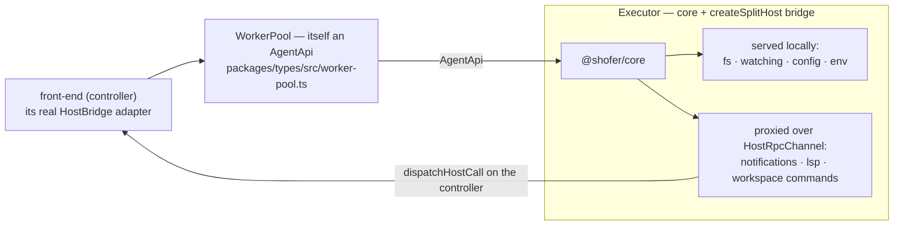

# The Host Boundary

`@shofer/core` (`packages/core/src`) is the portable agent engine. It must never
import `vscode`. Everything it needs from its environment — filesystem,
notifications, editor, terminals, language services, config, workspace, external
open — it reaches through one seam: the **`HostBridge`**. This doc is the
contributor how-to for that seam: how it resolves, how to add a capability, and
how tests use it.

## How `getHost()` / `setHost()` / `HostBridge` work

- **`HostBridge`** ([`packages/types/src/host.ts`](../packages/types/src/host.ts))
  is the aggregate interface. Its members are grouped capabilities — `fs`
  (`HostFileSystem`), `editor` (`HostEditor`), `terminals` (`HostTerminals`),
  `notifier` (`Notifier`), `lsp` (`HostLsp`), `workspace` (`HostWorkspace`),
  `watcher`, `config`, `env`, `external`, `state`, plus `createDiffView(cwd, task)`.
  Every method signature is DTO-based (plain data in, plain data out), which is
  what lets the same interface run in-process _and_ over RPC.

- **`getHost()` / `setHost()`**
  ([`packages/types/src/host-registry.ts`](../packages/types/src/host-registry.ts))
  are the accessor and injector. The registry lives in `@shofer/types` precisely
  so importing `getHost()` pulls in no front-end adapter. It defaults to an
  in-memory host, so the core is usable with nobody having called `setHost()`:

    ```ts
    let host: HostBridge = createInMemoryHost()
    export function setHost(bridge: HostBridge): void {
    	host = bridge
    }
    export function getHost(): HostBridge {
    	return host
    }
    ```

- **Who calls `setHost()`.** The VS Code extension calls it once at activation
  with its `vscode`-backed bridge; the headless CLI (`apps/cli`) and the HTTP/ACP
  transports register their own. Core code just calls `getHost().fs.readFile(…)`.



The two implementations of the interface are the **Category I / Category II**
split: Category I = the interfaces in `@shofer/types`; Category II = a concrete
adapter (the VS Code one in `src/`, the in-memory one in `@shofer/types`).

## Adding a host capability

To let the core reach a new piece of the environment, add it to the boundary in
four places (all four, or the build breaks — every implementation must satisfy the
interface):

1. **Declare it** in the relevant interface in
   [`packages/types/src/host.ts`](../packages/types/src/host.ts). Extend an
   existing capability (e.g. add a method to `HostEditor`) or, for a whole new
   area, add a new interface and a member on `HostBridge`. Keep parameters and
   return types DTO-shaped (no `vscode.*` types) so the capability stays
   remoteable.

2. **Implement the VS Code adapter** in
   [`src/host/host-bridge.ts`](../src/host/host-bridge.ts) — the real behavior,
   mapping to the `vscode` API.

3. **Implement the default** in
   [`packages/types/src/host-memory.ts`](../packages/types/src/host-memory.ts)
   (`createInMemoryHost`) — an in-memory / no-op version for the CLI and tests. A
   missing method here is a test-time crash, so this keeps the headless path
   honest.

4. **Proxy it** in [`packages/types/src/host-rpc.ts`](../packages/types/src/host-rpc.ts)
   _if_ the capability must cross a process boundary. `createSplitHost` proxies
   the front-end-bound slice (notifications, LSP, workspace commands) back to the
   controller; the workspace-scoped slice (fs, watching, config, env) is served
   locally on the executor. Add async, front-end-facing capabilities to the proxied
   set; leave synchronous, workspace-local ones served locally.

Then update the core call site to use `getHost().<capability>.<method>()`.

## How tests use the host instead of mocking `vscode`

Core tests never mock the `vscode` module. They install the in-memory host and, if
they need to observe or steer a capability, spread over it:

```ts
import { createInMemoryHost, setHost } from "@shofer/types"

beforeEach(() => {
	const host = createInMemoryHost()
	// Override just the slice under test:
	setHost({ ...host, notifier: { ...host.notifier, error: errorSpy } })
})
```

`RecordingNotifier` in `host-memory.ts` records messages rather than showing UI,
so assertions read them back. Because the default host is complete, most tests
need no host setup at all.

## Where the boundary is going: executors and distributed execution

Because Category I is DTO-based, a `HostBridge` can be split across a wire.
[`host-rpc.ts`](../packages/types/src/host-rpc.ts) (`createSplitHost` /
`dispatchHostCall`) makes the front-end-bound host slice remoteable, and
[`worker-pool.ts`](../packages/types/src/worker-pool.ts) builds on that: an
`WorkerPool` is itself an `AgentApi` that fans a front-end across one or more
**executors** (a local in-process agent, or remote ones), each running the core
against its own local host while proxying UI-bound calls back to the controller.
With a single executor it is behaviourally identical to driving the core directly.



See [`v3_architecture.md`](v3_architecture.md) for the full distributed-execution
model.
