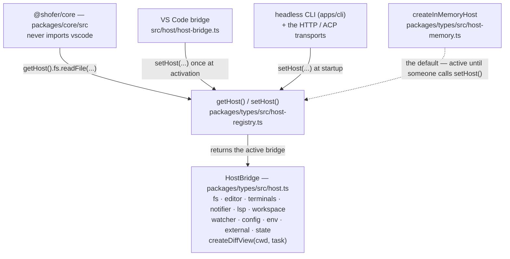

# The Host Boundary — Shofer's architecture

Shofer separates a **portable agent core** (the "brain" — task loop, tools,
prompts, model dispatch, context management) from the **front-end** that hosts
it (the VS Code extension, the CLI, a headless server). The core is written
against narrow, host-agnostic interfaces and never imports any front-end SDK;
each front-end provides concrete implementations of those interfaces. This doc
is the single description of that architecture and the contributor how-to for
its central seam, the **`HostBridge`**.

## Category I vs Category II

- **Category I — Host APIs (host-agnostic contracts).** The small set of
  capabilities the portable core needs from _whatever_ is hosting it, expressed
  as plain TypeScript interfaces with no platform types in their signatures.
  They live in **`@shofer/types`** (vscode-free) and are aggregated into one
  `HostBridge` object.
- **Category II — Front-end adapters (platform implementations).** The concrete
  implementation of Category I for a specific front-end, **plus** the
  platform-only surface that has no portable equivalent (rich editor UI, diff
  views, terminals, a platform's own language-model API). Category II is the
  _only_ place a platform SDK is imported.

Category I interfaces are **DTO-based**: they pass plain data (paths as
strings, positions as `{line, column}` numbers, edits as
`{startLine, …, newText}`), never platform objects. That is what makes them
implementable by any front-end and keeps the core's type graph free of
platform SDKs.

| Capability        | Interface                | What the core uses it for                                                                                    |
| ----------------- | ------------------------ | ------------------------------------------------------------------------------------------------------------ |
| Notifications     | `Notifier`               | info/warn/error messages + choice dialogs (`showChoice`)                                                     |
| Filesystem        | `HostFileSystem`         | read/write/exists/mkdir/delete + `findFiles` (glob)                                                          |
| Configuration     | `HostConfig`             | `get<T>(section, key, default)` settings reads                                                               |
| Environment       | `HostEnv`                | UI `language`, `appRoot` (locate bundled binaries), `machineId` (telemetry), `appInfo`                       |
| Language services | `HostLsp`                | diagnostics, references, workspace symbols, rename (DTO-based)                                               |
| Workspace actions | `HostWorkspace`          | open a folder, execute a command, workspace-folder change event, `visibleFiles`/`openTabs`                   |
| File watching     | `HostWatcher`            | watch a glob; create/change/delete callbacks                                                                 |
| Terminals         | `HostTerminals`          | integrated-terminal backend + shell-execution start/end events                                               |
| Diff view         | `createDiffView(...)`    | per-edit `DiffView` factory (open/update/save/revert)                                                        |
| External links    | `HostExternal`           | `openExternal` (open a URI in the OS/browser)                                                                |
| Editor surface    | `HostEditor`             | `revealInExplorer`/`openFile`/`focusPanel`/`showMultiFileDiff`/`readTerminalContents`/`getWorkspaceProblems` |
| Persisted state   | `HostState`              | `readModeOverrides` (mode/tooling overrides the front-end persists)                                          |
| Message storage   | `MessagePersistencePort` | durable api/UI message persistence (SQLite-backed)                                                           |

Alongside the host capabilities, two further seam families let the core stay
platform-free:

- **Front-end resolvers** the host supplies at startup — storage / cache-dir /
  token-counter / custom-storage resolvers — so core code that needs a durable
  location or a tokenizer does not reach for a `vscode.ExtensionContext`.
- **Core-side registries** (mirroring the `mcp-hub-factory` pattern): the
  **native-api-handler registry**
  (`packages/core/src/api/native-handler-registry.ts`, which the 2
  VS Code-only providers register into), and the **manager registries** for
  the code-index, git-index, live-memory, and skills subsystems. The core owns
  the portable half; the front-end registers its concrete VS Code manager
  against the registry.

Finally, two **interface abstractions** replace value-level coupling of the
core to the concrete VS Code provider: `TaskProviderLike` and `TaskManagerLike`
(`packages/core/src/task-provider/` + `@shofer/types/task-manager.ts`). Every
tool that once imported `ShoferProvider` now `import type`s the interface, so
`Task` and the tools name only the contract — never the Category II class.

## How `getHost()` / `setHost()` / `HostBridge` work

- **`HostBridge`** ([`packages/types/src/host.ts`](../packages/types/src/host.ts))
  is the aggregate interface. Its members are grouped capabilities — `fs`
  (`HostFileSystem`), `editor` (`HostEditor`), `terminals` (`HostTerminals`),
  `notifier` (`Notifier`), `lsp` (`HostLsp`), `workspace` (`HostWorkspace`),
  `watcher`, `config`, `env`, `external`, `state`, plus `createDiffView(cwd, task)`.

- **`getHost()` / `setHost()`**
  ([`packages/types/src/host-registry.ts`](../packages/types/src/host-registry.ts))
  are the accessor and injector. The registry lives in `@shofer/types` precisely
  so importing `getHost()` pulls in no front-end adapter. It defaults to an
  in-memory host, so the core is usable with nobody having called `setHost()`:

    ```ts
    let host: HostBridge = createInMemoryHost()
    export function setHost(bridge: HostBridge): void {
    	host = bridge
    }
    export function getHost(): HostBridge {
    	return host
    }
    ```

- **Who calls `setHost()`.** The VS Code extension calls it once at activation
  with its `vscode`-backed bridge; the headless CLI (`apps/cli`) and the HTTP/ACP
  transports register their own. Core code just calls `getHost().fs.readFile(…)`.



## The front-ends

The same core runs unchanged on any of:

- **VS Code extension** — `src/host/host-bridge.ts` implements every
  Category I interface against the `vscode` API, and `integrations/*` provides
  the rich UI (decorations, diff view, terminal, theme). Installed via
  `setHost(createVsCodeHost())` at activation. The rest of Category II lives in
  `src`: `ShoferProvider` (implements `TaskProviderLike`), `TaskManager`
  (implements `TaskManagerLike`), `ContextProxy`, the webview handlers, the
  `vscode-lm` and `openai-codex` providers (`src/api/providers/`, registered
  into the core native-handler registry), `McpServerManager`, the concrete
  VS Code terminal, `integrations/editor`, and `activate/*`.
- **CLI** (`apps/cli`) — implements Category I for a terminal: glob-based
  `findFiles`, stdout notifications, direct-to-disk edits, `execa` command
  execution. See [`cli.md`](cli.md).
- **Headless server** (`shofer serve`, `shofer acp`) — the same extension
  bundle loaded under the vscode-shim, exposing the agent over
  [`ShoferApi`](shofer-api.md) (HTTP/SSE) or [ACP](shofer-api.md#4-acp--the-external-adapter). Dialogs are left as
  outstanding asks for a client to answer; watchers and editor surfaces are
  inert.

The in-memory reference implementation (`createInMemoryHost`, in
`@shofer/types`) documents the minimum a Category II adapter must provide and
backs tests.

## Where the line is drawn

A file belongs in the portable core only if it can be written with zero
platform imports. Three kinds of code legitimately stay in Category II and are
**not** abstracted away (doing so would just recreate the platform API as an
interface):

1. **Front-end UI** — editor decorations, the live diff editor, the VS Code
   _integrated_ terminal, dialogs, theme (`integrations/*`). This is the
   adapter's job by definition. (Only the _presentation_ is Category II:
   command execution itself is portable — the terminal registry + `execa`
   backend are Category I core; the integrated terminal is one optional
   backend behind `HostTerminals`.)
2. **Platform-bound configuration** — objects handed a platform context
   (e.g. a `vscode.ExtensionContext`) are inherently front-end-scoped.
3. **A platform's own model API** — e.g. the VS Code Language Model provider
   is the VS Code LM API; it is one _provider_ among many, available only on
   that front-end.

## The portable core

The portable agent core lives in **`@shofer/core`** (`packages/core/src/`).
Everything below runs with no runtime platform import, reaching the host only
through Category I (`getHost()` + the registries above):

- **`Task`** — the agent task loop (the core's heart), at
  `packages/core/src/task/Task.ts`. It has zero `vscode.` references and
  reaches the platform only through `getHost()` and the host-agnostic
  `TypedEmitter` (`@shofer/types`).
- **All native tool implementations** (`packages/core/src/tools/`), plus
  `build-tools`, `BaseTool`, and the schema-as-contract primitive
  `defineNativeTool`.
- **Assistant-message dispatch** (`presentAssistantMessage`) and the native
  tool-call parser (`packages/core/src/assistant-message/`).
- **The model-dispatch subsystem** (`packages/core/src/api/`) — the
  host-agnostic providers, `transform/`, `buildApiHandler`, and the
  native-handler registry the 2 VS Code providers plug into.
- **Prompts** (`packages/core/src/prompts/`), plus `condense` and
  `context-management`.
- **Language + indexing engines** — `tree-sitter`
  (`packages/core/src/services/tree-sitter/`) and the code-index engine
  consumed by the `rag-indexing` plugin.
- **The transport layer** (`packages/core/src/transport/`) — the HTTP/SSE
  server + typed client and the ACP stack, all over the transport-agnostic
  [`ShoferApi`](shofer-api.md).
- **`slang`/workflow interpreter**, **`apply-patch`**, **`auto-approval`**,
  **`glob`**, the **`McpHub`**, **`shofer-config`**, **`extract-text`**, the
  **`diff`** strategies, tiktoken/token-counter, `safeWriteJson`, storage,
  i18n (`@shofer/core/i18n`, static locale imports), and the utils.
- **Context tracking** (`FileContextTracker`, `getEnvironmentDetails`,
  `mentions`, `message-manager`) and the **ignore controller**.

Persistence (Category I `MessagePersistencePort`) is SQLite-backed via Node's
built-in `node:sqlite` — no flat files, no native dependency.

Three VS Code-coupled subsystems `Task` depends on are abstracted behind
seams, their implementations staying Category II in `src`:

- `services/mcp/McpHub` routes through `getHost()` (config/watcher/fs + an
  `onDidChangeWorkspaceFolders` capability).
- `DiffViewProvider` sits behind the vscode-free `DiffView` interface, built
  via a `getHost().createDiffView(cwd, task)` factory — a live diff editor is
  intrinsically front-end presentation, so `DiffView` stays a Category I
  _interface_ over a wholly Category II implementation.
- The terminal subsystem splits along the
  `ShoferTerminalProvider = "vscode" | "execa"` line: command **execution is
  Category I** (the registry + `execa` backend live in
  `@shofer/core/terminal`), while the VS Code integrated terminal is one
  optional Category II backend, injected via a `HostTerminals.createTerminal`
  host factory.

## Adding a host capability

To let the core reach a new piece of the environment, add it to the boundary in
three places (all three, or the build breaks — every implementation must satisfy
the interface):

1. **Declare it** in the relevant interface in
   [`packages/types/src/host.ts`](../packages/types/src/host.ts). Extend an
   existing capability (e.g. add a method to `HostEditor`) or, for a whole new
   area, add a new interface and a member on `HostBridge`. Keep parameters and
   return types DTO-shaped (no `vscode.*` types).

2. **Implement the VS Code adapter** in
   [`src/host/host-bridge.ts`](../src/host/host-bridge.ts) — the real behavior,
   mapping to the `vscode` API.

3. **Implement the default** in
   [`packages/types/src/host-memory.ts`](../packages/types/src/host-memory.ts)
   (`createInMemoryHost`) — an in-memory / no-op version for the CLI and tests. A
   missing method here is a test-time crash, so this keeps the headless path
   honest.

Then update the core call site to use `getHost().<capability>.<method>()`.

## How tests use the host instead of mocking `vscode`

Core tests never mock the `vscode` module. They install the in-memory host and, if
they need to observe or steer a capability, spread over it:

```ts
import { createInMemoryHost, setHost } from "@shofer/types"

beforeEach(() => {
	const host = createInMemoryHost()
	// Override just the slice under test:
	setHost({ ...host, notifier: { ...host.notifier, error: errorSpy } })
})
```

`RecordingNotifier` in `host-memory.ts` records messages rather than showing UI,
so assertions read them back. Because the default host is complete, most tests
need no host setup at all.

## Shofer does not do remote agents

A Shofer host **executes locally**. It has no notion of dispatching a task to
another machine, attaching to one running elsewhere, or discovering a fleet — and
that is a deliberate boundary, not a gap waiting to be filled.

What a host does expose is the [`ShoferApi`](shofer-api.md) transport, so
something else can drive _it_: `shofer serve` makes a headless host drivable over
HTTP/SSE, which is how an integrator turns one into a worker for its own
scheduler. Work then arrives **pulled** by that integration, never pushed by
another Shofer.

## What we deliberately keep

The host boundary preserves the things that make Shofer strong and that a
generic agent-backend design tends to lose:

- **Rich, typed tool catalog** with golden-snapshot contracts.
- **Spend caps and honest cost/limit accounting** driven by the model catalog.
- **Per-model tool customization** and a unified permission engine.
- **First-class editor integration** (the Category II VS Code adapter) —
  abstracting the core does not flatten the IDE experience; it makes the IDE
  one front-end among several.
