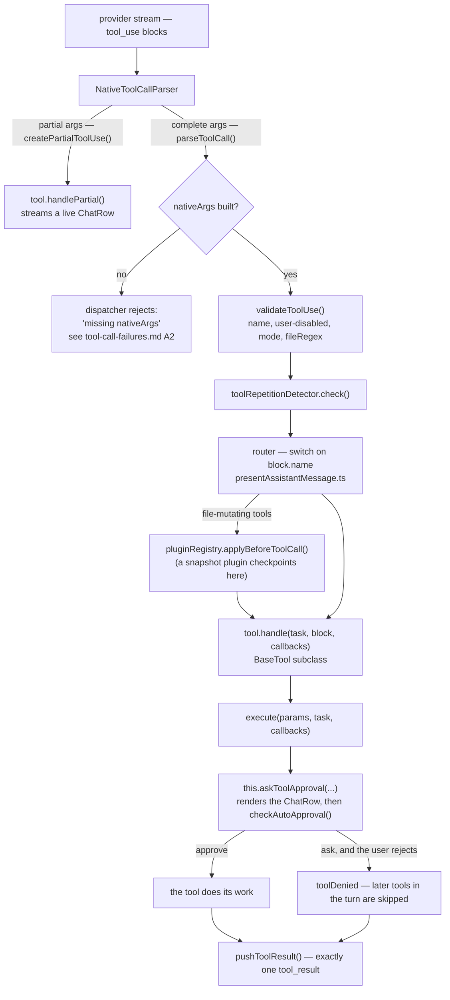
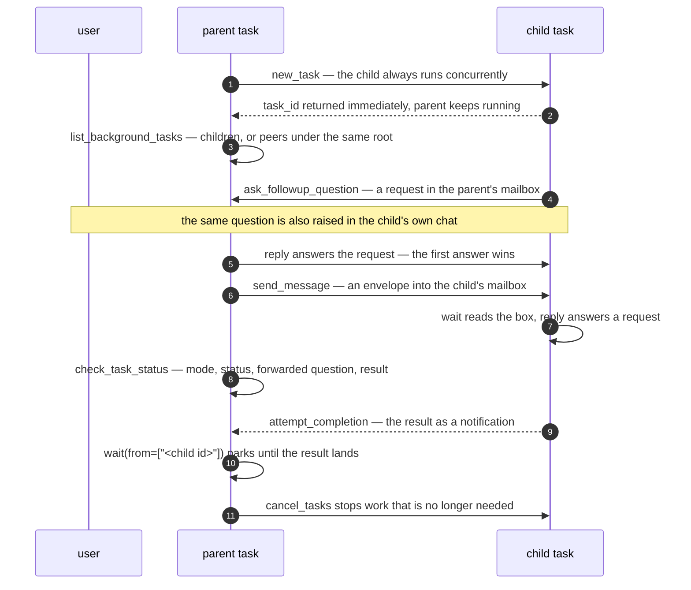
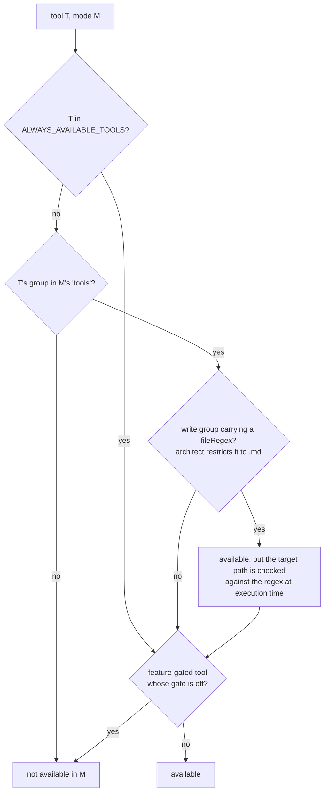

# Shofer Native Tools Reference

Complete reference for all native tools available in Shofer, their mode availability, and current status.

> **Defining a tool.** Native tools are defined once as a Zod schema via
> `defineNativeTool` (`packages/core/src/prompts/tools/native-tools/defineNativeTool.ts`),
> from which the OpenAI function definition and the static argument type are
> derived (schema-as-contract). A golden-snapshot test locks each tool's schema.
> See [`adding-new-tools.md`](adding-new-tools.md) for the full procedure.

## How a native tool call is dispatched

Every tool in this reference travels the same path. Nothing below is per-tool:
the only tool-specific pieces are the parser case that builds `nativeArgs`, the
router case, and the handler itself.



Mode filtering is **not** in this path: it happens upstream, when the tool list
is built (see [§Mode × Tool Availability](#mode--tool-availability) and
[`tool_access.md`](tool_access.md)). A handler never inspects the current mode —
by the time `execute()` runs, the filter has already authorized the call.

## Mode Availability

The six built-in modes, contributed by the bundled `builtin-config` plugin ([`plugins/builtin-config/plugin.json`](../plugins/builtin-config/plugin.json)). See [`plugins/builtin-config/docs/modes.md`](../plugins/builtin-config/docs/modes.md) for the authoritative source.

| Mode           | Groups                                                                              | Description                     |
| -------------- | ----------------------------------------------------------------------------------- | ------------------------------- |
| 💻 Code        | `read`, `write`, `execute`, `mcp`, `mode`, `subtasks`, `questions`, `uncategorized` | Write and modify code (default) |
| 🏗️ Architect   | `read`, `write` (md only), `mcp`, `subtasks`, `questions`                           | Plan and design                 |
| 🪲 Debug       | `read`, `write`, `execute`, `mcp`, `subtasks`, `questions`, `uncategorized`         | Diagnose and fix issues         |
| 🔎 Code Search | `read`, `execute`, `mcp`, `questions`                                               | Search and explore the codebase |
| 🌐 Web Search  | `browser`, `questions`, `mcp`                                                       | Browse and extract web content  |
| 👀 Reviewer    | `read`, `execute`, `mcp`, `subtasks`, `questions`                                   | Review code and identify issues |

**Always-available tools** bypass mode filtering entirely (see column below).

---

## Tool Status Legend

| Status | Meaning                                                      |
| ------ | ------------------------------------------------------------ |
| ✅     | Fully implemented, schema + handler                          |
| 🔒     | Feature-gated (requires experiment flag or external service) |
| 🔧     | Legacy/custom tool (alias-based, model-dependent)            |

### Origin

| Tag   | Meaning                                                 |
| ----- | ------------------------------------------------------- |
| 🆕 WS | Ported from `workspace-tools` extension in this session |
| 🔵 RC | Pre-existing Shofer tool                                |
| 🟣 AW | New Shofer.Dev tool (custom addition)                   |

---

## File Operations

> **Worktree isolation:** When a task runs inside `.worktrees/<name>/`, all mutating tools (`write_to_file`, `apply_diff`, `create_directory`, `file`, `insert_edit`, `sed`) validate that the target path stays within the assigned worktree. Attempts to write to the master checkout or another worktree are blocked. See [`plugins/basics/docs/worktrees.md` §5](../plugins/basics/docs/worktrees.md#5-what-core-keeps-confinement).

| Tool                   | Origin | Group | Always Available | Status | Description                                    |
| ---------------------- | :----: | ----- | :--------------: | :----: | ---------------------------------------------- |
| `read_file`            | 🔵 RC  | read  |        –         |   ✅   | Read file contents with line range             |
| `write_to_file`        | 🔵 RC  | write |        –         |   ✅   | Create or overwrite a file                     |
| `apply_diff`           | 🔵 RC  | write |        –         |   ✅   | Apply precise targeted modifications           |
| `create_directory`     | 🆕 WS  | write |        –         |   ✅   | Create directory (mkdir -p)                    |
| `file`                 | 🟣 AW  | write |        –         |   ✅   | Filesystem ops (rm/mv) tracked as Shofer edits |
| `insert_edit`          | 🆕 WS  | write |        –         |   ✅   | Insert text at a specific line:column position |
| `list_files`           | 🔵 RC  | read  |        –         |   ✅   | List files and directories at a path           |
| `create_new_workspace` | 🆕 WS  | write |        –         |   ✅   | Create new workspace directory structure       |
| `sed`                  | 🟣 AW  | write |        –         |   ✅   | Regex find-and-replace on a workspace file     |

### `read_file`

Read a file's contents with two modes: slice (offset/limit) and indentation (semantic block extraction).

| Param                          | Type                                 | Required | Description                                                        |
| ------------------------------ | ------------------------------------ | :------: | ------------------------------------------------------------------ |
| `path`                         | string                               |    ✅    | File path relative to workspace                                    |
| `filePath`                     | string \| null                       |    –     | Alias for `path` (model hallucination resilience)                  |
| `mode`                         | `"slice"` \| `"indentation"` \| null |    –     | Reading mode: `"slice"` (default) or `"indentation"`               |
| `offset`                       | number \| null                       |    –     | 1-based line to start reading from (slice mode, default: 1)        |
| `limit`                        | number \| null                       |    –     | Maximum lines to return (default: 2000)                            |
| `indentation`                  | object \| null                       |    –     | Indentation-mode options (only used when `mode === "indentation"`) |
| `indentation.anchor_line`      | number                               |    –     | 1-based line anchoring code block extraction                       |
| `indentation.max_levels`       | number \| null                       |    –     | Maximum indentation levels above anchor (0 = unlimited, default)   |
| `indentation.include_siblings` | boolean \| null                      |    –     | Include sibling blocks at same indentation (default: false)        |
| `indentation.include_header`   | boolean \| null                      |    –     | Include file header/imports (default: true)                        |
| `indentation.max_lines`        | number \| null                       |    –     | Hard cap on lines for indentation mode                             |

### `write_to_file`

Create a new file or overwrite an existing file with content.

| Param     | Type   | Required | Description                     |
| --------- | ------ | :------: | ------------------------------- |
| `path`    | string |    ✅    | File path relative to workspace |
| `content` | string |    ✅    | Full file content               |

### `apply_diff`

Apply precise, targeted modifications to an existing file using a diff format.

> **⚠️ Common pitfall:** If the SEARCH or REPLACE content contains lines that
> look like diff markers (`=======`, `<<<<<<<`, `>>>>>>>`), you MUST prepend a
> backslash (`\`) to those lines to escape them (e.g., `\=======`). The parser
> treats unescaped markers as block delimiters.

| Param  | Type   | Required | Description                             |
| ------ | ------ | :------: | --------------------------------------- |
| `path` | string |    ✅    | File path                               |
| `diff` | string |    ✅    | Diff content with search/replace blocks |

### `create_directory`

Creates a directory including parent directories (mkdir -p).

| Param  | Type   | Required | Description                          |
| ------ | ------ | :------: | ------------------------------------ |
| `path` | string |    ✅    | Directory path relative to workspace |

### `file`

Filesystem operations on workspace files. Use this instead of `execute_command` with `rm`/`mv` so the operation is captured in the file-changes panel and is reversible from there.

Subcommands:

- `rm`: Delete a file (or directory tree when `recursive=true`).
- `mv`: Move/rename a file or directory. Destination must not already exist.

| Param         | Type             | Required | Description                                             |
| ------------- | ---------------- | :------: | ------------------------------------------------------- |
| `subcommand`  | `"rm"` \| `"mv"` |    ✅    | Operation to perform                                    |
| `path`        | string           |    ✅    | Source path relative to workspace                       |
| `destination` | string \| null   |    ✅    | Destination path for `mv` (required when `mv`)          |
| `recursive`   | boolean \| null  |    ✅    | For `rm`: recursive directory delete (default: `false`) |

Both endpoints of an `mv` are recorded in `FileContextTracker` as `shofer_edited`, so the panel shows the source as deleted (revertable) and the destination as created (revertable). For directories, every contained file is individually tracked.

### `insert_edit`

Inserts text at a specific position in a file using VS Code's WorkspaceEdit API.

| Param      | Type   | Required | Description                                       |
| ---------- | ------ | :------: | ------------------------------------------------- |
| `path`     | string |    ✅    | File path relative to workspace                   |
| `filePath` | string |    –     | Alias for `path` (model hallucination resilience) |
| `line`     | number |    ✅    | 1-based line number                               |
| `column`   | number |    ✅    | 1-based column number                             |
| `text`     | string |    ✅    | Text to insert                                    |

### `sed`

Performs regex find-and-replace on a workspace file, similar to `sed 's/pattern/replacement/g'`. Uses JavaScript RegExp syntax. Supports capture group backreferences ($1, $2, etc.).

> **⚠️ Common pitfalls (regex metacharacters):**
>
> **`|` (pipe) — the alternation trap:** In regex, `|` is the OR operator.
> A pattern like `| A | B |` is parsed as `(empty) OR " A " OR " B " OR (empty)`.
> The empty alternatives match **every single character boundary** in the file —
> injecting the replacement between every character (5,000+ replacements instead of 1).
> To match a literal pipe, use `\|` or `[|]`. **Always escape pipes in markdown
> table content or any text containing `|`.**
>
> **`.` (dot) — the wildcard trap:** The `.` character matches ANY character
> (letter, slash, punctuation, etc.), not just a literal dot/period. To match
> a literal dot, use `\.` or `[.]`.
>
> **Other metacharacters requiring escaping for literal matching:** > `* + ? ( ) [ ] { } ^ $ \`
>
> **Automatic fallback:** If the regex produces zero matches and the pattern
> contains metacharacters, the tool automatically retries with all metacharacters
> escaped as a literal string. This does NOT protect against the `|` trap because
> `|` produces catastrophic matches, not zero matches — always escape your pipes.

| Param         | Type            | Required | Description                                                                         |
| ------------- | --------------- | :------: | ----------------------------------------------------------------------------------- |
| `path`        | string          |    ✅    | File path relative to workspace                                                     |
| `pattern`     | string          |    ✅    | Regex pattern (JavaScript RegExp syntax). Escape metacharacters like \| . \* + etc. |
| `replacement` | string          |    ✅    | Replacement string (supports $1, $2, etc.)                                          |
| `global`      | boolean \| null |    ✅    | Replace all occurrences (default: true)                                             |

### `create_new_workspace`

Creates a new workspace/project directory structure with optional subdirectories.

| Param             | Type             | Required | Description                         |
| ----------------- | ---------------- | :------: | ----------------------------------- |
| `path`            | string           |    ✅    | Parent directory                    |
| `name`            | string           |    ✅    | Workspace/project name              |
| `folders`         | string[] \| null |    ✅    | Subdirectories to create            |
| `openInNewWindow` | boolean \| null  |    ✅    | Open in new window (default: false) |

---

## Search & Discovery

| Tool               | Origin | Group | Always Available | Status | Description                                        |
| ------------------ | :----: | ----- | :--------------: | :----: | -------------------------------------------------- |
| `grep_search`      | 🔵 RC  | read  |        –         |   ✅   | Regex/literal search across files with context     |
| `find_files`       | 🆕 WS  | read  |        –         |   ✅   | Find files by glob pattern                         |
| `list_code_usages` | 🆕 WS  | read  |        –         |   ✅   | Find all symbol references (LSP)                   |
| `rag_search`       | 🔵 RC  | read  |        –         |   🔒   | Semantic code search (requires code index)         |
| `lsp_search`       | 🆕 WS  | read  |        –         |   ✅   | Symbol search via LSP + text fallback              |
| `git_search`       | 🟣 AW  | read  |        –         |   ✅   | Search git history (commit messages only)          |
| `ask_live_memory`  | 🆕 WS  | read  |        –         |   ✅   | Ask the persistent live memory a codebase question |

### `grep_search`

Unified search using VS Code's indexed `workspace.findTextInFiles` API. Supports both regex and literal text search, case-sensitive/whole-word matching, file type filtering, exclusion patterns, configurable context lines, and result capping. Replaces the former `get_search_results` tool.

| Param            | Type            | Required | Description                                                 |
| ---------------- | --------------- | :------: | ----------------------------------------------------------- |
| `path`           | string          |    ✅    | Directory to search recursively, relative to workspace      |
| `query`          | string          |    ✅    | Search pattern (regex or literal text)                      |
| `fileTypes`      | string \| null  |    ✅    | Glob to filter files (e.g., `*.ts`, `**/*.go`). null = all. |
| `excludePattern` | string \| null  |    ✅    | Glob to exclude files (e.g., `**/node_modules/**`)          |
| `isRegex`        | boolean \| null |    ✅    | Whether query is a regex (default: true)                    |
| `caseSensitive`  | boolean \| null |    ✅    | Case-sensitive matching (default: false)                    |
| `wholeWord`      | boolean \| null |    ✅    | Match whole words only (default: false)                     |
| `maxResults`     | number \| null  |    ✅    | Maximum total results (default: 100)                        |
| `contextBefore`  | number \| null  |    ✅    | Lines of context before each match (default: 1)             |
| `contextAfter`   | number \| null  |    ✅    | Lines of context after each match (default: 1)              |

### `find_files`

Find files matching a glob pattern using VS Code's `workspace.findFiles`. Patterns are resolved relative to the workspace root — prepend `**/` when unsure of the exact directory prefix. Excludes `node_modules`, `.git`, `bazel-*`, and `.worktrees/` automatically.

| Param        | Type   | Required | Description                                                                  |
| ------------ | ------ | :------: | ---------------------------------------------------------------------------- |
| `pattern`    | string |    ✅    | Glob pattern resolved from workspace root (e.g., `**/*.ts`, `**/browser.ts`) |
| `maxResults` | number |    –     | Max results (default: 100)                                                   |

### `list_code_usages`

Finds all references of a symbol using VS Code's LSP reference provider.

| Param      | Type   | Required | Description                                       |
| ---------- | ------ | :------: | ------------------------------------------------- |
| `path`     | string |    ✅    | File containing the symbol                        |
| `filePath` | string |    –     | Alias for `path` (model hallucination resilience) |
| `line`     | number |    ✅    | 1-based line number                               |
| `column`   | number |    ✅    | 1-based column number                             |

### `lsp_search`

Searches the codebase using the LSP workspace symbol provider. Falls back to word-level text search when no language server is available. Requires no external infrastructure.

| Param        | Type           | Required | Description                         |
| ------------ | -------------- | :------: | ----------------------------------- |
| `query`      | string         |    ✅    | Symbol name or text to search for   |
| `maxResults` | number \| null |    ✅    | Max results to return (default: 20) |

### `git_search`

Semantic search over git commit history (commit messages only — not diffs, not file contents). Uses embedding-based cosine similarity against a Qdrant collection of indexed commit messages. Requires the git index to be enabled and initialized. Optionally filtered by an ISO 8601 date range applied as a post-filter on `author_date`.

| Param        | Type           | Required | Description                                                                                                        |
| ------------ | -------------- | :------: | ------------------------------------------------------------------------------------------------------------------ |
| `query`      | string         |    ✅    | Text to search for in git history                                                                                  |
| `maxResults` | number \| null |    ✅    | Max results to return (default: 20)                                                                                |
| `since`      | string \| null |    ✅    | Optional ISO 8601 date string (e.g., `"2024-01-01T00:00:00Z"`). Only include commits where `author_date >= since`. |
| `until`      | string \| null |    ✅    | Optional ISO 8601 date string (e.g., `"2024-12-31T23:59:59Z"`). Only include commits where `author_date <= until`. |

### `rag_search`

🔒 Requires code index to be enabled, configured, and initialized.

| Param        | Type           | Required | Description                                   |
| ------------ | -------------- | :------: | --------------------------------------------- |
| `query`      | string         |    ✅    | Natural language search query                 |
| `path`       | string \| null |    –     | Directory scope (relative to workspace)       |
| `maxResults` | number \| null |    –     | Maximum code snippets to return (default: 10) |

### `ask_live_memory`

Ask a question to the persistent **live memory** — a separate, cost-optimized tool-using agent that maintains long-term context about the codebase across questions. Use this for codebase-knowledge questions that don't require the calling task's full conversation context to be loaded.

The tool is synchronous: the calling task blocks until the assistant returns an answer, the `timeoutMs` hard limit is reached, or the assistant is cancelled. The live memory runs its own tool loop using the read-only native tools (`read_file`, `grep_search`, `find_files`, …) under its own model configuration.

| Param              | Type             | Required | Description                                                                                                                                                           |
| ------------------ | ---------------- | :------: | --------------------------------------------------------------------------------------------------------------------------------------------------------------------- |
| `question`         | string           |    ✅    | The question to ask the live memory.                                                                                                                                  |
| `contextFiles`     | string[] \| null |    –     | File paths the assistant should preload into its context window for this question.                                                                                    |
| `timeoutMs`        | number \| null   |    –     | **Hard** maximum wall time in milliseconds (default: 300000 = 5 minutes). On timeout the assistant is aborted and a timeout error is returned.                        |
| `softTimeoutSec`   | number \| null   |    –     | Soft recommendation (in seconds) for how long the assistant should spend on the question (default: 60). Embedded as prompt guidance; not enforced via cancellation.   |
| `softResultLength` | number \| null   |    –     | Soft recommendation (in characters) for the maximum length of the assistant's final answer (default: 2000). Embedded as prompt guidance; not enforced via truncation. |

---

## Code Analysis & Refactoring

> **Worktree isolation:** `rename_symbol` validates **every** file the rename would touch against the worktree boundary (not just the source) and blocks the whole rename if any affected path is outside it — see [`worktree-shell-sandboxing.md`](worktree-shell-sandboxing.md) §"rename_symbol Isolation". (Mode-level `fileRegex` restrictions remain source-path-derived; see [`adding-new-tools.md`](adding-new-tools.md).)

| Tool                     | Origin | Group | Always Available | Status | Description                                        |
| ------------------------ | :----: | ----- | :--------------: | :----: | -------------------------------------------------- |
| `get_errors`             | 🆕 WS  | read  |        –         |   ✅   | Get compile/lint diagnostics                       |
| `get_project_setup_info` | 🆕 WS  | read  |        –         |   ✅   | Detect project languages, frameworks, build system |
| `read_project_structure` | 🆕 WS  | read  |        –         |   ✅   | ASCII tree of workspace structure                  |
| `rename_symbol`          | 🆕 WS  | write |        –         |   ✅   | Rename symbol across codebase (LSP)                |
| `view_image`             | 🆕 WS  | read  |        –         |   ✅   | View image file for visual analysis                |

### `get_errors`

Retrieves compile/lint errors and warnings from VS Code's language server diagnostics.

| Param       | Type             | Required | Description                       |
| ----------- | ---------------- | :------: | --------------------------------- |
| `filePaths` | string[] \| null |    ✅    | Files to check (null = all files) |

### `get_project_setup_info`

Analyzes workspace root for config files and detects languages, frameworks, build systems, and package managers.

**Parameters:** None.

### `read_project_structure`

Returns an ASCII tree of the directory structure, skipping noise directories (node_modules, .git, bazel-\*, etc.).

| Param           | Type            | Required | Description                       |
| --------------- | --------------- | :------: | --------------------------------- |
| `maxDepth`      | number \| null  |    ✅    | Maximum depth (default: 3)        |
| `includeHidden` | boolean \| null |    ✅    | Include dotfiles (default: false) |

### `rename_symbol`

Renames a symbol and all references across the codebase using VS Code's LSP rename provider.

| Param      | Type   | Required | Description                                       |
| ---------- | ------ | :------: | ------------------------------------------------- |
| `path`     | string |    ✅    | File containing the symbol                        |
| `filePath` | string |    –     | Alias for `path` (model hallucination resilience) |
| `line`     | number |    ✅    | 1-based line number                               |
| `column`   | number |    ✅    | 1-based column number                             |
| `newName`  | string |    ✅    | New name for the symbol                           |

### `view_image`

Reads an image file and returns base64-encoded data for visual analysis.

| Param      | Type   | Required | Description                                       |
| ---------- | ------ | :------: | ------------------------------------------------- |
| `path`     | string |    ✅    | Path to image file                                |
| `filePath` | string |    –     | Alias for `path` (model hallucination resilience) |

Supported formats: PNG, JPG, JPEG, GIF, BMP, SVG, WEBP.

---

## Execution & System

> **Worktree isolation:** `execute_command` is **not sandboxed** — it can escape the worktree via `cd`, absolute paths, or redirects. When running in a worktree task, the approval prompt displays a ⚠️ warning showing the worktree context. See [`plugins/basics/docs/worktrees.md` §5](../plugins/basics/docs/worktrees.md#5-what-core-keeps-confinement).

| Tool                  | Origin | Group   | Always Available | Status | Description                                 |
| --------------------- | :----: | ------- | :--------------: | :----: | ------------------------------------------- |
| `execute_command`     | 🔵 RC  | execute |        –         |   ✅   | Execute a CLI command                       |
| `read_command_output` | 🔵 RC  | execute |        –         |   ✅   | Get full output of a truncated command      |
| `fetch_web_page`      | 🆕 WS  | read    |        –         |   ✅   | Fetch and extract web page content          |
| `read_output_channel` | 🟣 AW  | read    |        –         |   ✅   | List/read VS Code Output panel log channels |

### `execute_command`

Execute a CLI command in the user's terminal.

| Param     | Type           | Required | Description        |
| --------- | -------------- | :------: | ------------------ |
| `command` | string         |    ✅    | Command to execute |
| `cwd`     | string \| null |    –     | Working directory  |
| `timeout` | number \| null |    –     | Timeout in seconds |

### `read_command_output`

Retrieve the full output from a previously truncated command execution. Supports search filtering and pagination.

| Param         | Type           | Required | Description                                                          |
| ------------- | -------------- | :------: | -------------------------------------------------------------------- |
| `artifact_id` | string         |    ✅    | The artifact ID from the truncated command                           |
| `search`      | string \| null |    –     | Optional regex or literal pattern to filter lines (case-insensitive) |
| `offset`      | number \| null |    –     | Byte offset to start reading from (default: 0)                       |
| `limit`       | number \| null |    –     | Maximum bytes to return (default: 40KB)                              |

### `fetch_web_page`

Fetches web pages, strips HTML, and returns extracted text content. Supports query-based filtering.

| Param   | Type           | Required | Description                        |
| ------- | -------------- | :------: | ---------------------------------- |
| `urls`  | string[]       |    ✅    | URLs to fetch                      |
| `query` | string \| null |    ✅    | Filter query for extracted content |

### `read_output_channel`

Lists and reads VS Code **Output panel** channels (extension logs, language servers, Git, Tasks, Shofer, etc.). The VS Code `OutputChannel` API is **write-only** with no enumeration or read access, so this tool instead reads the per-session `*.log` files VS Code persists on disk — resolved from the extension's `context.logUri`. It covers both log-type channels (`<exthost>/<pub.ext>/<Name>.log`) and plain channels (`<exthost>/output_logging_<ts>/<n>-<Name>.log`).

**Scope:** the current VS Code session only (a window reload starts a new session directory). Content is flushed asynchronously, so the last few lines may lag. Under the headless `vscode-shim` host there are no real logs and the tool reports none.

Two modes:

- **List mode** (omit `channel`): enumerate the session's channels with tier (`core` / `window` / `extension` / `output`) and size.
- **Read mode** (`channel` set): read that channel's log. Defaults to tailing the most-recent bytes. Supports a regex line filter, a minimum-severity filter, and pagination, all bounded by a hard byte cap.

| Param      | Type            | Required | Description                                                                                                       |
| ---------- | --------------- | :------: | ----------------------------------------------------------------------------------------------------------------- |
| `channel`  | string \| null  |    –     | Channel name to read (as shown in list mode). Omit entirely to list channels.                                     |
| `search`   | string \| null  |    –     | Case-insensitive regex line filter (read mode). Invalid regex falls back to literal matching.                     |
| `severity` | string \| null  |    –     | Minimum severity to include: `trace`/`debug`/`info`/`warning`/`error`. Only meaningful for `[level]`-tagged logs. |
| `tail`     | boolean \| null |    –     | Read the most-recent bytes first (default `true`). Ignored when `offset` is set.                                  |
| `offset`   | number \| null  |    –     | Byte offset to start reading from (pagination); reads forward from there.                                         |
| `limit`    | number \| null  |    –     | Maximum bytes to return. Default 40KB, **hard-capped at 256KB** — output is never unlimited.                      |

Severity filtering is best-effort: it parses the first `[level]` token VS Code's `LogOutputChannel` emits per line; continuation lines (stack traces) inherit the previous line's level. Plain channels with no level tokens return nothing under a severity filter. When `search`/`severity` are active, the byte `limit` keeps the most-recent matches (or the first matches when `tail=false`).

---

## Task Management

| Tool                    | Origin | Group    | Always Available | Status | Description                                                          |
| ----------------------- | :----: | -------- | :--------------: | :----: | -------------------------------------------------------------------- |
| `ask_followup_question` | 🔵 RC  | –        |        ✅        |   ✅   | Ask the user a question (suggested answers and/or typed form)        |
| `attempt_completion`    | 🔵 RC  | –        |        ✅        |   ✅   | Signal task completion                                               |
| `switch_mode`           | 🔵 RC  | mode     |        ✅        |   ✅   | Switch own or child task to a different mode                         |
| `new_task`              | 🔵 RC  | subtasks |        –         |   ✅   | Spawn a concurrent child task                                        |
| `check_task_status`     | 🟣 AW  | subtasks |        –         |   ✅   | Check status/result of a child task                                  |
| `cancel_tasks`          | 🟣 AW  | subtasks |        –         |   ✅   | Cancel one or more running child tasks                               |
| `list_background_tasks` | 🟣 AW  | –        |        ✅        |   ✅   | List background tasks (children or peers)                            |
| `send_message`          | 🟣 AW  | –        |        ✅        |   ✅   | Put an envelope in another task's mailbox                            |
| `reply`                 | 🟣 AW  | –        |        ✅        |   ✅   | Answer requests sitting in this task's mailbox                       |
| `wait`                  | 🟣 AW  | –        |        ✅        |   ✅   | Read this task's mailbox, parking until mail arrives                 |
| `update_todo_list`      | 🔵 RC  | –        |        ✅        |   ✅   | Update the TODO list                                                 |
| `skills`                | 🔵 RC  | –        |        ✅        |   ✅   | Load and execute a skill                                             |
| `set_task_title`        | 🟣 AW  | –        |        ✅        |   ✅   | Set descriptive title for the task                                   |
| `give_feedback`         | 🟣 AW  | –        |        ✅        |   ✅   | Send feedback to the Shofer.Dev developers                           |
| `describe_tools`        | 🟣 AW  | –        |   ✅ (tiered)    |   ✅   | Return the full parameter schema of tools the mode declared as stubs |

The subtask tools form one control plane around a child. The parent holds every
lever, and because it is never blocked it is always able to pull one. Results
and questions both arrive as mail ([`task_messaging.md`](task_messaging.md)):



### `ask_followup_question`

Ask the user a question to gather information needed to proceed. Provides **two
answer-collection mechanisms** — supply EITHER (or both):

- **`follow_up`** — a short list of one-click suggested answers. Best for simple
  pick-one-of-a-few choices. Each suggestion may carry a `mode` to switch modes
  when chosen. Rendered as clickable buttons (`FollowUpSuggest`).
- **`form`** — a typed input form rendering rich widgets. Best for structured,
  validated, or multiple values collected at once. Answers are returned to the
  model as a single JSON object keyed by each field's `name`. Rendered by
  `WorkflowParamForm`.

| Param       | Type          | Required | Description                                                                   |
| ----------- | ------------- | :------: | ----------------------------------------------------------------------------- |
| `question`  | string        |    ✅    | Clear, specific question capturing the missing information                    |
| `follow_up` | array \| null |    ⚠️    | 2–4 suggested answers (`{ text, mode }`). `null` when using a form. See note. |
| `form`      | array \| null |    ⚠️    | Typed input fields (see below). `null` when using suggestions. See note.      |

> ⚠️ Both `follow_up` and `form` are listed in the schema's `required` array (so
> the model must emit both keys for strict mode), but each is **nullable**. The
> handler requires that **at least one** is a non-empty array; a call with both
> `null`/empty fails with a missing-`follow_up` error.

**`form` field shape** (mirrors [`ParamField`](../packages/types/src/followup.ts)):

| Field         | Type                                                | Description                                            |
| ------------- | --------------------------------------------------- | ------------------------------------------------------ |
| `name`        | string                                              | JSON key the answer is returned under                  |
| `type`        | `"string"\|"number"\|"boolean"`                     | Base data type (drives answer coercion)                |
| `description` | string \| null                                      | Optional markdown shown beneath the field label        |
| `widget`      | `"dropdown"\|"radio"\|"checkbox"\|"slider"` \| null | Presentation override; `null` infers from type/options |
| `options`     | string[] \| null                                    | Allowed values for dropdown/radio/checkbox             |
| `min`/`max`   | number \| null                                      | Slider/number bounds                                   |
| `step`        | number \| null                                      | Slider step increment                                  |
| `default`     | string\|number\|boolean \| null                     | Value used when the field is left blank                |

**Widget selection** (per field, in `WorkflowParamForm.widgetFor`):

| Field config                                          | Widget rendered                          |
| ----------------------------------------------------- | ---------------------------------------- |
| `type: "boolean"`                                     | single checkbox toggle                   |
| `options` present + `widget: "dropdown"` (or omitted) | single-select dropdown                   |
| `options` present + `widget: "radio"`                 | radio buttons                            |
| `options` present + `widget: "checkbox"`              | multi-select checkboxes (answer = array) |
| `type: "number"` + `widget: "slider"` or `min`+`max`  | slider                                   |
| `type: "number"` otherwise                            | number input                             |
| `type: "string"`, no options                          | multiline free-text box                  |

**Answer flow (form mode):** the webview submits all values at once as an
`objectResponse` (not a chat-echoed `messageResponse`); `task.ask("followup", …)`
resolves with the JSON answer string, which is returned to the model as the tool
result. The handler also calls `task.markFollowupFormAnswered(values)` to embed
`answeredValues` onto the question message so the form re-renders **read-only**
after a reload.

**Child tasks:** a child's question is **dual-channel** — it is raised in the
child's own chat as usual **and** delivered to the parent's mailbox as a
`request` (subject `question: <first line>`, body the question plus its
suggestions). A human may answer in the child's chat, the parent may answer with
[`reply`](task_messaging.md); the **first answer wins** and the other channel is
withdrawn. Because the parent answers in free text, form-mode calls from a child
forward the bare question text — the form widgets reach the child's own chat
only. See [`task_messaging.md` § Rewired tools](task_messaging.md#rewired-tools).

Example (suggested answers with a mode switch):

```json
{
	"question": "Would you like me to implement this feature?",
	"follow_up": [
		{ "text": "Yes, implement it now", "mode": "code" },
		{ "text": "No, just plan it out", "mode": "architect" }
	],
	"form": null
}
```

Example (structured form with mixed widgets):

```json
{
	"question": "Configure the new service:",
	"follow_up": null,
	"form": [
		{
			"name": "runtime",
			"type": "string",
			"widget": "radio",
			"options": ["node", "python", "go"],
			"default": "node",
			"description": null,
			"min": null,
			"max": null,
			"step": null
		},
		{
			"name": "regions",
			"type": "string",
			"widget": "checkbox",
			"options": ["us-east", "eu", "asia"],
			"default": null,
			"description": "Deploy to which regions",
			"min": null,
			"max": null,
			"step": null
		},
		{
			"name": "replicas",
			"type": "number",
			"widget": "slider",
			"min": 1,
			"max": 10,
			"step": 1,
			"default": 3,
			"description": null,
			"options": null
		},
		{
			"name": "enable_logs",
			"type": "boolean",
			"default": true,
			"description": null,
			"widget": null,
			"options": null,
			"min": null,
			"max": null,
			"step": null
		}
	]
}
```

### `switch_mode`

Request to switch to a different mode. When the optional `task_id` parameter is provided, the mode switch is applied to the specified background child task instead of the calling task — this allows a parent to control the mode of its children. The user must approve the mode switch.

| Param       | Type           | Required | Description                                                                                           |
| ----------- | -------------- | :------: | ----------------------------------------------------------------------------------------------------- |
| `mode_slug` | string         |    ✅    | Slug of the mode to switch to (e.g., `code`, `ask`, `architect`)                                      |
| `reason`    | string         |    ✅    | Explanation for why the mode switch is needed                                                         |
| `task_id`   | string \| null |    –     | Optional task ID of a background child task. When provided, switches the child's mode instead of own. |

### `new_task`

Create a new task instance in the chosen mode. The child **always** runs
concurrently: the tool returns `Child task started: <task_id>` as soon as the
child has started, the parent is never suspended, and several children may be
spawned in the same turn.

The parent gets the result as **mail**. When the child calls
`attempt_completion`, its result is delivered to the parent's mailbox as a
`notification` (subject `result: <child title>`), so the parent either calls
`wait(from=["<task_id>"])` when it needs the result before it can continue, or
simply ends its turn and is woken by the delivery. Because the parent keeps
running, it is also the child's audience for questions
([`task_messaging.md`](task_messaging.md)).

| Param              | Type             | Required | Description                                                                                                                                                                                                                                                                                                                                                                                                                                                                  |
| ------------------ | ---------------- | :------: | ---------------------------------------------------------------------------------------------------------------------------------------------------------------------------------------------------------------------------------------------------------------------------------------------------------------------------------------------------------------------------------------------------------------------------------------------------------------------------- |
| `mode`             | string           |    ✅    | Mode slug (e.g., `code`, `debug`)                                                                                                                                                                                                                                                                                                                                                                                                                                            |
| `message`          | string           |    ✅    | Initial instructions for the child task                                                                                                                                                                                                                                                                                                                                                                                                                                      |
| `todos`            | string \| null   |    –     | Initial markdown checklist for the child                                                                                                                                                                                                                                                                                                                                                                                                                                     |
| `softResultLength` | number \| null   |    –     | Soft suggestion for max characters of the subtask's completion result (default: 2000). Hard safety cap: 100000 characters.                                                                                                                                                                                                                                                                                                                                                   |
| `softTimeoutSec`   | number \| null   |    –     | Soft guidance in seconds for how long the parent expects to wait (default: 300). Informational only — not enforced.                                                                                                                                                                                                                                                                                                                                                          |
| `peer_task_ids`    | string[] \| null |    –     | Least-privilege peer scope: the spawned child's baseline `knownPeers` is parent-only. If provided, these task IDs are added (must share `rootTaskId`). **Grants are symmetric** — each listed peer also gets the new child added to _its_ `knownPeers`, so the channel is two-way. If omitted/null, the child can only communicate with its parent and its own children — sibling access is denied. Validated against `rootTaskId` at spawn time — unknown IDs are rejected. |
| `title`            | string \| null   |    –     | Optional display title for the child task (max 60 chars; trimmed and truncated; whitespace-only is treated as absent). When set, it becomes the child's `name` from the first save **and locks it** — the [`set_task_title`](#set_task_title) tool is then **omitted from the child's tool list entirely** (and refused if somehow called). The lock (`HistoryItem.nameLocked`) survives restarts. Omit to let the child name itself.                                        |

The spawned child's `Task` instance always has `knownPeers: Set<string>` set. Its baseline contains the parent's `taskId` plus any task the child later spawns (dynamic-add). Peer tools (`check_task_status`, `send_message`, `wait`, `list_background_tasks` with `scope="peers"`) enforce this set unconditionally — `undefined` means **no peer access whatsoever**.

**Symmetric peering:** when a child is spawned with `peer_task_ids=[B]`, `NewTaskTool` mirrors the edge — it adds the child to `B`'s `knownPeers` (live instance) and persists it onto `B`'s `HistoryItem.peerIds` (rehydrated on restart), so `B` can message/discover the child in return. This opens a two-way channel from a single grant, which matters because a spawn-time grant can only name an already-existing task (so it is unavoidably one-directional as written). It mirrors the **explicit** edge only — it is **not transitive**, so a parent holding two siblings does not connect them; to make two siblings talk, spawn the later one with `peer_task_ids=[earlierSibling]`. Symmetry changes reachability only — every message is asynchronous, so there is nothing to deadlock. See [`task_messaging.md` § Symmetric peering](task_messaging.md#symmetric-peering-bidirectional-grants).

The PEER RESOURCES block injected into a child's prompt matches the enforced `knownPeers` set exactly.

### `check_task_status`

Check the current status of a child task started with `new_task`, or of a peer sharing the caller's root task. Returns the task's current mode, status, and — if it has completed/errored/cancelled — its result or error message. A child parked on a question forwarded to this parent reports `Waiting on your answer: "<question>"` together with the `reply({ replies: [{ message_id: "<id>", body: "…" }] })` call that answers it. Set `include_activity` to `true` to also see what the child is currently doing.

> **Post-restart resilience:** The in-memory `backgroundChildren` map is rebuilt from persisted history when the parent task is resumed (`Task.rehydrateBackgroundChildren()`), so `check_task_status` continues to recognize its own children after a VS Code / code-server restart. Even before rehydration runs, the tool falls back to the persisted `TaskHistoryStore` to recognize background children — a child whose live `Task` instance was torn down by the restart is reported with its last persisted lifecycle (e.g. `idle` → `running`), not as an error.

| Param              | Type            | Required | Description                                                                    |
| ------------------ | --------------- | :------: | ------------------------------------------------------------------------------ |
| `task_id`          | string          |    ✅    | The task ID returned when the background task started                          |
| `include_activity` | boolean \| null |    ✅    | When `true`, include the child's most recent tool calls and messages in output |

### `cancel_tasks`

Stop one or more background child tasks. Already-completed or errored tasks are unaffected. Use this to terminate redundant parallel work — e.g. when one search subtask found the answer and the others are no longer needed. Requires user approval (cancellation is destructive: the child's in-flight work is lost).

| Param      | Type     | Required | Description                                             |
| ---------- | -------- | :------: | ------------------------------------------------------- |
| `task_ids` | string[] |    ✅    | One or more task IDs of background child tasks to stop. |

### `list_background_tasks`

List background tasks. With `scope="children"` (default), lists all child tasks started by this task via `new_task`. With `scope="peers"`, lists all tasks sharing the same root task (siblings, aunts/uncles, grandchildren) — not just direct children.

The tool merges data from two sources to provide a complete picture:

- **In-memory (`TaskManager.getManagedTasks()`):** Live tasks plus terminal tasks still in the registry. Provides the authoritative lifecycle for active tasks.
- **Persisted (`TaskHistoryStore`):** All tasks ever persisted, including stopped/cancelled tasks that have been removed from the in-memory registry. This ensures that explicitly stopped tasks and non-hydrated peers appear in the listing with their last known status.

Deduplication: when a task exists in both sources, the in-memory entry wins (its lifecycle is more current). Both sources respect the same filters (`rootTaskId`, `knownPeers` for peers scope; `parentTaskId` for children scope).

Returns each task's ID, title, current status (a `TaskLifecycle` value: `idle`, `running`, `waiting_input`, `waiting`, `paused`, `completed`, `error`), and creation timestamp.

| Param   | Type                              | Required | Description                                                                                           |
| ------- | --------------------------------- | :------: | ----------------------------------------------------------------------------------------------------- |
| `scope` | `"children"` \| `"peers"` \| null |    –     | `"children"` (default): direct children only. `"peers"`: all tasks sharing the caller's `rootTaskId`. |

### `describe_tools`

Return the full parameter schema of one or more tools. It exists for modes that
declare `tools_full_schema` ([`tool_access.md`](tool_access.md)): those send most
of their tools to the model as STUBS — name, one line, and a schema declaring
only the `arguments_json` escape hatch — and this tool is how the model recovers
the real contract before calling one.

It is answered entirely client-side, from the definitions the current tool build
recorded (`packages/core/src/tools/tool-schema-registry.ts`), so it costs no MCP
round trip and cannot describe a contract that differs from the one the call is
validated against. The schemas come back as an ordinary tool RESULT rather than
being injected into the request's tools array — the array is part of the
provider's cached prefix and must stay byte-stable, while the message stream is
append-only.

Unknown names never fail the call: the model is told which names do not exist,
given the nearest ones that do, and still receives the schemas of the names that
were found.

**Scalars are coerced from strings.** Arguments that arrive through
`arguments_json` are JSON the model wrote by hand, and several providers stringify
scalars even on an ordinary tool call — `"wake": "true"`, `"ttl_sec": "300"`. For
a **plugin-contributed tool**, whose arguments are validated against its declared
Zod schema, `coerceCustomToolArgs`
(`packages/core/src/tools/helpers/coerceToolArgs.ts`) narrows those strings to the
types the schema asks for before validation: `"true"`/`"false"` become booleans, a
string that parses as a finite number becomes that number, and an array of either
is coerced element-wise. Nothing else is touched — a declared string, an enum, a
nested object and an undeclared key are all passed through, and a value that
cannot be converted confidently still fails validation, so the model gets a real
error rather than a fabricated argument.

Offered only where the mode declares `tools_full_schema`; a mode with no stubs
has nothing to describe.

| Param   | Type     | Required | Description                                                                                           |
| ------- | -------- | :------: | ----------------------------------------------------------------------------------------------------- |
| `names` | string[] |    ✅    | Tool names exactly as they appear in the model's tool list (`mcp--<server>--<tool>` for an MCP tool). |

### `send_message`

Put an envelope in another task's **mailbox** — the one way to talk to another
task ([`task_messaging.md`](task_messaging.md)).

**There is no busy gate.** The recipient's lifecycle is never consulted; it
decides only how the delivery is announced (a running task sees it in its digest,
a parked one is returned by `wait`, a stopped one is woken). A send is accepted or
refused with a reason — never dropped.

Validation, in order: not self; `to` resolves (a live instance or resumable
history); the target shares the caller's `rootTaskId`; the caller is the root
task, or `to` is in its `knownPeers`; the recipient's box is not full.

| Param         | Type                            | Required | Description                                                                                                |
| ------------- | ------------------------------- | :------: | ---------------------------------------------------------------------------------------------------------- |
| `to`          | string                          |    ✅    | Recipient task id. Discover with `list_background_tasks(scope="peers")`.                                   |
| `body`        | string                          |    ✅    | The message itself, returned in full when the recipient calls `wait`.                                      |
| `kind`        | `"notification"` \| `"request"` |    –     | Default `notification`. A `request` expects a `reply`; its id is what `wait(in_reply_to=…)` names.         |
| `subject`     | string                          |    –     | One-line summary for the recipient's digest. Absent, the first 80 chars of `body` are used.                |
| `timeout_sec` | number                          |    –     | Seconds until the envelope expires out of the recipient's box. Default 120 (request) / 600 (notification). |
| `wake`        | boolean                         |    –     | Whether a recipient whose loop has stopped is resumed. Default `true` (request) / `false` (notification).  |

Returns `{ id, to, deadline }`; the result reads
`Sent <kind> <id> to <to> ("<subject>"); expires in <n>s.`

### `reply`

Answer one or more **requests** sitting in this task's mailbox. Replying is not
terminal, does not interrupt the replier, and can happen in the same turn the
request is read.

Each item is independent: the reply envelope is **delivered first** and only then
is the request cleared out of the replier's box, so a refused delivery fails that
one item and leaves the request answerable. An unknown or expired id fails that
item and the rest of the batch still lands.

| Param     | Type                     | Required | Description                           |
| --------- | ------------------------ | :------: | ------------------------------------- |
| `replies` | `[{ message_id, body }]` |    ✅    | One entry per request being answered. |

### `wait`

Read this task's mailbox, parking until something arrives if it is empty.

Returns **the whole box** — every notification, request and reply, in full, each
with its remaining time. A non-empty box returns immediately; an empty one parks,
event-driven, until the first delivery or the timeout. A timeout with an empty box
returns an empty list and is **not an error**.

`from` and `in_reply_to` are the **wake condition only**: they decide when a
parked `wait` returns, never what it returns.

Entering `wait` puts the task in the `waiting` lifecycle and returning puts it
back in `running` ([`task_states.md`](task_states.md)). Reading consumes a
notification or a reply; a request stays until it is answered with `reply`.

`wait` also subsumes sleeping: `wait(timeout_sec=N)` on an empty box returns at N
seconds, and returns _earlier_ if mail arrives.

| Param         | Type     | Required | Description                                                                 |
| ------------- | -------- | :------: | --------------------------------------------------------------------------- |
| `timeout_sec` | number   |    –     | Seconds to park when the box is empty. Default 120; `0` checks and returns. |
| `from`        | string[] |    –     | Wake condition: return when a message from any of these task ids arrives.   |
| `in_reply_to` | string   |    –     | Wake condition: return when the reply to this request id arrives.           |

### `set_task_title`

Sets a short, descriptive title for the current task/conversation. Use this early in a conversation to replace the auto-generated title with something meaningful.

| Param   | Type   | Required | Description                            |
| ------- | ------ | :------: | -------------------------------------- |
| `title` | string |    ✅    | Short descriptive title (max 60 chars) |

No approval prompt needed — this is a non-destructive meta-operation.

**Locked titles:** if this task was spawned with [`new_task`](#new_task)'s `title` parameter, or created over the AgentApi with `createTask`'s `title`, its title is locked (`HistoryItem.nameLocked`). In that case `set_task_title` is **not offered to the task at all** — it is omitted from the tool list (`getNativeTools({ titleLocked: true })`). As a defense-in-depth backstop, the tool also refuses with an error if it is somehow invoked. The lock is re-applied on rehydration, so it survives restarts.

**User-renamed titles:** `HistoryItem.titleSource` records who last set the title — `default` (untitled), `agent` (this tool), or `user` (a deliberate human rename). When it is `user`, `set_task_title` refuses to overwrite it (the agent keeps its own `agent`/`default` titles current, but never clobbers a human rename). A successful call stamps `titleSource: "agent"`; a user rename via `renameManagedTask` stamps `"user"`. Unlike `nameLocked`, the tool stays offered — the source is checked at call time.

### `give_feedback`

Send feedback to the Shofer.Dev developers. The feedback message is appended to the Shofer extension output channel (auto-approved, harmless meta-operation).

| Param      | Type   | Required | Description                                     |
| ---------- | ------ | :------: | ----------------------------------------------- |
| `feedback` | string |    ✅    | The feedback message to send to Shofer.Dev devs |

No approval prompt needed — non-destructive, written only to the extension output channel.

### `attempt_completion`

Signal task completion to the user. Presents the final result and concludes the task.

| Param      | Type           | Required | Description                                                                                 |
| ---------- | -------------- | :------: | ------------------------------------------------------------------------------------------- |
| `result`   | string         |    ✅    | Final result message to deliver to the user                                                 |
| `rating`   | string         |    ✅    | Success rating: `"poor"`, `"well"`, or `"excellent"`                                        |
| `feedback` | string \| null |    ✅    | Optional feedback for Shofer engineers: what didn't work, ideas for improving tooling, etc. |

**IMPORTANT:** This tool cannot be used until all previous tool uses in the current turn have succeeded. If any tool failed, address the failure first.

The `rating` parameter provides a self-assessment of how well the task was completed:

- `"poor"` — poorly executed, significant issues or incomplete
- `"well"` — acceptable but with room for improvement
- `"excellent"` — task executed excellently, high quality result

The optional `feedback` parameter captures concrete observations about tooling or system prompt shortcomings encountered during the task. This feedback is routed to Shofer.Dev developers for continuous improvement.

### `skills`

Load and execute a skill by name. Skills provide specialized instructions for common tasks.

| Param   | Type           | Required | Description                                                                      |
| ------- | -------------- | :------: | -------------------------------------------------------------------------------- |
| `skill` | string         |    ✅    | Name of the skill to load (matches names in `available_skills` in system prompt) |
| `args`  | string \| null |    ✅    | Optional context or arguments to pass to the skill                               |

**Behavior:**

- Reads the full `SKILL.md` body from disk, parses YAML frontmatter, and returns formatted instructions.
- **Loaded skill tracking**: Each successfully loaded skill is recorded on the `Task` object (`loadedSkills: Map<name, path>`).
- **Reload is a no-op**: Calling `skills` for an already-loaded skill returns a no-op message without re-reading the file.
- **Cleared on condense**: All loaded skills are cleared when context summarization/truncation triggers (see [`skills.md`](skills.md#loaded-skill-tracking)).

---

## MCP (Model Context Protocol)

| Tool                    | Origin | Group | Always Available | Status | Description                                                                 |
| ----------------------- | :----: | ----- | :--------------: | :----: | --------------------------------------------------------------------------- |
| `use_mcp_tool`          | 🔵 RC  | mcp   |        –         |   ✅   | Call an MCP server tool synchronously                                       |
| `access_mcp_resource`   | 🔵 RC  | mcp   |        –         |   🔒   | Access an MCP resource (requires MCP resources)                             |
| `call_mcp_tool_async`   | 🟣 AW  | mcp   |        –         |   ✅   | Call an MCP server tool asynchronously (fire-and-forget, returns `call_id`) |
| `check_mcp_call_status` | 🟣 AW  | mcp   |        –         |   ✅   | Poll the status/result of an async MCP call by `call_id`                    |
| `wait_for_mcp_call`     | 🟣 AW  | mcp   |        –         |   ✅   | Block until one or more async MCP calls complete (all/any)                  |

> **The `mcp` group in this table is the GATEWAY, not the gate.** It decides
> whether a mode may reach MCP at all. What gates an individual call is the
> TARGET tool's own group, resolved per call: a user override in `mcp.json`
> first, then the server's group for the call's `operation` argument
> (`_meta["shofer.dev/opGroups"]`), then the server's tool-level group, then
> `uncategorized`. So one `use_mcp_tool` call against a verb-multiplexing family
> can auto-approve while the next one against the same tool asks — the verb, not
> the tool name, decides. See [`tool-categories.md`](tool-categories.md).

### `call_mcp_tool_async`

Call an MCP server tool asynchronously. Returns immediately with a `call_id`; use `check_mcp_call_status` to poll or `wait_for_mcp_call` to block. Prefer this over `use_mcp_tool` for long-running calls or when fanning out multiple independent MCP calls in parallel.

| Param         | Type                            | Required | Description                                                                         |
| ------------- | ------------------------------- | :------: | ----------------------------------------------------------------------------------- |
| `server_name` | string                          |    ✅    | The name of the MCP server providing the tool                                       |
| `tool_name`   | string                          |    ✅    | The name of the tool to execute on the MCP server                                   |
| `arguments`   | object \| null                  |    ✅    | JSON object with the tool's input parameters; `null` if the tool takes no arguments |
| `source`      | `"global" \| "project" \| null` |    ✅    | Disambiguator when multiple servers share a name. `null` = default resolution       |

### `check_mcp_call_status`

Check the current status of an asynchronous MCP call started via `call_mcp_tool_async`. Returns the call's status and, if it has completed/errored, its result or error.

| Param     | Type   | Required | Description                                          |
| --------- | ------ | :------: | ---------------------------------------------------- |
| `call_id` | string |    ✅    | The call ID returned when the async MCP call started |

### `wait_for_mcp_call`

Block until one or more async MCP calls (started with `call_mcp_tool_async`) reach a terminal state, then return their results. Event-driven — does not poll. Supports `wait=all` (default) to wait for every listed call, or `wait=any` to return as soon as the first one completes.

| Param      | Type             | Required | Description                                                                  |
| ---------- | ---------------- | :------: | ---------------------------------------------------------------------------- |
| `call_ids` | string[]         |    ✅    | One or more call IDs returned when the async MCP calls were started          |
| `wait`     | `"all" \| "any"` |    –     | `"all"` (default) — wait for all calls; `"any"` — return on first completion |
| `timeout`  | number           |    –     | Max seconds to wait (default: 120). Returns current statuses if exceeded.    |

---

## Feature-Gated Tools

| Tool                | Origin | Group | Always Available | Gate                          | Description         |
| ------------------- | :----: | ----- | :--------------: | ----------------------------- | ------------------- |
| `generate_image`    | 🔵 RC  | write |        –         | `experiments.imageGeneration` | Generate images     |
| `run_slash_command` | 🔵 RC  | –     |        ✅        | `experiments.runSlashCommand` | Run a slash command |

---

## Legacy/Alias Tools

These are alternative edit tool implementations selectable per-model. They map to canonical tools via `TOOL_ALIASES` or `customTools` in the edit group. All are pre-existing Shofer tools (🔵 RC).

| Tool                 | Origin | Canonical    | Status | Description                 |
| -------------------- | :----: | ------------ | :----: | --------------------------- |
| `write`              | 🔵 RC  | (standalone) |   🔧   | Edit files (model-specific) |
| `search_replace`     | 🔵 RC  | (standalone) |   🔧   | Single search-and-replace   |
| `edit_file`          | 🔵 RC  | (standalone) |   🔧   | Edit via search-and-replace |
| `apply_patch`        | 🔵 RC  | (standalone) |   🔧   | Apply unified diff patch    |
| `search_and_replace` | 🔵 RC  | → `edit`     |   🔧   | Alias for `edit`            |

---

## Mode × Tool Availability

Rather than maintain a hand-written tool×mode grid (which drifts — earlier
revisions listed a non-existent "Ask" mode and miscategorised mode/subtask tools
as always-available), availability follows one mechanical rule:

> **A tool is available in a mode iff** the mode's `tools` include the tool's
> **group**, **or** the tool is in `ALWAYS_AVAILABLE_TOOLS`. Feature-gated tools
> (🔒) are additionally removed when their gate is off.



To read off availability for any tool:

1. Find the tool's group in the per-group sections above (Read / Write / Execute /
   MCP / Mode / Subtasks / Questions), or note it as always-available.
2. Look up the mode's `tools` in [§ Mode Availability](#mode-availability) (or the
   authoritative [`plugins/builtin-config/docs/modes.md`](../plugins/builtin-config/docs/modes.md)).
3. The tool is available iff the group is present. Architect's `write` group is
   **`.md`-only** (`fileRegex`), enforced at execution time.

`ALWAYS_AVAILABLE_TOOLS` (available in every mode): `attempt_completion`,
`update_todo_list`, `run_slash_command` (🔒), `skills`, `set_task_title`,
`give_feedback`, `list_background_tasks`, `send_message`, `reply`, `wait`,
and `describe_tools` — the last of which is additionally
gated: `computeToolAccess` removes it from a mode that declares no
`tools_full_schema`, since a mode with no stubbed tools has nothing to describe.
Note
`switch_mode` is **not** always-available — it lives in the `mode` group (only
`code` carries it), and the `subtasks` tools (`new_task`, `check_task_status`,
`cancel_tasks`) require the `subtasks` group (absent from `code-search` and
`web-search`).

---

## Gaps, Issues, and Areas of Improvement

This section catalogues known issues, incomplete areas, and future improvements identified during documentation review and ongoing maintenance.

### Stale references discovered and corrected (2026-05-20)

During a source-verification pass, the following factual inaccuracies were found and surgically corrected:

| #   | Issue                                                                                                              | Affected Section                     | Root Cause                                                                                  |
| --- | ------------------------------------------------------------------------------------------------------------------ | ------------------------------------ | ------------------------------------------------------------------------------------------- |
| 1   | Tool name listed as `skill` instead of canonical `skills`                                                          | Task Management summary, Mode Matrix | Doc drifted from [`toolNames`](../packages/types/src/tool.ts)                               |
| 2   | `execute_command` parameter named `execute` instead of `command`; `timeout` missing                                | Execution & System detail            | Doc used old parameter name                                                                 |
| 3   | `read_file` parameters listed as `start_line`/`end_line` instead of `path`/`mode`/`offset`/`limit`/`indentation.*` | File Operations detail               | Doc predated the slice/indentation rewrite                                                  |
| 4   | `git_search` described as searching "commit messages + diffs" but actually only searches commit messages           | Search & Discovery summary + detail  | Doc inferred diff search from intent; implementation is embedding search over messages only |
| 5   | Mode Availability table used `edit`/`command` group names instead of canonical `write`/`execute`                   | Mode Availability table              | Doc used old group names predating the rename                                               |
| 6   | `read_command_output` missing `search`/`offset`/`limit` parameters                                                 | Execution & System detail            | Added params not reflected in doc                                                           |
| 7   | `rag_search` missing `maxResults` parameter                                                                        | Search & Discovery detail            | Added param not reflected in doc                                                            |
| 8   | `new_task` `softResultLength`/`softTimeoutSec` marked required but have host-side defaults                         | Task Management detail               | Doc treated advisory params as mandatory                                                    |
| 9   | Table column alignment garbled in `sed` detail                                                                     | File Operations detail               | Markdown table formatting error                                                             |
| 10  | `get_changed_files` detailed text referenced `roo_edited` instead of `shofer_edited`                               | Code Analysis detail                 | Pre-rebrand leftover                                                                        |

### Known documentation gaps

- **`access_mcp_resource` feature gate**: Marked 🔒 ("Requires MCP resources") — this is a deployment dependency, not a code-level feature flag. The tool works whenever MCP servers expose resources. The gate indicator may overstate the restriction.
- **`generate_image` parameters**: The feature-gated tools table lists `generate_image` but the detail section is omitted. If the tool is permanently gated, a brief parameter summary would still help readers understand its interface.
- ~~**Orchestrator mode groups**~~: ✅ removed. There is **no** Orchestrator (or Ask) mode among the built-ins — those rows were stale RooCode-isms. The six built-in modes are `code`, `architect`, `debug`, `code-search`, `web-search`, `reviewer` (see [§ Mode Availability](#mode-availability)). "Orchestrator" is a separate API-consumer **extension** (`extensions/orchestrator/`), not a mode.
- **`new_task` `task_id` parameter**: Present in [`NewTaskParams`](../packages/core/src/tools/NewTaskTool.ts) but not documented in the parameter table. Used internally for resumption.
- **`read_file` description text**: The File Operations summary table says "Read file contents with line range" — this under-sells the tool, which supports two reading modes (slice + indentation with full parameterization). Consider updating to reflect the richer capability.

### Areas for future improvement

- **Automatic parameter-table generation**: The parameter tables are manually maintained and drift is inevitable. Consider a lint rule or CI check that extracts tool params interfaces (e.g., `ExecuteCommandParams`, `ReadFileParams`) and diffs them against the doc tables.
- **Feature-gate documentation**: Feature-gated tools (`generate_image`, `run_slash_command`, `rag_search`, `access_mcp_resource`) lack consistent detail sections explaining what the gate depends on and how to enable it.
- **Legacy/alias tools completeness**: The Legacy tools section lists 5 tools but `TOOL_ALIASES` also maps `write_file` → `write_to_file`. Consider documenting all aliases in one place or cross-referencing the Canonical column.

**Notes:**

- ✓ (md) = Architect mode restricts edit tools to markdown files only (`\.md$`)
- 🔒 = additionally gated by feature flag or external service
