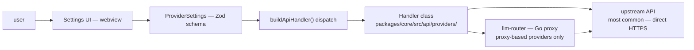
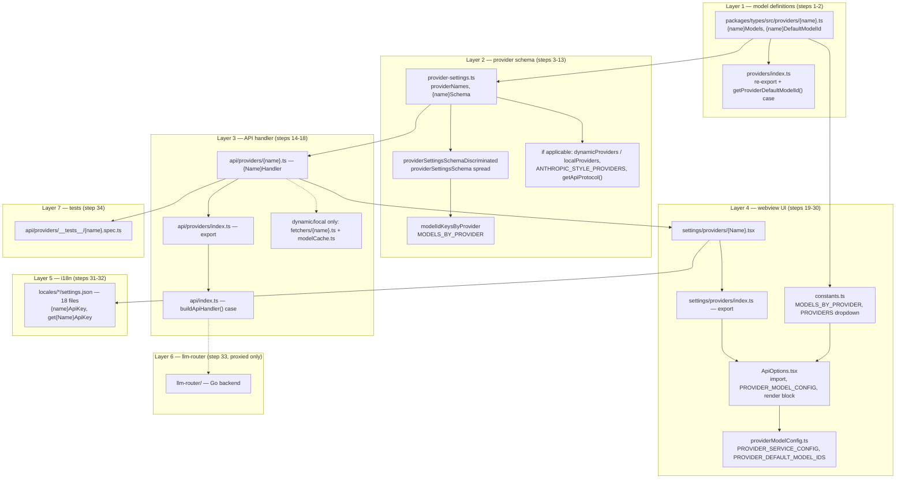

# Adding a New LLM/Model Provider

This document describes the **complete** set of changes needed to add a new upstream LLM provider to Shofer. Use the existing DeepSeek provider as the reference implementation throughout.

---

## Architecture Overview



Providers that talk directly to the upstream API (no proxy) skip the llm-router layer. Providers that go through llm-router require additional model registration in the Go backend.

---

## How to Use This Guide

Each step below is **mandatory** unless marked "(if applicable)." Steps are numbered 1–34. The DeepSeek provider at [`packages/core/src/api/providers/deepseek.ts`](../packages/core/src/api/providers/deepseek.ts) is the canonical reference implementation.

The touch-points that must change **together** — a provider that is missing any
one of them either fails to type-check or silently never appears in the UI:



---

## Model catalog (§7)

Each static provider declares its models as a `Record<modelId, ModelInfo>` in
`packages/types/src/providers/<provider>.ts`. These records are collected into a
single queryable surface — the **model catalog** in
[`packages/types/src/providers/catalog.ts`](../packages/types/src/providers/catalog.ts):

- `STATIC_MODEL_CATALOG` — `provider → { models, defaultModelId }` for every
  statically-known provider (dynamic providers like OpenRouter/Ollama fetch at
  runtime and are absent).
- `lookupStaticModel(provider, modelId)` / `getStaticModelsForProvider(provider)`
  — resolve metadata without importing each `*Models` record or switching on
  provider name.
- `getModelCapabilities(info)` — a normalized view (vision, prompt-cache,
  context/limits, pricing, tool include/exclude dialect).
- `lookupModel(provider, modelId, overrides?)` — bundled entry **merged with
  local overrides**. Overrides are a `provider → modelId → Partial<ModelInfo>`
  map that can correct pricing/limits/capabilities or register a model the
  bundled snapshot lacks, **without code changes** (Part E #4: bundled snapshot +
  local overrides; a live models.dev source can populate the same shape later).

Cost and context-limit logic consume `ModelInfo` directly (see
[`cost-calculation-and-limits.md`](cost-calculation-and-limits.md)), so a catalog
entry — bundled or overridden — feeds straight into cost and limits.

---

## Layer 1: Model Definitions

> Files: `packages/types/src/providers/`

### 1. Create the models file

Create `packages/types/src/providers/<name>.ts`:

```typescript
// packages/types/src/providers/deepseek.ts (reference)

export type DeepSeekModelId = keyof typeof deepSeekModels

export const deepSeekDefaultModelId: DeepSeekModelId = "deepseek-chat"

export const deepSeekModels = {
	"deepseek-chat": {
		maxTokens: 8192,
		contextWindow: 131_072,
		supportsReasoning: false,
		supportsImages: false,
		supportsPromptCache: true,
		inputPrice: 0.27,
		outputPrice: 1.1,
		cacheReadsPrice: 0.028,
		description: "DeepSeek-V3.2 (Non-thinking Mode)...",
	},
	// ... more models
} as const satisfies Record<string, ModelInfo>

export const DEEP_SEEK_DEFAULT_TEMPERATURE = 0.3
```

**Required fields per model:** `maxTokens`, `contextWindow`, `supportsPromptCache`, `inputPrice`, `outputPrice`, `description`

**Optional fields:** `supportsReasoning`, `supportsImages`, `cacheReadsPrice`, `cacheWritesPrice`, `maxImageCount`, `inputAudio`, `inputVideo`, `reasoningEffort`

### 2. Re-export from the barrel file

In [`packages/types/src/providers/index.ts`](../packages/types/src/providers/index.ts):

```typescript
export * from "./<name>.js"
import { <name>DefaultModelId } from "./<name>.js"

// Add to the getProviderDefaultModelId() switch:
case "<name>":
    return <name>DefaultModelId
```

**Note:** The function is `getProviderDefaultModelId()` — **not** `getDefaultModelIdValue`.

---

## Layer 2: Provider Schema & Registration

> File: [`packages/types/src/provider-settings.ts`](../packages/types/src/provider-settings.ts)

### 3. Add the provider to the name list

Add `"<name>"` to the `providerNames` array (~line 99).

### 4. Import the models

Add at the top (~line 6–23):

```typescript
import { <name>Models } from "./providers/index.js"
```

### 5. Check provider category arrays

Determine the provider's category and add to the appropriate array (~line 37–93) if applicable:

| Array               | When to add                                          | Example providers                      |
| ------------------- | ---------------------------------------------------- | -------------------------------------- |
| `dynamicProviders`  | Provider needs dynamic model list fetched from API   | openrouter, vercel-ai-gateway, litellm |
| `localProviders`    | Provider runs models locally                         | ollama, lmstudio                       |
| `internalProviders` | Provider is a VS Code built-in (not user-configured) | vscode-lm                              |
| `customProviders`   | Major cloud provider with custom UI                  | openai                                 |
| `fauxProviders`     | Test/mock provider                                   | fake-ai                                |

**Most new providers do NOT belong in any of these arrays** — they are "typical" providers and don't need a category entry.

### 6. Create the Zod schema

```typescript
const <name>Schema = baseProviderSettingsSchema.extend({
    <name>BaseUrl: z.string().optional(),
    <name>ApiKey: z.string().optional(),
})
```

**Patterns:**

- Simple API key provider: extend `apiModelIdProviderModelSchema`
- API key + base URL: extend `baseProviderSettingsSchema` with `{name}BaseUrl` and `{name}ApiKey`
- Proxy-based (OpenRouter, LiteLLM, etc.): extend with `openAiBaseUrl`, `openAiApiKey`

### 7. Add to the `modelIdKeys` array (if applicable)

If your provider uses a model ID key **other** than `"apiModelId"` (most don't), add the key to `modelIdKeys` (~line 487).

### 8. Add to the Zod discriminated union

Add to `providerSettingsSchemaDiscriminated` (~line 404–435):

```typescript
<name>Schema.merge(z.object({ apiProvider: z.literal("<name>") })),
```

### 9. Add to the structured schema spread

Add to the `providerSettingsSchema` spread (~line 437–469):

```typescript
...<name>Schema.shape,
```

### 10. Add to `modelIdKeysByProvider`

Add to the `modelIdKeysByProvider` map (~line 516–542):

```typescript
<name>: "apiModelId",
```

### 11. Add to Anthropic-style providers (if applicable)

If your provider uses the **Anthropic** protocol (not OpenAI-style HTTP), add to `ANTHROPIC_STYLE_PROVIDERS` (~line 549):

```typescript
export const ANTHROPIC_STYLE_PROVIDERS: ProviderName[] = ["anthropic", "bedrock", "minimax"]
```

Most providers use OpenAI-compatible APIs and should **not** be added here.

### 12. Add to `getApiProtocol()` (if applicable)

If your provider needs special protocol detection (e.g., vertex+claude, vercel-ai-gateway), add a case to `getApiProtocol()` (~line 551–571). Most providers **do not** need this.

### 13. Add model info entry

Add to the `MODELS_BY_PROVIDER` record (~line 577–662):

```typescript
<name>: {
    id: "<name>",
    label: "Provider Display Name",
    models: Object.keys(<name>Models),
},
```

---

## Layer 3: API Handler

> Files: `packages/core/src/api/providers/`, `packages/core/src/api/index.ts`

### 14. Create the handler class

Create `packages/core/src/api/providers/<name>.ts`. Choose the appropriate base class:

| If your provider...           | Extend                         |
| ----------------------------- | ------------------------------ |
| Uses OpenAI-compatible API    | `OpenAiHandler`                |
| Uses Anthropic-compatible API | `AnthropicHandler`             |
| Uses OpenAI Responses API     | `OpenAiCodexHandler`           |
| Generic OpenAI-compatible     | `BaseOpenAiCompatibleProvider` |
| Is completely custom          | `BaseProvider`                 |

**Example — OpenAI-compatible (DeepSeek):**

```typescript
import { <Name>Models, <name>DefaultModelId, <NAME>_DEFAULT_TEMPERATURE } from "@shofer/types"
import { OpenAiHandler } from "./openai"

export class <Name>Handler extends OpenAiHandler {
    constructor(options: ApiHandlerOptions) {
        super({
            ...options,
            openAiApiKey: options.<name>ApiKey ?? "not-provided",
            openAiModelId: options.apiModelId ?? <name>DefaultModelId,
            openAiBaseUrl: options.<name>BaseUrl || "https://api.<name>.com",
            openAiStreamingEnabled: true,
            includeMaxTokens: true,
        })
    }

    override getModel() {
        const id = this.options.apiModelId ?? <name>DefaultModelId
        const info = <Name>Models[id as keyof typeof <Name>Models]
            || <Name>Models[<name>DefaultModelId]
        return { id, info, ...getModelParams(this.options, id, info, <NAME>_DEFAULT_TEMPERATURE) }
    }

    override async *createMessage(systemPrompt, messages, metadata) {
        // Override if custom request/response handling is needed.
        // See DeepSeek for reasoning_content, tool-call, and usage-metrics handling.
    }
}
```

### 15. Add telemetry to error paths

In any catch blocks, call `TelemetryService`:

```typescript
import { TelemetryService } from "@shofer/telemetry"

// In catch blocks:
TelemetryService.instance.captureException(apiError)
```

This is standard practice across all existing providers (see Anthropic, Bedrock, Gemini, Mistral, etc.).

### 16. Register in the providers barrel

In [`packages/core/src/api/providers/index.ts`](../packages/core/src/api/providers/index.ts):

```typescript
export { <Name>Handler } from "./<name>"
```

### 17. Add to the dispatch switch

In [`packages/core/src/api/index.ts`](../packages/core/src/api/index.ts):

```typescript
import { <Name>Handler } from "./providers"

// In buildApiHandler() switch:
case "<name>":
    return new <Name>Handler(options)
```

### 18. Add model fetcher (dynamic/local providers only)

If the provider is in `dynamicProviders` or `localProviders`:

1. Create `packages/core/src/api/providers/fetchers/<name>.ts`
2. Add a case to `fetchModelsFromProvider()` in [`packages/core/src/api/providers/fetchers/modelCache.ts`](../packages/core/src/api/providers/fetchers/modelCache.ts) (~line 60–101)
3. For public providers (no API key needed), add to `initializeModelCacheRefresh()` (~line 231–234)

**Most new providers skip this step** — it's only for providers that need their model list fetched from a remote endpoint.

---

## Layer 4: Webview UI

> Files: `webview-ui/src/components/settings/`

### 19. Create the provider settings form

Create `webview-ui/src/components/settings/providers/<Name>.tsx`:

```tsx
import { useCallback } from "react"
import { VSCodeTextField } from "@vscode/webview-ui-toolkit/react"
import type { ProviderSettings } from "@shofer/types"
import { useAppTranslation } from "@src/i18n/TranslationContext"
import { VSCodeButtonLink } from "@src/components/common/VSCodeButtonLink"
import { inputEventTransform } from "../transforms"

type <Name>Props = {
    apiConfiguration: ProviderSettings
    setApiConfigurationField: (field: keyof ProviderSettings, value: ProviderSettings[keyof ProviderSettings]) => void
    simplifySettings?: boolean
}

export const <Name> = ({ apiConfiguration, setApiConfigurationField }: <Name>Props) => {
    const { t } = useAppTranslation()

    const handleInputChange = useCallback(
        <K extends keyof ProviderSettings, E>(
            field: K,
            transform: (event: E) => ProviderSettings[K] = inputEventTransform,
        ) => (event: E | Event) => {
            setApiConfigurationField(field, transform(event as E))
        },
        [setApiConfigurationField],
    )

    return (
        <>
            <VSCodeTextField
                value={apiConfiguration?.<name>ApiKey || ""}
                type="password"
                onInput={handleInputChange("<name>ApiKey")}
                placeholder={t("settings:placeholders.apiKey")}
                className="w-full">
                <label className="block font-medium mb-1">
                    {t("settings:providers.<name>ApiKey")}
                </label>
            </VSCodeTextField>
            <div className="text-sm text-vscode-descriptionForeground -mt-2">
                {t("settings:providers.apiKeyStorageNotice")}
            </div>
            {!apiConfiguration?.<name>ApiKey && (
                <VSCodeButtonLink href="https://platform.<name>.com/" appearance="secondary">
                    {t("settings:providers.get<Name>ApiKey")}
                </VSCodeButtonLink>
            )}
        </>
    )
}
```

### 20. Export from providers barrel

In [`webview-ui/src/components/settings/providers/index.ts`](../webview-ui/src/components/settings/providers/index.ts):

```typescript
export { <Name> } from "./<Name>"
```

### 21. Import default model ID

In [`webview-ui/src/components/settings/ApiOptions.tsx`](../webview-ui/src/components/settings/ApiOptions.tsx) (~line 10–35):

```typescript
import { <name>DefaultModelId } from "@shofer/types"
```

### 22. Import the provider component

In `ApiOptions.tsx` (~line 70–97):

```typescript
import { <Name> } from "./providers"
```

### 23. Add to `PROVIDER_MODEL_CONFIG`

In `ApiOptions.tsx` (~line 329–369):

```typescript
<name>: { field: "apiModelId", default: <name>DefaultModelId },
```

### 24. Add conditional rendering block

In `ApiOptions.tsx` (~line 488–704):

```tsx
{selectedProvider === "<name>" && (
    <<Name>
        apiConfiguration={apiConfiguration}
        setApiConfigurationField={setApiConfigurationField}
        simplifySettings={simplifySettings}
    />
)}
```

### 25. Add to provider model config (generic ModelPicker)

In [`webview-ui/src/components/settings/utils/providerModelConfig.ts`](../webview-ui/src/components/settings/utils/providerModelConfig.ts):

1. Add to `PROVIDER_SERVICE_CONFIG` (~line 28–50) — maps provider to its service type
2. Add to `PROVIDER_DEFAULT_MODEL_IDS` (~line 52–68) — the default model ID per provider

**Skip if** your provider is in `PROVIDERS_WITH_CUSTOM_MODEL_UI` (which means it has its own custom model selector instead of using the generic `ModelPicker`).

### 26. Check custom model UI list

In `providerModelConfig.ts` (~line 118–129): if your provider needs a custom model selection UI (like openrouter, requesty, openai-codex, etc.), add it to `PROVIDERS_WITH_CUSTOM_MODEL_UI`. Otherwise, keep it out — it will use the generic `ModelPicker`.

### 27. Check model change side effects

In `providerModelConfig.ts` (~line 142–158): if your provider needs special side effects when the model changes (e.g., Bedrock clearing a custom ARN), add logic to `handleModelChangeSideEffects`. Most providers **do not** need this.

### 28. Add to provider constants

In [`webview-ui/src/components/settings/constants.ts`](../webview-ui/src/components/settings/constants.ts):

1. Import models (~line 3–20):

```typescript
import { <name>Models } from "@shofer/types"
```

2. Add to `MODELS_BY_PROVIDER` (~line 22–39):

```typescript
<name>: <name>Models,
```

### 29. Add to provider dropdown list

In `constants.ts` `PROVIDERS` array (~line 41–68):

```typescript
{ value: "<name>", label: "Provider Display Name", proxy: false },
```

Set `proxy: true` only if the provider is a routing proxy (like OpenRouter, LiteLLM).

### 30. Add model fetch debounce (dynamic/local providers only)

In `ApiOptions.tsx` (~line 222–261): the `useDebounce` block dispatches messages for dynamic/local providers. Only add a case if your provider is in `dynamicProviders` or `localProviders`. Skip for typical providers.

---

## Layer 5: i18n Strings

> Files: `webview-ui/src/i18n/locales/*/settings.json` (18 locale files)

### 31. Add to English locale

In [`webview-ui/src/i18n/locales/en/settings.json`](../webview-ui/src/i18n/locales/en/settings.json), add to the `providers` block:

```json
"<name>ApiKey": "Provider Name API Key",
"get<Name>ApiKey": "Get Provider Name API Key"
```

If your provider has a base URL field, also add a label for it (e.g., `"<name>BaseUrl": "Provider Name Base URL"`).

At minimum, every provider needs:

- `{name}ApiKey` — label for the API key field
- `get{Name}ApiKey` — label for the "Get API Key" button

The `apiKeyStorageNotice` key is shared across all providers — no new key needed.

### 32. Add to all other locales

Copy the new keys to all locale files under `webview-ui/src/i18n/locales/*/settings.json`. Translate the values appropriately. There are currently 18 locale files.

---

## Layer 6: llm-router (Go Backend)

> Files: `llm-router/`

### 33. Register model in llm-router (if proxied)

If the provider goes through llm-router (the backend proxy), additional steps are needed in the Go codebase under `llm-router/`. See `llm-router/docs/INTERFACE.md` for the protocol.

**For providers that talk directly to the upstream API (most common case), skip this layer entirely.**

---

## Layer 7: Tests

### 34. Create handler unit test

Create `packages/core/src/api/providers/__tests__/<name>.spec.ts`. Mock `@shofer/telemetry`:

```typescript
vi.mock("@shofer/telemetry", () => ({
	TelemetryService: { instance: { captureException: vi.fn() } },
}))
```

Follow the pattern of existing handler tests (see `deepseek.spec.ts`, `moonshot.spec.ts`, etc.).

---

## Complete Checklist

Mark each item off as you go:

### Layer 1 — Model Definitions

- [ ]   1. Create `packages/types/src/providers/<name>.ts`
- [ ]   2. Export from `packages/types/src/providers/index.ts` + add `getProviderDefaultModelId()` case

### Layer 2 — Provider Schema

- [ ]   3. Add to `providerNames` array
- [ ]   4. Import models at top of `provider-settings.ts`
- [ ]   5. Check/add to category arrays (`dynamicProviders`, `localProviders`, etc.)
- [ ]   6. Create Zod schema
- [ ]   7. Add to `modelIdKeys` (if using non-standard model ID key)
- [ ]   8. Add to `providerSettingsSchemaDiscriminated`
- [ ]   9. Add to `providerSettingsSchema` spread
- [ ]   10. Add to `modelIdKeysByProvider`
- [ ]   11. Add to `ANTHROPIC_STYLE_PROVIDERS` (if Anthropic protocol)
- [ ]   12. Add to `getApiProtocol()` (if special protocol detection needed)
- [ ]   13. Add to `MODELS_BY_PROVIDER` info record

### Layer 3 — API Handler

- [ ]   14. Create `packages/core/src/api/providers/<name>.ts`
- [ ]   15. Add `TelemetryService.instance.captureException()` in error paths
- [ ]   16. Export from `packages/core/src/api/providers/index.ts`
- [ ]   17. Import + add case to `buildApiHandler()` in `packages/core/src/api/index.ts`
- [ ]   18. Add model fetcher (dynamic/local providers only)

### Layer 4 — Webview UI

- [ ]   19. Create `webview-ui/.../providers/<Name>.tsx`
- [ ]   20. Export from `webview-ui/.../providers/index.ts`
- [ ]   21. Import `defaultModelId` in `ApiOptions.tsx`
- [ ]   22. Import component in `ApiOptions.tsx`
- [ ]   23. Add to `PROVIDER_MODEL_CONFIG` in `ApiOptions.tsx`
- [ ]   24. Add conditional render block in `ApiOptions.tsx`
- [ ]   25. Add to `PROVIDER_SERVICE_CONFIG` + `PROVIDER_DEFAULT_MODEL_IDS` in `providerModelConfig.ts`
- [ ]   26. Check `PROVIDERS_WITH_CUSTOM_MODEL_UI` in `providerModelConfig.ts`
- [ ]   27. Check `handleModelChangeSideEffects` in `providerModelConfig.ts`
- [ ]   28. Import models + add to `MODELS_BY_PROVIDER` in `constants.ts`
- [ ]   29. Add to `PROVIDERS` dropdown in `constants.ts`
- [ ]   30. Add model fetch debounce (dynamic/local providers only)

### Layer 5 — i18n

- [ ]   31. Add keys to English locale `settings.json`
- [ ]   32. Add keys to all 17 other locale files

### Layer 6 — Go Backend

- [ ]   33. Register in llm-router (if proxied)

### Layer 7 — Tests

- [ ]   34. Create `packages/core/src/api/providers/__tests__/<name>.spec.ts`

### Verification

- [ ] Run `pnpm check-types` and `pnpm test` from `src/` directory
