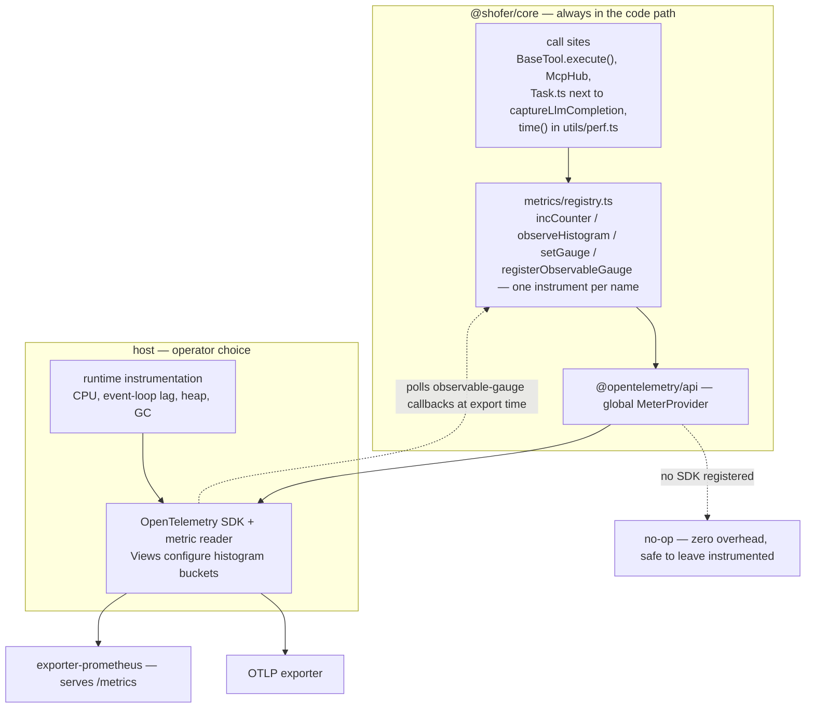

# OpenTelemetry Metrics for Shofer

Shofer's agent core is instrumented for operational metrics through the
OpenTelemetry metrics API. This document describes the instrument surface and the
metric catalog.

## How it works

All instruments are created and cached in
[`packages/core/src/metrics/registry.ts`](../packages/core/src/metrics/registry.ts)
through `@opentelemetry/api`:

- `registry.incCounter(name, help, labels?, amount?)` → `meter.createCounter`
- `registry.observeHistogram(name, help, value, buckets?, labels?)` → `meter.createHistogram`
- `registry.setGauge(name, help, value, labels?)` → `meter.createGauge`
- `registry.registerObservableGauge(name, help, observe)` → `meter.createObservableGauge`

Instruments are lazy (one per metric name) and emit through the global
`MeterProvider`. **The core never binds a port or serves an endpoint.** Whether —
and where — metrics are exported is entirely a host concern: the host registers an
OpenTelemetry SDK with a metric reader and exporter (OTLP, or
`@opentelemetry/exporter-prometheus` to serve a Prometheus `/metrics` endpoint).
Until a host registers an SDK, the API is a zero-overhead no-op, so instrumentation
is always safe to leave in the code path.

Two consequences of the OTel model:

- **Histogram buckets are an SDK concern**, configured via Views on the host, not
  at instrument creation. `registry.ts` exports advisory bucket presets
  (`FAST_BUCKETS_MS`, `STD_BUCKETS_MS`, `SLOW_BUCKETS_MS`) as hints for that View
  config; `observeHistogram` accepts a bucket argument for call-site documentation
  but does not apply it.
- **Scrape-time gauges** (process memory, embedder queue depth, focused-task
  size) are modeled as OTel _observable_ gauges via `registerObservableGauge`: the
  SDK invokes the callback at export time, so values are never stale and no
  event-loop-waking timer is needed.



Process/runtime series (CPU, event-loop lag, heap, GC) come from the host's OTel
runtime instrumentation (e.g. `@opentelemetry/instrumentation-runtime-node`), not
a bundled collector.

The OpenTelemetry metrics pipeline is independent of `TELEMETRY_ENABLED`. That
flag gates the PostHog user-analytics pipeline (`TelemetryService`); the two share
call sites but have independent instrumentation paths and independent opt-in.

### Method-level latency (`time()` helper)

`time<T>(key, fn)` in [`packages/core/src/utils/perf.ts`](../packages/core/src/utils/perf.ts)
wraps an async call, measures wall time, and forwards the duration to the registry
via `setHistogramCallback`. Wrap the call site, not the method definition:

```ts
return time("saveShoferMessages", () => this._saveShoferMessagesImpl())
```

## Metric catalog

Metric names, labels, and semantics below are the emitted contract. Keep
`errorType` / `status` labels low-cardinality (a closed set of < 10 values per
metric) so exported series don't explode.

### Availability (calls, errors, error types)

| Metric                           | Type    | Labels                             | Description                                                                                                       |
| -------------------------------- | ------- | ---------------------------------- | ----------------------------------------------------------------------------------------------------------------- |
| `shofer_llm_calls_total`         | Counter | `provider`, `modelId`, `status`    | `status` = `success` \| `error` \| `timeout`                                                                      |
| `shofer_llm_errors_total`        | Counter | `provider`, `modelId`, `errorType` | `errorType` = `api_error` \| `rate_limit` \| `timeout` \| `auth_error` \| `unknown`                               |
| `shofer_llm_cost_usd_total`      | Counter | `provider`, `modelId`              | Cumulative USD cost (provider-reported or locally computed; mirrors the per-request cost in `Task.ts`)            |
| `shofer_llm_tokens_total`        | Counter | `provider`, `modelId`, `direction` | `direction` = `input` \| `output` \| `cache_read` \| `cache_write` (mirrors the `LLM_COMPLETION` token breakdown) |
| `shofer_tool_calls_total`        | Counter | `tool`, `status`                   | `status` = `success` \| `error`                                                                                   |
| `shofer_tool_errors_total`       | Counter | `tool`, `errorType`                | Per-tool error classification                                                                                     |
| `shofer_mcp_calls_total`         | Counter | `server`, `tool`, `status`         | `status` = `success` \| `error` \| `timeout` \| `cancelled`                                                       |
| `shofer_mcp_errors_total`        | Counter | `server`, `tool`, `errorType`      | `errorType` = `timeout` \| `cancelled` \| `server_error` \| `unknown`                                             |
| `shofer_tasks_created_total`     | Counter | `mode`                             | Tasks created per mode                                                                                            |
| `shofer_tasks_completed_total`   | Counter | `mode`, `rating`                   | Tasks completed, per completion rating                                                                            |
| `shofer_tasks_errored_total`     | Counter | `mode`, `errorType`                | `errorType` = `consecutive_mistake` \| `budget_exceeded` \| `shell_error` \| `unknown`                            |
| `shofer_code_index_errors_total` | Counter | `subsystem`                        | `subsystem` = `scanner` \| `parser` \| `embedder` \| `cache` \| `orchestrator`                                    |

Tool availability is instrumented once at the `BaseTool.execute()` call site so all
tools are covered without per-tool wiring; MCP counters are emitted from `McpHub`,
and LLM counters next to `captureLlmCompletion` in `Task.ts` (at most once per
request).

### Latency (histograms)

| Metric                               | Type      | Labels                | Description                                                    |
| ------------------------------------ | --------- | --------------------- | -------------------------------------------------------------- |
| `shofer_llm_duration_ms`             | Histogram | `provider`, `modelId` | LLM API call duration                                          |
| `shofer_tool_duration_ms`            | Histogram | `tool`                | Tool execution duration                                        |
| `shofer_mcp_duration_ms`             | Histogram | `server`, `tool`      | MCP call duration                                              |
| `shofer_task_switch_duration_ms`     | Histogram | —                     | Task context switch duration                                   |
| `shofer_save_messages_duration_ms`   | Histogram | —                     | `saveShoferMessages` duration                                  |
| `shofer_preload_duration_ms`         | Histogram | —                     | `preloadShoferMessages` duration                               |
| `shofer_post_init_state_duration_ms` | Histogram | —                     | `postInitState` duration                                       |
| `shofer_index_load_duration_ms`      | Histogram | —                     | Task-history index load duration                               |
| `shofer_index_write_duration_ms`     | Histogram | —                     | Task-history index write duration                              |
| `shofer_generic_duration_ms`         | Histogram | `operation`           | Catch-all for any `time()` key not routed to a named histogram |

Tool duration is instrumented at the `BaseTool.execute()` call site so all tools
are covered without per-tool wiring.

### Memory and process health

| Metric                         | Type            | Description                                         |
| ------------------------------ | --------------- | --------------------------------------------------- |
| `shofer_heap_used_bytes`       | ObservableGauge | `process.memoryUsage().heapUsed`                    |
| `shofer_heap_total_bytes`      | ObservableGauge | `process.memoryUsage().heapTotal`                   |
| `shofer_rss_bytes`             | ObservableGauge | `process.memoryUsage().rss`                         |
| `shofer_messages_total`        | ObservableGauge | `shoferMessages.length` of the focused task         |
| `shofer_messages_bytes`        | ObservableGauge | Serialized byte size of the focused task's messages |
| `shofer_tasks_total`           | ObservableGauge | `taskHistoryStore.getAll().length`                  |
| `shofer_active_tasks`          | ObservableGauge | Managed tasks with `abort === false`                |
| `shofer_event_listeners_total` | ObservableGauge | `ShoferProvider.listenerCount()`                    |

### Code-index

| Metric                        | Type            | Labels     | Description                                                                                                                        |
| ----------------------------- | --------------- | ---------- | ---------------------------------------------------------------------------------------------------------------------------------- |
| `shofer_code_index_files`     | ObservableGauge | —          | Number of indexed files                                                                                                            |
| `shofer_embedder_queue_depth` | ObservableGauge | `provider` | Embedder concurrency-lane depth (running + queued `createEmbeddings` calls), read from `getEmbedderLaneDepth` (`embedder-lane.ts`) |
