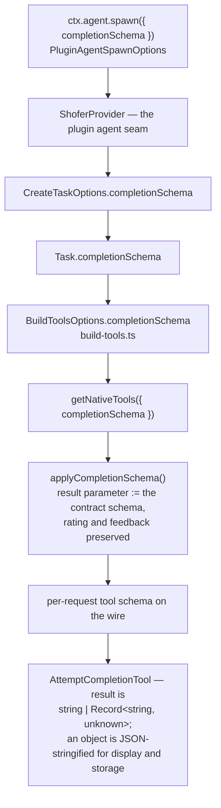
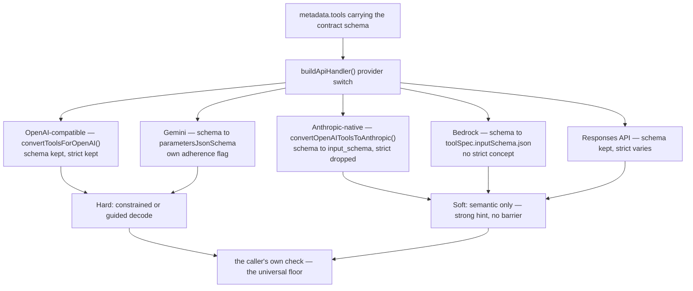

# Output Contract Enforcement — the per-task completion schema

A caller that spawns an agent task and needs a **structured** answer back —
not prose it has to parse — declares a JSON Schema for the result. Shofer
threads that schema into the task's own `attempt_completion` tool, so a
provider with constrained decoding satisfies the contract **at decode time**
instead of the caller discovering a violation a turn later.

The contract is a per-task property. It never becomes a global tool, is never
persisted as part of the tool catalog, and is GC'd with the task.

## 1. Why the completion TOOL and not `response_format`

Two other shapes look like they solve this and do not:

- **`response_format` / structured output** constrains the whole turn's assistant
  text. An agentic task still needs to read files and run commands before it can
  answer, so a turn-wide constraint cannot coexist with it. Termination in this
  loop is a **tool call**, not text — the constraint belongs on the tool.
- **`tool_choice` forcing** (`"required"`, or naming `attempt_completion`) makes
  the model terminate, but says nothing about the SHAPE of what it submits. It is
  also only correct on the final turn: forcing it generally breaks any task that
  must read or run something first. It is a different lever for a different
  failure (the model never terminating at all), and it is not part of this
  mechanism — `tool_choice` is hardcoded to `"auto"` at every call site in
  [`Task.ts`](../packages/core/src/task/Task.ts).

Reshaping the completion tool leaves every other tool untouched, which is exactly
what lets a constrained result coexist with a full agent loop.

## 2. How it is threaded

| Layer                                                                                 | What it carries                                                                                                          |
| ------------------------------------------------------------------------------------- | ------------------------------------------------------------------------------------------------------------------------ |
| [`PluginAgentSpawnOptions.completionSchema`](../packages/types/src/plugin.ts)         | The caller's entry point. Unlike `metadata`, it is **not** opaque — the host reads it.                                   |
| [`ShoferProvider`](../src/core/webview/ShoferProvider.ts)                             | The plugin agent seam; passes it onto `createTask`.                                                                      |
| [`CreateTaskOptions.completionSchema`](../packages/types/src/task.ts)                 | The per-task option.                                                                                                     |
| [`Task.completionSchema`](../packages/core/src/task/Task.ts)                          | Held on the task, threaded into every `buildNativeToolsArrayWithRestrictions` call site **and into the tool cache key**. |
| [`BuildToolsOptions.completionSchema`](../packages/core/src/task/build-tools.ts)      | Reaches tool assembly.                                                                                                   |
| [`applyCompletionSchema()`](../packages/core/src/prompts/tools/native-tools/index.ts) | Rewrites the `attempt_completion` definition for this request only.                                                      |
| [`AttemptCompletionTool`](../packages/core/src/tools/AttemptCompletionTool.ts)        | Accepts the object form and normalises it to a string for display, persistence and the completion summary.               |

The cache key matters: the system prompt and tool array are cached per task, so a
schema that did not participate in the key would be silently ignored on every
request after the first.

### What `applyCompletionSchema` produces

The contract nests **under** `result`, so the model emits
`{ result: {<contract>}, rating, feedback? }` — the base tool's `rating` and
`feedback` properties are spread through from the original definition rather than
being redefined. `feedback` stays optional: `defineNativeTool`'s strict pre-bake
lists every property in `required`, so the variant filters it back out; the
contract variant requires only `result` and `rating`.

The base [`attempt_completion`](../packages/core/src/prompts/tools/native-tools/attempt_completion.ts)
schema (`result: string`, a `rating` enum, optional `feedback`) is **correct as
it stands** and is not the thing being fixed. It is shared terminal-state
infrastructure used by every task; "deliver a result string plus a self-rating"
is the right shape for that role. An output contract is a per-CALLER concept, and
baking a caller's fields into the shared tool would couple infrastructure to one
of its users. The per-request variant is how the two layers meet without either
one learning about the other.

## 3. What reaches the upstream

Two separable things travel down the wire: the contract **schema**, and the
**request to constrain-decode against it** (`strict`). They have different fates.

Every provider conversion carries the schema in its native format. The `strict`
flag survives only on the OpenAI-compatible family:

| Family            | Schema on wire?                  | `strict` on wire?             | Conversion site                                                                                    |
| ----------------- | -------------------------------- | ----------------------------- | -------------------------------------------------------------------------------------------------- |
| OpenAI-compatible | ✅                               | ✅ kept                       | [`convertToolsForOpenAI()`](../packages/core/src/api/providers/base-provider.ts)                   |
| Anthropic-native  | ✅ → `input_schema`              | ❌ dropped                    | [`convertOpenAIToolsToAnthropic()`](../packages/core/src/prompts/tools/native-tools/converters.ts) |
| Bedrock           | ✅ → `toolSpec.inputSchema.json` | ❌ no concept                 | bedrock handler                                                                                    |
| Gemini            | ✅ → `parametersJsonSchema`      | ❌ no concept (uses own flag) | gemini handler                                                                                     |
| Responses API     | ✅                               | ⚠️ varies                     | responses handler                                                                                  |

**Enforcement is therefore tiered**, and dropping the `strict` _word_ is not the
same as dropping enforcement — a provider that constrain-decodes against the
input schema enforces the contract natively:

| Upstream                           | Enforcement layer  | Guarantee                          |
| ---------------------------------- | ------------------ | ---------------------------------- |
| OpenAI / Azure (`strict: true`)    | constrained decode | **Hard**                           |
| Gemini (`strict_schema_adherence`) | constrained decode | **Hard** (for flat scalars)        |
| Anthropic (Claude)                 | semantic only      | **Soft** — strong hint, no barrier |
| Open weights on vLLM / SGLang      | guided decode      | **Hard**                           |
| Semantic-mode hosted APIs          | semantic only      | **Soft** — strong hint, no barrier |

## 4. Why the schema is safe to send unconditionally

A contract of **flat scalars, all required, `additionalProperties: false`** sits
inside _both_ the structural subset every provider accepts _and_ OpenAI strict
mode's allowed subset:

- **Universal (all providers, strict or not):** primitive types, objects, arrays,
  enums, `additionalProperties: false`.
- **Forbidden under OpenAI strict (throws 400):** `pattern`, `minLength`,
  `minimum` / `maximum`, `minItems`, `uniqueItems`.
- **OpenAI strict's "optional field" rule:** every property must appear in
  `required`; an optional one is modeled as a `["type", "null"]` union.

So a contract in that subset needs no per-provider dialect and cannot trigger a
400 on the strictest provider, while still receiving hard enforcement wherever a
constrained-decode layer exists.

The constraint this rests on is the CALLER's: a schema using validation keywords
(regexes, ranges, item counts) is no longer strict-safe, and sending it to an
OpenAI-family provider is a 400 rather than a soft degradation. A caller that
needs those keywords must strip them before spawning and check them itself.

## 5. The caller keeps the floor

A soft-enforcement provider will occasionally return a non-conforming result, so
**the caller still validates what it gets back.** That check is the only
mechanism that holds everywhere; the completion schema raises the floor without
replacing it.

Re-prompting is a **continuation**, not a cold restart: `ctx.agent.spawn` takes a
`sessionId`, so a caller whose result failed its schema re-asks the same session
with the specific error and the model still has everything it derived the first
time. Starting fresh would redo that work and quite likely reproduce the same
drift.

## 6. Roadmap

Nothing in the design above is unbuilt. One gap remains around it:

1. **No non-plugin caller.** `ctx.agent.spawn({ completionSchema })` is the only
   thing that sets a contract today. The sibling per-task shaping options
   (`agentRole`, `agentToolGroups`, `agentContext` on `CreateTaskOptions`) have
   no caller at all — see [`TODO.md`](../TODO.md). Exposing them on
   `PluginAgentSpawnOptions` beside `completionSchema` would let one caller
   describe a task's contract, its role and its tool surface through a single
   seam.
