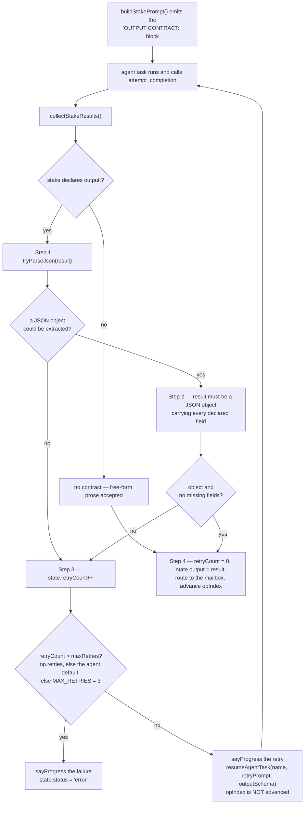
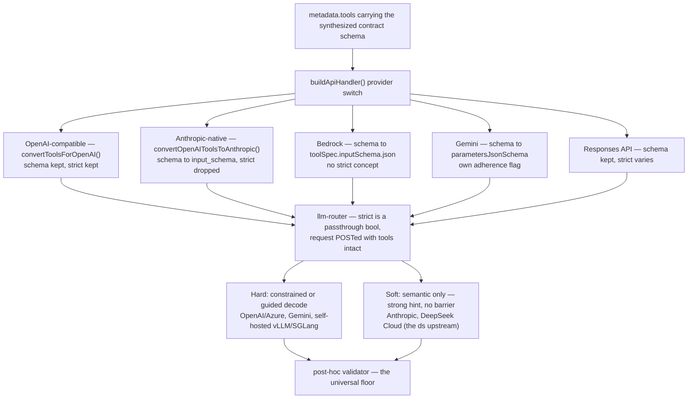
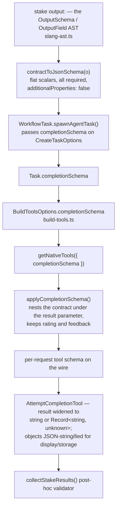
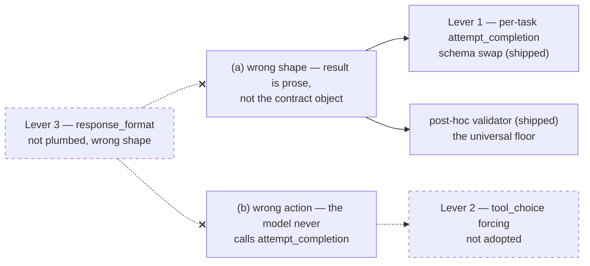

# Output Contract Enforcement for Workflow Stakes — Design

**Status:** Implemented (Lever 1 — per-task `attempt_completion` schema swap)
**Created:** 2026-06-10 **Updated:** 2026-06-11
**Context:** `todos/fixing_tests.md` issue #5 — "DS contract non-compliance"

---

## 1. Problem

Workflow stakes can declare an `output:` contract — a JSON shape the agent's
terminal `attempt_completion` is expected to satisfy. Under the `ds` preset
(DeepSeek v4-pro via the OpenAI-compatible router), two `.slang` flows
(`_commit-if`, `_converge-agent`) intermittently violate the contract. The mock
provider passes 23/23; DS is best-effort.

The single label "contract non-compliance" actually conflates **two distinct
failure modes**:

- **(a) Wrong shape** — the model _does_ call `attempt_completion`, but `result`
  contains a markdown table / prose instead of the JSON object the `output:`
  contract demands.
- **(b) Wrong action** — the model never calls `attempt_completion` at all; it
  runs real tools (e.g. `read_file`) instead of terminating.

These have different root causes and different fixes. Any enforcement design must
treat them separately.

---

## 2. How enforcement works today (post-hoc)

The contract is injected as **prompt prose**, then validated **after** the model
responds:

| Stage                           | Location                                                                                                                                                |
| ------------------------------- | ------------------------------------------------------------------------------------------------------------------------------------------------------- |
| Contract → prompt text          | [`WorkflowTask.buildStakePrompt()`](../src/core/workflow/WorkflowTask.ts) emits the `OUTPUT CONTRACT:` block                                            |
| Parse + field check + re-prompt | [`WorkflowTask.collectStakeResults()`](../src/core/workflow/WorkflowTask.ts) runs `tryParseJson` → field-presence check → retry up to `MAX_RETRIES = 3` |

Key fact: the `attempt_completion` tool the model sees has a **generic schema** —
`result: string`, a `rating` enum, optional `feedback`
([`attempt_completion.ts:26-46`](../packages/core/src/prompts/tools/native-tools/attempt_completion.ts)).
The contract fields (`summary`, etc.) are **not** part of the tool's parameter
schema. So although `strict: true` is already set on this tool
([`attempt_completion.ts:25`](../packages/core/src/prompts/tools/native-tools/attempt_completion.ts),
re-applied by [`convertToolsForOpenAI()`](../packages/core/src/api/providers/base-provider.ts)),
strict mode constrains **nothing contract-relevant**: the decoder guarantees
`{ result: <string> }` and the string can be a markdown table.

**This is not a bug in `attempt_completion`.** The generic schema is correct _by
design_ — `attempt_completion` is shared terminal-state infrastructure used by
every task type (regular tasks, subtasks, workflow stakes). Its job is "deliver a
result string + a self-rating," and `result: string` is the right shape for that
role. The per-stake `output:` contract is a _workflow-layer_ concept that the
shared tool deliberately knows nothing about. The "issue" is a **layering
boundary**, not a defect: the contract and the tool schema live in two different
layers with no compile-time link. Baking workflow contract fields into
`attempt_completion` would wrongly couple shared infrastructure to one caller.

The post-hoc validator is therefore the _only_ thing enforcing the contract
today, and it is provider-agnostic (works for mock and every real provider).



---

## 3. Available levers

### Lever 1 — Strict structured tool args (addresses failure (a))

Move the contract out of the prose and into the **tool parameter schema**: when a
stake declares `output:`, synthesize a per-stake completion tool (e.g. a
dedicated `submit_result`, or a per-stake variant of `attempt_completion`) whose
`parameters` schema **is** the contract:

```jsonc
{
	"name": "submit_result",
	"strict": true,
	"parameters": {
		"type": "object",
		"additionalProperties": false,
		"required": ["summary", "..."],
		"properties": { "summary": { "type": "string" }, "...": {} },
	},
}
```

The existing [`convertToolSchemaForOpenAI()`](../packages/core/src/api/providers/base-provider.ts)

- `strict: true` plumbing then forces the decoder to emit conforming JSON at
  decode time, retiring the `JSON.parse` / missing-field retry loop at the source
  (where the upstream supports constrained decoding — see §4).

#### 3.1 Dynamic synthesis — slangs are runtime, but the contract is already a typed AST

A natural worry: slangs are arbitrary and processed at runtime, so how can a
per-stake tool schema be synthesized dynamically? The answer is that the runtime
nature is exactly what _enables_ this — tools are not statically compiled, they
are plain JSON assembled per API request, and the `output:` contract is already a
fully machine-readable AST, not free-form prose.

A stake's `output:` parses into a typed shape
([`slang-ast.ts:106-113`](../packages/core/src/workflow/slang-ast.ts)):

```ts
interface OutputSchema {
	fields: OutputField[]
}
interface OutputField {
	name: string
	fieldType: string
} // "string" | "number" | "boolean"
```

The workflow layer just _chooses_ to stringify this into prose at
[`buildStakePrompt()`](../src/core/workflow/WorkflowTask.ts)
(`for (const f of op.output.fields) prompt += ...`). The structured form is
sitting right there in `op.output`. Because `fieldType` is a closed 3-value enum
of flat scalars (no nesting, no recursion), the AST → JSON-Schema mapping is a
**pure, total function** that cannot fail:

```ts
function contractToJsonSchema(o: OutputSchema) {
	return {
		type: "object",
		properties: Object.fromEntries(
			o.fields.map((f) => [f.name, { type: f.fieldType }]), // string|number|boolean → JSON Schema primitive
		),
		required: o.fields.map((f) => f.name), // all fields required — matches the existing post-hoc check
		additionalProperties: false, // both are exactly what OpenAI strict mode demands
	}
}
```

This lines up with the current validator
([`collectStakeResults()`](../src/core/workflow/WorkflowTask.ts):
missing-field check = all-required; object check = `type: object`). It is called
at the same per-stake point `buildStakePrompt` runs, producing a per-task object
that lives only for that task's requests and is GC'd with the task. **No global
tool registration, no persisted-schema change, no `@shofer/types` union edit** —
it never leaves the workflow runtime.

#### 3.2 The real work is plumbing, not generation

The missing piece is not schema generation — it is a **per-task tool override
hook**. Today tools are assembled by mode in
[`build-tools.ts`](../packages/core/src/task/build-tools.ts)
(`filterNativeToolsForMode`), and `createTask()` takes no "inject this tool"
parameter. Lever 1 needs:

1. **An injection channel** — `createTask(...)` accepts an optional per-task
   synthesized tool (or schema override), threaded into the tool-assembly step.
   The workflow already owns task creation at `spawnAgentTask()`, the natural
   injection point.
2. **A parser case + dispatch route** — per the Native Tool Parser Cases Rule,
   the synthesized tool's name must be handled in
   [`NativeToolCallParser`](../packages/core/src/assistant-message/NativeToolCallParser.ts)
   and routed to the **same termination path** as `attempt_completion`, or
   `nativeArgs` comes back `undefined` and the call is rejected.

Two sub-shapes, a real design choice:

| Option                                            | Schema                                                                       | Plumbing cost                                                  | Caveat                                                                                                                  |
| ------------------------------------------------- | ---------------------------------------------------------------------------- | -------------------------------------------------------------- | ----------------------------------------------------------------------------------------------------------------------- |
| **(a) Per-task `attempt_completion` schema swap** | replace generic `result: string` with the contract schema for that task only | request-scoped schema override; parser already knows the name  | mutates a _shared_ tool's contract per-task — the override must be strictly request-scoped or it leaks into other tasks |
| **(b) Sibling `submit_result` tool**              | dedicated tool whose `parameters` _is_ the contract                          | full new-tool checklist (parser, dispatch, termination wiring) | model must be told to call it instead of `attempt_completion` — back to a (much smaller) prompt instruction             |

### Lever 2 — `tool_choice` (the only lever touching failure (b))

No form of structured output makes a model _choose_ to terminate rather than call
`read_file`. That is governed by `tool_choice`, which is plumbed
([`api/index.ts`](../packages/core/src/api/index.ts)) and used in
[`Task.ts`](../packages/core/src/task/Task.ts) — but **hardcoded to
`"auto"`** in all four spots, and **never set by the workflow layer** (zero
references under [`packages/core/src/workflow/`](../extensions/shofer/packages/core/src/workflow/)).

- `tool_choice: "required"` — forces _some_ tool call, killing the content-only
  markdown-table response.
- `tool_choice: { type: "function", function: { name: "attempt_completion" } }` —
  forces _exactly_ termination. Correct only on the **final** turn and only safe
  for trivial no-tool stakes; forcing it generally breaks any stake that must
  read/run something first.

For the deliberately-trivial conformance fixtures this would work, but it is a
**harness-shaped hack**, not a general contract mechanism — and named-tool
forcing may itself not be honored by the DeepSeek upstream.

### Lever 3 — `response_format` (not applicable)

Not plumbed anywhere in [`packages/core/src/api/`](../packages/core/src/api/) (zero
references). It constrains _assistant text content_, not tool-call args, and
termination in this agent loop is a tool call. Wrong shape for the problem; skip.

---

## 4. Cross-provider route — does the strict schema reach the upstream?

The request "it should work not just for DS but for any of the supported ones"
requires tracing two _separable_ things down the wire: the contract **schema**
and the **request to constrain-decode against it** (`strict`). They have
different fates.

### 4.1 Route trace

`metadata.tools` → [`buildApiHandler()`](../packages/core/src/api/index.ts)
provider switch → each handler's tool conversion → llm-router → upstream.

**Extension side.** Every provider conversion carries the contract **schema**
into its native format. The **`strict` flag** survives only on the
OpenAI-compatible family:

| Family            | Providers                                                                                                                                                                                       | Schema on wire?                  | `strict` flag on wire?        | Conversion site                                                                                    |
| ----------------- | ----------------------------------------------------------------------------------------------------------------------------------------------------------------------------------------------- | -------------------------------- | ----------------------------- | -------------------------------------------------------------------------------------------------- |
| OpenAI-compatible | `openai`, `deepseek`, `openrouter`→**`shofer`/ds**, `litellm`, `requesty`, `unbound`, `zai`, `qwen-code`, `lmstudio`, `vercel`, `baseten`, `fireworks`, `sambanova`, `poe`, `openai-compatible` | ✅                               | ✅ kept                       | [`convertToolsForOpenAI()`](../packages/core/src/api/providers/base-provider.ts)                   |
| Anthropic-native  | `anthropic`, `anthropic-vertex`, `minimax`                                                                                                                                                      | ✅ → `input_schema`              | ❌ dropped                    | [`convertOpenAIToolsToAnthropic()`](../packages/core/src/prompts/tools/native-tools/converters.ts) |
| Bedrock           | `bedrock`                                                                                                                                                                                       | ✅ → `toolSpec.inputSchema.json` | ❌ no concept                 | bedrock handler                                                                                    |
| Gemini            | `gemini`                                                                                                                                                                                        | ✅ → `parametersJsonSchema`      | ❌ no concept (uses own flag) | gemini handler                                                                                     |
| Responses API     | `openai-native`, `openai-codex`, `xai`                                                                                                                                                          | ✅                               | ⚠️ varies                     | responses handler                                                                                  |

**Router side (verified).** The llm-router does **not** strip the schema or the
flag. `strict` is a passthrough `*bool` on both tool structs
([`tools.go:10,183`](../llm-router/internal/types/tools.go:10)), `response_format`
is accepted as `oneof=text json_object json_schema`
([`requests.go:51`](../llm-router/internal/types/requests.go:51)), and the
provider service POSTs the request with tools intact
([`provider.go:162-169`](../llm-router/internal/services/provider.go:162)).

**Upstream identity (verified, load-bearing).** `DEEPSEEK_API_BASE` defaults to
`https://api.deepseek.com` ([`config.go:91`](../llm-router/internal/types/config.go:91))
and the dev inventory does **not** override it (only sets the API key). So the
`ds` preset hits **DeepSeek Cloud**, which is _semantic-mode only_ — no
token-level constrained decoding. (Self-hosting the same open weights on
vLLM/SGLang _would_ provide guided decoding, but that is not how `ds` is
deployed.)

### 4.2 Per-provider enforcement tiers

Schema delivery is universal; **enforcement** is tiered by what the upstream
engine does with the schema. Constrained-decode providers give a hard guarantee
even when they drop the `strict` _word_ (they enforce the input schema natively);
semantic-mode providers treat the schema as a high-priority instruction with no
system-level barrier.

| Upstream                                | Enforcement layer  | Lever 1 guarantee                      |
| --------------------------------------- | ------------------ | -------------------------------------- |
| OpenAI / Azure (`strict: true`)         | constrained decode | **Hard**                               |
| Gemini (`strict_schema_adherence`)      | constrained decode | **Hard** (for our flat scalars)        |
| Anthropic (Claude)                      | semantic only      | **Soft** — strong hint, no barrier     |
| **DeepSeek Cloud — the `ds` upstream**  | semantic only      | **Soft** — strong hint, no barrier     |
| Self-hosted open weights on vLLM/SGLang | guided decode      | **Hard** — but not the `ds` deployment |

### 4.3 Our schema is safe to send everywhere

The synthesized contract is **flat scalars, all-required,
`additionalProperties: false`** — which sits inside _both_ the universal
structural subset _and_ OpenAI strict's allowed subset. Concretely, from the
provider feature matrix:

- **Universal (all providers, strict or not):** primitive types, objects, arrays,
  enums, `additionalProperties: false`. ✅ our schema uses only these.
- **Forbidden under OpenAI strict (throws 400):** `pattern`, `minLength`,
  `minimum`/`maximum`, `minItems`, `uniqueItems`. ✅ our schema uses none — so it
  cannot trigger a 400 on the strictest provider.
- **OpenAI strict "optional field" rule:** every field must be `required`; an
  optional field must be modeled as a `["type", "null"]` union. ✅ our mapping
  marks all fields required, matching this and the existing all-fields validator.

**Therefore the synthesized schema can be sent to every provider unconditionally
— no per-provider schema dialect, no 400 risk — and it receives hard enforcement
wherever a constrained-decode layer exists.** The only thing that would break
this safety is if `OutputField.fieldType` ever grows beyond `string | number |
boolean` to include validation keywords (regex, ranges); at that point the
synthesizer must strip strict-forbidden keywords before sending to OpenAI-family
providers (Anthropic/DeepSeek would still read them semantically).

### 4.4 The irony

Lever 1 is **weakest on the exact provider that motivated it** (DeepSeek Cloud,
semantic-only) and **strongest on the providers that already behave** (OpenAI,
Gemini, and natively-enforcing Anthropic). This is precisely why the post-hoc
validator must remain the universal floor: it is the only mechanism that holds on
the semantic-mode upstreams, which include the one in the failing tests.



---

## 5. Failure-mode → lever matrix

| Failure          | Cause                                  | Lever that helps                                                                                  | Lever that doesn't               |
| ---------------- | -------------------------------------- | ------------------------------------------------------------------------------------------------- | -------------------------------- |
| (a) wrong shape  | contract in prose, not schema          | **Lever 1** (strict tool args) where constrained-decode exists; **post-hoc validator** everywhere | `tool_choice`, `response_format` |
| (b) wrong action | model picks a different tool / no tool | **Lever 2** (`tool_choice`)                                                                       | structured output of any kind    |

---

## 6. Recommendation

1. **Keep the post-hoc validator as the source of truth.** It is
   provider-agnostic and is the only mechanism that holds on semantic-mode
   upstreams (DeepSeek Cloud, Anthropic). The existing stance in
   [`fixing_tests.md`](fixing_tests.md) — mock authoritative for gating, DS
   best-effort — stays correct.

2. **Add Lever 1 (per-stake strict tool schema) as a safe-to-send best-effort
   layer** on top of the validator, _not_ as a replacement. Because the
   synthesized schema is within the universal + strict-safe subset (§4.3), it can
   be sent to every provider unconditionally:

    - **Hard guarantee** on OpenAI / Gemini (and natively-enforced on Anthropic /
      Bedrock, which honor the input schema even without the `strict` word).
    - **Soft hint** on DeepSeek Cloud — no regression vs. today's prose, and it
      strictly improves the signal. The validator still catches violations.

3. **Do not adopt `tool_choice` forcing as a contract mechanism.** It papers over
   failure (b) only for trivial stakes and distorts the general agent loop. If a
   narrow harness-only nudge is wanted for the conformance fixtures, scope it
   explicitly to those flows and document it as a test affordance, not a product
   feature.

---

## 7. Open questions / verification tasks

- [x] **Does `llm-router` forward `strict` / `json_schema` to the upstream, or
      strip it?** — _Resolved: forwards._ `strict` is a passthrough `*bool`
      ([`tools.go:10,183`](../llm-router/internal/types/tools.go:10)),
      `response_format` accepted as `oneof=text json_object json_schema`
      ([`requests.go:51`](../llm-router/internal/types/requests.go:51)), request
      POSTed with tools intact
      ([`provider.go:162-169`](../llm-router/internal/services/provider.go:162)).
- [x] **What is the `ds` upstream?** — _Resolved: DeepSeek Cloud_
      (`https://api.deepseek.com`, [`config.go:91`](../llm-router/internal/types/config.go:91)),
      not self-hosted vLLM/SGLang. Hence semantic-mode only — no constrained decoding.
- [ ] **Empirically confirm DeepSeek Cloud honors strict function-calling only
      semantically** — synthesize a strict-schema tool and observe whether
      non-conforming output still occurs (expected: yes, occasionally).
- [ ] **Decide whether to gate `strict` per provider family.** Since our schema is
      strict-safe today, gating is unnecessary now — but if `OutputField.fieldType`
      ever gains validation keywords, the synthesizer must strip strict-forbidden
      keywords (`pattern`, ranges, `minItems`, …) before sending to OpenAI-family
      providers to avoid 400s.

---

## 8. Implementation outcome (2026-06-11)

### What was built

**Lever 1 (option a — per-task `attempt_completion` schema swap)** was
implemented across 10 files. The contract schema nests under the `result`
parameter (the LLM produces `{ result: {<contract>}, rating, feedback }`),
preserving the `rating`/`feedback` fields from the base tool by spreading
them from the original `attempt_completion` definition.



Lever 2 (`tool_choice` forcing) and Lever 3 (`response_format`) were **not**
adopted — see §6 and §3 respectively. Dashed = designed but deliberately not
built:



### Key files added/changed

| File                                                                              | Role                                                                                                                 |
| --------------------------------------------------------------------------------- | -------------------------------------------------------------------------------------------------------------------- |
| [`slang-ast.ts`](../packages/core/src/workflow/slang-ast.ts)                      | Added `contractToJsonSchema()` — pure AST→JSON-Schema mapping                                                        |
| [`index.ts`](../packages/core/src/prompts/tools/native-tools/index.ts)            | Added `applyCompletionSchema()` + `getNativeTools({completionSchema})`                                               |
| [`Task.ts`](../packages/core/src/task/Task.ts)                                    | Added `completionSchema` property; threaded through 4 `buildNativeToolsArrayWithRestrictions` call sites + cache key |
| [`build-tools.ts`](../packages/core/src/task/build-tools.ts)                      | Added `completionSchema` to `BuildToolsOptions`                                                                      |
| [`task.ts`](../packages/types/src/task.ts)                                        | Added `completionSchema` to `CreateTaskOptions`                                                                      |
| [`WorkflowTask.ts`](../src/core/workflow/WorkflowTask.ts)                         | `spawnAgentTask()` passes contract schema to agent tasks                                                             |
| [`AttemptCompletionTool.ts`](../packages/core/src/tools/AttemptCompletionTool.ts) | `result` param widened to `string \| Record<string, unknown>`; objects JSON-stringified for display/storage          |
| [`tools.ts`](../packages/types/src/tools.ts)                                      | `NativeToolArgs` widened for `attempt_completion`                                                                    |

### Test coverage

| Suite                                            | Result                                                                               |
| ------------------------------------------------ | ------------------------------------------------------------------------------------ |
| `contract-to-json-schema.test.ts` (8 unit tests) | Verifies `contractToJsonSchema()` + `getNativeTools({completionSchema})` schema swap |
| Mock conformance (23 fixtures)                   | All pass — catch-all mock updated to `{"result":"step completed"}`                   |
| DS conformance (23 fixtures, process-per-flow)   | 22/23 pass (1 time budget flake fixed)                                               |
| Full unit suite (865 tests)                      | All pass                                                                             |

### Conformance fixture contracts

9 fixtures gained `output: { result: "string" }` contracts (previously had
none), exercising the full pipeline on every fixture run. Fixtures with
inter-agent stakes (`_await-any`, `_converge-agent`, `_named-args`,
`_peer-messaging`, `_question-relay`, `_stake-all`) and fixtures with
specific mock entries retained their existing contracts.

### Smoke harness integration

[`scripts/smoke/harness.sh`](../scripts/smoke/harness.sh) gained Part 2
(workflow conformance) with process-per-flow parallelism via `xargs -P N`.
Run with `scripts/smoke/harness.sh [mock|ds]`. `SKIP_PART2=1` to skip.

---

## 9. Files referenced

| File                                                                                             | Role                                                                                                      |
| ------------------------------------------------------------------------------------------------ | --------------------------------------------------------------------------------------------------------- |
| [`WorkflowTask.ts`](../src/core/workflow/WorkflowTask.ts)                                        | `buildStakePrompt()` (contract → prose), `collectStakeResults()` (post-hoc parse + retry)                 |
| [`slang-ast.ts`](../packages/core/src/workflow/slang-ast.ts)                                     | `OutputSchema` / `OutputField` — the typed contract AST (flat scalar fields)                              |
| [`attempt_completion.ts`](../packages/core/src/prompts/tools/native-tools/attempt_completion.ts) | generic completion tool schema (`result: string`, `strict: true`) — correct by design                     |
| [`build-tools.ts`](../packages/core/src/task/build-tools.ts)                                     | `filterNativeToolsForMode` — per-mode tool assembly; the per-task injection hook would live here          |
| [`NativeToolCallParser.ts`](../packages/core/src/assistant-message/NativeToolCallParser.ts)      | parser cases — a synthesized tool needs a case + termination dispatch route                               |
| [`base-provider.ts`](../packages/core/src/api/providers/base-provider.ts)                        | `convertToolsForOpenAI()` / `convertToolSchemaForOpenAI()` — `strict` + schema-tightening (OpenAI family) |
| [`converters.ts`](../packages/core/src/prompts/tools/native-tools/converters.ts)                 | `convertOpenAIToolsToAnthropic()` — schema → `input_schema`, drops `strict`                               |
| [`api/index.ts`](../packages/core/src/api/index.ts)                                              | `buildApiHandler()` provider switch; `tool_choice` plumbing                                               |
| [`Task.ts`](../packages/core/src/task/Task.ts)                                                   | `tool_choice` call sites (hardcoded `"auto"`)                                                             |
| [`harness.sh`](../scripts/smoke/harness.sh)                                                      | Part 1 CLI scenarios + Part 2 workflow conformance with xargs parallelism                                 |
| `tools.go`                                                                                       | router `FunctionTool.Strict` / `ChatFunctionDefinition.Strict` passthrough fields                         |
| `requests.go`                                                                                    | router `response_format` validation (`oneof=text json_object json_schema`)                                |
| `provider.go`                                                                                    | router outbound POST to upstream with tools intact                                                        |
| `config.go`                                                                                      | `DEEPSEEK_API_BASE` default (`https://api.deepseek.com`)                                                  |
