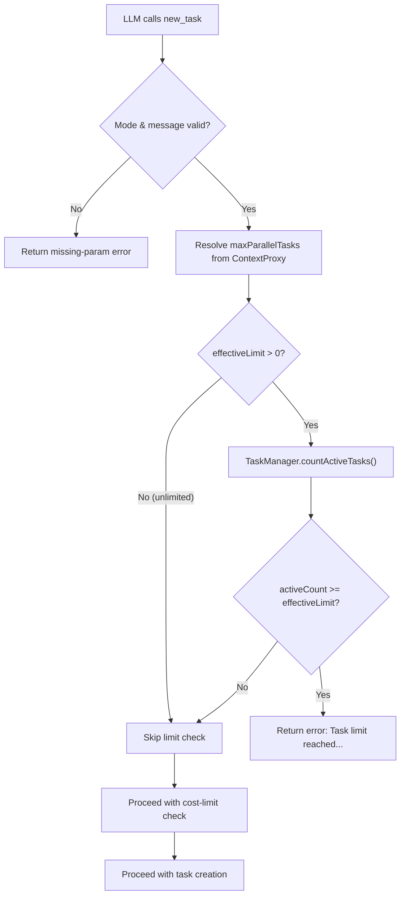

# Parallelism & Sub-Task Execution

Design of parallel task execution in Shofer, including the `new_task` tool (sync/async delegation), background task orchestration, and the TaskManager service.

## Overview

Shofer supports **parallel task execution**: multiple AI-powered tasks run concurrently within a single window. One task is **focused** (visible in the UI) while others continue processing in the background. This is analogous to Copilot's session model — each "task" is an independent conversation with its own history, mode, and tool loop.

Parallelism is exposed to the LLM via the `new_task` tool, which can spawn child tasks in either **synchronous** (blocking) or **asynchronous/background** (non-blocking) mode. The parent task manages background children through three supporting tools: `check_task_status`, `wait_for_task`, and `list_background_tasks`.

## Core Concepts

### Task

A **Task** ([`extensions/shofer/src/core/task/Task.ts`](../src/core/task/Task.ts)) is an active in-process conversation instance. It owns the API loop, tool execution, message history, and an in-memory `backgroundChildren` map tracking async child tasks it has spawned. Multiple `Task` instances can be alive concurrently.

### HistoryItem

A **HistoryItem** ([`@shofer/types/src/history.ts`](../packages/types/src/history.ts)) is the persisted record of a task, written to disk as `history_item.json` inside the task's storage directory. It holds metadata: `id`, `name`, `task` (first message text), `tokensIn`, `tokensOut`, `totalCost`, `workspace`, `mode`, `taskState`, `isBackground`, `backgroundChildIds`, etc.

### TaskManager

The **TaskManager** ([`extensions/shofer/src/services/task-manager/TaskManager.ts`](../src/services/task-manager/TaskManager.ts)) is a runtime-only service that tracks all live `Task` instances and provides a metadata overlay (`ManagedTask`) for the UI. It is the single source of truth for task lifecycle state and notifications.

```
HistoryItem (disk / sidebar)
    ↕ load/save (name field synced)
ManagedTask (TaskManager, in-memory)   ← title & runtime state live here
    ↑ registered by
Task (active instance)
    └─ backgroundChildren: Map<taskId, TaskHandle>  ← lightweight lifecycle tracking
```

### ManagedTask

A **ManagedTask** is the runtime descriptor `TaskManager` keeps for each managed task:

```typescript
interface ManagedTask {
	id: string // Task UUID
	name: string // Human-readable title
	taskId: string // Same as id
	workspace: string
	createdAt: number
	lastActiveAt: number
	state: TaskState // { lifecycle: TaskLifecycle, rating?: CompletionRating }
}
```

### TaskHandle

A **TaskHandle** ([`@shofer/types/src/task.ts`](../packages/types/src/task.ts)) is a lightweight in-memory reference the parent `Task` holds for each background child it spawned. Intentionally minimal — identity, lifecycle status, and timing only. No title.

```typescript
interface TaskHandle {
	taskId: string
	status: BackgroundTaskStatus // "starting" | "running" | "waiting" | "waiting_for_parent" | "completed" | "error" | "cancelled" | "paused"
	createdAt: number
	parentTaskId: string
}
```

### Task Lifecycle

The lifecycle of a task is represented by `TaskLifecycle`:

| State           | Color  | Pulse | Trigger                                                                    |
| --------------- | ------ | ----- | -------------------------------------------------------------------------- |
| `idle`          | Gray   | No    | `TaskIdle`, task restored from history                                     |
| `running`       | Green  | Yes   | `TaskStarted`, `TaskActive`                                                |
| `waiting_input` | Yellow | Yes   | `TaskInteractive` (needs user approval)                                    |
| `waiting`       | Blue   | Yes   | `wait_for_task` blocking on subtasks                                       |
| `paused`        | Orange | No    | User paused task (non-destructive stop)                                    |
| `completed`     | Green  | No    | `TaskCompleted` (with rating)                                              |
| `error`         | Red    | No    | `api_req_failed`, `mistake_limit_reached`, `auto_approval_max_req_reached` |

See [`task_states.md`](task_states.md) for the full state model including completion ratings and visual indicators.

---

## Architecture

```
┌─────────────────────────────────────────────────────────────────┐
│                          TaskManager                             │
├─────────────────────────────────────────────────────────────────┤
│  focusedTaskId: "task-1"                                        │
│                                                                  │
│  activeTasks:                                                    │
│    "task-1" → Task (focused, running)     ←── UI connected      │
│    "task-2" → Task (background, running)  ←── auto-approve      │
│    "task-3" → Task (background, waiting)  ←── needs input       │
│                                                                  │
│  notifications:                                                  │
│    [{ taskId: "task-3", type: "needs_input", ... }]             │
└─────────────────────────────────────────────────────────────────┘
                               │
                               ▼
┌─────────────────────────────────────────────────────────────────┐
│                     ShoferProvider (webview)                      │
├─────────────────────────────────────────────────────────────────┤
│  Shows focused task's messages                                  │
│  Task selector shows all tasks + state indicators               │
│  Notification badge for tasks needing input                     │
└─────────────────────────────────────────────────────────────────┘
```

### Stack vs. activeTasks

Two orthogonal concepts govern which task runs where:

- **`shoferStack`** (in ShoferProvider): what the user is **observing**. The top of the stack is the focused task whose messages are rendered in the chat panel.
- **`TaskManager.activeTasks`**: what is **executing**. Background tasks (including delegated subtasks) execute without stealing focus.

Non-destructive task switching uses `popFromStackWithoutAborting()` to remove a task from the UI stack without aborting it, allowing it to continue in the background.

### Invariant: At most one live `Task` per `taskId`

`createTaskWithHistoryItem()` enforces this invariant. If a live, non-abandoned, non-aborted instance already exists in `TaskManager.activeTasks` for the requested `taskId`, that instance is swapped back into the focused stack position instead of constructing a duplicate. This prevents "zombie" instances that race the original on the same history files.

---

## Global Parallel Task Limit

To prevent resource exhaustion (too many concurrent LLM calls, file-system contention, runaway API costs), Shofer enforces a configurable **global cap** on the number of parallel tasks. When the cap is hit, [`new_task`](native_tools.md#new_task) returns a clear error instructing the caller to wait and retry, or accomplish the work through other means (inline tool calls, sequential work, etc.).

### Motivation

Without a limit, the number of parallel tasks is unbounded. A runaway agent or a poorly-constrained delegation pattern can spawn dozens of concurrent tasks, each holding an LLM context window and consuming API quota. A configurable hard cap lets users bound concurrency at the system level.

### Setting: `maxParallelTasks`

Defined in the [`globalSettingsSchema`](../packages/types/src/global-settings.ts) Zod schema:

```typescript
/**
 * Maximum number of parallel (non-terminal, non-idle) tasks allowed globally.
 * When the number of running/waiting tasks reaches this limit, new_task
 * returns an error asking the caller to wait and retry or accomplish the
 * work through other means. Set to 0 for unlimited.
 * @default 10
 */
maxParallelTasks: z.number().int().min(0).optional(),
```

| Value               | Behavior                            |
| ------------------- | ----------------------------------- |
| `undefined` (unset) | Defaults to `10`                    |
| `0`                 | Unlimited (no enforcement)          |
| `1..N`              | Hard cap on concurrent active tasks |

The `0 = unlimited` convention is consistent with [`archivedTaskRetentionDays`](../packages/types/src/global-settings.ts) and [`commandExecutionTimeout`](#) which both use `0` to mean "disabled."

### What Counts as "Active"

A task is considered **active** if its lifecycle is `"running"` or `"waiting"` — the same predicate used by [`TaskManager.isActive()`](../src/services/task-manager/TaskManager.ts). Tasks in `"idle"`, `"paused"`, `"waiting_input"`, or any terminal state (`"completed"`, `"error"`) do **not** consume a concurrency slot.

Rationale: `"waiting"` tasks (blocked on `wait_for_task` or sync `send_message_to_task`) still hold an LLM context window and count against practical concurrency. `"waiting_input"` tasks (awaiting user approval) are idle — they consume no LLM resources.

### Enforcement in `new_task`

The limit is enforced as a gate inside [`NewTaskTool.execute()`](../src/core/tools/NewTaskTool.ts), **after** mode/message/todos validation but **before** the cost-limit check and task creation. This ensures cheap failures (no cost computation, no task instantiation).

```typescript
const maxParallel = provider.contextProxy.getValue("maxParallelTasks")
const effectiveLimit = maxParallel ?? 10
if (effectiveLimit > 0) {
	const activeCount = provider.taskManager.countActiveTasks()
	if (activeCount >= effectiveLimit) {
		pushToolResult(
			formatResponse.toolError(
				`Task limit reached: ${activeCount}/${effectiveLimit} tasks are currently running. ` +
					`Please wait for one to complete and try again later, ` +
					`or accomplish this work through other means (e.g., inline tool calls).`,
			),
		)
		return
	}
}
```

The error is a **tool error** (not an ask), so the LLM loop continues without blocking on user input — the model can decide to retry later or use alternative approaches.

**Why gate in `NewTaskTool` rather than `ShoferProvider.createTask()`?** `createTask()` is also called for history rehydration (`createTaskWithHistoryItem()`) and workflow launches — those paths should not be subject to the concurrency limit. The `new_task` tool is the correct single choke point.

### `TaskManager.countActiveTasks()`

[`TaskManager`](../src/services/task-manager/TaskManager.ts) exposes a public query method:

```typescript
/**
 * Count of non-terminal, non-idle managed tasks (running or waiting).
 * Used as the live concurrency count for the parallel-task limit.
 */
countActiveTasks(): number {
    let count = 0
    for (const m of this.managedTasks.values()) {
        if (TaskManager.isActive(m.state.lifecycle)) {
            count++
        }
    }
    return count
}
```

This is a thin public wrapper around the existing private `TaskManager.isActive()` helper.

### Settings UI

`maxParallelTasks` is exposed as a number input in **Settings → Advanced** ([`ExperimentalSettings`](../webview-ui/src/components/settings/ExperimentalSettings.tsx)), alongside other system-level limits like `archivedTaskRetentionDays`. The value is persisted via `ContextProxy` in `globalState`, surviving VS Code restarts.

### Design Decisions

| Decision                                                             | Rationale                                                                                                      |
| -------------------------------------------------------------------- | -------------------------------------------------------------------------------------------------------------- |
| Count uses `isActive()` (`running` \| `waiting`), not just `running` | `waiting` tasks hold an LLM context window and count against practical concurrency                             |
| Gate in `NewTaskTool`, not `ShoferProvider.createTask()`             | `createTask()` is called for history rehydration and workflow launches — those should not be gated             |
| Default value is `10`, not unlimited                                 | A reasonable default prevents runaway concurrency for new users while being generous enough for most workflows |
| Value `0` means unlimited                                            | Consistent with `archivedTaskRetentionDays` (`0 = disabled`) conventions                                       |
| Error is a tool error, not an ask                                    | Keeps the agent loop moving; the LLM can retry or use alternative approaches                                   |
| Settings in Advanced tab                                             | Co-located with other system-level limits (`archivedTaskRetentionDays`, `defaultCostLimit`)                    |



---

## `new_task` Tool

The [`new_task`](native_tools.md#new_task) tool creates a child task in a chosen mode. It supports two execution models controlled by the `is_background` parameter.

### Synchronous mode (`is_background` omitted or `false`, default)

The parent **blocks** until the child completes. The child result is returned as the tool's output, and the parent resumes where it left off.

```
Parent calls new_task(mode="code", message="Fix bug in foo.ts")
  → Parent enters "waiting" status
  → Child created, focused in stack
  → Child runs its tool loop
  → Child calls attempt_completion
  → resumeBlockingParent() restores parent
  → Parent receives child result as tool_result
  → Parent continues
```

**Constraint:** Must be called **alone** in a turn — no other tools in the same message. The model instruction: "CRITICAL: This tool MUST be called alone. Do NOT call this tool alongside other tools in the same message turn."

### Background mode (`is_background=true`)

The child starts immediately and runs **concurrently**. The parent receives the child's `task_id` in the tool result and continues **without blocking**.

```
Parent calls new_task(is_background=true, mode="code", message="Analyze file1.ts")
  → Child created, registered in TaskManager, started in background
  → Parent receives: "Child task started: <task_id>\nStatus: starting"
  → Parent continues its own tool loop immediately

Parent calls new_task(is_background=true, mode="code", message="Analyze file2.ts")
  → Second child started in background
  → Parent continues

Parent calls wait_for_task(task_ids=["<id1>", "<id2>"])
  → Blocks until both children complete
  → Returns results from both
```

#### Key differences from synchronous mode

| Aspect                                   | Sync                         | Async (Background)                 |
| ---------------------------------------- | ---------------------------- | ---------------------------------- |
| Parent status                            | `waiting`                    | Remains `running`                  |
| Parent blocks?                           | Yes                          | No                                 |
| Parent history saved?                    | Yes (delegation metadata)    | No (parent keeps running)          |
| Child completion triggers parent resume? | Yes (`resumeBlockingParent`) | No (parent explicitly polls/waits) |
| Can start multiple children?             | No                           | Yes (in parallel)                  |
| Stack behavior                           | Child becomes focused        | Focused task unchanged             |

#### Parameters

| Param              | Type    | Required | Description                                                                                                                                |
| ------------------ | ------- | -------- | ------------------------------------------------------------------------------------------------------------------------------------------ |
| `mode`             | string  | ✅       | Mode slug (e.g., `code`, `debug`, `architect`)                                                                                             |
| `message`          | string  | ✅       | Initial instructions for the child task                                                                                                    |
| `todos`            | string  | –        | Initial markdown checklist for the child                                                                                                   |
| `is_background`    | boolean | –        | When `true`, run child concurrently and return `task_id` immediately                                                                       |
| `softResultLength` | number  | –        | Soft suggestion for max characters of the subtask's completion result. Hard safety cap: 100000 characters (results beyond this truncated). |
| `softTimeoutSec`   | number  | –        | Soft guidance (in seconds) for how long the parent expects to wait. Informational only — not enforced.                                     |

### Delegation from background tasks

When a **background task** (not the focused task) calls `new_task`:

1. Parent is resolved via `TaskManager.getManagedTaskInstance(taskId)` — not from the stack top.
2. The current focused UI task is **not** popped or aborted.
3. The child is created with `openInStack: false` (no focus steal).
4. The child is registered in `TaskManager` for state tracking and notifications.

This preserves the invariant: background tasks should execute without stealing focus.

---

## Background Task Orchestration Tools

Six tools manage the parent-child relationship for background tasks. `list_background_tasks` and `send_message_to_task` are **always available** (bypass mode filtering); the remaining four are gated by the `subtasks` tool group. `check_task_status`, `wait_for_task`, and `list_background_tasks` are unconditionally auto-approved (read-only queries). `cancel_tasks` and `answer_subtask_question` are gated by the `alwaysAllowSubtasks` toggle. `send_message_to_task` (async) is always auto-approved; sync mode is gated by `alwaysAllowSubtasks`.

### `check_task_status`

Check the current status of a background child task. Returns the task's status and, if it has completed or errored, its result or error message. When `include_activity` is `true`, also returns the child's most recent tool calls and messages.

```typescript
// Parameters
{ task_id: string, include_activity?: boolean }

// Returns (when completed)
{ task_id: string, task_title?: string, status: "completed", result: string }

// Returns (when errored)
{ task_id: string, task_title?: string, status: "error", error: string }

// Returns (when still running)
{ task_id: string, task_title?: string, status: "running" | "waiting" }

// When include_activity=true and child is running:
// "... Recent activity: [tool] read_file, [say:text] Found 5 occurrences..."
```

**Implementation:** Reads the parent's `backgroundChildren` handle map for known status, then checks `TaskManager` for live instances. If no live instance exists, falls back to reading the child's persisted history. The title is fetched from `TaskManager.getManagedTask(taskId)?.name` at read time — no duplication into `TaskHandle`. When `include_activity` is set, reads the last 3 messages from the child's persisted message history.

If the child has a pending parent question (see `ask_followup_question` routing below), the question text and suggestions are surfaced in the output.

### `wait_for_task`

Block until one or more background child tasks reach a terminal state, then return their results. **Event-driven** — does not poll.

```typescript
// Parameters
{
  task_ids: string[],             // One or more task IDs
  wait?: "all" | "any",          // "all" (default): wait for all tasks; "any": return on first completion
  timeout?: number               // Max seconds to wait (default: 120)
}

// Returns
{
  task_ids: string[],             // Completed task IDs
  task_titles: string[],          // Corresponding titles
  // Per-task status and result/error text
}
```

**Implementation:** Creates a promise that resolves when each tracked child reaches `completed`, `error`, or `cancelled` status, OR when a child routes a question to the parent (`"waiting_for_parent"`). Listens for `managedTask:completed`, `managedTask:error`, and `managedTask:needs-parent-input` events. On timeout, returns current statuses for all tasks without error. The `wait` parameter controls the resolution strategy:

- `"all"` (default): resolves when every listed task reaches a terminal state.
- `"any"`: resolves as soon as at least one task completes successfully.

### `list_background_tasks`

List all background child tasks started by the current task via `new_task` with `is_background=true`.

```typescript
// Parameters: none

// Returns
[
  { task_id: string, title?: string, status: string, created_at: number },
  ...
]
```

**Implementation:** Iterates over `Task.backgroundChildren` and enriches each entry with the title from `TaskManager.getManagedTask(taskId)?.name`.

### `cancel_tasks`

Stop one or more background child tasks. Already-completed, errored, or cancelled tasks are unaffected (no-op).

```typescript
// Parameters
{ task_ids: string[] }

// Returns per-task status:
// "Canceled: 2 task(s)\nchild-1: cancelled\nchild-2: already completed"
```

**Implementation:** Builds a classification plan first (so the auto-rendered chat row reflects per-task verdicts), then awaits `askApproval`, then performs `abortTask(false)` on each live instance. Cancelled handles end in status `"cancelled"` (distinct from `"error"`). A failure during abort downgrades that task's status to `"error"` and surfaces the message.

### `answer_subtask_question`

Answer a question that a background child task asked via `ask_followup_question`. When a background child needs clarification, its question is routed to the parent instead of the user. Use this tool to provide the answer and unblock the child.

```typescript
// Parameters
{ task_id: string, answer: string }
```

**Implementation:** Resolves the child's pending parent question via the typed `Task.resolvePendingParentQuestion(answer)` accessor, allowing the child's `ask_followup_question` tool handler to continue. Flips the parent-side handle status from `"waiting_for_parent"` back to `"running"`.

### `ask_followup_question` routing

When a background child calls `ask_followup_question`, the question is automatically routed to the parent:

1. The child registers the question via `Task.setPendingParentQuestion()` which returns a promise the tool handler `await`s.
2. The parent-side `TaskHandle.status` for this child flips to `"waiting_for_parent"`.
3. `TaskManager` emits a `managedTask:needs-parent-input` event so any parent `wait_for_task` currently blocked on this child wakes up immediately.
4. The parent discovers the question via `check_task_status` (which surfaces the question text + suggestions) or `wait_for_task` (which now returns with the question in its summary).
5. The parent answers via `answer_subtask_question`, resolving the child's promise; the child resumes as if the user had answered.
6. If the parent is aborted while the child is waiting, `Task.abortTask` calls `rejectPendingParentQuestion(new Error("task aborted"))` so the child's await unblocks cleanly with a tool error instead of hanging.

---

## Abort Propagation

### Parent abort → children abort

When a parent task is aborted (user presses Stop, or the task encounters a fatal error), background children are aborted via `Task.abortBackgroundChildren()`. This method iterates over `backgroundChildren`, fetches each live instance from `TaskManager`, and calls `abortTask(true)`.

### Child abort

If a background child aborts (error, user intervention), the parent is **not** automatically notified. The parent discovers this through `check_task_status` or `wait_for_task`, which will return `status: "error"`.

### Auto-abort on parent completion

`AttemptCompletionTool` calls `task.abortBackgroundChildren()` before emitting `TaskCompleted` and setting `task.abort = true`. This ensures that no background children outlive their parent. The abort is all-or-nothing — all children are stopped.

---

## Auto-Approval

Background task orchestration tools are registered as always-approved in [`src/core/auto-approval/index.ts`](../src/core/auto-approval/index.ts):

| Tool                      | Reason                                                                                             |
| ------------------------- | -------------------------------------------------------------------------------------------------- |
| `check_task_status`       | Read-only query; no side effects                                                                   |
| `wait_for_task`           | Blocking wait with timeout; no side effects on other tasks                                         |
| `list_background_tasks`   | Read-only enumeration                                                                              |
| `cancel_tasks`            | Parent owns its children; stopping is non-destructive to other tasks                               |
| `answer_subtask_question` | Parent answering its own child's question; no external side effects                                |
| `ask_followup_question`   | Child routing a question **up to its parent**; answered by another agent, not the user (see below) |

The `tool` string in the JSON payload uses camelCase (`checkTaskStatus`, `waitForTask`, `listBackgroundTasks`) and must match the `ShoferSayTool.tool` union and the `ChatRow` switch case.

> **`ask_followup_question` is auto-approved only when directed at another task.** A background child's question routed to its parent arrives on the `tool` ask path and is unconditionally approved — no human is interrupted (see [`auto_approval.md`](auto_approval.md#inter-task-questions)). A question directed at the **user** instead flows through the `followup` ask category, gated by `alwaysAllowFollowupQuestions`. Same tool, different destination.

### ChatRow rendering

Each tool shows a dedicated `ChatRow` entry with:

- A codicon (e.g., `codicon-check`, `codicon-clock`, `codicon-list-unordered`)
- A label describing the operation
- Relevant detail (task_id, title, task list)

Titles are rendered as `title ?? task_id` — the UI gracefully handles missing titles.

---

## Background Task Behavior

When a task is **not focused** but **active**:

1. **Auto-approve mode**: If the task has `alwaysAllow*` settings, it continues autonomously.
2. **Needs input**: Emits `TaskInteractive` event → notification badge appears in the UI.
3. **API streaming**: Continues receiving chunks, updating task state.
4. **Tool execution**: Runs tools that don't require approval.
5. **State persistence**: Saves progress continuously (crash recovery).

### `statusMutationTimeout` debouncing

To prevent UI flickering, `Task.ts` uses a timeout before emitting state change events:

- **Focused tasks**: 2000ms delay (avoids rapid state toggles during streaming).
- **Background tasks**: 0ms delay (immediate) for responsive TaskSelector indicators.

---

## Edge Cases

### Parent completes before child

If the parent calls `attempt_completion` while background children are running, all pending children are aborted automatically. Children cannot outlive their parent.

### Parent aborted while child running

Children are aborted automatically (see Abort Propagation above).

### Child needs user input

The child emits `TaskInteractive`, which `TaskManager` catches and translates into a notification. `check_task_status` returns `status: "waiting"`. The parent must either switch focus to the child (to approve/reject) or let it time out.

### Orphaned children

Children are aborted when the parent completes (via `Task.abortBackgroundChildren()` called by `AttemptCompletionTool`) or when the parent is aborted (via `TaskManager`'s abort handler). If a parent is force-killed (crash), children tracked by `TaskManager` continue running independently until they complete or the user intervenes — they will be marked as errored on next restore if still alive.

### Duplicate `attempt_completion` after delegation resume

When a parent resumes from synchronous delegation, the LLM may generate multiple `attempt_completion` calls in a single streaming response. A `didExecuteAttemptCompletion` flag on `Task` ensures only the first one executes; subsequent ones are skipped with an error `tool_result`.

### `switch_mode` from background tasks

`switch_mode` is task-scoped via [`handleModeSwitch`](../src/core/webview/ShoferProvider.ts) — it updates only the calling task's `_taskMode` and history item. It does not emit `ModeChanged` on the provider, switch API profiles, or call `postStateToWebview`. User-driven mode switches (from the UI mode picker) use [`handleUserModeSwitch`](../src/core/webview/ShoferProvider.ts), which retains the full provider-level behavior including API profile switching and webview updates.

---

## State Restore on Restart

On extension restart:

1. `TaskManager.restoreManagedTasks(history)` rehydrates the managed-task map from persisted history.
2. `sanitizeRestoredState` downgrades any transient lifecycle (`running`, `waiting_input`) to `idle` — those values can never be true after a restart since no live `Task` instance exists.
3. A private `restored` flag gates methods that depend on restoration having completed (`registerBackgroundTask`, etc.).

Task instances are **not** automatically rehydrated — tasks remain idle until the user explicitly loads them.

---

## Design Decisions

1. **`TaskHandle` stays minimal.** Identity + status + timing only. No title, no result caching. Title is read from `TaskManager` at query time; result is read from the child's persisted history.

2. **`backgroundChildren` lives on `Task`, not `TaskManager`.** Each parent tracks its own children. This keeps the parent-child relationship scoped and avoids global bookkeeping.

3. **Background children are always registered in `TaskManager`.** Even though tracking lives on `Task`, `TaskManager` registration ensures state indicators and notifications propagate to the UI.

4. **No automatic parent resume for background children.** The parent explicitly polls via `check_task_status` or blocks via `wait_for_task`. This gives the LLM full control over when to collect results.

5. **Sync `new_task` must be called alone.** The model instruction enforces single-tool-per-turn for synchronous delegation to prevent the parent from issuing conflicting tool calls while the child runs.

6. **`alwaysAllow*` inheritance.** Background children inherit the parent's `alwaysAllow*` settings. Mode is specified by the caller; if not provided, defaults to the parent's current mode.

7. **Children are aborted when parent terminates.** `AttemptCompletionTool` explicitly calls `Task.abortBackgroundChildren()` before completing the parent. `TaskManager`'s abort handler similarly cleans up children when a parent is stopped. No child outlives its parent in normal operation.

---

## Gaps & Improvement Opportunities

Discovered during source-code verification. These are areas where the documentation could be expanded or the implementation could be tightened.

### Documentation Gaps

1. **`blockingChildResolvers` mechanism**: The sync `new_task` flow relies on `ShoferProvider.blockingChildResolvers` — a `Map<childTaskId, resolveFn>` set by `NewTaskTool.execute()` before the child runs. When the child calls `attempt_completion`, `resumeBlockingParent()` fires the resolver to unblock the parent's suspended `NewTaskTool.execute()`. This resolver-registration protocol is not described in the doc.

2. **`cleanupBackgroundChildren()` on Task**: [`Task.cleanupBackgroundChildren()`](src/core/task/Task.ts:276) reaps dead children whose instances are no longer alive in `TaskManager`, consulting persisted history for final status. This method exists but has no corresponding documentation.

3. **`TaskManager` events consumed by tools**: `wait_for_task` listens for `managedTask:completed`, `managedTask:error`, and `managedTask:needs-parent-input` events to implement its event-driven (non-polling) blocking. `check_task_status` consults `managedTasks` map for live state. Neither tool's event dependency is documented.

4. **`PendingParentQuestionInfo` interface**: Defined in [`@shofer/types/src/task.ts`](../packages/types/src/task.ts:194) with fields `{ question, suggestions }`. The parent-question routing flow (steps 1–6 in §"`ask_followup_question` routing") uses this interface but it isn't formally introduced.

5. **Auto-approval granularity for background tools**: The `check_task_status`, `wait_for_task`, and `list_background_tasks` tools are unconditionally auto-approved (read-only) in [`auto-approval/index.ts`](../src/core/auto-approval/index.ts:207). `cancel_tasks` and `answer_subtask_question` are gated by `alwaysAllowSubtasks` ([`index.ts:200`](../src/core/auto-approval/index.ts:200)). The doc could explain why these two tiers exist.

### Observability Gaps

1. **No `task_created_subtask` telemetry**: When `new_task` spawns a background child, no telemetry event captures the parent→child relationship for analytics. The only trace is the `childIds` field on the parent `HistoryItem`.

2. **No timeout enforcement on `wait_for_task`**: The `timeout` parameter is described as a soft cap ("returns current statuses"), but there's no mechanism to cancel or warn when a child takes longer than expected. A timed-out `wait_for_task` becomes indistinguishable from a normal return.

3. **Orphaned children on crash**: Children whose parent crashes continue running independently. On next restore, they are marked as errored. A periodic "orphan sweep" or explicit orphan-recovery path could improve resilience.

### Potential Improvements

1. **Background child status heartbeat**: `check_task_status` could surface the child's idle duration (`lastActiveAt`) to help the parent decide whether to cancel a stalled child.

2. **Partial `wait_for_task`**: The `"any"` wait strategy returns on first completion, but the parent must repeat calls for remaining children. A `"progress"` mode that returns incrementally as children finish could reduce LLM round-trips.

3. **`cancel_tasks` with reason propagation**: When a parent cancels a child, the cancellation reason is not forwarded to the child's `TaskAbortedInfo.reason`. Adding a `cancelReason` parameter would let the child distinguish "parent completed" from "parent aborted" in telemetry/debugging.

---

## Related Documents

- [`native_tools.md`](native_tools.md) — Complete tool reference with parameter schemas
- [`task_states.md`](task_states.md) — Task lifecycle state model and visual mapping
- [`todos/done/Shofer-async-newtask.md`](../../../todos/done/Shofer-async-newtask.md) — Original async `new_task` design proposal
- [`todos/done/Shofer-parallel-tasks.md`](../../../todos/done/Shofer-parallel-tasks.md) — Parallel task execution implementation plan
- [`todos/done/shofer-background-task-titles.md`](../../../todos/done/shofer-background-task-titles.md) — Title propagation design for background task tools
