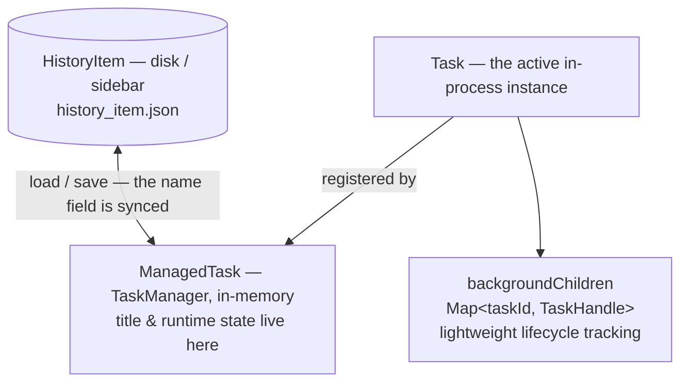
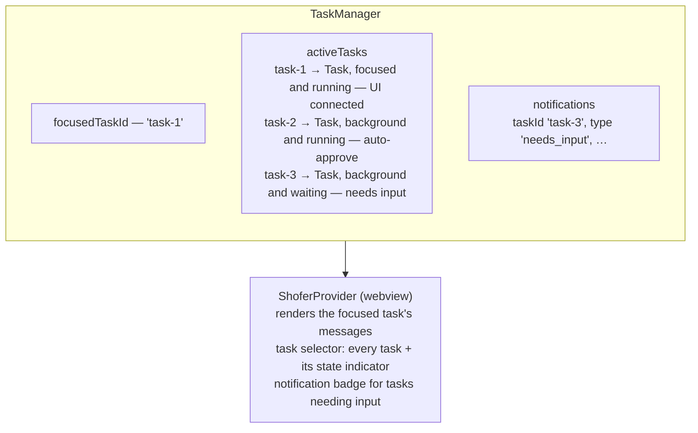
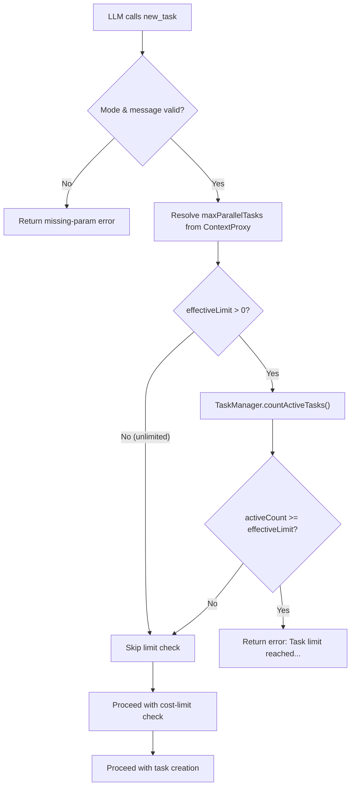
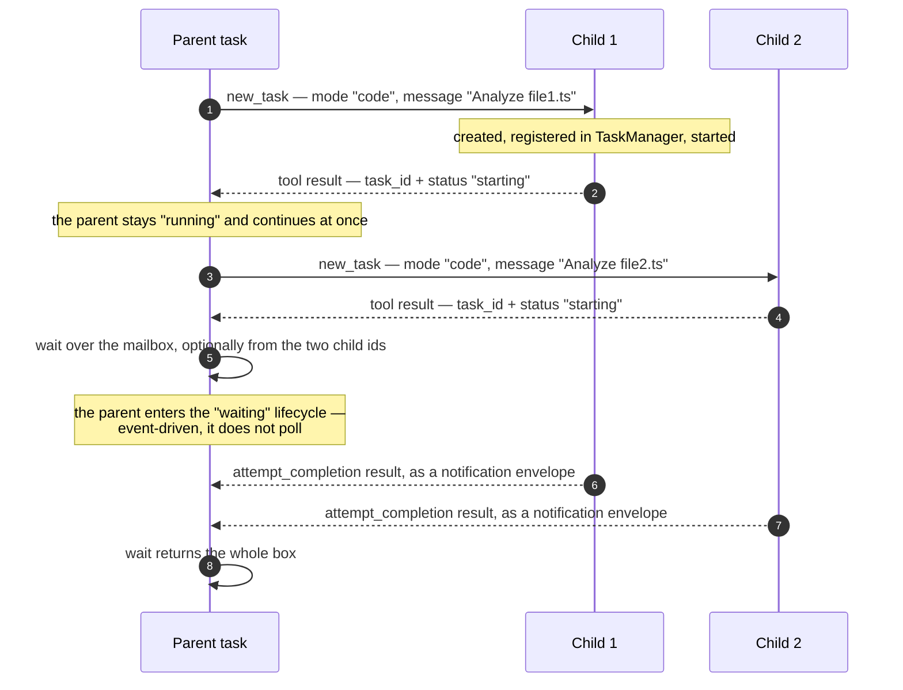

# Parallelism & Sub-Task Execution

Design of parallel task execution in Shofer, including the `new_task` tool (sync/async delegation), background task orchestration, and the TaskManager service.

## Overview

Shofer supports **parallel task execution**: multiple AI-powered tasks run concurrently within a single window. One task is **focused** (visible in the UI) while others continue processing in the background. This is analogous to Copilot's session model — each "task" is an independent conversation with its own history, mode, and tool loop.

Parallelism is exposed to the LLM via the `new_task` tool, which always spawns a child that runs **concurrently** with its parent. The parent inspects its children with `check_task_status` and `list_background_tasks`, stops one with `cancel_tasks`, and receives their results — and their questions — through its **mailbox** ([`task_messaging.md`](task_messaging.md)).

## Core Concepts

### Task

A **Task** ([`extensions/shofer/packages/core/src/task/Task.ts`](../packages/core/src/task/Task.ts)) is an active in-process conversation instance. It owns the API loop, tool execution, message history, and an in-memory `backgroundChildren` map tracking async child tasks it has spawned. Multiple `Task` instances can be alive concurrently.

### HistoryItem

A **HistoryItem** ([`@shofer/types/src/history.ts`](../packages/types/src/history.ts)) is the persisted record of a task, written to disk as `history_item.json` inside the task's storage directory. It holds metadata: `id`, `name`, `task` (first message text), `tokensIn`, `tokensOut`, `totalCost`, `workspace`, `mode`, `taskState`, `isBackground`, `backgroundChildIds`, etc.

### TaskManager

The **TaskManager** ([`extensions/shofer/src/services/task-manager/TaskManager.ts`](../src/services/task-manager/TaskManager.ts)) is a runtime-only service that tracks all live `Task` instances and provides a metadata overlay (`ManagedTask`) for the UI. It is the single source of truth for task lifecycle state and notifications.


```mermaid
flowchart TD
    HI[("HistoryItem — disk / sidebar<br/>history_item.json")]
    MT["ManagedTask — TaskManager, in-memory<br/>title &amp; runtime state live here"]
    T["Task — the active in-process instance"]
    BC["backgroundChildren<br/>Map&lt;taskId, TaskHandle&gt;<br/>lightweight lifecycle tracking"]

    HI <-->|"load / save — the name field is synced"| MT
    T -->|"registered by"| MT
    T --> BC
```

### ManagedTask

A **ManagedTask** is the runtime descriptor `TaskManager` keeps for each managed task:

```typescript
interface ManagedTask {
	id: string // Task UUID
	name: string // Human-readable title
	taskId: string // Same as id
	workspace: string
	createdAt: number
	lastActiveAt: number
	state: TaskState // { lifecycle: TaskLifecycle, rating?: CompletionRating }
}
```

### TaskHandle

A **TaskHandle** ([`@shofer/types/src/task.ts`](../packages/types/src/task.ts)) is a lightweight in-memory reference the parent `Task` holds for each background child it spawned. Intentionally minimal — identity, lifecycle status, and timing only. No title.

```typescript
interface TaskHandle {
	taskId: string
	status: BackgroundTaskStatus // "starting" | "running" | "waiting" | "waiting_for_parent" | "completed" | "error" | "cancelled" | "paused"
	createdAt: number
	parentTaskId: string
}
```

### Task Lifecycle

The lifecycle of a task is represented by `TaskLifecycle`:

| State           | Color  | Pulse | Trigger                                                                    |
| --------------- | ------ | ----- | -------------------------------------------------------------------------- |
| `idle`          | Gray   | No    | `TaskIdle`, task restored from history                                     |
| `running`       | Green  | Yes   | `TaskStarted`, `TaskActive`                                                |
| `waiting_input` | Yellow | Yes   | `TaskInteractive` (needs user approval)                                    |
| `waiting`       | Blue   | Yes   | parked in `wait` on the mailbox                                            |
| `paused`        | Orange | No    | User paused task (non-destructive stop)                                    |
| `completed`     | Green  | No    | `TaskCompleted` (with rating)                                              |
| `error`         | Red    | No    | `api_req_failed`, `mistake_limit_reached`, `auto_approval_max_req_reached` |

See [`task_states.md`](task_states.md) for the full state model including completion ratings and visual indicators.

---

## Architecture


```mermaid
flowchart TB
    subgraph TM["TaskManager"]
        direction TB
        F["focusedTaskId — 'task-1'"]
        A["activeTasks<br/>task-1 → Task, focused and running — UI connected<br/>task-2 → Task, background and running — auto-approve<br/>task-3 → Task, background and waiting — needs input"]
        N["notifications<br/>taskId 'task-3', type 'needs_input', …"]
    end

    SP["ShoferProvider (webview)<br/>renders the focused task's messages<br/>task selector: every task + its state indicator<br/>notification badge for tasks needing input"]

    TM --> SP
```

### Stack vs. activeTasks

Two orthogonal concepts govern which task runs where:

- **`shoferStack`** (in ShoferProvider): what the user is **observing**. The top of the stack is the focused task whose messages are rendered in the chat panel.
- **`TaskManager.activeTasks`**: what is **executing**. Background tasks (including delegated subtasks) execute without stealing focus.

Non-destructive task switching uses `popFromStackWithoutAborting()` to remove a task from the UI stack without aborting it, allowing it to continue in the background.

### Invariant: At most one live `Task` per `taskId`

`createTaskWithHistoryItem()` enforces this invariant. If a live, non-abandoned, non-aborted instance already exists in `TaskManager.activeTasks` for the requested `taskId`, that instance is swapped back into the focused stack position instead of constructing a duplicate. This prevents "zombie" instances that race the original on the same history files.

---

## Global Parallel Task Limit

To prevent resource exhaustion (too many concurrent LLM calls, file-system contention, runaway API costs), Shofer enforces a configurable **global cap** on the number of parallel tasks. When the cap is hit, [`new_task`](native_tools.md#new_task) returns a clear error instructing the caller to wait and retry, or accomplish the work through other means (inline tool calls, sequential work, etc.).

### Motivation

Without a limit, the number of parallel tasks is unbounded. A runaway agent or a poorly-constrained delegation pattern can spawn dozens of concurrent tasks, each holding an LLM context window and consuming API quota. A configurable hard cap lets users bound concurrency at the system level.

### Setting: `maxParallelTasks`

Defined in the [`globalSettingsSchema`](../packages/types/src/global-settings.ts) Zod schema:

```typescript
/**
 * Maximum number of parallel (non-terminal, non-idle) tasks allowed globally.
 * When the number of running/waiting tasks reaches this limit, new_task
 * returns an error asking the caller to wait and retry or accomplish the
 * work through other means. Set to 0 for unlimited.
 * @default 10
 */
maxParallelTasks: z.number().int().min(0).optional(),
```

| Value               | Behavior                            |
| ------------------- | ----------------------------------- |
| `undefined` (unset) | Defaults to `10`                    |
| `0`                 | Unlimited (no enforcement)          |
| `1..N`              | Hard cap on concurrent active tasks |

The `0 = unlimited` convention is consistent with [`archivedTaskRetentionDays`](../packages/types/src/global-settings.ts) and [`commandExecutionTimeout`](#) which both use `0` to mean "disabled."

### What Counts as "Active"

A task is considered **active** if its lifecycle is `"running"` or `"waiting"` — the same predicate used by [`TaskManager.isActive()`](../src/services/task-manager/TaskManager.ts). Tasks in `"idle"`, `"paused"`, `"waiting_input"`, or any terminal state (`"completed"`, `"error"`) do **not** consume a concurrency slot.

Rationale: `"waiting"` tasks (parked in `wait` on their mailbox) still hold an LLM context window and count against practical concurrency. `"waiting_input"` tasks (awaiting user approval) are idle — they consume no LLM resources.

### Enforcement in `new_task`

The limit is enforced as a gate inside [`NewTaskTool.execute()`](../packages/core/src/tools/NewTaskTool.ts), **after** mode/message/todos validation but **before** the cost-limit check and task creation. This ensures cheap failures (no cost computation, no task instantiation).

```typescript
const maxParallel = provider.contextProxy.getValue("maxParallelTasks")
const effectiveLimit = maxParallel ?? 10
if (effectiveLimit > 0) {
	const activeCount = provider.taskManager.countActiveTasks()
	if (activeCount >= effectiveLimit) {
		pushToolResult(
			formatResponse.toolError(
				`Task limit reached: ${activeCount}/${effectiveLimit} tasks are currently running. ` +
					`Please wait for one to complete and try again later, ` +
					`or accomplish this work through other means (e.g., inline tool calls).`,
			),
		)
		return
	}
}
```

The error is a **tool error** (not an ask), so the LLM loop continues without blocking on user input — the model can decide to retry later or use alternative approaches.

**Why gate in `NewTaskTool` rather than `ShoferProvider.createTask()`?** `createTask()` is also called for history rehydration (`createTaskWithHistoryItem()`) — that path should not be subject to the concurrency limit. The `new_task` tool is the correct single choke point.

### `TaskManager.countActiveTasks()`

[`TaskManager`](../src/services/task-manager/TaskManager.ts) exposes a public query method:

```typescript
/**
 * Count of non-terminal, non-idle managed tasks (running or waiting).
 * Used as the live concurrency count for the parallel-task limit.
 */
countActiveTasks(): number {
    let count = 0
    for (const m of this.managedTasks.values()) {
        if (TaskManager.isActive(m.state.lifecycle)) {
            count++
        }
    }
    return count
}
```

This is a thin public wrapper around the existing private `TaskManager.isActive()` helper.

### Settings UI

`maxParallelTasks` is exposed as a number input in **Settings → Advanced** ([`ExperimentalSettings`](../webview-ui/src/components/settings/ExperimentalSettings.tsx)), alongside other system-level limits like `archivedTaskRetentionDays`. The value is persisted via `ContextProxy` in `globalState`, surviving VS Code restarts.

### Design Decisions

| Decision                                                             | Rationale                                                                                                      |
| -------------------------------------------------------------------- | -------------------------------------------------------------------------------------------------------------- |
| Count uses `isActive()` (`running` \| `waiting`), not just `running` | `waiting` tasks hold an LLM context window and count against practical concurrency                             |
| Gate in `NewTaskTool`, not `ShoferProvider.createTask()`             | `createTask()` is called for history rehydration — that path should not be gated                               |
| Default value is `10`, not unlimited                                 | A reasonable default prevents runaway concurrency for new users while being generous enough for most workflows |
| Value `0` means unlimited                                            | Consistent with `archivedTaskRetentionDays` (`0 = disabled`) conventions                                       |
| Error is a tool error, not an ask                                    | Keeps the agent loop moving; the LLM can retry or use alternative approaches                                   |
| Settings in Advanced tab                                             | Co-located with other system-level limits (`archivedTaskRetentionDays`, `defaultCostLimit`)                    |


```mermaid
flowchart TD
    A["LLM calls new_task"] --> B{"Mode & message valid?"}
    B -->|No| C["Return missing-param error"]
    B -->|Yes| D["Resolve maxParallelTasks from ContextProxy"]
    D --> E{"effectiveLimit > 0?"}
    E -->|"No (unlimited)"| F["Skip limit check"]
    E -->|Yes| G["TaskManager.countActiveTasks()"]
    G --> H{"activeCount >= effectiveLimit?"}
    H -->|Yes| I["Return error: Task limit reached..."]
    H -->|No| F
    F --> J["Proceed with cost-limit check"]
    J --> K["Proceed with task creation"]
```

---

## `new_task` Tool

The [`new_task`](native_tools.md#new_task) tool creates a child task in a chosen
mode. The child **always runs concurrently**: the tool returns as soon as the
child has started, with its `task_id`, and the parent continues its own loop
without blocking. There is one execution model, and the parent is never
suspended inside it.


```mermaid
sequenceDiagram
    autonumber
    participant P as Parent task
    participant C1 as Child 1
    participant C2 as Child 2

    P->>C1: new_task — mode "code", message "Analyze file1.ts"
    Note over C1: created, registered in TaskManager, started
    C1-->>P: tool result — task_id + status "starting"
    Note over P: the parent stays "running" and continues at once
    P->>C2: new_task — mode "code", message "Analyze file2.ts"
    C2-->>P: tool result — task_id + status "starting"
    P->>P: wait over the mailbox, optionally from the two child ids
    Note over P: the parent enters the "waiting" lifecycle —<br/>event-driven, it does not poll
    C1-->>P: attempt_completion result, as a notification envelope
    C2-->>P: attempt_completion result, as a notification envelope
    P->>P: wait returns the whole box
```

**Why there is no blocking mode.** A suspended parent could not answer its own
child's questions, could not cancel it, and could not coordinate anything else —
so the one entity with the context to unblock a stuck child was the one entity
guaranteed to be asleep. Concurrency plus a mailbox replaces it: a parent that
wants the result calls `wait`, and gets it as an envelope
([`task_messaging.md`](task_messaging.md)).

### How a parent gets a child's result

The child's `attempt_completion` persists the result on the child's own history
(where `check_task_status` reads it) **and** delivers a `notification` envelope
to the parent's mailbox — `from` the child, subject `result: <child title>`,
body the result capped at `MAX_SUBTASK_RESULT_LENGTH`, `wake: true`.

The parent therefore has three ways to collect it, and none of them polls:

- `wait(from: ["<child id>"])` — park until that child (or anything else) writes.
- `wait(timeout_sec: 0)` — read whatever has already arrived.
- End the turn. `wake: true` restarts the parent when the result lands.

`check_task_status` remains for inspecting a child mid-flight, and `cancel_tasks`
for stopping one whose work is no longer wanted.

#### Parameters

| Param              | Type     | Required | Description                                                                                                                                |
| ------------------ | -------- | -------- | ------------------------------------------------------------------------------------------------------------------------------------------ |
| `mode`             | string   | ✅       | Mode slug (e.g., `code`, `debug`, `architect`)                                                                                             |
| `message`          | string   | ✅       | Initial instructions for the child task                                                                                                    |
| `todos`            | string   | –        | Initial markdown checklist for the child                                                                                                   |
| `peer_task_ids`    | string[] | –        | Least-privilege peer grants for the child, beyond its parent. Validated against `rootTaskId`; the reverse edge is mirrored onto each peer  |
| `title`            | string   | –        | Locked display title for the child (max 60 chars); the child cannot rename itself                                                          |
| `softResultLength` | number   | –        | Soft suggestion for max characters of the subtask's completion result. Hard safety cap: 100000 characters (results beyond this truncated). |
| `softTimeoutSec`   | number   | –        | Soft guidance (in seconds) for how long the child is expected to take. Informational only — not enforced.                                  |

### Delegation from background tasks

When a **background task** (not the focused task) calls `new_task`:

1. Parent is resolved via `TaskManager.getManagedTaskInstance(taskId)` — not from the stack top.
2. The current focused UI task is **not** popped or aborted.
3. The child is created with `openInStack: false` (no focus steal).
4. The child is registered in `TaskManager` for state tracking and notifications.

This preserves the invariant: background tasks should execute without stealing focus.

---

## Background Task Orchestration Tools

Three tools manage the parent-child relationship. `list_background_tasks` is **always available** (bypasses mode filtering); `new_task`, `check_task_status` and `cancel_tasks` are the `subtasks` tool group. `check_task_status` and `list_background_tasks` are unconditionally auto-approved (read-only queries); `cancel_tasks` is gated by the `alwaysAllowSubtasks` toggle, because it destroys in-flight work. Task-to-task messaging is not among them: `send_message`, `reply` and `wait` are always available, never mode-gated and never toggle-gated ([`task_messaging.md`](task_messaging.md)).

### `check_task_status`

Check the current status of a background child task. Returns the task's status and, if it has completed or errored, its result or error message. When `include_activity` is `true`, also returns the child's most recent tool calls and messages.

```typescript
// Parameters
{ task_id: string, include_activity?: boolean }

// Returns (when completed)
{ task_id: string, task_title?: string, status: "completed", result: string }

// Returns (when errored)
{ task_id: string, task_title?: string, status: "error", error: string }

// Returns (when still running)
{ task_id: string, task_title?: string, status: "running" | "waiting" }

// When include_activity=true and child is running:
// "... Recent activity: [tool] read_file, [say:text] Found 5 occurrences..."
```

**Implementation:** Reads the parent's `backgroundChildren` handle map for known status, then checks `TaskManager` for live instances. If no live instance exists, falls back to reading the child's persisted history. The title is fetched from `TaskManager.getManagedTask(taskId)?.name` at read time — no duplication into `TaskHandle`. When `include_activity` is set, reads the last 3 messages from the child's persisted message history.

If the child has a pending parent question (see `ask_followup_question` routing below), the question text and suggestions are surfaced in the output.

### `list_background_tasks`

List all child tasks started by the current task via `new_task`.

```typescript
// Parameters: none

// Returns
[
  { task_id: string, title?: string, status: string, created_at: number },
  ...
]
```

**Implementation:** Iterates over `Task.backgroundChildren` and enriches each entry with the title from `TaskManager.getManagedTask(taskId)?.name`.

### `cancel_tasks`

Stop one or more background child tasks. Already-completed, errored, or cancelled tasks are unaffected (no-op).

```typescript
// Parameters
{ task_ids: string[] }

// Returns per-task status:
// "Canceled: 2 task(s)\nchild-1: cancelled\nchild-2: already completed"
```

**Implementation:** Builds a classification plan first (so the auto-rendered chat row reflects per-task verdicts), then awaits `askApproval`, then performs `abortTask(false)` on each live instance. Cancelled handles end in status `"cancelled"` (distinct from `"error"`). A failure during abort downgrades that task's status to `"error"` and surfaces the message.

### `ask_followup_question` routing — a child's question is DUAL-CHANNEL

A child that needs clarification asks on **two channels at once**, and the first
answer wins:

1. The child raises its ordinary `task.ask("followup", …)` — the same mechanism a
   user-facing question uses — so the question and its suggestion buttons appear
   in the child's own chat, where a HUMAN can answer it.
2. The child delivers a `request` envelope to its **parent's mailbox**: subject
   `question: <first line>`, body the question plus its suggestions, the
   child-question deadline (600 s), `wake: true`. The parent sees it in its
   digest and answers with `reply`.

The child parks in `waiting_input` — it is waiting for an ANSWER, not for mail —
and the parent's in-memory `TaskHandle` for it flips to `"waiting_for_parent"`, so
`check_task_status` and `list_background_tasks` report reality.

What resolves it:

- **The parent replies.** `ReplyTool` delivers the reply envelope and then calls
  `Task.answerForwardedQuestion(envelopeId, body)` on the live child, which routes
  the answer through `handleWebviewAskResponse("messageResponse", …)` — the same
  path the webview uses. It no-ops unless that child is parked on exactly that
  request, so a human who got there first still wins.
- **A human answers in the child's chat.** The ask resolves directly, and the
  child then withdraws the now-pointless request from the parent's box
  (`Mailbox.resolveRequest`), so the parent's digest stops showing a question
  nobody is waiting on.
- **Nobody answers.** The child arms its own expiry for the envelope's deadline
  and, when it fires, answers its own ask with
  `Your question to the parent expired unanswered after 600s. Decide yourself, or ask again.`
  This is the one place a timer touches an ask, and it is deliberate: the mailbox
  never sweeps on a timer (expiry there is lazy, at read), but a child parked on
  an ask has nobody to read anything, so without it the child would wait forever
  for a request that has already lapsed out of its parent's box. It restores the
  child's LIVENESS with a decision it can act on; it does not fabricate an answer
  from anyone.
- **The child is aborted.** `Task.abortTask` calls `clearForwardedQuestion()`; the
  parked `task.ask` unwinds via `AskIgnoredError` and the tool surfaces a clean
  tool error rather than hanging.

`TaskManager` **suppresses** the desktop `needs_input` notification while
`task.forwardedQuestion` is set: the question already has a live agent audience, so
the human is not the one being waited on. They can still open the child and answer
it. The `followup` auto-approval (`alwaysAllowFollowupQuestions`) is likewise
suppressed for these questions — they must never be auto-answered with the first
suggestion.

## Abort Propagation

### Parent abort → children abort

When a parent task is aborted (user presses Stop, or the task encounters a fatal error), background children are aborted via `Task.abortBackgroundChildren()`. This method iterates over `backgroundChildren`, fetches each live instance from `TaskManager`, and calls `abortTask(true)`.

### Child abort

If a background child aborts (error, user intervention), the parent is **not** automatically notified. The parent discovers this through `check_task_status`, which returns `status: "error"`.

### Auto-abort on parent completion

`AttemptCompletionTool` calls `task.abortBackgroundChildren()` before emitting `TaskCompleted` and setting `task.abort = true`. This ensures that no background children outlive their parent. The abort is all-or-nothing — all children are stopped.

---

## Auto-Approval

Background task orchestration tools are registered as always-approved in [`packages/core/src/auto-approval/index.ts`](../packages/core/src/auto-approval/index.ts):

| Tool                    | Reason                                                                                                           |
| ----------------------- | ---------------------------------------------------------------------------------------------------------------- |
| `check_task_status`     | Read-only query; no side effects                                                                                 |
| `list_background_tasks` | Read-only enumeration                                                                                            |
| `cancel_tasks`          | Parent owns its children; stopping is non-destructive to other tasks                                             |
| `ask_followup_question` | Child asking a question rendered in its own chat UI; answered by EITHER the parent agent or the user (see below) |

The `tool` string in the JSON payload uses camelCase (`checkTaskStatus`, `waitForTask`, `listBackgroundTasks`) and must match the `ShoferSayTool.tool` union and the `ChatRow` switch case.

> **`ask_followup_question` is auto-approved only when directed at another task.** A child's question arrives on the `tool` ask path (for the ChatRow entry) and is unconditionally approved — the actual question is then rendered via `task.ask("followup")` in the child's chat UI, where BOTH the parent agent (with `reply`, answering the request in its mailbox) and the user (interactively) can answer. The `followup` auto-approval (`alwaysAllowFollowupQuestions`) is suppressed for these routed questions so they are never auto-answered with the first suggestion. A question directed at the **user** from a foreground task instead flows through the `followup` ask category directly, gated by `alwaysAllowFollowupQuestions`. Same tool, different destination.

### ChatRow rendering

Each tool shows a dedicated `ChatRow` entry with:

- A codicon (e.g., `codicon-check`, `codicon-clock`, `codicon-list-unordered`)
- A label describing the operation
- Relevant detail (task_id, title, task list)

Titles are rendered as `title ?? task_id` — the UI gracefully handles missing titles.

---

## Background Task Behavior

When a task is **not focused** but **active**:

1. **Auto-approve mode**: If the task has `alwaysAllow*` settings, it continues autonomously.
2. **Needs input**: Emits `TaskInteractive` event → notification badge appears in the UI.
3. **API streaming**: Continues receiving chunks, updating task state.
4. **Tool execution**: Runs tools that don't require approval.
5. **State persistence**: Saves progress continuously (crash recovery).

### `statusMutationTimeout` debouncing

To prevent UI flickering, `Task.ts` uses a timeout before emitting state change events:

- **Focused tasks**: 2000ms delay (avoids rapid state toggles during streaming).
- **Background tasks**: 0ms delay (immediate) for responsive TaskSelector indicators.

---

## Edge Cases

### Parent completes before child

If the parent calls `attempt_completion` while background children are running, all pending children are aborted automatically (via `Task.abortBackgroundChildren()`). Children cannot outlive their parent. The `TaskManager.onAborted` handler guards against downgrading a child that already reached a terminal state (`completed` / `error`) — a child that finished before the parent's abort keeps its terminal state instead of being overridden to `paused`.

### Parent aborted while child running

Children are aborted automatically (see Abort Propagation above).

### Child needs user input

The child emits `TaskInteractive`, which `TaskManager` catches. For **tool-approval asks**, this translates into a `needs_input` notification so the user knows the child needs attention. For a **forwarded `ask_followup_question`** (which uses `task.ask("followup")`, an `interactiveAsk`), the notification is **suppressed** — the question already has a live agent audience, the parent, so no desktop notification is shown. The user can still see and answer it by switching to the child task. `check_task_status` returns `status: "waiting"` (for tool approvals) or `status: "waiting_for_parent"` (for a forwarded question). The parent either answers it with `reply`, switches focus to the child, or lets it expire.

### Orphaned children

Children are aborted when the parent completes (via `Task.abortBackgroundChildren()` called by `AttemptCompletionTool`) or when the parent is aborted (via `TaskManager`'s abort handler). If a parent is force-killed (crash), children tracked by `TaskManager` continue running independently until they complete or the user intervenes — they will be marked as errored on next restore if still alive.

### Duplicate `attempt_completion` after delegation resume

When a parent resumes from synchronous delegation, the LLM may generate multiple `attempt_completion` calls in a single streaming response. A `didExecuteAttemptCompletion` flag on `Task` ensures only the first one executes; subsequent ones are skipped with an error `tool_result`.

### `switch_mode` from background tasks

`switch_mode` is task-scoped via [`handleModeSwitch`](../src/core/webview/ShoferProvider.ts) — it updates only the calling task's `_taskMode` and history item. It does not emit `ModeChanged` on the provider, switch API profiles, or call `postStateToWebview`. User-driven mode switches (from the UI mode picker) use [`handleUserModeSwitch`](../src/core/webview/ShoferProvider.ts), which retains the full provider-level behavior including API profile switching and webview updates.

---

## State Restore on Restart

On extension restart:

1. `TaskManager.restoreManagedTasks(history)` rehydrates the managed-task map from persisted history.
2. `sanitizeRestoredState` downgrades any transient lifecycle (`running`, `waiting_input`) to `idle` — those values can never be true after a restart since no live `Task` instance exists.
3. A private `restored` flag gates methods that depend on restoration having completed (`registerBackgroundTask`, etc.).

Task instances are **not** automatically rehydrated — tasks remain idle until the user explicitly loads them.

---

## Design Decisions

1. **`TaskHandle` stays minimal.** Identity + status + timing only. No title, no result caching. Title is read from `TaskManager` at query time; result is read from the child's persisted history.

2. **`backgroundChildren` lives on `Task`, not `TaskManager`.** Each parent tracks its own children. This keeps the parent-child relationship scoped and avoids global bookkeeping.

3. **Background children are always registered in `TaskManager`.** Even though tracking lives on `Task`, `TaskManager` registration ensures state indicators and notifications propagate to the UI.

4. **A child's result is DELIVERED, not polled for.** `attempt_completion` puts it in the parent's mailbox with `wake: true`, so a parent that ended its turn is restarted and one that is parked in `wait` returns at once. `check_task_status` remains for inspecting a child mid-flight, which is a different question.

5. **`alwaysAllow*` inheritance.** Children inherit the parent's `alwaysAllow*` settings. Mode is specified by the caller; if not provided, defaults to the parent's current mode.

6. **Children are aborted when parent terminates.** `AttemptCompletionTool` explicitly calls `Task.abortBackgroundChildren()` before completing the parent. `TaskManager`'s abort handler similarly cleans up children when a parent is stopped. No child outlives its parent in normal operation.

---

## Gaps & Improvement Opportunities

Discovered during source-code verification. These are areas where the documentation could be expanded or the implementation could be tightened.

### Documentation Gaps

1. **`cleanupBackgroundChildren()` on Task**: [`Task.cleanupBackgroundChildren()`](../packages/core/src/task/Task.ts) reaps dead children whose instances are no longer alive in `TaskManager`, consulting persisted history for final status. This method exists but has no corresponding documentation.

2. **`TaskManager` events consumed by tools**: `check_task_status` consults the `managedTasks` map for live state. Its state dependency is not documented.

3. **Auto-approval granularity for the subtask tools**: `check_task_status` and `list_background_tasks` are unconditionally auto-approved (read-only) in [`auto-approval/index.ts`](../packages/core/src/auto-approval/index.ts); `cancel_tasks` is gated by `alwaysAllowSubtasks` because it destroys in-flight work. The doc could explain why these two tiers exist.

### Observability Gaps

1. **No `task_created_subtask` telemetry**: When `new_task` spawns a background child, no telemetry event captures the parent→child relationship for analytics. The only trace is the `childIds` field on the parent `HistoryItem`.

2. **`softTimeoutSec` is not enforced**: it is advisory guidance injected into the child's prompt, with no mechanism to warn or cancel when a child overruns it. `cancel_tasks` is the only lever, and the parent has to decide to pull it.

3. **Orphaned children on crash**: Children whose parent crashes continue running independently. On next restore, they are marked as errored. A periodic "orphan sweep" or explicit orphan-recovery path could improve resilience.

### Potential Improvements

1. **Background child status heartbeat**: `check_task_status` could surface the child's idle duration (`lastActiveAt`) to help the parent decide whether to cancel a stalled child.

2. **Fan-in over many children**: `wait` returns the whole mailbox on the first delivery, so a parent awaiting ten children is woken by the first and must call `wait` again for the rest. A wake condition expressed as "when N of these have written" would cut those round-trips.

3. **`cancel_tasks` with reason propagation**: When a parent cancels a child, the cancellation reason is not forwarded to the child's `TaskAbortedInfo.reason`. Adding a `cancelReason` parameter would let the child distinguish "parent completed" from "parent aborted" in telemetry/debugging.

---

## Related Documents

- [`native_tools.md`](native_tools.md) — Complete tool reference with parameter schemas
- [`task_states.md`](task_states.md) — Task lifecycle state model and visual mapping
- `todos/done/Shofer-async-newtask.md` — Original async `new_task` design proposal
- `todos/done/Shofer-parallel-tasks.md` — Parallel task execution implementation plan
- `todos/done/shofer-background-task-titles.md` — Title propagation design for background task tools
