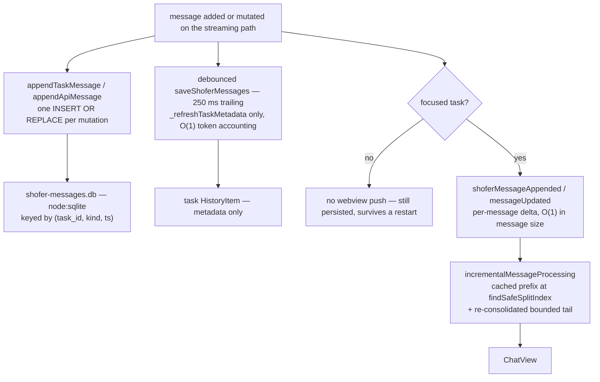

# Shofer Performance Characteristics

How Shofer keeps the extension host responsive during long agent sessions. The
dominant costs are message persistence, host↔webview IPC, and per-chunk work on
the streaming hot path; each is bounded as described below.

## Message persistence — SQLite, one row per message

Task messages (the `api` conversation history and the `ui` message stream) are
stored in a single SQLite database, `shofer-messages.db`, under the global
storage path. The backend is Node's built-in `node:sqlite` (no native
dependency), loaded lazily and cached per storage path.

- **Schema.** One `messages` table keyed by `(task_id, kind, ts)`, `data` holding
  the serialized message. See
  [`message-store.ts`](../packages/core/src/task-persistence/message-store.ts).
- **Append is O(1).** Each new or mutated message is written with a single
  `INSERT OR REPLACE`. `ts` is the dedupe/order key, so a partial→final update, an
  `isAnswered` flip, or a streaming `api_req_started` mutation re-writes the same
  row rather than growing the store. `appendTaskMessage` /`appendApiMessage`
  ([`taskMessages.ts`](../packages/core/src/task-persistence/taskMessages.ts),
  [`apiMessages.ts`](../packages/core/src/task-persistence/apiMessages.ts)) do
  exactly one row write per mutation — no whole-array serialization, no clone.
- **Reads.** `storeReadAll` returns rows ordered by `ts`; `storeReadTail(max)`
  returns the last `max` messages plus a `hasMore` flag for windowed loading.
- **Compaction / overwrite.** `storeSaveAll` (used by timeline rewind and
  message edit/delete) replaces the whole set in one transaction. There is no
  append-log, no periodic file rewrite, and no long-lived file handle to manage.

Because per-message writes are cheap, the debounced `saveShoferMessages`
(250 ms trailing) on the streaming path only refreshes lightweight task metadata
via `_refreshTaskMetadata`; it does not rewrite the message store. Metadata
token accounting is O(1): a running `_tokenBearingMessageCount` is maintained at
the mutation sites and feeds a `_cachedTokenUsage`, so a save never re-walks the
whole array. See [`Task.ts`](../packages/core/src/task/Task.ts).

## Host↔webview IPC — per-message deltas, not full snapshots

State reaches the webview through three targeted channels on `ShoferProvider`
instead of a single full-state push:

- **`postInitState()`** — a full snapshot, sent once per task lifetime (on task
  switch or webview reset), not per streamed chunk.
- **`postConfigUpdate(key, value)`** — a single settings key/value pair.
- **`postTaskStateUpdate(updates)`** — task lifecycle fields only.

During streaming, new content flows as per-message deltas —
`shoferMessageAppended` for new messages and `messageUpdated` for in-place edits.
Both are **focus-gated**: a background task's streaming updates skip the webview
push (gated on `getFocusedTaskId() === taskId || getCurrentTask()?.taskId ===
taskId`) while still persisting to SQLite so the task survives a restart. This
keeps per-chunk IPC cost O(1) in the size of the message rather than O(history).

## Cold task-switch — windowed loading

Switching to a long task that has no live instance rehydrates from SQLite. Only
the last `COLD_LOAD_TAIL_WINDOW` (200) UI messages are loaded into the webview
initially, via `readTaskMessagesTail`; a "Load older messages…" sentinel at the
top of the list posts `loadOlderShoferMessages`, and the host streams the older
page back in a single `shoferMessagesPrepended` batch (deduped by `ts`). When the
window is active, `ShoferProvider` synthesizes the task header from the persisted
`currentTaskItem.task` so the first-prompt row stays correct even though the
window doesn't include message index 0. See
[`ShoferProvider.ts`](../src/core/webview/ShoferProvider.ts).

## Webview-side incremental consolidation

`ChatView` derives display state
(`combineApiRequests(combineCommandSequences(...))` + `getApiMetrics`) from the
message array. A naive re-derivation on every streamed chunk is O(n) per chunk =
O(n²) per task. [`incrementalMessageProcessing.ts`](../webview-ui/src/components/chat/incrementalMessageProcessing.ts)
caches the consolidated output of a reference-stable prefix at a provably-safe
split boundary and re-consolidates only the bounded tail per chunk, producing
byte-identical output. `findSafeSplitIndex` returns the largest boundary `B`
where no consolidation head before `B` reaches an index `≥ B`; open (unclosed)
heads use an `Infinity` reach sentinel so they always stay in the re-consolidated
suffix. Reference-identity of the prefix detects task switch / edit / rewind
restore and forces a full recompute.

Other webview memoization: `ExtensionStateContext` wraps its context value in
`useMemo`, `MermaidBlock` is wrapped in `memo`, and Virtuoso's `components` /
`increaseViewportBy` identities are hoisted to module scope so routine appends
don't remount the list.

## Bounded working set

Several caps keep large payloads from spiking `large_object` heap and stalling
the single-threaded event loop:

- **Tool-result blobs.** Inline tool output over `shoferBlobCapBytes` (default
  64 KiB) is written to `.shofer/blobs/<sha256>.txt` and replaced inline with a
  `<shofer-blob …/>` reference resolved on demand.
  See [`BlobStore.ts`](../packages/core/src/blob-store/BlobStore.ts).
- **MCP responses.** Responses over `shoferMcpMaxResponseBytes` (default 1 MiB,
  `0` disables) are truncated on a UTF-8 boundary with a banner pointing the agent
  at the setting.
- **Code-index batches.** `MAX_BATCH_BYTES` (2 MiB, in
  [`code-index/constants`](../packages/core/src/services/code-index/constants/index.ts))
  caps in-flight scanner bytes so peak indexer memory is bounded regardless of
  repository shape.
- **Streaming providers** push chunks into an array and emit a single
  `chunks.join("")` at end-of-stream — no quadratic `accumulated += chunk` growth.
- **Log arguments** are capped at `MAX_LOG_ARG_BYTES` (8 KiB) so a hot-path log
  call never stringifies a whole conversation/state object.

## File I/O parallelism

`UV_THREADPOOL_SIZE` is set to `16` at the very top of
[`extension.ts`](../src/extension.ts), before any module that touches `fs` is
imported (libuv reads it once on first use). This removes the default 4-thread
serialization point when concurrent task switches, background saves, and
snapshot writes overlap.

## LLM system-prompt and tools caching

Within a task, the system-prompt base and the tools array are cached
(`_cachedSystemPromptBase` / `_getOrBuildTools` in
[`Task.ts`](../packages/core/src/task/Task.ts)) and rebuilt only when their inputs change
(mode/config change, context management), rather than reassembled on every turn.
