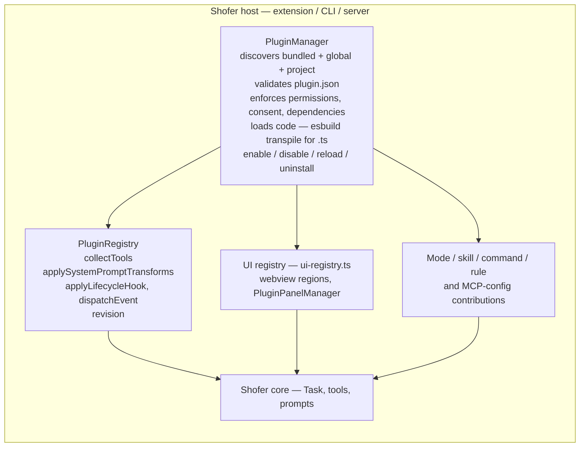
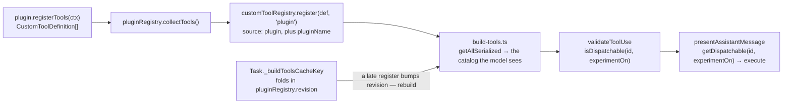
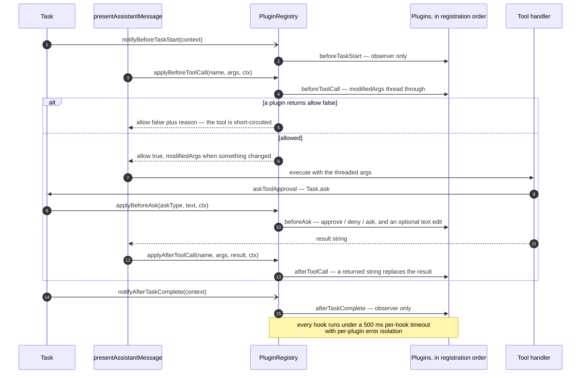
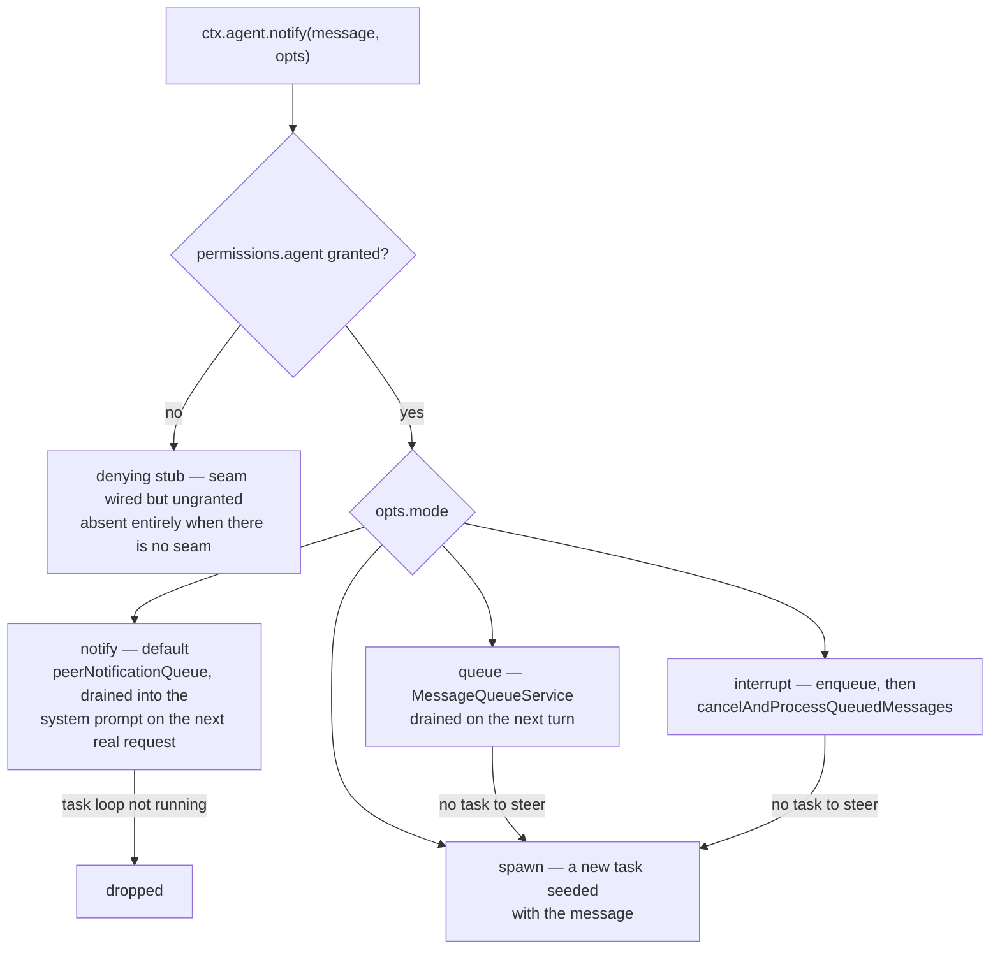
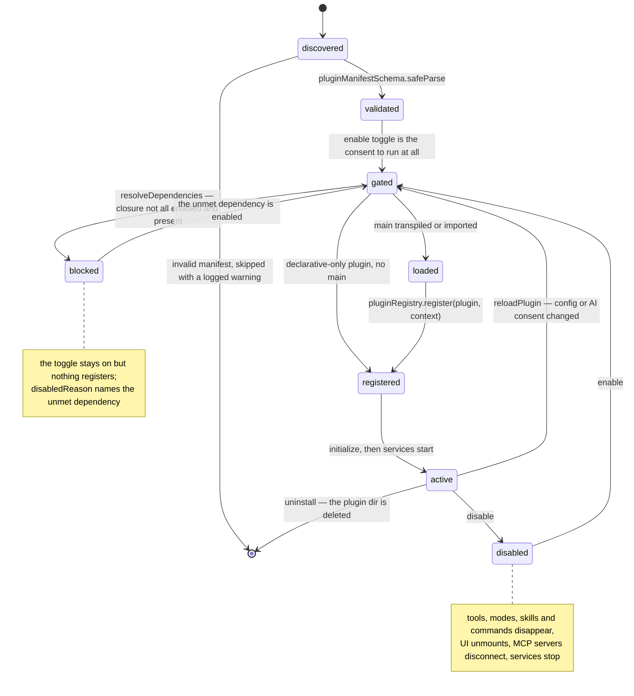

# Plugin System — Design Reference

This is the developer-facing architecture reference for Shofer's plugin system: a
single package format that is a strict **superset of MCP** — one plugin can affect
the UI, system prompt, tools, modes, hooks, background services, and lifecycle, not
just expose callable functions.

Everything described here is implemented and shipped, **except** the additive changes in
[§14 Proposed](#14-proposed-agent-control-api-for-workflow--runner-plugins) (a scoped agent-control
API for long-running workflow/runner plugins — the enabling work for a Temporal
worker plugin) and the deferred hosted remote plugin **registry**
([§13 Deferred](#13-deferred)).

For **authoring** a plugin (manifest fields, build invocations, step-by-step
walkthroughs) see the author-facing guide **[`../PLUGINS.md`](../PLUGINS.md)**. This
document covers the _substrate_ — how the pieces fit inside Shofer — and does not
duplicate the how-to.

## Table of Contents

1. [Motivation](#1-motivation)
2. [Design Goals](#2-design-goals)
3. [Architecture Overview](#3-architecture-overview)
4. [Plugin Manifest](#4-plugin-manifest)
5. [Extension Points](#5-extension-points)
6. [Plugin Lifecycle](#6-plugin-lifecycle)
7. [Security Model](#7-security-model)
8. [Distribution & Discovery](#8-distribution--discovery)
9. [Relationship to MCP](#9-relationship-to-mcp)
10. [Relationship to Existing Subsystems](#10-relationship-to-existing-subsystems)
11. [UI Integration](#11-ui-integration)
12. [Comparison with OpenCode and Claude Code](#12-comparison-with-opencode-and-claude-code)
13. [Deferred](#13-deferred)
14. [Proposed: Agent-Control API for Workflow/Runner Plugins](#14-proposed-agent-control-api-for-workflow--runner-plugins)

---

## 1. Motivation

Shofer has several extension mechanisms that predate the plugin system, each
limited to one surface:

| Mechanism                                                  | What it extends      | Limitation                                                                                      |
| ---------------------------------------------------------- | -------------------- | ----------------------------------------------------------------------------------------------- |
| **MCP servers**                                            | Tools + resources    | Only callable functions and readable resources. No system prompt, UI, mode, or lifecycle reach. |
| **Custom tools** (`.shofer/tools/`)                        | Tools only           | File-based TypeScript tools; no lifecycle hooks, no prompt access.                              |
| **Private tool providers** (`shofer.privateToolProviders`) | Tools only           | VS Code extension-registered tools via command channel. No behavioral extension.                |
| **Skills** (`.shofer/skills/`)                             | System prompt (lazy) | Markdown instructions loaded on demand. No code execution, no hooks.                            |

A plugin unifies all of these into **one package format with one manifest** — a
package that bundles tools, prompt modifications, UI contributions, mode
definitions, hooks, background services, and lifecycle handlers, all declaratively
described and safely sandboxed — while remaining a strict superset of MCP (an MCP
server is one kind of plugin contribution).

---

## 2. Design Goals

1. **Superset of MCP.** A plugin does everything an MCP server can (expose tools/resources) plus everything Shofer-internal (modify the system prompt, contribute UI, register modes, hook into lifecycle, run background services, affect auto-approval).

2. **Declarative manifest.** A `plugin.json` declares what the plugin contributes. Shofer reads it and wires the extension points without the plugin needing to know Shofer internals.

3. **Host-agnostic.** Plugins use the same `HostBridge` (`getHost()`) seam as the core. A plugin runs identically in the VS Code extension, the CLI, and a headless server. No `vscode` imports in plugin code.

4. **Sandboxed.** Plugins load with restricted permissions. The manifest declares what resources the plugin needs (filesystem paths, network endpoints, UI regions); Shofer enforces these at runtime.

5. **Composable.** Multiple plugins coexist. Extension points have defined composition semantics — system-prompt transforms chain in order, tool contributions merge, UI contributions slot into named regions, and modes/skills/commands are namespaced so they cannot collide.

6. **Distributable.** Plugins are packaged as `.shofer-plugin` archives; installation is one CLI command (or a `.shofer/plugins.json` declaration).

7. **Safe failure.** A crashing plugin is isolated. Its tools disappear, its prompt transforms are skipped, its UI unmounts, its services stop — the rest of Shofer keeps working.

---

## 3. Architecture Overview

### The substrate

The plugin system is built on two host-agnostic core types plus a host-side
manager:

- **`ShoferPlugin`** ([`packages/types/src/plugin.ts`](../packages/types/src/plugin.ts)) — the plugin interface: `initialize`, `registerTools`, `transformSystemPrompt`, lifecycle hooks, `onEvent`, and UI message handlers.
- **`PluginRegistry`** ([`packages/core/src/plugins/plugin-registry.ts`](../packages/core/src/plugins/plugin-registry.ts)) — the in-process registry the core reads from. It exposes `collectTools()`, `applySystemPromptTransforms()`, `applyLifecycleHook()`, `dispatchEvent()`, and a **`revision`** counter (bumped on every register/unregister).
- **`PluginManager`** ([`packages/core/src/plugins/plugin-manager.ts`](../packages/core/src/plugins/plugin-manager.ts)) — the host-side driver: discovery, manifest validation, permission/consent gating, code loading, dependency resolution, and register/unregister into the registry.

The core calls into plugins at fixed seams:

| Call site                                      | File                                                                                                                                              | What it does                                                          |
| ---------------------------------------------- | ------------------------------------------------------------------------------------------------------------------------------------------------- | --------------------------------------------------------------------- |
| `pluginRegistry.collectTools()`                | [`build-tools.ts`](../packages/core/src/task/build-tools.ts)                                                                                      | Plugin tools are registered into `customToolRegistry` and assembled.  |
| `pluginRegistry.applySystemPromptTransforms()` | [`system.ts`](../packages/core/src/prompts/system.ts)                                                                                             | The system prompt is threaded through all plugin transforms in order. |
| `pluginRegistry.applyLifecycleHook()`          | [`presentAssistantMessage.ts`](../packages/core/src/assistant-message/presentAssistantMessage.ts), [`Task.ts`](../packages/core/src/task/Task.ts) | Tool-call / ask / task-lifecycle hooks fire.                          |
| `pluginRegistry.dispatchEvent()`               | [`extension.ts`](../src/extension.ts)                                                                                                             | Every telemetry event is forwarded to plugin `onEvent` observers.     |

Because plugins load asynchronously (fire-and-forget, off the task-start hot
path), the registry's `revision` is folded into `Task._buildToolsCacheKey`
([`Task.ts`](../packages/core/src/task/Task.ts)) so the per-task tool catalog
rebuilds when an async-loaded plugin registers — otherwise a late-registering
plugin tool would be absent from the catalog the model sees.



### Directory layout

```
<extension>/dist/plugins/          ← bundled first-party plugins (shipped in the build)
~/.shofer/plugins/                 ← global plugins (all workspaces)
<workspace>/.shofer/plugins/       ← project plugins

  my-plugin/
    ├── plugin.json          ← manifest
    ├── index.ts             ← entry point (or index.js); optional (declarative-only plugins omit it)
    ├── tools/               ← tool definitions
    ├── modes/               ← mode YAML files
    ├── skills/              ← SKILL.md files
    ├── commands/            ← slash command .md files
    └── ui/                  ← built UI bundles (optional)
```

---

## 4. Plugin Manifest

### `plugin.json`

```jsonc
{
	"name": "my-org-ci",
	"version": "1.0.0",
	"description": "CI/CD integration — Jenkins/GitLab tools, deploy modes, pipeline UI.",
	"author": "DevOps Team",
	"homepage": "https://github.com/my-org/shofer-ci-plugin",
	"license": "MIT",

	// Minimum Shofer version required, and the plugin-API version this targets.
	"shoferVersion": ">=1.0.0",
	"shoferPluginApiVersion": "1",

	// Entry point (relative to plugin dir). If omitted, the plugin is purely
	// declarative (modes, skills, commands, MCP configs — no code hooks).
	"main": "index.ts",

	// Permissions the plugin requests (all default to denied).
	"permissions": {
		"tools": true, // Register tools
		"systemPrompt": true, // Transform the system prompt
		"modes": true, // Contribute mode definitions
		"skills": true, // Contribute skills
		"commands": true, // Contribute slash commands
		"rules": true, // Contribute rules markdown
		"mcpServers": true, // Declare MCP server configs
		"ui": ["chat-input-toolbar", "task-header"], // UI regions to contribute to
		"lifecycle": true, // Hook into task lifecycle
		"events": true, // Observe telemetry/lifecycle events
		"network": ["https://jenkins.my-org.com"], // Fetch allowlist
		"filesystem": ["./ci-config/"], // Host-path fs allowlist
		"ai": true, // Host LLM/embeddings (billed; consented separately)
		"agent": true, // Proactive agent-steering via ctx.agent.notify
		"task": true, // Task control via ctx.task: markers, rewind, setCwd, openTask
		"editor": true, // Multi-file diff viewer via ctx.host.editor
	},

	// Bundled (first-party) only: ship enabled rather than waiting to be opted into.
	"defaultEnabled": false,
	// Override the 500ms per-hook budget for THIS plugin's lifecycle hooks (max 60000).
	"hookTimeoutMs": 500,

	// Declarative contributions (no code needed for these).
	"contributes": {
		"modes": [
			{ "slug": "deploy", "name": "🚀 Deploy", "roleDefinition": "...", "tools": ["read", "execute", "mcp"] },
		],
		"skills": [{ "name": "deploy-to-staging", "description": "Deploy the current branch to staging" }],
		"commands": [
			{ "name": "deploy", "description": "Deploy the current project", "argumentHint": "<environment>" },
		],
		"mcpServers": {
			"jenkins": { "type": "streamable-http", "url": "https://jenkins.my-org.com/mcp" },
		},
		"rules": [{ "path": "rules/deploy-rules.md", "modes": ["deploy", "code"] }],
		"ui": [{ "region": "chat-input-toolbar", "entry": "ui/badge.js" }],
	},

	// Other plugins that must be installed + enabled for this one to activate.
	"dependencies": ["git-integration"],

	// User-configurable settings for this plugin (schema drives the Settings form).
	"config": {
		"type": "object",
		"properties": {
			"jenkinsUrl": { "type": "string", "description": "Jenkins base URL" },
			"defaultEnvironment": { "type": "string", "enum": ["staging", "production"], "default": "staging" },
		},
	},
}
```

### Manifest validation

The manifest is validated against a Zod schema (`pluginManifestSchema`) in
`@shofer/types`. Unknown fields are rejected (fail-closed). The `permissions`
block is the security contract — every plugin API call is checked against the
declared permissions. Plugin modes, commands, and skills are namespaced
`<plugin>:<name>` (see [§5](#5-extension-points)), so contributor collisions are
impossible by construction — there is no last-installed-wins tie-break.

### `permissions.ai`

`permissions.ai: true` requests **host LLM/embeddings access** — the `ctx.ai`
surface ([§5.12](#512-host-capabilities-ctx)). It is unlike the other permission
flags: it costs the **user money** (billed model calls on their configured
provider account). The manifest grant is necessary but **not sufficient** —
`ctx.ai` goes live only after a **separate, explicit consent**
([§7](#7-security-model), "Billed AI calls consent"), distinct from the plain
enable toggle. A plugin that declares `permissions.ai` but has not been
AI-consented gets a **denying** `ctx.ai` (every call throws + warns); a plugin
that never declared it gets **no** `ctx.ai` at all. The plugin never receives raw
API keys — only an opaque `ApiHandler` the host constructs.

---

## 5. Extension Points

### 5.1 Tools (`registerTools`)

A plugin returns `CustomToolDefinition[]`; they are registered into the shared
`customToolRegistry` ([`custom-tool-registry.ts`](../packages/core/src/custom-tools/custom-tool-registry.ts))
with `source: "plugin"` and plugin attribution (`pluginName`) for the UI and
auto-approval.

Plugin tools reach and execute through the model **regardless of the `customTools`
experiment flag**. That experiment gates _file-based_ custom tools, but
plugin-source tools are a first-class capability: `customToolRegistry.isDispatchable(id, experimentOn)`
and `getDispatchable(id, experimentOn)` return true/the definition for any
`source: "plugin"` tool unconditionally (`t.source === "plugin" || experimentOn`).
The model-facing wiring uses these — `validateToolUse` (via `isValidToolName` plus
the mode allow-list) and the `presentAssistantMessage` dispatch — so a plugin tool
is callable even with the experiment off.

Because plugins register asynchronously, the registry's `revision`
([§3](#3-architecture-overview)) is part of `Task._buildToolsCacheKey`, forcing the
tool catalog to rebuild when a late plugin registers (else a plugin tool such as
`ask_live_memory` would be missing from the catalog).

The path from a plugin's `registerTools` to a model-issued call:



### 5.2 System Prompt Transform (`transformSystemPrompt`)

Plugins chain in registration order (or manifest `priority`). Each receives the
prompt-so-far and the `PluginContext` and returns a new prompt; a throwing plugin
is skipped. `PluginContext` carries:

```typescript
export interface PluginContext {
	readonly workspacePath?: string
	readonly mode?: string
	readonly taskId?: string
	readonly parentTaskId?: string // spawning parent's id, when the task is a subtask
	readonly rootTaskId?: string // the delegation tree's root, when the task is a subtask
	readonly cwd?: string
	readonly config?: Record<string, unknown> // validated, default-merged plugin settings
	readonly host?: PluginHost // RESTRICTED, permission-checked host surface (NOT the full getHost())
	readonly ai?: PluginAi // host LLM/embeddings (only with permissions.ai + consent)
	readonly storage?: PluginStorage // per-plugin persistent dir
	readonly agent?: PluginAgent // proactive agent-steering (only with permissions.agent)
	readonly ui?: PluginUiSender // push to the plugin's own UI / open a panel
}
```

`host` is the **restricted** `PluginHost` (fs/fetch/notifier/env/watch/**log**),
scoped to the plugin's `permissions` and checked at runtime by the sandbox — not
the full `getHost()` `HostBridge`.

### 5.3 Modes (`contributes.modes`)

A plugin ships mode definitions in its manifest; they merge into the mode
resolution chain alongside `.shofer/shofermodes` — which is now the **only** source of
modes, since Shofer's own six are themselves a plugin's contribution (the bundled
`builtin-config` plugin, [`plugins/builtin-config/docs/modes.md`](../plugins/builtin-config/docs/modes.md)).
`effectiveModes()` in `packages/core/src/plugins/plugin-modes.ts` performs that merge.

Each plugin mode is emitted with a **qualified `slug` of `<plugin>:<authoredSlug>`**
and tagged `source: "plugin"` + `pluginName`. The authored slug in the manifest stays
natural (no `:`); the qualified form is how the mode is addressed/switched-to.
Namespacing makes plugin↔plugin slug collisions impossible — there is no precedence
tie-break. `ModeConfig.source` is `z.enum(["global", "project", "plugin"])` with a
sibling `pluginName?`.

**The one exemption:** a **bundled** plugin may set `unqualifiedContributions: true` in
its manifest, and its modes — and its slash commands — then keep their authored names,
registered at the built-in precedence tier. It exists solely for a plugin shipping the
platform's own defaults, whose names are a public contract — the built-ins must stay
`code`/`architect`/…, not `builtin-config:code`, and `/merge-worktree` must not become
`/worktrees:merge-worktree`. Scope is enforced: a global or project plugin declaring it
is ignored, because an unqualified third-party name could silently shadow a built-in. A user or project mode of the same
slug replaces the contributed one **in place**, so overriding a built-in neither
duplicates it nor reorders the mode picker.

A plugin mode may set **`private: true`**: it is switch-able by its qualified slug
(the agent can enter it) but hidden from every user-facing surface (mode selector,
Plugins panel) — e.g. a browser plugin's `verifier` mode the agent runs but the
user never picks. A private mode still governs its subtask's tools once entered.
(Implemented in `plugin-manager.ts` `getContributedModes`; `mode.ts`
`source`/`pluginName`/`private`.)

### 5.4 Skills (`contributes.skills`)

A plugin ships `SKILL.md` files under `skills/`, each declared in the manifest
(`{ name, description, private? }`). They are discovered alongside
`.shofer/skills/` and `~/.shofer/skills/`. A plugin skill is qualified
`<plugin>:<name>` **purely at the resolution/addressing layer** (`qualifiedSkillName()`
in `@shofer/types`): the on-disk directory name and the `SKILL.md` frontmatter
`name` stay spec-compliant (no `:`), while the model lists and invokes the skill by
its qualified name — so a plugin skill can never shadow a file skill. A
`private: true` skill is invocable by its qualified name but excluded from
user-facing enumeration (the skills UI, the slash-command menu); the manager
reports private names to the scanner via `getContributedSkillDirs().privateNames`.

### 5.5 Slash Commands (`contributes.commands`)

A plugin ships `.md` command files under `commands/`, each declared
(`{ name, description?, argumentHint?, private? }`) and discovered alongside
`.shofer/commands/`. A plugin command is registered and invoked as
`<plugin>:<command>` — the bare name never resolves, so it cannot collide with a
built-in/user command or another plugin's. A `private: true` command is invocable
by its qualified name but filtered out of the command palette.
(Implemented in `services/command/commands.ts`.)

### 5.6 MCP Integration (three modes)

A plugin interacts with MCP in three ways, simplest to most powerful. All three
compose.

#### Mode A — Plugin bundles an MCP server (declarative)

The plugin declares MCP server configs in `contributes.mcpServers`; `McpHub`
connects to them alongside `.shofer/mcp.json`. The server runs as a **separate
process** managed by `McpHub` — standard MCP protocol, no Shofer-specific code.

```jsonc
{
	"contributes": {
		"mcpServers": {
			"my-database": {
				"type": "stdio",
				"command": "worker",
				"args": ["${SHOFER_PLUGIN_ROOT}/server.js"],
				"env": { "DB_PATH": "${SHOFER_PLUGIN_DATA}/db.sqlite" },
			},
		},
	},
}
```

**Use case:** wrap an existing MCP server and add Shofer-specific content (a mode,
a skill, a status badge).

#### Mode B — Plugin IS an in-process MCP server (programmatic)

A plugin registers itself as an MCP server **in-process** — no separate process,
no stdio/SSE transport. Its tools are exposed through the MCP tool protocol but
execute in the host with full `PluginContext` access.

```typescript
export default {
	name: "code-analyzer",
	async initialize(ctx) {
		ctx.mcp.registerServer("code-analyzer", {
			tools: [
				{
					name: "analyze_complexity",
					description: "Analyze code complexity for a file",
					inputSchema: { type: "object", properties: { path: { type: "string" } } },
					execute: async (args) => {
						const content = await ctx.host.fs.readFile(`${ctx.workspacePath}/${args.path}`)
						return { content: [{ type: "text", text: analyze(content) }] }
					},
				},
			],
		})
	},
}
```

Advantages over Mode A: no process management, full `PluginContext` access, lower
latency, and the same tools can also participate directly via `registerTools`.
`McpHub` treats in-process servers identically to stdio/SSE servers — tools appear
in the catalog, resources in `access_mcp_resource`, same group-based auto-approval.

#### Mode C — Shofer as MCP server host (external)

Shofer can expose **all** registered tools — native, plugin-contributed, and
MCP-aggregated — as a single MCP server endpoint external clients (Claude Desktop,
other editors) connect to. A `McpHostServer` adapter over the transport layer
([`packages/core/src/transport/`](../packages/core/src/transport/)) exposes the
aggregated catalog. This turns Shofer into a **tool aggregator** — one MCP endpoint
instead of one server per tool.

| Mode  | What                         | Process model                | Plugin code?                     | External clients?         |
| ----- | ---------------------------- | ---------------------------- | -------------------------------- | ------------------------- |
| **A** | Plugin bundles an MCP server | Separate process (stdio/SSE) | Server code in plugin package    | Yes (standard MCP)        |
| **B** | Plugin IS an MCP server      | In-process (host)            | Yes (`ctx.mcp.registerServer()`) | Yes (via Mode C)          |
| **C** | Shofer as MCP server host    | Shofer process               | No (infrastructure)              | Yes (aggregated endpoint) |

### 5.7 Workflows (`contributes.workflows`)

A plugin ships `.slang` workflow sources under `workflows/`, each declared in the
manifest (`{ name, description? }`), discovered by `discoverWorkflows()` alongside
`~/.shofer/workflows/` and `<workspace>/.shofer/workflows/`.

Unlike modes/skills/commands these are **not namespaced**: a workflow is addressed by
the flow name inside its source, and discovery is a plain priority merge — plugin <
global < project — so a user or project file of the same name overrides a shipped one.
That is deliberate: forking a shipped workflow by copying it into `.shofer/workflows/`
is the intended way to adapt it, and namespacing would break it.

Shofer's own **Debug** and **Implement a Feature** workflows are exactly this: the
bundled `builtin-config` plugin ([`plugins/builtin-config/docs/workflows.md`](../plugins/builtin-config/docs/workflows.md)).

### 5.8 Rules (`contributes.rules`)

A plugin ships rules markdown, optionally scoped to specific modes. These are
injected into the system prompt via `addCustomInstructions()`.

### 5.9 UI Components (`permissions.ui`)

**The key differentiator from MCP.** A plugin contributes React components that
render in designated Shofer UI regions:

| Region ID            | Location                          | What plugins render                                                        |
| -------------------- | --------------------------------- | -------------------------------------------------------------------------- |
| `chat-input-toolbar` | ChatTextArea toolbar              | Buttons, chips, status badges/popovers                                     |
| `task-header`        | TaskHeader (expanded)             | Status badges, info rows, action buttons                                   |
| `settings-tab`       | SettingsView (per-plugin panel)   | Full plugin settings panel                                                 |
| `chat-message-addon` | A `plugin_marker` row in the chat | The plugin's own timeline row (see [§5.14](#514-timeline-markers-ctxtask)) |
| `chat-footer`        | Between the chat and its input    | A per-task summary the user acts on (the file-changes panel)               |
| `sidebar-panel`      | New panel in the Shofer sidebar   | Custom dashboard/view                                                      |

**The kit — `@shofer/plugin-ui`.** The same import map that resolves a bundle's `react`
also resolves `@shofer/plugin-ui` to the host's **component kit** (`Button`, `Dialog*`,
`Popover*`, `SearchableSelect`, `cn`, …) and to `usePluginTranslation`, which reads the
plugin's own `locales/<lang>.json` as the i18next namespace `plugin:<name>`. A plugin's
UI is therefore built from the real components and follows the user's language, instead
of hand-rolled look-alikes that drift from the product and behave differently under
keyboard and focus. Surface: `webview-ui/src/plugin-ui/index.ts` (runtime),
`webview-ui/public/plugin-host/plugin-ui.js` (the served shim),
`plugins/plugin-ui.d.ts` (what plugins typecheck against) — a spec fails when the three
stop agreeing.

**Loading model — dynamic `import()`, not iframe.** A plugin UI component loads
into the webview by dynamic `import()` with a restricted API surface
(`PluginUIApi`). This is deliberate: sharing the host's React instance + theme is
what keeps hooks/context working. A component that throws while rendering is caught
by an error boundary and unmounted; the host UI keeps working. The `PluginUIApi` a
component receives is **scoped to its own plugin**:

- `postMessage(msg)` — send to this plugin's extension-side code (tagged with the plugin name; routes only there). Received via the `onUiMessage(message, ctx)` hook.
- `onMessage(listener)` — subscribe to messages addressed only to this plugin (namespaced — a plugin can neither observe nor spoof another's channel). Returns an unsubscribe fn.
- `context` — read-only `{ region, pluginName, task?, config?, theme? }` (theme = VS Code CSS vars).

**External UI bundles.** A third-party plugin ships its **own compiled UI module**
by pointing a granted region at a built entry with
`contributes.ui: [{ region, entry }]` (the `region` must also be in
`permissions.ui` — that is the grant; fail-closed). `entry` is an ESM file relative
to the plugin root (e.g. `ui/toolbar.js`). The extension adds the plugin dir to the
webview's **`localResourceRoots`** and resolves the entry with **`asWebviewUri`** to
a local `vscode-webview://` URL (surfaced as `PluginUiContribution.source`); the
webview dynamic-imports it ([`pluginComponentResolver.ts`](../webview-ui/src/components/plugins/pluginComponentResolver.ts)).
Arbitrary external hosts stay blocked — only files under the plugin dirs are served,
and the webview CSP uses **`strict-dynamic` + a nonce**, so the nonced host script
may import the same-origin plugin module without weakening the policy. A granted
region _without_ a `contributes.ui` entry falls back to a co-bundled/first-party
component.

**The build contract — externalize React.** The bundle must **not** bundle its own
React: the host injects an **import map**
([`src/core/webview/pluginHostImportMap.ts`](../src/core/webview/pluginHostImportMap.ts))
so `react`, `react-dom`, `react/jsx-runtime` (+ `react/jsx-dev-runtime`,
`react-dom/client`) resolve to the host's running instance (a second copy silently
breaks hooks). The import map targets shared-React shims shipped at
`webview-ui/build/plugin-host/*` (served as `vscode-webview://` resources). Build
the entry as an ES module marking those packages external
(`esbuild --format=esm --external:react …`), default-exporting a component that
takes a single `{ api: PluginUIApi }` prop. See [`PLUGINS.md`](../PLUGINS.md) for
the exact build invocation.

```tsx
// my-plugin/ui/toolbar.jsx → built to ui/toolbar.js
import { useEffect, useState } from "react" // resolves to the host's React via the import map
export default function Toolbar({ api }: { api: PluginUIApi }) {
	const [reply, setReply] = useState("")
	useEffect(() => api.onMessage((m) => setReply(String(m))), [api])
	return <button onClick={() => api.postMessage({ deploy: api.context.task?.taskId })}>Deploy {reply}</button>
}
```

**Sending the user to your own controls — `ctx.ui.openSettings()`.** Reveals Settings →
Plugins, where the plugin's enable toggle, `config` form and billed-AI consent live. It
exists for the state a `defaultEnabled` + `permissions.ai` plugin starts in: enabled but
unable to act, where the UI's job is to say so and offer the fix. Live Memory's badge
renders a `NeedsApproval` state whose only action calls this.

**Standalone panels — `ctx.ui.showPanel({ title, region })`.** Beyond in-region
mounts, a plugin can open its UI bundle in a **standalone editor panel** (a
`WebviewPanel` tab beside the editor) via `ctx.ui.showPanel(...)`
([`PluginPanelManager.ts`](../src/core/webview/PluginPanelManager.ts)): the panel
opens with `ViewColumn.Beside` + `preserveFocus`, reveals-if-already-open, and is
disposed on close. It hosts the bundle for the requested `region` (default
`sidebar-panel`) through a standalone `plugin-panel` webview entry
([`webview-ui/src/plugin-panel/main.tsx`](../webview-ui/src/plugin-panel/main.tsx)),
which injects `window.__shoferPluginPanel = { bundleUri, pluginName, region, task }`
plus the same shared-React import map. The panel is wired to the **same** scoped,
name-tagged channel as the sidebar mount — `postMessage` pushes and `onUiMessage`
reach it too, and `ShoferProvider.postPluginUiMessage` fans a plugin's `ctx.ui`
state out to every open panel. (This standalone panel replaced an earlier
in-sidebar drawer.)

(Implemented in `ui-registry.ts`, `pluginComponentResolver.ts`, `PluginSlot`,
`PluginPanelManager`, and `ShoferProvider`'s `localResourceRoots`/`asWebviewUri`

- import-map wiring.)

### 5.10 Lifecycle Hooks (`permissions.lifecycle`)

A plugin granted `permissions.lifecycle` can hook into task lifecycle and tool
execution:

```typescript
export interface LifecycleHooks {
	/** Observe a task starting (ctx.prompt = the initial prompt). Fire-and-forget observer. */
	beforeTaskStart?(context: TaskLifecycleContext): void | Promise<void>
	/** Observe a task completing/aborting (ctx.reason = "completed" | "aborted"). Observer. */
	afterTaskComplete?(context: TaskLifecycleContext): void | Promise<void>
	/** Before a tool executes. Can block or modify the call. */
	beforeToolCall?(
		toolName: string,
		args: Record<string, unknown>,
		context: PluginContext,
	): Promise<{ allow: boolean; modifiedArgs?: Record<string, unknown>; reason?: string }>
	/** After a tool executes. Can modify the result. */
	afterToolCall?(
		toolName: string,
		args: Record<string, unknown>,
		result: string,
		context: PluginContext,
	): Promise<string | void>
	/** Before an ask is shown. Can auto-approve/deny/edit. */
	beforeAsk?(
		askType: string,
		payload: unknown,
		context: PluginContext,
	): Promise<{ decision?: "approve" | "deny" | "ask"; text?: string } | void>
	/** The user sent a message into a running task (a step the tool hooks cannot see). Observer. */
	onUserMessage?(
		info: { taskId: string; text?: string; imageCount?: number },
		context: PluginContext,
	): void | Promise<void>
	/** The agent completed a narration text block (its prose between tool calls). Observer. */
	onAssistantMessage?(
		info: { taskId: string; text: string; turn?: number },
		context: PluginContext,
	): void | Promise<void>
	/**
	 * The task's chat timeline is about to be rewound to `info.ts` (a message delete/edit,
	 * or a restore). **Awaited before the messages disappear**, so a plugin holding state
	 * anchored to them rolls it back while its anchor still exists. `info.restoreState`
	 * says whether the user asked for that out-of-band state at all — `false` is a
	 * chat-only rewind and must not touch the workspace.
	 */
	onTimelineRewind?(
		info: { ts: number; taskId: string; operation: "delete" | "edit" | "restore"; restoreState: boolean },
		context: PluginContext,
	): void | Promise<void>
	/** A task was deleted from history — drop per-task state kept OUTSIDE its task dir. Observer. */
	onTaskDeleted?(info: { taskId: string; workspacePath?: string }, context: PluginContext): void | Promise<void>
	/**
	 * A tool is about to mutate a workspace file, with the file's content as it is right
	 * now (`before === undefined` ⇒ it does not exist yet). **Awaited** — a "before"
	 * snapshot taken after the write is worthless.
	 *
	 * It exists because only the tool knows what it is about to touch: a path may be
	 * embedded in a patch body, resolved by the language server (a rename hitting N
	 * files), or be a move's destination. Deriving that from `beforeToolCall`'s arguments
	 * would mean re-implementing every tool's semantics — and silently missing files when
	 * one changes.
	 */
	beforeFileEdit?(edit: { path: string; before?: string }, context: PluginContext): void | Promise<void>
	/** A tool finished mutating a workspace file; the new content is on disk. Observer. */
	afterFileEdit?(edit: { path: string }, context: PluginContext): void | Promise<void>
}
```

The file-edit pair is what the bundled **file-changes** plugin
([`plugins/basics/docs/file-changes.md`](../plugins/basics/docs/file-changes.md)) is built on: core publishes the
edit, the plugin keeps the two copies that make a diff and a revert possible.

**Per-plugin hook budget.** Hooks run under a **500 ms** default budget
({@link PLUGIN*HOOK_TIMEOUT_MS}); a plugin whose hook does work the agent must
genuinely \_wait* for declares a manifest **`hookTimeoutMs`** (capped at 60 s) that
overrides it for that plugin only. The bundled basics plugin (its checkpoints feature) is the motivating
case: snapshotting a large workspace inside `beforeToolCall` takes seconds, and
finishing late is useless because the file has already been written.

This enables **policy** plugins (block `rm -rf`, require review before
`attempt_completion`), **integration** plugins (auto-approve known-safe commands,
log to a SIEM), and **workflow** plugins (observe task start, post results
externally).

**Reducer semantics + isolation.** Plugins run in registration order, threading
state: `beforeToolCall` returns `{ allow, modifiedArgs?, reason? }` (a
`modifiedArgs` threads into later hooks and the tool; the first `allow: false`
short-circuits the tool, surfaced like a denied tool with `reason`);
`afterToolCall` returns `string | void` (a returned string replaces the result for
later hooks + the model); `beforeAsk` returns `{ decision?, text? } | void` (`text`
edits the surfaced ask, `decision` of `"approve"`/`"deny"` auto-answers,
`"ask"`/absent proceeds); `beforeTaskStart`/`afterTaskComplete` are fire-and-forget
observers. Every hook is bounded by a **500 ms per-hook timeout** with per-plugin
error isolation — a hook that throws or exceeds its budget is skipped with a
shown+logged warning and its would-be mutation dropped, so it can never stall or
crash the agent loop.

Where each hook point sits in one turn — the reducer wrappers on `PluginRegistry`
are the only entry points, and the two task-lifecycle observers are invoked
without awaiting so a plugin never delays task start or completion:



### 5.11 Events (`onEvent`)

Every telemetry event is forwarded to plugin `onEvent` observers. The
`PluginEvent` carries a typed `name`, optional `properties`, `taskId`, and
`timestamp`.

### 5.12 Host Capabilities (`ctx.*`)

Beyond the restricted `ctx.host` (fs/fetch/notifier/env/watch/log), a plugin
context carries optional host capabilities, all off by default — a plugin that
uses none is byte-for-byte identical to a no-capability plugin, and with no plugins
the host is unchanged.

- **`ctx.host.log` — always-available per-plugin logger.** Unlike the gated
  capabilities below, `ctx.host.log` is present for every plugin. It is a
  `PluginLogger` (`@shofer/types`) writing to a **`Plugin:<name>` Log category**
  (Settings → Logging), backed by
  [`plugin-log.ts`](../packages/core/src/plugins/plugin-log.ts)
  (`getPluginLogger(name)`, `PLUGIN_LOG_CTX_PREFIX = "Plugin:"`). The `ctx` tag is
  the single source of truth for the category name; unlike `ctx.host.notifier`
  (user-facing toasts) this goes only to the log/output channel. Lets a user
  isolate one plugin's logs from the rest.

- **`ctx.host.metrics` — always-available instruments.** `increment`/`gauge`/`observe`
  into the host's in-process registry (`metrics/registry.ts`). Ungated for the same reason
  as the logger: a number that never leaves the machine is as harmless as a log line, and a
  plugin that owns a subsystem has to be able to publish what an operator watches. A no-op
  on a host with no metrics pipeline.

- **`ctx.host.telemetry` — product events (`permissions.telemetry`).** Data **leaves the
  machine**, which is what separates it from the logger and the metrics, so it is a grant.
  Three host-side rules make it safe to expose:

    - **The catalog stays core's.** Every plugin event arrives as the single
      `TelemetryEventName.PLUGIN_EVENT` entry with `plugin`/`event` properties, so a plugin
      can neither mint a top-level event nor shadow one of core's — and those two keys are
      stripped from its own properties, so it cannot misattribute events either.
    - **Properties are scrubbed** to primitives (strings truncated at 256 chars, at most 20
      keys). A plugin sees paths, code and prompts; an `Error.stack` or a spread object is
      dropped at the boundary rather than trusted to each plugin author.
    - **The user's opt-in still applies** — the seam routes through `TelemetryService`,
      behind the `TELEMETRY_ENABLED` build flag and the user's `TelemetrySetting`.

    Ungranted it **warns and returns** rather than throwing (every other denied capability
    throws): reporting an error must not fail differently because reporting was refused.
    Emitted by the bundled `rag-indexing` plugin for indexing errors and segment reuse.

- **`ctx.ai` — provider access.** `ctx.ai.buildHandler(profileRef?)` (**async** —
  profile resolution via `ProviderSettingsManager.getProfile` is async) resolves a
  host-configured provider profile (the default when `profileRef` is omitted) and
  returns the **same** `ApiHandler` `buildApiHandler` returns. `ctx.ai.embed(texts, profileRef?)`
  returns `number[][]` from the embedder the bundled `rag-indexing` plugin has configured
  (the host forwards to it — the thinnest seam that gives a plugin
  real vectors; `profileRef` is accepted for symmetry but embeddings follow the
  Code Index config). `ctx.ai.hasConsent()` is a read-only accessor for whether
  calls will actually run. The plugin **never sees raw API keys** — only the
  handler. Access is gated on `permissions.ai` **and** the billed-calls consent
  ([§7](#7-security-model)): ungranted ⇒ `ctx.ai` absent; granted-but-unconsented ⇒
  a denying stub (throw + warn). Construction is **host-side** (it needs the
  extension's `ProviderSettingsManager`), injected into `PluginManager` via a
  `PluginAiProvider` seam ([`plugin-ai.ts`](../packages/core/src/plugins/plugin-ai.ts))
  so `@shofer/core` stays host-agnostic.

- **`ctx.storage` — per-plugin persistent dir.** `ctx.storage.dir` is
  `<globalStorage>/plugins/<name>/`; the scoped fs
  (`readFile`/`writeFile`/`list`/`exists`/`delete`) is confined to it
  (traversal-blocked). Created lazily, survives restart, removed on uninstall.
  Works regardless of `permissions.filesystem` — it is the plugin's **own** sandbox.
  The base path is host-provided via `PluginManagerOptions.storageBaseDir`
  ([`plugin-storage.ts`](../packages/core/src/plugins/plugin-storage.ts)).

- **`ctx.host.watch(pattern, cb)` — scoped file watch.** Gated by the plugin's
  `permissions.filesystem` scope — it only ever watches inside granted paths (one
  host `FileSystemWatcher` per granted root). Without a `filesystem` grant it is a
  deny + warn (no-op disposable). The callback is path-carrying:
  `cb(event: { path, type: "create" | "change" | "delete" })`. Host-backed via the
  `HostWatcher`/`HostFileWatcher` seam; disposed on plugin disable.

- **`ctx.registerService({ name, start, stop })` — supervised background service.**
  A long-lived service tied to plugin lifecycle: `start()` runs when the plugin is
  enabled+active, `stop()` on disable/uninstall/deactivate. `PluginManager` owns the
  registry (via `PluginServiceSupervisor`,
  [`plugin-services.ts`](../packages/core/src/plugins/plugin-services.ts)), starts
  after load, stops on unregister, and **isolates** a throwing/hanging service
  (per-service start/stop timeout + shown/logged warning, never crash).

- **`ctx.agent.notify(message, opts?)` — proactive agent-steering.** A plugin (from
  a background service, a `ctx.host.watch` callback, or a lifecycle hook) can
  PROACTIVELY inject a message into the running agent — e.g. "the deploy just
  failed, here's the log." `opts.mode` selects the delivery semantics (four modes):

    - **`"notify"`** (default) — a one-way event appended to the target task's
      **notification queue** ([`peerNotificationQueue`](../packages/core/src/task/Task.ts),
      [`notifications.md`](notifications.md)) and drained ASAP into the **system prompt**
      (role: system) on the task's next real agent request — no tool call needed. Delivered
      **only while the task loop is running**; **dropped if idle** (by design). The channel
      for fire-and-forget event routing.
    - **`"queue"`** — enqueue into the active task's `MessageQueueService`
      ([`message_queue.md`](message_queue.md)) like a user prompt typed while busy; drained on
      the next turn, non-disruptive.
    - **`"interrupt"`** — enqueue **and** `cancelAndProcessQueuedMessages` (Send-Now): abort the
      current turn (same task instance) and resume with the message.
    - **`"spawn"`** — start a new task seeded with the message.

    `opts.taskId` targets a specific task (default: the active/current task); `opts.source`
    is a short label shown with a `notify` event. With **no task to steer**, a `queue`/`interrupt`
    notify falls back to spawning so the message is never dropped; a `notify` with no live target
    is dropped. Gated on a dedicated **`permissions.agent`** grant
    (steering the agent has billed/behavioral impact): ungranted-but-seam-wired ⇒
    denying stub; no seam ⇒ absent. Host-side behind a `PluginAgentProvider` seam
    ([`plugin-agent.ts`](../packages/core/src/plugins/plugin-agent.ts)) mirroring
    `PluginAiProvider`, wired in `ShoferProvider.getPluginManager` against the
    provider's task stack / message queue. `notify` is deliberately **fire-and-forget**;
    for an awaitable, cancellable _job_ surface (`spawn → TaskHandle`, `cancel`, structured
    result) needed by workflow/runner plugins, see the proposed
    [§14](#14-proposed-agent-control-api-for-workflow--runner-plugins).

The four delivery modes and their no-target fallbacks:



---

### 5.13 Plugin Requests (`handleRequest`)

`onUiMessage` is fire-and-forget, which is the wrong shape for the common case where a
plugin's UI needs an **answer** ("give me this diff", "list my markers"). A plugin
implements `handleRequest(method, params, ctx)` and the caller awaits its result:

- from its own UI, via **`api.request(method, params?, { mutates? })`**
  ([`PluginUIApi`](../packages/types/src/plugin.ts)) — the same scoped, name-tagged
  channel as `postMessage`, with correlation handled by the transport;
- from the controller to a plugin running on a **remote executor**, via
  **`ShoferApi.pluginRequest(taskId, plugin, method, params)`**
  ([`shofer-api.md`](./shofer-api.md)).

Unlike the observer hooks, a request is **not** timeout-guarded or error-isolated: a
caller is waiting on the answer, so a throw (or an unknown plugin / missing
`handleRequest`) propagates to it rather than becoming a silent `undefined`.

**Broadcast requests.** Core sometimes needs a fact that a _feature_ owns without knowing
which plugin — if any — provides it. `pluginRegistry.requestAll(method, params)` asks
every plugin the same question and returns the answers; a plugin that does not recognise
the method throws, which counts as "no answer" rather than an error. Three conventions are
in use:

| Question                   | Answer                                                        | Nobody answers                               |
| -------------------------- | ------------------------------------------------------------- | -------------------------------------------- |
| `"task-stats"`             | `{ insertions, deletions }`                                   | A completed task gets no `+`/`−` badge.      |
| `"resolve-task-cwd"`       | `{ cwd }` or `{ error }`                                      | The task runs in the workspace.              |
| `"resolve-task-placement"` | `{ dispatched: { taskId, address?, token? } }` or `{ error }` | The task runs in-process, exactly as before. |

The last two are the **placement seam**, and both share one rule: an `{ error }` answer
aborts task creation, because a plugin that recognised the question and failed is not the
same as one that stayed silent — running the task locally anyway would put the agent
somewhere the user did not choose. A claimed task is created on another host; core does
not create a local one and instead attaches to the returned reference
([`host-boundary.md`](./host-boundary.md#remote-agents)).

**Routing.** A UI request is answered by the plugin instance on **this** host
(`ShoferProvider.resolvePluginUiRequest` → `pluginRegistry.request`), against the focused
task. Reaching a plugin on a DIFFERENT host — the one running a task this view is
attached to — is the separate, explicit `ShoferApi.pluginRequest` call above; nothing
routes there implicitly. Two request-shape conventions survive as plugin-side
conventions, declared in [`plugin.ts`](../packages/types/src/plugin.ts) and interpreted by
the plugin itself (see `basics`' `main.ts`):

| Convention                           | Meaning                                                                                                                               |
| ------------------------------------ | ------------------------------------------------------------------------------------------------------------------------------------- |
| method prefixed `local:`             | The UI is stating this must be answered where the UI runs — opening an editor/viewer, which a headless executor would silently no-op. |
| `{ mutates: true }` on `api.request` | The request changes state rather than reading it.                                                                                     |

### 5.14 Task control (`ctx.task`)

A plugin granted **`permissions.task`** can write to the task's **chat timeline**, rewind
it, move it, and open a new one — what lets a plugin own a feature whose UX belongs _in
the conversation_ rather than in a side panel, and one that decides where work happens:

```typescript
interface PluginTaskControl {
	marker(input: {
		kind: string
		text: string
		taskId?: string
		data?: Record<string, unknown>
		restorable?: boolean
		suppress?: boolean
	}): Promise<void>
	listMarkers(taskId?: string): Promise<PluginMarker[]>
	rewind(ts: number, opts?: { includeTargetMessage?: boolean }): Promise<void>
	setCwd(cwd: string, taskId?: string): Promise<void>
	openTask(opts?: { name?: string; text?: string; images?: string[]; cwd?: string; mode?: string }): Promise<string>
}
```

- **`marker`** appends a `say: "plugin_marker"` message, persisted with the task and
  rendered by **that plugin's** `chat-message-addon` component (the host renders no
  chrome and never interprets `kind`/`data`). `suppress` keeps an anchor out of the
  rendered timeline; `restorable` is what makes the delete/edit dialog offer to roll
  back plugin-held state.
- **`listMarkers`** reads them back in order — how a plugin recovers its anchors after a
  restart without keeping a second, drift-prone copy in `ctx.storage`. Scoped to the
  calling plugin: one plugin can neither see nor rewind another's.
- **`rewind`** truncates the conversation to `ts`, reports the discarded API cost, and
  restarts the task. Rolling back anything _outside_ the conversation is the plugin's
  own job, done before it calls this.
- **`setCwd`** re-points an existing task (and every agent it starts afterwards) at
  another directory — the seam a plugin that _manages_ directories needs, since only the
  host can move a live task. It refuses a workflow that has already started its agents,
  whose work is on disk in the old directory, rather than silently doing nothing.
- **`openTask`** opens and focuses a NEW task, optionally in another directory, and
  resolves with its id. Without `text` the task is idle and waits for the user — the
  distinction from `ctx.agent.spawn`, which starts an agent _run_ (prompt in, awaitable
  result out, `permissions.agent` because it bills). The `basics` plugin's worktrees feature uses
  it to put the user inside a checkout it just created.

Gated like the other capabilities: ungranted ⇒ a denying stub, no host seam ⇒ absent.
The complementary direction is `lifecycle.onTimelineRewind` ([§5.10](#510-lifecycle-hooks-permissionslifecycle)),
where the _host_ is rewinding and the plugin follows.

**`ctx.host.editor`** (`permissions.editor`) rounds this out with the host's multi-file
diff viewer, for a plugin that computes a set of before/after contents and needs it
rendered rather than reinvented.

The bundled `basics` plugin's **checkpoints** feature ([`plugins/basics/docs/checkpoints.md`](../plugins/basics/docs/checkpoints.md))
is built entirely from §5.10 + §5.13 + §5.14 — it is the worked example of a _feature_,
not just a tool, living outside core.

---

## 6. Plugin Lifecycle



### Discovery

`PluginManager` scans three roots (see [§8](#8-distribution--discovery) for scope
semantics):

1. `<extension>/dist/plugins/` — **bundled** first-party plugins.
2. `~/.shofer/plugins/` — **global** plugins.
3. `<workspace>/.shofer/plugins/` — **project** plugins.

Each subdirectory with a `plugin.json` is a candidate. `discover()` fully rebuilds
state and is idempotent, so a directory watcher can re-run it for hot reload.

### Manifest validation

`pluginManifestSchema.safeParse(manifest)` — invalid manifests are skipped with a
warning logged to the output channel.

### Permission & consent check

Consent is **per-plugin, via the enable toggle**, not a per-permission dialog. A
discovered plugin is **disabled by default**; enabling it in the Plugins panel (or
`--enable` on CLI install) is the user's consent to run it at all. The single exception
is a **bundled** (first-party) plugin whose manifest declares **`defaultEnabled`** — a
shipped Shofer _feature_ packaged as a plugin rather than an opt-in add-on (both bundled
plugins declare it). It is on until the user says otherwise, and that "otherwise" is
recorded explicitly (`shofer.plugins.disabledPlugins`) rather than inferred from
absence, so it is never resurrected by the next discovery. `defaultEnabled` is ignored
for non-bundled scopes — a third party can never enable itself.

**`defaultEnabled` never implies the AI consent.** The two gates stay independent: a
default-enabled plugin declaring `permissions.ai` loads, but its `ctx.ai` is a denying
stub until the user consents — so it must **stay inert** rather than contribute things
that cannot work. Live Memory returns `[]` from `registerTools`, leaves the system
prompt untouched, and starts no watcher or service until `ctx.ai.hasConsent()`;
registering a tool that can only fail would cost every task's catalog its schema and
burn a turn when the model tried it. Consent triggers `reloadPlugin`, so the plugin
comes alive through the ordinary enable path. The manifest
`permissions` then gate each capability at runtime — a contribution is only
surfaced, and a code capability only reachable, when its permission is granted;
`fs`/`network`/`filesystem` calls are checked against their allowlists. Enabling
unregisters/re-registers the whole plugin. `permissions.ai` carries a **second,
independent** consent (billed AI calls — see [§7](#7-security-model)).

**Organization suppression (`forceDisabledPlugins`).** A deployment can suppress
plugins outright — `PluginManager.forceDisabledPlugins`, fed from env by
`governanceDisabledPlugins()` (`SHOFER_DISABLED_PLUGINS`, comma-separated —
`builtin-config` is the entry that removes the built-in modes and workflows; a
`basics:<feature>` entry is ignored here and read by the `basics` plugin itself as a
feature switch). It is **not** a preference: a suppressed plugin never
loads, `setEnabled` refuses to switch it on, and the user's recorded intent only takes
effect if the org lifts it. This is what lets an org define the entire mode/workflow set
from a config bundle.

**Deployment activation (`forceEnabledPlugins`).** The mirror image, fed from env by
`governanceEnabledPlugins()` (`SHOFER_ENABLED_PLUGINS`, comma-separated). A host that was
**provisioned** with a plugin — a pod whose reason to exist is running it, e.g. a headless
Shofer that must register as a Temporal runner before any human attaches — comes up with
it on. `defaultEnabled` cannot serve this case by design (bundled scope only: a
third-party plugin must never enable itself), and seeding the host's persisted enable list
would put deployment policy in per-host state where it drifts. Activation answers exactly
one question — is this plugin on — and bypasses nothing else: manifest permissions,
billed-AI consent, and fail-closed dependencies all still apply. Suppression wins when a
name appears in both lists; `setEnabled(name, false)` records the intent but cannot switch
it off, and says so.

**Dependencies fail-closed.** An enabled plugin whose declared `dependencies`
(plugin names) are not all enabled+present is itself treated as **disabled** — none
of its contributions register. `PluginManager.resolveDependencies()` (run after
discovery and on every enable/disable) computes each enabled plugin's dependency
**closure**; a plugin is `effectiveEnabled` only when that closure is entirely
enabled+present. Transitive failures cascade, and dependency **cycles** fail every
plugin in the cycle closed. Each blocked plugin surfaces a warning (both shown and
logged) naming the unmet dependency, and its `disabledReason` is pushed to the
Plugins panel so the user sees _why_ the toggle is on yet nothing registered.

### Code loading

If `main` is specified, `.ts` entries are transpiled via the runtime esbuild loader
and `.js` entries loaded via dynamic `import()`; the default export must be a
`ShoferPlugin`. In the packaged extension the loader transpiles TypeScript with a
shipped esbuild-wasm CLI at `<extension>/dist/bin/esbuild` and resolves a
self-contained `@shofer/types` SDK at `<extension>/dist/plugin-sdk` (see
[§8](#8-distribution--discovery)).

### Registration

`pluginRegistry.register(plugin, context)` — `context` includes the plugin's
validated, default-merged config values (manifest `config` schema + user settings).

**Config vs credentials.** A manifest config property may declare `"secret": true`. Its
value is stored in the host's **secret store** (`pluginSecrets` in `GLOBAL_SECRET_KEYS`,
one JSON blob keyed by plugin — `SecretState` is a fixed typed key set and a plugin must
not be able to mint entries in it), never in the plain `pluginConfigs` state, and never
sent to the webview: `PluginView.config` is redacted and `PluginView.configSecretsSet`
reports only which credentials exist. The plugin reads the value from `ctx.config[key]`
like any other property — `resolvePluginConfig(manifest, stored, secrets)` merges it in.
The split rules (empty string deletes, an absent key keeps, a non-string is refused) live
in [`plugin-config-secrets.ts`](../packages/core/src/plugins/plugin-config-secrets.ts) so
the write path, the read path and the manager cannot disagree about them.

### Enable / Disable / Reload / Uninstall

- **Disable** — the plugin is removed from the registry; tools, modes, skills, commands disappear, UI unmounts, MCP servers disconnect, services stop.
- **Enable** — the plugin is re-registered (code re-loaded if needed).
- **Reload** — `PluginManager.reloadPlugin(name)` re-reads and re-registers a single plugin; used when its config or AI-consent changes so `ctx.config`/`ctx.ai` reflect the new state live.
- **Uninstall** — the plugin directory is deleted and all contributions removed (bundled plugins are non-uninstallable).

Enabled state is persisted in `globalState` under
`shofer.plugins.enabledPlugins: string[]`; AI consent under
`shofer.plugins.aiConsentedPlugins`.

---

## 7. Security Model

### Permission boundaries

| Permission     | What it allows                             | Risk                                                                                                                                                                                                                                                     |
| -------------- | ------------------------------------------ | -------------------------------------------------------------------------------------------------------------------------------------------------------------------------------------------------------------------------------------------------------- |
| `tools`        | Register model-callable tools              | Tool code runs in the host with `getHost()` access; gated by auto-approval.                                                                                                                                                                              |
| `systemPrompt` | Modify the system prompt                   | Can inject behavior-changing instructions. User sees the diff in Settings.                                                                                                                                                                               |
| `modes`        | Contribute mode definitions                | Can restrict or expand per-mode tool access. Subject to user mode-override.                                                                                                                                                                              |
| `ui`           | Render React components                    | Components run with a restricted `PluginUIApi` (no direct `vscode` access); error-boundary isolated.                                                                                                                                                     |
| `lifecycle`    | Hook into task lifecycle                   | `beforeToolCall` can block/modify calls; `beforeAsk` can auto-approve/deny. High trust. 500 ms per-hook cap.                                                                                                                                             |
| `network`      | HTTP to listed domains                     | `fetch()` to listed domains only; others blocked. Non-HTTP (gRPC/socket) egress is a proposed generalization — [§14.3](#143-non-http-network-egress-permissionsnetwork).                                                                                 |
| `filesystem`   | Read/write listed paths                    | `ctx.host.fs` + `ctx.host.watch` scoped to listed paths only.                                                                                                                                                                                            |
| `ai`           | Host LLM/embeddings via `ctx.ai`           | **Billed model calls on the user's account.** Requires a separate consent (below). Only an `ApiHandler`, never keys.                                                                                                                                     |
| `agent`        | Proactive steering via `ctx.agent`         | Injects messages into the running agent (queue/spawn/interrupt) — billed/behavioral. Dedicated grant; ungranted ⇒ denying stub.                                                                                                                          |
| `task`         | Task control via `ctx.task`                | Writes rows into the conversation, can **destroy** conversation history (rewind restarts the task), move a task to another directory, and open new tasks. Dedicated grant; ungranted ⇒ denying stub.                                                     |
| `telemetry`    | Product events via `ctx.host.telemetry`    | Data **leaves the machine**, unlike the always-on logger and metrics. Host-namespaced (`Plugin Event` + `plugin`/`event` properties) and scrubbed to primitives; the user's telemetry opt-in still gates it. Ungranted ⇒ warns and drops (never throws). |
| `editor`       | `ctx.host.editor` (multi-file diff viewer) | Opens editors — focus-stealing, so granted explicitly rather than always-on like `notifier`.                                                                                                                                                             |

### Sandboxing

- **Code plugins** (with `main`) run in the host process but with a **restricted `PluginContext`** wrapping the host surface with permission checks ([`plugin-sandbox.ts`](../packages/core/src/plugins/plugin-sandbox.ts)).
- **UI plugins** load via dynamic `import()` with a restricted `PluginUIApi` — no direct `vscode` API, no parent-DOM access, only a plugin-scoped message channel. External bundles are served local-only (`vscode-webview://` under the plugin dir) under a `strict-dynamic` + nonce CSP; an error boundary unmounts a throwing component.
- **Declarative-only plugins** (no `main`) contribute only static files (modes, skills, commands, MCP configs) and execute no code.

### Billed AI calls consent (`permissions.ai`)

`ctx.ai` is the one capability that spends the user's **money**. Enabling a plugin
is therefore **not** consent to bill them. A plugin declaring `permissions.ai`
requires a **second, explicit confirmation** before `ctx.ai` is live:

- **Two independent gates.** `ctx.ai` is constructed only when **both** (a) the manifest granted `permissions.ai`, **and** (b) the user AI-consented this specific plugin. Consent is persisted separately (`shofer.plugins.aiConsentedPlugins`).
- **Fail-closed states.** `permissions.ai` absent ⇒ `ctx.ai` **absent**. Present but not consented ⇒ a **denying stub**: every `buildHandler`/`embed` call throws + emits a shown/logged warning (never silently bills).
- **Surfaced in the UI.** The Plugins panel shows a **"uses AI (billed)"** badge for any plugin declaring `permissions.ai`, and a distinct consent toggle separate from enable. `PluginView` carries `usesAi` and `aiConsented`; toggling consent issues a `{ action: "setAiConsent" }` `PluginRequest` and reloads the plugin so `ctx.ai` flips live/denied.
- **No key exposure.** Even fully consented, the plugin receives only the `ApiHandler` the host built — never provider settings or API keys.

### Audit log

Plugin hook invocations are logged to the Shofer output channel, and each plugin's
own `ctx.host.log` output goes to its `Plugin:<name>` category (Settings →
Logging).

---

## 8. Distribution & Discovery

### Plugin scopes

Discovery classifies each plugin by where it was found (`PluginScope`):

- **`bundled`** — first-party plugins shipped inside the extension build. **Non-uninstallable**, and opt-in unless the manifest sets `defaultEnabled` (a plugin that IS a Shofer feature does). The esbuild build (`src/esbuild.mjs`) copies `plugins/**` → `dist/plugins`, auto-builds each plugin's UI bundles (running its `build-ui.mjs`), and ships the runtime deps external bundles need: the esbuild-wasm CLI (`dist/bin/esbuild`), the shared-React shims (`webview-ui/build/plugin-host/*.js`), and a self-contained `@shofer/types` SDK (`dist/plugin-sdk/node_modules/@shofer/types`, so a bare `@shofer/types` import resolves at runtime). The bundled set is **Live Memory**, **Checkpoints**, **File Changes**, **Worktrees**, **Built-in Modes** and **Built-in Workflows** (`plugins/<name>/`) — each self-contained, with its domain types living in the plugin (zero `@shofer/types` runtime footprint); see [`PLUGINS.md`](../PLUGINS.md). A bundled plugin may ship a **pre-built** entry (checkpoints bundles `simple-git` into `main.mjs` via its `build-ui.mjs`), which is what keeps it dependency-free at runtime and packable to a single archive.
- **`global`** — installed under `~/.shofer/plugins/` (all workspaces).
- **`project`** — installed under `<workspace>/.shofer/plugins/` (checked into VCS or gitignored per team choice).

### The "no bundled plugins" build flavor

Setting `SHOFER_NO_BUNDLED_PLUGINS=1` (or `true`) when bundling (`src/esbuild.mjs`, so
`SHOFER_NO_BUNDLED_PLUGINS=1 pnpm bundle` / `pnpm vsix`) packages the extension with
**no bundled plugins at all**: the `plugins/**` → `dist/plugins` copy and every bundled
plugin's UI build are skipped. It exists for hosts/embedders that supply their entire
plugin set out-of-band — the global scope (`~/.shofer/plugins`) or `.shofer/plugins.json`
declarations — and want none of the first-party set on disk. The headless CLI/`serve`
runtime consumes the same `src/dist` output, so the flag governs that artifact too. The
plugin SDK (`dist/plugin-sdk`) still ships: global/project code plugins resolve
`@shofer/types` through it regardless of flavor.

At runtime the absent `dist/plugins` degrades to **no built-in tier**: a missing scan
root discovers nothing (and is tolerated, not an error), and `effectiveModes` merges
only what the remaining scopes and the user's/project's own mode files supply. Because
the built-in modes ship as the bundled `builtin-config` plugin, this flavor has no
`code`/`architect`/… modes of its own — the host's tiers must define the mode set; an
entirely empty effective mode list surfaces as an error when a prompt is built
(`resolveModeConfig`). Pinned by
[`no-bundled-plugins.spec.ts`](../packages/core/src/plugins/__tests__/no-bundled-plugins.spec.ts).
The default build is unchanged and ships all bundled plugins.

The flag is declared as task `env` for **both** the `bundle` and `vsix` tasks
(`src/turbo.json`), and both declarations are load-bearing. On `bundle` it keys the
turbo cache, so the two flavors never replay each other's cached `dist/**`. On `vsix`
it is what actually delivers the variable to the packaging step: turbo runs tasks in
strict env mode, and `vsce package` re-runs `vscode:prepublish` (a fresh
`node esbuild.mjs` outside turbo), so without the declaration that rebuild silently
reverts to the full-fat default and packages it — while the lean `bundle` output sits
cached, looking correct.

### Package format

A plugin is distributed as a `.shofer-plugin` archive (gzip tarball) containing
`plugin.json`, the entry point, and the contribution directories.

### Installation

```bash
# CLI — a local archive, an unpacked directory, or a direct http(s) archive URL (all implemented)
shofer plugin install /path/to/my-org-ci-1.0.0.shofer-plugin
shofer plugin install ./my-org-ci                                    # unpacked plugin directory
shofer plugin install https://example.com/my-org-ci.shofer-plugin    # direct-URL install
shofer plugin install <source> [--enable] [--overwrite] [--allow-insecure-http]

# Or extract manually
tar xzf my-org-ci-1.0.0.shofer-plugin -C .shofer/plugins/
```

Pack/unpack/install live in host-agnostic core
([`plugin-pack.ts`](../packages/core/src/plugins/plugin-pack.ts)):
`packPlugin`/`unpackPlugin`/`installPlugin`, validated against
`pluginManifestSchema`, zip-slip- and symlink-hardened, name-collision-gated. The
CLI commands (`shofer plugin install|list|remove`) are thin wrappers over this plus
`PluginManager`; the enabled allow-list is the same `shofer.plugins.enabledPlugins`
the running agent reads.

**Install-from-URL.** The CLI (`isPluginUrl` → `installPluginFromUrl`) and the
declaration resolver (`materializeSource`, via `fetchPluginArchive`) both download a
direct `http(s)` `.shofer-plugin` and unpacks it through the same
validation/zip-slip pipeline as a local archive:
**`https` required** (unless the host is loopback or `--allow-insecure-http` is
passed), **size-capped** (`DEFAULT_MAX_PLUGIN_DOWNLOAD_BYTES` = 64 MiB), fail-closed
on a bad manifest. This is a direct download, not a registry lookup.

A **content-addressed** URL — filename `sha256-<hex>.shofer-plugin` — also
**pins** the bytes: `fetchPluginArchive` verifies the digest and throws on a
mismatch, so a URL that begins serving different code fails the load rather
than silently swapping what runs. The pin lives in the filename because
`pluginDeclarationEntrySchema` is `.strict()` and `parsePluginDeclaration`
fails closed to an empty declaration — an unknown `digest` key would discard
every plugin declaration in that scope, not merely be ignored.

---

## 9. Relationship to MCP

**MCP is a subset of plugins.** Every MCP server can be wrapped as a declarative
plugin:

```jsonc
{
	"name": "filesystem-mcp",
	"version": "1.0.0",
	"permissions": { "mcpServers": true },
	"contributes": {
		"mcpServers": {
			"filesystem": {
				"type": "stdio",
				"command": "npx",
				"args": ["-y", "@modelcontextprotocol/server-filesystem", "."],
			},
		},
	},
}
```

But a plugin does **more** than an MCP server:

| Capability                            | MCP                   | Plugin                             |
| ------------------------------------- | --------------------- | ---------------------------------- |
| Expose tools                          | ✅                    | ✅                                 |
| Expose resources                      | ✅                    | ✅ (via tools or `HostFileSystem`) |
| Modify system prompt                  | ❌                    | ✅                                 |
| Contribute modes / skills / commands  | ❌                    | ✅                                 |
| Contribute UI components              | ❌                    | ✅                                 |
| Hook into lifecycle                   | ❌                    | ✅                                 |
| Observe events                        | ❌                    | ✅                                 |
| Run in-process (no separate process)  | ❌                    | ✅                                 |
| Access Shofer state (task, mode, cwd) | ❌                    | ✅ (via `PluginContext`)           |
| Cross-platform (CLI + extension)      | ❌ (separate process) | ✅ (host-agnostic)                 |

Existing MCP servers continue to work unchanged — `.shofer/mcp.json` and
`mcp_settings.json` are not deprecated. A plugin's `contributes.mcpServers` is just
another source of MCP configs, merged into `McpHub` alongside the existing sources.
An MCP author who wants prompt/UI access wraps their server in a plugin: declare
`contributes.mcpServers`, optionally add a `main` with `transformSystemPrompt`, and
optionally add a UI status badge — no MCP protocol changes needed.

---

## 10. Relationship to Existing Subsystems

- **`CustomToolRegistry`** ([`packages/core/src/custom-tools/`](../packages/core/src/custom-tools/)) is the implementation behind `registerTools`. Plugin tools carry `source: "plugin"` + `pluginName`; `.shofer/tools/` file loading continues to work as another source. Plugin-source tools are dispatchable regardless of the `customTools` experiment ([§5.1](#51-tools-registertools)).
- **`SkillsManager`** gains plugin-contributed skills from `contributes.skills` (dirs supplied by `PluginManager`). Plugin skills are namespaced (`qualifiedSkillName`), not merged by precedence, so they can't shadow file skills; `private` skills are excluded from user-facing enumeration.
- **`CustomModesManager`** — `getAllModes()` includes plugin modes from `contributes.modes`, emitted under the namespaced slug `<plugin>:<authoredSlug>` with `source: "plugin"`; `private` modes are agent-switchable but hidden from the picker.
- **`McpHub`** reads MCP configs from plugin manifests (`contributes.mcpServers`), merged with `.shofer/mcp.json` and `mcp_settings.json`.
- **Checkpoints** are no longer a core subsystem: per-task undo history is the bundled `basics` plugin's checkpoints feature, built on `beforeToolCall` + `ctx.task` + `onTimelineRewind` + `handleRequest` ([`plugins/basics/docs/checkpoints.md`](../plugins/basics/docs/checkpoints.md)). Core keeps only those generic seams — no shadow-git, no `enableCheckpoints` setting, no checkpoint-specific wire methods.

---

## 11. UI Integration

### Settings → Plugins

One panel owns the surface: **Settings → Plugins**
([`PluginsSettings.tsx`](../webview-ui/src/components/settings/PluginsSettings.tsx))
— the discovered-plugin list with enable/disable toggles, the `settings-tab` UI
region slot, **schema-driven config editing** (when a plugin manifest declares
`config`, `PluginView.configSchema`/`config` drive a form; edits issue a
`{ action: "setConfig" }` `PluginRequest` and are committed via the shared
Settings **Save** button, which calls `PluginManager.reloadPlugin(name)` so
`ctx.config` reflects the change live), and — for a plugin declaring
`permissions.ai` — the **"uses AI (billed)" badge** plus the AI-consent
allow/revoke control (`{ action: "setAiConsent" }`, which reloads the plugin so
`ctx.ai` flips live/denied). Install/uninstall have no webview surface: they are
CLI verbs (`shofer plugin install|remove`) and `.shofer/plugins.json`
declarations.

Each plugin row shows name, version, scope badge, a summary of contributions
(N modes · N skills · N commands · N mcpServers · N rules), and — when
dependencies are unmet — a `disabledReason`.

### Chat-input status badge

A plugin with a `chat-input-toolbar` UI contribution renders as a button/chip in
`ChatTextArea`, after the existing built-in chips. A common pattern (used by Live
Memory) is a **clickable status badge with a popover** — a compact indicator whose
popover surfaces live state pushed from the plugin's extension side via
`ctx.ui.postMessage`.

### Task header contributions

Plugin components in the `task-header` region render as badges/rows in the expanded
`TaskHeader` — e.g. CI status, coverage deltas.

---

## 12. Comparison with OpenCode and Claude Code

Shofer's plugin system draws on prior art from OpenCode and Claude Code. This
section records where the designs align and where Shofer deliberately differs.

### OpenCode

OpenCode has a two-generation plugin architecture: a **V1** `Hooks`-object API and
a **V2** imperative-registration API where plugins call `ctx.domain.transform()` /
`ctx.domain.hook()`.

| OpenCode pattern                                                                              | Shofer                                                                                                                         |
| --------------------------------------------------------------------------------------------- | ------------------------------------------------------------------------------------------------------------------------------ |
| **Runtime `before`/`after` hooks** (`tool.execute.before`, later hooks see earlier mutations) | Matched by Shofer's reducer-semantics lifecycle hooks ([§5.10](#510-lifecycle-hooks-permissionslifecycle)).                    |
| **Scope-owned registration** (closing a scope removes all registrations)                      | Matched by Shofer's enable/disable/reload model — disabling a plugin removes all its contributions.                            |
| **Config in `opencode.jsonc`, options as `ctx.options`**                                      | Matched by Shofer's manifest `config` schema surfaced as `ctx.config` (schema-driven Settings form).                           |
| **Domain transform model** (replayable mutations on a stateful domain editor)                 | Not adopted — Shofer merges contributions directly and uses namespacing for collision safety rather than a transform pipeline. |
| **Auth / provider hooks** (`models()` callback)                                               | Not adopted — Shofer's provider settings and `llm-router` already handle dynamic model discovery.                              |

### Claude Code

Claude Code's plugin system is manifest-driven and declarative-first: a plugin is a
directory with a `.claude-plugin/plugin.json`, components discovered by convention.

| Claude Code pattern                                                                              | Shofer                                                                                                                                                                                                                            |
| ------------------------------------------------------------------------------------------------ | --------------------------------------------------------------------------------------------------------------------------------------------------------------------------------------------------------------------------------- |
| **Declarative-first** (a plugin with no code works from directories of skills/agents/hooks/MCP)  | Adopted — declarative-only plugins (no `main`) contribute modes/skills/commands/MCP/rules with no code execution.                                                                                                                 |
| **Namespacing** (`/plugin-name:skill-name`)                                                      | Adopted — plugin modes, commands, and skills are addressed `<plugin>:<name>`, so cross-contributor collisions are impossible by construction ([§5.3](#53-modes-contributesmodes)–[§5.5](#55-slash-commands-contributescommands)). |
| **`${CLAUDE_PLUGIN_ROOT}` / `${CLAUDE_PLUGIN_DATA}` substitution**                               | Adopted as `${SHOFER_PLUGIN_ROOT}` / `${SHOFER_PLUGIN_DATA}` in MCP/hook configs, plus `ctx.storage` for the persistent data dir.                                                                                                 |
| **Plugin scopes** (`user`/`project`/`local`/`managed`)                                           | Adopted as `bundled`/`global`/`project` scopes ([§8](#8-distribution--discovery)).                                                                                                                                                |
| **User configuration prompted at enable time**                                                   | Matched by the manifest `config` schema + the Settings → Plugins form.                                                                                                                                                            |
| **Background monitors** (shell commands feeding stdout to the agent)                             | Achieved differently — Shofer plugins run **in-process supervised services** (`ctx.registerService`) that steer the agent via `ctx.agent.notify`, rather than declarative shell monitors.                                         |
| **Hooks as external commands / HTTP / MCP tool calls**                                           | Not adopted — Shofer's hooks are in-process (`ShoferPlugin` lifecycle hooks), which are more powerful but require code loading.                                                                                                   |
| **LSP server configs, agent-markdown definitions, themes, output styles, token-cost estimation** | Not adopted — Shofer covers language intelligence via its own LSP tools and personas via modes.                                                                                                                                   |

---

## 13. Deferred

**Remote plugin registry.** There is no hosted registry (no `shofer plugin search`,
no `install name@version`, no `update --all`), because it needs code signing and a
trust chain. What ships today is install from a local archive, an unpacked
directory, or a **direct http(s) archive URL** — the URL path is a direct download,
not a registry lookup. A future registry would layer search / versioned install /
`update --all` on top of the existing pack/unpack + `PluginManager` + direct-URL
substrate.

Other prior-art features considered but not built are noted inline in
[§12](#12-comparison-with-opencode-and-claude-code) (external command/HTTP hook
types, declarative background monitors, LSP configs, agent-markdown definitions,
themes, output styles, token-cost estimation, and OpenCode's domain-transform
model).

---

## 14. Proposed: Agent-Control API for Workflow / Runner Plugins

> **Status: proposed, not yet shipped.** §1–§12 are implemented; this section specifies the
> small, additive changes that let a plugin **drive** the agent as a durable unit of work —
> workflow, integration, and **runner** plugins (e.g. a Temporal activity
> worker). The additions ride the seams §5.11/§7 already
> define and expose a **scoped** capability, never the raw `ShoferExtensionApi`.

### 14.1 Motivation

`ctx.agent.notify` ([§5.12](#512-host-capabilities-ctx)) lets a plugin _inject_ a message —
spawn/queue/interrupt — but it is **fire-and-forget**: no handle, no completion, no result, no
cancel. A runner/workflow plugin needs to treat an agent run as a **job**: start it, **await its
structured result**, and **cancel** it (e.g. when an external orchestrator cancels, or a kill
switch fires). The full `ShoferExtensionApi` ([`shofer-api.md`](./shofer-api.md#3-shoferextensionapi--the-host-only-surface)) already has exactly this
(`startNewTask → taskId`, `cancelCurrentTask`, the event stream) — but it is a **companion-extension**
surface, not available to sandboxed plugins, and dumping it into `ctx` would break the
restricted-context model ([§7](#7-security-model)). So the additions expose a **scoped, gated** slice
of that surface through `ctx`.

### 14.2 Scoped agent-control on `ctx.agent`

Extend the existing `permissions.agent` capability (host-side `PluginAgentProvider` seam — the same
recipe as `ctx.ai` / `ctx.agent.notify`) with an awaitable, cancellable task surface:

```typescript
interface PluginAgentControl {
	// Start a task and get a HANDLE (unlike fire-and-forget notify(spawn)).
	spawn(
		prompt: string,
		opts?: {
			images?: string[]
			mode?: string
			metadata?: Record<string, unknown>
			// Headless execution: the task has no interactive approver, so an un-granted
			// approval must NOT park on ask() — it resolves as Deny (tool fails, task continues).
			unattended?: boolean
			// What the task is pre-authorized to do (granted ⇒ auto-approve; miss ⇒ auto-deny).
			// Expressed in Shofer's existing auto-approval vocabulary so checkAutoApproval()
			// consumes it unchanged. See the arkware.ai SaaS design doc, §5.6
			// "Runner-task approval" — it lives in that integrator's repo, not here.
			approvalPolicy?: ApprovalPolicy
		},
	): Promise<TaskHandle>
	// Cancel by id — exposes Shofer's EXISTING structured cancellation (v3 §5, terminateProcessTree/abortStream).
	cancel(taskId: string): Promise<void>
}

interface TaskHandle {
	readonly taskId: string
	result(): Promise<TaskResult> // resolves on completion/abort
	onEvent(cb: (e: PluginEvent) => void): () => void // scoped to THIS task
	cancel(): Promise<void>
}

interface TaskResult {
	status: "completed" | "aborted" | "error"
	output?: string // e.g. the attempt_completion summary
	metadata?: Record<string, unknown> // structured artifacts (MR url, etc.)
}
```

- **Scoped, not raw.** Mirrors how `ctx.ai` hands out a scoped `ApiHandler` (never raw keys): the
  plugin gets task _control_, not the task stack or `ShoferExtensionApi`. This is what keeps it a proper
  sandboxed capability rather than a hole.
- **Gated + host-agnostic.** Same gate as steering (`permissions.agent`), wired via the existing
  `PluginAgentProvider` seam so `@shofer/core` stays host-agnostic (the host binds the concrete task
  stack). Ungranted ⇒ denying stub, per [§7](#7-security-model).
- **Completion + result.** `afterTaskComplete` ([§5.10](#510-lifecycle-hooks-permissionslifecycle)) and
  `TaskHandle.result()` carry the structured `TaskResult` (today the lifecycle context carries only a
  `reason` — this adds the result payload).
- `ctx.agent.notify` stays as the lightweight fire-and-forget path (inbound message delivery, one-way
  steering); `spawn`/`cancel` are the job-oriented path. This completes the **"workflow plugin"**
  use-case §5.9 already names ("observe task start, post results externally").
- **Unattended approval (`unattended` + `approvalPolicy`).** A spawned runner task has no interactive
  approver, so it must never hang on `ask()`. In `unattended` mode any approval not granted by the
  `approvalPolicy` resolves as **Deny** (the tool fails with the standard denial result and the task
  continues) — never an interactive wait. The policy reuses Shofer's existing auto-approval vocabulary,
  so `checkAutoApproval()` consumes it unchanged:

    ```typescript
    interface ApprovalPolicy {
    	read?: boolean
    	write?: { paths?: string[] } // allowedWritePaths
    	execute?: { allow?: string[]; deny?: string[] } // command allow/deny lists
    	mcp?: { servers?: string[] }
    	browser?: boolean
    	subtasks?: boolean
    	onMiss?: "deny" | "escalate" // default "deny"; "escalate" ⇒ agent opens a ticket / signals a workflow
    	neverAllow?: string[] // hard-gated even if otherwise matched (e.g. provisioning)
    }
    ```

    Hard-gated actions (`neverAllow`, e.g. provisioning/prod-deploy) are never auto-approvable unattended
    and route to **escalation** — an async human path (ticket / mesh event) or a Temporal **Workflow
    Update/signal** the agent issues via a plugin tool (the runner already holds a Temporal client), which
    blocks a coordination workflow on a human decision without parking the runner. Full model +
    escalation flows: the arkware.ai SaaS design doc, §5.6 "Runner-task approval" — that doc lives in
    the integrator's repo, not here, since Shofer core assumes nothing about a specific deployment.

### 14.3 Non-HTTP network egress (`permissions.network`)

A runner plugin connects to a **Temporal** server (gRPC) and a **NATS** bus (its own TCP protocol).
`permissions.network` today is a **fetch/HTTP allowlist** governing `ctx.host.fetch`; it does not model
gRPC/socket egress — and a code plugin can already open raw Worker sockets in-process (the sandbox is a
restricted _context_, not a hard VM — [§7](#7-security-model)). Two modest generalizations, both
extending the existing allowlist concept rather than adding a trust boundary:

- **(preferred) Declared socket egress.** Extend `permissions.network` to accept non-HTTP endpoints
  (`"grpc://temporal:7233"`, `"nats://nats:4222"`) so connection targets are **declared, surfaced, and
  audited** — the same contract as HTTP domains, just not limited to `fetch`.
- **Host-mediated client seam** (heavier, likely unnecessary): a `ctx.host` streaming/socket client
  analogous to `ctx.host.fetch`.

The goal is **honesty of declaration**, not a new trust class — task control and network egress are
already "high trust," on par with `permissions.lifecycle` / `permissions.ai`.

### 14.4 What does NOT change

The rest of the runner/workflow surface is **already shipped**: `ctx.registerService`
([§5.12](#512-host-capabilities-ctx)) hosts the long-lived worker (Live-Memory-precedented);
`ctx.agent.notify` already does spawn/queue/interrupt inbound delivery; `onEvent` + lifecycle hooks
observe; `ctx.config` / `ctx.storage` back config + idempotency state. So a runner/workflow plugin is
**~85% shipped** — §14.2–§14.3 are the delta. The first consumer and worked example is a
**Temporal worker plugin**.

---

## Related documents

| Document                                                                          | Relationship                                                                     |
| --------------------------------------------------------------------------------- | -------------------------------------------------------------------------------- |
| [`../PLUGINS.md`](../PLUGINS.md)                                                  | Author-facing how-to: manifest fields, build invocations, walkthroughs.          |
| [`shofer-api.md`](./shofer-api.md)                                                | The programmatic agent API surface plugins run alongside.                        |
| [`shofer-api.md`](./shofer-api.md#4-acp--the-external-adapter)                    | Agent Client Protocol — an external control surface complementary to plugins.    |
| [`host-boundary.md`](./host-boundary.md)                                          | The host-agnostic architecture the plugin substrate is built on.                 |
| [`mcp.md`](./mcp.md)                                                              | MCP servers are one kind of plugin contribution (`contributes.mcpServers`).      |
| [`adding-new-tools.md`](./adding-new-tools.md)                                    | Plugin tools follow the `CustomToolDefinition` contract.                         |
| [`skills.md`](./skills.md)                                                        | Plugin skills are discovered alongside `.shofer/skills/`.                        |
| [`plugins/builtin-config/docs/modes.md`](../plugins/builtin-config/docs/modes.md) | Plugin modes merge into the mode resolution chain.                               |
| [`host-boundary.md`](./host-boundary.md)                                          | Plugins use `getHost()` — host-agnostic by construction.                         |
| [`packages/types/src/plugin.ts`](../packages/types/src/plugin.ts)                 | The `ShoferPlugin` interface and all plugin types.                               |
| [`packages/core/src/plugins/`](../packages/core/src/plugins/)                     | `PluginManager`, `PluginRegistry`, sandbox, and host-capability implementations. |
