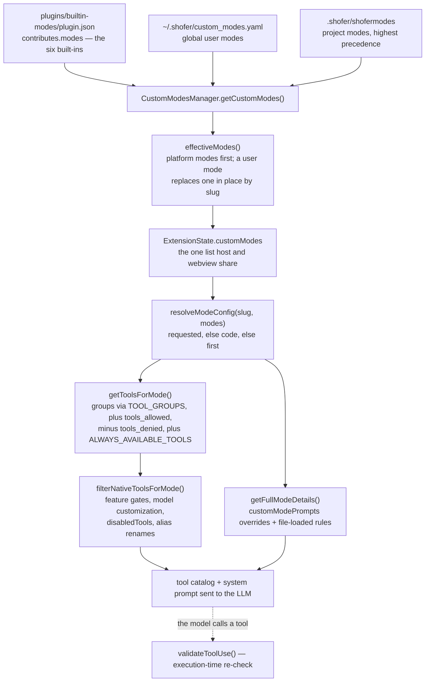

# Built-in Modes

> **✅ Shipped** — as the bundled **`builtin-modes` plugin**
> ([`plugins/builtin-modes/`](../../plugins/builtin-modes/)), enabled by default.
> The six modes are a `contributes.modes` block in the plugin's manifest, not a
> constant in the codebase; an organization suppresses them by suppressing the
> plugin (see [Governance](#8-org-governance-suppressing-the-built-in-modes)).

This document describes the Source-of-Truth (SoT) chain for Shofer's six built-in
modes: where they are defined, how they reach the mode list, how tool access is
resolved from them, and how a user or project mode overrides one.

---

## Table of Contents

1. [Overview](#1-overview)
2. [Primary Definition: the plugin manifest](#2-primary-definition-the-plugin-manifest)
3. [The effective mode list: `effectiveModes()`](#3-the-effective-mode-list-effectivemodes)
4. [Tool Groups: `TOOL_GROUPS`](#4-tool-groups-tool_groups)
5. [Always-Available Tools](#5-always-available-tools)
6. [Tool List Assembly: `getToolsForMode()`](#6-tool-list-assembly-gettoolsformode)
7. [Runtime Resolution: `resolveModeConfig()` and `getFullModeDetails()`](#7-runtime-resolution-resolvemodeconfig-and-getfullmodedetails)
8. [Org Governance: Suppressing the Built-in Modes](#8-org-governance-suppressing-the-built-in-modes)
9. [Mode × Tool Filtering and Execution-Time Validation](#9-mode--tool-filtering-and-execution-time-validation)
10. [Mode Details](#10-mode-details)
11. [File Index](#11-file-index)

---

## 1. Overview

Modes are **data**, resolved at runtime. The platform holds one fixed name —
`defaultModeSlug`, `"code"` — and every definition behind it comes from a file or a
plugin manifest:

Consequences worth stating plainly:

- There is **no built-in mode list in code**. Nothing falls back to a hard-coded
  `code` mode; if no plugin and no file defines any mode, `resolveModeConfig()`
  throws rather than inventing one.
- The host and the webview read the **same** list — `ExtensionState.customModes` —
  so a mode is visible in the picker exactly when it is resolvable for a task.
- Plugin discovery therefore runs **before** anything enumerates modes;
  [`src/extension.ts`](../../src/extension.ts) awaits `provider.getPluginManager()`
  during activation for that reason.

## 2. Primary Definition: the plugin manifest

**File:** [`plugins/builtin-modes/plugin.json`](../../plugins/builtin-modes/plugin.json)

Each entry validates against `pluginModeContributionSchema`
([`packages/types/src/plugin.ts`](../../packages/types/src/plugin.ts)) — a
`ModeConfig` minus `source`/`pluginName`, which the `PluginManager` assigns:

| Field                | Type           | Purpose                                                    |
| -------------------- | -------------- | ---------------------------------------------------------- |
| `slug`               | `string`       | Machine-readable identifier (regex: `/^[a-zA-Z0-9-]+$/`)   |
| `name`               | `string`       | Human-readable display name (shown in Mode Selector)       |
| `roleDefinition`     | `string`       | The system-prompt role for the LLM agent                   |
| `whenToUse`          | `string`       | Guidance text shown in the mode selector tooltip           |
| `description`        | `string`       | Short description for mode picker UI                       |
| `tools`              | `GroupEntry[]` | Symbolic tool-group names with optional file-regex scoping |
| `customInstructions` | `string`       | Default custom instructions for the mode                   |

The six modes, in manifest order:

| #   | `slug`        | Name           | Role                                  |
| --- | ------------- | -------------- | ------------------------------------- |
| 1   | `code`        | 💻 Code        | Write, modify, and refactor code      |
| 2   | `architect`   | 🏗️ Architect   | Plan and design before implementation |
| 3   | `debug`       | 🪲 Debug       | Diagnose and fix software issues      |
| 4   | `code-search` | 🔎 Code Search | Search and explore the codebase       |
| 5   | `web-search`  | 🌐 Web Search  | Browse and extract web content        |
| 6   | `reviewer`    | 👀 Reviewer    | Review code and identify issues       |

### The namespacing exemption

Plugin contributions are normally namespaced (`<plugin>:<slug>`), which is what makes
cross-plugin collisions impossible. This plugin sets `unqualifiedModes: true` in its
manifest, so its modes keep their authored slugs: `code`, not `builtin-modes:code`.
The exemption is honoured **only for `bundled` scope** — a global or project plugin
cannot claim it, because an unqualified slug from a third party could silently shadow
a built-in. It exists for exactly this case: a plugin shipping the platform's own
defaults, whose names are a public contract (every user setting, mode link,
`switch_mode` call and doc names them).

## 3. The effective mode list: `effectiveModes()`

**File:** [`packages/core/src/plugins/plugin-modes.ts`](../../packages/core/src/plugins/plugin-modes.ts)

One function decides what "all modes" means, and both readers use it:

- [`CustomModesManager.getCustomModes()`](../../src/core/config/CustomModesManager.ts)
  — merges project (`.shofer/shofermodes`) over global (`custom_modes.yaml` in the
  settings directory), then folds in plugin contributions, caches the result and
  persists it to `globalState.customModes` (which is what `ExtensionState.customModes`
  carries).
- `HostState.readModeOverrides()` in [`src/host/host-bridge.ts`](../../src/host/host-bridge.ts)
  — re-derives the plugin half from the persisted copy, so the system prompt's MODES
  section is correct even on the first read of a session.

Ordering and precedence:

1. **Platform modes** (unqualified slugs from a bundled plugin) lead the list.
2. A user or project mode with the same slug **replaces one in place** — so overriding
   `code` neither duplicates it nor moves it to the end of the mode picker. The
   override is **complete**: every field of the plugin's mode is replaced, with no
   partial merging of `tools` or `customInstructions`.
3. A user mode with a new slug is appended.
4. **Namespaced modes** from every other plugin come last; they cannot collide.

Precedence between the two user layers is resolved earlier, inside
`CustomModesManager`: project wins over global.

| Priority    | Source                                       | Scope                  |
| ----------- | -------------------------------------------- | ---------------------- |
| 1 (highest) | Project `.shofer/shofermodes`                | Current workspace      |
| 2           | Global `custom_modes.yaml`                   | All workspaces         |
| 3           | `builtin-modes` plugin (`contributes.modes`) | Shipped with extension |

A plugin mode is **not** user-editable in Settings → Modes: it is owned by the
plugin, and overriding it means authoring a mode of the same slug.
`findAuthoredMode()` ([`packages/types/src/modes.ts`](../../packages/types/src/modes.ts))
is the predicate for that distinction.

## 4. Tool Groups: `TOOL_GROUPS`

**File:** [`packages/types/src/tool.ts`](../../packages/types/src/tool.ts)

The `tools` field in each mode uses symbolic names. The actual tool membership is
defined in `TOOL_GROUPS` — a `Record<ToolGroup, ToolGroupConfig>`:

| Group           | Category              | Member Tools                                                                                                                                                                                                                                                   |
| --------------- | --------------------- | -------------------------------------------------------------------------------------------------------------------------------------------------------------------------------------------------------------------------------------------------------------- |
| `read`          | Read-only data access | `read_file`, `grep_search`, `list_files`, `rag_search`, `find_files`, `read_project_structure`, `view_image`, `list_code_usages`, `get_errors`, `get_project_setup_info`, `get_changed_files`, `lsp_search`, `fetch_web_page`, `ask_live_memory`, `git_search` |
| `write`         | Content mutations     | `apply_diff`, `write_to_file`, `generate_image`, `insert_edit`, `rename_symbol`, `create_directory`, `create_new_workspace`, `file`, `sed` (+ `customTools`: `edit`, `search_replace`, `edit_file`, `apply_patch`)                                             |
| `execute`       | System commands       | `execute_command`, `read_command_output`, `sleep`                                                                                                                                                                                                              |
| `mcp`           | MCP protocol          | `use_mcp_tool`, `access_mcp_resource`, `call_mcp_tool_async`, `check_mcp_call_status`, `wait_for_mcp_call`                                                                                                                                                     |
| `mode`          | Mode switching        | `switch_mode`                                                                                                                                                                                                                                                  |
| `subtasks`      | Task orchestration    | `new_task`, `check_task_status`, `wait_for_task`, `cancel_tasks`, `answer_subtask_question`                                                                                                                                                                    |
| `questions`     | User interaction      | `ask_followup_question`                                                                                                                                                                                                                                        |
| `browser`       | Browser automation    | _(empty — browser tools are provided by the `browser-tools` MCP server)_                                                                                                                                                                                       |
| `uncategorized` | Fallback              | _(empty — for tools without explicit classification)_                                                                                                                                                                                                          |

**Note:** The `customTools` array (currently only on `write`) lists tools that are
**opt-in only** — they are not included automatically by group membership. They only
become available when explicitly included via the model's `includedTools`
configuration.

**Tool Group Count:** There are exactly 9 groups. Adding a 10th is a coordinated
change affecting the `toolGroups` const, the `TOOL_GROUPS` object,
`toolGroupsSchema`, mode definitions, auto-approval, and documentation.

## 5. Always-Available Tools

**File:** [`packages/types/src/tool.ts`](../../packages/types/src/tool.ts)

These tools are available in every mode — unless explicitly disabled via the
`disabledTools` setting or excluded by `tools_denied`:

| Tool                    | Purpose                                      |
| ----------------------- | -------------------------------------------- |
| `attempt_completion`    | Signal task completion with a rating         |
| `update_todo_list`      | Track and update the task todo list          |
| `run_slash_command`     | Execute built-in and custom slash commands   |
| `skills`                | Load skill instructions into task context    |
| `set_task_title`        | Set a descriptive title for the current task |
| `give_feedback`         | Send feedback to the Shofer developers       |
| `list_background_tasks` | List background tasks (children or peers)    |
| `send_message_to_task`  | Send async/sync messages to peer tasks       |

## 6. Tool List Assembly: `getToolsForMode()`

**File:** [`packages/types/src/modes.ts`](../../packages/types/src/modes.ts)

Assembles the final tool name set from a mode's `tools`, `tools_allowed` and
`tools_denied` fields:

1. Iterate `tools[]` → look up each in `TOOL_GROUPS` → collect tools
2. **Scoped group entries** (`{ "groupName": { allowed: [...], denied: [...] } }`) narrow the tool set:
    - `allowed`: exclusive list — only these tools from that group
    - `denied`: removes the listed tools from the group's normal set
3. **File-regex tuples** (`["write", { fileRegex: "\\.md$" }]`) restrict write
   operations to matching files at _execution time_ (not at tool-collection time —
   the tool is still listed but validated with `doesFileMatchRegex()` in
   `isToolAllowedForMode`)
4. Add explicitly whitelisted tools from `tools_allowed`
5. Remove explicitly denied tools from `tools_denied`
6. Add `ALWAYS_AVAILABLE_TOOLS`
7. Re-apply `tools_denied` to always-available tools (**denial always wins**)

## 7. Runtime Resolution: `resolveModeConfig()` and `getFullModeDetails()`

**Files:** [`packages/types/src/modes.ts`](../../packages/types/src/modes.ts),
[`packages/core/src/modes/getFullModeDetails.ts`](../../packages/core/src/modes/getFullModeDetails.ts)

`resolveModeConfig(slug, modes)` is the single fallback chain: the requested mode,
else `defaultModeSlug` (`"code"`), else the first mode that exists. With an empty
list it **throws** — a misconfiguration (built-ins suppressed, nothing supplied) the
user has to see, rather than a stub mode that would produce a system prompt with no
role definition and no tool restrictions.

`getFullModeDetails()` builds on it to produce the prompt-time configuration. It is
**host-only** because `addCustomInstructions()` transitively imports `fs/promises`,
`path` and `os`. On top of the resolved mode it applies:

1. **Prompt component overrides** — `customModePrompts[modeSlug]` can override
   `roleDefinition`, `whenToUse`, `description` and `customInstructions`. These apply
   to plugin-contributed modes (including the built-ins); a mode the **user** wrote is
   taken exactly as written — see `getModeSelection()`.
2. **File-loaded rules** — `.shofer/rules-<mode>/*.md`, global custom instructions,
   and language-specific instruction files.

## 8. Org Governance: Suppressing the Built-in Modes

An organization can remove the six built-in modes entirely so that ONLY
user/project/bundle-provided modes remain — letting a config bundle fully define the
available mode set. This is controlled by the **`SHOFER_DISABLE_BUILTIN_MODES`**
environment variable (truthy = `1`/`true`/`yes`/`on`), delivered on the executor /
code-server pod (the SaaS `resource-manager` sets it, the same channel as
`SHOFER_GLOBAL_DIR`). It is **not** a persisted user setting: it never appears in
`globalSettingsSchema` or the Settings UI and cannot be toggled from the webview.

Because the built-ins are a plugin, suppression has exactly one expression:

- `governanceDisabledPlugins()` in
  [`packages/core/src/config/governance.ts`](../../packages/core/src/config/governance.ts)
  maps the env flag to the plugin name `builtin-modes` (and
  `SHOFER_DISABLED_PLUGINS`, a comma-separated list, lets an org name any bundled
  plugin).
- `ShoferProvider` passes that list as the `PluginManager`'s `forceDisabledPlugins`.
  A force-disabled plugin contributes nothing and **cannot be re-enabled** from the
  Plugins panel; attempting to warns.
- Nothing else needs to know. The modes simply are not in the list, so the picker,
  the prompt's MODES section, skills' mode enumeration and tool filtering all agree
  with no separate flag to thread through — and the webview, which cannot read
  `process.env`, learns nothing new either.
- **Seeding:** the definitions stay reachable as data in the plugin manifest, so a
  platform tool can serialize them into a bundle regardless of the flag.

## 9. Mode × Tool Filtering and Execution-Time Validation

**Files:** [`filter-tools-for-mode.ts`](../../packages/core/src/prompts/tools/filter-tools-for-mode.ts),
[`validateToolUse.ts`](../../packages/core/src/tools/validateToolUse.ts)

`filterNativeToolsForMode()` produces the tool catalog sent to the LLM: resolve the
mode via `resolveModeConfig()`, take `getToolsForMode()` as the base set, apply
`isToolAllowedForMode()`, apply model-specific customization, then the feature gates
(`rag_search` without an initialized code indexer, `git_search` without a git indexer,
`ask_live_memory` without live memory, `update_todo_list` when `todoListEnabled` is
false, `generate_image` and `run_slash_command` behind their experiments,
`access_mcp_resource` with no MCP resources), then `disabledTools`, then alias renames.

`validateToolUse()` re-checks at execution time — defense in depth for a model that
calls a tool that is not in its catalog. It verifies the tool name is known, that the
user has not disabled it (a distinct message, so the model does not retry), and that
`isToolAllowedForMode()` still allows it, including file-regex scoping.

## 10. Mode Details

| #   | Slug          | Name           | Groups                                                                                         | Default |
| --- | ------------- | -------------- | ---------------------------------------------------------------------------------------------- | ------- |
| 1   | `code`        | 💻 Code        | `read`, `write`, `execute`, `browser`, `mcp`, `mode`, `subtasks`, `questions`, `uncategorized` | Yes     |
| 2   | `architect`   | 🏗️ Architect   | `read`, `["write", { fileRegex: "\\.md$" }]`, `browser`, `mcp`, `subtasks`, `questions`        | —       |
| 3   | `debug`       | 🪲 Debug       | `read`, `write`, `execute`, `browser`, `mcp`, `subtasks`, `questions`, `uncategorized`         | —       |
| 4   | `code-search` | 🔎 Code Search | `read`, `execute`, `browser`, `mcp`, `questions`                                               | —       |
| 5   | `web-search`  | 🌐 Web Search  | `browser`, `questions`, `mcp`                                                                  | —       |
| 6   | `reviewer`    | 👀 Reviewer    | `read`, `execute`, `browser`, `mcp`, `subtasks`, `questions`                                   | —       |

**Key structural notes:**

- **`code`** is first in the manifest and matches `defaultModeSlug`, making it the
  fallback. It is the only mode carrying the `mode` group alongside write/execute.
- **`architect`** restricts the `write` group to `.md` files via a `fileRegex`
  tuple — writing a non-`.md` file throws a `FileRestrictionError`. It has **no
  `mode` group**, so `switch_mode` is not in its catalog (`switch_mode` lives only in
  `TOOL_GROUPS.mode`, which only `code` carries, and is not in
  `ALWAYS_AVAILABLE_TOOLS`). Architect therefore hands off by _asking the user_ to
  switch to an implementation mode (it has the `questions` group) — its
  `customInstructions` must not instruct it to call `switch_mode`, which it cannot.
- **`debug`** has near-full access (same as `code` minus `mode`).
- **`code-search`** has no `write`, no `mode` and no `subtasks`. **`reviewer`** has no
  `write` and no `mode`, but includes `subtasks`.
- **`web-search`** has no `read` — it works through the browser tools only.
- This table is a convenience summary of the manifest; the manifest is authoritative.

## 11. File Index

| File                                                                                                                         | Role                                                                                              |
| ---------------------------------------------------------------------------------------------------------------------------- | ------------------------------------------------------------------------------------------------- |
| [`plugins/builtin-modes/plugin.json`](../../plugins/builtin-modes/plugin.json)                                               | The six mode definitions (`contributes.modes`) — the canonical source                             |
| [`packages/core/src/plugins/plugin-modes.ts`](../../packages/core/src/plugins/plugin-modes.ts)                               | `effectiveModes()` — merges plugin contributions with the user's and project's modes              |
| [`packages/core/src/plugins/plugin-manager.ts`](../../packages/core/src/plugins/plugin-manager.ts)                           | `getContributedModes()` — tagging, namespacing and the `unqualifiedModes` exemption               |
| [`src/core/config/CustomModesManager.ts`](../../src/core/config/CustomModesManager.ts)                                       | Reads the mode files, merges, caches, persists to `globalState.customModes`                       |
| [`packages/types/src/modes.ts`](../../packages/types/src/modes.ts)                                                           | `resolveModeConfig()`, `getAllModes()`, `getModeBySlug()`, `getToolsForMode()`, `defaultModeSlug` |
| [`packages/types/src/mode.ts`](../../packages/types/src/mode.ts)                                                             | `ModeConfig` type + schema                                                                        |
| [`packages/types/src/tool.ts`](../../packages/types/src/tool.ts)                                                             | `TOOL_GROUPS`, `ALWAYS_AVAILABLE_TOOLS`, `TOOL_ALIASES`, `toolNames`, `TOOL_DISPLAY_NAMES`        |
| [`packages/core/src/modes/getFullModeDetails.ts`](../../packages/core/src/modes/getFullModeDetails.ts)                       | Host-only full mode resolution with prompt overrides + file-loaded rules                          |
| [`packages/core/src/prompts/tools/filter-tools-for-mode.ts`](../../packages/core/src/prompts/tools/filter-tools-for-mode.ts) | LLM tool catalog filtering (`filterNativeToolsForMode`)                                           |
| [`packages/core/src/tools/validateToolUse.ts`](../../packages/core/src/tools/validateToolUse.ts)                             | Execution-time tool access validation (`validateToolUse`, `isToolAllowedForMode`)                 |
| [`packages/core/src/config/governance.ts`](../../packages/core/src/config/governance.ts)                                     | `governanceDisabledPlugins()` — the env flags that suppress bundled plugins                       |
