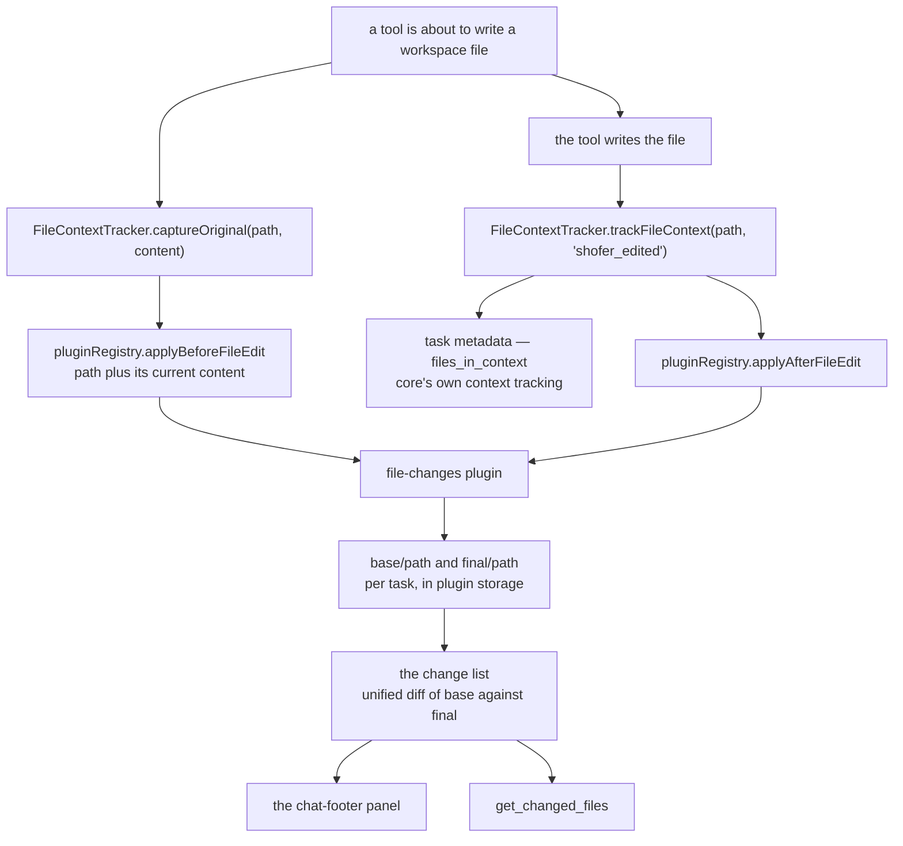

# File Change Tracking

> **✅ Shipped** — as the bundled **`file-changes` plugin**
> ([`plugins/file-changes/`](../../plugins/file-changes/)), enabled by default. Core
> keeps only the two generic file-edit hooks; the baselines, the panel, the diffs, the
> revert/accept operations and the `get_changed_files` tool all live in the plugin.

This document describes how a file the agent edits becomes a row in the panel above the
chat input — the source-of-truth chain, the seams it crosses, and what each side owns.
For the plugin's internals see [`plugins/file-changes/DESIGN.md`](../../plugins/file-changes/DESIGN.md);
for what it deliberately does not do, [`plugins/file-changes/TODO.md`](../../plugins/file-changes/TODO.md).

---

## Table of Contents

1. [Overview](#1-overview)
2. [The capture points](#2-the-capture-points)
3. [What core still owns: `FileContextTracker`](#3-what-core-still-owns-filecontexttracker)
4. [What the plugin owns](#4-what-the-plugin-owns)
5. [The panel and its requests](#5-the-panel-and-its-requests)
6. [Remote tasks (Shofer Nodes L3)](#6-remote-tasks-shofer-nodes-l3)
7. [Task completion stats](#7-task-completion-stats)
8. [File Index](#8-file-index)

---

## 1. Overview



The split is: **core says what happened**, the plugin decides what is worth keeping. Core
publishes two facts — "this path is about to change, here is its content" and "this path
changed" — and holds no copies, no diffs and no panel state.

## 2. The capture points

A tool that mutates workspace files makes two calls, exactly as before the extraction:

```ts
await task.fileContextTracker?.captureOriginal(relPath, contentBeforeTheWrite)
// … mutate the file …
await task.fileContextTracker.trackFileContext(relPath, "shofer_edited")
```

`captureOriginal` no longer stores anything: it publishes the pre-edit content to
`lifecycle.beforeFileEdit`. Both calls are still required — a tool that only tracks
appears in the list with diffing disabled, and one that only captures does not appear at
all.

Why publish rather than let a plugin derive the paths from `beforeToolCall`'s arguments:
only the tool knows what it is about to touch. A path can be embedded in a patch body,
resolved by the language server (a symbol rename hitting many files), or be a move's
destination. Rebuilding that per-tool knowledge inside a plugin would break silently — as
a file quietly missing from the list — the day a tool changes.

### Which tools call them

| Tool                                                                                | How                                                                                                       |
| ----------------------------------------------------------------------------------- | --------------------------------------------------------------------------------------------------------- |
| `apply_diff`, `write_to_file`, `edit`, `edit_file`, `apply_patch`, `search_replace` | via [`DiffViewProvider`](../../src/integrations/editor/DiffViewProvider.ts) (`open()` / `saveDirectly()`) |
| [`file`](../../packages/core/src/tools/FileTool.ts) (`rm`/`mv`)                     | manual, for the source and (for `mv`) the destination                                                     |
| [`insert_edit`](../../packages/core/src/tools/InsertEditTool.ts)                    | manual, around the `WorkspaceEdit`                                                                        |
| [`sed`](../../packages/core/src/tools/SedTool.ts)                                   | manual, around the regex replacement                                                                      |
| [`rename_symbol`](../../packages/core/src/tools/RenameSymbolTool.ts)                | manual, for each LSP-affected file                                                                        |
| [`generate_image`](../../packages/core/src/tools/GenerateImageTool.ts)              | tracks only — the store is UTF-8 oriented, so a PNG has no usable baseline                                |

`create_directory` and `create_new_workspace` create no file content; `execute_command`
runs arbitrary commands and is untrackable.

## 3. What core still owns: `FileContextTracker`

[`FileContextTracker`](../../packages/core/src/context-tracking/FileContextTracker.ts) is
context tracking for the **agent**, and that is all it is now:

- the per-task `files_in_context` metadata (what the agent read, edited, or was told
  about, and when),
- the watchers that notice a file changing outside Shofer, feeding the
  "Recently Modified Files" section of the environment details,
- `getFilesReadByRoo()` / `getFilesEditedByRoo()` for prompt-time context,
- and the two dispatch points above.

It resolves every path against the **task's** cwd — the worktree subdirectory for an
embedded-worktree task, not the workspace folder — and passes that cwd in the hook
context, because a plugin resolving against the wrong tree is exactly how the old change
list silently under-reported.

## 4. What the plugin owns

Two verbatim copies per file, per task: `base/<relPath>` (before the task's first edit)
and `final/<relPath>` (as the agent last left it), plus small metadata files. Every number
in the list is a diff of that pair — never of the live file — which is what keeps two
tasks editing one file in one worktree from reporting each other's work.

The rules the list follows (net-zero drops, user-revert detection, `added`/`deleted`
derivation, accept reading disk rather than the produced copy) are described in the
plugin's [DESIGN.md](../../plugins/file-changes/DESIGN.md).

## 5. The panel and its requests

The panel is a `chat-footer` UI contribution, mounted by `ChatView` through `PluginSlot`
where the built-in panel used to render. It talks to the plugin over the scoped plugin-UI
channel: `get`, `diff` + `local:show-diff`, `revert`, `revert-all`, `accept`,
`accept-all`. There is no `changedFiles/*` webview message type any more, and no
`ChangedFileEntry` in `@shofer/types` — the shape is the plugin's own.

Two guards that used to live in the host handlers moved with the feature:

- **Revert asks first** when the file changed after the agent's last write, via
  `ctx.host.notifier.showChoice` (a modal).
- **Revert is refused while the task is streaming**, via `ctx.taskStreaming` — a flag the
  host sets on request contexts, since a plugin cannot see the agent loop.

## 6. Remote tasks (Shofer Nodes L3)

A task running on a remote executor keeps its copies on that executor. The panel needs no
branch for it: `PluginUIApi.request` is routed to the plugin instance on the task's own
host (`resolvePluginRequestTarget` → `AgentApi.pluginRequest`), and `local:show-diff` is
pinned to the host with the editor. The six changed-files methods that used to exist on
`AgentApi` — and their HTTP routes, session frames and `NodeRegistry` wrappers — are gone;
`pluginRequest` carries all of it.

## 7. Task completion stats

The `+`/`−` badge on a task's history entry comes from
[`AttemptCompletionTool`](../../packages/core/src/tools/AttemptCompletionTool.ts), which
broadcasts a `"task-stats"` request to **every** plugin (`pluginRegistry.requestAll`) and
sums the `{ insertions, deletions }` it gets back. Core does not know which plugin
answers, or whether any does: no answer simply means no badge, which is the correct
rendering of "nothing is tracking this".

## 8. File Index

| File                                                                                                                         | Role                                                         |
| ---------------------------------------------------------------------------------------------------------------------------- | ------------------------------------------------------------ |
| [`plugins/file-changes/src/snapshot-store.ts`](../../plugins/file-changes/src/snapshot-store.ts)                             | The per-task copies + metadata                               |
| [`plugins/file-changes/src/changed-files.ts`](../../plugins/file-changes/src/changed-files.ts)                               | The list, the diff counts, revert/accept                     |
| [`plugins/file-changes/src/main.ts`](../../plugins/file-changes/src/main.ts)                                                 | Hooks, requests, the `get_changed_files` tool, the UI push   |
| [`plugins/file-changes/ui/panel.tsx`](../../plugins/file-changes/ui/panel.tsx)                                               | The `chat-footer` panel                                      |
| [`packages/core/src/context-tracking/FileContextTracker.ts`](../../packages/core/src/context-tracking/FileContextTracker.ts) | Task metadata, watchers, and the two hook dispatch points    |
| [`packages/core/src/plugins/plugin-registry.ts`](../../packages/core/src/plugins/plugin-registry.ts)                         | `applyBeforeFileEdit` / `applyAfterFileEdit` / `requestAll`  |
| [`src/integrations/editor/DiffViewProvider.ts`](../../src/integrations/editor/DiffViewProvider.ts)                           | Captures the pre-edit content for every diff-view-based tool |
| [`src/core/webview/pluginUiRequestRouting.ts`](../../src/core/webview/pluginUiRequestRouting.ts)                             | Local vs owning-executor routing for a plugin request        |
| [`webview-ui/src/components/plugins/PluginSlot.tsx`](../../webview-ui/src/components/plugins/PluginSlot.tsx)                 | Mounts the `chat-footer` region and builds the UI context    |
