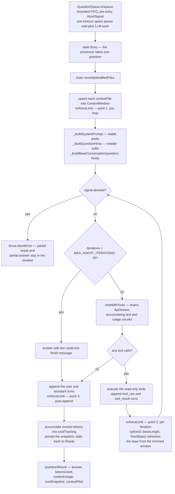
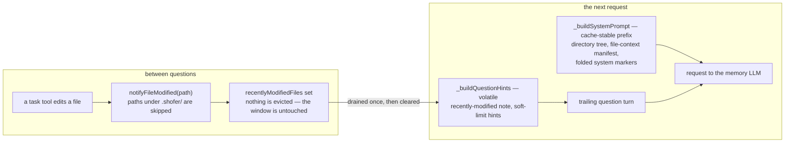

# Live Memory — Design & Implementation

> **✅ Shipped** — as a **bundled first-party plugin**
> ([`plugins/live-memory/`](../../plugins/live-memory/)), not a core subsystem. It ships
> **enabled** (manifest `defaultEnabled`) but **inert**: every hook returns early until
> the user grants the separate **billed-AI consent** in Settings → Plugins, so an
> unconsented install contributes no tool, no prompt section, no watcher, no background
> service and no stored observations. Granting consent reloads the plugin and it comes
> alive.
>
> This document is the feature's design. Sections that describe _host wiring_ —
> a `the plugin's main module` singleton, a `the `sidebar-panel` UI bundle` webview, an
> `the `ask_live_memory` tool definition` native tool, `liveMemory*` global settings — describe the
> **pre-plugin built-in** and are superseded by the plugin seams
> (`registerTools`, `transformSystemPrompt`, `ctx.ai`, `ctx.storage`,
> `ctx.host.watch`, `ctx.registerService`, manifest `config`).
> [`plugins/live-memory/DOGFOOD.md`](../../plugins/live-memory/DOGFOOD.md) maps every
> built-in piece to the seam that replaced it.

## Purpose

The Live Memory is a **persistent, long-context LLM companion** that lives alongside the RAG indexer. Unlike per-task agents that are ephemeral and destroyed when a task terminates, the Live Memory survives across tasks and even VSCode restarts. It runs on a **cheap model with a very large context window**, allowing it to accumulate codebase knowledge over time and answer simple questions that other agents (running in their own tasks) can leverage without re-loading the entire codebase. It is exposed to agents as the `ask_live_memory` native tool.

The key design principles:

- **Persistent context** — the agent's conversation history survives task termination and VSCode restarts.
- **Cheap + large context** — user selects a low-cost model optimized for large windows (e.g., Gemini Flash, GPT-4o-mini, Claude Haiku).
- **File-aware** — notified of file changes (like the RAG indexer) so it can re-read changed files to keep its context fresh. File access respects `.shofer/shoferignore` — excluded files are never loaded into context.
- **Serialized access** — questions are queued; only one question is processed at a time.
- **KV-cache preserving** — the context window is append-only during normal operation. Files are never evicted when modified by tasks; instead a "recently modified" notification is attached to the next question. This keeps the LLM provider's attention cache warm, minimizing token costs and latency.
- **Cold start** — context window starts empty on first launch; fills organically as tasks ask questions.
- **Truncation, not summarization** — when the context window fills up, oldest messages are simply dropped. No lossy compression or summarization is ever applied, keeping the remaining context pristine.
- **Strictly read-only** — the live memory has **no access** to code-writing tools, CLI commands, or MCP tools. It can only use the "Read" category of native tools (file reading, search, LSP symbol lookup). This is a hard constraint enforced by tool filtering.
- **Fixed system prompt** — the live memory's system prompt is internally defined and not user-configurable. It instructs the agent to be a concise, read-only codebase Q&A assistant. The prompt includes a snapshot of the workspace directory/file hierarchy (like `find .` output), capped at ~10% of the context window, with `.shofer/shoferignore`-excluded files omitted.

---

## Architecture

`main.ts` is a thin orchestrator: it declares the `ShoferPlugin` (hooks, the
`ask_live_memory` tool, the prompt transform) and owns the state the hooks share. All
heavy lifting lives in focused single-responsibility collaborators it composes:

```
main.ts — the ShoferPlugin (one memory per workspace)
 │
 ├── LiveMemoryAgent             — the question-answering loop (bounded iterations)
 ├── MemoryStore                 — persistence over ctx.storage (observations, Q&A,
 │                                 conversation window, cost ledger)
 ├── QuestionQueue               — bounded FIFO with per-entry AbortSignal
 │                                 (serializes question processing; bulk cancel)
 ├── ContextWindow               — token budget + LRU eviction
 │                                 (file contexts evicted before message pairs)
 ├── MemoryLlmClient             — calls ctx.ai.buildHandler() (never sees keys)
 │                                 (streaming, abort-aware, full provider catalog)
 ├── LiveMemoryToolExecutor      — read-only tools over ctx.host.search + ctx.host.fs
 ├── LiveMemoryDirectoryTree     — workspace scanner, ~10% context-window cap
 └── pricing                     — per-model USD cost from the handler's model info

External edits arrive through `ctx.host.watch` (scoped to the plugin's granted
filesystem roots); periodic compaction runs as a supervised `ctx.registerService`
service. Settings come from the manifest `config` schema via `ctx.config` (rendered
in Settings → Plugins), and the slash commands from `contributes.commands` — the
plugin touches neither `ContextProxy` nor the host's command registry.

State machine:  Standby → Initializing → Ready ⇄ Busy → Stopping → Standby
                                  ↓                ↓
                                Error  ←── any failure ──→ recoverFromError()
```

### Key Source Files

| File                                            | Role                                                                                                                                                                                                                   |
| ----------------------------------------------- | ---------------------------------------------------------------------------------------------------------------------------------------------------------------------------------------------------------------------- |
| `plugins/live-memory/main.ts`                   | Plugin entry: the `ShoferPlugin` object — `initialize`, `registerTools` (`ask_live_memory`), `transformSystemPrompt`, the lifecycle hooks, `ctx.host.watch` for external edits, and the supervised compaction service. |
| `plugins/live-memory/agent.ts`                  | The question-answering loop (tool-calling iterations, bounded by `MAX_AGENT_ITERATIONS`).                                                                                                                              |
| `plugins/live-memory/memory-store.ts`           | Per-workspace persistence over `ctx.storage` (its own traversal-blocked dir): observations, Q&A pairs, the conversation window, the cost ledger.                                                                       |
| `plugins/live-memory/question-queue.ts`         | Bounded FIFO with per-entry `AbortSignal`. Reentrant-safe drain loop; per-entry timeouts; bulk `cancelAll()`.                                                                                                          |
| `plugins/live-memory/context-window.ts`         | In-memory window: messages + file contexts with token estimates. LRU eviction (file contexts first by `lastReferencedAt`, then oldest user/assistant pairs).                                                           |
| `plugins/live-memory/memory-llm.ts`             | Calls the host LLM through `ctx.ai.buildHandler()` — the plugin never sees provider keys — and renders the memory context for the prompt.                                                                              |
| `plugins/live-memory/tool-executor.ts`          | Read-only tool dispatcher over `ctx.host.search` (rag/git search, symbols, diagnostics) + the scoped `ctx.host.fs`.                                                                                                    |
| `plugins/live-memory/pricing.ts`                | Reads per-model USD pricing from the handler's `getModel().info.{inputPrice,outputPrice}`; fallback constants when the handler does not expose pricing.                                                                |
| `plugins/live-memory/directory-tree.ts`         | Recursive workspace scan, `find .`-style tree, capped at ~10% of the context window.                                                                                                                                   |
| `plugins/live-memory/system-section.ts`         | Builds the "LIVE MEMORY" section injected by `transformSystemPrompt`.                                                                                                                                                  |
| `plugins/live-memory/types.ts`                  | The plugin's own domain types + the fixed system prompt (kept in the plugin: zero `@shofer/types` runtime footprint).                                                                                                  |
| `plugins/live-memory/ui/panel.tsx`, `badge.tsx` | The `sidebar-panel` chat view and the `chat-input-toolbar` status badge, built to `ui/*.js` by `build-ui.mjs`.                                                                                                         |
| `plugins/live-memory/plugin.json`               | Manifest: permissions (`tools`, `systemPrompt`, `lifecycle`, `events`, `ai`, `search`, `skills`, `commands`, `filesystem`, `ui`), contributed skills/commands/UI, and the `config` schema behind Settings → Plugins.   |
| `plugins/live-memory/__tests__/`                | Vitest specs for the store, queue, context window, agent, tool executor, pricing, directory tree and system section.                                                                                                   |

### Module Contracts

The collaborators are **concrete classes**, not interfaces (no `interfaces/`
directory). The Manager depends directly on each class; substitution for
testing is achieved by constructor injection at the spec level. The public
shape of each module:

- **`MemoryStore`** — `load(): Promise<ConversationSnapshot>`, `save(snapshot)`, `filePath` getter. In-memory `ConversationSnapshot` shape: `{ messages, fileContexts, costTracking }` (version lives on the persisted `LiveMemoryConversationData`). Discards on version mismatch (no migrations).
- **`QuestionQueue`** — `setProcessor(fn)`, `enqueue(question, contextFiles?, timeoutMs?, softLimits?): Promise<QuestionResult>`, `cancelAll()`, `pendingCount`, `isProcessing`. `softLimits` carries `{ softTimeoutSec?, softResultLength? }` — prompt-embedded recommendations, not enforced. Processor signature: `(question, contextFiles, signal, softLimits) => Promise<QuestionResult>`.
- **`ContextWindow`** — `configure(opts)`, `restore(messages, fileContexts)`, `clear()`, `appendMessage`, `upsertFileContext`, `removeFileContext`, `invalidateFileContext`, `enforceLimit()`, `getUsage()`, `consumeEvictedTokens()`. Plus getters used by the Manager: `messages`, `fileContexts`, `fileContextPaths`, `estimatedTokenCount`, `maxContextTokens`, `contextFillThreshold`, `isNearlyFull`.
- **`MemoryLlmClient`** — constructor builds an `ApiHandler` via `buildApiHandler(toProviderSettings(config), { taskId: LIVE_MEMORY_TASK_ID })`. `chat(messages, signal?): Promise<ChatResult>` drains `ApiStream`, accumulating `text` chunks into the answer and `usage` chunks into prompt/completion tokens; cooperatively aborts between chunks via the `AbortSignal`.
- **`LiveMemoryDirectoryTree`** — constructor `(workspacePath, maxContextTokens, shoferIgnoreController?)`; `generate(): Promise<string>` returning the formatted tree string capped at `DIRECTORY_TREE_MAX_CONTEXT_FRACTION * maxContextTokens`. Filters entries through `validateAccess()` when a controller is provided. Hardcoded `SKIP_PARTS` set (`node_modules`, `.git`, `.shofer`, `__pycache__`, `.cache`, `dist`, `out`, `build`, `target`, `.next`, `.turbo`) acts as a fast-path pre-filter.
- **`LiveMemoryFileWatcher`** — constructor `(workspacePath, onChange, shoferIgnoreController?)`; `start()`, `dispose()`; 500ms per-file debounce. Filters change events through `validateAccess()` when a controller is provided. `SKIP_PARTS` set (imported from `directory-tree.ts`) acts as a fast-path pre-filter.

### Data Types

**`AgentMessage`** — a conversation turn:

```typescript
{
	id: string                    // UUID
	role: "user" | "assistant" | "system"
	content: string
	timestamp: number             // Unix ms
	metadata?: {
		sourceTaskId?: string     // Which task asked this question
		fileReferences?: string[] // Files referenced in this turn
	}
}
```

**`FileContextEntry`** — a file loaded into the agent's context:

```typescript
{
	filePath: string
	contentHash: string // SHA-256 of the content at load time
	tokenEstimate: number
	loadedAt: number // Unix ms
	lastReferencedAt: number // Unix ms — for eviction priority
}
```

**`LiveMemoryConfig`**:

```typescript
{
	enabled: boolean
	apiConfigId: string // ID of the linked API Configuration profile
	apiConfigName: string // Display name of the linked profile
	providerSettings: ProviderSettings // Resolved profile fed into buildApiHandler
	maxContextTokens: number // Overridable; defaults to model's reported contextWindow
	contextWindowSource: "override" | "model-info" | "unresolved"
	contextFillThreshold: number // 0.0–1.0, default 0.80 — "nearly full" warning threshold
}
```

The system prompt is **not configurable** — it is hardcoded in the service and instructs the live memory to act as a concise, read-only codebase Q&A assistant. The prompt includes a **workspace directory tree** snapshot (see [Directory Tree Injection](#7-directory-tree-injection-directorytreets)).

The only user-configurable properties are the **API configuration** (provider, model, credentials) and the **Clear Context** action (which resets the conversation to just the system prompt and regenerates the directory tree).

**`QuestionResult`** — response from the live memory:

```typescript
{
	answer: string
	tokensUsed: {
		prompt: number
		completion: number
		total: number
	}
	contextUsage: {
		currentTokens: number
		maxTokens: number
		fillFraction: number       // 0.0–1.0, current / max
		isNearlyFull: boolean      // true when fillFraction > fillThreshold
	}
	costSnapshot: {
		sessionInputTokens: number
		sessionOutputTokens: number
		sessionEstimatedCostUSD: number
	}
	contextFiles: string[]        // Files currently in context at time of answer
	durationMs: number
}
```

---

## State Machine

```
Standby ──startAgent()──→ Initializing ──ready──→ Ready
   ↑                           │                    │
   │                    stopAgent()           question arrives
   │                           │                    │
   └─────────────────────── Stopping            Busy (processing)
                                │                    │
                           (aborted)           answer returned
                                                    │
         Error ←─── any failure ──→ Ready/Busy ─────┘
           │
           └──recoverFromError()──→ Standby (clean slate)
```

State transitions:

| From           | Event                | To             | Notes                                                       |
| -------------- | -------------------- | -------------- | ----------------------------------------------------------- |
| `Standby`      | `startAgent()`       | `Initializing` | Loads config, creates LLM provider, restores conversation   |
| `Initializing` | success              | `Ready`        | Agent is idle, waiting for questions                        |
| `Initializing` | failure              | `Error`        | Config invalid, API unreachable, etc.                       |
| `Ready`        | question arrives     | `Busy`         | Dequeued from `QuestionQueue`                               |
| `Busy`         | answer returned      | `Ready`        | If queue is empty; otherwise stays `Busy` for next question |
| `Busy`         | error                | `Error`        | LLM call failed                                             |
| `Ready`        | `stopAgent()`        | `Stopping`     | Graceful shutdown                                           |
| `Busy`         | `stopAgent()`        | `Stopping`     | Cancels current question, rejects queued ones               |
| `Stopping`     | complete             | `Standby`      | Clean shutdown, context persisted                           |
| `Error`        | `recoverFromError()` | `Standby`      | Clears all service instances                                |

---

## Data Flow: Question Processing Pipeline

### 1. Activation (`extension.ts`)

During extension activation, for each workspace folder:

```
the plugin's main module.getInstance(context, folder.uri.fsPath)
  → manager.initialize(contextProxy)   // non-blocking, runs in background
```

### 2. Initialization (`main.ts` → `initialize()`)

```
Manager.initialize()
  → loadConfigFromContextProxy()  // reads liveMemory* state keys + secrets
  → check: enabled? configured?
  → MemoryStore.load() → snapshot { version, messages, fileContexts, costTracking }
      version mismatch → discard (no migrations)
  → ContextWindow.configure({ maxContextTokens, contextFillThreshold })
  → ContextWindow.restore(snapshot.messages, validatedFileContexts)
  → instantiate MemoryLlmClient (wraps buildApiHandler)
  → startAgent()
```

### 3. Agent Startup (`main.ts` → `startAgent()`)

```
for each FileContextEntry restored from snapshot:
  re-read file from disk → SHA-256 hash
  if hash matches → keep in window
  if hash differs or ENOENT → drop (ContextWindow.removeFileContext)

LiveMemoryDirectoryTree.generate() → cached tree string
new LiveMemoryFileWatcher(workspacePath, onFileChanged)
state → Ready
```

### 4. Question Handling (`main.ts` → `_processQuestion()` via `QuestionQueue`)

```
External Task calls ask_live_memory tool (synchronous — task blocks until answer or timeout)
  → LiveMemoryTool.invoke({ question, contextFiles?, timeoutMs?, softTimeoutSec?, softResultLength? })
  → Start a single timeout timer covering the ENTIRE duration (queue wait + LLM processing)
  → QuestionQueue.enqueue({ question, sourceTaskId, timeoutMs, softTimeoutSec, softResultLength })
  → Wait for queue position (if agent is Busy) — timeout is running
  → If timeout fires at any point (during queue wait OR during LLM call):
      abort the LLM call via AbortController (if in progress)
      retain any partial response and file reads already appended to context (KV-cache preserving)
      transition to Ready (or process next queued question)
      return timeout error to caller

When dequeued (QuestionQueue invokes the processor with an AbortSignal):
  → state → Busy
  → If contextFiles provided: read each, ContextWindow.upsertFileContext(path, content, sha256)
  → ContextWindow.enforceLimit() → LRU eviction if over budget  ← (1) pre-loop enforcement
  → Drain recentlyModifiedFiles set (from tool invocation hooks)
  → Build system prompt once (stable across iterations):
      _buildSystemPrompt(recentlyModified, softLimits)
        [LIVE_MEMORY_SYSTEM_PROMPT + directory tree (~10% cap)]
        + [file context entries from window]
        + [recently modified notification]
        + [soft constraints hint]
        + [system-role messages from window]
  → Build initial base conversation from window:
      _buildBaseConversation(question)
        [user/assistant messages from window] + [current question]
  → Agent loop (max 25 tool-call iterations):
      for each iteration:
        → MemoryLlmClient.chatWithTools({ systemPrompt, messages: conversation, tools, signal })
            → drains ApiStream: accumulates `text` chunks, captures `usage` chunks
            → if toolCalls.length === 0 → got final answer, break
        → Append assistant turn (text + tool_use blocks) to in-flight conversation
        → Execute tool calls, append tool_result blocks to in-flight conversation
        → ContextWindow.enforceLimit()                  ← (2) loop enforcement
        → rebuild base from trimmed window:
            _buildBaseConversation(question)
            conversation.splice(0, baseLength, ...freshBase)   // refresh base, keep in-flight
  → ContextWindow.appendMessage({ role: "user", content: question })
  → ContextWindow.appendMessage({ role: "assistant", content: finalAnswer })
  → ContextWindow.enforceLimit() → LRU eviction if over budget  ← (3) post-append enforcement
  → accumulate evicted tokens into costTracking
  → MemoryStore.save(snapshot)
  → state → Ready (or stay Busy if queue non-empty)
  → Return QuestionResult { answer, usage, costSnapshot, evictedTokens } to caller
```

The same pipeline as a graph — note the three `enforceLimit()` points and that an
abort/timeout unwinds without discarding what the window already holds:



### 5. File Change Handling (`ctx.host.watch`)

The live memory stays aware of file modifications through **two complementary mechanisms**:

#### 5a. File System Watcher (`vscode.workspace.createFileSystemWatcher`)

Detects changes originating from outside Shofer (e.g., user edits in another editor, git checkout, external scripts). Implemented in `ctx.host.watch` using VSCode's native `FileSystemWatcher` (no `chokidar` dependency).

```
FileSystemWatcher detects change (create/modify/delete)
  → Skip .shofer/worktrees/ and hidden paths
  → Debounce by FILE_CHANGE_DEBOUNCE_MS (500ms) per path
  → Manager.onFileChanged(filePath)
      → ContextWindow.invalidateFileContext(filePath)  // marks stale, retains slot
      → On delete: ContextWindow.removeFileContext(filePath)
      → Modify: do NOT auto-reload — lazy load on next question referencing it
        (avoids burning tokens on files that may not be asked about)
```

#### 5b. Tool Invocation Hooks (recently-modified file notifications)

Detects changes made by Shofer tasks through native tools. **Critically, files are NOT evicted from context** when modified — evicting and re-adding a file would invalidate the LLM provider's KV cache (attention cache), forcing a costly recomputation of the entire context window on the next request.

Instead, the live memory accumulates a list of **recently modified file paths** and attaches it to each question. This preserves the KV cache while keeping the agent informed:

```
Task tool modifies file (write_to_file, apply_diff, insert_edit, sed, file rm/mv, rename_symbol)
  → Tool execution completes successfully
  → the plugin's main module.onFileModifiedByTask(filePath)  // hook invoked
  → Check against .shofer/shoferignore — skip if ignored
  → Check against .shofer/worktrees/ — skip worktree files
  → Add filePath to recentlyModifiedFiles set          // NO eviction — KV cache preserved
```

On the next question:

```
Question dequeued from queue
  → Drain recentlyModifiedFiles set
  → Append the note to the trailing QUESTION turn (NOT the system prompt):
      "<question>\n\n[Note: the following files have been modified since you last
        read them: src/foo.ts, src/bar.ts. Consider re-reading them if relevant
        to this question.]"
  → The model can then use read_file to re-read stale files if needed
  → recentlyModifiedFiles set is cleared after being attached
```

> **Placement matters for the KV cache.** The recently-modified note (and the
> per-question soft constraints) are appended to the **trailing question turn**,
> never to the system-prompt prefix. Providers cache on the longest stable
> prefix; injecting per-question-varying content into the system prefix would
> invalidate the cache on every question — defeating the very eviction-avoidance
> this mechanism exists to protect. `_buildSystemPrompt()` therefore carries only
> cross-question-stable content (directory tree, file-context manifest, folded
> system markers); `_buildQuestionHints()` produces the volatile suffix that
> rides on the question. (Earlier revisions placed these hints in the system
> prompt — a self-inconsistency with the cache-preservation goal, now fixed.)



This approach:

- **Preserves the KV cache** — the existing context window is never mutated, so the LLM provider can reuse cached attention computations, keeping requests fast and cheap.
- **Informs without forcing** — the model knows which files are stale and can decide whether to re-read them based on relevance to the current question.
- **Aligns with worktree best practices** — since tasks normally operate in worktrees (`.shofer/worktrees/<name>/`), main-branch files are rarely modified directly. The primary case where files appear in this list is after a worktree merge back into master. The live memory does not depend on git — it just sees "file X was modified."
- **Clears on use** — the set is drained after each question, so stale notifications don't accumulate across questions.

Integration point: `the plugin's main module` subscribes to tool execution events (filtered by `"shofer_edited"` source) via [`FileContextTracker.trackFileContext`](../../packages/core/src/context-tracking/FileContextTracker.ts:39) or an equivalent centralized event bus emitted by the tool execution pipeline.

```

```

### 6. Directory Tree Injection (`directory-tree.ts`)

On agent startup (and after Clear Context), the live memory scans the workspace and injects a directory/file hierarchy into the system prompt. This gives the agent immediate awareness of the project structure without needing to call `list_files` on every question.

```
startAgent() or clearContext():
  → Scan workspace root with find/list_files equivalent
  → Apply .shofer/shoferignore filter — skip excluded paths
  → Apply .shofer/worktrees/ filter — skip worktree directories
  → Generate tree output (similar to `find . -not -path './.shofer/shoferignore-patterns'`):
      src/
        services/
          user-service.ts
          auth-service.ts
        components/
          Button.tsx
          Modal.tsx
      docs/
        README.md
      package.json
      tsconfig.json
  → Estimate token count of tree output
  → Cap at DIRECTORY_TREE_MAX_CONTEXT_FRACTION * maxContextTokens
      (default: 10% of context window, e.g. 12,800 tokens for a 128K window)
  → If tree exceeds cap:
      truncate deepest nesting levels first
      collapse large directories into "[N files in <dir>/]" summaries
  → Inject tree into system prompt as:
      "[Workspace structure:\n<tree>\n\n.shogerignore patterns are respected.]"
```

The directory tree is:

- **Generated once** at agent startup and regenerated on Clear Context
- **Never truncated** by the normal truncation policy — it is part of the immutable system prompt prefix
- **Capped at ~10%** of the context window to leave room for conversation and file contents
- **Excludes** `.shofer/shoferignore`-listed paths and `.shofer/worktrees/` directories
- **Provides immediate orientation** — the agent knows the project layout without tool calls

Integration point: `plugins/live-memory/directory-tree.ts` — generates and token-counts the tree.

### 7. Context Window Management (`context-window.ts`)

The live memory uses **truncation, not summarization**. The context window is a ring-buffer-like structure where old content is simply dropped when the limit is reached. No summarization is ever performed — the idea is to keep the context window nearly full (configurable up to a fill threshold) with raw conversation and file content.

`enforceLimit()` is called at **three points** during question processing:

```
(1) Pre-loop — in _loadFileIntoContext(), after contextFiles are upserted
(2) Loop — at the end of each agent-loop iteration, after tool results are appended
(3) Post-append — after the final user+assistant Q&A pair is appended to the window
```

At the loop call site (2), the base portion of the in-flight conversation is
**refreshed from the possibly-trimmed window** via `_buildBaseConversation()`
so the next LLM iteration benefits from the eviction immediately. The in-flight
tool_use/tool_result turns are preserved by splicing only the base zone.

```
Token budget = liveMemoryMaxContextTokens (user-configurable)
Fill threshold = liveMemoryContextFillThreshold (default 0.80 = 80%)

Warning zone:
  → When current_tokens > fill_threshold * maxContextTokens:
      the agent includes a "context_nearly_full" flag in responses
      callers can choose to clear context or let truncation occur naturally

When adding file context:
  → estimate tokens of new file content
  → if would exceed maxContextTokens:
      evict least-recently-referenced file contexts first (LRU)
      if still insufficient: truncate oldest conversation turns
  → add FileContextEntry

When conversation history grows:
  → if total tokens (history + file contexts) > maxContextTokens:
      truncate oldest user+assistant pairs from the messages array
      (preserve system prompt and last N turns up to the limit)
  → insert a system note: "[N earlier messages were truncated due to context limit]"

Truncation policy (NO summarization):
  → Oldest user+assistant pairs are removed entirely — no compression
  → File contexts with lowest `lastReferencedAt` are evicted first
  → The system prompt (including the directory tree) is NEVER truncated
  → The directory tree is part of the immutable system prompt prefix
  → Truncated content is permanently lost from the agent's memory
  → A marker message is inserted so the model knows truncation occurred

Loop-time enforcement:
  → After each iteration: enforceLimit() trims the persisted window
  → _buildBaseConversation() rebuilds the base from the trimmed window
  → conversation.splice(0, baseLength, ...freshBase) replaces the base zone
  → In-flight tool_use/tool_result turns are preserved across the splice
  → The system prompt (built once per question) remains stable
```

---

## Storage Topology

| Data                      | Storage Location                                                                                               | Survives Reboot?                             |
| ------------------------- | -------------------------------------------------------------------------------------------------------------- | -------------------------------------------- |
| **Conversation history**  | VS Code globalStorage: `~/.config/Code/User/globalStorage/shofer.dev/shofer-live-memory-<workspace-hash>.json` | ✓ Yes — persisted alongside VS Code settings |
| **File context registry** | Same JSON file as conversation history (nested under `fileContexts` key)                                       | ✓ Yes — persisted in globalStorage           |
| **API keys & secrets**    | VS Code `SecretStorage` (managed via the linked API Configuration profile, not per-agent keys)                 | ✓ Yes — OS-level credential store            |
| **Configuration**         | VS Code `globalState` (via `ContextProxy`)                                                                     | ✓ Yes — synced with VS Code settings         |

### Persistence Format

The conversation store persists a single JSON file:

```json
{
	"version": 2,
	"workspacePath": "/home/user/projects/my-app",
	"createdAt": 1715678900000,
	"updatedAt": 1715680000000,
	"messages": [
		{
			"id": "uuid-1",
			"role": "user",
			"content": "What does the UserService class do?",
			"timestamp": 1715678900000,
			"metadata": { "sourceTaskId": "task-123" }
		},
		{
			"id": "uuid-2",
			"role": "assistant",
			"content": "The UserService class handles...",
			"timestamp": 1715678901000
		}
	],
	"fileContexts": [
		{
			"filePath": "src/services/user-service.ts",
			"contentHash": "abc123def456...",
			"tokenEstimate": 2500,
			"loadedAt": 1715678900500,
			"lastReferencedAt": 1715678900500
		}
	],
	"costTracking": {
		"totalInputTokens": 125000,
		"totalOutputTokens": 8500,
		"totalTokensTruncated": 30000,
		"estimatedCostUSD": 0.042,
		"lastUpdated": 1715680000000
	}
}
```

### Reboot Behavior

After a system reboot:

- ✓ Conversation history restored from globalStorage
- ✓ File contexts restored; each file re-read from disk
- ⚠ If a file was modified while offline → hash mismatch → evicted from context
- ⚠ If a file was deleted while offline → removed from context
- ✓ Agent resumes in `Ready` state, waiting for questions

No restart of the agent is needed — it rehydrates automatically on extension activation.

---

## Tool Integration

### `ask_live_memory` — Native Tool

A new native tool exposed to all tasks. The tool is **synchronous (blocking)** — the calling task waits until the live memory finishes processing the question and returns an answer, or until the optional timeout expires. On timeout, processing is **aborted** but any partial work (file reads, partial response) already added to the context window is **retained** to preserve the LLM provider's KV cache.

```
Tool: ask_live_memory
Description: Ask a question to the persistent live memory that maintains
             long-term context about the codebase. This is a synchronous tool —
             the calling task will block until the answer is returned or the
             timeout is reached. Use this for simple questions about the code
             that don't require the full task context to be loaded.

Parameters:
  - question (string, required): The question to ask the live memory.
  - contextFiles (string[], optional): File paths that are relevant
    to this question. The live memory will load these into its
    context window if they aren't already present.
  - timeoutMs (number, optional): HARD maximum time to wait for an
    answer in milliseconds. Defaults to 300000 (5 minutes). If the
    timeout is exceeded, processing is aborted, any partial work
    already added to the context window is retained (to preserve KV
    cache), and the tool returns a timeout error.
  - softTimeoutSec (number, optional): SOFT recommendation in seconds
    for how long the assistant should spend on this question (default:
    DEFAULT_ASSISTANT_SOFT_TIMEOUT_SEC = 60). Embedded in the assistant's
    prompt as guidance; not enforced via cancellation.
  - softResultLength (number, optional): SOFT recommendation in
    characters for the maximum length of the assistant's final answer
    (default: DEFAULT_ASSISTANT_SOFT_RESULT_LENGTH = 2000). Embedded in
    the prompt as guidance; not enforced via truncation.

Returns:
  - answer (string): The live memory's response.
  - tokensUsed (object): Token counts for the request.
  - contextFiles (string[]): Files currently in the assistant's context.
```

Tool implementation: `packages/core/src/tools/LiveMemoryTool.ts`
Tool schema: `packages/core/src/prompts/tools/native-tools/ask_live_memory.ts`

### Tool Availability

- The `ask_live_memory` tool is **conditionally available** only when `the plugin's main module` is enabled + configured + in `Ready` or `Busy` state.
- If the agent is in `Standby`, `Initializing`, `Error`, or `Stopping` state, the tool is filtered out (similar to `rag_search` filtering).
- Filter logic in `packages/core/src/prompts/tools/filter-tools-for-mode.ts`.

### Auto-Approval

The `ask_live_memory` tool is **auto-approved by default** (like `rag_search`), since it is read-only and uses a separate, cost-optimized model. Configured in `packages/core/src/auto-approval/tools.ts`.

### Live Memory's Own Tool Restrictions

The live memory itself runs as an internal task with a **severely restricted tool set**. It is strictly read-only and cannot modify any state:

| Tool Category     | Available? | Tools Included                                                                                                                                                                                |
| ----------------- | ---------- | --------------------------------------------------------------------------------------------------------------------------------------------------------------------------------------------- |
| **Read**          | ✓ Yes      | `read_file`, `list_files`, `grep_search`, `find_files`, `rag_search`, `read_project_structure`, `list_code_usages`, `get_errors`, `get_project_setup_info`, `get_changed_files`, `lsp_search` |
| **Write/Edit**    | ✗ No       | `write_to_file`, `apply_diff`, `insert_edit`, `sed`                                                                                                                                           |
| **CLI/Execution** | ✗ No       | `execute_command`                                                                                                                                                                             |
| **MCP**           | ✗ No       | All MCP-provided tools (browser, k3s, mimir, loki, tempo, etc.)                                                                                                                               |
| **Task Control**  | ✗ No       | `new_task`, `switch_mode`, `attempt_completion`                                                                                                                                               |

These restrictions are enforced at the tool-filtering layer (`filter-tools-for-mode.ts`) based on a dedicated `live_memory` internal mode slug. The live memory's system prompt explicitly instructs it that it cannot make changes — it can only read and answer questions about the codebase. This ensures:

- **Safety** — no accidental code modifications from the assistant
- **Cost control** — the cheap model is never used for expensive operations
- **Predictability** — callers know the live memory's response is purely informational

---

## Integration Points

### Extension Host

| Point      | File                                                       | Details                                                                                                      |
| ---------- | ---------------------------------------------------------- | ------------------------------------------------------------------------------------------------------------ |
| Activation | `src/extension.ts`                                         | Creates `the plugin's main module` per workspace folder, initializes in background                           |
| Chat View  | `src/core/webview/the `sidebar-panel` UI bundle.ts`        | Registers webview panel for the live memory chat view; streams live responses                                |
| Provider   | `src/core/webview/ShoferProvider.ts`                       | Subscribes to `onAgentStateChange` to push live memory status to webview                                     |
| Toolbar    | `webview-ui/src/components/chat/LiveMemoryStatusBadge.tsx` | Badge + popover in the Shofer chat-input toolbar; hosts start/stop/clear/chat actions via `liveMemoryAction` |
| Commands   | `src/activate/registerCommands.ts`                         | Registers `liveMemory.start`, `liveMemory.stop`, `liveMemory.clearContext`, `liveMemory.showChat`            |

### Settings & Webview

| Point            | File                                        | Details                                                                   |
| ---------------- | ------------------------------------------- | ------------------------------------------------------------------------- |
| Settings save    | `src/core/webview/webviewMessageHandler.ts` | `saveLiveMemorySettingsAtomic` → saves secrets + `handleSettingsChange()` |
| Status request   | `webviewMessageHandler.ts`                  | `requestLiveMemoryStatus`                                                 |
| Start/stop/clear | `webviewMessageHandler.ts`                  | `startLiveMemory`, `stopLiveMemory`, `clearLiveMemoryContext`             |
| Secret status    | `webviewMessageHandler.ts`                  | `requestLiveMemorySecretStatus`                                           |

### Tool System

| Point             | File                                                             | Details                                                                                             |
| ----------------- | ---------------------------------------------------------------- | --------------------------------------------------------------------------------------------------- |
| Tool registration | `packages/core/src/task/build-tools.ts`                          | Gets `the plugin's main module` for current workspace, passes to tool filter                        |
| Tool filtering    | `packages/core/src/prompts/tools/filter-tools-for-mode.ts`       | Removes `ask_live_memory` if agent is disabled/unconfigured/not-ready                               |
| Tool dispatch     | `packages/core/src/assistant-message/presentAssistantMessage.ts` | Routes to `LiveMemoryTool`                                                                          |
| Auto-approval     | `packages/core/src/auto-approval/tools.ts`                       | `askLiveMemory` is auto-approved by default                                                         |
| System prompt     | `packages/core/src/prompts/sections/live-memory.ts`              | `getLiveMemorySection()` — injects availability, model info, context fill % into task system prompt |

### Configuration Schema

State keys live on the extension-wide `globalSettingsSchema` in `packages/types/src/global-settings.ts`; secret keys are listed in `GLOBAL_SECRET_KEYS` in the same file. Both are accessed through the typed `ContextProxy` (`getValue` / `getSecret` / `setValue`) — the live memory never calls `vscode.workspace.getConfiguration` or `context.secrets` directly.

```typescript
// globalSettingsSchema (state, persisted in globalState)
liveMemoryEnabled: boolean // master on/off toggle
liveMemoryApiConfigId: string // ID of the linked API Configuration profile
liveMemoryMaxContextTokens: number // optional override; default from linked model's contextWindow
liveMemoryContextFillThreshold: number // 0.0–1.0, default 0.80

// GLOBAL_SECRET_KEYS (secrets, persisted in SecretStorage)
// No live-memory-specific secrets — credentials come from the linked API Configuration profile.
```

The Zod runtime schemas for the on-disk conversation snapshot — `liveMemoryConfigSchema`, `agentMessageSchema`, `fileContextEntrySchema`, `liveMemoryCostTrackingSchema`, `liveMemoryConversationDataSchema`, `questionResultSchema` — live in `packages/types/src/live-memory.ts`. The fixed `LIVE_MEMORY_SYSTEM_PROMPT` is also defined there.

The system prompt is **not exposed** in settings — it is internally defined. The only user-facing controls are the API configuration dropdown and the **Clear Context** button.

### Cost Tracking

The live memory tracks cumulative token usage and estimated cost across its entire lifecycle:

```typescript
interface LiveMemoryCostTracking {
	totalInputTokens: number
	totalOutputTokens: number
	totalTokensTruncated: number // tokens dropped by truncation
	estimatedCostUSD: number // calculated from provider's published pricing
	lastUpdated: number // Unix ms timestamp
}
```

Cost is calculated in `pricing.ts` from `ApiHandler.getModel().info.{inputPrice,outputPrice}` (per-million-token rates). When the active handler does not expose pricing, fallback constants are used. The aggregate is persisted alongside the conversation and accumulated across sessions; on reboot, cost tracking resumes from the persisted snapshot. The cost is displayed to the user in:

- The status bar tooltip
- The info panel (on left-click)
- The webview settings page

---

## Key Constants

All exported from `packages/types/src/live-memory.ts`:

| Constant                              | Value                                                          | Purpose                                                               |
| ------------------------------------- | -------------------------------------------------------------- | --------------------------------------------------------------------- |
| `DEFAULT_MAX_CONTEXT_TOKENS`          | 128000                                                         | Default context window size (model-dependent, overridable)            |
| `DEFAULT_CONTEXT_FILL_THRESHOLD`      | 0.80                                                           | Default fill threshold (80%) — "nearly full" warning at this fraction |
| `DEFAULT_MAX_RESPONSE_TOKENS`         | 4096                                                           | Default max tokens for each response                                  |
| `MAX_QUESTION_QUEUE_SIZE`             | 50                                                             | Maximum pending questions in the queue                                |
| `QUESTION_TIMEOUT_MS`                 | 300000                                                         | Default timeout for a single question (5 min)                         |
| `FILE_CHANGE_DEBOUNCE_MS`             | 500                                                            | Debounce window for file change notifications                         |
| `MIN_CONVERSATION_TURNS_TO_KEEP`      | 10                                                             | Minimum turns preserved when truncating                               |
| `FILE_CONTEXT_SYSTEM_MESSAGE_PREFIX`  | `"[File context: {path}]\n"`                                   | Prefix for injected file content in messages                          |
| `DIRECTORY_TREE_MAX_CONTEXT_FRACTION` | 0.10                                                           | Max fraction of context window for the directory tree (10%)           |
| `TRUNCATION_MARKER_MESSAGE`           | `"[{N} earlier messages were truncated due to context limit]"` | Inserted when truncation occurs                                       |
| `CONVERSATION_STORE_VERSION`          | 2                                                              | Version for the persistence format                                    |

---

## Multi-Workspace Support

`the plugin's main module` uses the same **singleton-per-workspace** pattern as `CodeIndexManager`, via `Map<string, the plugin's main module>` keyed by `workspacePath`. Each workspace gets its own:

- Independent conversation history
- Independent file context registry
- Independent configuration (different model per workspace)
- Independent question queue

---

## Worktree Interaction

Shofer uses **embedded worktrees** — per-task git worktrees created under `.shofer/worktrees/<name>/` within the main workspace. Each worktree represents a different git branch, allowing tasks to work in isolation.

The live memory interacts with worktrees as follows:

- **Exclusion from context**: The live memory **never loads files from `.shofer/worktrees/`** directories. These represent ephemeral, task-scoped branches whose content is transient and would pollute the persistent context with unrelated branch state. This exclusion is enforced by `.shofer/shoferignore` patterns and additionally by a hardcoded path filter in the file watcher and lazy-load paths.

- **File path disambiguation**: Since worktree files live at `.shofer/worktrees/<name>/src/foo.ts` while main-branch files live at `src/foo.ts`, they are naturally distinct paths. The live memory's context only ever contains main-workspace file paths.

- **Worktree file watcher**: The `LiveMemoryFileWatcher` watches the entire workspace but skips events for paths under `.shofer/worktrees/`. Changes within worktrees do not trigger context eviction.

- **One live memory per workspace**: Since all worktrees share the same VS Code window (embedded model), there is a single live memory serving all tasks regardless of which worktree they operate in. The live memory's knowledge represents the **main branch** state, not individual worktree branches.

- **Worktree creation/deletion**: When a worktree is created or deleted, the live memory ignores those directory changes entirely — they fall under the excluded paths.

---

## UI: Toolbar Badge + Popover

The Live Memory status indicator lives in the **Shofer chat-input toolbar** (via `LiveMemoryStatusBadge` → `LiveMemoryPopover`), not in the VS Code status bar. It displays:

- **Icon badge**: Shows agent state with color-coded indicator
- **Pulsing animation**: The badge pulses when the agent is `Busy` (processing a question)
- **State indicator**:
    - `Initializing...` — agent is starting up
    - `Ready (42%)` — agent is idle; the percentage shows context window fill (`current / max` tokens)
    - `Busy (42%)` — processing a question; shows queue depth if > 0 queued
    - `Nearly Full (87%)` — context is above the fill threshold, truncation imminent
    - `Error` — configuration or connection issue
    - `Standby` — agent is configured but not started
- **Click**: Opens a **popover** showing:
    - **Status**: Current state, model name, provider
    - **Context**: Token usage bar (`current / max`, fill percentage with visual progress bar)
    - **Context window source**: How `maxContextTokens` was resolved (`override` | `model-info` | `unresolved`)
    - **Cost tracking**: Total input tokens, output tokens, truncated tokens, estimated cost (USD)
    - **Files in context**: Count and list of file paths
    - **Conversation**: Number of message turns
    - **Quick actions** (via `liveMemoryAction` webview message):
        - **Start** / **Stop** — control agent lifecycle
        - **View Chat** — opens the dedicated chat panel
        - **Clear Context** — resets conversation (cost tracking preserved)
        - **Open Settings** — opens API configuration settings

### Live Memory Chat View

A dedicated **chat panel** lets the user observe everything the live memory is doing in real time. It is accessible from:

- The toolbar popover: **"View Chat"** action
- A dedicated VS Code webview panel (similar to the Shofer task chat UI)

The chat view displays:

- **Full conversation history** — all question/answer pairs, scrollable, newest at the bottom
- **Live streaming** — when the agent is `Busy`, the current answer streams in token-by-token
- **Message metadata** per turn:
    - Which task asked the question (`sourceTaskId`, shown as a clickable task reference)
    - Timestamp of each message
    - Token counts for each Q&A pair (prompt / completion)
    - Files referenced in each question (clickable to open in editor)
- **Message styling**:
    - User questions: left-aligned, with task origin badge
    - Agent answers: right-aligned, with model name badge
    - System messages (file contexts loaded, truncation markers): centered, muted style
- **Context sidebar** (collapsible):
    - Current files in context with token estimates
    - Token usage bar (fill percentage)
    - Estimated cost breakdown

The chat view is **read-only** — the user cannot send messages directly to the live memory. All messages come from tasks via the `ask_live_memory` tool. This keeps the interaction model simple and prevents the user from accidentally polluting the context window.

Integration point: `src/core/webview/the `sidebar-panel` UI bundle.ts` — manages a `WebviewPanel` with coalesced `postMessage` ticks; subscribes to manager state/conversation changes and forwards `state` messages containing the full message list and context usage to the webview for client-side diff-rendering.

---

## Error Handling & Recovery

- **Queue resilience**: If an LLM call fails, the question is rejected with an error, and the agent transitions to `Error` state. The queue is drained with rejection for all pending questions.
- **Recovery**: `recoverFromError()` clears all service instances and the LLM provider, forcing a clean re-initialization on next `startAgent()`.
- **Conversation preservation**: Conversation history is saved after every successful question/answer pair. If the agent crashes mid-question, the conversation state from before the question is preserved.
- **Token overflow**: If the context window is exceeded, `ContextWindow.enforceLimit()` truncates oldest file contexts (by `lastReferencedAt`) and then oldest user/assistant turn pairs before failing the request. Truncated content is permanently lost — no summarization is retained.
- **Telemetry**: All errors are captured via `TelemetryService.captureEvent(TelemetryEventName.LIVE_MEMORY_ERROR, {...})` with location context.

---

## Comparison with RAG Indexer

| Aspect               | RAG Indexer (`rag_search`)                  | Live Memory (`ask_live_memory`)                           |
| -------------------- | ------------------------------------------- | --------------------------------------------------------- |
| **Purpose**          | Semantic code search via vector embeddings  | Conversational Q&A with persistent context                |
| **Storage**          | Qdrant (vector DB) + local hash cache       | VS Code globalStorage (JSON conversation file)            |
| **Context**          | Stateless — each query is independent       | Stateful — accumulates conversation + file context        |
| **Model**            | Embedding model (e.g., `text-embedding-3`)  | Chat/completion model (e.g., `gemini-2.0-flash`)          |
| **Cost profile**     | Cheap embeddings, fixed per-code-block cost | Cheap per-token chat; cumulative cost tracked per session |
| **Startup**          | Full or incremental scan of all files       | Cold start with empty context                             |
| **File awareness**   | Re-indexes changed files (re-embeds)        | Evicts stale files; lazy re-reads on next reference       |
| **Concurrency**      | Read-only search, no queuing needed         | Questions serialized via FIFO queue                       |
| **Survival**         | Survives reboots (Qdrant PVC + hash cache)  | Survives reboots (globalStorage JSON)                     |
| **Context overflow** | N/A (stateless)                             | Truncation (oldest messages dropped, no summarization)    |
| **Cost visibility**  | Not tracked per-query                       | Cumulative input/output token counts + USD estimate       |
