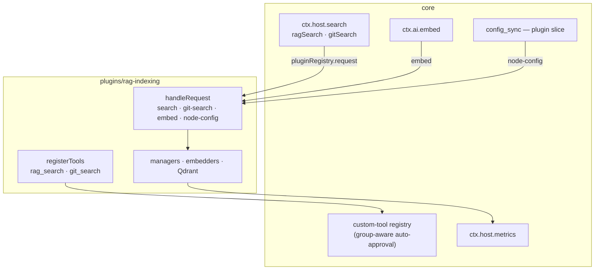

# Semantic search (RAG indexing)

> **Shipped** — as the bundled **`rag-indexing` plugin**
> ([`plugins/rag-indexing/`](../../plugins/rag-indexing/)). Unlike the other bundled
> plugins it is **off by default**: it needs an embedding provider, a credential and a
> running Qdrant, so enabling it is a decision, not a default.

Two indexes ship in one plugin because they are one feature wearing two hats — the
**code index** (`rag_search`: find code by meaning) and the **git-history index**
(`git_search`: find when and why something changed). They share the embedder, the vector
store, the credentials and the settings panel.

For what it does and how to configure it see
[`plugins/rag-indexing/README.md`](../../plugins/rag-indexing/README.md); for the internals,
[`plugins/rag-indexing/DESIGN.md`](../../plugins/rag-indexing/DESIGN.md); for the gaps,
[`plugins/rag-indexing/TODO.md`](../../plugins/rag-indexing/TODO.md).

This document is the **core-side** view: what is left in core, and the seams the plugin
plugs into.

---

## 1. What core keeps

Almost nothing. There is no `CodeIndexManager`, no embedder, no vector store, no
`rag_search`/`git_search` native tool, and no `codebaseIndex*` setting. What remains is
what the rest of the product shares:

| Kept in core                                              | Because                                                                 |
| --------------------------------------------------------- | ----------------------------------------------------------------------- |
| tree-sitter grammars + loader                             | `list_code_definition_names` and `lsp_search` use them; 62 MB ship once |
| `CODEBASE_INDEX_FILE_EXTENSIONS` / `_IGNORED_DIRS`        | the glob service and tree-sitter re-export them (Indexer Policy rule)   |
| `codebaseIndexCacheSchema`                                | the plugin's on-disk format, versioned like every other snapshot        |
| the embedding-model catalog (`shared/embeddingModels.ts`) | the provider settings UI reads it too                                   |

The plugin **bundles** those pure modules at build time (`src/core-shared.ts`); it has no
runtime dependency on `@shofer/core`.

## 2. The seams

| Seam                         | What the indexer does with it                                                                    |
| ---------------------------- | ------------------------------------------------------------------------------------------------ |
| `ShoferPlugin.registerTools` | Contributes `rag_search` / `git_search` — **only when its index can answer**                     |
| `CustomToolDefinition.group` | Declares them `read`, so "auto-approve reads" covers them as it did the native tools             |
| `ShoferPlugin.handleRequest` | `search`/`git-search` (for `ctx.host.search`), `embed` (for `ctx.ai.embed`), the panel's actions |
| `"node-config"`              | Pins a Shofer Node to search-only against the controller's collection (§4)                       |
| `ctx.host.metrics`           | `shofer_code_index_*` counters/gauges — the plugin publishes its own numbers                     |
| `ctx.host.watch`             | The file watcher and the `.gitignore` watcher                                                    |
| `ctx.storage`                | The scan cache and per-workspace enablement                                                      |
| `config` + `secret: true`    | Every setting and all seven provider credentials                                                 |

**`ctx.host.search` still exists.** Core no longer has an index, but the seam does not
mention one: it forwards to this plugin and returns empty when it is absent or off. That
is what keeps Live Memory (which searches through `ctx.host.search`) working whether or
not the indexer is installed.

## 3. Tools are registered, not gated

A native tool that needed a running index used to be filtered out by
`filterNativeToolsForMode` consulting the manager. There is no manager to consult now: the
plugin simply does not contribute the tool until its index is enabled **and** initialised,
so the model never sees a tool that cannot answer. `FEATURE_GATED_TOOLS` lost its
`ragSearch`/`gitSearch` entries with it.

## 4. Shofer Nodes: one writer, many readers

The Sole-Indexer rule is unchanged, but it is now the plugin's to enforce. The controller
replicates the plugin's config and credentials (`syncConfig`,
[`config_sync.md` §4b-2](../config_sync.md)), and asks the plugin what a node should get;
the plugin answers with `searchOnly: true` and the index key **it** resolved. A node
therefore queries the shared collection and never scans — the same guarantee that used to
be hard-coded in `NodeRegistry.currentSyncedSlice()`.

## 5. Related

- [`worktrees.md`](./worktrees.md) — the other plugin that shapes its own node slice
- [`live-memory.md`](./live-memory.md) — the plugin that consumes `ctx.host.search`
- [`plugin_system.md`](../plugin_system.md) — the seams above, in full
