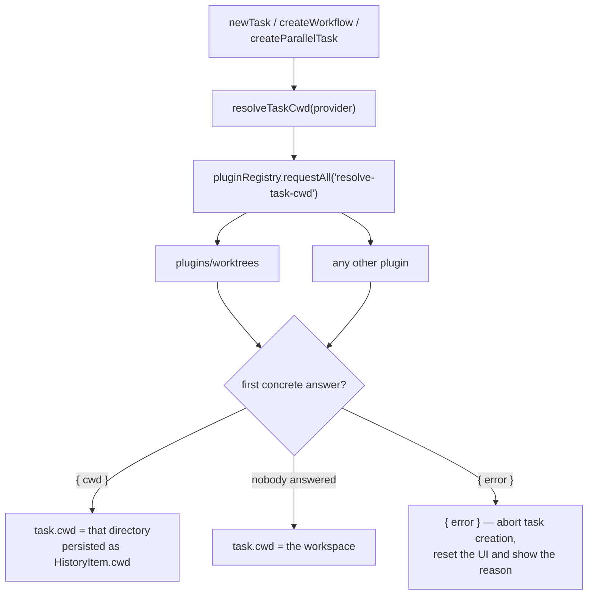

# Git worktrees

> **Shipped** — as the bundled **`worktrees` plugin**
> ([`plugins/worktrees/`](../../plugins/worktrees/)), enabled by default. Core keeps the
> execution model (a task has a working directory) and the safety properties built on it;
> the git operations, the UI, the slash commands and the decision of _where a task runs_
> all live in the plugin.

For how the feature behaves, see [`plugins/worktrees/README.md`](../../plugins/worktrees/README.md);
for why the split falls where it does, [`plugins/worktrees/DESIGN.md`](../../plugins/worktrees/DESIGN.md);
for what it deliberately does not do, [`plugins/worktrees/TODO.md`](../../plugins/worktrees/TODO.md).

This document is the **core-side** view: the seams the plugin plugs into, and the two
things core keeps no matter which plugins are installed.

---

## 1. The embedded model

A worktree lives at `<workspace>/.shofer/worktrees/<name>/`, inside the window the user
already has open, and tasks scoped to different worktrees run concurrently in it. That is
what makes parallel agents, in-window task switching and merge-back possible without a
second VS Code window.

A worktree created by hand outside the workspace (`git worktree add ../foo`) still works
as an ordinary Shofer workspace when opened on its own; it is simply not one of these.

The location is a **core** constant, not a plugin convention: `isEmbeddedWorktreeTask()`
tests for this prefix literally, and §3's confinement and shell sandbox are gated on it.
Moving it is therefore a coordinated core + plugins change — proposed, with the full
consumer list, in [`todos/worktrees-path-move.md`](../../todos/worktrees-path-move.md).

## 2. Where a task runs

[`resolveTaskCwd`](../../src/core/webview/resolveTaskCwd.ts) is the whole of core's
knowledge on the subject. Note the third branch: a plugin that _recognised_ the question
and failed returns `{ error }`, which aborts task creation — because `requestAll` treats
a throw as "not my question", and silently falling back to the workspace would put the
agent on the user's current branch.

`ShoferProvider` exposes the mirror seam, `ctx.task.setCwd(cwd, taskId?)`, for
re-pointing a task that exists but has not begun work. It refuses a `WorkflowTask` whose
`flowState.started` is true: its agents already have files on disk in the old directory.

## 3. What core keeps: confinement

A task whose `cwd` is not the workspace is **confined to it**, and that confinement is
core's, not a plugin's — a safety property a user can remove by disabling a plugin is not
a safety property.

```mermaid
flowchart TD
    T["Task whose cwd is<br/>workspace/.shofer/worktrees/name/"]
    TOOL["mutating native tool — write_to_file · apply_diff ·<br/>create_directory · file rm/mv · insert_edit · sed ·<br/>rename_symbol · create_new_workspace"]
    V{"validateWorktreePath&#40;&#41; resolves the target<br/>against task.cwd — does it stay inside?"}
    BLOCK["blocked — catches .. traversal,<br/>absolute paths pointing outside,<br/>and symlinks that resolve elsewhere"]
    OK["tool proceeds"]
    EC["execute_command"]
    LIN["Linux: shofer-sandbox wrapper —<br/>Landlock write-only sandbox (kernel 5.13+),<br/>else bubblewrap. Writes restricted to the task's<br/>directory, /tmp and /dev/null; reads unrestricted"]
    OTHER["macOS / Windows: no kernel sandbox —<br/>the approval prompt shows a warning instead"]

    T --> TOOL --> V
    V -->|no| BLOCK
    V -->|yes| OK
    T --> EC
    EC --> LIN
    EC --> OTHER
```

| Tool                   | What is validated                                                        |
| ---------------------- | ------------------------------------------------------------------------ |
| `write_to_file`        | `path`                                                                   |
| `apply_diff`           | `path`                                                                   |
| `create_directory`     | `path`                                                                   |
| `file` (rm)            | `path`                                                                   |
| `file` (mv)            | `path` + `destination`                                                   |
| `insert_edit`          | `filePath`                                                               |
| `sed`                  | `path`                                                                   |
| `rename_symbol`        | the source `filePath` **and** every file the LSP `WorkspaceEdit` touches |
| `create_new_workspace` | `projectRoot` (path + name)                                              |
| `execute_command`      | sandboxed on Linux (Landlock/bwrap), advisory warning on macOS/Windows   |

[`validateWorktreePath()`](../../packages/core/src/utils/worktreePathGuard.ts) resolves
the target against `task.cwd`; for a task running in the workspace it is a no-op. The
Linux sandbox wrapper is compiled from [`src/sandbox/main.go`](../../src/sandbox/main.go)
at build time.

## 4. The seams the plugin uses

| Seam                                                    | What worktrees uses it for                                                   |
| ------------------------------------------------------- | ---------------------------------------------------------------------------- |
| `pluginRegistry.requestAll("resolve-task-cwd")`         | Answering where a new task runs — a fresh worktree unless told otherwise     |
| `ctx.task.setCwd`                                       | Re-pointing a workflow that has not started its agents                       |
| `ctx.task.openTask`                                     | Opening an idle task in a worktree just created from the chat input          |
| `ShoferPlugin.handleRequest` + `PluginUIApi.request`    | Everything the two UI bundles do (`local:`-prefixed — see below)             |
| `ctx.ui.postMessage`                                    | Create progress: `worktrees:step`, `worktrees:copy-progress`                 |
| `contributes.ui` (`chat-input-toolbar`, `settings-tab`) | The branch chip and the management panel                                     |
| `contributes.commands` + `unqualifiedContributions`     | The six merge/rebase commands, keeping their bare names at the built-in tier |
| `ctx.host.editor.openFile`                              | Opening a freshly seeded `.shofer/worktreeinclude`                           |
| `ctx.workspaceFolders`                                  | Detecting a multi-root window, where "the repository" is ambiguous           |

Every UI request carries the `local:` prefix, so it is answered by the host that owns the
workspace even while a remote executor's task is focused — worktrees are directories on
this machine (see [`plugin_system.md`](../plugin_system.md) on request routing).

## 5. Headless hosts

`shofer serve` runs the same plugins, so placement must not be a webview feature. It is
not: `ShoferAPI.startNewTask` — the entry point the AgentApi, the CLI and ACP all funnel
through — asks the same `"resolve-task-cwd"` question the chat input does, so a task a
controller starts on a headless executor gets its own checkout there too.

What a headless host lacks is the chrome: no `chat-input-toolbar` chip, no `settings-tab`
panel, and `ctx.ui.postMessage` progress with no webview to reach. A plugin whose
_function_ depended on a webview seam would have to fail loudly rather than no-op
(`AGENTS.md` → "Plugins must work headless"); this one's does not.

## 6. Interaction with checkpoints

The bundled [`checkpoints`](./checkpoints.md) plugin scopes its shadow git to `task.cwd`:
a worktree task snapshots only its own checkout, and a workspace-root task excludes
`.shofer/worktrees/` so a second task's files never land in its snapshots. Neither plugin
references the other — both key off the task's directory, which is core's.

## 7. Related

- [`checkpoints.md`](./checkpoints.md) — per-task undo, scoped the same way
- [`submodule-support.md`](../submodule-support.md) — the `GIT_DIR` isolation nested
  repositories need
- [`plugin_system.md`](../plugin_system.md) — the plugin architecture these seams belong to
