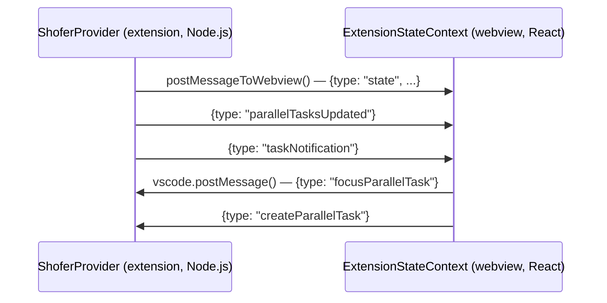

# Shofer Extension Structure

## Overview

Shofer is a VS Code extension that provides an AI coding assistant. It uses a pnpm monorepo structure with TypeScript for the extension and React for the webview UI.

**Project root**: `/home/alsterg/Projects/arkware.ai/extensions/shofer/`

## Host-agnostic core (v3)

The defining structural fact of the codebase is the **host boundary**. The
portable agent engine lives in `@shofer/core` (`packages/core/src`) and never
imports `vscode`. Everything it needs from its environment — filesystem,
notifications, editor, terminals, language services, config, workspace — it
reaches through a single seam:

- **`getHost()` / `setHost()`** ([`packages/types/src/host-registry.ts`](../packages/types/src/host-registry.ts))
  hand the core a `HostBridge`. The registry defaults to an in-memory host
  (`createInMemoryHost`, [`host-memory.ts`](../packages/types/src/host-memory.ts)),
  so the core is runnable with no VS Code present.
- **Category I** — the host-agnostic interfaces (`HostBridge`, `HostFileSystem`,
  `HostEditor`, `HostTerminals`, `Notifier`, …) are declared in
  [`packages/types/src/host.ts`](../packages/types/src/host.ts). These are plain
  DTO-based contracts, which is what lets them also run over RPC for distributed
  execution.
- **Category II** — the VS Code implementation of those interfaces lives in
  `src/`: [`src/host/host-bridge.ts`](../src/host/host-bridge.ts) adapts the
  `vscode` API, the webview and `vscode-lm` / `openai-codex` providers stay in
  `src/`, and the extension calls `setHost()` once at activation.

The same core runs headless from [`apps/cli`](../apps/cli), which registers its
own host instead of the VS Code one. See
[`host-boundary.md`](host-boundary.md) for how to extend the boundary.

> **Note on the host boundary.** The split is by dependency direction. The
> `vscode`-free agent engine — the `Task` orchestrator, `presentAssistantMessage`,
> all 56 concrete tool handlers, and the portable subsystems (providers, prompts,
> persistence, terminal, MCP, code-index engine, transport, tool infrastructure) —
> lives in `packages/core/src` and reaches the editor only via `getHost()`. Only
> the Category II adapters that need the `vscode` API directly — `ShoferProvider`,
> `TaskManager`, the webview, `host-bridge`, and the `vscode-lm` / `openai-codex`
> providers — stay under `src/`.

## Directory Structure

```
extensions/shofer/
├── src/                          # VS Code host: Category II adapters (provider, webview, TaskManager)
│   ├── activate/                 # Extension activation & command registration
│   ├── host/
│   │   └── host-bridge.ts        # getHost() impl: Category I interfaces over the vscode API
│   ├── core/
│   │   └── webview/
│   │       ├── ShoferProvider.ts  # Main provider (implements TaskProviderLike) - manages tasks, state, webview
│   │       └── webviewMessageHandler.ts  # Handles messages from webview
│   ├── api/providers/            # vscode-lm.ts, openai-codex.ts (VS Code-only providers)
│   ├── services/
│   │   └── task-manager/
│   │       └── TaskManager.ts    # Parallel task management (implements TaskManagerLike)
│   └── package.json              # Extension manifest (version here)
├── packages/
│   ├── core/                     # @shofer/core — the host-agnostic agent engine
│   │   └── src/
│   │       ├── task/Task.ts      # Main Task class - runs the LLM conversation loop (+ build-tools.ts)
│   │       ├── tools/            # BaseTool + ~55 concrete tool handlers (ApplyDiffTool.ts, …) + infrastructure (defineNativeTool, registries)
│   │       ├── assistant-message/ # presentAssistantMessage dispatcher + NativeToolCallParser
│   │       ├── api/              # 36 portable providers + transform + buildApiHandler + native-handler-registry
│   │       ├── prompts/          # system.ts + sections + native-tool descriptions
│   │       ├── task-persistence/ # SQLite message store (message-store.ts) + taskMessages/apiMessages/taskMetadata
│   │       ├── terminal/ blob-store/ metrics/ condense/ context-management/ workflow/ …
│   │       ├── services/         # tree-sitter, code-index engine, mcp (McpHub), …
│   │       └── transport/        # HTTP/SSE server + ACP stack (serveHttpOverShoferApi, runAcpAgentOverShoferApi)
│   ├── types/                    # @shofer/types — vscode-free shared types + host seams
│   │   └── src/
│   │       ├── host.ts           # Category I host interfaces (HostFileSystem, HostEditor, …)
│   │       ├── host-registry.ts  # getHost() / setHost()
│   │       ├── host-rpc.ts session-transport.ts executor-pool.ts  # distributed-execution substrate
│   │       ├── history.ts        # HistoryItem, TaskNotification schemas
│   │       └── vscode-extension-host.ts  # ExtensionState interface
│   └── ...                       # Other shared packages (telemetry, ipc, …)
├── webview-ui/                   # React webview (vscode-webview package)
│   └── src/
│       ├── components/chat/
│       │   ├── TaskSelector.tsx  # Task dropdown with state indicators
│       │   ├── TaskHeader.tsx    # Task header with selector
│       │   └── ChatView.tsx      # Main chat interface
│       └── context/
│           └── ExtensionStateContext.tsx  # Global state from extension
└── apps/
    └── cli/                      # CLI version of Shofer
```

## Key Components

### Task.ts (`packages/core/src/task/Task.ts`)

The main task execution class. It drives the agent loop and reaches the editor
only through `getHost()` + registries (never `import "vscode"` directly), so the
same loop runs headless. The class lives in `@shofer/core` alongside the portable
engine it composes (providers, prompts, persistence, terminal, MCP, code-index)
and the concrete tool handlers, while `ShoferProvider` and `TaskManager` stay
under `src/`. It:

- Manages LLM conversation loop
- Emits events for state changes (TaskStarted, TaskInteractive, TaskIdle, etc.)
- Handles tool execution and user approval
- Contains `statusMutationTimeout` for debouncing state change events

**Key events emitted:**

- `TaskStarted` - First API call begins
- `TaskInteractive` - Needs user input (approval/question)
- `TaskActive` - Resumed after user input
- `TaskIdle` - Reached idle state (completion_result, api_req_failed)
- `TaskCompleted` - Task finished with token/tool usage

### ShoferProvider.ts (`src/core/webview/ShoferProvider.ts`)

The main VS Code webview provider that:

- Manages the task stack (multiple tasks, one visible)
- Creates and destroys Task instances
- Posts state to webview via `postStateToWebview()`
- Handles parallel task operations

**Key methods:**

- `createTask()` - Creates new task, optionally preserving current
- `createManagedTask()` - Creates task preserving current in background
- `popFromStackWithoutAborting()` - Removes task from UI without killing it
- `getStateToPostToWebview()` - Builds ExtensionState for webview

### TaskManager.ts (`src/services/task-manager/TaskManager.ts`)

Manages parallel task execution:

- Tracks managed tasks (background tasks with live instances)
- Maintains task lifecycle states (idle, running, waiting_input, waiting, paused, completed, error)
- `registerBackgroundTask()` - Registers a Task instance with TaskManager
- Creates notifications for background tasks needing attention
- Emits events for state changes

**Key data structures:**

- `managedTasks: Map<taskId, ManagedTask>` - All tracked tasks
- `activeTasks: Map<taskId, Task>` - Tasks with live instances
- `notifications: ManagedTaskNotification[]` - Pending notifications
- `focusedTaskId: string | null` - Currently visible task

**Key events emitted:**

- `tasks:updated` - Task list changed
- `managedTask:state-changed` - Task state updated
- `managedTask:needs-input` - Background task needs attention

### TaskSelector.tsx (`webview-ui/src/components/chat/TaskSelector.tsx`)

React component for task switching:

- Shows dropdown of all tasks
- Displays state indicator (colored dot)
- Shows notification badge count (yellow circle)

**State indicators** (rendered via codicons with VSCode CSS variable colors):

- DescriptionForeground (`codicon-circle-large-outline`) - idle
- Charts Green (`codicon-sync` with spin) - running (pulse animation)
- Charts Yellow (`codicon-question`) - waiting_input (pulse animation)
- Charts Blue (`codicon-watch`) - waiting (pulse animation)
- Charts Orange (`codicon-debug-pause`) - paused
- Charts Green (`codicon-pass`) - completed (rating overlays vary)
- Error Red (`codicon-error`) - error

### ExtensionStateContext.tsx (`webview-ui/src/context/ExtensionStateContext.tsx`)

React context providing global state:

- Receives state from extension via `window.postMessage`
- Handles incremental updates (parallelTasksUpdated, taskNotification, etc.)
- Provides state to all webview components

**Key state fields:**

- `parallelTasks: ManagedTask[]` - Runtime state overlay
- `taskNotifications: TaskNotification[]` - Pending notifications
- `taskHistory: HistoryItem[]` - All tasks (source of truth)
- `currentTaskId: string` - Currently displayed task

## Communication Flow



## Event Flow for Parallel Tasks

1. **Task needs input** (TaskInteractive event):

    - Task.ts emits `TaskInteractive` after `statusMutationTimeout`
    - TaskManager catches event, calls `updateTaskExecutionState("waiting_input")`
    - If background task, calls `addNotification()` → emits `managedTask:needs-input`
    - ShoferProvider catches event, posts `taskNotification` to webview
    - ExtensionStateContext updates `taskNotifications`
    - TaskSelector shows yellow badge with count

2. **Task completes** (TaskIdle event):
    - Task.ts emits `TaskIdle` (from attempt_completion tool)
    - TaskManager catches event, calls `updateTaskExecutionState("idle")`
    - Emits `tasks:updated` → ShoferProvider posts `parallelTasksUpdated`
    - TaskSelector shows gray indicator

## Version Management

- Version in `src/package.json`
- Bump Z for backward-compatible patches
- Bump Y for breaking changes
- Bump X only when explicitly asked

## Build & Deploy

```bash
# Build extension
deploy2.sh dev build shofer-code

# Install in code-server
deploy2.sh dev install-extensions
```

---

## Gaps, Issues & Improvement Areas

Issues discovered during factual-accuracy verification of this document.

### Directory tree omissions

The tree shows a simplified subset of the monorepo. Missing from the diagram:

- `packages/types/src/events.ts` — ShoferEventName enum (TaskStarted, TaskCompleted, etc.), referenced in Key Components.
- `packages/core/` — `@shofer/core`, the host-agnostic agent engine (`api/`, prompts, condense, context-management, tree-sitter, the code-index engine, slang/workflow, McpHub, terminal, blob-store, metrics, SQLite persistence, transport/ACP, tool infrastructure, …). Reaches the editor only via `getHost()` + registries.
- `packages/telemetry/` — TelemetryService, PostHogTelemetryClient.
- `packages/ipc/` — IPC client/server for CLI ↔ extension communication.
- `packages/core/src/tools/` — `BaseTool` + the ~55 concrete native tool handlers (`ApplyDiffTool.ts`, `AttemptCompletionTool.ts`, …) plus the tool _infrastructure_ (`defineNativeTool`, the private/native tool registries, tool aliases, the repetition detector).
- `packages/core/src/auto-approval/` — AutoApprovalHandler, per-group approval policies.
- code-index — **split**: the engine (embedders/interfaces/vector-store/parser) is in `packages/core/src/services/code-index/`; the VS Code `CodeIndexManager`/orchestrator/scanner stay in `src/services/code-index/` behind a core-side registry.
- live-memory — leaves in `packages/core/src/services/live-memory/`; the VS Code manager stays in `src` behind a registry.
- MCP — `McpHub` is in `packages/core/src/services/mcp/`; `McpServerManager` (Category II) stays in `src/services/mcp/`.
- skills — engine in `packages/core`; the VS Code manager stays in `src/services/skills/` behind a registry.
- `webview-ui/src/components/chat/` — ~50+ React components, not just the 3 listed.

### Task events section is incomplete

The "Key events emitted" block under Task.ts lists only 5 events. The [`events.ts`](extensions/shofer/packages/types/src/events.ts) `ShoferEventName` enum defines 25+ events. Missing categories:

- **Subtask lifecycle**: `TaskPaused`, `TaskUnpaused`, `TaskSpawned`, `TaskDelegated`, `TaskDelegationCompleted`, `TaskDelegationResumed`
- **Execution**: `TaskModeSwitched`, `TaskAskResponded`, `TaskUserMessage`, `QueuedMessagesUpdated`
- **Analytics**: `TaskTokenUsageUpdated`, `TaskToolFailed`
- **Configuration**: `ModeChanged`, `ProviderProfileChanged`

### TaskCompleted event description is imprecise

The doc says "Task finished with token/tool usage". In the actual schema, `TaskCompleted` carries a tuple of `[string (taskId), TokenUsage, ToolUsage, { rating: CompletionRating, isSubtask: boolean }]`. Token/tool usage is a separate tuple position from the review metadata.

### TaskManager events list is incomplete

The "Key events emitted" block lists 3 events. The actual [`TaskManagerEvents`](extensions/shofer/src/services/task-manager/TaskManager.ts:46) interface defines 7 events. Missing:

- `managedTask:needs-parent-input` — background child routes a question to its parent
- `managedTask:completed` — task reached completed lifecycle
- `managedTask:error` — task reached error lifecycle
- `managedTask:tool-error` — a tool invocation in the task failed irrecoverably

### Communication flow message types are approximated

The diagram shows `{type: "state", ...}`, `{type: "parallelTasksUpdated"}`, `{type: "taskNotification"}` as `ExtensionMessage` discriminants. While conceptually accurate, the exact TypeScript type discriminants in the source differ. This should be verified against `ExtensionMessageSchema` in `@shofer/types` at next review.

### Event flow: "gray indicator" for idle after completion is ambiguous

The doc describes completed/idle tasks as "gray indicator" but the actual `LIFECYCLE_VISUAL` renders terminal states (`completed`, `error`) with color: `completed` uses `var(--vscode-charts-green,#16a34a)` and `error` uses `var(--vscode-errorForeground,#ef4444)`. Only `idle` (no lifecycle yet) uses `var(--vscode-descriptionForeground)`.

### Sections that would improve the doc

1. **Tool architecture overview** — how native tools, MCP tools, and private LM tools are dispatched.
2. **Auto-approval flow** — how `checkAutoApproval` gates tool execution.
3. **Message persistence layout** — where `ui_messages.json`, `api_conversation_history.json`, and `history_item.json` live on disk.
4. **Checkpoint (shadow-git) model** — how `ShadowCheckpointService` provides undo/redo.
5. **Context management** — condense, truncation, FileContextTracker.
