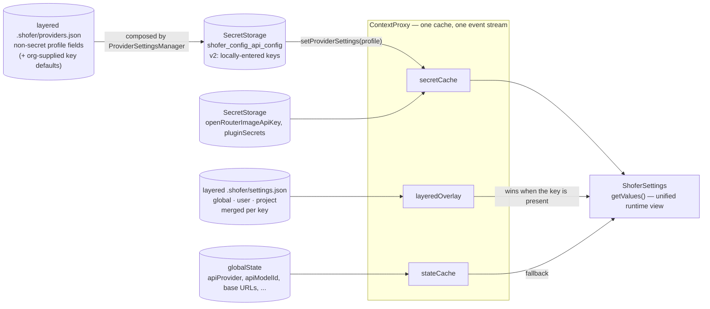
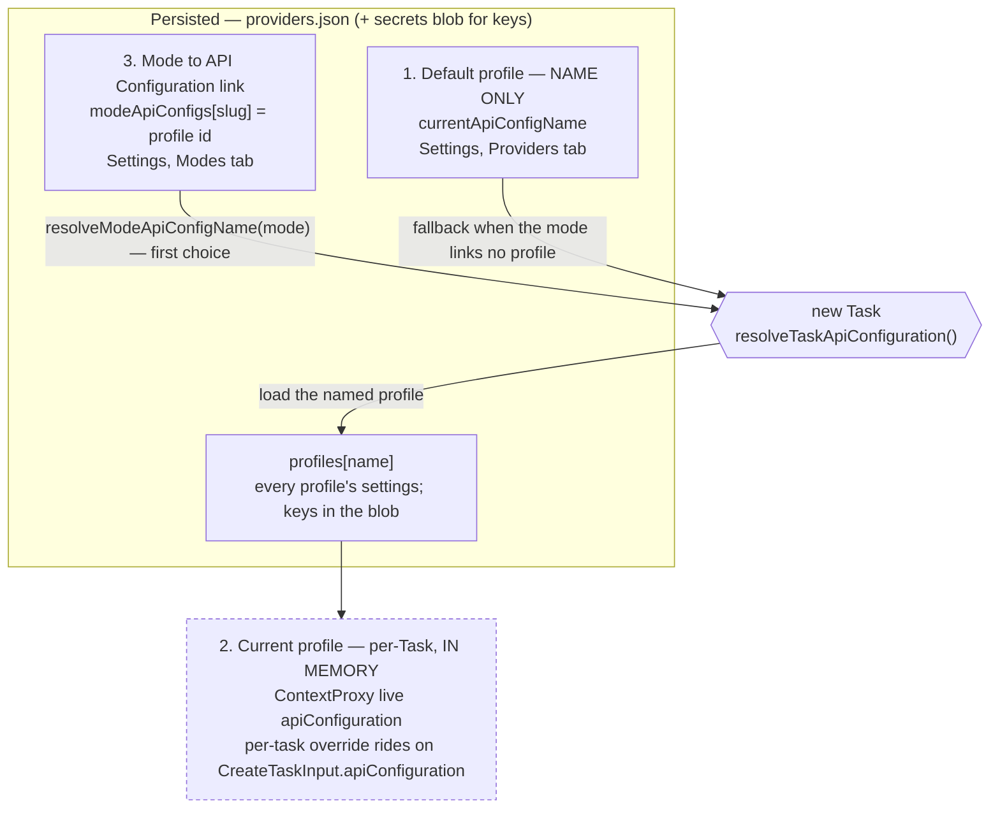
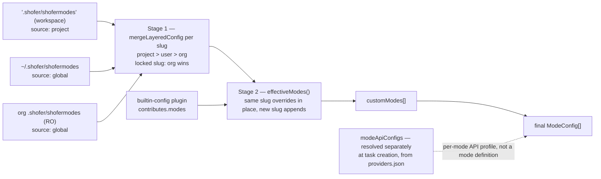
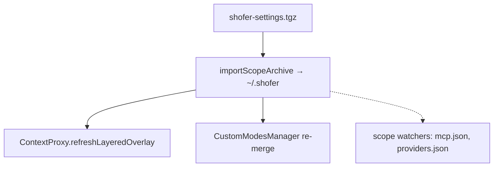
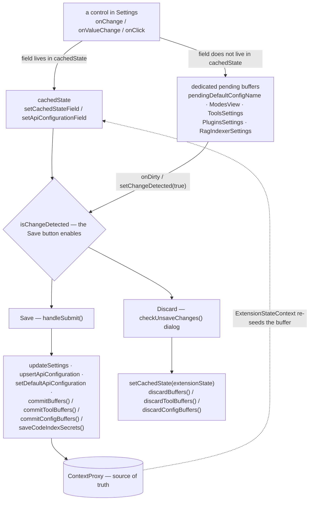

# Shofer Settings Merge & Storage Architecture

## Overview

Shofer stores configuration across several backends — VS Code `globalState`,
`SecretStorage`, and files. Non-secret configuration has a single file-based source
of truth under a layered `.shofer/` tree — **project > user > global** for an
ordinary key, inverted to global-wins-and-is-final for a key the global scope
locks; `globalState` serves as its runtime cache. See
[`configuration.md`](configuration.md#layered-shofer-configuration) for the layered
model. This document explains all storage layers, how they merge at runtime, and
the import/export mechanics.

---

## Config Types at a Glance

| Category                 | Backend                                                                | Scope                        | Count | Merge Priority                                           |
| ------------------------ | ---------------------------------------------------------------------- | ---------------------------- | ----- | -------------------------------------------------------- |
| **VS Code Config**       | `package.json` `contributes.configuration` → `settings.json`           | Per-extension (machine-wide) | 7     | —                                                        |
| **API Provider Configs** | `.shofer/providers.json` (3 scopes) + `SecretStorage` blob (keys only) | Three scopes + machine-wide  | —     | project > user > org; blob key wins over file key        |
| **Mode Definitions**     | `shofermodes` (YAML) in the three `.shofer/` scopes + built-in plugin  | Three scopes                 | —     | project > user > org (locked slug: org final) > built-in |
| **MCP Server Configs**   | `mcp.json` in the three `.shofer/` scopes                              | Three scopes                 | —     | project > user > org (locked name: org final)            |
| **Global Settings**      | `.shofer/settings.json` (layered) → `globalState` cache                | Three scopes + machine-wide  | 108   | Overlay wins in `getValue`; else `globalState`           |

> **Layered `.shofer/` model.** Non-secret settings resolve through a three-scope
> `.shofer/` overlay. For an **unlocked** key the more-specific scope wins —
> **project > user > global**; for a key the global scope **locks** (`locked.json`,
> global scope only) that order **inverts**: the global value wins and is final.
> The overlay takes precedence over `globalState` in `ContextProxy.getValue`, and
> the secrets blob is the sole Shofer-written store for provider secrets. See
> [`configuration.md`](configuration.md#layered-shofer-configuration).

---

## 1. API Provider Configuration Storage

Provider profiles are split across **two stores**, composed at runtime by
[`ProviderSettingsManager`](../src/core/config/ProviderSettingsManager.ts):

- **`.shofer/providers.json`** (layered, three scopes) — every **non-secret**
  field: provider, model id, base URLs, token limits, temperature, plus
  `currentApiConfigName` and `modeApiConfigs`.
- **`SecretStorage` blob** `shofer_config_api_config` (v2) — only each
  profile's **locally-entered secret fields** plus migration flags.

### 1a. `providers.json` — the layered profile files

Managed by [`providersFileLoader`](../src/core/config/providersFileLoader.ts).
Merged **per profile name**: `project > user > org`, unless the org scope's
`locked.json` names the profile (`providers/<name>`) or the collection
(`providers`) — then the org entry is final. The **user** scope's file
(`~/.shofer/providers.json`) is the writable one; every UI edit persists there
with secrets stripped. A profile whose winning entry came from the org/project
scope and is unchanged is _not_ copied into the user file (a copy would freeze
upstream updates), and a locked profile is never persisted downstream.

```jsonc
{
	"version": 1,
	"currentApiConfigName": "default",
	"modeApiConfigs": { "code": "<profile-id>" },
	"profiles": {
		"default": { "id": "…", "apiProvider": "anthropic", "apiModelId": "…" },
	},
}
```

The org scope **may** carry a secret field (an org-supplied `apiKey`): Shofer
never writes a secret to any file, but honors one found there as the profile's
**default credential**.

### 1b. The secrets blob — locally-entered keys only

**Storage key:** `shofer_config_api_config` (v2):

```jsonc
{
	"version": 2,
	"secrets": { "default": { "apiKey": "sk-…" } },
	"migrations": { "rateLimitSecondsMigrated": true /* … */ },
}
```

Composition rule for a secret field: **the blob's value wins; the file's value
is the fallback.** A key the user typed into this workspace beats an
org-supplied default; a profile whose key the user never replaced follows org
rotation. On save, a secret equal to the file's value is dropped from the blob
(it stays file-sourced). The legacy version-less blob shape (full profiles) is
detected on read and split into the two stores on the next write.

Besides the blob, exactly two secrets keep individual `SecretStorage` entries
([`GLOBAL_SECRET_KEYS`](../packages/types/src/global-settings.ts)):

| Key                     | Contents                                                               |
| ----------------------- | ---------------------------------------------------------------------- |
| `openRouterImageApiKey` | Image-generation credential — a GlobalSettings secret, not a profile's |
| `pluginSecrets`         | Every plugin's `secret: true` config values, as one JSON blob          |

`ContextProxy`'s `secretCache` holds only the _currently active_ profile's
secrets in memory, hydrated from the composed profile on activation and on
restart.

### 1c. The Active Profile's Echo — VS Code `globalState`

The **active** profile's non-secret fields are hydrated into VS Code's
`globalState` on activation (`ContextProxy.setProviderSettings`) so runtime
reads are cheap; the persisted source of truth for them is `providers.json`
(§1a). The echoed keys include:

- `apiProvider`, `apiModelId` — selected provider and model
- `anthropicBaseUrl`, `openAiBaseUrl`, `openAiNativeBaseUrl`, `googleGeminiBaseUrl`, etc. — custom base URLs
- `modelMaxTokens`, `modelMaxThinkingTokens` — token limits
- `temperature` — model temperature
- `rateLimitSeconds` — API rate limiting
- `consecutiveMistakeLimit` — error repetition guard
- `todoListEnabled` — per-profile toggle

### 1d. Runtime Merge (ContextProxy)

[`ContextProxy`](../src/core/config/ContextProxy.ts) merges three inputs into a
unified `ShoferSettings` view: `SecretStorage` (API keys), the layered `.shofer/`
overlay, and `globalState`. **The overlay wins**: `getValue` returns the overlay's
value for any key a scope supplies and only falls back to `globalState` otherwise,
so `globalState` is the cache, not the authority, for non-secret settings.



A key served by the overlay cannot be changed locally — a write to it would be
shadowed on the next read — so surfaces ask
`ContextProxy.isManagedByFileLayer(key)` and present such a value read-only with
its source rather than offering an edit that does nothing.

The `ContextProxy` maintains an in-memory cache (`stateCache` + `secretCache`) for
fast access and lazily syncs with the backing stores. Every extension read of a
setting or secret goes through it (the "Typed Settings Rule" in
[`AGENTS.md`](../AGENTS.md)), so it — not any single backing store — is the
runtime source of truth the rest of the extension sees.

> **Important:** VS Code `SecretStorage` delegates to the OS-level credential store
> (libsecret/GNOME Keyring on Linux, Keychain on macOS, Credential Manager on Windows).
> In Docker/container environments, this typically falls back to an **in-memory store**
> that does NOT survive restarts. See the [Code-Server Pre-Configuration](#code-server-pre-configuration)
> section for strategies.

---

## 2. Mode Configuration Storage

Mode configurations (role definitions, groups, tool permissions) are stored across
four layers, merged at runtime with a specific precedence order.

### 2a. `.shofer/shofermodes` — Project-level overrides

| Property       | Value                                            |
| -------------- | ------------------------------------------------ |
| **Path**       | `<workspace_root>/.shofer/shofermodes`           |
| **Format**     | YAML                                             |
| **Scope**      | Per-project (workspace folder)                   |
| **Priority**   | **Highest** (wins all conflicts)                 |
| **Purpose**    | Project-specific mode overrides to share via git |
| **Source tag** | `source: "project"` (auto-assigned)              |
| **Editable**   | Yes—directly edit the file                       |

Example:

```yaml
customModes:
    - slug: "code"
      name: "💻 Code"
      roleDefinition: "You are Shofer, a custom code assistant..."
      customInstructions: |
          Use our team's code style guide...
      whenToUse: "Use this mode for all code changes"
      tools: ["read", "edit", "command", "mcp"]
      tools_allowed: ["update_todo_list"] # optional: per-mode whitelist (additive)
      tools_denied: ["execute_command"] # optional: per-mode blacklist (overrides tools)
```

> **`tools` semantics.** A mode's `tools` field controls **two things at once**:
>
> 1. **Visibility** — which tools the LLM is allowed to see in its tool catalog
>    (`filterNativeToolsForMode` only emits tools whose canonical name passes
>    `isToolAllowedForMode` for the mode's tools, plus `tools_allowed`, minus
>    `tools_denied`).
> 2. **Auto-approval eligibility** — the All (Read/Edit/Command/MCP/Browser/
>    Modes/Subtasks) toggles in the auto-approval UI gate approval at the
>    _group_ level. If a mode does not include a group, the corresponding
>    auto-approval toggle has no effect for that mode.
>
> `tools_allowed` is additive (whitelist on top of tools). `tools_denied`
> takes precedence over both `tools_allowed` and groups. Both are evaluated
> in [`isToolAllowedForMode`](../packages/core/src/tools/validateToolUse.ts).

### 2b. User scope — `~/.shofer/shofermodes`

| Property       | Value                                                    |
| -------------- | -------------------------------------------------------- |
| **Path**       | `~/.shofer/shofermodes`                                  |
| **Format**     | YAML (JSON accepted as a fallback)                       |
| **Scope**      | Per-user (shared across workspaces on the same machine)  |
| **Priority**   | Lower than `.shofer/shofermodes`, higher than org-global |
| **Purpose**    | User's personal modes and customizations via Settings UI |
| **Source tag** | `source: "global"`                                       |
| **In git?**    | **No** — runtime artifact, created fresh on each machine |
| **Editable**   | Via Settings UI or direct file edit                      |

Created with an empty `customModes: []` template on first access
([`CustomModesManager.getCustomModesFilePath()`](../src/core/config/CustomModesManager.ts)).
Every non-project mode write (Settings UI, import at global level) targets
this file.

### 2b-org. Org-global scope — `<org .shofer>/shofermodes`

| Property       | Value                                                                                       |
| -------------- | ------------------------------------------------------------------------------------------- |
| **Path**       | `$SHOFER_GLOBAL_DIR/shofermodes`, else `<globalStorage>/.shofer/shofermodes`                |
| **Format**     | YAML (JSON accepted as a fallback)                                                          |
| **Priority**   | **Lowest** of the file scopes — a default any scope may override, unless the slug is locked |
| **Purpose**    | Org-supplied modes (a SaaS config bundle materializes its `modes` key here)                 |
| **Source tag** | `source: "global"`                                                                          |
| **Editable**   | No — read-only mount in SaaS; never written by Shofer                                       |

A slug named by the org scope's `locked.json` (`modes/<slug>`, or `modes` for the
whole collection) keeps the org version regardless of user/project overrides —
the same locked-vs-default rule as `settings.json`
(see [`configuration.md`](configuration.md#layered-shofer-configuration)). Deleting
a user/project override of an unlocked org mode reverts to the org version on the
next merge; the org entry itself cannot be deleted from the UI.

### 2c. VS Code `globalState` — Runtime persistence

| Property     | Value                                                 |
| ------------ | ----------------------------------------------------- |
| **Type**     | In-memory with disk persistence (SQLite)              |
| **API**      | `context.globalState.get()` / `.update()`             |
| **Scope**    | Per-extension install                                 |
| **Priority** | Equivalent to extension global storage (synchronized) |
| **Purpose**  | Fast runtime access; acts as backup/fallback          |
| **Editable** | Via Settings UI only                                  |

Key globalState keys for modes:

| Key                  | Contents                                                                                                                       |
| -------------------- | ------------------------------------------------------------------------------------------------------------------------------ |
| `customInstructions` | Global custom instructions (all modes)                                                                                         |
| `customModes`        | The effective mode list: the three scopes' `shofermodes` files + plugin-contributed modes (a cache of the merge, not a source) |
| `customModePrompts`  | Per-mode prompt overrides (roleDefinition, customInstructions, whenToUse)                                                      |
| `disabledTools`      | Global flat list of tool names hidden from the LLM (Settings → Tools) — applied across all modes by `filterNativeToolsForMode` |

### 2d. Built-in Modes — a bundled plugin

| Property     | Value                                                                         |
| ------------ | ----------------------------------------------------------------------------- |
| **Path**     | [`plugins/builtin-config/plugin.json`](../plugins/builtin-config/plugin.json) |
| **Type**     | Plugin manifest (`contributes.modes`), shipped in the extension bundle        |
| **Scope**    | Per-extension version; removable (disable the plugin)                         |
| **Priority** | **Lowest** (a user or project mode of the same slug replaces one)             |
| **Purpose**  | Built-in modes: Code, Architect, Debug, Code Search, Web Search, Reviewer     |

The six modes, in manifest order (see [`plugins/builtin-config/docs/modes.md`](../plugins/builtin-config/docs/modes.md)):
`code` (the default mode and ultimate fallback), `architect`, `debug`, `code-search`,
`web-search`, `reviewer`. They reach every consumer through the same `customModes`
list as user and project modes — merged by `effectiveModes()`, so there is no
separate built-in list in code.

---

## 3. MCP Server Configuration Storage

MCP server configurations live in `mcp.json` files in the layered `.shofer/`
scopes, managed by [`McpHub`](../packages/core/src/services/mcp/McpHub.ts):

| Scope          | Path                                                                   | Connection `source` | Writable?                             |
| -------------- | ---------------------------------------------------------------------- | ------------------- | ------------------------------------- |
| **Org-global** | `$SHOFER_GLOBAL_DIR/mcp.json`, else `<globalStorage>/.shofer/mcp.json` | `global`            | No (RO mount in SaaS)                 |
| **User**       | `~/.shofer/mcp.json`                                                   | `global`            | Yes — the file every edit path writes |
| **Project**    | `<workspace>/.shofer/mcp.json`                                         | `project`           | Yes (committed to the repo)           |

The "global" connection source is the org-global and user files **merged per
server name** (`McpHub.loadGlobalScopeServers()`): the user's entry wins unless
the org scope's `locked.json` names the server (`mcp/<name>`) or the collection
(`mcp`) — then the org entry is final. The project file remains a separate
connection source layered above both (plus plugin-contributed servers,
`syncProjectMcpServers()`). All scope files are watched; any change (including
deletion) re-merges and reconciles connections.

`McpHub.getMcpSettingsFilePath()` returns the **user** file (creating an empty
template on first access) — it is what the "Edit Global MCP" UI opens and what
add/delete/toggle/timeout writes target.

> **Planned VS Code compatibility:** Shofer uses its own MCP config files and does not
> yet read VS Code's `.vscode/mcp.json` or user-level MCP config. Servers configured
> for Copilot/VS Code's LM must be manually re-entered in Shofer. See
> [`todos/vscode-mcp-compatibility.md`](../todos/vscode-mcp-compatibility.md) for
> the auto-discovery plan.

### 3b. MCP Tool Visibility

MCP tools have their own visibility pipeline parallel to native tools, in
[`filterMcpToolsForMode`](../packages/core/src/prompts/tools/filter-tools-for-mode.ts):

- Gated by per-tool group assignment (`McpHub.getMcpToolMetadata`)
- Per-server `disabledTools` list in the scope `mcp.json` files
- Allowed groups from the active mode

---

## 4. Mode Merge Order & Precedence

The merge happens in **two stages**:

### Stage 1: Merge `.shofer/shofermodes` + Global Storage → `customModes`

From [`CustomModesManager.getCustomModes()`](../src/core/config/CustomModesManager.ts:364):

```
┌────────────────────────────────────────────────┐
│  Stage 1: CustomModesManager.getCustomModes()  │
│                                                 │
│  Read .shofer/shofermodes          → projectModes (map)   │
│  Read global storage     → globalModes (map)    │
│                                                 │
│  MERGE:                                         │
│   - Project modes added first (priority)        │
│   - Global modes added only if slug NOT already │
│     in project modes (no conflict overwrite)    │
│                                                 │
│  Result: customModes[]                          │
│   - source: "project" (from .shofer/shofermodes)          │
│   - source: "global"  (from global storage)     │
└────────────────────────────────────────────────┘
```

```typescript
// .shofer/shofermodes wins for same slug; global ignored if project mode exists
for (const mode of shofermodesModes) {
	projectModes.set(mode.slug, { ...mode, source: "project" })
}
for (const mode of settingsModes) {
	if (!projectModes.has(mode.slug)) {
		// ← only if not already in .shofer/shofermodes
		globalModes.set(mode.slug, { ...mode, source: "global" })
	}
}
```

### Stage 2: Overlay `customModes` onto Built-in Modes → Final List

From [`getAllModes(customModes)`](../packages/types/src/modes.ts):

```
┌────────────────────────────────────────────────┐
│  Stage 2: getAllModes(customModes)              │
│                                                 │
│  Start with built-in modes (5 defaults)         │
│                                                 │
│  For each customMode in customModes[]:          │
│   - Same slug as built-in? → OVERRIDE it        │
│   - New slug?             → APPEND it           │
│                                                 │
│  Result: final ModeConfig[]                     │
│   - Built-in overridden by custom               │
│   - Custom-only modes appended                  │
│   - Unchanged built-ins remain                  │
└────────────────────────────────────────────────┘
```

```typescript
const allModes = [...modes] // start with built-ins
customModes.forEach((customMode) => {
	const index = allModes.findIndex((m) => m.slug === customMode.slug)
	if (index !== -1) {
		allModes[index] = customMode // override built-in
	} else {
		allModes.push(customMode) // add new mode
	}
})
```

### API Profile Assignment Per Mode

Separately from mode definitions, each mode can be assigned a specific API provider
profile via `modeApiConfigs` in the layered `providers.json` (see §1a). This mapping
rides the providers file, NOT the mode definitions. Resolution happens at task
creation time:

```
active mode slug → modeApiConfigs[slug] → profile ID → profiles[profileName]
```

The composed provider store is the **single source of truth** for this mapping —
there is no `globalState` copy. `ProviderSettingsManager.getModeConfigs()` reads it and
`ShoferProvider.getStateToPostToWebview()` projects it to the webview read-only, so
Settings → Modes and the chat API-config selector always show what
`resolveModeApiConfigName()` will actually resolve for a new task or subtask. Writers
are `setModeConfig()` (via `setModeApiConfig` on Save, `activateProviderProfile`, and
the `handleUserModeSwitch` backfill); because they all write the one store, a profile
activation can no longer drift the UI away from what task creation resolves. The
headless host (`shofer serve`) reads the same files (and its blob through the
vscode-shim's file-backed `SecretStorage`); a client driving it may also ship a
concrete per-task `apiConfiguration` on `CreateTaskInput`, which wins for that
task when the host runs without CLI overrides (`allowClientConfig`).

#### Three concepts that are routinely conflated

The **default profile**, the **current profile**, and the **mode → API
configuration link** are three separate things. Two are persisted in the profiles
blob; the third is per-Task and lives only in memory. The divergence between the
blob's default name and `ContextProxy`'s live `apiConfiguration` is by design —
see the "Settings View Pattern" rule in [`AGENTS.md`](../AGENTS.md).



Changing the default profile is name-only: it must never touch a live
`apiConfiguration` (hence `setDefaultApiConfiguration` writes only the name).

### Combined Flow



### Conflict Resolution (Same Slug)

When the same slug exists in multiple sources:

| Sources with same slug               | Winner                                                                         |
| ------------------------------------ | ------------------------------------------------------------------------------ |
| project vs user vs org `shofermodes` | project > user > org — unless `locked.json` names the slug, then org (Stage 1) |
| `customModes` (merged) vs built-in   | `customModes` (Stage 2)                                                        |

👉 **project > user > org (locked: org final) > built-in**

---

## 5. Write Paths

### Via Settings UI

```
Settings UI
  ├── globalState.update("customInstructions", value)    // global instructions
  ├── globalState.update("customModePrompts", {...})      // per-mode overrides
  ├── globalState.update("customModes", merged)           // merged result
  ├── Write to ~/.shofer/shofermodes                       // the user scope's modes file
  ├── ProviderSettingsManager.saveConfig(...)              // profile → providers.json + key → blob
  └── McpHub writes ~/.shofer/mcp.json                     // MCP server changes
```

### API Profile Changes

```
Settings UI (API Provider tab)
  └── ProviderSettingsManager.saveConfig(name, config)
       ├── ~/.shofer/providers.json                       // non-secret fields
       └── secrets.store("shofer_config_api_config", v2)  // locally-entered keys
            └── ContextProxy.setProviderSettings(config)  // sync cache
```

### Via `.shofer/shofermodes` file edit

```
User edits .shofer/shofermodes
  └── File watcher triggers re-merge
       └── globalState.update("customModes", newMerged)
```

---

## 6. Custom Instructions Flow

### Global Custom Instructions (all modes)

1. Stored in `globalState["customInstructions"]` — backed by the SQLite database at
   `~/.config/Code/User/globalStorage/shofer.dev/state.vscdb` (Linux). See §1c
   for the `globalState` backend details.
2. Added to system prompt for ALL modes
3. Edited in: Settings → Modes → "Custom Instructions for All Modes"

### Mode-Specific Custom Instructions

1. Stored in `globalState["customModePrompts"]["<slug>"]`
2. Only applied when that mode is active
3. Edited in: Settings → Modes → Edit mode → "Mode-specific Custom Instructions"

### How Both Are Combined

From [`system.ts`](../packages/core/src/prompts/system.ts:65):

```typescript
// Get mode config with overrides
const { roleDefinition, baseInstructions } = getModeSelection(mode, promptComponent, customModeConfigs)

// Build final prompt
const basePrompt = `${roleDefinition}

${markdownFormattingSection()}
${getSharedToolUseSection()}
${getToolUseGuidelinesSection()}
${getCapabilitiesSection(...)}
${modesSection}
${getRulesSection(...)}
${getSystemInfoSection(...)}
${getObjectiveSection()}

${await addCustomInstructions(baseInstructions, globalCustomInstructions, cwd, mode, {...})}`
```

From [`custom-instructions.ts`](../packages/core/src/prompts/sections/custom-instructions.ts:449):

```typescript
// Global instructions come first, then mode-specific
if (globalCustomInstructions?.trim()) {
	sections.push(`Global Instructions:\n${globalCustomInstructions.trim()}`)
}
// Then mode-specific instructions...
```

---

## 7. File Watchers

### Mode Configs

The [`CustomModesManager`](../src/core/config/CustomModesManager.ts:269) watches both sources:

```typescript
// Watch global settings file
const settingsWatcher = vscode.workspace.createFileSystemWatcher(settingsPath)
settingsWatcher.onDidChange(handleSettingsChange)
settingsWatcher.onDidCreate(handleSettingsChange)
settingsWatcher.onDidDelete(handleSettingsChange)

// Watch .shofer/shofermodes file
const shofermodesWatcher = vscode.workspace.createFileSystemWatcher(shofermodesPath)
shofermodesWatcher.onDidChange(handleShofermodesChange)
shofermodesWatcher.onDidCreate(handleShofermodesChange)
shofermodesWatcher.onDidDelete(handleShofermodesChange)
```

On any file change, the manager re-reads every scope, re-merges, and updates `globalState`.

### MCP Configs

[`McpHub`](../packages/core/src/services/mcp/McpHub.ts) watches every scope's `mcp.json`:

**Global source (org + user):** `watchMcpSettingsFile()` puts a host watcher on each
scope root (`getHost().watcher.watch(root, "mcp.json")`); change, creation, and
deletion all funnel into the same debounced re-merge (`loadGlobalScopeServers()`),
since deleting the user file may leave org servers behind.

**Project:** `.shofer/mcp.json` via `watchProjectMcpFile()`; deletion cleans up all
project MCP servers.

All use a 500ms debounce. On change, servers are re-read, validated against
`McpSettingsSchema`, and connections are updated.

---

## 8. On-the-Fly Reloading (No Restart Required)

This section documents whether each configuration type can be updated without
restarting code-server or VS Code, and how changes are detected.

### Summary Table

| Config Type                                    | On-the-Fly?     | Detection Mechanism                    | Delay          | Notes                                                                                                                        |
| ---------------------------------------------- | --------------- | -------------------------------------- | -------------- | ---------------------------------------------------------------------------------------------------------------------------- |
| **MCP servers** (org + user `mcp.json`)        | ✅ Yes          | Host watcher per scope root            | 500ms debounce | Any event (incl. deletion) re-merges both scopes and reconnects                                                              |
| **MCP servers** (project `.shofer/mcp.json`)   | ✅ Yes          | VS Code `FileSystemWatcher` (chokidar) | 500ms debounce | File deletion triggers cleanup of project servers                                                                            |
| **Mode definitions** (`shofermodes`, 3 scopes) | ✅ Yes          | `scopeWatcher` via `ContextProxy`      | Near-instant   | Any scope\'s file event triggers re-merge → `globalState` → `onUpdate` → UI refresh                                          |
| **API profiles** (SecretStorage)               | ⚠️ UI only      | No external change detection           | —              | Only changed via Settings UI or Import flow; OS keychain changes undetected                                                  |
| **API keys** (SecretStorage)                   | ⚠️ UI only      | No external change detection           | —              | Only changed via Settings UI or Import flow                                                                                  |
| **Layered settings** (`.shofer/settings.json`) | ✅ Yes          | `scopeWatcher` on the three scope dirs | Near-instant   | `ContextProxy` re-merges the overlay and fires `onDidRefreshOverlay`; plugins whose `pluginConfigs` entry moved are reloaded |
| **Org lock manifest** (`.shofer/locked.json`)  | ✅ Yes          | `scopeWatcher`                         | Near-instant   | Re-merges: a newly locked key stops accepting user/project values                                                            |
| **Global settings** (globalState cache)        | ⚠️ UI only      | No external change detection           | —              | Only the fallback store: an external SQLite write is undetected. The authoritative file layer above IS watched               |
| **Auto-import**                                | 🔄 Startup only | Runs on extension `activate()`         | —              | Triggered only at extension activation; not re-triggerable without restart                                                   |
| **Slash commands / rules** (`.shofer/`)        | ✅ Yes          | Read at task start / on-demand         | —              | Not cached — read fresh when constructing system prompt                                                                      |

### ✅ File-Based Configs: Instant Reload

Most JSON/YAML file-based configs use VS Code's `FileSystemWatcher` API (backed by
`chokidar` for MCP settings) and reload **immediately** when the file changes on disk.
The three `.shofer/` scopes are the exception: they are watched by
[`scopeWatcher.ts`](../src/core/config/scopeWatcher.ts) instead, because two of the
three live outside the workspace and the headless host's `createFileSystemWatcher`
shim never fires. It watches the **directories**, since both writers that matter
replace rather than mutate (an atomic temp-file rename, and a ConfigMap swapping its
`..data` symlink):

#### MCP Settings (all scopes)

**Global source:** the org-global and user scopes\' `mcp.json`, each watched at its
scope root by `McpHub.watchMcpSettingsFile()`.

**Project:** `.shofer/mcp.json` at `<workspace>/.shofer/mcp.json`, watched by
`McpHub.watchProjectMcpFile()`.

Both use a **500ms debounce** via [`debounceConfigChange()`](../packages/core/src/services/mcp/McpHub.ts)
to avoid redundant server restarts during rapid edits. Programmatic updates
(from Settings UI) set `isProgrammaticUpdate = true` to skip the watcher-triggered
re-read entirely.

On change:

1. File is re-read and parsed
2. Schema validated against `McpSettingsSchema`
3. [`updateServerConnections()`](../packages/core/src/services/mcp/McpHub.ts) reconnects affected servers
4. WebView is notified of server changes

#### Mode Definitions (`shofermodes` in the three scopes)

`CustomModesManager.watchCustomModesFiles()` subscribes to `ContextProxy`\'s
scope-file stream (the `ScopeWatcher` directory watches now include
`shofermodes`), so an edit in any scope — including a ConfigMap swap on the RO
org root — funnels into one handler.

On change:

1. Every scope is re-read and the per-slug merge re-executed
2. `globalState.update("customModes", merged)` written
3. `onUpdate()` callback triggers webview state refresh

### ⚠️ SecretStorage / globalState: No External Detection

API profiles and keys are stored in VS Code's `SecretStorage` API, which delegates to
the **OS-level credential store** (libsecret/Keychain/Credential Manager). There is
**no file watcher** and **no change event API** for external modifications.

Similarly, `globalState` is backed by a SQLite database with no change events.

This means:

| Change Method                       | Detected?                                                                                                       |
| ----------------------------------- | --------------------------------------------------------------------------------------------------------------- |
| **Settings UI** (user clicks Save)  | ✅ Immediate — `ProviderSettingsManager.saveConfig()` → providers.json + secrets blob → `setProviderSettings()` |
| **Import flow**                     | ✅ Immediate — scope archive unpacked into `~/.shofer`, overlay + modes refreshed (`applyScopeArchive`)         |
| **Auto-import at startup**          | ✅ On activation — `autoImportSettings()` → full import                                                         |
| **Direct OS keychain edit**         | ❌ Not detected                                                                                                 |
| **Direct globalState SQLite write** | ❌ Not detected                                                                                                 |
| **External `secrets.store()` call** | ❌ Not detected (no cross-process notification)                                                                 |

### 🔄 Auto-Import: Startup Only

The auto-import mechanism in [`autoImportSettings`](../src/utils/autoImportSettings.ts:16) is
called **only once** during extension activation (in [`extension.ts:233`](../src/extension.ts:233)):

```typescript
// extension.ts activate()
await autoImportSettings(outputChannel, {
	providerSettingsManager: provider.providerSettingsManager,
	contextProxy: provider.contextProxy,
	customModesManager: provider.customModesManager,
})
```

It reads the path from the VS Code setting `shofer.autoImportSettingsPath` and, if
the file exists, imports both `providerProfiles` and `globalSettings`. There is **no
re-trigger mechanism** — to re-import, the extension must be restarted (or the Settings UI
Import button must be used manually).

### ✅ Slash Commands & Rules: Read On-Demand

Files under `.shofer/commands/`, `.shofer/rules/`, `.shofer/rules-<mode>/`, and `AGENTS.md` are
**not cached** and are read fresh each time the system prompt is constructed for a new
task. There is no file watcher needed — the read happens at task start and on mode switch.

---

## 9. Tool Visibility & Auto-Approval Composition

Tool visibility (what the LLM sees in its tool catalog) and auto-approval
(whether the user is asked before execution) are governed by **independent but
overlapping** layers. Knowing which layer affects what is essential for
debugging "why is tool X being asked / why is tool X invisible?" issues.

### Visibility pipeline (what the LLM sees)

The final list of tools sent to the LLM is computed by
[`buildNativeToolsArray`](../packages/core/src/task/build-tools.ts) →
[`filterNativeToolsForMode`](../packages/core/src/prompts/tools/filter-tools-for-mode.ts):

```
all native tools
  ∩  (mode.tools ∪ mode.tools_allowed ∪ ALWAYS_AVAILABLE_TOOLS)
  −  mode.tools_denied
  −  feature-disabled tools (rag_search, update_todo_list,
                              generate_image, run_slash_command,
                              access_mcp_resource if no MCP resources)
  −  global  disabledTools  (Settings → Tools)
  →  rename canonical → alias if model declares includedTools alias
  =  tools sent to LLM
```

MCP tools follow a parallel pipeline via
[`filterMcpToolsForMode`](../packages/core/src/prompts/tools/filter-tools-for-mode.ts),
gated by per-tool group assignment (`McpHub.getMcpToolMetadata`) and the
per-server `disabledTools` list in the scope `mcp.json` files.

### Visibility kill-switches

| Layer                        | Storage                                  | Scope                | Edited via                                                        |
| ---------------------------- | ---------------------------------------- | -------------------- | ----------------------------------------------------------------- |
| Per-mode `tools` / `tools_*` | `shofermodes` (any scope)                | Per mode             | Mode editor / file                                                |
| Global `disabledTools`       | `globalState["disabledTools"]: string[]` | All modes            | Settings → Tools                                                  |
| MCP per-tool visibility      | `mcp.json` per-server `disabledTools`    | All modes (per tool) | Settings → Tools (MCP rows dispatch `toggleToolEnabledForPrompt`) |

`ALWAYS_AVAILABLE_TOOLS` (defined in [`packages/types/src/tool.ts`](../packages/types/src/tool.ts))
bypasses mode/group restrictions — but **not** `disabledTools`. The execution-time
guard in [`isToolAllowedForMode`](../packages/core/src/tools/validateToolUse.ts) honors
`toolRequirements` (built from `disabledTools`) before the always-available check.

### Auto-approval pipeline (whether the user is asked)

Auto-approval is decided by
[`checkAutoApproval`](../packages/core/src/auto-approval/index.ts) and operates on
`(mode.tools ∋ groupForTool, All toggle for that group, isProtected)`. It is
**independent** of `disabledTools`: if a tool is visible _and_ the matching All
toggle is on for the tool's group, the action is auto-approved.

Auto-approved decisions short-circuit the `Task.ask()` round-trip and are
marked `autoApproved=true` on the `ShoferMessage` so the webview suppresses the
Approve/Deny buttons (see [`ChatView.tsx`](../webview-ui/src/components/chat/ChatView.tsx)).

### Diagnostics

- The exact tool catalog sent to the LLM is logged on every API request from
  [`Task.attemptApiRequest`](../packages/core/src/task/Task.ts):

    ```
    [tools] sending N tool(s) to LLM (mode=code): tool_a, tool_b, ...
    ```

    Use this in the Shofer output channel to confirm visibility filtering.

- If the model still calls a tool that has been removed by `disabledTools`
  (typically a hallucination from training data),
  [`validateToolUse`](../packages/core/src/tools/validateToolUse.ts) throws a distinct
  error so the model stops retrying:

    ```
    Tool "X" has been disabled by the user in Settings → Tools and is not
    available in any mode. Do not attempt to call it again.
    ```

    This is reported separately from the mode-restriction error
    (`Tool "X" is not allowed in <mode> mode.`).

---

## 10. Export / Import

### 10a. Export = a scope archive

**This section covers the full-settings Export (Settings → About).** The Modes tab has a
separate per-mode Export that saves individual mode definitions as YAML — see §10g.

Export (Settings → About → `Export` button) calls
[`exportSettings()`](../src/core/config/importExport.ts) and writes a **gzipped tar of
the user scope's `.shofer/` tree** (default name `shofer-settings.tgz`) via
`exportScopeArchive` ([`scope-archive.ts`](../packages/core/src/config/scope-archive.ts)).
The archive carries everything the layered file model owns:

```
.shofer/
├── settings.json      # globalSettings keys
├── providers.json     # provider profiles (non-secret fields)
├── shofermodes        # the user's custom modes
├── mcp.json           # the user's MCP servers
├── commands/  rules*/  skills*/
└── plugins.json
```

### 10b. What Is NOT Exported

| Item                     | Reason                                                                                         |
| ------------------------ | ---------------------------------------------------------------------------------------------- |
| **API keys / secrets**   | By construction: they live in `SecretStorage`, outside `.shofer/`                              |
| **Task history**         | Per-task data under `<globalStorage>/tasks/`, not configuration                                |
| **Org / project scopes** | Only the user scope is archived — org policy travels via its own mount, project config via git |

This is what makes the archive safe to hand around: it cannot contain a credential
(an org-supplied key default in an org `providers.json` would only exist in the org
scope, which is not archived).

### 10c. Import Flow

Import (Settings → About → `Import` button, or the `importSettings` command with a
path) calls [`importSettingsWithFeedback()`](../src/core/config/importExport.ts):
the chosen archive is unpacked **into the user scope** (`~/.shofer`), then the live
consumers refresh — the settings overlay re-merges immediately, the modes cache is
invalidated and re-read, and MCP/provider changes follow the scope watchers and
per-call file reads.



Import **overwrites** same-named files in the user scope (it is a tree unpack, not a
per-key merge); the layered merge above it still applies, so org-locked values keep
winning regardless of what the archive carried.

### 10d. Auto-Import on Startup

`shofer.autoImportSettingsPath` (one of the two remaining bootstrap VS Code settings)
names a **scope archive** to pre-seed a fresh install from. On activation, when the
user scope has no `settings.json` yet, the archive is unpacked into `~/.shofer` — a
one-time seed, never an overwrite of a materialized scope
([`autoImportSettings`](../src/utils/autoImportSettings.ts)).

```json
{
	"shofer.autoImportSettingsPath": "/etc/shofer/seed.tgz"
}
```

For org policy delivery use the `SHOFER_GLOBAL_DIR` mount instead — that is the
standing, centrally-updatable channel; auto-import is only the fresh-install seed.

### 10e. Reset State (Settings → About)

The **Reset** button in Settings → About provides a destructive "factory reset" that
wipes all Shofer settings back to defaults. It is available **only** in the About tab.

**Implementation:** [`ShoferProvider.resetState()`](../src/core/webview/ShoferProvider.ts:3141),
triggered by the `resetState` message from
[`About.tsx`](../webview-ui/src/components/settings/About.tsx:153) →
[`webviewMessageHandler.ts`](../src/core/webview/webviewMessageHandler.ts:1013).

The flow:

```
User clicks Reset
  └── Confirmation dialog (modal Yes/No)
       └── [Yes]
            ├── contextProxy.resetAllState()           → clears ALL globalState keys + ALL SecretStorage keys
            ├── providerSettingsManager.resetAllConfigs() → deletes the secrets blob + ~/.shofer/providers.json
            ├── customModesManager.resetCustomModes()     → resets custom modes to built-in defaults
            ├── removeShoferFromStack()                   → removes from workspace task stack
            └── postStateToWebview()                      → refreshes UI
```

**What Reset wipes:**

| Layer                             | Wiped? | Notes                                                       |
| --------------------------------- | ------ | ----------------------------------------------------------- |
| API profiles & keys               | ✅     | All `SecretStorage` entries deleted                         |
| Global settings (globalState)     | ✅     | All keys in the SQLite database cleared                     |
| Custom modes                      | ✅     | Reset to built-in defaults; `~/.shofer/shofermodes` emptied |
| Task history                      | ✅     | Part of globalState wipe                                    |
| Auto-approval settings            | ✅     | Part of globalState wipe                                    |
| Custom instructions (all modes)   | ✅     | Part of globalState wipe                                    |
| Mode-specific custom prompts      | ✅     | Part of globalState wipe                                    |
| **MCP server configs**            | ❌     | the `mcp.json` files are **untouched**                      |
| **Project `.shofer/shofermodes`** | ❌     | File on disk is **untouched**                               |
| **VS Code `settings.json`**       | ❌     | Extension configuration in VS Code is **untouched**         |

> **Warning:** Reset is **destructive and irreversible**. There is no undo. Export your
> settings first if you want to restore them later.

### 10f. Export / Import / Reset Comparison

| Operation           | API Profiles & Keys              | Global Settings  | Custom Modes             | MCP Configs      | Task History | Destructive?                |
| ------------------- | -------------------------------- | ---------------- | ------------------------ | ---------------- | ------------ | --------------------------- |
| **Export**          | Non-secret fields only (no keys) | ✅ Included      | User-scope modes         | ✅ User scope    | ❌           | No (read-only)              |
| **Import**          | Non-secret fields only           | ✅ Applied       | ✅ User-scope file       | ✅ User scope    | ❌           | Overwrites user-scope files |
| **Auto-Import**     | Non-secret fields only           | ✅ One-time seed | ✅ One-time seed         | ✅ One-time seed | ❌           | No (fresh installs only)    |
| **Reset**           | ❌ Wiped                         | ❌ Wiped         | ❌ Reset to defaults     | ❌ Untouched     | ❌ Wiped     | **Yes**                     |
| **Per-mode Export** | ❌                               | ❌               | ✅ Single mode → YAML    | ❌               | ❌           | No (read-only)              |
| **Per-mode Import** | ❌                               | ❌               | ✅ Single mode from YAML | ❌               | ❌           | No (additive)               |

### 10g. Per-Mode Export / Import (Settings → Modes)

The Modes tab has its own **separate** Export/Import system that operates on individual
mode definitions — it does NOT touch API profiles, API keys, or global settings.

This is what the user sees in Settings → Modes and is distinct from the full-settings
Export/Import in §10a–§10c.

#### Per-Mode Export

The `Export` button next to each mode in the Modes tab calls the `exportMode` message
([`ModesView.tsx`](../webview-ui/src/components/modes/ModesView.tsx:1070) →
[`webviewMessageHandler.ts`](../src/core/webview/webviewMessageHandler.ts:2274)).

It exports a **single mode** as a YAML file (e.g., `code-export.yaml`) via
[`customModesManager.exportModeWithRules()`](../src/core/config/CustomModesManager.ts):

```
Single mode definition (YAML)
├── slug, name, roleDefinition
├── customInstructions, whenToUse
├── tools, tools_allowed, tools_denied
├── Any .shofer/rules-<mode>/ rules (bundled inline)
└── Custom prompts merged in for built-in modes
```

**What it exports:**

| Item                                          | Included? |
| --------------------------------------------- | --------- |
| Mode definition (slug, role, groups)          | ✅        |
| Mode-specific custom instructions             | ✅        |
| Mode-specific rules (`.shofer/rules-<slug>/`) | ✅        |
| API profiles / keys                           | ❌        |
| Global settings                               | ❌        |
| Other modes                                   | ❌        |

#### Per-Mode Import

The `Import` button in the Modes tab toolbar calls the `importMode` message
([`ModesView.tsx`](../webview-ui/src/components/modes/ModesView.tsx:1774) →
[`webviewMessageHandler.ts`](../src/core/webview/webviewMessageHandler.ts:2352)).

It opens a file dialog for YAML files and lets the user choose where to import:

| Level       | File Written To         | Effect                                           |
| ----------- | ----------------------- | ------------------------------------------------ |
| **Project** | `.shofer/shofermodes`   | Mode available in this workspace only            |
| **Global**  | `~/.shofer/shofermodes` | Mode available in all workspaces on this machine |

The imported mode is merged into the target file. If a mode with the same slug already
exists, it is **overwritten**.

---

## 11. Code-Server Pre-Configuration

When deploying Shofer in a code-server environment:

### Primary Approach: the org-global mount

Mount a `.shofer/` tree (a materialized config bundle) at a read-only path and set
`SHOFER_GLOBAL_DIR` to it. Every layered consumer — settings, provider profiles,
modes, MCP servers, commands/skills/rules, plugin and worker declarations — reads
that scope directly, and updating the mount updates the fleet. This is how the
SaaS injects configuration (`shared/shoferbundle` in the parent repo).

### Fresh-install seed: Auto-Import

1. Export from a configured Shofer instance (Settings → Export, a `.tgz` scope archive)
2. Place it on the image (e.g. `/etc/shofer/seed.tgz`)
3. Set `shofer.autoImportSettingsPath` to that path
4. On first activation the archive unpacks into `~/.shofer`; once the user scope is
   materialized it never runs again

### Secrets

The archive and the mounts carry **no Shofer-written secrets**. Options:

- an org `providers.json` in the mount **may** carry default `apiKey` values (the
  admin's deliberate choice; a locally-entered key overrides them)
- set provider keys via environment variables the provider handlers check
- persist the code-server data directory so `SecretStorage` (which falls back to an
  in-memory store in containers) survives restarts

## 12. All GlobalFileNames Constants

Defined in [`GlobalFileNames`](../packages/core/src/shared/globalFileNames.ts):

| Constant                 | Filename                        | Purpose                                   |
| ------------------------ | ------------------------------- | ----------------------------------------- |
| `apiConversationHistory` | `api_conversation_history.json` | Per-task API message history              |
| `uiMessages`             | `ui_messages.json`              | Per-task UI message history               |
| `taskMetadata`           | `task_metadata.json`            | Per-task metadata (mode, workspace, etc.) |
| `historyItem`            | `history_item.json`             | Per-task history item (for task list)     |
| `historyIndex`           | `_index.json`                   | Task history index (listing all tasks)    |

---

## 13. Complete Storage Summary

| Layer                       | Backend         | Path / Key                                                    | Format             | Scope         | Priority                            | Editable           |
| --------------------------- | --------------- | ------------------------------------------------------------- | ------------------ | ------------- | ----------------------------------- | ------------------ |
| **API Profiles (SoT)**      | `SecretStorage` | `shofer_config_api_config`                                    | JSON blob          | Per-extension | —                                   | Settings UI        |
| **API Keys**                | `SecretStorage` | `apiKey`, `openRouterApiKey`, … (30+ keys)                    | String             | Per-extension | —                                   | Settings UI        |
| **Non-secret API settings** | `globalState`   | `apiProvider`, `apiModelId`, `anthropicBaseUrl`, …            | Key-value          | Per-extension | —                                   | Settings UI        |
| **Project modes**           | File            | `<workspace>/.shofer/shofermodes`                             | YAML               | Per-project   | Highest (modes)                     | Direct edit        |
| **User modes**              | File            | `~/.shofer/shofermodes`                                       | YAML               | Per-user      | Medium (modes)                      | Settings UI / file |
| **Org modes**               | File            | `<org .shofer>/shofermodes` (RO)                              | YAML               | Org-global    | Lowest file scope; locked slug wins | RO mount           |
| **MCP servers**             | File            | `mcp.json` in each `.shofer/` scope                           | JSON               | Three scopes  | project > user > org                | Settings UI / file |
| **Global settings**         | `globalState`   | `mode`, `customInstructions`, `autoApprovalEnabled`, …        | Key-value (SQLite) | Per-extension | —                                   | Settings UI        |
| **Built-in modes**          | Code            | [`packages/types/src/mode.ts`](../packages/types/src/mode.ts) | TypeScript         | Per-version   | Lowest (modes)                      | Code change        |
| **Task history**            | File            | `<globalStorage>/tasks/<id>/` (multiple JSON files)           | JSON               | Per-extension | —                                   | Task lifecycle     |
| **Model cache**             | File            | `<globalStorage>/cache/<provider>_models.json`                | JSON               | Per-extension | —                                   | Auto-refreshed     |

Where `<globalStorage>` defaults to `context.globalStorageUri.fsPath`, overridable
via the `shofer.customStoragePath` VS Code setting.

---

## 14. Gaps, Issues & Improvement Areas

This section documents deficiencies discovered during verification against the
live codebase. Each item includes the current state and a suggested remedy.

### 14a. Built-in Mode List — ✅ fixed

§2d previously listed bogus modes (`ask`, `orchestrator`) and claimed `architect`
was the default. The [`builtin-config` plugin](../plugins/builtin-config/plugin.json)
contributes **six** modes, in order: `code` (the default/ultimate
fallback), `architect`, `debug`, `code-search`, `web-search`, `reviewer`. There is
no `ask`, `orchestrator`, `search`, `opinion`, or `browser` mode. §2d's table and
code example were corrected. (Authoritative source: [`plugins/builtin-config/docs/modes.md`](../plugins/builtin-config/docs/modes.md).)

### 14b. Mode Merge Logic Duplicate Code — ✅ superseded

The hand-rolled two-map merge this item fixed is gone entirely:
`CustomModesManager.getCustomModes()` now routes the three scopes\' `shofermodes`
through the shared `mergeLayeredConfig` engine (per-slug, locked-aware) instead
of owning its own precedence code.

### 14c. No Documentation of `ProviderSettingsManager.SCOPE_PREFIX`

[`ProviderSettingsManager`](../src/core/config/ProviderSettingsManager.ts:59)
defines `SCOPE_PREFIX = "shofer_config_"` which composes with `"api_config"`
to produce the actual SecretStorage key `shofer_config_api_config`. This
indirection is not explained in §1a — the doc previously showed the old
hard-coded `roo_cline_config_api_config` value instead. The distinction
between the prefix constant and the constructed key should be documented.

### 14d. `ContextProxy.export()` Returns Only `GlobalSettings`

§10a describes the full-settings export as producing a single JSON file with
both `providerProfiles` and `globalSettings`. However,
[`ContextProxy.export()`](../src/core/config/ContextProxy.ts:532) returns only
`GlobalSettings` (the `globalSettings` half). The full export is orchestrated at
a higher level — the `providerProfiles` block comes from
[`ProviderSettingsManager.export()`](../src/core/config/ProviderSettingsManager.ts:512),
and the caller in the Settings UI or
[`exportSettings()`](../src/core/config/importExport.ts:247) stitches them
together. The doc should clarify this split responsibility.

### 14e. Per-Mode Import/Export Methods Not Referenced in §10g

§10g references `customModesManager.exportModeWithRules()` and the `importMode`
IPC flow but does not name or link to the actual methods:
[`CustomModesManager.exportModeWithRules()`](../src/core/config/CustomModesManager.ts:724)
and
[`CustomModesManager.importModeWithRules()`](../src/core/config/CustomModesManager.ts:935).
These line-level references should be added.

### 14f. `globalStorage` Path Format Inconsistency

The `globalStorage` directory path is derived from
`context.globalStorageUri.fsPath`, which VS Code constructs as
`<userData>/globalStorage/<publisher>.<extension-name>/`. The actual publisher
and extension name are defined in `package.json` (currently `"name": "shofer-code"`).
The doc should reference the `package.json` fields that determine this path
rather than hard-coding Linux examples, since the path varies by platform and
can be overridden via `shofer.customStoragePath`.

### 14g. No Documentation of `GlobalFileNames` Consumer Interaction

§12 lists all `GlobalFileNames` constants but does not explain how the
storage subsystem (`getSettingsDirectoryPath`, `getTaskDirectoryPath`,
`getCacheDirectoryPath` from [`src/utils/storage.ts`](../src/utils/storage.ts))
resolves these filenames into absolute paths by joining
`<globalStorage>/settings/`, `<globalStorage>/tasks/<id>/`, or
`<globalStorage>/cache/` respectively. This is important context for
understanding the write paths in §5 and the persisted task files in §13.

### 14h. File Watcher Debounce Details Missing

§7 describes MCP config file watching with a 500ms debounce but does not
mention that [`debounceConfigChange()`](../packages/core/src/services/mcp/McpHub.ts)
groups by `(source, filePath)` key and that **programmatic updates**
(`isProgrammaticUpdate = true`) skip the watcher-triggered re-read
entirely. This is an important behavioral detail for anyone debugging
double-reload issues.

### 14i. `.shofer/shofermodes` Path Resolution Details

The doc uses the bare filename `.shofer/shofermodes` but the actual path is
resolved by [`CustomModesManager.getWorkspaceRoomodes()`](../src/core/config/CustomModesManager.ts)
which joins the workspace root with the `SHOFERMODES_FILENAME` constant.
The filename constant is not separately documented; the watcher code in
§7 constructs `shofermodesPath` via `path.join(workspaceRoot, SHOFERMODES_FILENAME)`,
not a hard-coded string.

### 14j. VS Code Settings Editor Only Exposes a Small Minority of Settings — and Cannot Replace the Webview

Only **2 of ~180 settings** — the bootstrap pair `customStoragePath` / `autoImportSettingsPath` — are reachable from the VS Code Settings editor, and
the rich Shofer webview Settings UI cannot be replaced by `package.json`
`contributes.configuration.properties` for fundamental expressivity reasons.
Anyone reading a `shofer.`-prefixed key as "a VS Code setting" will be wrong
nearly every time — see
[`configuration.md`](configuration.md#settings-reference) for which names are
which.

#### Current distribution

| Backend                                | Count | Visible in VS Code Settings Editor? |
| -------------------------------------- | ----- | ----------------------------------- |
| `contributes.configuration.properties` | 2     | ✅ Yes                              |
| `globalSettingsSchema` (`globalState`) | 109   | ❌ No                               |
| `ProviderSettings` (`globalState`)     | ~30   | ❌ No                               |
| `SecretStorage` (API keys)             | 30+   | ❌ No                               |

#### Feasibility of porting all settings to VS Code configuration

VS Code `contributes.configuration.properties` supports only the JSON Schema
subset: `string` (with `enum`/`pattern`/`multilineText`), `number`/`integer`
(with `minimum`/`maximum`), `boolean`, `object` (with `properties`/`required`),
and `array` (with `items`/`minItems`/`maxItems`). It renders as a flat list
of standard form controls — text fields, number inputs, checkboxes,
dropdowns, and basic object/array editors. There are **no extension points**
for custom widgets, dynamic data fetching, or interactive layouts.

The 19 Shofer settings tabs break down as follows:

| Tab                    | Complexity | Portable to VS Code config?                                                                                                                                                                                             |
| ---------------------- | ---------- | ----------------------------------------------------------------------------------------------------------------------------------------------------------------------------------------------------------------------- |
| **Providers**          | Extreme    | ❌ **Impossible** — profile CRUD (create/rename/delete), provider-conditional forms (30+ providers × different fields), dynamic model picker (fetched from API), password toggles, token sliders, rate-limit dashboards |
| **Modes**              | Extreme    | ❌ **Impossible** — full mode editor (slug, role, groups with checkboxes, custom instructions per mode), per-mode import/export, built-in vs custom distinction, delete confirmation                                    |
| **MCP**                | Extreme    | ❌ **Impossible** — server CRUD (transport command/args/env), tool/resource trees with collapsible rows, connection status badges, real-time error states                                                               |
| **Skills**             | Extreme    | ❌ **Impossible** — create/rename/delete skills, each with name, description, instructions, and mode assignment                                                                                                         |
| **Slash Commands**     | Extreme    | ❌ **Impossible** — create/edit/delete commands, each with name, description, body, and mode binding                                                                                                                    |
| **Worktrees**          | Extreme    | ❌ **Impossible** — create/list/delete worktrees with status display and branch selection                                                                                                                               |
| **Tools**              | High       | ⚠️ **Degraded** — array of tool names editable but loses group headers, always-available badges, per-tool descriptions, tooltip docs, and MCP tool rows                                                                 |
| **Auto-Approve**       | Medium     | ⚠️ **Degraded** — boolean toggles map directly, but loses slider controls (followup timeout), command-list editors (allowedCommands), and inter-field layout grouping                                                   |
| **Context Management** | Medium     | ⚠️ **Degraded** — booleans and numbers map, but loses sliders, rich descriptions, and collapsible sections                                                                                                              |
| **Prompts**            | Medium     | ⚠️ **Degraded** — multiline text works, but per-mode prompt sections, collapsible groups, and markdown preview are lost                                                                                                 |
| **Experimental**       | Low        | ⚠️ **Degraded** — feature toggle checkboxes work but lose per-feature descriptions and inline docs                                                                                                                      |
| **Terminal**           | Low        | ✅ Mostly portable — toggles (boolean), timeout (number), preview size (enum)                                                                                                                                           |
| **Codebase Index**     | Low        | ✅ Mostly portable — enable (boolean), config object (nested object editor, basic but functional)                                                                                                                       |
| **Notifications**      | Low        | ✅ Portable — toggles (boolean), volume/speed (number, no slider)                                                                                                                                                       |
| **Live Memory**        | Low        | ⚠️ **Degraded** — enable (boolean) works, but profile picker needs dynamic list and context window config is a nested object                                                                                            |
| **UI**                 | Low        | ✅ Portable — toggles (boolean), enter behavior (enum), collapse (boolean)                                                                                                                                              |
| **Language**           | Low        | ✅ Portable — language selector (enum)                                                                                                                                                                                  |
| **About**              | —          | ❌ **Impossible** — export/import/reset buttons, version display, diagnostic info are actions, not settings                                                                                                             |

**Result:** Only **5 of 19 tabs** (~26%) are fully portable. **8 tabs** are
completely impossible because they require CRUD operations on multi-item
entities, dynamic API-driven data, or custom interactive widgets. The
remaining **6 tabs** would work but with degraded UX (no sliders, no rich
descriptions, no grouping, no interactive validation).

The fundamental gap is that VS Code configuration is a **declarative JSON
Schema with static rendering**, while the Shofer Settings UI is a **full
React application** with async data fetching, conditional rendering, CRUD
operations, and custom widget composition. These are not different backends
for the same data — they are different capability tiers. Simple key-value
settings already live in `package.json` (the 2 bootstrap keys). Everything else
lives in the webview because it _must_.

### 14k. Individual SecretStorage API Keys Duplicate the Profiles Blob — ✅ resolved

The per-profile LLM API keys are no longer stored as individual `SecretStorage`
entries: the v2 secrets blob (`shofer_config_api_config`) is their sole
Shofer-written store (non-secret fields live in `providers.json` — §1a), and the
current profile's secrets are sourced from the composed profile. Only
`openRouterImageApiKey` and `pluginSecrets` remain individual entries (§1b).
The historical duplication is described below for context.

API keys were previously stored in **two places** in `SecretStorage`:

1. **Profiles blob** (`shofer_config_api_config`) — a single JSON blob containing
   ALL profiles with their full data, including API keys (e.g.,
   `apiConfigs["my-profile"].apiKey`). Managed by
   [`ProviderSettingsManager`](../src/core/config/ProviderSettingsManager.ts:577).
   This is the source of truth.

2. **Individual keys** — 31 separate SecretStorage entries (`apiKey`,
   `openRouterApiKey`, `openAiApiKey`, …). Each holds only the **currently
   active** profile's API key. Written by
   [`ContextProxy.setProviderSettings()`](../src/core/config/ContextProxy.ts:485)
   when a profile is activated.

The individual keys are a **denormalized cache** from an earlier era (before
multi-profile support). They exist because runtime code calls
`contextProxy.getValue("apiKey")` → `getSecret("apiKey")` → individual
SecretStorage read, rather than going through `ProviderSettingsManager`.
Acknowledged as debt at [`importExport.ts:172-174`](../src/core/config/importExport.ts:172):

> "It seems like we don't need to have the provider settings in the proxy;
> we can just use providerSettingsManager as the source of truth."

This was resolved by routing the current profile's secret reads through the blob
rather than individual SecretStorage entries. See
[`todos/done/config-cleanup.md`](../todos/done/config-cleanup.md) Part B.

### 14l. `allowedCommands` and `deniedCommands` Are Dual-Written — ✅ resolved

These are now single-sourced in `globalState` (with their Settings UI rows in the
Auto-Approve tab); the vscode-config dual-write and its init-seed were removed. See
[`todos/done/config-cleanup.md`](../todos/done/config-cleanup.md) Part A1–A2.

---

## 15. Consolidated Configuration Model

Non-secret configuration is consolidated into the layered file-based `.shofer/`
model — three scopes (global > user > project) merged with per-key org-policy
locking, exported/imported as a `.tar.gz` of a scope's `.shofer/` tree. See
[`configuration.md`](configuration.md#layered-shofer-configuration) for the full
design. `globalState` is the runtime cache for those settings; provider profiles
follow the same model via `providers.json`, with the v2 secrets blob
(`shofer_config_api_config`) holding only locally-entered keys. Only
the bootstrap keys `customStoragePath` and `autoImportSettingsPath` remain in vscode
config, because they are read before `ContextProxy` initializes. The historical
consolidation plan is archived at
[`todos/done/config-cleanup.md`](../todos/done/config-cleanup.md).

---

## 16. Settings View (Webview UI) — Mechanism, Bugs & UX Opportunities

§§1–15 above document the **storage/merge backends**. This section documents the
**front-end Settings View** — the React component that renders the tabbed Settings
overlay and orchestrates the staged-save flow — and records bugs and simplification
opportunities found auditing it (2026-06-13).

### 16a. How the Settings View Works

The view is a single component,
[`SettingsView.tsx`](../webview-ui/src/components/settings/SettingsView.tsx), built
around a **staged-save (buffered) pattern**:

- **`cachedState`** is a local copy of the host's `ExtensionStateContext`. Every edit
  writes to `cachedState` (via `setCachedStateField` / `setApiConfigurationField`),
  **not** to the host. The host is only updated when the user clicks **Save**
  (`handleSubmit` posts `updateSettings`, `upsertApiConfiguration`, etc.).
- **`isChangeDetected`** is the dirty flag. It gates the Save button and triggers the
  "unsaved changes" discard dialog via `checkUnsaveChanges()` on tab switch / leaving.
- Some sub-views hold **their own buffers** that `cachedState` cannot reach and are
  committed/dropped imperatively on Save/Discard:
  [`ModesView`](../webview-ui/src/components/modes/ModesView.tsx) (`commitBuffers()` /
  `discardBuffers()` — per-mode text overrides, tool groups, and API-config
  associations),
  [`ToolsSettings`](../webview-ui/src/components/settings/ToolsSettings.tsx)
  (`commitToolBuffers()` / `discardToolBuffers()` — MCP per-tool enablement),
  [`PluginsSettings`](../webview-ui/src/components/settings/PluginsSettings.tsx)
  (`commitConfigBuffers()` / `discardConfigBuffers()` — plugin config, enable, and
  billed-AI consent), and
  [`RagIndexerSettings`](../plugins/rag-indexing/ui/settings.tsx)
  (`saveCodeIndexSecrets()`).
- **Nothing in Settings applies before Save.** Every control either writes
  `cachedState` or stages into one of the buffers above; see the "Settings View
  Pattern" rule in [`AGENTS.md`](../AGENTS.md) for the exemptions (action buttons,
  structural list management, `updateVSCodeSetting`). In particular the Modes tab's
  mode dropdown selects the mode being **edited** and does not switch the active mode.
- The **API-profile editing model** deliberately splits two concepts:
  `editingConfigName` (which profile the Providers tab is editing) vs. the global
  default (`currentApiConfigName`). The default dropdown is itself buffered in
  `pendingDefaultConfigName` and only persisted on Save, with a `savingDefault` ref +
  re-sync `useEffect` suppressing a new→old→new flicker during the host round-trip
  (`SettingsView.tsx:158-170`, `559-567`).
  The staged-save flow, end to end — nothing reaches the host until Save:



An `onChange` that posts a value straight to the host is the bug this shape
exists to prevent: it persists without Save and never lights the Save button.

- **Search indexing:** to make every setting searchable, on mount the view cycles
  `indexingTabIndex` through all `sectionNames`, mounting each tab once (rendered at
  `opacity-0`) so each setting self-registers, then returns to the initial tab
  (`SettingsView.tsx:684-714`).

### 16b. Bugs

#### 16b-1. Edit-profile switch bypassed the unsaved-changes guard — ✅ fixed

In the Providers tab, selecting a different profile to edit ran
`setEditingConfigName(configName)` **before** `checkUnsaveChanges()`
(`SettingsView.tsx:854`). The `loadApiConfigurationForEdit` host round-trip was
correctly gated behind the guard, but the local `editingConfigName` was not. So with
unsaved edits present, if the user picked another profile and then **cancelled** the
discard dialog:

- the edit dropdown showed the **new** profile name, while `ApiOptions` still rendered
  the **old** profile's `apiConfiguration` (never reloaded), and
- a subsequent **Save** wrote the old profile's data under the **new** profile's name
  (`handleSubmit` upserts `apiConfiguration` under `editingConfigName`) — silently
  **corrupting/overwriting** the other profile.

**Fix:** move `setEditingConfigName(configName)` _inside_ the `checkUnsaveChanges`
callback so the edit-target only commits when the user proceeds (or there were no
unsaved changes). The dropdown name and the loaded `apiConfiguration` now stay
consistent.

#### 16b-2. Duplicate tab icon (`logging` vs `about`) — ✅ fixed

Both the **Logging** and **About** tabs used the same `Info` icon
(`SettingsView.tsx:633-634`). In **compact mode** (container < 500px the sidebar
collapses to icons only, `SettingsView.tsx:602`), the two tabs were visually
indistinguishable. **Fix:** Logging now uses the `ScrollText` icon; About keeps `Info`.

### 16c. UX / Simplification Opportunities (not yet addressed)

#### 16c-1. Search indexing mounts every tab on each open → request burst

The index pass (§16a) mounts **every** tab once per Settings open. Several tabs fire
backend requests on mount, so each open triggers a burst of redundant work even for
tabs the user never views:

| Tab mounted during indexing | Fires on mount                      | Source                                                                                         |
| --------------------------- | ----------------------------------- | ---------------------------------------------------------------------------------------------- |
| Modes                       | `checkRulesDirectory`               | [`ModesView.tsx`](../webview-ui/src/components/modes/ModesView.tsx)                            |
| Skills                      | `requestSkills` (filesystem scan)   | [`SkillsSettings.tsx`](../webview-ui/src/components/settings/SkillsSettings.tsx)               |
| Slash Commands              | `requestCommands` (filesystem scan) | [`SlashCommandsSettings.tsx`](../webview-ui/src/components/settings/SlashCommandsSettings.tsx) |
| Providers (Ollama selected) | `requestOllamaModels`               | `providers/Ollama.tsx`                                                                         |

The tab the user actually opens on also **double-fetches** — once during the indexing
pass and again when it becomes the active tab. The mounts are cheap-ish individually,
but coupling side-effectful data fetches to a search-indexing mechanism is fragile.
**Opportunities:** (a) gate mount-time fetches behind an `isIndexing` flag passed to
children, (b) register searchable metadata **statically** (a manifest) instead of by
mounting each tab, or (c) lazily index a tab the first time it is actually shown.

#### 16c-2. Profile delete / rename / add skip the unsaved-changes guard

Only `onSelectConfigForEdit` routes through `checkUnsaveChanges`. `onDeleteConfig`,
`onRenameConfig`, and `onUpsertConfig` (`SettingsView.tsx:870-890`) do not, so acting
on a profile while edits are pending can silently drop or mis-attribute them (rename,
for instance, persists the current in-buffer `apiConfiguration` under the new name as a
side effect). These three paths should share the same guard as the edit switch.

#### 16c-3. Default-config dropdown buffering is over-engineered

A single value (the global default profile) is coordinated across **three** pieces of
state: `pendingDefaultConfigName`, the `savingDefault` ref, and a re-sync `useEffect`
that conditionally skips reverting the buffer (`SettingsView.tsx:158-170`, `559-567`) —
all to suppress a one-frame new→old→new flicker. This is a candidate for
simplification (e.g. derive the displayed value, or have the host echo the optimistic
value back so no local buffer is needed).

#### 16c-4. Fragile dirty-detection heuristic in `setApiConfigurationField`

`setApiConfigurationField` carries an `areValuesEqual` / `isInitialSync` heuristic
(`SettingsView.tsx:300-322`) whose sole purpose is to avoid marking the form dirty when
child components auto-sync values on mount. This is a workaround for children writing
back during initialization; a cleaner contract (children never write on mount, or a
distinct "initialize" path) would remove the heuristic and the class of false-dirty
bugs it guards against.

#### 16c-5. Two independent tab orderings can drift

`sectionNames` (`SettingsView.tsx:105`, the type source + indexing/search order) and
`sections` (`SettingsView.tsx:613`, the visual sidebar order) are maintained
separately and list the tabs in different orders. A tab added to one but not the other
silently misbehaves (missing from search index, or rendered without an icon).
Consider deriving one from the other, or a single source-of-truth array of
`{ id, icon }` with display order, with `sectionNames` computed from it.
