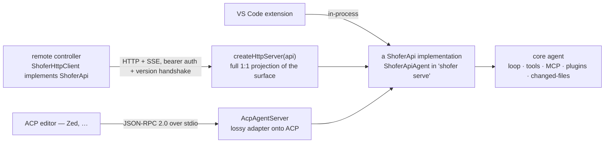
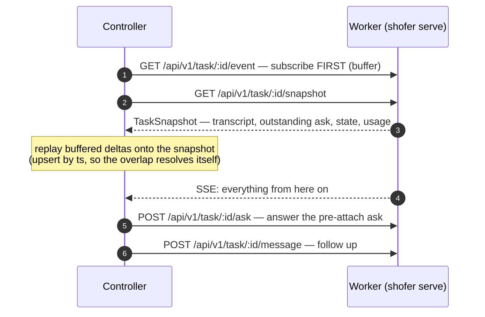
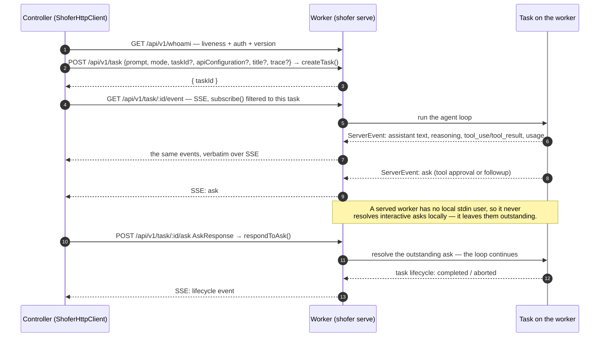
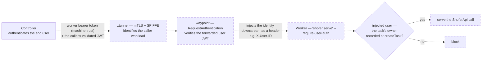
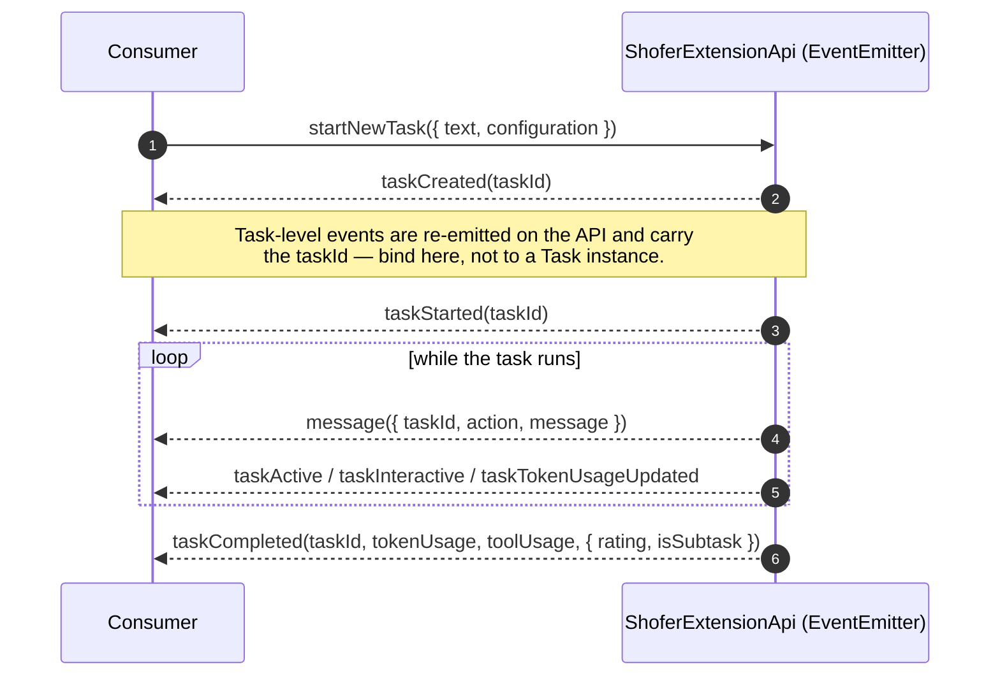
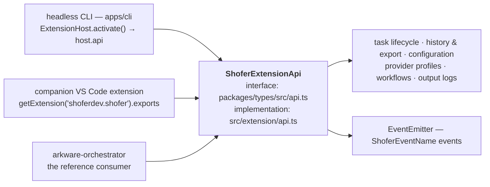
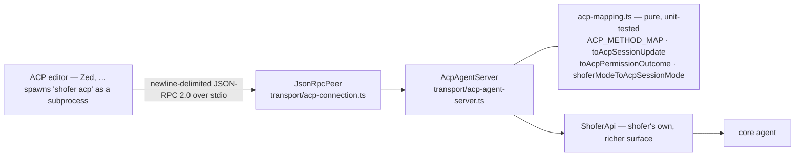
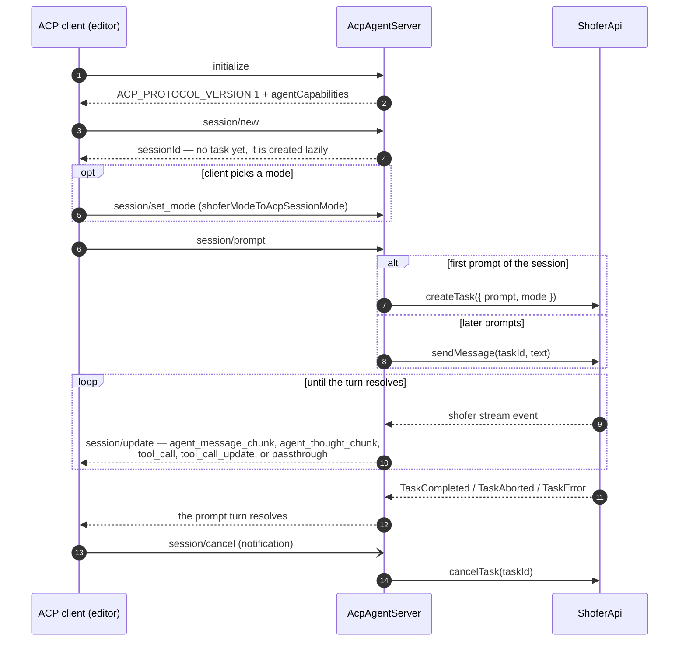

# The Shofer API

How to drive Shofer programmatically. One contract nests inside another, and
this doc is ordered the same way:

| Layer                                                                         | What it is                                                                                  | Who binds it                               |
| ----------------------------------------------------------------------------- | ------------------------------------------------------------------------------------------- | ------------------------------------------ |
| **`ShoferApi`** ([§1](#1-shoferapi--the-root-contract))                       | The task-addressed control plane: create, message, cancel, answer asks, snapshot, subscribe | every transport                            |
| **Transport bindings** ([§2](#2-transport-bindings))                          | The HTTP/SSE projection of that contract, and `shofer serve`                                | a remote client (`ShoferHttpClient`)       |
| **`ShoferExtensionApi`** ([§3](#3-shoferextensionapi--the-host-only-surface)) | `ShoferApi` **plus** the host-only administration surface                                   | companion VS Code extensions, the CLI, IPC |
| **ACP** ([§4](#4-acp--the-external-adapter))                                  | A lossy adapter onto an **external** standard                                               | ACP editors (Zed, …)                       |

```ts
// packages/types/src/shofer-api.ts
export interface ShoferApi { … }

// packages/types/src/api.ts
export interface ShoferExtensionApi extends ShoferApi, EventEmitter<ShoferEvents> { … }
```

The `extends` is the contract, enforced by the compiler rather than by prose: a
method cannot exist on the wire surface without existing on the extension API,
and because transports bind **`ShoferApi`**, the administration surface in §3
cannot reach the wire by accident.

---

## 1. `ShoferApi` — the root contract

`ShoferApi` is the **one control-plane interface** every front-end and transport drives.
It decouples the core agent (loop, tools, MCP, plugins, changed-files) from _how_ a
UI reaches it, so arbitrary front-ends (VS Code, an editor over [ACP](./shofer-api.md#4-acp--the-external-adapter), a CLI, a
remote controller) can drive the same core without touching it.

- **Definition:** [`packages/types/src/shofer-api.ts`](../packages/types/src/shofer-api.ts)
  (in `@shofer/types`, vscode-free, so both the core implementations and the wire-protocol
  modules share it).
- **Strategic context:** [`host-boundary.md`](./host-boundary.md) (host boundary,
  HTTP/SDK, distributed execution).

### Why it exists

The decoupling seam is `ShoferApi`, **not** any single wire protocol. Everything else is a
_transport_ that binds to it:

| Binding        | Implementer                                                                                             | Role                                                                                                                                                                                                                                               |
| -------------- | ------------------------------------------------------------------------------------------------------- | -------------------------------------------------------------------------------------------------------------------------------------------------------------------------------------------------------------------------------------------------- |
| **In-process** | `ShoferApiAgent implements ShoferApi` (`transport/shofer-api-agent.ts`)                                 | The live core agent, backed by the extension's `ShoferExtensionApi`.                                                                                                                                                                               |
| **HTTP/SSE**   | `createHttpServer(api)` + `ShoferHttpClient implements ShoferApi` (`transport/http-{server,client}.ts`) | A **1:1 projection of the full surface** (see [routes](#httpsse-binding)). The native transport for driving a served executor (`shofer serve`) from any client (`ShoferHttpClient`).                                                               |
| **ACP**        | `AcpAgentServer` over `ShoferApi` (`transport/acp-*.ts`)                                                | A **lossy adapter** onto the external [Agent Client Protocol](./shofer-api.md#4-acp--the-external-adapter) so ACP editors (Zed, …) can drive shofer. Narrower than `ShoferApi` — see [shofer-api.md](./shofer-api.md#4-acp--the-external-adapter). |



Because `ShoferHttpClient` _implements_ `ShoferApi`, client and server can't drift: the same
interface is the wire contract.

### The surface

The full method set (see the source for exact signatures):

#### Control plane

| Method                                                                                    | Purpose                                                                                                                                                                                                                                                                                                                                                                                                                                                                                                                                                                                                                                                                                                                                                                                                           |
| ----------------------------------------------------------------------------------------- | ----------------------------------------------------------------------------------------------------------------------------------------------------------------------------------------------------------------------------------------------------------------------------------------------------------------------------------------------------------------------------------------------------------------------------------------------------------------------------------------------------------------------------------------------------------------------------------------------------------------------------------------------------------------------------------------------------------------------------------------------------------------------------------------------------------------- |
| `createTask({ prompt, mode, taskId?, apiConfiguration?, title?, trace? })` → `{ taskId }` | Start a task. `mode` (**required**) is the mode slug it runs in. `apiConfiguration` ships the controller's resolved [API Configuration](#per-task-api-configuration) so a remote task runs on the same provider/model the front-end picked. `title` names the task AND locks the name: the agent's `set_task_title` tool is omitted entirely, which a controller that owns the label (a phone call, a pipeline stage) wants — and which keeps one always-available tool out of a latency-sensitive turn. `trace` is the W3C trace context ([`traceparent`/`tracestate`](https://www.w3.org/TR/trace-context/)) of the request creating the task, so the run continues the controller's trace instead of starting an unrelated one; core stores it and hands it to `beforeTaskStart` observers without parsing it. |
| `sendMessage(taskId, message)`                                                            | Send a follow-up message to a task. Rehydrates it when it is finished or cold — queued before the resume starts, so no resume ask is raised and a completed conversation continues without a separate `resumeTask`.                                                                                                                                                                                                                                                                                                                                                                                                                                                                                                                                                                                               |
| `cancelTask(taskId)`                                                                      | Abort a task.                                                                                                                                                                                                                                                                                                                                                                                                                                                                                                                                                                                                                                                                                                                                                                                                     |
| `respondToAsk(taskId, AskResponse)`                                                       | Answer an outstanding `ask` (interactive tool approval / follow-up). The reverse of the `ask` events on the stream, so a remote task's approvals round-trip like a local one's.                                                                                                                                                                                                                                                                                                                                                                                                                                                                                                                                                                                                                                   |
| `getTaskSnapshot(taskId)` → `TaskSnapshot \| undefined`                                   | The task's state so far — see [Task snapshots](#task-snapshots-attaching-to-a-running-task). `undefined` when the host owns no such task.                                                                                                                                                                                                                                                                                                                                                                                                                                                                                                                                                                                                                                                                         |
| `subscribe(listener)` → `unsubscribe`                                                     | Subscribe to the agent event stream ([`ServerEvent`](#event-model)).                                                                                                                                                                                                                                                                                                                                                                                                                                                                                                                                                                                                                                                                                                                                              |

**The single-open-task invariant survives this, and is worth stating exactly**,
because it reads like the opposite: at most one task is OPEN on the provider's
stack, so "the current task" is never ambiguous. Backgrounding keeps that — the
displaced task is popped, it simply is not killed on the way out. What the
invariant never meant is "one task per host"; the webview enforces it by
aborting because there the person asking for the new chat is the one who was
watching the old one, and no remote controller is left waiting on a reply that
will never come.

**Every method is task-addressed, and a host holds MANY tasks.** One `shofer serve`
node routinely hosts several independent conversations, each created and driven by its
own controller through the same API. So `createTask` and `resumeTask` make room for the
task they are about to focus by **backgrounding** the host's current one — popped off
the provider's task stack, still running, still addressable by id — never by aborting
it. `cancelTask` is addressed the same way: it cancels the named task whether that task
is the focused one or a backgrounded one.

The distinction shows up on the stream, and consumers depend on it: a `taskAborted`
with reason `user` is a deliberate cancellation, while `abandoned` means the host
discarded that task's instance out from under whoever was waiting on it. A controller
reading `abandoned` should treat the turn as lost, not as churn to wait through — the
agent composing the reply no longer exists, and nothing rebuilds a turn.

**Nothing routine emits `taskAborted`.** In particular, continuing a finished
conversation does not: `sendMessage` to a completed task rehydrates it, which
tears the completed instance down, and that teardown is silent (`task_states.md`
§Self-Contained Lifecycle Events). A controller may therefore treat any
`taskAborted` as the turn's terminal event, which is exactly how they are
written.

**A follow-up to a finished task is `sendMessage`, on its own.** Delivery owns
the rehydration and orders it so **no resume ask is ever raised**: the task is
rehydrated dormant (`startTask: false`), the message is queued, and only then is
the resume started — so `resumeTaskFromHistory` finds the message already there
and takes it AS the resumption (`task_states.md` §Resuming). Do NOT call
`resumeTask` first. That starts the resume with nothing queued, so an ask IS
published, and it is then answered by whoever watches asks — on a headless node
the CLI ask dispatcher, which spends the `--retry` budget and declines it. That
ask costs a persist, a state broadcast, a `getState()` and a `pWaitFor` round
trip on the first hop of the turn, which is the one hop a live voice
conversation feels. `resumeTask` remains for its own purpose: making a task
addressable without sending anything.

The follow-up's event sequence is therefore `taskCreated` (the rehydrated
instance) → `taskStarted` → `message`s → `taskCompleted`, with no `taskAborted`
and no resume ask anywhere in it.

#### Reverse data channel

Any **plugin-owned** per-task feature for a **remote (shadow) task**: the controller
reads and mutates it on the owning executor exactly like a local task drives its own
in-process plugin. One generic method carries all of them, so a new feature never means a
new wire method:

| Method                                                       | Purpose                                                                                                                                                                                                                                                |
| ------------------------------------------------------------ | ------------------------------------------------------------------------------------------------------------------------------------------------------------------------------------------------------------------------------------------------------ |
| `pluginRequest(taskId, plugin, method, params?)` → `unknown` | Call a plugin's `handleRequest` on the executor that owns the task — how the file-changes panel's list/revert/accept and the checkpoints feature's diff/restore reach their per-task state. `params`/result are plugin-defined JSON; errors propagate. |

#### Event model

`subscribe()` delivers `ServerEvent { type: string; …event-specific }` — a **superset,
open-ended** stream (assistant text, reasoning, tool-call start/result, asks, task
lifecycle, token usage, changed-files, …). Front-ends match on `type`. An `ask` event is
answered back via `respondToAsk` (`AskResponse { askResponse, text?, images?, askId?, mode? }`;
`mode` switches the task to that mode slug as part of the answer — for an
`ask_followup_question` suggestion that carries one).

Transports project this stream onto their own shape: HTTP/SSE emits it verbatim over SSE;
ACP maps the common cases onto its typed `session/update` variants and wraps the rest as
`passthrough` (see [shofer-api.md](./shofer-api.md#4-acp--the-external-adapter)).

### Task snapshots — attaching to a running task

`subscribe` only carries what happens NEXT. A controller that reaches a task already in
flight — the normal case for a dispatched task, and for any controller that restarted —
needs what came before, so the surface has one read method: `getTaskSnapshot(taskId)`,
served over `GET /api/v1/task/:id/snapshot` (bearer-authed like every other `/api/v1`
route; `404` when the host owns no such task).

[`taskSnapshotSchema`](../packages/types/src/shofer-api.ts) is the wire shape:

| Field            | Meaning                                                                                             |
| ---------------- | --------------------------------------------------------------------------------------------------- |
| `taskId`         | The task, on the host that owns it.                                                                 |
| `summary`        | Its title (the first prompt) — what a synthetic task header renders.                                |
| `createdAt`      | Creation timestamp, when the host knows one.                                                        |
| `state`          | `TaskState` — lifecycle, plus the completion rating when there is one.                              |
| `messages`       | The WHOLE `ShoferMessage` conversation, not a tail.                                                 |
| `outstandingAsk` | The ask the task is blocked on: `{ ask, askId?, text?, ts }` — enough to answer via `respondToAsk`. |
| `tokenUsage`     | Authoritative counters, so an attached view's token/cost meter is the executor's, not a guess.      |

`outstandingAsk` matters more than it looks: a served worker **never resolves an
interactive ask locally**, so a task found mid-flight is very often blocked on one raised
before anyone attached. It is derived from the transcript — the last message is an ask,
complete, not auto-approved, not already answered — which means the same rule applies to a
live task and to one rehydrated from disk.

Backfill + the per-task stream are the two halves of **attaching**:



Subscribing before fetching is what closes the hole a busy task would otherwise fall
into; because message deltas are keyed by `ts`, replaying the buffered ones over the
snapshot is idempotent.

### Per-task API Configuration

A remote worker runs each task on the **API Configuration the controlling front-end picked
for that task** — resolved controller-side (named profile → mode's profile → global
default) and shipped in `createTask`'s `apiConfiguration`. It can differ per task, and it
carries the provider/model/base-URL/key (over the bearer-token-authed channel), so the
worker needs no provider setup of its own. This is what lets a controller point every worker
at a shared endpoint (e.g. an `llm-router` service reachable from both hosts).

**Manual override.** Start the worker with any of `--provider` / `--model` / `--api-key` /
`--base-url` and it pins to that config: the incoming per-task `apiConfiguration` no longer
chooses the provider, model, endpoint or key, and the worker's own config wins. With none of
those flags, the worker defers to the controller entirely (per task). The gate is computed
once at boot (`serve.ts` → `allowClientConfig`) and enforced in `ShoferApiAgent.createTask`;
the in-process Local adapter never receives a remote config (it reads the provider's live
config directly).

**A pin covers credentials, not behaviour.** `CLIENT_TUNABLE_PROVIDER_SETTINGS`
(`@shofer/types`) is the subset a controller may still set on a pinned worker —
`toolCallingEnabled`, `enableReasoningEffort`, `reasoningEffort`,
`modelMaxThinkingTokens`, `modelTemperature`, `verbosity` — narrowed by
`pickClientTunableSettings`. Everything else is dropped.

`toolCallingEnabled: false` makes the task CONVERSATIONAL: no tools are sent, the
system prompt drops every tool-mediated section
([`system_prompt.md`](system_prompt.md)), environment details are skipped, and a
complete text-only assistant reply IS the turn — it completes the task (a
`TaskCompleted` event, the task still resumable via `sendMessage`) instead of
being re-prompted for a tool call. A queued message is drained first, continuing
the conversation. This is the shape a realtime voice caller needs, and it is per
task: the same worker serves conversational and agentic tasks side by side.

The distinction is the one `mode` already relies on: the pin exists so a remote controller
cannot swap a worker's credentials or identity, not so a deployment can freeze how the
pinned model behaves. Reasoning is the case that forces it. A thinking model emits reasoning
before its first assistant token, which is exactly the wrong shape for a realtime caller
(a voice turn is dead air until text arrives) and exactly the right one for a batch job —
and the same deployed worker serves both, so it cannot be a deploy-time constant. Sending
only pinned fields leaves `apiConfiguration` `undefined` rather than an empty object, so a
host still distinguishes "no client config" from "an override that happens to be empty".

### Where plugins fit

The [plugin system](../PLUGINS.md) runs **inside** the core agent, so plugin _behavior_
(contributed tools, `transformSystemPrompt`, lifecycle hooks) is baked into what the core
emits over `ShoferApi` — it rides **any** binding transparently (given the executor host
wired the plugin `ctx` seams). Plugin **UI** (badge, panel, settings, `ctx.ui`) is a
VS-Code-webview concern wired in `ShoferProvider` over `postMessage`; it is **not** part of
`ShoferApi` and does not cross any of these transports. A non-VS-Code front-end gets plugin
behavior, not plugin UI, unless it implements its own plugin-UI host.

---

## 2. Transport bindings

### HTTP/SSE

Shofer's **native, full-fidelity** transport (`transport/http-server.ts`). All
routes under `/api/v1` except `/health`; bearer-token auth + version handshake.

```
GET  /health                      liveness + version (open)
GET  /api/v1/whoami               { version } (authed; one-shot liveness+auth)
GET  /api/v1/event                SSE event stream (worker-wide: ALL tasks) → subscribe()
GET  /api/v1/task/:id/event       SSE event stream filtered to ONE task   → subscribe() + filter
GET  /api/v1/task/:id/snapshot    TaskSnapshot (404 = not this host's task) → getTaskSnapshot()
POST /api/v1/task                 { prompt, mode, taskId?, apiConfiguration?, title?, trace? } → createTask()
                                  (also honours W3C traceparent/tracestate request headers)
POST /api/v1/task/:id/message     { message }                 → sendMessage()
POST /api/v1/task/:id/cancel                                  → cancelTask()
POST /api/v1/task/:id/ask         AskResponse                 → respondToAsk()
POST /api/v1/task/:id/plugin-request        { plugin, method, params? } → { result }
```

`GET /api/v1/event` is the whole worker's firehose — every task's events. `GET
/api/v1/task/:id/event` is the same SSE filtered to one task (by `args[0]` /
`args[0].taskId`). A controller multiplexing many users' tasks on a **shared**
executor subscribes per authorized task, so it never receives — or has to demux —
other tenants' content; the worker-wide stream stays for single-tenant / whole-worker
consumers.

### Running `shofer serve`

`shofer serve` boots the headless executor and exposes the surface above; a controller
connects with `ShoferHttpClient`. Every option is a CLI flag (defined in
[`apps/cli/src/index.ts`](../apps/cli/src/index.ts), handled in
[`commands/cli/serve.ts`](../apps/cli/src/commands/cli/serve.ts)):

| Flag                     | Default                                          | Meaning                                                                                                                                                                                                                                                                                                                                                                                                                                  |
| ------------------------ | ------------------------------------------------ | ---------------------------------------------------------------------------------------------------------------------------------------------------------------------------------------------------------------------------------------------------------------------------------------------------------------------------------------------------------------------------------------------------------------------------------------- |
| `-p, --port <port>`      | `30099`                                          | Port to listen on.                                                                                                                                                                                                                                                                                                                                                                                                                       |
| `--host <host>`          | `127.0.0.1`                                      | Bind address. **Use `0.0.0.0` to accept traffic from outside the process** (e.g. in a container).                                                                                                                                                                                                                                                                                                                                        |
| `-w, --workspace <path>` | cwd                                              | Workspace directory. Custom modes are read from `<workspace>/.shofer/shofermodes`.                                                                                                                                                                                                                                                                                                                                                       |
| `-e, --extension <path>` | auto (`ROO_EXTENSION_PATH` → sibling `src/dist`) | Path to the built extension bundle (`extension.js`).                                                                                                                                                                                                                                                                                                                                                                                     |
| `--provider <provider>`  | `openrouter`                                     | LLM provider. Any of `--provider/--model/--api-key/--base-url` **pins** the worker's credentials and model (a controller's per-task `apiConfiguration` is then narrowed to `CLIENT_TUNABLE_PROVIDER_SETTINGS` — tool calling / reasoning / temperature / verbosity — rather than dropped wholesale).                                                                                                                                     |
| `-m, --model <model>`    | provider default                                 | Model id. The `shofer` provider has **no** default model — pass one or task creation errors.                                                                                                                                                                                                                                                                                                                                             |
| `-k, --api-key <key>`    | –                                                | Provider API key.                                                                                                                                                                                                                                                                                                                                                                                                                        |
| `--base-url <url>`       | –                                                | Provider base URL (e.g. `http://llm-router:3000/v1`).                                                                                                                                                                                                                                                                                                                                                                                    |
| `-t, --token <token>`    | `$SHOFER_NODE_TOKEN`                             | Bearer token required on every `/api/v1/*` call. Omit for an open (dev) worker. **Machine trust** (authenticates the controller, not the end user).                                                                                                                                                                                                                                                                                      |
| `--require-user-auth`    | off _(proposed)_                                 | **User-identity enforcement (launch-time only).** When on, the worker trusts a **validated end-user identity** injected upstream (Istio `RequestAuthentication` → header — see _User-identity enforcement_) and **blocks** any ShoferApi call whose user is not the task's owner. Operator-set at launch like `--provider`; **no in-session user or agent can change it.** The `--token` worker bearer is unaffected and still required. |
| `--interactive`          | off                                              | **How asks are surfaced — NOT the approval posture** (see below). The posture comes from the worker's `.shofer/` scopes and nothing else; with either setting of this flag, a tool the posture does not pre-approve raises an `ask` over ShoferApi that the controller brokers to its user via `respondToAsk`.                                                                                                                           |
| `-q, --quiet`            | off                                              | Suppress the per-task activity log on stderr.                                                                                                                                                                                                                                                                                                                                                                                            |
| `-d, --debug`            | off                                              | Debug logging to `~/.shofer/cli-debug.log`.                                                                                                                                                                                                                                                                                                                                                                                              |

**The worker's approval posture is its configuration, and only its
configuration.** The host seeds one key — `autoApprovalEnabled: false` — and
leaves every other posture key absent, where absent DENIES. `autoApprovalEnabled`,
the `alwaysAllow*` toggles, `allowedCommands` and `deniedCommands` are ordinary
`settings.json` keys, so a capability is auto-approved exactly where a `.shofer/`
scope the worker resolves states it `true` — per key, with the usual
project > user > global merge and `locked.json` inversion. A worker whose config
says nothing raises an ask for every dangerous tool. The startup banner prints the
resolved posture and its source (`approvals: ask (default — no posture configured)`
vs `approvals: from config (…)`). See
[`configuration.md`](configuration.md#headless-hosts-the-approval-posture-is-configuration-not-a-flag).

**Ask brokering (contract).** A served worker has no local stdin user, so it **never
resolves interactive asks locally** — tool/command/MCP approvals _and_ `followup`
questions are left outstanding for the controller to surface and answer via
`respondToAsk`. (Idle / flow-control asks — `api_req_failed`, `resume_task`, … — are
worker policy and are still handled on the worker.) A controller that drives a served
worker MUST answer brokered asks, or the task blocks: approvals with
`yesButtonClicked`/`noButtonClicked`, a `followup` with `messageResponse` + `text`.
The approval posture (`--interactive`, as overridden by the worker's config) only
decides whether _approvals arise at all_ (auto-approve vs surface); `followup`
questions are brokered in either mode, and an ask that is not auto-approved always
stays outstanding for the controller — configuration never causes the worker to
answer one itself.

One task's round trip over the HTTP/SSE binding, ask brokering included:



### User-identity enforcement (proposed)

The `--token` worker bearer is **machine trust** — it authenticates the _controller_ (e.g.
user-console) to the worker, not the end user. On a shared worker pool the controller is
trusted to only ever open/drive tasks for the user it authenticated; the worker itself does not
know _which_ user is behind a call. To make that a defense-in-depth invariant rather than a
controller-only guarantee, the worker is fronted by the **Istio ambient mesh** and given the
end-user identity — the worker token is **kept**, this layers on top:

- **Connection authN** — ztunnel **mTLS + SPIFFE** identifies the _caller workload_; an
  `AuthorizationPolicy` can restrict the ShoferApi to the controller's identity.
- **End-user identity** — the controller forwards the caller's **validated JWT**; Istio
  `RequestAuthentication` verifies it at the worker's waypoint and **injects the identity
  downstream as a header** (`outputClaimToHeaders`, e.g. `X-User-ID`), so the worker reads a
  _trusted_ user id it did not have to take on faith from the controller.
- **Enforcement** — with `--require-user-auth` on, the worker **blocks** any call whose injected
  user is not the task's owner (recorded at `createTask`). This is **launch-time,
  integrator-owned**: no in-session user or agent can disable it (same principle as provider
  pinning).



Everything dashed above is _proposed_. What exists today is the `--token` worker
bearer, which this layers on top of and does not replace.

Full model + rationale: `docs/authnz_arch.md` §11.2.

### stdio NDJSON (`--stdin-prompt-stream`)

The second binding of the same contract: newline-delimited JSON on stdin/stdout,
for a **program** driving one CLI process (`shofer --print --output-format
stream-json --stdin-prompt-stream`). The command set is a projection of
`ShoferApi` (schemas in [`packages/types/src/cli.ts`](../packages/types/src/cli.ts)):

| command    | `ShoferApi`                                       |
| ---------- | ------------------------------------------------- |
| `start`    | `createTask({ prompt, mode?, taskId?, images? })` |
| `message`  | `sendMessage(taskId, prompt, images?)`            |
| `cancel`   | `cancelTask(taskId)`                              |
| `ask`      | `respondToAsk(taskId, response)`                  |
| `ping`     | — process liveness, not the agent                 |
| `shutdown` | — process lifecycle, not the agent                |

`taskId` is optional on the addressed commands and defaults to the stream's
current task: a driver may track ids or not, but the call underneath is always
task-addressed — never current-task-centric, which raced concurrent tasks and
dropped messages.

**`ask` is why this is a binding and not a side channel.** Without it a driving
process cannot approve anything: the local `AskDispatcher` either auto-approves
(non-interactive) or prompts a human on readline, and a program can do neither.

**The output side is deliberately not `ServerEvent`.** `stream-json` emits a
flattened, self-describing projection for scripting consumers (`assistant`,
`tool_use`, `tool_result`, `thinking`, `result` — see
[`cli.md`](cli.md)) rather than the raw forwarded stream. That asymmetry is a
choice: the same trade ACP makes onto its typed `session/update` variants, for
the same reason — the consumer wants a shape it can switch on, not fidelity.

---

## 3. `ShoferExtensionApi` — the host-only surface

Shofer exposes a public API surface that companion VSCode extensions can consume
to programmatically control tasks, subscribe to events, and manage configuration.
This is the **same API** returned by Shofer's `activate()` function and accessed
via [`vscode.extensions.getExtension('shoferdev.shofer').exports`](https://code.visualstudio.com/api/references/vscode-api#extensions).

The canonical source of truth for the interface is
[`packages/types/src/api.ts`](../packages/types/src/api.ts); the canonical
implementation is [`src/extension/api.ts`](../src/extension/api.ts).

> **HTTP/SSE transport (§10).** Today the API is **in-process** (a JS object in
> the extension host). §10 publishes it over a network boundary so any client —
> TUI, web app, third-party tool — can drive the agent, and a generated SDK can't
> drift from it. The transport itself is
> [`packages/core/src/transport/http-server.ts`](../packages/core/src/transport/http-server.ts): a dependency-free
> `node:http` server exposing task control over HTTP and a one-way event stream
> over SSE (`GET /api/v1/event`), driven by an injected `ShoferApi`. Wiring
> `ShoferApi` to this `ShoferExtensionApi` (or the headless CLI agent) and generating a
> typed SDK from the route set is the follow-on; it depends on §8's host-agnostic
> core so the server can run headless.

### Quick Start

```typescript
import * as vscode from "vscode"

const shoferExtension = vscode.extensions.getExtension("shoferdev.shofer")
if (!shoferExtension) {
	throw new Error("Shofer extension not installed")
}

// Activate if not already active
if (!shoferExtension.isActive) {
	await shoferExtension.activate()
}

const shoferApi = shoferExtension.exports as ShoferExtensionApi
```

### API Reference

#### Task Management

| Method                                                    | Signature                                                | Description                                                                                              |
| --------------------------------------------------------- | -------------------------------------------------------- | -------------------------------------------------------------------------------------------------------- |
| [`startNewTask`](../packages/types/src/api.ts:18)         | `(options) => Promise<string>`                           | Creates a new task with an optional initial prompt. Returns the task ID.                                 |
| [`resumeTask`](../packages/types/src/api.ts:34)           | `(taskId: string) => Promise<void>`                      | Resumes a previously-created task by ID. Throws if not found.                                            |
| [`clearCurrentTask`](../packages/types/src/api.ts:49)     | `(lastMessage?: string) => Promise<void>`                | Dismisses the current task from the stack.                                                               |
| [`cancelCurrentTask`](../packages/types/src/api.ts:53)    | `() => Promise<void>`                                    | Cancels the currently active task (Stop button equivalent).                                              |
| [`sendMessage`](../packages/types/src/api.ts:59)          | `(message?: string, images?: string[]) => Promise<void>` | Sends a follow-up message to the active task. Images should be data URIs (`data:image/webp;base64,...`). |
| [`pressPrimaryButton`](../packages/types/src/api.ts:63)   | `() => Promise<void>`                                    | Presses the primary (Accept/Approve) button in the chat UI.                                              |
| [`pressSecondaryButton`](../packages/types/src/api.ts:67) | `() => Promise<void>`                                    | Presses the secondary (Reject/Cancel) button in the chat UI.                                             |
| [`isReady`](../packages/types/src/api.ts:71)              | `() => boolean`                                          | Returns `true` when the Shofer webview has launched and the API is usable.                               |
| [`deleteQueuedMessage`](../packages/types/src/api.ts:61)  | `(messageId: string) => void`                            | Removes a queued message by ID from the current task's message queue.                                    |

##### `startNewTask` Options

```typescript
{
    configuration?: ShoferSettings  // Partial settings to apply for this task
    text?: string                   // Initial prompt text
    images?: string[]               // Image data URIs
    newTab?: boolean                // Open in a new VS Code tab (vs. reusing sidebar)
}
```

#### Task History Queries

| Method                                                   | Signature                              | Description                                                         |
| -------------------------------------------------------- | -------------------------------------- | ------------------------------------------------------------------- |
| [`isTaskInHistory`](../packages/types/src/api.ts:40)     | `(taskId: string) => Promise<boolean>` | Checks whether a task with the given ID exists in the task history. |
| [`getCurrentTaskStack`](../packages/types/src/api.ts:45) | `() => string[]`                       | Returns the current task stack as an array of task IDs.             |

#### Task History & Management (TaskSelector parity)

The following methods provide programmatic access to every action available in the
TaskSelector UI panel — listing, switching, renaming, archiving, pinning, and
deleting tasks.

| Method                                                | Signature                                     | Description                                                                                              |
| ----------------------------------------------------- | --------------------------------------------- | -------------------------------------------------------------------------------------------------------- |
| [`getTaskHistoryItems`](../packages/types/src/api.ts) | `() => HistoryItem[]`                         | Returns all task history items as a flat array (backing data for the TaskSelector panel).                |
| [`showTaskWithId`](../packages/types/src/api.ts)      | `(taskId, opts?) => Promise<void>`            | Switches the active task. In VSCode loads into the chat view; in headless creates on the internal stack. |
| [`renameTask`](../packages/types/src/api.ts)          | `(taskId, name) => Promise<void>`             | Renames a task by ID (updates the display name in TaskSelector and HistoryView).                         |
| [`archiveTask`](../packages/types/src/api.ts)         | `(taskId) => Promise<void>`                   | Archives a task (moves to the "Archived" collapsible section).                                           |
| [`unarchiveTask`](../packages/types/src/api.ts)       | `(taskId) => Promise<void>`                   | Unarchives a previously archived task.                                                                   |
| [`pinTask`](../packages/types/src/api.ts)             | `(taskId) => Promise<void>`                   | Pins a task (shows at the top of the task list).                                                         |
| [`unpinTask`](../packages/types/src/api.ts)           | `(taskId) => Promise<void>`                   | Unpins a previously pinned task.                                                                         |
| [`deleteTask`](../packages/types/src/api.ts)          | `(taskId, cascadeSubtasks?) => Promise<void>` | Deletes a task and (optionally) all its subtasks from history, disk, and memory.                         |

#### Task Export (inline / data-returning)

These methods return the export content inline instead of saving to a file,
enabling programmatic consumption from CLI, companion extensions, and
orchestration workflows.

| Method                                                  | Signature                                      | Description                                                                                             |
| ------------------------------------------------------- | ---------------------------------------------- | ------------------------------------------------------------------------------------------------------- |
| [`getTaskMarkdownExport`](../packages/types/src/api.ts) | `(taskId) => Promise<string>`                  | Returns the markdown-formatted task conversation as a string (same content as `exportTaskWithId` file). |
| [`getTaskJsonExport`](../packages/types/src/api.ts)     | `(taskId) => Promise<Record<string, unknown>>` | Returns the structured JSON trace (calls, cost, token usage, tool metadata) as an object.               |

#### Logging

| Method                                          | Signature                       | Description                                                                                  |
| ----------------------------------------------- | ------------------------------- | -------------------------------------------------------------------------------------------- |
| [`getOutputLogs`](../packages/types/src/api.ts) | `(maxLines?: number) => string` | Returns the most recent lines from the extension's output channel buffer (up to 5000 lines). |

#### Configuration Import/Export

| Method                                                | Signature                         | Description                                                                                                       |
| ----------------------------------------------------- | --------------------------------- | ----------------------------------------------------------------------------------------------------------------- |
| [`exportConfiguration`](../packages/types/src/api.ts) | `() => string`                    | Exports the full Shofer configuration (except secrets) as a JSON string for transfer or backup.                   |
| [`importConfiguration`](../packages/types/src/api.ts) | `(json: string) => Promise<void>` | Imports a configuration from a JSON string (previously obtained via `exportConfiguration`). Applies and persists. |

#### Configuration

| Method                                                | Signature                                   | Description                                                       |
| ----------------------------------------------------- | ------------------------------------------- | ----------------------------------------------------------------- |
| [`getConfiguration`](../packages/types/src/api.ts:76) | `() => ShoferSettings`                      | Returns the full current configuration (all non-secret settings). |
| [`setConfiguration`](../packages/types/src/api.ts:81) | `(values: ShoferSettings) => Promise<void>` | Applies configuration changes and persists them.                  |

#### Provider Profile Management

| Method                                                 | Signature                                                    | Description                                           |
| ------------------------------------------------------ | ------------------------------------------------------------ | ----------------------------------------------------- |
| [`getProfiles`](../packages/types/src/api.ts:86)       | `() => string[]`                                             | Lists all configured provider profile names.          |
| [`getProfileEntry`](../packages/types/src/api.ts:92)   | `(name: string) => ProviderSettingsEntry \| undefined`       | Returns a single profile entry by name.               |
| [`createProfile`](../packages/types/src/api.ts:101)    | `(name, profile?, activate?) => Promise<string>`             | Creates a new profile. Throws if name already exists. |
| [`updateProfile`](../packages/types/src/api.ts:110)    | `(name, profile, activate?) => Promise<string \| undefined>` | Updates an existing profile. Throws if not found.     |
| [`upsertProfile`](../packages/types/src/api.ts:118)    | `(name, profile, activate?) => Promise<string \| undefined>` | Creates or updates a profile.                         |
| [`deleteProfile`](../packages/types/src/api.ts:124)    | `(name: string) => Promise<void>`                            | Deletes a profile by name. Throws if not found.       |
| [`getActiveProfile`](../packages/types/src/api.ts:129) | `() => string \| undefined`                                  | Returns the name of the currently active profile.     |
| [`setActiveProfile`](../packages/types/src/api.ts:135) | `(name: string) => Promise<string \| undefined>`             | Switches the active profile.                          |

### Events

The `ShoferExtensionApi` extends Node.js `EventEmitter`. Subscribe with
`api.on(eventName, listener)` and unsubscribe with
`api.off(eventName, listener)`.

All event names are defined in the [`ShoferEventName`](../packages/types/src/events.ts:12) enum.
The payload for each event is typed via Zod schemas in
[`ShoferEvents`](../packages/types/src/events.ts:65).

**Not every event crosses a transport.** `subscribe()` — and therefore the SSE
streams — forwards the
[`FORWARDED_EVENTS`](../packages/core/src/transport/shofer-api-agent.ts) subset: the
task's LIFECYCLE, which is what a controller with no view onto the host has to act
on. That is `taskCreated`/`taskStarted`/`taskCompleted`/`taskAborted`/`taskError`,
`message`, `taskModeSwitched`, `taskTitleChanged`, `taskTokenUsageUpdated`, the
blocking states (`taskActive`/`taskInteractive`/`taskResumable`/`taskIdle` plus
`taskAskResponded`), the delegation edges
(`taskPaused`/`taskUnpaused`/`taskSpawned`/`taskDelegated`/`taskDelegationCompleted`/`taskDelegationResumed`)
and `taskToolFailed`. Deliberately NOT forwarded: `taskFocused`/`taskUnfocused`
(which window a human is looking at — the host's own UI state),
`queuedMessagesUpdated` (an echo of what the controller itself sent), and the
configuration/query-response events, which describe the host rather than any task.
An in-process listener on `ShoferExtensionApi` still sees everything.

#### Task Provider Lifecycle

| Event                                               | Payload            | Description                                                                                                                        |
| --------------------------------------------------- | ------------------ | ---------------------------------------------------------------------------------------------------------------------------------- |
| [`taskCreated`](../packages/types/src/events.ts:14) | `[taskId: string]` | Emitted when a new task is created. **Subscribe to this to bind per-task events** (see [Per-Task Events](#per-task-events) below). |

#### Task Lifecycle

| Event                                                   | Payload                                                  | Description                                                                                                                 |
| ------------------------------------------------------- | -------------------------------------------------------- | --------------------------------------------------------------------------------------------------------------------------- |
| [`taskStarted`](../packages/types/src/events.ts:18)     | `[taskId: string]`                                       | Task has started executing.                                                                                                 |
| [`taskCompleted`](../packages/types/src/events.ts:19)   | `[taskId, tokenUsage, toolUsage, { rating, isSubtask }]` | Task finished successfully.                                                                                                 |
| [`taskAborted`](../packages/types/src/events.ts:21)     | `[taskId, { reason }]`                                   | Task was aborted. `reason` is one of `"user"`, `"error"`, `"abandoned"` — a COMPLETED task is torn down without this event. |
| [`taskError`](../packages/types/src/events.ts:20)       | `[taskId, errorType]`                                    | Task encountered an error.                                                                                                  |
| [`taskFocused`](../packages/types/src/events.ts:22)     | `[taskId: string]`                                       | Task gained focus.                                                                                                          |
| [`taskUnfocused`](../packages/types/src/events.ts:23)   | `[taskId: string]`                                       | Task lost focus.                                                                                                            |
| [`taskActive`](../packages/types/src/events.ts:24)      | `[taskId: string]`                                       | Task is actively running.                                                                                                   |
| [`taskInteractive`](../packages/types/src/events.ts:25) | `[taskId: string]`                                       | Task is awaiting user interaction (ask/approval).                                                                           |
| [`taskResumable`](../packages/types/src/events.ts:26)   | `[taskId: string]`                                       | Task can be resumed.                                                                                                        |
| [`taskIdle`](../packages/types/src/events.ts:27)        | `[taskId: string]`                                       | Task is idle.                                                                                                               |

#### Subtask Lifecycle

| Event                                                           | Payload                                | Description                           |
| --------------------------------------------------------------- | -------------------------------------- | ------------------------------------- |
| [`taskPaused`](../packages/types/src/events.ts:30)              | `[taskId: string]`                     | Parent task paused for delegation.    |
| [`taskUnpaused`](../packages/types/src/events.ts:31)            | `[taskId: string]`                     | Parent task resumed after delegation. |
| [`taskSpawned`](../packages/types/src/events.ts:32)             | `[parentTaskId, childTaskId]`          | A subtask was spawned.                |
| [`taskDelegated`](../packages/types/src/events.ts:33)           | `[parentTaskId, childTaskId]`          | Parent delegated work to a child.     |
| [`taskDelegationCompleted`](../packages/types/src/events.ts:34) | `[parentTaskId, childTaskId, summary]` | Delegated child completed.            |
| [`taskDelegationResumed`](../packages/types/src/events.ts:35)   | `[parentTaskId, childTaskId]`          | Parent resumed after delegation.      |

#### Task Execution

| Event                                                         | Payload                         | Description                                                                                                                                      |
| ------------------------------------------------------------- | ------------------------------- | ------------------------------------------------------------------------------------------------------------------------------------------------ |
| [`message`](../packages/types/src/events.ts:38)               | `[{ taskId, action, message }]` | A message was created or updated. `action` is `"created"` or `"updated"`. Contains the full [`ShoferMessage`](../packages/types/src/message.ts). |
| [`taskModeSwitched`](../packages/types/src/events.ts:39)      | `[taskId, mode]`                | Task mode changed.                                                                                                                               |
| [`taskAskResponded`](../packages/types/src/events.ts:40)      | `[taskId]`                      | User responded to an ask.                                                                                                                        |
| [`taskUserMessage`](../packages/types/src/events.ts:41)       | `[taskId]`                      | User sent a message.                                                                                                                             |
| [`queuedMessagesUpdated`](../packages/types/src/events.ts:42) | `[taskId, queuedMessages[]]`    | Queued messages for a task changed.                                                                                                              |

#### Task Analytics

| Event                                                         | Payload                           | Description                   |
| ------------------------------------------------------------- | --------------------------------- | ----------------------------- |
| [`taskTokenUsageUpdated`](../packages/types/src/events.ts:45) | `[taskId, tokenUsage, toolUsage]` | Token usage counters updated. |
| [`taskToolFailed`](../packages/types/src/events.ts:46)        | `[taskId, toolName, error]`       | A tool execution failed.      |

#### Configuration Changes

| Event                                                          | Payload                | Description                      |
| -------------------------------------------------------------- | ---------------------- | -------------------------------- |
| [`modeChanged`](../packages/types/src/events.ts:49)            | `[newMode: string]`    | Global mode changed.             |
| [`providerProfileChanged`](../packages/types/src/events.ts:50) | `[{ name, provider }]` | Active provider profile changed. |

#### Per-Task Events

Most events are emitted on individual `Task` instances rather than the top-level
API. To receive per-task events, listen for `taskCreated` and then bind to the
created task:



```typescript
shoferApi.on("taskCreated", (taskId) => {
	// The task instance is accessible internally but not re-emitted
	// through the public API directly. Listen on the API for task-level
	// events which include taskId in the payload.
})

// Task-level events are re-emitted on the API with taskId:
shoferApi.on("taskStarted", (taskId) => {
	/* ... */
})
shoferApi.on("taskCompleted", (taskId, tokenUsage, toolUsage, info) => {
	/* ... */
})
shoferApi.on("message", ({ taskId, action, message }) => {
	/* ... */
})
```

### Reference Consumer: Arkware Orchestrator

The `arkware-orchestrator` extension is the canonical
consumer of the public API. Its `main.ts`
demonstrates:

- Acquiring the API via `vscode.extensions.getExtension('shoferdev.shofer')`
- Subscribing to all 27 events via `api.on(eventName, listener)`
- Starting tasks via `api.startNewTask({ text, configuration })`
- Sending follow-up messages via `api.sendMessage(text)`
- Cancelling tasks via `api.cancelCurrentTask()`
- Approving actions via `api.pressPrimaryButton()`

### Relationship to CLI

The [CLI (`apps/cli/`)](cli.md) and companion extensions **both use the same
`ShoferExtensionApi` interface** as their control plane. The CLI calls `activate()` which
returns a `ShoferExtensionApi` instance, then delegates all task management, configuration,
profile operations, and event subscriptions through it. Companion extensions
acquire the same API via `vscode.extensions.getExtension('shoferdev.shofer').exports`.

The ShoferExtensionApi is the **single unified interface** for programmatically controlling
Shofer — regardless of whether the consumer is a headless CLI process, a companion
VSCode extension, or an external IPC client.



#### CLI Log Access

The CLI (and any headless consumer) can read Shofer's runtime logs via
`api.getOutputLogs()`. The logs are sourced from the same in-memory ring buffer
that feeds the VSCode Output Channel panel, so the CLI sees the same diagnostics
that a VSCode user would see. The ring buffer holds up to 5000 lines of
human-readable log output.

#### CLI Configuration Management

The CLI can export and import the full Shofer configuration:

```typescript
// Export current configuration (without secrets)
const configJson = api.exportConfiguration()
// → Save to file, transfer to another instance, etc.

// Import configuration
await api.importConfiguration(configJson)
```

The `importConfiguration` method validates the JSON and applies all settings
via the same `ContextProxy.setValues()` path used by the Settings UI.

#### Workflow Management

| Method                                              | Signature                                       | Description                                                                                                                                                         |
| --------------------------------------------------- | ----------------------------------------------- | ------------------------------------------------------------------------------------------------------------------------------------------------------------------- |
| [`createWorkflow`](../packages/types/src/api.ts)    | `(slangSource, flowParams?) => Promise<string>` | Creates and starts a Slang workflow from a `.slang` source string. Parses, validates, and launches the WorkflowTask.                                                |
| [`discoverWorkflows`](../packages/types/src/api.ts) | `() => Promise<Map<string, string>>`            | Discovers available Slang workflows from the project's `.shofer/workflows/` and the user's `~/.shofer/workflows/` directories. Returns a map of flow name → source. |

#### Consumer SDK

The CLI's [`ExtensionClient`](../apps/cli/src/agent/extension-client.ts) is
importable by other workspace packages as:

```typescript
import { ExtensionClient } from "@shofer/cli/client"
```

It provides a high-level state machine (`AgentLoopState`) over ShoferEvents and
WebviewMessage protocols. Companion extensions can use it instead of wiring
`api.on(event, ...)` listeners directly.

### Key Files

| File                                                                                    | Role                                                 |
| --------------------------------------------------------------------------------------- | ---------------------------------------------------- |
| [`packages/types/src/api.ts`](../packages/types/src/api.ts)                             | `ShoferExtensionApi` interface definition            |
| [`packages/types/src/events.ts`](../packages/types/src/events.ts)                       | `ShoferEventName` enum + `ShoferEvents` type schemas |
| [`packages/types/src/global-settings.ts`](../packages/types/src/global-settings.ts)     | `ShoferSettings` type                                |
| [`packages/types/src/provider-settings.ts`](../packages/types/src/provider-settings.ts) | `ProviderSettings` / `ProviderSettingsEntry` types   |
| [`src/extension/api.ts`](../src/extension/api.ts)                                       | `API` class — implementation of `ShoferExtensionApi` |
| [`src/extension.ts`](../src/extension.ts:457)                                           | Returns `new API(...)` from `activate()`             |
| [`apps/cli/src/agent/extension-host.ts`](../apps/cli/src/agent/extension-host.ts)       | CLI consumer of `ShoferExtensionApi`                 |
| [`apps/cli/src/agent/extension-client.ts`](../apps/cli/src/agent/extension-client.ts)   | Reusable state-machine SDK over ShoferEvents         |
| `extensions/orchestrator/src/main.ts`                                                   | Reference consumer of the public API                 |

---

## 4. ACP — the external adapter

> **This contract is not ours.** ACP's method set and version come from
> upstream, so a change here tracks somebody else's standard rather than
> designing ours — which is why it is the last section rather than interleaved
> with the root contract.

Shofer implements the **agent side of ACP** so any ACP-speaking editor (Zed today, more
over time) can drive shofer as a backend agent with **zero per-editor work** — instead of N
bespoke editor integrations. ACP is an _external standard_; shofer's job is to map its own
session/mode/model/permission/event surface onto ACP's method set.

- **Mapping (pure, tested):** [`transport/acp-mapping.ts`](../packages/core/src/transport/acp-mapping.ts)
- **Agent server:** [`transport/acp-agent-server.ts`](../packages/core/src/transport/acp-agent-server.ts)
- **JSON-RPC peer:** [`transport/acp-connection.ts`](../packages/core/src/transport/acp-connection.ts)
- **Entrypoint:** `shofer acp` (stdio) → `transport/run-acp-agent.ts`
- **Surface it adapts:** [`shofer-api.md`](./shofer-api.md) — read that first.



### What ACP actually is

ACP is a **full RPC protocol**, not just a payload format:

- **Mechanism** — JSON-RPC 2.0 (requests / responses / notifications), framed as
  **newline-delimited JSON**, one object per line, over **stdio** (the editor spawns
  `shofer acp` as a subprocess). Our `JsonRpcPeer` is transport-agnostic (a `write(line)`
  sink + `receive()`), but the standard wrapping is stdio.
- **Schema + semantics** — a _fixed_ method set and session lifecycle defined by the
  standard: `initialize` (capability negotiation) → `session/new` → `session/prompt`
  (streaming `session/update` notifications) → `session/cancel`.
- **Version** — `ACP_PROTOCOL_VERSION = 1`.

So ACP defines both _how_ messages are exchanged and _what_ they mean. The point is
**interop** across agents and editors.

#### Distinct from

- **MCP** — tools shofer _calls_ (outbound). ACP is inbound: clients drive shofer.
- **shofer's multi-agent orchestration** (`new_task`, peer messaging) — internal, not a wire protocol.
- **[ShoferApi](./shofer-api.md)** — shofer's own richer surface. ACP is a _lossy adapter_ over it (see [below](#how-acp-differs-from-agentapi)).

ACP here is **agent-side** (clients drive shofer). Acting as an ACP _client_ (shofer driving
external ACP agents) is a separate, lower-priority direction.

### Method map (ACP → shofer concept)

The method set shofer maps, from `ACP_METHOD_MAP` (asserted in tests so `shofer acp` can be
checked for completeness against the protocol):

| ACP method          | shofer concept                                      |
| ------------------- | --------------------------------------------------- |
| `initialize`        | capability negotiation                              |
| `authenticate`      | provider credentials                                |
| `newSession`        | create Task                                         |
| `loadSession`       | resume Task from history                            |
| `listSessions`      | task history                                        |
| `prompt`            | send user message to Task                           |
| `cancel`            | `Task.abortTask`                                    |
| `setSessionMode`    | switch mode (`shoferModeToAcpSessionMode`)          |
| `setSessionModel`   | select model (catalog)                              |
| `requestPermission` | auto-approval decision (`toAcpPermissionOutcome`)   |
| `sessionUpdate`     | typed events → notifications (`toAcpSessionUpdate`) |

#### Currently wired on the agent server

The live `AcpAgentServer` handles: `initialize`, `session/new`, `session/prompt`
(streaming `session/update`, resolving the turn on `TaskCompleted`/`TaskAborted`/
`TaskError`), `session/set_mode`, and the `session/cancel` notification. `initialize`
advertises `agentCapabilities: { loadSession: false, promptCapabilities: { image: false }
}`. The remaining rows (auth, `loadSession`/`listSessions`, `setSessionModel`,
`requestPermission`) are the deferred surface — see [Status](#status--deferred).



### Event mapping

Shofer stream events → ACP `session/update` notifications (`toAcpSessionUpdate`). Common
cases get dedicated variants; **nothing is dropped** — the fallback wraps the raw event:

| shofer event             | ACP `sessionUpdate`                              |
| ------------------------ | ------------------------------------------------ |
| `assistant` / `text`     | `agent_message_chunk` (text)                     |
| `thinking` / `reasoning` | `agent_thought_chunk` (text)                     |
| `tool_use`               | `tool_call` (id, title)                          |
| `tool_result`            | `tool_call_update` (status `completed`, content) |
| _anything else_          | `passthrough` (raw event)                        |

### Permissions & modes

An interactive tool approval maps a shofer auto-approval decision onto an ACP
`requestPermission` outcome (`toAcpPermissionOutcome`):

| shofer decision | ACP outcome                                    |
| --------------- | ---------------------------------------------- |
| `approve`       | `selected: allow_once` (no user prompt)        |
| `deny`          | `selected: reject`                             |
| `ask`           | `prompt` (defer to the client's permission UI) |

Modes map **1:1** — the shofer mode slug _is_ the ACP session-mode id (a named passthrough,
`shoferModeToAcpSessionMode` / `acpSessionModeToShoferMode`, so there's one place to diverge).

### How ACP differs from ShoferApi

Both let arbitrary front-ends drive the core, but they are **different contracts**, not two
pipes for one contract:

|                    | ACP                                                                                                   | [ShoferApi](./shofer-api.md) (HTTP/SSE)     |
| ------------------ | ----------------------------------------------------------------------------------------------------- | ------------------------------------------- |
| Owner              | External standard (Zed-originated)                                                                    | Shofer's own                                |
| Schema             | **Fixed, narrow** ACP method set                                                                      | **Full, faithful** shofer surface           |
| Notably **absent** | plugin requests — the channel behind the changed-files panel, checkpoints, … (no such concept in ACP) | — (exposes all of it)                       |
| Wire               | JSON-RPC 2.0 over stdio (subprocess)                                                                  | REST + SSE, bearer auth + version handshake |
| Purpose            | Interop with ACP editors                                                                              | Driving a served executor remotely          |

Key point: `ShoferApi` is **richer than ACP**. ACP is a lowest-common-denominator adapter;
HTTP/SSE is the full-fidelity binding. Even running ACP JSON-RPC over a socket would still
be the narrow ACP surface — the difference is the **schema**, not the pipe.

### Plugins over ACP

Plugin **behavior** (contributed tools like `ask_live_memory`, `transformSystemPrompt`,
lifecycle hooks) rides ACP transparently: it's baked into what the core emits, so an ACP
client's `session/update` stream reflects plugin-shaped turns (given the executor host
wired the plugin `ctx` seams). Plugin **UI** does **not** cross ACP — it's a VS Code webview
concern (see [shofer-api.md](./shofer-api.md#where-plugins-fit)).

### Running it

`shofer acp` boots a headless host (`ShoferApiAgent` → `AcpAgentServer`) and runs on
stdin/stdout (`disableOutput` keeps stdout clean for the protocol). An editor configures it
as its ACP agent command.

### Status / deferred

The mapping is pure + fully unit-tested; the `shofer acp` shell runs on the host-agnostic
core (no VS Code needed). Deferred:

1. Swap the direct JSON-RPC framing for the upstream `@agentclientprotocol/sdk` once it's in
   the registry (drop-in — `JsonRpcPeer` mirrors its connection).
2. Wire `requestPermission` (agent→client) onto the auto-approval flow — the mapping exists;
   it needs an approval hook on `ShoferApi`.
3. `loadSession`/`listSessions`, `setSessionModel`, and end-to-end validation against a live
   ACP client (Zed), reconciling raw-event → `ShoferStreamEvent` normalization with real payloads.

See [`host-boundary.md`](./host-boundary.md) for the architecture this adapter plugs into.
