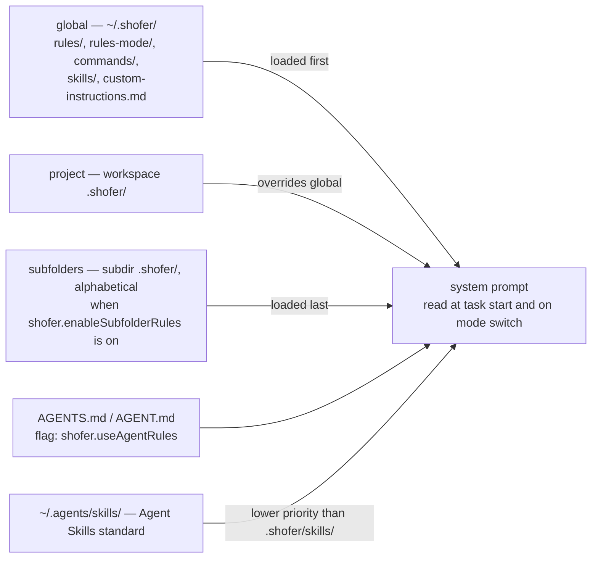
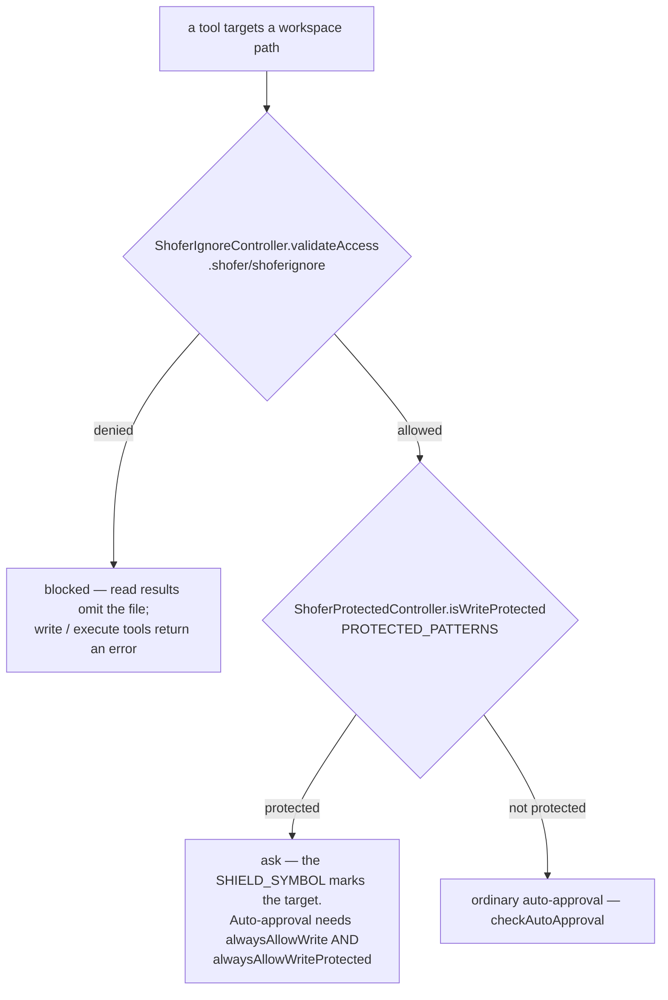

# Shofer Special Files Reference

This document catalogs every file and directory that Shofer recognizes
and treats specially — either by loading its content into the system prompt,
enforcing access controls, or using it for configuration.

See also:

- [`configuration.md`](configuration.md) — VS Code settings reference
- [`tool_access.md`](tool_access.md) — mode-level tool access control
- [`settings_overlay.md`](settings_overlay.md) — settings merge order

---

## File Discovery Order

Shofer searches for rules and instructions in this order (project overrides global):

1. **Global** `~/.shofer/` (or `%USERPROFILE%\.shofer\` on Windows)
2. **Project-local** `<workspace>/.shofer/`
3. **Subfolder** `<workspace>/<subdir>/.shofer/` (alphabetically, when `shofer.enableSubfolderRules` is on)

The `.agents/` directory (Agent Skills standard) is also discovered at both levels.



---

## Workspace Root Files

### `.shofer/shoferignore`

| Property            | Details                            |
| ------------------- | ---------------------------------- |
| **Format**          | `.gitignore`-style patterns        |
| **Scope**           | Workspace root only                |
| **Watched**         | Yes — changes reload automatically |
| **Write-protected** | Yes                                |

Controls which files the LLM can access through its tools. Applies to:

- **Read tools**: `read_file`, `grep_search`, `list_files`, `find_files`
- **Write tools**: `write_to_file`, `edit_file`, `apply_diff`, `apply_patch`, `search_replace`, `sed`, `generate_image`
- **Execute tools**: `execute_command` (blocks file-reading commands like `cat`, `grep`, `head`, `tail`, `sed`, `awk`, `Get-Content`, `Select-String`, `gc`, `sls`, `type`, `less`, `more` that reference ignored files)
- **@-mentions**: Ignored files return `"(File is ignored by .shofer/shoferignore)"`; directory attachments filter or mark them with 🔒
- **Environment details**: Ignored files are excluded from the file listing injected into each user message

When a file is blocked by `.shofer/shoferignore`, read-tool results omit the file
and write/execute tools return an error indicating the path is ignored.
The exact wording varies by tool; the controller itself only exposes boolean
access checks and a formatted instructions block via
[`getInstructions()`](../packages/core/src/ignore/ShoferIgnoreController.ts)
(surfaces `🔒`-badged entries for blocked files).

A UI setting ("Show .shofer/shoferignore'd files in lists and searches") controls
whether ignored files appear with a 🔒 badge or are hidden entirely from
file listings.

Implementation: [`ShoferIgnoreController`](../packages/core/src/ignore/ShoferIgnoreController.ts)

---

### `.shofer/shofermodes`

| Property            | Details                                                         |
| ------------------- | --------------------------------------------------------------- |
| **Format**          | YAML                                                            |
| **Scope**           | Workspace root                                                  |
| **Priority**        | Highest — overrides `~/.shofer/shofermodes` and the org scope's |
| **Watched**         | Yes — changes reload automatically                              |
| **Write-protected** | Yes                                                             |

Defines project-specific custom mode overrides. Example:

```yaml
customModes:
    - slug: "code"
      name: "💻 Code"
      roleDefinition: "You are Shofer, a custom code assistant..."
      customInstructions: |
          Use our team's code style guide...
      tools: ["read", "edit", "command", "mcp"]
      tools_allowed: ["update_todo_list"]
      tools_denied: ["execute_command"]
```

Modes defined here are tagged `source: "project"` and take precedence over
globally-defined modes with the same slug. The file is merged with the global
configuration by [`CustomModesManager`](../src/core/config/CustomModesManager.ts).

---

### `AGENTS.md` / `AGENT.md`

| Property            | Details                                        |
| ------------------- | ---------------------------------------------- |
| **Format**          | Markdown                                       |
| **Scope**           | Workspace root (and optionally subdirectories) |
| **Watched**         | No — read on task start and mode switch        |
| **Write-protected** | Yes                                            |
| **Feature flag**    | `shofer.useAgentRules` (default: `true`)       |

Implements the [Agent Rules](https://agent-rules.org/) standard. Content is
injected into the system prompt under the heading `# Agent Rules Standard (AGENTS.md):`.

Shofer supports `AGENTS.md` in:

- The workspace root
- Subdirectories containing a `.shofer/` folder (when `enableSubfolderRules` is on)

---

### `.vscode/**`

| Property            | Details                                                              |
| ------------------- | -------------------------------------------------------------------- |
| **Write-protected** | Yes                                                                  |
| **Readable**        | Yes (not blocked by `.shofer/shoferignore` unless explicitly listed) |

The `.vscode/` directory is write-protected — the LLM can read it but cannot
modify `settings.json`, `tasks.json`, `launch.json`, etc. without explicit approval.

---

### `*.code-workspace`

| Property            | Details |
| ------------------- | ------- |
| **Write-protected** | Yes     |

VS Code workspace files are write-protected.

---

### `.worktrees/`

| Property            | Details                                                  |
| ------------------- | -------------------------------------------------------- |
| **Purpose**         | Embedded git worktrees — one full checkout per task      |
| **Write-protected** | No                                                       |
| **Visible to LLM**  | Yes, but excluded from `find_files` and from checkpoints |

Created by the bundled [`worktrees`](../plugins/basics/docs/worktrees.md) plugin at
`<workspace>/.worktrees/<name>/`, and added to the workspace's `.gitignore` on first
use. Deliberately **outside** `.shofer/`: that directory is committed configuration and
is write-protected wholesale, whereas a worktree is a bulky, machine-local, throwaway
checkout — and a task at the workspace root would otherwise see every sibling worktree's
files as protected.

The directory name is `EMBEDDED_WORKTREES_DIR` in
[`packages/types/src/worktrees.ts`](../packages/types/src/worktrees.ts); a task whose
`cwd` is under it is path-confined and, on Linux, shell-sandboxed by
[`worktreePathGuard.ts`](../packages/core/src/utils/worktreePathGuard.ts). The guard
also still recognises the previous location, `.shofer/worktrees/`, as a transition shim.

---

## The `.shofer/` Directory (Project-Local)

```
<workspace>/
└── .shofer/
    ├── settings.json         # globalSettings keys (JSON) — layered config
    ├── plugins.json          # Plugin declarations (see PLUGINS.md)
    ├── rules/                # Mode-agnostic rules
    ├── rules-<mode>/         # Mode-specific rules (e.g. rules-code/)
    ├── commands/             # Slash commands
    ├── skills/               # Project skills
    ├── skills-<mode>/        # Mode-specific skills
    ├── mcp.json              # Project MCP server configuration
    └── custom-instructions.md # Additional custom instructions
```

> **Three scopes.** The `.shofer/` file set is resolved across three scopes and
> merged at runtime — **global** (read-only, outside `/home`; `SHOFER_GLOBAL_DIR`
> or `<globalStorage>/.shofer`) > **user** (`~/.shofer/`) > **project**
> (`<workspace>/.shofer/`). For an unlocked key/entity the more-specific scope
> wins; for a key/entity the global scope **locks** (via `locked.json`, below) the
> global value wins and is final. See
> [`configuration.md`](configuration.md#layered-shofer-configuration) for the full
> merge semantics.

Everything under `.shofer/` is **write-protected**. The LLM must get explicit
approval to modify any file in this directory tree.

---

### `.shofer/rules/` — Mode-Agnostic Rules

| Property       | Details                                                      |
| -------------- | ------------------------------------------------------------ |
| **Format**     | Any text files (read recursively up to 5 levels)             |
| **Scope**      | Applies to ALL modes                                         |
| **Loaded**     | At task start and mode switch                                |
| **Load order** | Global rules first, then project rules, then subfolder rules |

All files in this directory are concatenated and injected into the system
prompt as:

```
# Rules from .shofer/rules/:

<file content>
---
# Rules from .shofer/rules/subdir/file.md:

<file content>
```

Symlinks are followed. Files are sorted alphabetically. Cache files
(matching `*.cache*`) are excluded.

---

### `.shofer/rules-{mode}/` — Mode-Specific Rules

| Property     | Details                                                                 |
| ------------ | ----------------------------------------------------------------------- |
| **Format**   | Any text files (read recursively)                                       |
| **Scope**    | Applies only when the specified mode is active                          |
| **Examples** | `rules-code/`, `rules-architect/`, `rules-debug/`, `rules-code-search/` |

Example: `.shofer/rules-code/` rules only load in Code mode. When a
workspace `.shofer/rules-<mode>/` exists, it takes precedence over the
corresponding global directory.

**Legacy fallback (deprecated):**

- `.roorules-<mode>` (file) and `.clinerules-<mode>` (file) are still supported
  as fallbacks when `.shofer/rules-<mode>/` does not exist. These are
  deprecated and will be removed.

---

### `.shofer/commands/` — Slash Commands

| Property   | Details                                      |
| ---------- | -------------------------------------------- |
| **Format** | Markdown files (`.md`), one per command      |
| **Scope**  | Project only (global: `~/.shofer/commands/`) |
| **Loaded** | At task start                                |

Each `.md` file in this directory becomes a slash command available in the
chat interface. The filename (without extension) is the command name.

Files can include YAML front matter for metadata:

```markdown
---
description: "Deploy the current project to staging"
argumentHint: "environment name (staging|production)"
mode: "code"
---

# Deploy instructions...
```

The optional `mode` field in front matter causes the command to
automatically switch to that mode when invoked.

Symlinks are followed, allowing sharing of commands across projects.

---

### `.shofer/skills/` — Project Skills

| Property   | Details                                                           |
| ---------- | ----------------------------------------------------------------- |
| **Format** | Subdirectories, each containing `SKILL.md`                        |
| **Scope**  | Project only (global: `~/.shofer/skills/` or `~/.agents/skills/`) |

Each subdirectory under `skills/` represents a named skill. The skill name
is the directory name. The directory must contain a `SKILL.md` file with the
skill's instructions.

Both the `skills/` directory itself and individual skill subdirectories can
be symlinks.

Skills are presented to the LLM in the system prompt via `<available_skills>`
and are loaded on-demand via the `skills` tool.

---

### `.shofer/skills-{mode}/` — Mode-Specific Skills

| Property     | Details                                          |
| ------------ | ------------------------------------------------ |
| **Format**   | Same as `skills/`                                |
| **Scope**    | Only available when the specified mode is active |
| **Examples** | `skills-code/`, `skills-architect/`              |

Mode-specific skills take precedence over generic skills with the same name.

---

### `.shofer/settings.json` — Layered Settings

| Property            | Details                                    |
| ------------------- | ------------------------------------------ |
| **Format**          | JSON (the `globalSettingsSchema` keys)     |
| **Scope**           | All three scopes (global / user / project) |
| **Write-protected** | Yes (inside `.shofer/`)                    |

The file home for the non-secret `globalSettings` keys. Read Schema-First /
fail-closed (invalid content ⇒ empty layer) and merged across scopes per the
locked-vs-default rule. Never holds secrets — a provider profile is referenced by
name/id only. `ContextProxy` write-through mirrors a settings change into the
**user** scope's `~/.shofer/settings.json`. See
[`configuration.md`](configuration.md#layered-shofer-configuration).

---

### `.shofer/locked.json` — Org-Policy Lock Manifest

| Property            | Details                                      |
| ------------------- | -------------------------------------------- |
| **Format**          | JSON (`{ version: 1, locked: string[] }`)    |
| **Scope**           | **Global scope only** (user/project ignored) |
| **Write-protected** | Yes                                          |

Declares which settings keys and named entities the org **locks**: a locked path's
global value wins per-key over user/project and cannot be overridden or removed.
Entries are bare keys (`"autoApprovalEnabled"`), collection namespaces (`"modes"`),
or `"<namespace>/<id>"` entities (`"modes/Code"`, `"providers/default"`,
`"plugins/<name>"`). Only the global (read-only) scope's manifest is honored. See
[`configuration.md`](configuration.md#lockedjson--the-org-policy-lock-manifest).

---

### `.shofer/plugins.json` — Plugin Declarations

| Property            | Details                                               |
| ------------------- | ----------------------------------------------------- |
| **Format**          | JSON (`{ version: 1, plugins: Record<name, entry> }`) |
| **Scope**           | All three scopes (merged, governed by `locked.json`)  |
| **Write-protected** | Yes                                                   |

Declares **which** plugins a scope wants, **from where**, and at **which version**
("declare, don't vendor" — only the declaration is committed, not the plugin
bytes). Merged across scopes and resolved into a content-addressed cache, then
folded into plugin discovery. See [`PLUGINS.md`](../PLUGINS.md#plugin-declarations-shoferpluginsjson).

---

### `.shofer/mcp.json` — Project MCP Configuration

| Property            | Details                               |
| ------------------- | ------------------------------------- |
| **Format**          | JSON                                  |
| **Watched**         | Yes                                   |
| **Write-protected** | Yes                                   |
| **Git-ignored**     | Yes (contains env vars / credentials) |

Defines MCP servers for the project. This file is **automatically git-ignored**
by the Shofer extension to prevent accidental commits of server credentials.

Example:

```json
{
	"mcpServers": {
		"filesystem": {
			"command": "npx",
			"args": ["-y", "@anthropic/mcp-server-filesystem", "."],
			"disabled": false,
			"disabledTools": []
		}
	}
}
```

The user-scope equivalent lives at `~/.shofer/mcp.json` (org policy can supply a
third, read-only layer at the org-global scope root). It can also be managed
through the Settings UI.

When installing MCP servers from the Shofer Marketplace, they are added
to `.shofer/mcp.json` for project-scoped installs.

---

### `.shofer/custom-instructions.md` — Custom Instructions

| Property   | Details                                   |
| ---------- | ----------------------------------------- |
| **Format** | Markdown                                  |
| **Scope**  | Applies to all modes (merged with global) |
| **Loaded** | At task start                             |

Additional custom instructions appended to the system prompt. The global
equivalent is `~/.shofer/custom-instructions.md`. Project content overrides
global content.

---

### `.shoferprotected`

| Property   | Details                 |
| ---------- | ----------------------- |
| **Format** | TBD                     |
| **Scope**  | Workspace root          |
| **Status** | Reserved for future use |

Reserved filename for future write-protection overrides. Currently defined in
the [`ShoferProtectedController`](../packages/core/src/protect/ShoferProtectedController.ts)
protected patterns list but not yet loaded or used by any subsystem.

---

## Global `~/.shofer/`

The global configuration directory at `~/.shofer/` (Linux/macOS) or
`%USERPROFILE%\.shofer\` (Windows) mirrors the project `.shofer/` structure:

```
~/.shofer/
├── settings.json         # globalSettings keys — the user scope of the layered config
├── plugins.json          # Plugin declarations for this user
├── rules/                # Global mode-agnostic rules
├── rules-<mode>/         # Global mode-specific rules
├── commands/             # Global slash commands
├── skills/               # Global skills
├── skills-<mode>/        # Global mode-specific skills
└── custom-instructions.md # Global custom instructions
```

`settings.json` here is where `ContextProxy`'s write-through lands: a setting changed
in the UI is mirrored into the **user** scope, not the read-only global one.

Global paths are loaded **before** project paths, so project-level
configuration can override global settings.

> **In the layered-config model, `~/.shofer/` is the `user` scope.** A separate
> **org-global** scope (read-only, outside `/home` — `SHOFER_GLOBAL_DIR` or
> `<globalStorage>/.shofer`) sits _above_ it and is the sole authority for
> `locked.json`. So the precedence is org-global (locked keys win) then
> `~/.shofer/` (user) then `<workspace>/.shofer/` (project). See
> [`configuration.md`](configuration.md#layered-shofer-configuration).

---

## Global `~/.agents/`

The [Agent Skills](https://agentskills.io/) standard directory:

```
~/.agents/
└── skills/               # Cross-tool skill definitions
```

Shofer discovers skills from both `~/.shofer/skills/` and `~/.agents/skills/`,
with `.shofer/skills/` taking priority.

---

## Legacy Compatibility Files (Deprecated)

These legacy filenames are still supported but will be removed in a future
release. Users should migrate to the `.shofer/` equivalents.

| Legacy File               | Modern Equivalent       | Type             |
| ------------------------- | ----------------------- | ---------------- |
| `.rooignore`              | `.shofer/shoferignore`  | File             |
| `.roorules`               | `.shofer/rules/`        | File → Directory |
| `.roorules-<mode>`        | `.shofer/rules-<mode>/` | File → Directory |
| `.clinerules`             | `.shofer/rules/`        | File → Directory |
| `.clinerules-<mode>`      | `.shofer/rules-<mode>/` | File → Directory |
| `cline_mcp_settings.json` | `.shofer/mcp.json`      | File             |

**Fallback behavior**: Shofer checks the modern path first. If it doesn't
exist, it falls back to the legacy name(s). For rules, the directory form
(`.shofer/rules/`) takes priority over legacy file forms (`.roorules`,
`.clinerules`).

---

## Settings Export/Import

### `shofer-code-settings.json`

| Property        | Details                                       |
| --------------- | --------------------------------------------- |
| **Format**      | JSON                                          |
| **Purpose**     | Export/import of Shofer settings              |
| **Auto-import** | Supported via `shofer.autoImportSettingsPath` |

The settings export file bundles API provider configs, custom modes,
MCP server definitions, and other settings. The VS Code setting
`shofer.autoImportSettingsPath` can point to such a file for automatic
import on extension startup.

---

## Summary: Write-Protected Files

These files cannot be modified by the LLM without explicit user approval
(even when auto-approve is enabled):



| Pattern                | Examples                                                        |
| ---------------------- | --------------------------------------------------------------- |
| `.shofer/shoferignore` | `.shofer/shoferignore`                                          |
| `.shofer/shofermodes`  | `.shofer/shofermodes`                                           |
| `.shofer/**`           | `.shofer/rules/`, `.shofer/commands/`, `.shofer/mcp.json`, etc. |
| `.vscode/**`           | `.vscode/settings.json`, `.vscode/tasks.json`                   |
| `*.code-workspace`     | `my-project.code-workspace`                                     |
| `.shoferprotected`     | `.shoferprotected` (reserved; the pattern is active today)      |
| `AGENTS.md`            | `AGENTS.md`, `AGENT.md`                                         |

Implementation: [`ShoferProtectedController.PROTECTED_PATTERNS`](../packages/core/src/protect/ShoferProtectedController.ts) — the literal list is `.shofer/**`, `.vscode/**`, `*.code-workspace`, `.shoferprotected`, `AGENTS.md`, `AGENT.md` (the `.shofer/shoferignore` and `.shofer/shofermodes` rows above are subsumed by `.shofer/**`). There is **no** `.shoferrules*` entry.

---

## Summary: Files Read Into System Prompt

| File/Directory           | Section in Prompt                     | When                        |
| ------------------------ | ------------------------------------- | --------------------------- |
| `AGENTS.md`              | `# Agent Rules Standard`              | Task start, mode switch     |
| `.shofer/rules/`         | `# Rules from .shofer/rules/`         | Task start, mode switch     |
| `.shofer/rules-<mode>/`  | `# Rules from .shofer/rules-<mode>/`  | Mode-specific, task start   |
| `.shofer/commands/`      | Slash command palette                 | Task start                  |
| `.shofer/skills/`        | `<available_skills>`                  | Task start                  |
| `.shofer/shoferignore`   | `# .shofer/shoferignore` instructions | Task start (if file exists) |
| Custom instructions (UI) | `USER'S CUSTOM INSTRUCTIONS`          | Every system prompt         |

---

## Gaps, Issues & Areas for Improvement

This section documents inaccuracies and gaps discovered during a full audit
of this document against the live codebase (2026-05-20). Issues are listed
for transparency; some have been corrected inline above.

### 1. Fabricated `.shofer/shoferignore` error message (corrected)

The doc previously quoted a specific error message for blocked file access
that did not exist anywhere in the source code. `ShoferIgnoreController`
returns booleans (or `undefined` for commands); no tool produces the quoted
wording. Replaced with a factual description of the controller's API.

### 2. `ShoferIgnoreController` — ✅ NOT dead code (this gap was stale)

The 2026-05-20 audit claimed [`ShoferIgnoreController`](../packages/core/src/ignore/ShoferIgnoreController.ts)
was never imported. It is now a **central, widely-used** component (wired after that
audit): instantiated in `Task.ts` (every task gets one via `new ShoferIgnoreController(this.cwd)`),
the code indexer (`manager.ts`, `scanner.ts`, `file-watcher.ts`), the live memory
(`directory-tree.ts`, `file-watcher.ts`, `manager.ts`), and consumed by
`tree-sitter`, `ripgrep`, `context-management`, and `webviewMessageHandler`. The
`.shofer/shoferignore` enforcement path is live via its `validateAccess()`.

### 3. ~~Duplicate `.shoferrules*` in `PROTECTED_PATTERNS`~~ — stale

`PROTECTED_PATTERNS` no longer contains any `.shoferrules*` entry (it was removed
since the 2026-05-20 audit). The current list is `.shofer/**`, `.vscode/**`,
`*.code-workspace`, `.shoferprotected`, `AGENTS.md`, `AGENT.md` — no duplicates.

### 4. `.shoferprotected` missing from the summary table — ✅ fixed

The write-protected summary table now lists `.shoferprotected`. (`.shoferrules*` is
no longer a protected pattern, so the earlier concern about it is moot.)

### 5. `.shoferprotected` is reserved but has a pattern entry

§ `.shoferprotected` is documented as "Reserved for future use" (TBD format).
However, it is already an active entry in `PROTECTED_PATTERNS`, meaning
any file named `.shoferprotected` at the workspace root would be
write-protected today, despite no subsystem loading it.

### 6. ~~Legacy rules files NOT in legacy compatibility table~~ — stale

This was premised on `.shoferrules*` being in `PROTECTED_PATTERNS`. It no longer is
(see #3), so there is nothing to reconcile — `.shoferrules*` is not a recognized
special file. Legacy rule filenames remain `.roorules` / `.clinerules` only.
