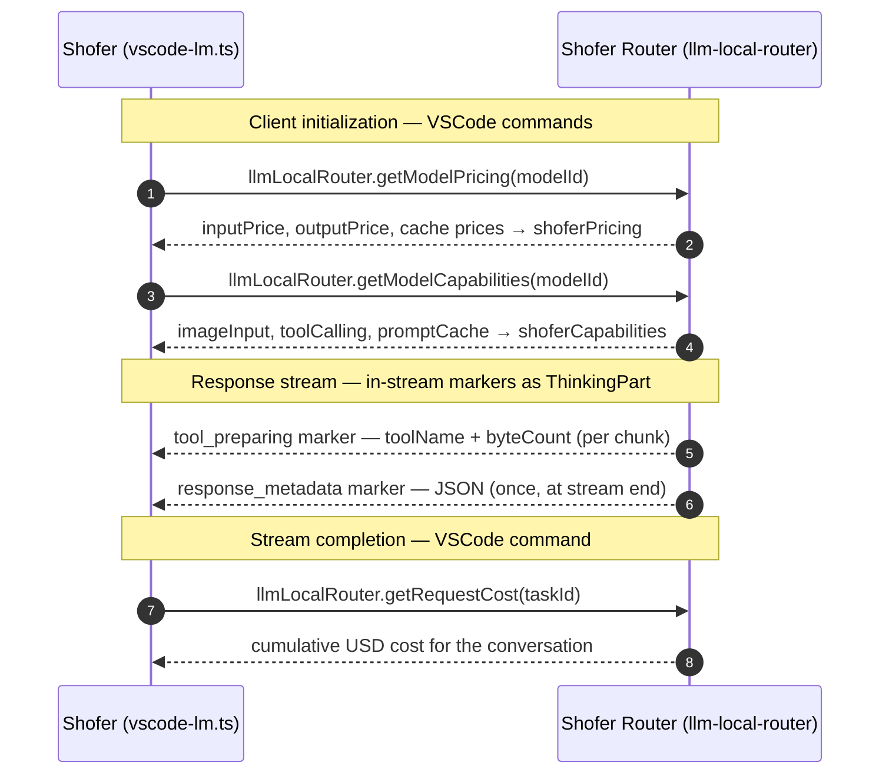
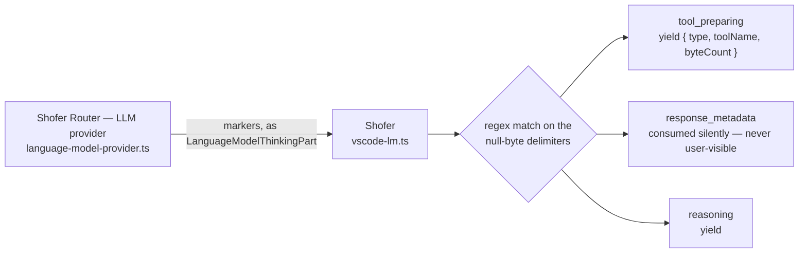

# Side-Channel Communication Between Shofer and Shofer Router

> **Status:** the Shofer Router (llm-local-router) VSCode LM provider path is
> not used in any current deployment. The code this doc describes is still
> present ([`vscode-lm.ts`](../src/api/providers/vscode-lm.ts)), so the doc is
> kept accurate rather than deleted; if that provider is ever removed, remove
> this doc with it.

Shofer (the main extension) and Shofer Router (the VSCode LM provider)
communicate through two side-channel mechanisms that operate outside the
standard VSCode Language Model API stream.



## 1. VSCode Commands (Well-Known Command Names)

Shofer queries Shofer Router through `vscode.commands.executeCommand()`.
These commands are registered by the llm-local-router extension and are the
primary mechanism for out-of-band metadata exchange.

### `llmLocalRouter.getModelPricing`

- **Direction**: Shofer → Shofer Router
- **Parameter**: `modelId: string`
- **Returns**: `{ inputPrice: number; outputPrice: number; cacheReadsPrice?: number; cacheWritesPrice?: number } | undefined`
- **Context**: Called during client initialization to retrieve pricing in USD/1M tokens for the selected model. The VSCode LM API carries no pricing fields, so this side channel is essential for cost tracking.

**Shofer usage** (in [`vscode-lm.ts`](../src/api/providers/vscode-lm.ts)):

- Called from `refreshShoferPricing()`: `vscode.commands.executeCommand("llmLocalRouter.getModelPricing", candidate)`
- Populates `VsCodeLmHandler.shoferPricing` field
- Cached per-session; warned once if command missing

### `llmLocalRouter.getModelCapabilities`

- **Direction**: Shofer → Shofer Router
- **Parameter**: `modelId: string`
- **Returns**: `{ imageInput: boolean; toolCalling: boolean; promptCache: boolean } | undefined`
- **Context**: Augments VSCode's `LanguageModelChatProviderCapabilities` (which only has `imageInput`/`toolCalling`) with `promptCache` support info.

**Shofer usage** (in [`vscode-lm.ts`](../src/api/providers/vscode-lm.ts)):

- Called from `refreshShoferCapabilities()`: `vscode.commands.executeCommand("llmLocalRouter.getModelCapabilities", candidate)`
- Populates `VsCodeLmHandler.shoferCapabilities` field

### `llmLocalRouter.getRequestCost`

- **Direction**: Shofer → Shofer Router
- **Parameter**: `taskId: string`
- **Returns**: `number | undefined` (cumulative USD cost for the conversation)
- **Context**: Called at stream completion to retrieve the running cost total.

**Shofer usage** (in [`vscode-lm.ts`](../src/api/providers/vscode-lm.ts)):

- Called from `fetchShoferRequestCost()`: `vscode.commands.executeCommand("llmLocalRouter.getRequestCost", this.taskId)`
- Called once at conversation/task completion

**Shofer Router source**: Commands registered in `activate()` in [`main.ts`](../../llm-local-router/src/main.ts).

---

## 2. In-Stream Markers (\\x00-Delimited)

Shofer Router embeds structured metadata into the response stream using
null-byte (`\\x00`) delimited markers. These are emitted as
`LanguageModelThinkingPart` objects and intercepted by Shofer's vscode-lm
provider before they reach user-visible output.

### Marker Format

All markers follow this pattern:

```
\x00<marker_type>\x00<payload>\x00
```

### `tool_preparing`

- **Type**: `tool_preparing\x00<toolName>\x00<byteCount>`
- **Example**: `\x00tool_preparing\x00read_file\x00420\x00`
- **Purpose**: Informs Shofer that a tool call with `toolName` is accumulating arguments (currently `byteCount` bytes received). Shofer displays an inline progress indicator.
- **Origin**: [`language-model-provider.ts`](../../llm-local-router/src/language-model-provider.ts) — emitted per-chunk during tool call streaming
- **Consumer**: [`vscode-lm.ts`](../src/api/providers/vscode-lm.ts) — parsed in `createMessage()`, yields `{ type: "tool_preparing", toolName, byteCount }`

### `response_metadata`

- **Type**: `response_metadata\x00<json>`
- **Example**: `\x00response_metadata\x00{"model":"shofer/code","actualModel":"deepseek-v4-pro","ttfbMs":123,"ttlbMs":456,"promptTokens":1000,"completionTokens":500,"costUsd":0.001234,"attempts":1}\x00`
- **Purpose**: Carries per-request metadata (actual model used, latency, tokens, cost, failover info) back to Shofer at stream end.
- **Origin**: [`language-model-provider.ts`](../../llm-local-router/src/language-model-provider.ts) — emitted once at stream end (success or error)
- **Consumer**: [`vscode-lm.ts`](../src/api/providers/vscode-lm.ts) — detected and consumed in `createMessage()`; NOT yielded as a user-visible chunk

### Marker Lifecycle



---

## Usage Summary

| Mechanism                             | When           | What                                |
| ------------------------------------- | -------------- | ----------------------------------- |
| `llmLocalRouter.getModelPricing`      | Client init    | Model pricing (USD/1M tokens)       |
| `llmLocalRouter.getModelCapabilities` | Client init    | Model capability flags              |
| `llmLocalRouter.getRequestCost`       | Stream end     | Cumulative conversation cost        |
| `tool_preparing` marker               | Per-tool-chunk | Tool call progress indicator        |
| `response_metadata` marker            | Stream end     | Actual model, latency, cost, tokens |
