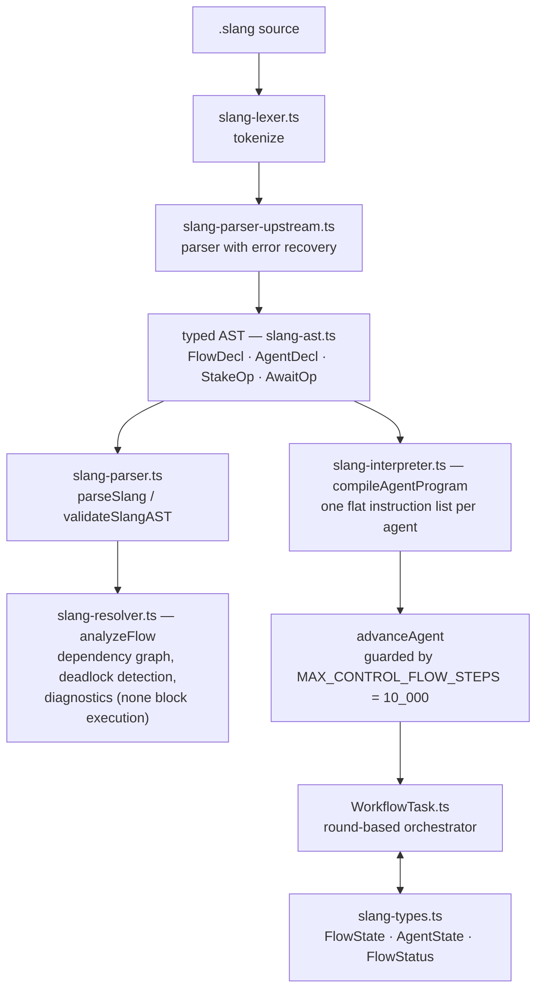
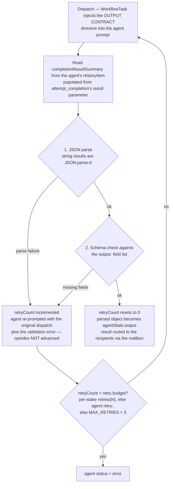
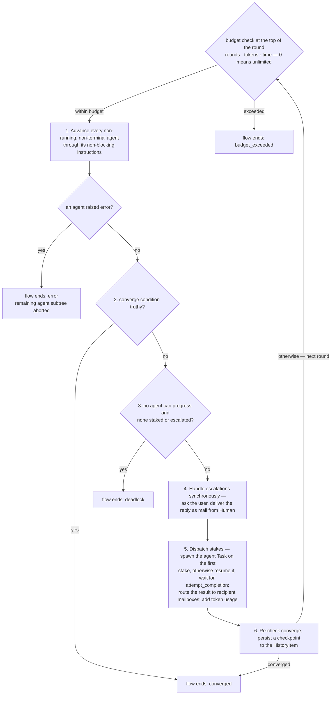
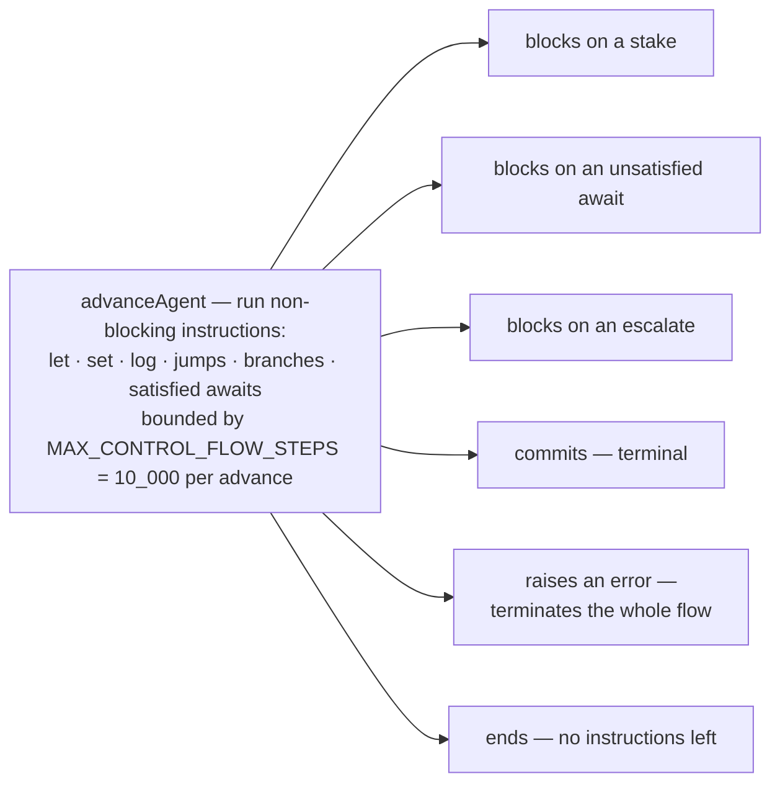

# Slang Language Specification (Shofer)

Reference for authoring Shofer workflow `.slang` files. This documents the
**Shofer implementation** — the vendored parser, static resolver, and the
`WorkflowTask` interpreter — not the upstream `@riktar/slang` reference language.
Where the two differ, this document wins.

> **Source of truth**
>
> - Lexer: [`packages/core/src/workflow/slang-lexer.ts`](../packages/core/src/workflow/slang-lexer.ts)
> - Parser: [`packages/core/src/workflow/slang-parser-upstream.ts`](../packages/core/src/workflow/slang-parser-upstream.ts)
> - AST types: [`packages/core/src/workflow/slang-ast.ts`](../packages/core/src/workflow/slang-ast.ts)
> - Public API: [`packages/core/src/workflow/slang-parser.ts`](../packages/core/src/workflow/slang-parser.ts) (`parseSlang`, `validateSlangAST`)
> - Static analysis: [`packages/core/src/workflow/slang-resolver.ts`](../packages/core/src/workflow/slang-resolver.ts)
> - Interpreter VM (compiler + `advanceAgent` + `MAX_CONTROL_FLOW_STEPS`): [`packages/core/src/workflow/slang-interpreter.ts`](../packages/core/src/workflow/slang-interpreter.ts)
> - Runtime types (`FlowState`, `AgentState`, `FlowStatus`): [`packages/core/src/workflow/slang-types.ts`](../packages/core/src/workflow/slang-types.ts)
> - Round-based orchestrator: [`src/core/workflow/WorkflowTask.ts`](../src/core/workflow/WorkflowTask.ts)
> - Worked examples: `.shofer/workflows/` (`hello-world.slang`, `test-slang-basics.slang`)

How those pieces chain from source text to a running flow:



## Table of Contents

1. [File Structure](#file-structure)
2. [Lexical Elements](#lexical-elements)
3. [Reserved Keywords](#reserved-keywords)
4. [Flow Declaration](#flow-declaration)
    - [Using `param description` Instead of Initial `escalate`](#using-param-description-instead-of-initial-escalate)
5. [Agent Declaration](#agent-declaration)
6. [Operations](#operations)
7. [Control Flow](#control-flow)
8. [Expressions](#expressions)
9. [Recipients & Sources](#recipients--sources)
10. [Built-in State](#built-in-state)
11. [Flow Constraints](#flow-constraints)
12. [Structured Output Contracts](#structured-output-contracts)
13. [Static Analysis (Warnings)](#static-analysis-warnings)
14. [Runtime Semantics](#runtime-semantics)
15. [Parsed-but-Not-Executed Constructs](#parsed-but-not-executed-constructs)
16. [Common Pitfalls](#common-pitfalls)
17. [Complete Grammar (EBNF)](#complete-grammar-ebnf)

---

## File Structure

A `.slang` file contains exactly one top-level construct: a `flow`. The flow body
holds (in any order) optional `title`/`description`/`icon` meta fields,
an optional `import`, one or more `agent` declarations, optional `param` metadata
blocks, and the flow constraints (`converge`, `budget`) plus optional
`deliver`/`expect` statements.

```slang
flow "my-flow" (param: "string") {
  title: "My Flow"
  description: "A simple example workflow."
  icon: "rocket"

  import "shared/common.slang" as common   -- optional, inside the flow body

  agent Worker {
    mode: "code"
    role: "Does the work."
    stake do_it(input: param) -> @out
    commit
  }

  converge when: @Worker.committed
  budget: rounds(10), tokens(50000)
}
```

> **Important:** `import` is a **flow-body item** — it must appear _inside_ the
> `flow { ... }` block, not before it. There is no top-level/module scope above
> the flow.

---

## Lexical Elements

| Element    | Form                                                 | Notes                                                                                               |
| ---------- | ---------------------------------------------------- | --------------------------------------------------------------------------------------------------- |
| Comment    | `-- text to end of line`                             | Single-line only. No block comments.                                                                |
| String     | `"double quoted"`                                    | The only string form. Used for params, roles, args, etc. Supports `${…}` interpolation — see below. |
| Number     | `42`, `3.14`                                         | Integer or float.                                                                                   |
| Boolean    | `true`, `false`                                      | Keywords.                                                                                           |
| Identifier | `myVar`, `do_work`, `Agent1`                         | Agent names, bindings, function names, variables.                                                   |
| Agent ref  | `@Architect`, `@out`, `@all`, `@any`, `@*`, `@Human` | `@` prefix. `@*` is a wildcard agent ref for `await` sources.                                       |
| Arrow      | `->`                                                 | Stake recipient.                                                                                    |
| Back-arrow | `<-`                                                 | Await source.                                                                                       |

There are **no arithmetic operators** (`+`, `-`, `*`, `/`). Counters and loop
state are expressed with boolean flags and the built-in `round` / `committed_count`.

### String Interpolation

Any string may contain `${…}` placeholders. Each is resolved at evaluation time
against the **same scope as an expression** — the agent's local bindings, then the
flow params, then the read-only built-ins (`round`, `committed_count`,
`all_committed`) — and supports dot-access into object values:

```slang
flow "deploy" (design_dir: "string", design_filename: "string") {
  param design_dir { default: "plans" }
  param design_filename { default: "feature-design.md" }

  agent Architect {
    role: "Write the design to EXACTLY ${design_dir}/${design_filename}."   -- in role
    stake build(
      instructions: "Implement ${design_dir}/${design_filename}."           -- in stake args
    ) -> @Dev
    escalate @Human reason: "Review ${design_dir}/${design_filename}."       -- in escalate reason
    await answers <- @Human
    log "region = ${answers.region}"                                        -- dot-access on a bound value
  }
}
```

| Property       | Detail                                                                                                         |
| -------------- | -------------------------------------------------------------------------------------------------------------- |
| Syntax         | `${name}` or `${name.field.…}` (identifier + optional dot-access chain). No nested braces, no operators.       |
| Scope          | agent bindings → flow params → built-ins (identical to bare-identifier resolution).                            |
| Coercion       | scalars inserted as text; objects/arrays are JSON-stringified.                                                 |
| Unresolved     | a placeholder that resolves to nothing is left **verbatim** (e.g. a typo shows as `${oops}` in the prompt).    |
| Where it works | stake/call args (via expression evaluation), agent `role:`, and `escalate reason:`. Plain strings are a no-op. |

---

## Reserved Keywords

These cannot be used as identifiers (agent names, bindings, function names,
variables). Using one as a `stake func(...)` name is a common parse error.

```
flow  agent  stake  await  commit  escalate  log  error  import  as
when  if  else  otherwise  converge  budget
role  model  tools  retry  output
tokens  rounds  time  count  reason
let  set  repeat  until  deliver  expect
contains  true  false  title  description  icon  param
```

> Keywords _are_ allowed as **dot-access property names** (e.g.
> `result.count` parses), because the parser accepts keyword tokens after a `.`.

---

## Flow Declaration

```slang
flow "<name>" (<param>: "<type>", ...) {
  title: "<UI title>"
  description: "<markdown description>"
  icon: "<icon key>"

  <body>
}
```

- `<name>` is a **string literal** (quoted).
- Parameters are optional. Each is `name: "type"` where `type` is an advisory
  annotation (`"string"` | `"number"` | `"boolean"`) — **not enforced at runtime**.
- Parameters are referenced by bare identifier inside agent bodies (e.g. `feature`).

### Optional Flow Meta Fields

These appear **after** the opening `{` but **before** any `agent`, `import`, `converge`, or `budget` statements. All are optional strings.

| Field         | Syntax                 | Description                                                                                                         |
| ------------- | ---------------------- | ------------------------------------------------------------------------------------------------------------------- |
| `title`       | `title: "My Workflow"` | Human-readable UI title. Distinct from the machine name.                                                            |
| `description` | `description: "..."`   | Markdown description of the workflow. Rendered in the UI. Can be multiline (use `\n` escapes in the quoted string). |
| `icon`        | `icon: "rocket"`       | Icon key for the workflow (e.g. `"rocket"`, `"gear"`, `"search"`). Rendered next to the title in the UI.            |

```slang
flow "feature-test" (topic: "string", threshold: "number", verbose: "boolean") {
  title: "Feature Tester"
  description: "Tests every Slang feature:\nstake routing, await, escalate, repeat-until,\nwhen-otherwise, let/set, converge, budget,\noutput schemas, and multi-agent coordination."
  icon: "beaker"

  ...
}
```

### Param Metadata

Each flow input parameter can have an optional metadata block inside the flow body.
Besides a description, the block controls **which input widget** the workflow's
param-collection form renders for that parameter:

```slang
param <name> {
  description: "<markdown description>"   -- shown beneath the label
  options: ["a", "b", "c"]               -- fixed set of allowed values
  widget: "dropdown" | "radio" | "checkbox"  -- how to present `options`
  min: <number>                          -- slider lower bound (number params)
  max: <number>                          -- slider upper bound (number params)
  step: <number>                         -- slider step (default 1)
  default: <literal>                     -- value used when left blank
}
```

| Field         | Applies to            | Effect on the rendered widget                                                                                     |
| ------------- | --------------------- | ----------------------------------------------------------------------------------------------------------------- |
| `description` | any                   | Markdown description shown beneath the field label.                                                               |
| `options`     | string                | Fixed set of allowed values. Renders a **dropdown** (single-select) by default.                                   |
| `widget`      | params with `options` | `"dropdown"` (default), `"radio"` (single-select bullets), or `"checkbox"` (**multi-select**; value is an array). |
| `min` + `max` | number                | Renders a **slider** (range) instead of a number box. `step` tunes granularity (default `1`).                     |
| `default`     | any                   | Pre-fills the control; used when the field is left blank. Use a list literal for a multi-select default.          |

**Widget resolution** (when no `param` block overrides it):

| Declared type | `param` metadata | Rendered as                                 | Submitted value |
| ------------- | ---------------- | ------------------------------------------- | --------------- |
| `"string"`    | _none_           | **multiline, resizable textarea**           | string          |
| `"string"`    | `options`        | dropdown (or radio / checkbox via `widget`) | string / array  |
| `"number"`    | _none_           | number input                                | number          |
| `"number"`    | `min` + `max`    | **slider**                                  | number          |
| `"boolean"`   | _none_           | single checkbox                             | boolean         |

The `options` / `widget` / `min` / `max` / `step` annotations are advisory: they
only affect presentation and are not enforced at the language level.

```slang
flow "report" (format: "string", sections: "string", verbosity: "number", notes: "string") {
  title: "Report Generator"

  param format {
    description: "Output format."
    options: ["pdf", "html", "markdown"]   -- dropdown
    default: "markdown"
  }
  param sections {
    description: "Sections to include."
    options: ["summary", "details", "appendix"]
    widget: "checkbox"                      -- multi-select; value is an array
  }
  param verbosity {
    description: "Detail level (0–5)."
    min: 0
    max: 5
    step: 1                                 -- slider
    default: 2
  }
  -- notes (plain string, no options) → multiline resizable textarea

  agent Generator {
    ...
  }
}
```

### Using `param description` Instead of Initial `escalate`

When a workflow needs the user to provide a detailed input (e.g., a bug report),
annotate the flow parameter with a descriptive `param { description: "…" }` block
instead of wasting a round-trip with `escalate @Human reason: "…"`. The
param-collection form renders the `description` as markdown beneath the field label,
guiding the user to fill it in before the flow starts.

See [`plugins/builtin-config/workflows/debug.slang`](../plugins/builtin-config/workflows/debug.slang) for the canonical example.

---

## Agent Declaration

```slang
agent <Name> {
  mode: "<slug>"          -- Shofer mode slug (Shofer extension)
  api_configuration: "<profile>"  -- optional: API-config profile by name (alias: model:)
  role: "<description>"   -- optional: system-prompt role definition
  tools: [group_a, ...]   -- optional: ToolGroup names, comma-separated
  retry: <number>         -- optional: max LLM-call retries
  peers: [@Agent1, ...]   -- optional: declared direct-message peers (see below)
  context: {              -- optional: controls what project context the agent receives
    include_agents_md: <boolean>   -- inject AGENTS.md rules into the agent's system prompt
  }

  <operations...>
}
```

| Meta field          | Required | Wire status | Value form              | Notes                                                                                                                                                                                                                                                                                                                |
| ------------------- | -------- | ----------- | ----------------------- | -------------------------------------------------------------------------------------------------------------------------------------------------------------------------------------------------------------------------------------------------------------------------------------------------------------------- |
| `mode`              | no\*     | ✅ wired    | string                  | Shofer mode slug. Shofer extension (`mode: "code"`). Defaults to `"code"` at spawn if omitted.                                                                                                                                                                                                                       |
| `tools`             | no       | ✅ wired    | list of ToolGroup names | **Only valid values are the 9 ToolGroup names:** `read`, `write`, `execute`, `browser`, `mcp`, `mode`, `subtasks`, `questions`, `uncategorized`. Restricts the spawned Task to these groups — see [Per-agent `tools:` restriction](#per-agent-tools-restriction). Bare identifiers, **not quoted.**                  |
| `api_configuration` | no       | ✅ wired    | string                  | Selects the agent Task's API-configuration **profile by name** (per-task only; never activates it globally). Unknown name → falls back to the global profile. Threaded as `createTask({ initialApiConfigName })`. Stored on `AgentMeta.apiConfiguration`. **Deprecated alias:** `model:` parses into the same field. |
| `role`              | no       | ✅ wired    | string                  | Injected into the agent Task's system prompt as `# Agent Role` (layered on top of the mode's `roleDefinition` for that task), and surfaced in peer resource descriptions. Threaded as `createTask({ agentRole })`. `${…}` placeholders resolve against flow params + the agent's bindings.                           |
| `retry`             | no       | ✅ wired    | number                  | Per-agent **default** stake retry budget. Precedence: a per-stake `retries(N)` clause wins, else this agent `retry:`, else the global `MAX_RETRIES` (3). Bounds re-dispatches on output-contract / `timeout(N)` failures — see [`stake`](#stake) `retries(N)`.                                                       |
| `context`           | no       | ✅ wired    | block                   | `context { … }` (a leading colon — `context: { … }` — is also accepted). Boolean toggles for system-prompt components. Threaded as `createTask({ agentContext })`. See [`context { ... }`](#context--) for the full key table. Unknown keys are ignored (forward-compatible).                                        |

\* `mode` is technically optional in the grammar but will default to `"code"` at spawn.

`role` is **layered on top of** the mode's `roleDefinition` (prepended as `# Agent Role`), not a replacement — the mode's base persona still applies.

### Per-agent `tools:` restriction

`tools:` narrows the spawned agent Task to the listed [ToolGroup](#10-tool-groups-categories)
names. It is threaded from the AST through
[`WorkflowTask.spawnAgentTask()`](../src/core/workflow/WorkflowTask.ts) →
`createTask({ agentToolGroups })` → `Task` →
[`build-tools.ts`](../packages/core/src/task/build-tools.ts) `restrictToolsToDeclaredGroups()`,
which is applied **after** the mode's own tool filtering. Semantics:

- **Restriction only — never a grant.** The declared groups are _intersected_
  with the mode's tools; an agent can never gain a tool its mode denies. (So
  `tools: [write]` on a `reviewer`-mode agent still yields no write tools.)
- **`ALWAYS_AVAILABLE_TOOLS` are always retained** (`attempt_completion`,
  `update_todo_list`, `send_message_to_task`, `set_task_title`, …) regardless of
  the declared groups, so a restricted agent can still complete stakes and
  coordinate. This is what makes `tools: []` a _pure coordinator_ (only the
  always-available set) rather than an unusable agent.
- **Absent vs empty:** an **absent** `tools:` field applies no restriction
  (mode tools only); an explicit **`tools: []`** restricts to always-available.
- **Unknown group names fail closed** (silently dropped) — `tools: [reed]`
  restricts to always-available only. (A static-analysis warning for unknown
  group names is a planned addition.)
- Group→category mapping: native tools resolve via `TOOL_GROUPS`; MCP tools
  belong to the `mcp` group; native custom tools to `write`; private LM tools
  carry their own declared group.

**Typical use — lock an orchestrator to coordination.** An `architect`-mode
orchestrator that should delegate (not implement) declares e.g.
`tools: [read, write, questions]` (or `tools: [questions]` for a pure
coordinator): omitting `mode` removes `switch_mode` (it cannot escape into code
mode) and omitting `subtasks` removes `new_task` (it cannot spawn its own
children — the workflow spawns the agents). See `implement-feature.slang` /
`debug.slang`.

### `peers:` — Declared Direct-Message Peers

`peers:` declares which other agents this agent may message **directly** via
`send_message_to_task`, bypassing the executor and mailbox. It is the explicit
grant that least-privilege peer scoping (default-deny) requires.

```slang
agent Worker {
  peers: [@Reviewer, @Coordinator]
  stake do_work(...) -> @Reviewer
  commit
}
```

| Property                    | Detail                                                                                                                                                                                                                                             |
| --------------------------- | -------------------------------------------------------------------------------------------------------------------------------------------------------------------------------------------------------------------------------------------------- |
| Value form                  | Comma-separated list of bare `@AgentRef` identifiers inside `[…]`.                                                                                                                                                                                 |
| Default                     | Absent ⇒ no sibling grant (parent + own children only, per least-privilege).                                                                                                                                                                       |
| Wildcards                   | `@out`, `@all`, `@any`, `@Human`, `*` are **not** valid in `peers:`. The resolver emits an error on wildcard peers.                                                                                                                                |
| Unknown refs                | The resolver emits an error for `@Name` refs that don't resolve to a declared agent.                                                                                                                                                               |
| Back-fill                   | If peer B is spawned after agent A, A's `knownPeers` is updated at B's spawn time.                                                                                                                                                                 |
| Relationship to stake/await | `peers:` governs only the **direct-message** (`send_message_to_task`) permission. The executor-mediated stake/await plane (mailbox) is unaffected — an agent may declare a `peers:` grant for an agent it also stakes to, and both planes coexist. |

### `context { ... }`

Controls ambient project context injected into the agent Task's system prompt
via a set of boolean toggles. Written as a block — `context { include_agents_md: false }` —
and a leading colon (`context: { ... }`) is also accepted. Each key gates a
specific system-prompt component; absent keys inherit the global default.

| Key                       | Default | Effect                                                                                |
| ------------------------- | ------- | ------------------------------------------------------------------------------------- |
| `include_agents_md`       | `true`  | Inject AGENTS.md / AGENT.md rules (maps to `useAgentRules`).                          |
| `include_subfolder_rules` | `false` | Recursively scan `.shofer/rules/` in subdirectories (maps to `enableSubfolderRules`). |
| `include_mode_rules`      | `true`  | Load `.shofer/rules-{mode}/` rules.                                                   |
| `include_user_rules`      | `true`  | Load `.shofer/rules/` rules (non-mode).                                               |
| `include_skills`          | `true`  | Include the skills listing section in the prompt.                                     |
| `require_todos`           | `false` | Enforce TODO list in the prompt.                                                      |
| `include_system_info`     | `true`  | Include OS/shell/workspace info section.                                              |
| `include_mcp`             | `true`  | Include MCP tools in the capabilities section.                                        |

Unknown keys inside the block are silently ignored (forward-compatible).

By convention, meta fields appear **before** the operations. Note this is **not
enforced** by the parser — the agent-body loop in
[`slang-parser-upstream.ts`](../packages/core/src/workflow/slang-parser-upstream.ts)
accepts meta fields and operations interleaved in any order — but writing them
first is strongly recommended for readability.

---

## Operations

The agent body is a sequence of operations. The three core primitives:

| Primitive | Syntax                                                      | Semantics                                                             |
| --------- | ----------------------------------------------------------- | --------------------------------------------------------------------- |
| `stake`   | `stake func(args) [-> @R, ...] [if cond] [output: { ... }]` | Run a unit of work; optionally route the result to recipients.        |
| `await`   | `await <binding> <- @Source [, @Source2 ...]`               | Block until a matching message arrives; bind it to `<binding>`.       |
| `commit`  | `commit [value] [if cond]`                                  | Mark this agent committed (terminal). Optionally carry a value/guard. |

### `stake`

```slang
stake plan(goal: topic, depth: 3, urgent: true, labels: ["a", "b"]) -> @Worker if any_ok
  output: { plan: "string", confidence: "number" }
  timeout(120) retries(2)
```

Ordering of the optional clauses is fixed: **call → recipients (`->`) →
condition (`if`) → `output:` → `timeout(N)` / `retries(N)`**.

- **Arguments** may be named (`goal: topic`) or positional (`topic`), mixed, and
  may be any expression (string/number/bool/ident/list/agent-ref/dot-access).
- **Recipients** after `->` are comma-separated `@Agent` / `@out` / `@all`.
- **Condition** `if <expr>` gates whether the stake runs.
- **`output:`** declares the expected JSON shape of the result — see
  [Structured Output Contracts](#structured-output-contracts).
- **`timeout(N)`** (optional) — per-stake wall-clock cap in **seconds**. If the
  agent doesn't produce a result within `N` seconds of being dispatched, the
  attempt is abandoned and counts as a failed try. **Absent ⇒ no per-stake cap:**
  a running agent is assumed to be making progress and is waited for, bounded
  only by the flow's `time(N)` budget (see [Runtime Semantics](#runtime-semantics)).
  `timeout` / `retries` are contextual identifiers (not reserved keywords); both
  take a parenthesized number and may appear in either order.
- **`retries(N)`** (optional) — max **re-attempts** for this stake after a failed
  try (an output-contract validation failure **or** a `timeout(N)` expiry). The
  agent is re-dispatched up to `N` times; on the `N+1`-th failure it is marked
  `error`. **Absent ⇒ the default `MAX_RETRIES` (3).** `retries(0)` fails on the
  first failed try.

> There is **no** `let x = stake ...` form. A stake is an _operation_, not an
> expression, so it cannot appear on the right-hand side of `let`/`set`. To use a
> staked result later, route it (`-> @out` or to a peer) or `await` it back.

### `await`

```slang
await findings <- @Codebase
await kickoff  <- @any
```

- Binds the incoming message payload to `<binding>` in the agent's local scope.
- Multiple sources may be listed (`<- @A, @B`), satisfied by the first match.
- `@any` / `*` accept a message from any sender.
- `@Human` is the escalation reply source (see `escalate`).

### `commit`

```slang
commit                                  -- bare
commit "worker-complete"                -- carry a value (becomes @Agent.output)
commit if committed_count >= 1          -- guarded
```

A committed agent is terminal and stops participating in rounds. When `commit`
carries a value, that value is **surfaced to the WorkflowTask view** as a
`✅ <Agent> committed: <value>` line (the same channel `log` and `error` use), so
the human sees what each agent concluded with. The value is rendered verbatim if
it is a string, otherwise JSON-encoded.

### `escalate`

```slang
escalate @Human reason: "Please approve the design." if verbose
await guidance <- @Human
```

- Pauses the flow and asks the **user** (via the WorkflowTask's `ask`).
- `reason:` (optional) is the prompt text (the question) shown to the user.
- `if <cond>` (optional) gates the escalation.
- The user's reply is delivered as a message **from `@Human`**, consumed by a
  following `await ... <- @Human`. The agent itself is unaware it was escalated.

By default the user answers with free text. Two optional clauses turn the
escalation into a richer prompt — they map to the same `ask_followup_question`
machinery the launcher's flow-param form uses:

**`choices:` — multiple-choice (no typing).** A fixed answer set rendered as
clickable buttons; the chosen text is delivered exactly like a free-text reply.

```slang
escalate @Human reason: "Workflow complete. Approve the result?" choices: ["ACK", "Reject"]
await verdict <- @Human          -- verdict is the chosen string, e.g. "ACK"
```

**`form:` — a typed input form (full widget set).** Each field is
`name: "type" [{ … }]` using the same widget metadata as flow params
(`widget` `"dropdown"`/`"radio"`/`"checkbox"`, `options`, `min`/`max`/`step`,
`default`, `description`). A `number` field with `min`+`max` renders a slider; a
plain `string` a textarea; a `boolean` a checkbox.

```slang
escalate @Human reason: "Tune the deploy:" form: {
  region:   "string" { widget: "dropdown", options: ["us", "eu"], default: "us" }
  replicas: "number" { min: 1, max: 10 }      -- slider (inferred from min+max)
  notify:   "boolean"
}
await answers <- @Human
```

The form's answers are delivered as a **single object**, each field coerced to
its declared type, so they are usable in slang via DotAccess — e.g.
`answers.region` (string), `answers.replicas` (number, so `if answers.replicas > 5`),
`answers.notify` (boolean). Passing the whole `answers` object into an agent
prompt JSON-stringifies it. `form` takes precedence over `choices` when both are
given. Fields may be separated by newlines or commas.

### `log`

```slang
log "starting the analysis pass"        -- emit a status line to the view
log details if verbose                  -- guarded
log                                      -- bare (no message)
```

- Emits a message to the **WorkflowTask view** (the chat stream) as a
  `📝 <Agent>: <message>` line. Useful for narrating an agent's intent or
  progress to the human watching the flow.
- **Non-blocking and non-terminal:** the agent continues straight to its next
  operation in the same advance — `log` never spawns the agent Task or waits.
- The optional message is any expression; rendered verbatim if a string,
  otherwise JSON-encoded. `if <cond>` (optional) gates the emit.

### `error`

```slang
error "design rejected — cannot proceed"   -- terminate the flow with a message
error reason if blocked                     -- guarded
```

- Emits a `🛑 <Agent> raised an error: <message>` line to the WorkflowTask view
  and **prematurely terminates the entire flow** with status `error` — no further
  rounds run, and the remaining agent subtree is aborted.
- This is the explicit failure escape hatch: an agent that detects an
  unrecoverable condition can stop the whole workflow rather than deadlocking or
  burning the round budget.
- The optional message is any expression (verbatim if a string, else
  JSON-encoded). `if <cond>` (optional) gates the termination — a guarded
  `error` whose condition is false is skipped and the agent continues.

---

## Control Flow

| Construct      | Syntax                                  | Notes                                                   |
| -------------- | --------------------------------------- | ------------------------------------------------------- |
| `when`         | `when <expr> { ... }`                   | Runs the body when the condition is truthy.             |
| `when`/else    | `when <expr> { ... } otherwise { ... }` | The else branch keyword is **`otherwise`**, not `else`. |
| `repeat until` | `repeat until <expr> { ... }`           | Loops until the condition is truthy.                    |
| `let`          | `let <name> = <expr>`                   | Declare an agent-local variable.                        |
| `set`          | `set <name> = <expr>`                   | Reassign an existing variable.                          |

> **`otherwise`, not `else`.** Although `else` is a reserved keyword, the
> `when`-block parser only recognizes `otherwise` for the else branch. Writing
> `when c { } else { }` is a parse error.

```slang
let done = false
repeat until done {
  await signal <- @Worker
  when signal contains "DONE" {
    set done = true
  } otherwise {
    stake nudge(note: "keep going") -> @Worker
  }
}
```

The interpreter compiles `when`/`repeat` into conditional/unconditional jumps and
guards loop execution with `MAX_CONTROL_FLOW_STEPS = 10_000` per agent advance.

---

## Expressions

| Category    | Examples                                                 |
| ----------- | -------------------------------------------------------- | --- | --- |
| Literals    | `42`, `3.14`, `"text"`, `true`, `false`                  |
| Identifier  | `topic`, `done` (params, bindings, local variables)      |
| Agent ref   | `@Architect`                                             |
| List        | `["a", "b", "c"]`                                        |
| Dot access  | `@Agent.committed`, `result.confidence`, `verdict.notes` |
| Parenthesis | `(a                                                      |     | b)` |

### Operators (no arithmetic)

| Operator   | Meaning                                             |
| ---------- | --------------------------------------------------- |
| `==`       | Equality (strict).                                  |
| `!=`       | Inequality.                                         |
| `>` `>=`   | Greater-than / greater-or-equal (numeric coercion). |
| `<` `<=`   | Less-than / less-or-equal (numeric coercion).       |
| `&&`       | Logical AND (short-circuit on truthiness).          |
| `\|\|`     | Logical OR (short-circuit on truthiness).           |
| `contains` | Substring (string) / membership (list).             |

Precedence (lowest → highest): `||` → `&&` → comparison (`== != > >= < <=`) →
`contains` → dot-access → primary.

---

## Recipients & Sources

| Token        | Valid in         | Meaning                                              |
| ------------ | ---------------- | ---------------------------------------------------- |
| `@AgentName` | stake / await    | A specific agent.                                    |
| `@out`       | stake recipient  | Flow output — becomes part of the final result.      |
| `@all`       | stake recipient  | Broadcast to every other agent.                      |
| `@any`       | await source     | Accept a message from any single sender.             |
| `*`          | await source     | Wildcard — accept from anyone.                       |
| `@Human`     | escalate / await | The user, via `escalate`; reply consumed by `await`. |

---

## Built-in State

Accessible inside any expression (`when`, `converge`, `commit if`, etc.):

| Expression         | Type    | Description                                                 |
| ------------------ | ------- | ----------------------------------------------------------- |
| `@Agent.output`    | any     | The agent's last staked/committed output.                   |
| `@Agent.committed` | boolean | Whether the agent has committed.                            |
| `@Agent.status`    | string  | `idle` \| `running` \| `committed` \| `blocked` \| `error`. |
| `committed_count`  | number  | How many agents have committed.                             |
| `all_committed`    | boolean | True when **all** agents have committed.                    |
| `round`            | number  | Current round number (starts at 0).                         |

Bindings created by `await`/`let`/`set` and flow parameters are also referenceable
by bare identifier. Dot-access on a structured binding (e.g. `result.confidence`)
reads a field of the parsed JSON output.

---

## Flow Constraints

```slang
converge when: <expr>
budget: tokens(N), rounds(N) [, time(N)]
```

### `converge`

The flow terminates **successfully** when the condition becomes truthy. Common forms:

| Form                                  | Meaning                       |
| ------------------------------------- | ----------------------------- |
| `converge when: all_committed`        | Every agent has committed.    |
| `converge when: committed_count >= 1` | At least one agent committed. |
| `converge when: @Architect.committed` | A specific agent committed.   |

### `budget`

| Item        | Enforced? | Meaning                                          | Default         |
| ----------- | --------- | ------------------------------------------------ | --------------- |
| `tokens(N)` | ✅ yes    | Max aggregate tokens across all agent LLM calls. | `0` (unlimited) |
| `rounds(N)` | ✅ yes    | Max execution rounds.                            | `0` (unlimited) |
| `time(N)`   | ✅ yes    | Hard wall-clock seconds for the entire flow.     | `0` (unlimited) |

If no `budget` statement is present, all three limits (`tokens`, `rounds`,
`time`) default to **unlimited** (0). Exceeding an enforced budget terminates the
flow with `budget_exceeded`.

Budget values may be numeric literals or references to flow parameters of type
`"number"` (the value is resolved at workflow start from the user's input):

```slang
flow "my-flow" (max_tokens: "number", max_rounds: "number") {
  budget: tokens(max_tokens), rounds(max_rounds)
  ...
}
```

Mixed literals and parameter references are allowed:

```slang
budget: tokens(token_limit), rounds(10), time(300)
```

---

## `call` — deterministic steps

```slang
agent Pipeline {
  call fetch_diff(mr: mr_id) -> @Reviewer
  stake review(diff: diff) -> @out
  commit
}
```

`stake` dispatches a prompt to an **LLM agent**. `call` dispatches to a
**registered function** — developer-authored, vetted code selected by name from
a fixed registry. Both ride the same dispatcher seam (args in, result out) and
route results identically; the difference is what runs.

**An agent composes `call` functions; it cannot define one.** Adding a function
is a developer writing, registering and deploying it. So a `call` runs _trusted
code over untrusted arguments_, which is the inverse of running agent-authored
code — and it is why real computation belongs in a `call` rather than in Slang's
deliberately anemic expression layer (no arithmetic, scalar-only contracts).

**Placement is the trust decision.** A pure or platform transform with no
project data can run on the trusted worker; anything touching a project's data,
credentials or filesystem runs on that project's own contained worker. Same
grammar either way — the registry decides.

`call` **blocks**, exactly as `stake` does. It is tempting to imagine the VM
could simply evaluate a "deterministic function", but the work happens outside
the interpreter by design: that is where the placement decision lives.

`call` is a **contextual** keyword (`call ident(`), so a spec already using
`call` as a name keeps working.

## Capability Routing — `requires:`

```slang
agent Screenshotter {
  requires: browser and (gpu or highmem)
  role: "Captures pages."
  stake grab(url: target) -> @out
}
```

Some workers are special — a GPU box, a browser-enabled sandbox, a host holding
a bespoke tool — and an agent needing that capability must land on such a worker
rather than any worker. `requires:` is a boolean expression over worker
capability **tags**.

- **`and`, `or`, parentheses. No negation.** Matching on the ABSENCE of a tag
  would turn an advisory capability claim into a security signal — and a
  workspace declares its own tags. It also goes stale the moment a worker gains
  one. The algebra is allow-only, like every other selector on the platform.
  `not` is refused at parse time with that reason.
- **`requires: [a, b]`** is sugar for `a and b`. An EMPTY list is refused: an
  empty conjunction is vacuously true, so `requires: []` would mean "runs
  anywhere" — the opposite of what writing an empty requirement list looks like
  it means. Omit the clause instead.
- **Atoms are `[A-Za-z0-9_-]` plus the globs `?` and `*`**, in `:`-delimited
  segments: `tool:screenshot`, `tool:*`, `os:win*`, `gpu-a?`. `?` is exactly one
  character and `*` any run WITHIN a segment — neither crosses a `:`, matching
  the bus's address rule, so one containment model covers both. There is no
  `**`: whole-segment-spanning wildcards belong to the segmented address domain,
  and admitting one here would blur two vocabularies kept distinct on purpose.
  The charset is the security boundary, validated before an atom is ever matched.
- **Agent-level, not per-stake.** A stake dispatches to an agent SESSION pinned
  to one worker for its lifetime — output-contract reprompts resume that same
  session — so the requirement is naturally per-agent.

### Canonical form, and why it matters

An expression canonicalises to **sorted DNF** and hashes to a stable short
string. That is not tidiness: under the Temporal backend the hash names a task
queue, and an activity goes to exactly one queue — there is no "post to either".
So `a or b` cannot be resolved by the sender, and the resolution is inverted:
**workers** evaluate every active expression against their own tags and poll the
queues they satisfy.

This only works if the same requirement always produces the same queue.
`browser and (gpu or highmem)` and `(browser and gpu) or (browser and highmem)`
are the same requirement, and canonicalisation makes them the same string —
otherwise they would name two queues, and one of them would have no worker
polling it: a pipeline that hangs with no error. Canonicalisation therefore
includes **absorption** (`a or (a and b)` is just `a`) as well as sorting and
deduplication.

The canonical form is `" and "`-joined atoms in `" or "`-joined terms, hashed as
the first 64 bits of its SHA-256. That is a CROSS-LANGUAGE contract, not a
formatting choice: the platform's canonical implementation is Go
(`shared/tagexpr` in the arkware deployment) and this TypeScript engine is its
mirror, with both sides pinned to one shared vector corpus. The two must agree
exactly, because the producer naming a queue and the consumer polling it are
different services in different languages.

### Backend semantics

**Temporal backend** — routes on it, as above.

**Native (in-editor) backend** — has no workers at all, so `requires:` is parsed
and analysed but **ignored at dispatch**. This is the established
forward-compatible precedent (`deliver`, `expect`, `import` are parsed-not-
executed), and it is stated here so the clause's meaning is unambiguous per
backend rather than silently different.

## Structured Output Contracts

```slang
stake review(draft: design) -> @Decider
  output: { approved: "boolean", score: "number", notes: "string" }
```

The contract is enforced at the **system-prompt level**, not via API JSON-schema.
At dispatch the WorkflowTask injects a directive into the agent prompt:

```
OUTPUT CONTRACT:
Your attempt_completion result MUST be ONLY a valid JSON object
(no markdown, no extra text) with exactly these fields:
  - approved: boolean
  - score: number
  - notes: string
Example: {"approved": ..., "score": ..., "notes": ...}
The result will be validated against this schema. Missing fields or
non-JSON will cause a retry (max 3 retries before the agent is
marked as error).
```

The interpreter parses the `completionResultSummary` field of the agent's
`HistoryItem` (populated from `attempt_completion`'s `result` parameter).
Validation proceeds in two steps:

1. **JSON parse** — string results are `JSON.parse()`d. Parse failure produces
   a validation error. A surrounding Markdown code fence is stripped rather than
   rejected: a fenced object is the agent answering correctly and formatting
   habitually, and failing it would spend a retry on punctuation.
2. **Schema check** — parsed objects are checked against the `output:` field list.
   Missing fields, and fields of the wrong scalar type, produce a validation
   error naming the field.

### Semantic assertions — the `where` clause

```slang
stake review(diff: d) -> @out
  output: { score: "number", verdict: "string" } where score > 7
```

A structural schema says what an answer must LOOK like. It structurally cannot
say whether the answer is any good — `{"score": 3, "verdict": "ship"}` satisfies
every schema you can write for it and is still wrong. `where` is where a spec
says so.

- The predicate is evaluated **after** the structural check, with the result's
  fields in scope as **bare idents**. `where score > 7` may assume `score` exists
  and is a number precisely because step 2 already established that.
- The fields **shadow** the agent's bindings for the check only. The agent's own
  bindings are never mutated by a validation.
- A false predicate is a contract failure and is retried exactly like a
  structural one — but the reprompt says which layer failed, because "answer in
  this shape" and "the shape was right, change the values" are different
  corrections.
- `where` is a **contextual** keyword, not a reserved one: a spec already using
  `where` as an identifier keeps working.
- The expression is **pure** — no clock, no RNG, no IO. Under the Temporal
  backend it is evaluated inside the workflow over the activity's recorded
  result, so it must replay deterministically.

On validation failure (max 3 retries):

- The agent's `retryCount` is incremented.
- The agent is re-prompted with the original dispatch + the validation error.
- The agent's `opIndex` is **not** advanced — it stays on the same `stake`.
- The check is `if (retryCount > MAX_RETRIES) status = "error"` with
  `MAX_RETRIES = 3`. Because `retryCount` is incremented **before** the
  comparison, the agent gets the initial attempt plus 3 re-prompts, and is marked
  `error` on the 4th consecutive failure (`retryCount === 4`).



On success:

- `retryCount` resets to 0.
- The parsed object becomes `agentState.output`, available for dot-access in
  `when` conditions (`review_result.approved`, `review_result.score`, etc.).
- The result is routed to the stake's recipients via the mailbox.

---

## Static Analysis (Warnings)

`validateSlangAST()` (→ `analyzeFlow()` in [`slang-resolver.ts`](../packages/core/src/workflow/slang-resolver.ts))
returns human-readable diagnostics. None block execution, but a well-formed flow
should produce **zero** warnings. Checks:

| Diagnostic                                                             | Level   | Trigger                                                                            |
| ---------------------------------------------------------------------- | ------- | ---------------------------------------------------------------------------------- |
| `Flow has no converge statement …`                                     | warning | No `converge` in the flow body.                                                    |
| `Flow has no budget statement — default is unlimited (no enforcement)` | warning | No `budget` in the flow body.                                                      |
| `Agent "X" has no commit — it will never signal completion`            | warning | An agent with operations never commits.                                            |
| `Agent "X" stakes to unknown agent "@Y"`                               | error   | Stake recipient is not a declared agent (and not `@out`/`@all`).                   |
| `Agent "X" awaits from unknown agent "@Y"`                             | error   | Await source is not a declared agent (and not `@any`/`*`/`@Human`).                |
| `Agent "X" produces output but no agent awaits from it`                | warning | An agent stakes to peers that nobody awaits — including nested in `when`/`repeat`. |

The orphan/await scan recurses into `when`/`repeat`/`otherwise` blocks, and
`@Human` is recognized as a valid await source (the escalation pseudo-agent).

---

## Runtime Semantics

The `WorkflowTask` is the deterministic, non-LLM **interpreter**. It compiles each
agent's operation tree once into a flat instruction list and drives a round-based
loop. Per round:

1. **Advance** every non-running, non-terminal agent through its non-blocking
   instructions (`let`/`set`/`log`/jumps/branches/satisfied awaits) until it blocks on a
   `stake`, an unsatisfied `await`, an `escalate`, it `commit`s, raises an
   `error`, or ends. `log` messages and a value-carrying `commit` are surfaced to
   the WorkflowTask view during this step. An agent that hits `error` immediately
   terminates the whole flow with status `error` (the remaining agent subtree is
   aborted), bypassing the converge/deadlock checks below.
2. **Check converge** — on truthy condition, the flow completes successfully.
3. If no agent can make progress and none staked/escalated → **deadlock**.
4. **Handle escalations** synchronously (ask the user, deliver the reply as mail
   from `@Human`).
5. **Dispatch stakes** (spawn the agent Task on first stake, otherwise resume it),
   wait for `attempt_completion`, route the result to recipient mailboxes, and add
   the agent's token usage to the running total.
6. **Re-check converge** and **persist a checkpoint** to the `HistoryItem`.



Step 1 is where the pure VM runs. `advanceAgent` executes an agent's
non-blocking instructions back-to-back and stops at the first thing that needs
the outside world:



> **No implicit per-stake timeout.** A running agent is assumed to be making
> progress, even if it takes a long time, so the interpreter **waits** for it
> rather than cutting it off after some fixed interval. The bounds on a stake's
> wait are, in order of precedence:
>
> 1. an explicit per-stake **`timeout(N)`** clause (seconds) — see [`stake`](#stake).
>    On expiry the attempt fails and is re-dispatched up to its **`retries(N)`**,
>    then the agent is marked `error`;
> 2. the flow's **`time(N)`** budget — the wait is capped at the remaining flow
>    time (so that ceiling stays authoritative), terminating the flow with
>    `budget_exceeded`;
> 3. otherwise the interpreter waits **indefinitely** for the agent to finish.
>
> The user can always Stop the flow (→ `aborted`) regardless. A genuinely stuck
> agent is therefore bounded by `timeout(N)`, `time(N)`, or a manual Stop — never
> by a hidden default.

Budgets (`rounds`, `tokens`, and wall-clock `time`) are enforced at the top of
each round (the round-loop condition checks all three) and again per-agent after
stake collection. A value of `0` means unlimited. An agent maps
to exactly one Shofer Task for its lifetime — resumed (not recreated) across
stakes, preserving conversation history.

Flow status values (the complete `FlowStatus` union in
[`slang-types.ts`](../packages/core/src/workflow/slang-types.ts)): `running` | `converged` |
`budget_exceeded` | `escalated` | `deadlock` | `error` | `aborted`. (`aborted` is
set by `abortTask()` when the user stops the flow.)

---

## Parsed-but-Not-Executed Constructs

These are accepted by the grammar (and stored on the AST) but the current
interpreter does **not** act on them. They are safe to include for documentation
or forward-compatibility, but do not rely on runtime behaviour:

| Construct                | Status                                                                                               |
| ------------------------ | ---------------------------------------------------------------------------------------------------- |
| `import "..." as alias`  | Parsed and recorded on the flow; no module resolution is performed.                                  |
| `deliver func(args)`     | Flow-level statement; parsed, not executed.                                                          |
| `expect <expr>`          | Flow-level statement; parsed, not executed.                                                          |
| `await` trailing options | `await x <- @A, key: expr` — options are parsed but unused (and fragile; prefer a bare source list). |

> The agent-meta fields `tools`, `api_configuration` (alias `model`), `role`,
> `retry`, and `context` are all now **wired** — see the agent meta-field table
> and [Per-agent `tools:` restriction](#per-agent-tools-restriction). They were
> previously documented here as parsed-but-not-executed.

---

## Common Pitfalls

1. **`import` belongs inside the flow body**, not above the `flow` declaration.
2. **Use `otherwise`, not `else`**, for the negative branch of `when`.
3. **No `let x = stake ...`** — stakes are operations, not expressions. Route or
   `await` the result instead.
4. **Avoid reserved keywords as function/agent names** (e.g. `deliver`, `retry`,
   `expect`, `count`). `stake deliver(...)` fails to parse.
5. **No arithmetic** — model counters with `round` / `committed_count` and boolean
   flags, not `+`/`-`.
6. **Balance the topology** — every `await <- @X` needs a matching `stake -> @<the
awaiter>` somewhere, or the flow deadlocks. Recurse this reasoning through
   `when`/`repeat` blocks.
7. **Flow name and string args are double-quoted**; `tools` entries are **bare ToolGroup names** (`read`, `write`, `execute`, `browser`, `mcp`, `mode`, `subtasks`, `questions`, `uncategorized`), not individual tool names. Using individual tool names like `read_file` or `write_to_file` is invalid — those are not ToolGroup names.

---

## Complete Grammar (EBNF)

Informal EBNF of the Shofer-accepted grammar (`--` comments stripped by the lexer):

```ebnf
program        = flow ;
flow           = 'flow' string '(' [ params ] ')' '{' { flow_meta } { flow_item } '}' ;
params         = param { ',' param } ;
param          = ident ':' string ;

flow_meta      = 'title' ':' string
               | 'description' ':' string
               | 'icon' ':' string ;

flow_item      = import | agent | converge | budget | deliver | expect | param_meta ;
import         = 'import' string 'as' ident ;
converge       = 'converge' 'when' ':' expr ;
budget         = 'budget' ':' budget_item { ',' budget_item } ;
budget_item    = ( 'tokens' | 'rounds' | 'time' ) '(' expr ')' ;
deliver        = 'deliver' func_call ;
expect         = 'expect' expr ;
param_meta     = 'param' ident '{' { 'description' ':' string } '}' ;

agent          = 'agent' ident '{' { agent_meta } { operation } '}' ;
agent_meta     = 'role'  ':' string
               | 'model' ':' string
               | 'mode'  ':' string                          (* Shofer extension *)
               | 'tools' ':' '[' [ ident { ',' ident } ] ']'
               | 'peers' ':' '[' [ agentref { ',' agentref } ] ']'  (* Shofer extension *)
               | 'retry' ':' number ;

operation      = stake | await | commit | escalate | log | error | when | let | set | repeat ;
stake          = 'stake' func_call [ '->' recipient { ',' recipient } ]
                 [ 'if' expr ] [ 'output' ':' output_schema ]
                 { ( 'timeout' | 'retries' ) '(' expr ')' } ;   (* Shofer extension; idents, either order *)
await          = 'await' ident '<-' source { ',' source }
                 { ',' ident ':' expr } ;          (* options: parsed, unused *)
commit         = 'commit' [ expr ] [ 'if' expr ] ;
escalate       = 'escalate' agentref [ 'reason' ':' string ]
                 [ 'choices' ':' '[' [ string { ',' string } ] ']' ]
                 [ 'form' ':' '{' { form_field } '}' ] [ 'if' expr ] ;
form_field     = ident ':' string [ '{' { param_meta } '}' ] [ ',' ] ;  (* param_meta: widget/options/min/max/step/default/description *)
log            = 'log' [ expr ] [ 'if' expr ] ;
error          = 'error' [ expr ] [ 'if' expr ] ;
when           = 'when' expr '{' { operation } '}' [ 'otherwise' '{' { operation } '}' ] ;
repeat         = 'repeat' 'until' expr '{' { operation } '}' ;
let            = 'let' ident '=' expr ;
set            = 'set' ident '=' expr ;

func_call      = ident [ '(' [ argument { ',' argument } ] ')' ] ;
argument       = [ ident ':' ] expr ;
recipient      = agentref | ident ;           (* @Agent / @out / @all *)
source         = agentref | ident | '*' ;     (* @Agent / @any / * *)
output_schema  = '{' [ output_field { ',' output_field } ] '}' ;
output_field   = ident ':' string ;

expr           = or_expr ;
or_expr        = and_expr { '||' and_expr } ;
and_expr       = cmp_expr { '&&' cmp_expr } ;
cmp_expr       = contains_expr [ ( '==' | '!=' | '>' | '>=' | '<' | '<=' ) contains_expr ] ;
contains_expr  = dot_expr [ 'contains' dot_expr ] ;
dot_expr       = primary { '.' ident } ;
primary        = number | string | 'true' | 'false'
               | ident | agentref | list | '(' expr ')' ;
list           = '[' [ expr { ',' expr } ] ']' ;
agentref       = '@' ident ;
```

---

## Related Documents

- [`workflow_design.md`](workflow_design.md) — the Workflow abstraction design and `WorkflowTask` architecture.
- Worked examples in `.shofer/workflows/`:
  `hello-world.slang` (liveliness — one agent, one stake, one commit) and
  `test-slang-basics.slang` (exhaustive feature coverage — multi-agent stake
  routing, await, escalate, repeat-until, when-otherwise, let/set, output
  contracts, dot-access, `contains`, converge, budget, and sibling-peer
  messaging).

---

## Review Findings (2026-06-11)

Findings from a review of this specification against the live source. Unambiguous
factual errors have been corrected inline above; this section records the
rationale and a couple of items that are observations rather than fixes.

### Doc Inaccuracies Corrected Inline

| Location              | Was                                                                                           | Now                                                                                                                                                                                                                                    |
| --------------------- | --------------------------------------------------------------------------------------------- | -------------------------------------------------------------------------------------------------------------------------------------------------------------------------------------------------------------------------------------- |
| Source-of-truth links | all used `../../src/...` → resolves to nonexistent `extensions/src/...`                       | `../src/...` (the extension root is one level up from `docs/`)                                                                                                                                                                         |
| Worked-examples path  | `../../../../.shofer/workflows/` (one `../` too many)                                         | `../../../.shofer/workflows/`                                                                                                                                                                                                          |
| Worked-examples files | `feature-test.slang`, `implement-feature.slang` — neither exists in `.shofer/workflows/`      | the actual files are `hello-world.slang` and `test-slang-basics.slang`                                                                                                                                                                 |
| Flow status union     | listed 6 values, omitting `aborted`                                                           | full `FlowStatus` is 7 values incl. `aborted` ([`slang-types.ts`](../packages/core/src/workflow/slang-types.ts))                                                                                                                       |
| Runtime budget prose  | "Budgets (`rounds`, `tokens`) are enforced…" — omitted `time`, contradicting the budget table | all three (`tokens`, `rounds`, `time`) are enforced (round-loop condition + mid-round checks in [`WorkflowTask`](../src/core/workflow/WorkflowTask.ts))                                                                                |
| Budget defaults prose | "both limits default to unlimited"                                                            | all **three** budget types default to unlimited (0)                                                                                                                                                                                    |
| EBNF `agent_meta`     | omitted `peers:`                                                                              | added `peers : '[' agentref … ']'` (parsed at [`slang-parser-upstream.ts`](../packages/core/src/workflow/slang-parser-upstream.ts) lines 304–324)                                                                                      |
| Agent meta ordering   | "must appear **before** the operations"                                                       | convention only — the parser accepts meta/operations interleaved                                                                                                                                                                       |
| Retry exhaustion      | "After `MAX_RETRIES` (3) consecutive failures, marked `error`"                                | check is `retryCount > MAX_RETRIES` after a pre-increment ⇒ error on the **4th** failure (3 re-prompts)                                                                                                                                |
| Source-of-truth list  | attributed the whole runtime to `WorkflowTask.ts`                                             | added [`slang-interpreter.ts`](../packages/core/src/workflow/slang-interpreter.ts) (the pure VM: `compileAgentProgram`, `advanceAgent`, `MAX_CONTROL_FLOW_STEPS`) and [`slang-types.ts`](../packages/core/src/workflow/slang-types.ts) |

### Verified Correct (no change needed)

- **Reserved keywords** (§3) match the lexer's `KEYWORDS` map exactly (37 entries).
- **`AgentStatus`** values (`idle | running | committed | blocked | error`, §10) match
  [`slang-types.ts`](../packages/core/src/workflow/slang-types.ts) exactly.
- **`MAX_CONTROL_FLOW_STEPS = 10_000`** (§7) matches the constant in
  [`slang-interpreter.ts`](../packages/core/src/workflow/slang-interpreter.ts).
- **`context { ... }` is now parsed and wired** (§15) — the agent-body loop
  recognizes a `context` block with any boolean keys, leading
  colon optional) and stores it on `AgentMeta.context`. (Previously `context`
  fell through to the `P203 "Expected an operation"` error.)
- **Output-contract injection** is prompt-level and reads `completionResultSummary`
  from the agent's `HistoryItem` — confirmed in `WorkflowTask`.

### Observations / Possible Improvements (code, not doc)

| #   | Where                                                                                | Note                                                                                                                                                                                                                                                                                                                                                                                                                                                             |
| --- | ------------------------------------------------------------------------------------ | ---------------------------------------------------------------------------------------------------------------------------------------------------------------------------------------------------------------------------------------------------------------------------------------------------------------------------------------------------------------------------------------------------------------------------------------------------------------- | --- | ------------------------------------------------------------------------------------------------------------------------------------------------------------------------------------------------- |
| 1   | [`slang-resolver.ts`](../packages/core/src/workflow/slang-resolver.ts) `analyzeFlow` | The orphan-output check (`stakesToAgents && !awaitedAgents.has(name) && !stakesToOut`) excludes `-> @all` from `stakesToAgents`, so an agent whose only output is a `@all` broadcast is **never** evaluated by this warning. A broadcast that no agent actually `await`s therefore goes unreported (a quiet false-negative gap), whereas the same dangling output via a concrete `-> @Peer` would warn. Consider treating `@all` as a producer for completeness. |
| 2   | Agent meta `context:`                                                                | All `context` knobs are now fully wired — `spawnAgentTask` threads `agentContext` into `createTask()`, resolving each key via `?? globalDefault` and gating the corresponding system-prompt component in [`system.ts`](../packages/core/src/prompts/system.ts) and [`custom-instructions.ts`](../packages/core/src/prompts/sections/custom-instructions.ts). See [context { ... }](#context--) for the full key table.                                           |
| 3   | `escalate` target                                                                    | `EscalateOp.target` is the agent ref without `@`; the interpreter logs `target                                                                                                                                                                                                                                                                                                                                                                                   |     | "Human"`. The spec only shows `escalate @Human` — worth stating explicitly whether non-`@Human`escalation targets are meaningful, since the runtime always treats the reply as mail from`@Human`. |
