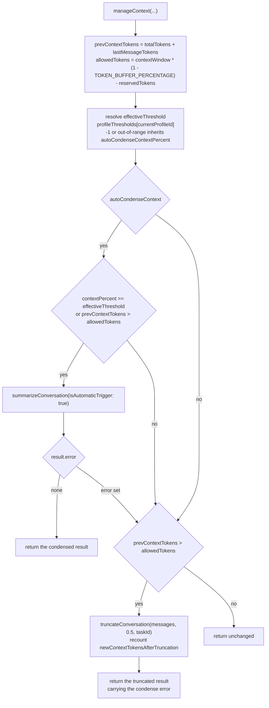
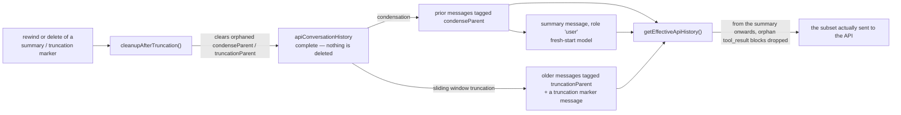

# Shofer Context Management & Summarization

## Overview

Shofer uses a **reactive** approach to context management — condensation/truncation is triggered when approaching context window limits, not proactively on every request.

## Key Components

### 1. Context Management ([`packages/core/src/context-management/index.ts`](../packages/core/src/context-management/index.ts))

Main entry point for context management. Combines:

- **Condensation** (LLM-based summarization)
- **Sliding window truncation** (fallback)

Key exports:

- [`manageContext()`](../packages/core/src/context-management/index.ts) — Main function to manage context
- [`truncateConversation()`](../packages/core/src/context-management/index.ts) — Non-destructive sliding window (tags messages as hidden)
- [`willManageContext()`](../packages/core/src/context-management/index.ts) — Checks if context management will be triggered (used for UI indicators)
- [`estimateTokenCount()`](../packages/core/src/context-management/index.ts) — Token counting via provider
- [`TOKEN_BUFFER_PERCENTAGE = 0.1`](../packages/core/src/context-management/index.ts) — 10% buffer that acts as hard safety net (condensation/truncation triggers at ~90% usage regardless of percentage threshold)

Types:

- [`ContextManagementOptions`](../packages/core/src/context-management/index.ts) — Full options for `manageContext()`, including `metadata`, `environmentDetails`, `filesReadByRoo`, `cwd`, `shoferIgnoreController`
- [`ContextManagementResult`](../packages/core/src/context-management/index.ts) — Return type including `truncationId`, `messagesRemoved`, `newContextTokensAfterTruncation`
- [`WillManageContextOptions`](../packages/core/src/context-management/index.ts) — Subset of options for `willManageContext()`, including `profileThresholds`, `currentProfileId`, `lastMessageTokens`

#### Profile-Level Thresholds

Each API profile can override the global [`autoCondenseContextPercent`](../packages/core/src/task/Task.ts) (default [`90`](../packages/core/src/task/Task.ts)) with a per-profile threshold stored in [`profileThresholds`](../packages/core/src/context-management/index.ts). A value of `-1` means "inherit from global." The effective threshold is resolved at the start of [`manageContext()`](../packages/core/src/context-management/index.ts).

### 2. Condense Module ([`packages/core/src/condense/index.ts`](../packages/core/src/condense/index.ts))

Handles LLM-based summarization of conversation history.

Key exports:

- [`summarizeConversation()`](../packages/core/src/condense/index.ts) — Main summarization function
- [`getMessagesSinceLastSummary()`](../packages/core/src/condense/index.ts) — Get messages to summarize
- [`getEffectiveApiHistory()`](../packages/core/src/condense/index.ts) — Get history with summaries applied; also filters orphan tool_result blocks
- [`cleanupAfterTruncation()`](../packages/core/src/condense/index.ts) — Clears orphaned `condenseParent`/`truncationParent` references after rewind/delete
- [`transformMessagesForCondensing()`](../packages/core/src/condense/index.ts) — Converts tool blocks to text
- [`toolUseToText()`](../packages/core/src/condense/index.ts), [`toolResultToText()`](../packages/core/src/condense/index.ts) — Convert tool calls for summarization (handle both string and array content)
- [`injectSyntheticToolResults()`](../packages/core/src/condense/index.ts) — Handle orphan tool calls (prevents API rejections from providers like OpenAI)

Constants:

- [`MIN_CONDENSE_THRESHOLD = 5`](../packages/core/src/condense/index.ts) — Minimum user-configurable % of context window for condensation trigger
- [`MAX_CONDENSE_THRESHOLD = 100`](../packages/core/src/condense/index.ts) — Maximum user-configurable %
- Note: [`TOKEN_BUFFER_PERCENTAGE = 0.1`](../packages/core/src/context-management/index.ts) acts as a hard safety net — condensation/truncation fires when tokens exceed 90% of context window minus output reservation

### 3. File Context Folding ([`packages/core/src/condense/foldedFileContext.ts`](../packages/core/src/condense/foldedFileContext.ts))

When Shofer has read files during the task (tracked via [`filesReadByRoo`](../packages/core/src/context-management/index.ts)), their structural definitions are folded into the condensed summary. This preserves awareness of file structure (function signatures, class declarations, etc.) without consuming the full token cost of file bodies.

- [`generateFoldedFileContext()`](../packages/core/src/condense/foldedFileContext.ts) — Uses tree-sitter to extract signatures-only definitions
- Each file gets its own `<system-reminder>` block in the summary
- Configurable `maxCharacters` (default: 50000)
- Files that fail or are unsupported are gracefully skipped

### 4. System Prompt Generation ([`src/core/webview/generateSystemPrompt.ts`](../src/core/webview/generateSystemPrompt.ts))

Constructs system prompts with:

- Mode role definitions
- Custom instructions (`.shofer/rules/`, user settings)
- MCP tool schemas
- Todo list instructions
- Agent rules (`.shofer/agent-rules/`, `AGENTS.md` files)
- Skill instructions

Uses [`SYSTEM_PROMPT()`](../packages/core/src/prompts/system.ts) from `packages/core/src/prompts/system.ts`

## How Condensation Works

### Trigger Mechanism

Two conditions are checked; either fires condensation:

| Trigger                  | Formula                                                                              | Default Behavior                                                                                             |
| ------------------------ | ------------------------------------------------------------------------------------ | ------------------------------------------------------------------------------------------------------------ |
| **Percentage threshold** | `contextPercent >= effectiveThreshold`                                               | Default [`autoCondenseContextPercent = 90`](../packages/core/src/task/Task.ts) (triggers at 90% utilization) |
| **Absolute safety net**  | `prevContextTokens > contextWindow * (1 - TOKEN_BUFFER_PERCENTAGE) - reservedTokens` | Always active; fires at ~90% of context window minus output reservation regardless of percentage setting     |

The safety net is hardcoded via [`TOKEN_BUFFER_PERCENTAGE = 0.1`](../packages/core/src/context-management/index.ts) — meaning condensation **will always trigger by ~90% utilization** even if the user-configured percentage threshold is set higher (e.g., 100%). The percentage threshold is user-configurable between [`MIN_CONDENSE_THRESHOLD (5%)`](../packages/core/src/condense/index.ts) and [`MAX_CONDENSE_THRESHOLD (100%)`](../packages/core/src/condense/index.ts). Each API profile can also override the global threshold via [`profileThresholds`](../packages/core/src/context-management/index.ts).

The whole decision, including the fallback, lives in one function:

### Invocation Points

[`manageContext()`](../packages/core/src/context-management/index.ts) is called in three places:

1. **Every API request** — In [`Task.attemptApiRequest()`](../packages/core/src/task/Task.ts), before sending messages to the model. A pre-check via [`willManageContext()`](../packages/core/src/task/Task.ts) determines whether to show an in-progress UI indicator.
2. **Context window exceeded recovery** — In [`Task.handleContextWindowExceededError()`](../packages/core/src/task/Task.ts), forced with [`FORCED_CONTEXT_REDUCTION_PERCENT`](../packages/core/src/task/Task.ts) (aggressive reduction after API error).
3. **Manual condensation** — In [`Task.condenseContext()`](../packages/core/src/task/Task.ts), triggered by user action (calls [`summarizeConversation()`](../packages/core/src/condense/index.ts) directly with `isAutomaticTrigger: false`).

### Process

1. Extracts messages since last summary via [`getMessagesSinceLastSummary()`](../packages/core/src/condense/index.ts)
2. Injects synthetic tool_results for orphan tool_calls via [`injectSyntheticToolResults()`](../packages/core/src/condense/index.ts) — prevents API rejections
3. Converts tool_use/tool_result blocks to text via [`transformMessagesForCondensing()`](../packages/core/src/condense/index.ts) (no tools param needed for summarization call)
4. Removes image blocks via [`maybeRemoveImageBlocks()`](../packages/core/src/condense/index.ts)
5. Calls LLM with a constructed prompt: the custom condensing prompt ([`customCondensingPrompt`](../packages/core/src/condense/index.ts), from user settings `customSupportPrompts.CONDENSE`) or the default [`supportPrompt.default.CONDENSE`](../packages/core/src/condense/index.ts)
6. Builds a summary message with **multiple content blocks**:
    - **Summary text** — The LLM-generated summary wrapped in `## Conversation Summary`
    - **Command blocks** — `<command>` blocks extracted from the original task via [`extractCommandBlocks()`](../packages/core/src/condense/index.ts), preserved in a `<system-reminder>` block to maintain active workflows across condensings
    - **Folded file context** — Signatures-only file definitions via [`generateFoldedFileContext()`](../packages/core/src/condense/foldedFileContext.ts), each file in its own `<system-reminder>` block
    - **Environment details** — Only for automatic condensation ([`isAutomaticTrigger: true`](../packages/core/src/condense/index.ts)); manual condensation skips this because fresh environment details are injected on the next turn
7. Tags all prior messages with [`condenseParent`](../packages/core/src/task-persistence/apiMessages.ts) (non-destructive; messages are hidden, not deleted)
8. Appends the summary message with role `"user"` (fresh-start model)

### Environment Details Handling

- **Automatic condensation** (`isAutomaticTrigger=true`): Environment details are included in the summary because the API request is already in progress and the next user message won't have fresh environment details.
- **Manual condensation** (`isAutomaticTrigger=false`): Environment details are NOT included — fresh environment details will be injected on the very next turn via `getEnvironmentDetails()`.

### Error Handling

Condensation failures are surfaced via localized error strings:

| Error Key                                                                              | Condition                                                                    |
| -------------------------------------------------------------------------------------- | ---------------------------------------------------------------------------- |
| [`condense_not_enough_messages`](extensions/shofer/src/i18n/locales/en/common.json:62) | Fewer than 2 messages to summarize                                           |
| [`condensed_recently`](extensions/shofer/src/i18n/locales/en/common.json:63)           | A recent summary already exists with too few new messages                    |
| [`condense_handler_invalid`](extensions/shofer/src/i18n/locales/en/common.json:64)     | API handler is missing or lacks `createMessage`                              |
| [`condense_api_failed`](../packages/core/src/condense/index.ts)                        | API call threw an exception (detailed error info captured in `errorDetails`) |
| [`condense_failed`](../packages/core/src/condense/index.ts)                            | LLM returned an empty summary                                                |

### Fallback to Sliding Window Truncation

If condensation fails (API error, empty response) or has too few messages, falls back to sliding window truncation when `prevContextTokens > allowedTokens`.

## Sliding Window Truncation

Non-destructive approach:

- Messages are **tagged** with [`truncationParent`](../packages/core/src/task-persistence/apiMessages.ts), not deleted
- First message always retained
- Removes oldest visible messages (positional, not priority-based)
- A truncation marker message is inserted at the boundary
- Can restore if user rewinds past truncation point

### Cleanup After Rewind/Delete

When a summary message or truncation marker is deleted (via rewind), [`cleanupAfterTruncation()`](../packages/core/src/condense/index.ts) clears orphaned [`condenseParent`](../packages/core/src/task-persistence/apiMessages.ts) and [`truncationParent`](../packages/core/src/task-persistence/apiMessages.ts) references, restoring previously-hidden messages to active status.

## Events Emitted

- [`condense_context`](../packages/types/src/context-management.ts) — When condensation succeeds
- [`condense_context_error`](../packages/types/src/context-management.ts) — When condensation fails
- [`sliding_window_truncation`](../packages/types/src/context-management.ts) — When truncation occurs

Message data fields ([`packages/types/src/message.ts`](../packages/types/src/message.ts)):

- [`contextCondense`](../packages/types/src/message.ts): `{ cost, prevContextTokens, newContextTokens, summary, condenseId? }`
- [`contextTruncation`](../packages/types/src/message.ts): `{ truncationId, messagesRemoved, prevContextTokens, newContextTokens }`

### Effective API History

[`getEffectiveApiHistory()`](../packages/core/src/condense/index.ts) filters the full conversation to produce the subset actually sent to the API:

- **Fresh start model**: When a summary exists, returns only messages from the summary onwards
- Filters out messages tagged with [`condenseParent`](../packages/core/src/task-persistence/apiMessages.ts) (replaced by summary) or [`truncationParent`](../packages/core/src/task-persistence/apiMessages.ts) (hidden by truncation)
- Removes orphan tool_result blocks that reference tool_use IDs from condensed-away messages (orphan cleanup)

Both reduction paths are tag-based, so the stored history stays complete and a
rewind can restore it:

## Source References

- Context Management: [`packages/core/src/context-management/index.ts`](../packages/core/src/context-management/index.ts)
- Condensation: [`packages/core/src/condense/index.ts`](../packages/core/src/condense/index.ts)
- File Context Folding: [`packages/core/src/condense/foldedFileContext.ts`](../packages/core/src/condense/foldedFileContext.ts)
- System Prompt: [`src/core/webview/generateSystemPrompt.ts`](../src/core/webview/generateSystemPrompt.ts), [`packages/core/src/prompts/system.ts`](../packages/core/src/prompts/system.ts)
- API Messages: [`packages/core/src/task-persistence/apiMessages.ts`](../packages/core/src/task-persistence/apiMessages.ts)
- Tests: [`packages/core/src/condense/__tests__/condense.spec.ts`](../packages/core/src/condense/__tests__/condense.spec.ts), [`packages/core/src/context-management/__tests__/context-management.spec.ts`](../packages/core/src/context-management/__tests__/context-management.spec.ts)
- Types: [`packages/types/src/message.ts`](../packages/types/src/message.ts) (ShoferMessage, ContextCondense, ContextTruncation), [`packages/types/src/context-management.ts`](../packages/types/src/context-management.ts) (event types)
- Task integration: [`packages/core/src/task/Task.ts`](../packages/core/src/task/Task.ts) (attemptApiRequest, handleContextWindowExceededError, condenseContext)
- i18n: [`src/i18n/locales/en/common.json`](extensions/shofer/src/i18n/locales/en/common.json) (condense error strings)

## Gaps & Areas for Improvement

1. **`TruncationResult` type not documented** — The [`TruncationResult`](../packages/core/src/context-management/index.ts) type (`{ messages, truncationId, messagesRemoved }`) exists alongside [`ContextManagementResult`](../packages/core/src/context-management/index.ts) but is not mentioned in this doc. It is the return type of [`truncateConversation()`](../packages/core/src/context-management/index.ts).

2. **`convertToolBlocksToText()` not documented** — The document references [`transformMessagesForCondensing()`](../packages/core/src/condense/index.ts), but the actual per-message conversion workhorse is [`convertToolBlocksToText()`](../packages/core/src/condense/index.ts). The former is a thin mapper over the latter.

3. **`SUMMARY_PROMPT` constant not mentioned** — The prompt construction section (step 5) describes `customCondensingPrompt` and `supportPrompt.default.CONDENSE` but omits [`SUMMARY_PROMPT`](../packages/core/src/condense/index.ts), the system-level prefix prepended to every condensing call. This prompt disables tool calls and re-frames the task as summarization-only.

4. **`maybeRemoveImageBlocks()` import path not shown** — This function (step 4 of Process) is imported from [`../../api/transform/image-cleaning`](../packages/core/src/api/transform/image-cleaning.ts), not defined in the condense module. The doc should clarify this is an external dependency.

5. **`toolTokens` counting not documented** — In [`summarizeConversation()`](../packages/core/src/condense/index.ts), the `newContextTokens` calculation includes tool definition tokens (`metadata.tools`) via a separate `apiHandler.countTokens()` call on the JSON-serialized tools array. This detail is invisible in the current doc.

6. **`SummarizeResponse` ← `ContextManagementResult` relationship not explicit** — [`ContextManagementResult`](../packages/core/src/context-management/index.ts) extends [`SummarizeResponse`](../packages/core/src/condense/index.ts) with `prevContextTokens`, `truncationId?`, `messagesRemoved?`, and `newContextTokensAfterTruncation?`. The doc documents both types independently but doesn't explain that one is a superset of the other.

7. **Telemetry not documented** — Both [`summarizeConversation()`](../packages/core/src/condense/index.ts) and [`truncateConversation()`](../packages/core/src/context-management/index.ts) emit telemetry events (`captureContextCondensed`, `captureSlidingWindowTruncation`). The Events Emitted section only covers ShoferMessage events (`condense_context`, `sliding_window_truncation`), not telemetry.

8. **`maxCharacters` default for file folding not API-verified** — The doc states the default `maxCharacters` is 50000 (line 60), which matches the source default in [`generateFoldedFileContext()`](../packages/core/src/condense/foldedFileContext.ts). However, no tests verify this constant across the folded-file pipeline, so a change in the default could go unnoticed.

9. **No section on abort/cancellation interaction** — Condensation calls `apiHandler.createMessage()` inside [`summarizeConversation()`](../packages/core/src/condense/index.ts), which iterates a stream. There's no discussion of what happens when the user cancels the task mid-condensation — whether the stream is aborted, partial summaries are discarded, or stale `condenseParent` tags are left behind.

10. **No section on the dual-path threshold resolution** — The effective threshold is resolved identically in both [`manageContext()`](../packages/core/src/context-management/index.ts) and [`willManageContext()`](../packages/core/src/context-management/index.ts). These are copy-pasted blocks that could drift apart. The doc could note this as a maintenance hazard.
