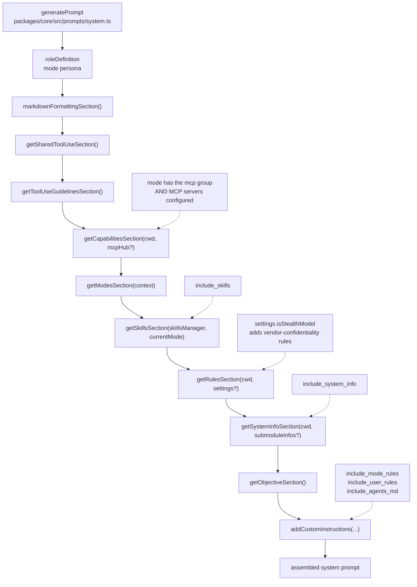

# Shofer System Prompt Architecture

The default system prompt is assembled at runtime by [`packages/core/src/prompts/system.ts`](../packages/core/src/prompts/system.ts) via the `generatePrompt` function (line 41). It stitches together multiple **sections**, each generated by a dedicated function in [`packages/core/src/prompts/sections/`](../packages/core/src/prompts/sections/).

## Assembly Order

```
${roleDefinition}                          ← Mode-specific persona
${markdownFormattingSection()}             ← Clickable link syntax rules
${getSharedToolUseSection()}               ← Tool availability summary
${getToolUseGuidelinesSection()}           ← How to choose and chain tools
${getCapabilitiesSection()}                ← Detailed tool capabilities
${modesSection}                            ← Available modes listing
${skillsSection}                           ← Available skills listing (gated by include_skills)
${getRulesSection()}                       ← Operational constraints & rules
${getSystemInfoSection()}                  ← OS, shell, workspace paths + submodules (gated by include_system_info)
${getObjectiveSection()}                   ← Task workflow instructions
${addCustomInstructions()}                 ← Mode-specific + user rules (gated by include_mode_rules, include_user_rules, include_agents_md)
```

The same order as a pipeline — `generatePrompt` concatenates the sections
top-to-bottom; the dashed inputs are the gates that can drop or alter a section:



## Section Details

### 1. `roleDefinition` (Mode Persona)

**Source:** Mode configuration from [`src/shared/modes.ts`](../src/shared/modes.ts) (built-in) or `.shofer/shofermodes` (custom).

- Defines the LLM's identity: e.g., `"You are Shofer, a highly skilled software engineer with extensive knowledge in many programming languages, frameworks, design patterns, and best practices."`
- Sets the tone and expertise level for the entire conversation.
- The `roleDefinition` changes per mode — Code mode gets a coding persona, Architect mode gets a planning persona, etc.

### 2. [`sections/markdown-formatting.ts`](../packages/core/src/prompts/sections/markdown-formatting.ts)

**Function:** `markdownFormattingSection()`

- Enforces clickable syntax for code references: ``[`filename OR language.declaration()`](relative/file/path.ext:line)``
- Applies to ALL markdown responses including `attempt_completion`.
- Line numbers are required for syntax references, optional for filename links.

### 3. [`sections/tool-use.ts`](../packages/core/src/prompts/sections/tool-use.ts)

**Function:** `getSharedToolUseSection()`

- Declares that tools are available and executed upon user approval.
- Uses provider-native tool-calling (no XML markup).
- Requires at least one tool call per assistant response.
- Encourages batching multiple tools in a single response to reduce round-trips.

### 4. [`sections/tool-use-guidelines.ts`](../packages/core/src/prompts/sections/tool-use-guidelines.ts)

**Function:** `getToolUseGuidelinesSection()`

- Three-step decision process: assess existing info → choose best tool → execute iteratively.
- Each tool use must be informed by the previous step's result — no assumptions about outcomes.
- The iterative process helps ensure overall success and accuracy.

### 5. [`sections/capabilities.ts`](../packages/core/src/prompts/sections/capabilities.ts)

**Function:** `getCapabilitiesSection(cwd, mcpHub?)`

- Describes the full tool inventory: CLI commands, file listing, source code viewing, regex search, read/write files, follow-up questions.
- Explains how `environment_details` (the auto-generated file listing) works after every user message.
- Documents `execute_command` behavior (new terminal per command, preferred over scripts for complex operations).
- **Conditionally includes MCP server info** if the current mode has the `mcp` group AND MCP servers are configured.

### 6. [`sections/modes.ts`](../packages/core/src/prompts/sections/modes.ts)

**Function:** `getModesSection(context)`

- Lists all currently available modes with their slugs and descriptions.
- Description source priority: `whenToUse` field → first sentence of `roleDefinition`.
- Reads from extension state to include custom modes defined via `.shofer/shofermodes`.

### 7. [`sections/skills.ts`](../packages/core/src/prompts/sections/skills.ts)

**Function:** `getSkillsSection(skillsManager, currentMode)`

- Lists available skills filtered by the current mode.
- Includes a **mandatory skill applicability check** protocol:
    - Before any user-facing response, the model MUST evaluate whether a skill applies.
    - If a skill applies, load exactly one (the most specific), and follow it exactly.
    - If no skill applies, proceed normally.
- Defines linked file handling rules: files linked from skills are NOT auto-loaded; the model must explicitly decide to read them.

### 8. [`sections/rules.ts`](../packages/core/src/prompts/sections/rules.ts)

**Function:** `getRulesSection(cwd, settings?)`

The largest section, containing operational constraints:

- **Workspace path constraints**: Base directory, relative paths only, no `~` or `$HOME`, cannot `cd` out.
- **Shell-aware command chaining**: Adapts `&&` vs `;` based on detected shell (bash/zsh/PowerShell/cmd.exe).
- **File restriction rules**: Per-mode file editing restrictions with `FileRestrictionError`.
- **Tool usage patterns**:
    - Don't ask for unnecessary info; use tools instead.
    - Only ask questions via `ask_followup_question` (with 2-4 suggested answers).
    - Assume command success if output isn't streamed back.
    - Wait for user confirmation after each tool use.
- **Response style rules**:
    - No "Great", "Certainly", "Okay", "Sure" openings.
    - Never end `attempt_completion` with questions.
    - Be direct and technical.
- **`environment_details` handling**: Treat as auto-generated context, not as user input.
- **Image handling**: Utilize vision capabilities when images are present.
- **Conditional vendor confidentiality**: When `settings.isStealthModel` is true, adds rules instructing the model to never reveal its creator.

### 9. [`sections/system-info.ts`](../packages/core/src/prompts/sections/system-info.ts)

**Function:** `getSystemInfoSection(cwd, submoduleInfos?)`

- Reports the actual OS (via `os-name`), shell, home directory, and workspace directory.
- Explains the workspace directory semantics: it's the VS Code project directory, the default for all tool operations, and changing directories in a terminal doesn't modify it.
- **Submodule augmentation:** When `submoduleInfos` is non-empty, appends a `WORKSPACE SUBMODULES` block listing each submodule's path, remote URL, and optional branch (from `.gitmodules`). Instructs the model to `cd` into submodule directories before performing git operations. Capped at 50 entries with a truncation notice.
- **Fallback:** If `.gitmodules` is missing or unparseable, submodule paths are still listed from `git submodule foreach` but without URL/branch details (the block is omitted when no initialized submodules exist).

### 10. [`sections/objective.ts`](../packages/core/src/prompts/sections/objective.ts)

**Function:** `getObjectiveSection()`

- Defines the 5-step task workflow:
    1. Analyze and set goals in priority order.
    2. Work sequentially, one step at a time.
    3. Before calling a tool, analyze file structure and determine which tool is most relevant. If a required parameter is missing, use `ask_followup_question` — don't guess.
    4. Use `attempt_completion` to present the result.
    5. Accept feedback, but don't engage in pointless back-and-forth.

### 11. [`sections/custom-instructions.ts`](../packages/core/src/prompts/sections/custom-instructions.ts)

**Function:** `addCustomInstructions(modeCustomInstructions, globalCustomInstructions, cwd, mode, options)`

- Loads and concatenates custom instructions from multiple sources:
    - **Mode-specific `customInstructions`** (from the mode definition).
    - **Global custom instructions** (from settings).
    - **`.shofer/rules/` directory** — loads all text files recursively, sorted alphabetically (gated by `include_user_rules`).
    - **`AGENTS.md` / `AGENT.md`** — from workspace root and optionally from subdirectories (gated by `include_agents_md`).
    - **`.shofer/rules-{mode}/`** — mode-specific rule directories e.g. `.shofer/rules-code/` (gated by `include_mode_rules`).
    - **Legacy fallback**: `.roorules` and `.clinerules` files.
- Respects `.shofer/shoferignore` for file filtering.
- Supports symlinks for all discovered files.
- Includes language preference and `.shofer/shoferignore` instructions.

## Entry Point

The assembled prompt is exported as [`SYSTEM_PROMPT`](../packages/core/src/prompts/system.ts#L112) which is called by the task runner in `Task` whenever a new conversation starts or context is condensed.

## Response Templates

[`packages/core/src/prompts/responses.ts`](../packages/core/src/prompts/responses.ts) provides response templates for tool interactions (NOT part of the system prompt itself, but returned as tool results):

- `toolDenied` / `toolApprovedWithFeedback` — approval responses.
- `toolError` — execution failure.
- `shoferIgnoreError` — access blocked by `.shofer/shoferignore`.
- `noToolsUsed` — reminder when the model forgets to call a tool.
- `tooManyMistakes` — guidance on mistakes/repetition.
- `formatResponse.toolResult` — formats `read_file`, `list_files`, etc. results with path headers and content.
- `formatResponse.createPrettyPatch` — generates unified diffs for display.

## Gaps, Issues & Improvement Areas

This section catalogues known gaps between the documentation and implementation, discovered during a full audit of every referenced file path, function signature, and source-code claim on 2026-05-20.

### Gaps — Undocumented Components

| #   | Gap                                                                                 | Detail                                                                                                                                                                                                                                                                                                  |
| --- | ----------------------------------------------------------------------------------- | ------------------------------------------------------------------------------------------------------------------------------------------------------------------------------------------------------------------------------------------------------------------------------------------------------- |
| 1   | [`sections/index.ts`](../packages/core/src/prompts/sections/index.ts) barrel export | The doc lists individual section files but never mentions the barrel that re-exports all section functions. [`system.ts`](../packages/core/src/prompts/system.ts#L15-L26) imports from `"./sections"`, which resolves to this barrel.                                                                   |
| 2   | [`getPromptComponent()`](../packages/core/src/prompts/system.ts#L29-L39)            | Exported helper that resolves a mode's `PromptComponent` override, filtering out empty objects. Called by `SYSTEM_PROMPT` before delegating to `generatePrompt`. Not documented anywhere in this file.                                                                                                  |
| 3   | `SystemPromptSettings` type                                                         | Referenced by [`getRulesSection(cwd, settings?)`](../packages/core/src/prompts/sections/rules.ts#L65) and [`addCustomInstructions(..., options)`](../packages/core/src/prompts/sections/custom-instructions.ts#L382) but its shape (e.g., `isStealthModel`, `enableSubfolderRules`) is never described. |
| 4   | `PromptComponent` / `CustomModePrompts` types                                       | Imported from `@shofer/types` in [`system.ts`](../packages/core/src/prompts/system.ts#L3). `PromptComponent` carries `{ roleDefinition?, baseInstructions? }`; `CustomModePrompts` maps mode slugs to overrides. Neither is mentioned in this doc.                                                      |
| 5   | `supportsComputerUse` parameter                                                     | Present in both [`generatePrompt`](../packages/core/src/prompts/system.ts#L44) and [`SYSTEM_PROMPT`](../packages/core/src/prompts/system.ts#L115) signatures but unused in the current implementation. Not documented.                                                                                  |
| 6   | `experiments`, `todoList`, `modelId` parameters                                     | Passed through `SYSTEM_PROMPT` → `generatePrompt` but currently unused. Not mentioned.                                                                                                                                                                                                                  |
| 7   | `effectiveProtocol` assignment                                                      | [`system.ts:75`](../packages/core/src/prompts/system.ts#L75) hardcodes `"native"` with the comment "Tool calling is native-only." Not mentioned in doc — relevant for understanding why no XML tool-calling markup appears in the prompt.                                                               |
| 8   | `toolsCatalog` empty string                                                         | [`system.ts:83`](../packages/core/src/prompts/system.ts#L83) sets `const toolsCatalog = ""` with comment "Tools catalog is not included in the system prompt." Not documented.                                                                                                                          |
| 9   | `CodeIndexManager` resolution                                                       | [`system.ts:72`](../packages/core/src/prompts/system.ts#L72) calls `CodeIndexManager.getInstance(context, cwd)` inside `generatePrompt`. Currently unused in the prompt assembly but is instantiated. Not documented.                                                                                   |
| 10  | MCP conditional logic                                                               | [`system.ts:68-70`](../packages/core/src/prompts/system.ts#L68-L70): `shouldIncludeMcp = hasMcpGroup && hasMcpServers` gates whether `mcpHub` is passed to `getCapabilitiesSection()`. The doc mentions the conditional (line 63) but doesn't show the two-part AND logic.                              |
| 11  | Assembly whitespace differences                                                     | The doc's assembly template (§Assembly Order) is simplified — it doesn't show the `\t` indent before [`getToolUseGuidelinesSection()`](../packages/core/src/prompts/system.ts#L91) or the conditional `\n` wrapping `${skillsSection}` (line 96).                                                       |

### Issues — Inaccuracies Found & Fixed

| #   | Issue                                                                                                                                                                                                                                                                                                                                                    | Resolution                                      |
| --- | -------------------------------------------------------------------------------------------------------------------------------------------------------------------------------------------------------------------------------------------------------------------------------------------------------------------------------------------------------- | ----------------------------------------------- |
| 1   | Line 126: `addCustomInstructions(baseInstructions, ...)` used the caller's variable name (`baseInstructions` from [`system.ts:65`](../packages/core/src/prompts/system.ts#L65)) rather than the actual parameter name (`modeCustomInstructions` from [`custom-instructions.ts:382`](../packages/core/src/prompts/sections/custom-instructions.ts#L382)). | Fixed — replaced with `modeCustomInstructions`. |
| 2   | Line 141: "The assembled prompt is exported as `SYSTEM_PROMPT` which is called by the task runner" conflates the function with its return value. More precisely: `SYSTEM_PROMPT` is an async function that resolves mode metadata, then calls `generatePrompt` (the internal assembler).                                                                 | Not yet fixed — see Improvement Area #1 below.  |

### Improvement Areas — Recommended Doc Enhancements

| #   | Suggestion                                                                                                                            | Rationale                                                                                                                                                                                             |
| --- | ------------------------------------------------------------------------------------------------------------------------------------- | ----------------------------------------------------------------------------------------------------------------------------------------------------------------------------------------------------- |
| 1   | Split §Entry Point into two sub-sections: **`generatePrompt` (internal assembler)** and **`SYSTEM_PROMPT` (public entry wrapper)**.   | The current text conflates two distinct functions into one sentence. `SYSTEM_PROMPT` does mode resolution + parameter normalization then delegates; `generatePrompt` does the actual string assembly. |
| 2   | Add a §Data Types section documenting `SystemPromptSettings`, `PromptComponent`, and `CustomModePrompts`.                             | These types affect prompt output (e.g., `isStealthModel` controls vendor-confidentiality rules) but are invisible in the current doc.                                                                 |
| 3   | Update §Assembly Order to include the actual whitespace/indentation from source, or add a note clarifying the template is simplified. | The `\t` indent before `getToolUseGuidelinesSection()` is intentional output formatting.                                                                                                              |
| 4   | Add a row for `getPromptComponent()` in the section list (between `roleDefinition` and `markdown-formatting.ts`).                     | It's the only exported function in [`system.ts`](../packages/core/src/prompts/system.ts) not mentioned in this doc.                                                                                   |
| 5   | Document the `shouldIncludeMcp` two-part gate (`hasMcpGroup && hasMcpServers`).                                                       | The doc says "if the current mode has the `mcp` group AND MCP servers are configured" but doesn't reference the source location or variable name.                                                     |
