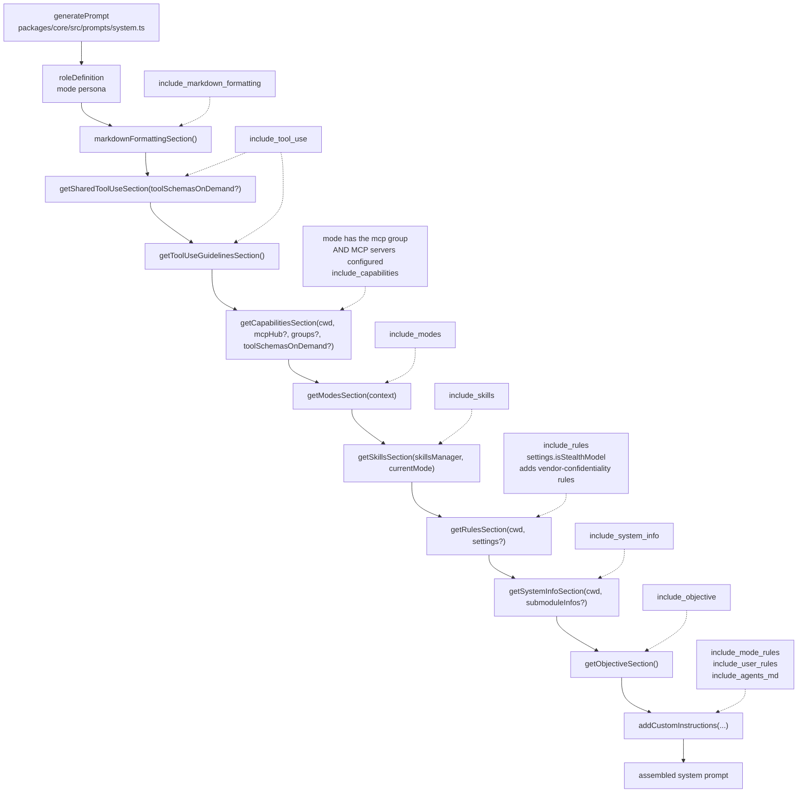

# Shofer System Prompt Architecture

The default system prompt is assembled at runtime by [`packages/core/src/prompts/system.ts`](../packages/core/src/prompts/system.ts) via the `generatePrompt` function (line 41). It stitches together multiple **sections**, each generated by a dedicated function in [`packages/core/src/prompts/sections/`](../packages/core/src/prompts/sections/).

## Assembly Order

```
${roleDefinition}                          ← Mode-specific persona
${markdownFormattingSection()}             ← Clickable link syntax rules (gated by include_markdown_formatting)
${getSharedToolUseSection(stubs?)}         ← Tool availability summary (gated by include_tool_use)
${getToolUseGuidelinesSection()}           ← How to choose and chain tools (gated by include_tool_use)
${getCapabilitiesSection()}                ← Detailed tool capabilities (gated by include_capabilities)
${modesSection}                            ← Available modes listing (gated by include_modes)
${skillsSection}                           ← Available skills listing (gated by include_skills)
${getRulesSection()}                       ← Operational constraints & rules (gated by include_rules)
${getSystemInfoSection()}                  ← OS, shell, workspace paths + submodules (gated by include_system_info)
${getObjectiveSection()}                   ← Task workflow instructions (gated by include_objective)
${addCustomInstructions()}                 ← Mode-specific + user rules (gated by include_mode_rules, include_user_rules, include_agents_md)
```

The same order as a pipeline — `generatePrompt` concatenates the sections
top-to-bottom; the dashed inputs are the gates that can drop or alter a section:



## Section gates: where the values come from

Every section except the role definition and the custom instructions can be
dropped. A gate is read in three layers, first answer wins, and the last layer is
always "include it" — so a caller that sets nothing assembles the prompt
byte-for-byte as it was before the gates existed:

1. the task's `agentContext` — a per-task override carried on
   [`CreateTaskOptions`](../packages/types/src/task.ts), keyed in snake_case — `include_markdown_formatting`, `include_tool_use`,
   `include_capabilities`, `include_modes`, `include_rules`, `include_objective`,
   plus the older `include_skills`, `include_system_info`, `include_mcp`,
   `include_mode_rules`, `include_user_rules`, `include_agents_md`,
   `require_todos`;
2. a GLOBAL setting for the six new ones — `includeMarkdownFormattingSection`,
   `includeToolUseSection`, `includeCapabilitiesSection`, `includeModesSection`,
   `includeRulesSection`, `includeObjectiveSection` in `globalSettingsSchema`,
   which a deployment publishes through its configuration scope
   (`$SHOFER_GLOBAL_DIR/settings.json`) rather than a settings-view control;
3. included.

`Task.getSystemPrompt` resolves the three into `SystemPromptSettings`
(`includeMarkdownFormatting`, `includeToolUse`, …) and folds every one into the
system-prompt cache key, so republishing a configuration with a gate flipped
rebuilds the prompt instead of serving the cached one.

`include_tool_use` covers the TOOL USE and Tool Use Guidelines pair together,
deliberately: they are one subject split across two functions, and gating them
apart would let a prompt state the tool protocol without its rules, or the
reverse.

### The tool plane the prompt describes must be the one the request carries

Two sections describe the tool INVENTORY, so they change when the inventory's
presentation does. A mode that declares `tools_full_schema`
(`tool_access.md`) sends most of its tools to the model as STUBS — name, one
line, and a single `arguments_json` string standing in for their parameters — and
recovers the real contracts on demand through `describe_tools`. When it does:

- **TOOL USE** gains a paragraph stating that a stub's arguments were omitted to
  keep the list small (not because the tool takes none), that `describe_tools`
  returns them, that they are passed back JSON-encoded in `arguments_json` (or
  directly where the tool-calling interface allows it), and that a stubbed tool's
  arguments are never to be guessed;
- **CAPABILITIES** gains a bullet saying the stub list IS the full inventory
  rather than a summary of it — without which a model reading one-line entries
  concludes it has fewer capabilities than it does.

Neither is a gate: the two sections read the MODE, which is the same source the
tool build reads, so the prose and the tools array cannot disagree. And like the
gates, the setting is static per bundle/mode — `Task.getSystemPrompt` folds the
mode's `tools_full_schema` into the system-prompt cache key so republishing a
mode that starts (or stops) stubbing rebuilds the prompt, but nothing varies
turn to turn.

**Gates are meant to be STATIC for a deployment, not varied per turn.** The
system prompt is the head of every request, and a provider's prompt-prefix cache
only pays while that head is byte-identical from turn to turn — so a gate that
changed mid-conversation would cost more in cold prefixes than any section it
removes. That is why the second layer is a global setting rather than something
a turn can influence: anything that genuinely varies belongs in the user message.

### What each section costs

Measured by
[`packages/core/src/prompts/__tests__/section-bytes.spec.ts`](../packages/core/src/prompts/__tests__/section-bytes.spec.ts),
which assembles the prompt with each gate on and off and reports the difference.
Run it with `npx vitest run --no-silent packages/core/src/prompts/__tests__/section-bytes.spec.ts`.
For a chat-shaped mode (MCP + questions + subtasks, no file tools) with two modes
declared and no MCP hub attached — 15,629 bytes assembled:

| Section                                                    | Bytes | Share |
| ---------------------------------------------------------- | ----: | ----: |
| RULES                                                      | 7,852 | 50.2% |
| OBJECTIVE                                                  | 1,990 | 12.7% |
| CAPABILITIES                                               | 1,915 | 12.3% |
| SYSTEM INFORMATION                                         | 1,608 | 10.3% |
| TOOL USE + Tool Use Guidelines                             | 1,500 |  9.6% |
| MARKDOWN RULES                                             |   327 |  2.1% |
| MODES                                                      |   235 |  1.5% |
| ungated (role definition, custom instructions, separators) |   202 |  1.3% |

The last row is small only because this fixture's mode has a one-line role
definition and no custom instructions; a real mode's persona and instructions
are frequently larger than every gated section put together. MODES and
CAPABILITIES also grow with the number of declared modes and the mode's tool
groups respectively.

## The conversational variant (`toolCallingEnabled === false`)

`generatePrompt` assembles a second, minimal prompt when the task's
`ProviderSettings.toolCallingEnabled` is `false` — the setting that makes a turn
conversational: no tools are sent to the model, and a complete text-only reply
IS the turn (`Task.recursivelyMakeShoferRequests` completes the task instead of
re-prompting with `formatResponse.noToolsUsed()`). This is what a realtime
voice/phone caller drives, where the deliverable of a turn is streamed prose.

It keeps four things:

| Kept                      | Gate                                                              |
| ------------------------- | ----------------------------------------------------------------- |
| `roleDefinition`          | always                                                            |
| `skillsSection`           | `include_skills`                                                  |
| `getSystemInfoSection()`  | `include_system_info`                                             |
| `addCustomInstructions()` | `include_mode_rules` / `include_user_rules` / `include_agents_md` |

Everything else is omitted, and not merely as dead weight — each mandates
tool-mediated, non-conversational behaviour that is wrong for an agent whose
output may be spoken aloud:

| Omitted                         | Why it is wrong without tools                                                 |
| ------------------------------- | ----------------------------------------------------------------------------- |
| `markdownFormattingSection()`   | Clickable ``[`path`](path:line)`` references — meaningless in speech          |
| `getSharedToolUseSection()`     | "You must call at least one tool per assistant response"                      |
| `getToolUseGuidelinesSection()` | A decision procedure for choosing tools there are none of                     |
| `getCapabilitiesSection()`      | Describes an inventory the model was not given                                |
| `getModesSection()`             | Switching modes is itself a tool call                                         |
| `getRulesSection()`             | "NOT engage in a back and forth conversation", `environment_details` handling |
| `getObjectiveSection()`         | "Use the `attempt_completion` tool to present the result"                     |

The flag reaches the prompt as `SystemPromptSettings.toolCallingEnabled`,
threaded by `Task.getSystemPrompt` from the task's `apiConfiguration`, and it
participates in the system-prompt cache key — a task with tools off never reuses
a cached tools-on prompt.

## Section Details

### 1. `roleDefinition` (Mode Persona)

**Source:** Mode configuration from [`packages/types/src/modes.ts`](../packages/types/src/modes.ts) (built-in) or `.shofer/shofermodes` (custom).

- Defines the LLM's identity: e.g., `"You are Shofer, a highly skilled software engineer with extensive knowledge in many programming languages, frameworks, design patterns, and best practices."`
- Sets the tone and expertise level for the entire conversation.
- The `roleDefinition` changes per mode — Code mode gets a coding persona, Architect mode gets a planning persona, etc.

### 2. [`sections/markdown-formatting.ts`](../packages/core/src/prompts/sections/markdown-formatting.ts)

**Function:** `markdownFormattingSection()`

- Enforces clickable syntax for code references: ``[`filename OR language.declaration()`](relative/file/path.ext:line)``
- Applies to ALL markdown responses including `attempt_completion`.
- Line numbers are required for syntax references, optional for filename links.

### 3. [`sections/tool-use.ts`](../packages/core/src/prompts/sections/tool-use.ts)

**Function:** `getSharedToolUseSection(toolSchemasOnDemand?)`

- Declares that tools are available and executed upon user approval.
- Uses provider-native tool-calling (no XML markup).
- Requires at least one tool call per assistant response.
- Encourages batching multiple tools in a single response to reduce round-trips.
- When the mode tiers its tool schemas, appends the deferred-schema protocol:
  stubs, `describe_tools`, the `arguments_json` hatch, and "do not guess a
  stubbed tool's arguments".

### 4. [`sections/tool-use-guidelines.ts`](../packages/core/src/prompts/sections/tool-use-guidelines.ts)

**Function:** `getToolUseGuidelinesSection()`

- Three-step decision process: assess existing info → choose best tool → execute iteratively.
- Each tool use must be informed by the previous step's result — no assumptions about outcomes.
- The iterative process helps ensure overall success and accuracy.

### 5. [`sections/capabilities.ts`](../packages/core/src/prompts/sections/capabilities.ts)

**Function:** `getCapabilitiesSection(cwd, mcpHub?, groups?, toolSchemasOnDemand?)`

- Describes the full tool inventory: CLI commands, file listing, source code viewing, regex search, read/write files, follow-up questions.
- Explains how `environment_details` (the auto-generated file listing) works after every user message.
- Documents `execute_command` behavior (new terminal per command, preferred over scripts for complex operations).
- **Conditionally includes MCP server info** if the current mode has the `mcp` group AND MCP servers are configured.
- **Conditionally states that most tools are stubs** when the mode declares `tools_full_schema`.

### 6. [`sections/modes.ts`](../packages/core/src/prompts/sections/modes.ts)

**Function:** `getModesSection(context)`

- Lists all currently available modes with their slugs and descriptions.
- Description source priority: `whenToUse` field → first sentence of `roleDefinition`.
- Reads from extension state to include custom modes defined via `.shofer/shofermodes`.

### 7. [`sections/skills.ts`](../packages/core/src/prompts/sections/skills.ts)

**Function:** `getSkillsSection(skillsManager, currentMode)`

- Lists available skills filtered by the current mode.
- Includes a **mandatory skill applicability check** protocol:
    - Before any user-facing response, the model MUST evaluate whether a skill applies.
    - If a skill applies, load exactly one (the most specific), and follow it exactly.
    - If no skill applies, proceed normally.
- Defines linked file handling rules: files linked from skills are NOT auto-loaded; the model must explicitly decide to read them.

### 8. [`sections/rules.ts`](../packages/core/src/prompts/sections/rules.ts)

**Function:** `getRulesSection(cwd, settings?)`

The largest section, containing operational constraints:

- **Workspace path constraints**: Base directory, relative paths only, no `~` or `$HOME`, cannot `cd` out.
- **Shell-aware command chaining**: Adapts `&&` vs `;` based on detected shell (bash/zsh/PowerShell/cmd.exe).
- **File restriction rules**: Per-mode file editing restrictions with `FileRestrictionError`.
- **Tool usage patterns**:
    - Don't ask for unnecessary info; use tools instead.
    - Only ask questions via `ask_followup_question` (with 2-4 suggested answers).
    - Assume command success if output isn't streamed back.
    - Wait for user confirmation after each tool use.
- **Response style rules**:
    - No "Great", "Certainly", "Okay", "Sure" openings.
    - Never end `attempt_completion` with questions.
    - Be direct and technical.
- **`environment_details` handling**: Treat as auto-generated context, not as user input.
- **Image handling**: Utilize vision capabilities when images are present.
- **Conditional vendor confidentiality**: When `settings.isStealthModel` is true, adds rules instructing the model to never reveal its creator.

### 9. [`sections/system-info.ts`](../packages/core/src/prompts/sections/system-info.ts)

**Function:** `getSystemInfoSection(cwd, submoduleInfos?)`

- Reports the actual OS (via `os-name`), shell, home directory, and workspace directory.
- Explains the workspace directory semantics: it's the VS Code project directory, the default for all tool operations, and changing directories in a terminal doesn't modify it.
- **Submodule augmentation:** When `submoduleInfos` is non-empty, appends a `WORKSPACE SUBMODULES` block listing each submodule's path, remote URL, and optional branch (from `.gitmodules`). Instructs the model to `cd` into submodule directories before performing git operations. Capped at 50 entries with a truncation notice.
- **Fallback:** If `.gitmodules` is missing or unparseable, submodule paths are still listed from `git submodule foreach` but without URL/branch details (the block is omitted when no initialized submodules exist).

### 10. [`sections/objective.ts`](../packages/core/src/prompts/sections/objective.ts)

**Function:** `getObjectiveSection()`

- Defines the 5-step task workflow:
    1. Analyze and set goals in priority order.
    2. Work sequentially, one step at a time.
    3. Before calling a tool, analyze file structure and determine which tool is most relevant. If a required parameter is missing, use `ask_followup_question` — don't guess.
    4. Use `attempt_completion` to present the result.
    5. Accept feedback, but don't engage in pointless back-and-forth.

### 11. [`sections/custom-instructions.ts`](../packages/core/src/prompts/sections/custom-instructions.ts)

**Function:** `addCustomInstructions(modeCustomInstructions, globalCustomInstructions, cwd, mode, options)`

- Loads and concatenates custom instructions from multiple sources:
    - **Mode-specific `customInstructions`** (from the mode definition).
    - **Global custom instructions** (from settings).
    - **`.shofer/rules/` directory** — loads all text files recursively, sorted alphabetically (gated by `include_user_rules`).
    - **`AGENTS.md` / `AGENT.md`** — from workspace root and optionally from subdirectories (gated by `include_agents_md`).
    - **`.shofer/rules-{mode}/`** — mode-specific rule directories e.g. `.shofer/rules-code/` (gated by `include_mode_rules`).
    - **Legacy fallback**: `.roorules` and `.clinerules` files.
- Respects `.shofer/shoferignore` for file filtering.
- Supports symlinks for all discovered files.
- Includes language preference and `.shofer/shoferignore` instructions.

## Entry Point

The assembled prompt is exported as [`SYSTEM_PROMPT`](../packages/core/src/prompts/system.ts#L112) which is called by the task runner in `Task` whenever a new conversation starts or context is condensed.

## Response Templates

[`packages/core/src/prompts/responses.ts`](../packages/core/src/prompts/responses.ts) provides response templates for tool interactions (NOT part of the system prompt itself, but returned as tool results):

- `toolDenied` / `toolApprovedWithFeedback` — approval responses.
- `toolError` — execution failure.
- `shoferIgnoreError` — access blocked by `.shofer/shoferignore`.
- `noToolsUsed` — reminder when the model forgets to call a tool.
- `tooManyMistakes` — guidance on mistakes/repetition.
- `formatResponse.toolResult` — formats `read_file`, `list_files`, etc. results with path headers and content.
- `formatResponse.createPrettyPatch` — generates unified diffs for display.

## Gaps, Issues & Improvement Areas

This section catalogues known gaps between the documentation and implementation, discovered during a full audit of every referenced file path, function signature, and source-code claim on 2026-05-20.

### Gaps — Undocumented Components

| #   | Gap                                                                                 | Detail                                                                                                                                                                                                                                                                                                  |
| --- | ----------------------------------------------------------------------------------- | ------------------------------------------------------------------------------------------------------------------------------------------------------------------------------------------------------------------------------------------------------------------------------------------------------- |
| 1   | [`sections/index.ts`](../packages/core/src/prompts/sections/index.ts) barrel export | The doc lists individual section files but never mentions the barrel that re-exports all section functions. [`system.ts`](../packages/core/src/prompts/system.ts#L15-L26) imports from `"./sections"`, which resolves to this barrel.                                                                   |
| 2   | [`getPromptComponent()`](../packages/core/src/prompts/system.ts#L29-L39)            | Exported helper that resolves a mode's `PromptComponent` override, filtering out empty objects. Called by `SYSTEM_PROMPT` before delegating to `generatePrompt`. Not documented anywhere in this file.                                                                                                  |
| 3   | `SystemPromptSettings` type                                                         | Referenced by [`getRulesSection(cwd, settings?)`](../packages/core/src/prompts/sections/rules.ts#L65) and [`addCustomInstructions(..., options)`](../packages/core/src/prompts/sections/custom-instructions.ts#L382) but its shape (e.g., `isStealthModel`, `enableSubfolderRules`) is never described. |
| 4   | `PromptComponent` / `CustomModePrompts` types                                       | Imported from `@shofer/types` in [`system.ts`](../packages/core/src/prompts/system.ts#L3). `PromptComponent` carries `{ roleDefinition?, baseInstructions? }`; `CustomModePrompts` maps mode slugs to overrides. Neither is mentioned in this doc.                                                      |
| 5   | `supportsComputerUse` parameter                                                     | Present in both [`generatePrompt`](../packages/core/src/prompts/system.ts#L44) and [`SYSTEM_PROMPT`](../packages/core/src/prompts/system.ts#L115) signatures but unused in the current implementation. Not documented.                                                                                  |
| 6   | `experiments`, `todoList`, `modelId` parameters                                     | Passed through `SYSTEM_PROMPT` → `generatePrompt` but currently unused. Not mentioned.                                                                                                                                                                                                                  |
| 7   | `effectiveProtocol` assignment                                                      | [`system.ts:75`](../packages/core/src/prompts/system.ts#L75) hardcodes `"native"` with the comment "Tool calling is native-only." Not mentioned in doc — relevant for understanding why no XML tool-calling markup appears in the prompt.                                                               |
| 8   | `toolsCatalog` empty string                                                         | [`system.ts:83`](../packages/core/src/prompts/system.ts#L83) sets `const toolsCatalog = ""` with comment "Tools catalog is not included in the system prompt." Not documented.                                                                                                                          |
| 9   | `CodeIndexManager` resolution                                                       | [`system.ts:72`](../packages/core/src/prompts/system.ts#L72) calls `CodeIndexManager.getInstance(context, cwd)` inside `generatePrompt`. Currently unused in the prompt assembly but is instantiated. Not documented.                                                                                   |
| 10  | MCP conditional logic                                                               | [`system.ts:68-70`](../packages/core/src/prompts/system.ts#L68-L70): `shouldIncludeMcp = hasMcpGroup && hasMcpServers` gates whether `mcpHub` is passed to `getCapabilitiesSection()`. The doc mentions the conditional (line 63) but doesn't show the two-part AND logic.                              |
| 11  | Assembly whitespace differences                                                     | The doc's assembly template (§Assembly Order) is simplified — it doesn't show the `\t` indent before [`getToolUseGuidelinesSection()`](../packages/core/src/prompts/system.ts#L91) or the conditional `\n` wrapping `${skillsSection}` (line 96).                                                       |

### Issues — Inaccuracies Found & Fixed

| #   | Issue                                                                                                                                                                                                                                                                                                                                                    | Resolution                                      |
| --- | -------------------------------------------------------------------------------------------------------------------------------------------------------------------------------------------------------------------------------------------------------------------------------------------------------------------------------------------------------- | ----------------------------------------------- |
| 1   | Line 126: `addCustomInstructions(baseInstructions, ...)` used the caller's variable name (`baseInstructions` from [`system.ts:65`](../packages/core/src/prompts/system.ts#L65)) rather than the actual parameter name (`modeCustomInstructions` from [`custom-instructions.ts:382`](../packages/core/src/prompts/sections/custom-instructions.ts#L382)). | Fixed — replaced with `modeCustomInstructions`. |
| 2   | Line 141: "The assembled prompt is exported as `SYSTEM_PROMPT` which is called by the task runner" conflates the function with its return value. More precisely: `SYSTEM_PROMPT` is an async function that resolves mode metadata, then calls `generatePrompt` (the internal assembler).                                                                 | Not yet fixed — see Improvement Area #1 below.  |

### Improvement Areas — Recommended Doc Enhancements

| #   | Suggestion                                                                                                                            | Rationale                                                                                                                                                                                             |
| --- | ------------------------------------------------------------------------------------------------------------------------------------- | ----------------------------------------------------------------------------------------------------------------------------------------------------------------------------------------------------- |
| 1   | Split §Entry Point into two sub-sections: **`generatePrompt` (internal assembler)** and **`SYSTEM_PROMPT` (public entry wrapper)**.   | The current text conflates two distinct functions into one sentence. `SYSTEM_PROMPT` does mode resolution + parameter normalization then delegates; `generatePrompt` does the actual string assembly. |
| 2   | Add a §Data Types section documenting `SystemPromptSettings`, `PromptComponent`, and `CustomModePrompts`.                             | These types affect prompt output (e.g., `isStealthModel` controls vendor-confidentiality rules) but are invisible in the current doc.                                                                 |
| 3   | Update §Assembly Order to include the actual whitespace/indentation from source, or add a note clarifying the template is simplified. | The `\t` indent before `getToolUseGuidelinesSection()` is intentional output formatting.                                                                                                              |
| 4   | Add a row for `getPromptComponent()` in the section list (between `roleDefinition` and `markdown-formatting.ts`).                     | It's the only exported function in [`system.ts`](../packages/core/src/prompts/system.ts) not mentioned in this doc.                                                                                   |
| 5   | Document the `shouldIncludeMcp` two-part gate (`hasMcpGroup && hasMcpServers`).                                                       | The doc says "if the current mode has the `mcp` group AND MCP servers are configured" but doesn't reference the source location or variable name.                                                     |
