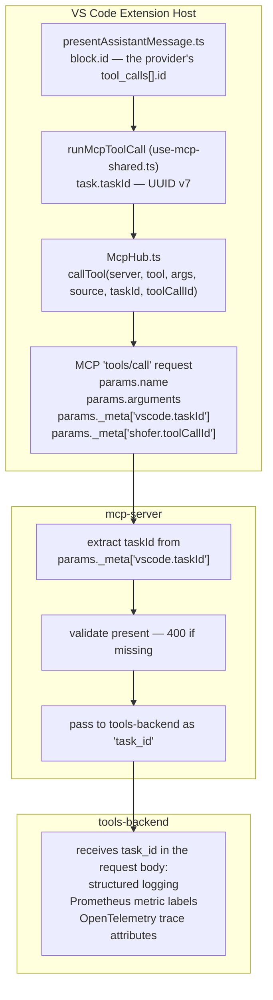

# Identifier Injection for MCP Tool Calls

## Purpose

When Shofer makes MCP `tools/call` requests, it injects two identifiers into the MCP protocol's `_meta` field so a downstream server can place the call: **which conversation it belongs to** (`vscode.taskId`) and **which of the model's tool calls it is** (`shofer.toolCallId`). The first supports logging, metrics and distributed tracing; the second lets a server that keeps its own record of executed tools match a row to the exact `tool_calls[]` entry in the transcript, rather than guessing from the tool name and timing.

## Architecture

## Design Rationale

### Why `_meta`?

The MCP protocol's `_meta` field is the standard mechanism for passing contextual metadata in `tools/call` requests. Per the MCP specification, `_meta` is an optional object that "MAY contain arbitrary metadata."

Using `_meta` avoids:

- **Argument pollution** — Extra fields in tool arguments would break third-party MCP servers that validate against strict schemas.
- **Custom headers** — MCP is a JSON-RPC protocol; metadata belongs inside the message, not in transport headers (which vary between stdio, SSE, and streamable HTTP transports).

### Why not modify tool arguments?

Third-party MCP servers define their own input schemas with `additionalProperties: false`. Injecting extra fields like `taskId` into the `arguments` object would cause schema validation failures. The `_meta` field is explicitly designed for this purpose and is silently ignored by servers that don't need it.

### Why `task.taskId`?

Shofer does not use VS Code's chat participant API (it renders its own webview), so VS Code's native `request.sessionId` is not available. Instead, Shofer uses [`task.taskId`](../packages/core/src/task/Task.ts:195) — a UUID v7, the task's canonical identity — as the correlation id carried to downstream services.

### Key holding `vscode.taskId`

Shofer injects the id under `_meta["vscode.taskId"]`. The `vscode.` prefix keeps it in the same `_meta` namespace VS Code uses for its own metadata keys; Shofer sets this key itself (it does not go through VS Code's built-in MCP client). Putting it in `_meta` rather than the tool `arguments`:

- avoids polluting third-party tool schemas (`additionalProperties: false`)
- is silently ignored by MCP servers that don't read it
- keeps the id out of the model-visible argument surface

### Key holding `shofer.toolCallId`

The provider's own id for the tool call — the `tool_calls[].id` the model emitted — travels under `_meta["shofer.toolCallId"]`. The `shofer.` prefix says who defines it: unlike `vscode.taskId`, no VS Code convention covers this key.

**It is forwarded RAW.** Shofer sanitizes the same id elsewhere: `sanitizeToolUseId` ([`packages/core/src/utils/tool-id.ts`](../packages/core/src/utils/tool-id.ts)) maps `[^a-zA-Z0-9_-]` to `_` on the `tool_result` leg, because the provider APIs validate the id they get back against that charset. A server recording the call has no such constraint, and a record is only matchable to the transcript while both hold the identical string — so sanitizing on this leg would silently produce a key matching nothing. The two legs therefore carry deliberately different forms of one id, and the tests in [`McpHub.spec.ts`](../packages/core/src/services/mcp/__tests__/McpHub.spec.ts) and [`presentAssistantMessage-mcp-tool-call-id.spec.ts`](../packages/core/src/assistant-message/__tests__/presentAssistantMessage-mcp-tool-call-id.spec.ts) pin that apart.

**Coverage.** The key is present only when the invocation originated in a native provider tool call: the dynamic `mcp_<server>_<tool>` tools, a native `use_mcp_tool` call, and `call_mcp_tool_async` (where the id names the _wrapper_ call, since that is what the model actually invoked). Anything the host synthesizes without a provider id omits the key rather than inventing a value.

## Component Reference

| Component               | File                                                                                                                                                                                                    | Role                                                                                      |
| ----------------------- | ------------------------------------------------------------------------------------------------------------------------------------------------------------------------------------------------------- | ----------------------------------------------------------------------------------------- |
| presentAssistantMessage | [`packages/core/src/assistant-message/presentAssistantMessage.ts`](../packages/core/src/assistant-message/presentAssistantMessage.ts)                                                                   | Passes the block's provider id to the MCP tools as `ToolCallbacks.toolCallId`             |
| UseMcpToolTool / shared | [`packages/core/src/tools/UseMcpToolTool.ts`](../packages/core/src/tools/UseMcpToolTool.ts) and [`packages/core/src/tools/mcp/use-mcp-shared.ts`](../packages/core/src/tools/mcp/use-mcp-shared.ts:199) | Passes `task.taskId` and `toolCallId` to `McpHub.callTool()` via `runMcpToolCall`         |
| McpHub                  | [`packages/core/src/services/mcp/McpHub.ts`](../packages/core/src/services/mcp/McpHub.ts)                                                                                                               | Injects `_meta["vscode.taskId"]` and `_meta["shofer.toolCallId"]` into MCP request params |
| mcp-server handler      | `mcp-server/internal/handlers/mcp.go`                                                                                                                                                                   | Extracts and validates `taskId` from `_meta` in `handleToolCall`                          |
| mcp-server backend      | `mcp-server/internal/services/backend.go`                                                                                                                                                               | Forwards as `task_id` to tools-backend                                                    |
| IDs documentation       | `docs/IDs.md`                                                                                                                                                                                           | System-wide ID architecture overview                                                      |

## Compatibility

All compliant MCP servers accept the `_meta` field per the MCP specification. Servers that don't use it silently ignore it. This approach is analogous to an HTTP proxy adding an `X-Request-Id` header — compliant servers ignore what they don't need.

## Gaps & Improvement Areas

### Async MCP path not covered

The async MCP path (`call_mcp_tool_async` → `check_mcp_call_status` / `wait_for_mcp_call`) passes the same `taskId` and `toolCallId` to `McpHub.callTool()`, but this document describes the flow in terms of the synchronous path only. A future update could walk the async path explicitly — in particular that its `toolCallId` is the wrapper tool's id, so the executed MCP tool's name and the narrated tool name differ for those calls.

### No telemetry integration

The `taskId` is injected into `_meta` and forwarded as `task_id` to tools-backend, but there is no documentation of whether/how this ID surfaces in telemetry events (`TelemetryService.captureMcp*`). If the telemetry events for MCP tool calls include the `task_id`, that should be documented here for completeness.

### `mcp-server` standalone mode

In standalone mode, the `workspaceId` field is optional and the `workspace_id` field in the tools-backend request body is populated from the `DEFAULT_WORKSPACE_ID` environment variable instead of the MCP request params. This mode is not documented in the current flow description. The document should clarify how `taskId` propagation works in standalone mode vs. normal mode.
