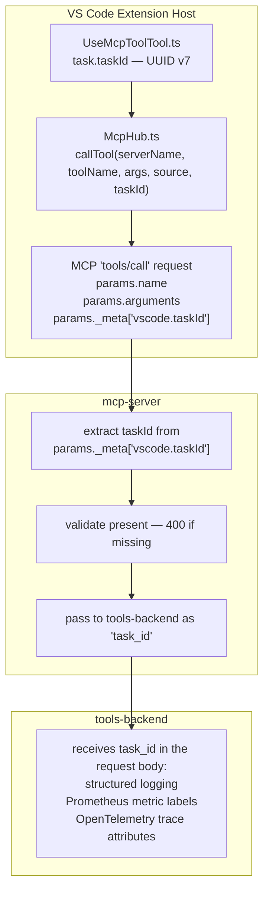

# Task ID Injection for MCP Tool Calls

## Purpose

When Shofer makes MCP `tools/call` requests, it injects a `taskId` into the MCP protocol's `_meta` field so that downstream services (mcp-server, tools-backend) can correlate tool calls with the originating conversation for logging, metrics, and distributed tracing.

## Architecture

## Design Rationale

### Why `_meta`?

The MCP protocol's `_meta` field is the standard mechanism for passing contextual metadata in `tools/call` requests. Per the MCP specification, `_meta` is an optional object that "MAY contain arbitrary metadata."

Using `_meta` avoids:

- **Argument pollution** — Extra fields in tool arguments would break third-party MCP servers that validate against strict schemas.
- **Custom headers** — MCP is a JSON-RPC protocol; metadata belongs inside the message, not in transport headers (which vary between stdio, SSE, and streamable HTTP transports).

### Why not modify tool arguments?

Third-party MCP servers define their own input schemas with `additionalProperties: false`. Injecting extra fields like `taskId` into the `arguments` object would cause schema validation failures. The `_meta` field is explicitly designed for this purpose and is silently ignored by servers that don't need it.

### Why `task.taskId`?

Shofer does not use VS Code's chat participant API (it renders its own webview), so VS Code's native `request.sessionId` is not available. Instead, Shofer uses [`task.taskId`](../packages/core/src/task/Task.ts:195) — a UUID v7, the task's canonical identity — as the correlation id carried to downstream services.

### Key holding `vscode.taskId`

Shofer injects the id under `_meta["vscode.taskId"]`. The `vscode.` prefix keeps it in the same `_meta` namespace VS Code uses for its own metadata keys; Shofer sets this key itself (it does not go through VS Code's built-in MCP client). Putting it in `_meta` rather than the tool `arguments`:

- avoids polluting third-party tool schemas (`additionalProperties: false`)
- is silently ignored by MCP servers that don't read it
- keeps the id out of the model-visible argument surface

## Component Reference

| Component               | File                                                                                                                                                                                                    | Role                                                             |
| ----------------------- | ------------------------------------------------------------------------------------------------------------------------------------------------------------------------------------------------------- | ---------------------------------------------------------------- |
| UseMcpToolTool / shared | [`packages/core/src/tools/UseMcpToolTool.ts`](../packages/core/src/tools/UseMcpToolTool.ts) and [`packages/core/src/tools/mcp/use-mcp-shared.ts`](../packages/core/src/tools/mcp/use-mcp-shared.ts:199) | Passes `task.taskId` to `McpHub.callTool()` via `runMcpToolCall` |
| McpHub                  | [`src/services/mcp/McpHub.ts`](../src/services/mcp/McpHub.ts:1853)                                                                                                                                      | Injects `_meta["vscode.taskId"]` into MCP request params         |
| mcp-server handler      | [`mcp-server/internal/handlers/mcp.go`](../../mcp-server/internal/handlers/mcp.go:344)                                                                                                                  | Extracts and validates `taskId` from `_meta` in `handleToolCall` |
| mcp-server backend      | [`mcp-server/internal/services/backend.go`](../../mcp-server/internal/services/backend.go:178)                                                                                                          | Forwards as `task_id` to tools-backend                           |
| IDs documentation       | [`docs/IDs.md`](../../docs/IDs.md)                                                                                                                                                                      | System-wide ID architecture overview                             |

## Compatibility

All compliant MCP servers accept the `_meta` field per the MCP specification. Servers that don't use it silently ignore it. This approach is analogous to an HTTP proxy adding an `X-Request-Id` header — compliant servers ignore what they don't need.

## Gaps & Improvement Areas

### Architecture diagram label

The architecture diagram at line 13 labels the two extension-host boxes as `UseMcpToolTool.ts` and `McpHub.ts`. The actual `callTool` invocation with `task.taskId` happens in [`use-mcp-shared.ts`](../packages/core/src/tools/mcp/use-mcp-shared.ts:199) (called by `UseMcpToolTool`). The diagram could be updated to show `runMcpToolCall` (in `use-mcp-shared.ts`) instead of `UseMcpToolTool.ts` to accurately reflect the call chain.

### Async MCP path not covered

The async MCP path (`call_mcp_tool_async` → `check_mcp_call_status` / `wait_for_mcp_call`) also passes `task.taskId` as `taskId` to `McpHub.callTool()`. This document only covers the synchronous `use_mcp_tool` path. A future update could include coverage of the async path's `taskId` flow.

### No telemetry integration

The `taskId` is injected into `_meta` and forwarded as `task_id` to tools-backend, but there is no documentation of whether/how this ID surfaces in telemetry events (`TelemetryService.captureMcp*`). If the telemetry events for MCP tool calls include the `task_id`, that should be documented here for completeness.

### `mcp-server` standalone mode

In standalone mode, the `workspaceId` field is optional and the `workspace_id` field in the tools-backend request body is populated from the `DEFAULT_WORKSPACE_ID` environment variable instead of the MCP request params. This mode is not documented in the current flow description. The document should clarify how `taskId` propagation works in standalone mode vs. normal mode.
