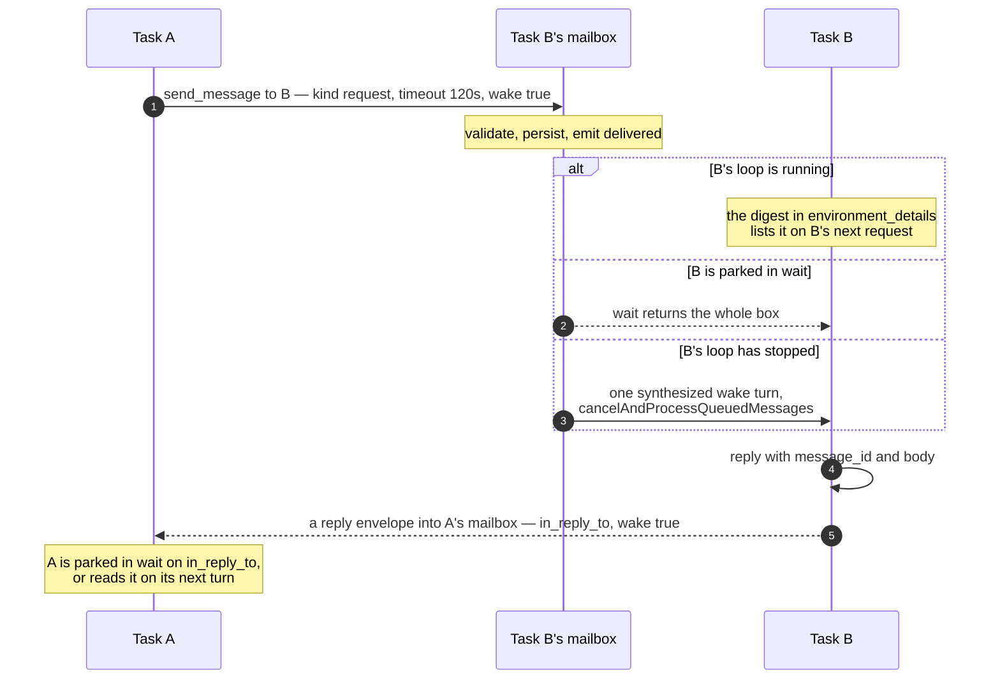
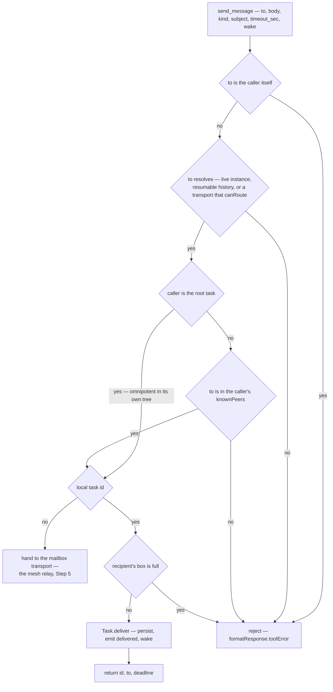
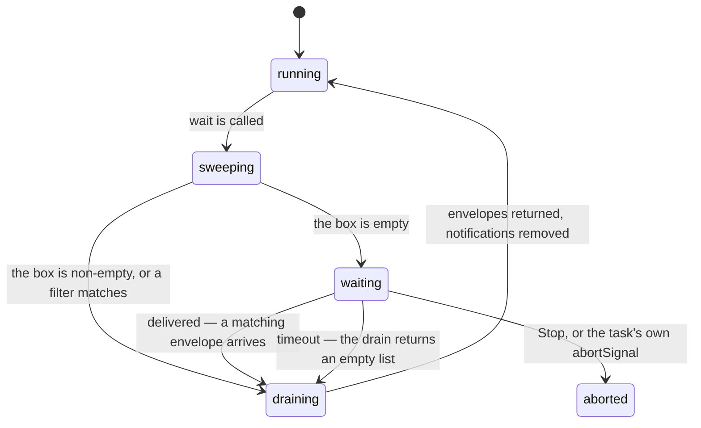
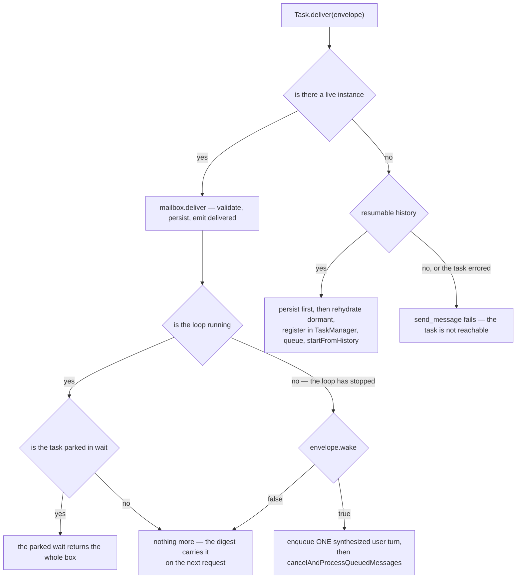
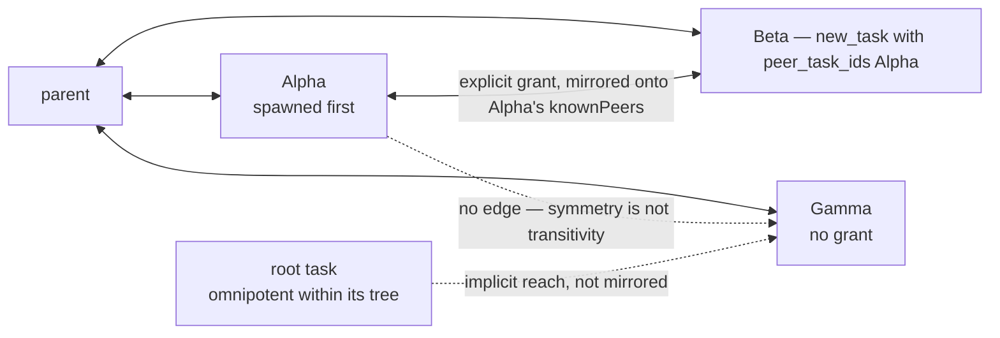
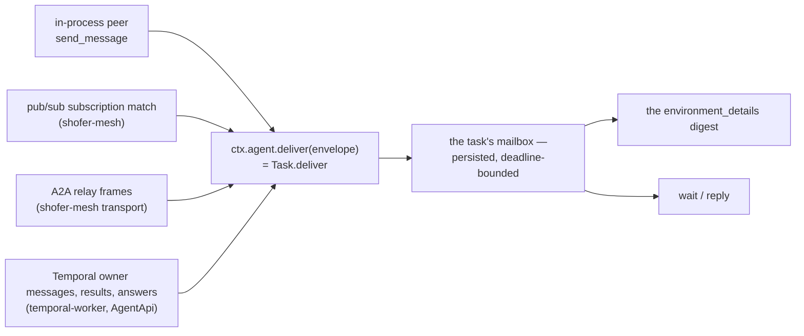

# Task Messaging — the mailbox

**Status:** the mailbox is the **target** design for every message that reaches a
task, on all four planes. **Built:** nothing of it yet — the running code is the
peer-messaging path this document replaces. **Target:** everything below. The
migration runs as the ordered steps in [Roadmap](#roadmap) at the end of this
document, which is the per-step register: step 0 (this document) is done, step 1
(the mailbox core) is in progress, steps 2–6 are owed. A symbol marked
"(Step N)" does not exist yet.

Every task owns a **mailbox**. A message is an **envelope**. Three tools —
`send_message`, `reply`, `wait` — are the whole agent-facing surface, and the
same mailbox receives from every plane a message can arrive on: in-process
peers, the platform event bus, the A2A mesh, and the Temporal work plane.

## Why

One primitive replaces four mechanisms that each solved a slice of the same
problem and disagreed at the seams:

- **One way to send.** A message either expects an answer or it does not, and
  that is a field on the envelope, not a different tool and not a different
  delivery machine. The sender never picks a queue, a door, or a prompt slot.
- **The sender never blocks on the recipient's schedule.** Sending returns
  immediately; the sender that needs the answer _now_ calls `wait`, and the
  sender that does not simply ends its turn — a `wake` delivery brings it back.
  A blocked task can neither answer its own children nor cancel them nor
  coordinate, so nothing in this design blocks a task except its own explicit
  `wait`.
- **Answering does not end the answerer.** A reply is the `reply` tool. A task
  can serve a hundred requests and keep working.
- **A busy recipient is the normal case, not an error.** There is no busy gate:
  a message to a running task lands in its box and shows up in the digest on its
  next request. `waiting` — parked in `wait` — is the _most_ receptive state a
  task can be in.
- **Delivery is bounded and durable.** Every envelope carries an absolute
  deadline and the box is persisted, so nothing is silently dropped and nothing
  accumulates forever.

## The model

### The envelope

Declared once as a Zod schema in `@shofer/types`
(`packages/types/src/mailbox.ts`, exported from the package index — **Step 1**)
and consumed everywhere via `z.infer`; no hand-written duplicate of this shape
exists in any consumer (Native Tool Implementation Rule,
[`adding-new-tools.md`](adding-new-tools.md)).

```ts
export const mailboxKindSchema = z.enum(["notification", "request", "reply"])

export const envelopeSchema = z.object({
	id: z.string(), // sender-minted UUIDv4; the A2A message_id (idempotency key)
	from: z.string(), // task id (in-process / A2A), tag address (bus), or an owner label (Temporal)
	to: z.string(), // recipient task id
	kind: mailboxKindSchema,
	in_reply_to: z.string().optional(), // required when kind === "reply"
	subject: z.string().max(120), // provided, or derived from the body
	body: z.string(),
	deadline: z.number(), // epoch ms, absolute
	wake: z.boolean(), // does this delivery resume a stopped loop
	sent_at: z.number(), // epoch ms
	plane: z.enum(["local", "bus", "a2a", "temporal"]), // informational; rendered in the digest
	read_at: z.number().optional(), // set when returned in full by `wait`
})
export type Envelope = z.infer<typeof envelopeSchema>
```

Three fields carry the whole semantic weight:

- **`kind`.** A `notification` expects nothing back. A `request` expects a
  `reply` correlated by `in_reply_to`. A `reply` is produced only by the `reply`
  tool — never by `attempt_completion`, which is a task's own terminal state and
  has nothing to do with answering a peer.
- **`deadline` is absolute** (epoch ms), not a duration. Every read surface
  renders the **remaining** time, computed at read time as
  `remaining_sec = max(0, deadline - now) / 1000`. A duration would be wrong the
  moment it was persisted, and the digest — which is re-rendered every turn —
  would show a countdown that never counts down.
- **`wake` is chosen by the sender**, because the sender is the only party that
  knows whether this message is worth resuming a stopped loop for. Defaults:
  `request` → `true`, `notification` → `false`, `reply` → always `true`. Locally
  the flag is authoritative; across a trust boundary (A2A) it is a _request_ the
  receiving host polices — see [A2A](#plane-2--a2a).

`subject` is optional on the wire: absent, it is derived from the first 80
characters of `body`, whitespace-collapsed, and capped at 120 characters. The
digest is a list of subjects, so every envelope must have one.

### The mailbox

`packages/core/src/mailbox/Mailbox.ts` (**Step 1**) — one per task, owned by
[`Task`](../packages/core/src/task/Task.ts) exactly as `messageQueueService` is,
an `EventEmitter` with a single `delivered` event.

| Operation                            | What it does                                                                                                                                                                                                                            |
| ------------------------------------ | --------------------------------------------------------------------------------------------------------------------------------------------------------------------------------------------------------------------------------------- |
| `deliver(env)`                       | validates the envelope, refuses when the box is full or when `env.to !== taskId`, appends, persists, emits `delivered`. **Idempotent on `id`** — a duplicate id is acknowledged and not appended, which is what makes an A2A retry safe |
| `sweep(now)`                         | drops every envelope past its deadline. Called at the start of every read — expiry is **lazy**, there are no timers                                                                                                                     |
| `digest(now)`                        | the rows rendered into `environment_details`: unread notifications and unanswered requests                                                                                                                                              |
| `drain(now)`                         | returns every pending envelope in full and stamps `read_at` on notifications, which removes them; requests survive until replied                                                                                                        |
| `resolveRequest(id)`                 | removes a request because it is being answered, and returns it — its `from` is the reply's `to`. Errors on an unknown or expired id                                                                                                     |
| `persist()` / `Mailbox.load(taskId)` | see [Persistence](#persistence)                                                                                                                                                                                                         |

### Lifecycle of an envelope



The five verbs, stated as rules:

1. **Deliver.** An envelope is accepted or refused, never dropped. Refusal is an
   error to the sender (an unroutable `to`, a full box), so a sender is never
   left believing a message landed.
2. **Digest.** Rendering the digest removes nothing. It is a table of contents.
3. **Drain.** A notification is removed when it is **returned in full** by
   `wait` — being listed in the digest is not reading it. A request is removed
   only when it is **replied** or when it expires.
4. **Reply.** `reply` to an unknown or expired id is an error for that item:
   reject, don't drop. The replier learns its answer went nowhere.
5. **Expire.** The deadline removes the envelope at the next read. Expiry is the
   only garbage collector the box has, besides the cap.

Defaults, all of them tunable in one place (`packages/types/src/mailbox.ts`,
**Step 1**):

| Default                                  | Value                                            |
| ---------------------------------------- | ------------------------------------------------ |
| `request` deadline                       | 120 s                                            |
| `notification` deadline                  | 600 s                                            |
| a child question forwarded to its parent | 600 s                                            |
| `wait` timeout                           | 120 s                                            |
| mailbox cap                              | 200 envelopes — a send to a full box is rejected |
| `subject` cap                            | 120 characters                                   |
| digest rows                              | 20, then `+K more — call wait(timeout_sec=0)`    |

### The three tools

All three are **always available** — no mode gates them — and all three are
auto-approved ([Auto-approval](#auto-approval)). None of them blocks anything
but the caller's own loop.

#### `send_message`

| Param         | Type                            | Required | Notes                                                                                                                     |
| ------------- | ------------------------------- | -------- | ------------------------------------------------------------------------------------------------------------------------- |
| `to`          | string                          | ✅       | task id — local ([`TaskManager`](../src/services/task-manager/TaskManager.ts)) or remote (the mesh transport, **Step 5**) |
| `body`        | string                          | ✅       |                                                                                                                           |
| `kind`        | `"notification"` \| `"request"` | –        | default `notification`. A `reply` is never sent with this tool                                                            |
| `subject`     | string                          | –        | derived from `body` when absent                                                                                           |
| `timeout_sec` | number                          | –        | `deadline = now + timeout_sec`; defaults per kind                                                                         |
| `wake`        | boolean                         | –        | defaults per kind                                                                                                         |

Validation runs in this order, and each failure is its own error message:



**There is no busy gate.** The recipient's lifecycle is not consulted at all,
except to decide how the delivery is _announced_ ([Wake](#wake)).

Returns `{ id, to, deadline }`; the result text reads
`Sent <kind> <id> to <to> ("<subject>"); expires in <n>s.`

#### `reply`

| Param     | Type                     | Required | Notes                                   |
| --------- | ------------------------ | -------- | --------------------------------------- |
| `replies` | `[{ message_id, body }]` | ✅       | a batch; each item resolves one request |

For each item: `mailbox.resolveRequest(message_id)` removes the request from the
replier's own box and yields the original envelope, whose `from` becomes the
reply's `to`. The reply envelope carries `in_reply_to = message_id`,
`wake: true`, and a deadline of the request's deadline or `now + 120 s`,
whichever is later — a reply must outlive the question it answers, or a slow
answer expires in transit. Each item reports its own outcome, so one expired id
fails one item and not the batch.

#### `wait`

| Param         | Type     | Required | Notes                                                           |
| ------------- | -------- | -------- | --------------------------------------------------------------- |
| `timeout_sec` | number   | –        | default 120; `0` means "check the box and return"               |
| `from`        | string[] | –        | wake condition: return when a message from any of these arrives |
| `in_reply_to` | string   | –        | wake condition: return when the reply to this id arrives        |

`wait` **drains the whole box** in one call. If the box is non-empty it returns
immediately with every pending envelope — full bodies, each with its computed
`remaining_sec`. If it is empty it parks, event-driven and never polling, until
the first delivery or its timeout, and then returns everything present. The
filters are the **wake condition only**: they decide when a parked `wait`
returns, never what it returns. A timeout with an empty box returns an empty
list and is **not an error**.



Entering `wait` puts the task in the `waiting` lifecycle and returning puts it
back in `running` ([`task_states.md`](task_states.md)). The park is an
`AbortController` raced against `mailbox.once("delivered")` and the task's
`abortSignal`, per the Cooperative Cancellation Rule, so a Stop tears the
listeners and the timer down rather than leaking them.

Every envelope `wait` returns also emits a `peer_message` say row
([`ChatRow.tsx`](../webview-ui/src/components/chat/ChatRow.tsx)), so the human
sees what the agent read and when it read it.

**`wait` subsumes sleeping.** `wait(timeout_sec=N)` on an empty box returns at N
seconds and returns _earlier_ if mail arrives, which is what every polling loop
actually wanted.

### Rewired tools

Three existing tools keep their names and their meaning and change where their
output goes.

- **[`attempt_completion`](../packages/core/src/tools/AttemptCompletionTool.ts)** —
  a task's own terminal state, and nothing else. For a task with a
  `parentTaskId` it persists the result on the child's own history **and**
  delivers a `notification` to the parent's mailbox: `from` the child, subject
  `result: <child title>`, body the result capped at
  `MAX_SUBTASK_RESULT_LENGTH`, `wake: true`. For a root task it is unchanged —
  the result goes to the user through the completion UI. It resolves no peer and
  resumes no blocked parent, because nothing blocks.
- **[`ask_followup_question`](../packages/core/src/tools/AskFollowupQuestionTool.ts)** —
  the **host** chooses the route; the agent never does. A root task's question
  goes to the user, unchanged. A child's question is delivered as a `request` to
  its parent's mailbox (subject `question: <first line>`, body the question plus
  its suggestions, the child-question deadline) **and** raised in the child's own
  chat as it is today. The two channels are deliberate: the human may answer in
  the child's chat, the parent may answer with `reply`, and **the first answer
  wins** — a parent's `reply` answers the parked ask through the same webview
  ask-response path, and a human's answer resolves the request out of the
  parent's box. On expiry the child's ask behaves like any timed-out ask. The
  child sits in `waiting_input` throughout: it is parked on an answer, not on
  mail.
- **[`new_task`](../packages/core/src/tools/NewTaskTool.ts)** — always spawns a
  concurrent child. There is no foreground mode and no focus steal. A parent
  that wants the result calls `wait`; a parent that wants to answer questions
  simply keeps running, which it now always can. `peer_task_ids`, titles, the
  soft limits and the parallel-task limit are unchanged
  ([`parallelism.md`](parallelism.md)).

### Wake

`Task.deliver(env)` is a thin wrapper over `mailbox.deliver` plus the decision
of whether the recipient has to be told _now_:



Three things about the stopped-loop path are load-bearing:

- **The wake turn is one fixed sentence, and it is plain text** — _"You have new
  mail. Call `wait(timeout_sec=0)` to read it; the digest in
  `environment_details` lists it."_ It carries no content of its own, because
  `Task.ask()` drains `MessageQueueService` for tool and command asks as an
  auto-approve, and a synthesized turn must never be mistakable for an approval.
- **It coalesces.** If a synthesized wake turn is already queued and not yet
  drained, a second delivery adds nothing — one turn tells the agent to read a
  box that already holds both messages.
- **Rehydration is dormant-first**: persist the envelope, rehydrate with
  `createTaskWithHistoryItem(historyItem, { startTask: false })`, load the
  mailbox, queue the turn, then `startFromHistory()`. A fire-and-forget start
  races the queue. The rehydrated instance must also be registered in
  [`TaskManager`](../src/services/task-manager/TaskManager.ts) explicitly —
  `createTaskWithHistoryItem` pushes onto the stack only, so an unregistered
  rehydrate is unreachable by the next sender.

### Persistence

One JSON file per task, next to its history (`<taskDir>/mailbox.json`), written
by the `Mailbox` on every mutation and loaded in the `Task` constructor
(**Step 1**). Envelopes deliberately do **not** live on `HistoryItem`:
`taskState` on that row has a single writer
([`TaskManager`](../src/services/task-manager/TaskManager.ts)) and the history
writes are fire-and-forget, so a second writer would race it. Deadlines plus the
cap bound the file. The `peer_message` say rows stay in the chat history as the
human-visible record of what was read.

Persistence is what makes `wake` to a task with no live instance work at all:
the envelope is on disk before the rehydrate begins, so the resumed task loads a
box that already contains it.

### The digest, and why it is not in the system prompt

`packages/core/src/environment/getEnvironmentDetails.ts` gains a `# Mailbox`
section rendered from `mailbox.digest(now)` (**Step 1**):

```
# Mailbox (3 pending — call wait(timeout_sec=0) to read; reply(...) answers a request)
- 7c1e… · from task 9f2a… ("Analyze auth") · request · "Which tables does UserService use?" · 47s left (deadline 2026-08-28T10:11:12Z) · awaiting your reply
- b0d4… · from tag:resource:vm-12 · notification · "vm-12 entered Ready" · 8m left
- e55a… · from task 1a77… ("Orchestrator") · reply to 3d9c… · "Use the staging DB" · 1m left
```

**The digest goes in `environment_details`, never in the system prompt.** The
system prompt is the provider's prompt-cache prefix; a digest with per-second
countdowns would invalidate that prefix on every single request, at every
provider, for every task that has ever received a message.
`environment_details` already changes per turn — it carries the clock — so the
digest costs nothing there. The system prompt also gets built for the
**summarizer** (context condensation and forced truncation), which is a second
reason nothing per-turn belongs in it: a per-turn state consumed by the
summarizer is a state the agent never sees.

Rendering the digest removes nothing, so a message listed there is still there
after the turn. Reading is `wait`.

### `waiting` versus `waiting_input`

Two lifecycle states, one distinction ([`task_states.md`](task_states.md)):

| State           | Means                                                                               | Left by                      |
| --------------- | ----------------------------------------------------------------------------------- | ---------------------------- |
| `waiting`       | parked in `wait`, on the mailbox                                                    | any delivery, or the timeout |
| `waiting_input` | parked on an **ask** — a human's answer, or a parent answering a forwarded question | the ask being answered       |

`waiting` is the most receptive state a task has, not one that refuses mail: a
task parked in `wait` receives its box the instant anything lands in it, which
is the whole reason the tool has no busy gate to inherit.

### The ACL

The mailbox changes how messages move, not who may send them. In-process the
gate is `knownPeers`, unchanged:

- a send is refused unless the caller and target share a `rootTaskId`;
- a sub-task may address only the ids in its `knownPeers` set, which is seeded at
  construction (parent, plus any `peer_task_ids` granted at spawn) and extended
  as it spawns children;
- `peer_task_ids` grants are **symmetric** — a grant writes the reverse edge onto
  the named peer, so one grant opens a two-way channel — and **not transitive**;
- the **root task is omnipotent within its own tree** and needs no grant; that
  reach is one-way, so a task the root addresses can reply only if it
  independently holds the root in its own set;
- grants are persisted on `HistoryItem.peerIds` and rehydrated with the task.



Remote sends are gated by the message-broker, which is unchanged by the mailbox:
its A2A facet authorizes tier × scope × capability and writes the
ledger row for each verb. The mailbox is _delivery_; that ledger is the
_record and the backstop_.

### The human's conversation is not the mailbox

[`MessageQueueService`](../packages/core/src/message-queue/MessageQueueService.ts)
— the webview Send / Send Now path, drafts, and the FIFO ordering under the
`askResponse` race — stays exactly as it is
([`message_queue.md`](message_queue.md)). **A human message is a turn, not an
envelope**: the human is a participant in the conversation, not a peer with an
address, and forcing their input through a box with a deadline would be a
downgrade in every respect. The two mechanisms meet at exactly one point: a
`wake` delivery to a stopped loop is implemented by enqueueing one synthesized
user turn on that queue and kicking the existing, tested wake path.

### Chat rendering and i18n

- An outbound `send_message` renders through the existing
  `askApproval("tool", …)` path with a dedicated `ChatRow` case and locale
  strings in `webview-ui/src/i18n/locales/*/chat.json` (**Step 2**).
- `wait` renders as `wait_for_task` does today; `reply` renders one row per item.
- Inbound reads reuse the `peer_message` say and its `ChatRow` case, which
  already exist.

All user-facing strings are localized (i18n String Rule). The envelope body is
agent-facing text and is exempt.

### Telemetry

Typed `TelemetryService` wrappers only (Telemetry Capture Rule,
[`telemetry.md`](telemetry.md)) — **Step 2**:

| Capture                   | Labels                  | Point                                                   |
| ------------------------- | ----------------------- | ------------------------------------------------------- |
| `captureMailboxSent`      | `kind`, `plane`, `wake` | the sending tool, after `deliver` returns               |
| `captureMailboxDelivered` | `kind`, `plane`, `woke` | `Task.deliver`, once the box has accepted and persisted |
| `captureMailboxRead`      | `count`                 | `wait`, per returned batch                              |
| `captureMailboxExpired`   | `kind`                  | `sweep`                                                 |

## Per-plane mapping

Whatever plane a message arrives on, it enters a task through **one door** —
`ctx.agent.deliver(envelope)` on the plugin API (**Step 4**), which is
`Task.deliver`. There is no delivery MODE to choose. `wake` decides whether a
stopped loop is resumed and `deadline` decides how long the message is worth
delivering at all — both per message, set by whoever sent it, rather than fixed
per subscription.



| Plane              | What becomes an envelope                                                                    | `kind`                               | `from`                    | `wake` and deadline from                                                                  |
| ------------------ | ------------------------------------------------------------------------------------------- | ------------------------------------ | ------------------------- | ----------------------------------------------------------------------------------------- |
| **0 — in-process** | a peer's `send_message`, and the `reply` it draws                                           | `notification` / `request` / `reply` | the sending task id       | the sender's own `wake` / `timeout_sec`, defaulted per kind                               |
| **1 — pub/sub**    | a subscription's selector match                                                             | `notification` only                  | the tag address           | the subscription's `wake` and `ttl_sec`                                                   |
| **2 — A2A**        | an `a2a_sync_request` or `a2a_notify` frame                                                 | `request` / `notification`           | the remote `from_task_id` | the exchange's reply timeout; the sender's `wake` is a request the receiving host polices |
| **3 — Temporal**   | a pending `agentTaskMessage`, and owner-bound results and answers through the AgentApi door | `notification`                       | `sentBy`, else `owner`    | `wake: true`; the host's notification default                                             |

### Plane 0 — in-process

`send_message` resolves `to` through
[`TaskManager`](../src/services/task-manager/TaskManager.ts) (rehydrating from
history when there is no live instance) and calls `Task.deliver`. The ACL is
[`knownPeers`](#the-acl).

### Plane 1 — pub/sub, inbound only

A selector match in the `shofer-mesh` plugin becomes a `notification` envelope
whose `from` is the tag address and whose deadline is the subscription's TTL
(**Step 4**). A subscription's delivery configuration becomes
`{ wake: boolean, ttl_sec: number, spawn?: boolean }` — `spawn` survives as a
_subscription option_ ("create a task, then deliver with `wake: true`") for
events that are their own unit of work, not as a delivery door. The outbound
`events_*` verbs are unchanged: they are tag-addressed and expect no reply, so
they are not mailbox traffic.

### Plane 2 — A2A

The mailbox one hop wider (**Steps 4 and 5**). Inbound, an `a2a_sync_request`
frame becomes a `request` envelope whose `id` is the frame's `message_id` — so
the relay's idempotency key and the mailbox's are the same key, and a retry is
acknowledged rather than re-delivered — and the `a2a_sync_ack` is sent when
`deliver` returns, which makes the receipt mean "persisted in the box" rather
than "seen by a plugin". An `a2a_notify` becomes a `notification` carrying the
claim id.

Outbound, the mesh plugin registers a **mailbox transport** with the host —
`{ canRoute(to), send(envelope) }` — and `send_message` with a `to` that no local
lookup resolves is handed to it. The recipient's `reply` travels back the same
way and lands in the sender's mailbox through `deliver`. That is what lets the
five `agents_*` messaging verbs disappear into the core three:

| Was                               | Is                                                    |
| --------------------------------- | ----------------------------------------------------- |
| `agents_send(wait: true)`         | `send_message(kind: "request")` + `wait(in_reply_to)` |
| `agents_send(wait: false)`        | `send_message(kind: "notification")`                  |
| `agents_request`                  | `send_message(kind: "request")`                       |
| `agents_get_response`             | `wait(in_reply_to)`                                   |
| `agents_respond` / `agents_reply` | `reply`                                               |
| `agents_discover`                 | unchanged — the directory is not messaging            |

`wake` across the trust boundary is the receiving host's decision, not the
sender's: the default is that a remote delivery never wakes a finished task, and
loosening it is a config key on the mesh plugin, recorded in its `DESIGN.md`.
Broker enforcement, `message_id` idempotency, seen-windows and the
`agent_messages` ledger are untouched.

### Plane 3 — Temporal, inbound only

**The work plane delivers into the mailbox and is never a target.** A pending
`agentTaskMessage` becomes a `notification` envelope with the message id as the
envelope id, and the workflow's `agentTaskMessageDelivered` signal fires once
`deliver` returns — the ack means "in the box" (**Step 4**). Results and answers
travelling _up_ to an L2 owner reach the host through
`POST /api/v1/task/:id/mailbox` on the AgentApi
([`src/extension/api.ts`](../src/extension/api.ts), beside `resumeAndDeliver` —
**Step 1**), which validates an envelope and calls `Task.deliver`.
`POST /api/v1/task/:id/message` remains the controller/human **turn** door and is
not touched.

The mailbox **must not accept a workflow as `to`**. The `temporal_*` tools stay
workflow-addressed and binding-resolved; letting an envelope name a workflow
would be covert A2A, which is exactly what that binding exists to prevent.

### Approvals are on no plane

**An approval never enters a mailbox**, on any plane. A question escalates
hop-by-hop — a parent that cannot answer forwards it as its own request — but an
approval-kind item goes only to the human who holds the authority to grant it.
An agent-plane answer to an approval is refused, not delivered.

## Deadlock and liveness

Nothing here blocks except a task's own `wait` — sending is always immediate —
and four properties keep even that safe:

1. **Every envelope has a mandatory deadline, and every `wait` has a mandatory
   timeout.** Neither can be disabled. A `wait` that reaches its timeout returns
   an empty list and the agent keeps working.
2. **`wait` returns on ANY message**, not only on the one the filter names. Two
   tasks waiting on each other cannot both be starved: the first delivery in
   either direction unparks its recipient, and the filters only decide _when_,
   never _what_.
3. **Every parent can always answer its children.** A parent is never suspended
   inside a spawn, so a child's forwarded question always has a live audience —
   and the human is a second, concurrent audience for the same ask.
4. **Answering costs the answerer nothing.** `reply` is not terminal, is
   auto-approved, and can be called in the same turn the request is read. A
   circular wait resolves as soon as either side reads its box.

`cancel_tasks` remains the parent's last resort for a child that is genuinely
stuck, and remains parent-only.

## Auto-approval

| Tool           | Auto-approved     | Rationale                                                                                                                 |
| -------------- | ----------------- | ------------------------------------------------------------------------------------------------------------------------- |
| `send_message` | ✅ always         | no side effect on the sender; the recipient decides whether and how to answer. No more privileged than a peer status read |
| `reply`        | ✅ always         | answers a request the task already holds; not terminal                                                                    |
| `wait`         | ✅ always         | blocks only the caller's own loop, under a mandatory timeout                                                              |
| `new_task`     | unchanged         | spawns concurrent work                                                                                                    |
| `cancel_tasks` | unchanged — gated | destructive, and parent-only                                                                                              |

The `alwaysAllowSubtasks` gate on _sending_ is removed: there is no blocking
send left for it to guard ([`auto_approval.md`](auto_approval.md)).

## Edge cases

| Situation                                                  | Behaviour                                                                                                                                                                                                                                                              |
| ---------------------------------------------------------- | ---------------------------------------------------------------------------------------------------------------------------------------------------------------------------------------------------------------------------------------------------------------------- |
| **`reply` to an expired or unknown `message_id`**          | that item fails with an error — reject, don't drop. The replier learns the answer went nowhere, and the rest of the batch still lands                                                                                                                                  |
| **A reply whose sender has since vanished**                | the reply sits in the sender's persisted box until its own deadline, and is delivered if the sender is ever resumed. Nothing is discarded because the sender happened to stop                                                                                          |
| **`wake` to a task that already completed to the user**    | resumable history means it is rehydrated dormant, the box is loaded, the wake turn is queued and the loop restarts. A task in the `error` lifecycle, or one with no history, is not reachable — `send_message` fails with that error rather than pretending to deliver |
| **A human answers a child's question in the child's chat** | the ask is settled and the forwarded `request` is resolved out of the parent's box, so the parent's digest stops showing a question nobody is waiting on. First answer wins, whichever side it comes from                                                              |
| **The recipient's box is full**                            | the send is rejected with an explicit error. A silently truncated box would lose exactly the message someone is waiting for                                                                                                                                            |
| **A duplicate envelope id**                                | acknowledged and not appended. This is what makes an A2A retry, or a redelivered Temporal message, safe to replay                                                                                                                                                      |
| **Sending to yourself**                                    | rejected at validation                                                                                                                                                                                                                                                 |
| **Sending across roots**                                   | rejected at validation — the target must share the caller's `rootTaskId`, or be reachable through a registered transport                                                                                                                                               |
| **A notification nobody reads**                            | expires at its deadline and disappears from the digest; `captureMailboxExpired` records it                                                                                                                                                                             |

## Roadmap

Each step is one commit series, green and deployed before the next, with the
docs updated in the same change as the code they describe.

| Step  | Scope                                                                                                                                                                                                                                                                                                                                                                                                                      | Unblocks                             | Status          |
| ----- | -------------------------------------------------------------------------------------------------------------------------------------------------------------------------------------------------------------------------------------------------------------------------------------------------------------------------------------------------------------------------------------------------------------------------- | ------------------------------------ | --------------- |
| **0** | this document, plus the integrator's four-plane communication map rewritten around one delivery door; `notifications.md` deleted and every link to it re-pointed                                                                                                                                                                                                                                                           | everything — the vocabulary is fixed | **done**        |
| **1** | the mailbox core: `packages/types/src/mailbox.ts`, `packages/core/src/mailbox/Mailbox.ts` and its tests, `Task` owning a mailbox with the wake logic, the `environment_details` digest, `POST /api/v1/task/:id/mailbox`. Nothing is deleted and nothing sends yet                                                                                                                                                          | step 2                               | **in progress** |
| **2** | the three tools end to end per [`adding-new-tools.md`](adding-new-tools.md), auto-approval, chat rows, locales, telemetry — and the deletion of the peer-messaging legacy: `SendMessageToTaskTool`, the `wait_for_message` alias, `SleepTool`, `Task.peerNotificationQueue` and its system-prompt drain, `ShoferProvider`'s pending-sync resolvers, the peer branch of `AttemptCompletionTool`, the old telemetry captures | step 3                               | owed            |
| **3** | parent/child on the mailbox: `new_task` loses its foreground mode, `attempt_completion` delivers the result to the parent's box, a child's question becomes a request. Deletes `AnswerSubtaskQuestionTool`, `WaitForTaskTool`, the blocking-child resolvers, the pending-parent-question state and its event                                                                                                               | step 4                               | owed            |
| **4** | the plugin API's one door: `ctx.agent.deliver` replaces `ctx.agent.notify` and its four modes; shofer-mesh's subscriptions carry `wake`/`ttl_sec`/`spawn`; A2A inbound frames and temporal-worker messages deliver into the box and ack after persistence                                                                                                                                                                  | step 5                               | owed            |
| **5** | the mesh registers the mailbox transport, `send_message`/`reply` route over the relay for non-local ids, and the five `agents_*` messaging verbs are deleted; `agents_discover` stays                                                                                                                                                                                                                                      | step 6                               | owed            |
| **6** | sweep and close: the retired vocabulary recorded in the docs-hygiene check, downstream repos' own references updated on their cadence, the CHANGELOG entry, integration-test coverage added after live verification, and this section reading "complete"                                                                                                                                                                   | —                                    | owed            |

## Related documents

- [`parallelism.md`](parallelism.md) — `new_task`, the task tree, and the
  parallel-task limits
- [`task_states.md`](task_states.md) — the lifecycle model, `waiting` and
  `waiting_input`
- [`message_queue.md`](message_queue.md) — the human's queue, which the mailbox
  does not replace
- [`native_tools.md`](native_tools.md) — the full tool reference
- [`plugin_system.md`](plugin_system.md) — the plugin host API and its one
  delivery door
- [`adding-new-tools.md`](adding-new-tools.md) — the multi-file checklist a new
  native tool follows
