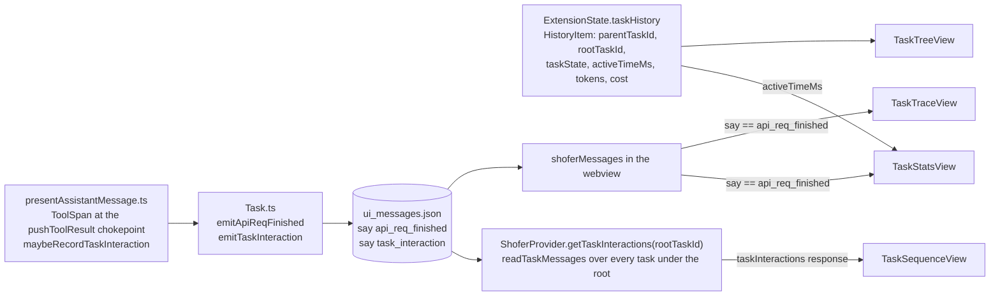
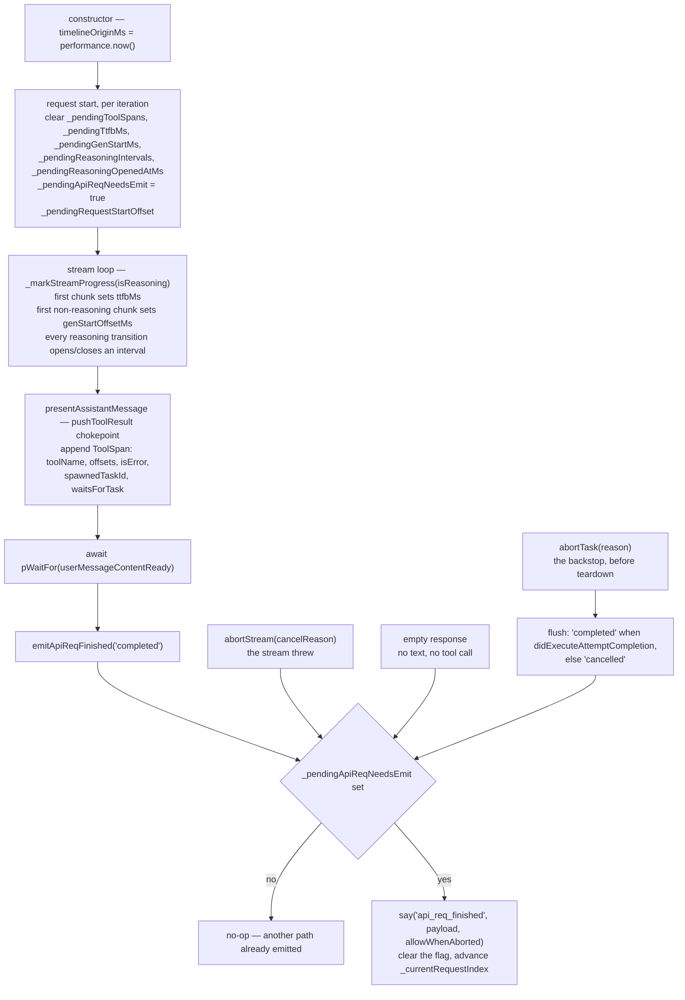

# Task Visualization

This document describes four visualizations for a Shofer Task and its subtask tree, accessible via tabs in `ChatView`:

1. **Tree** — hierarchical view showing parent/child task relationships under a common root, like `TaskSelector` renders.
2. **Sequence** — a lifeline-based sequence diagram showing task-to-task communication (spawn, message, await, answer, cancel, question) across the task tree.
3. **Trace** — a Chrome DevTools Network-panel-style waterfall for a single task, showing every API request and tool execution on a horizontal time axis.
4. **Stats** — a donut chart breaking down the focused task's active time by phase (model wait, thinking, streaming, tool execution, waiting, overhead).

The Trace and Stats share a common data model: offsets from a per-task `timelineOriginMs` recorded on each `api_req_finished` message. The Tree and Sequence draw on task identity (`taskId`/`parentTaskId`/`rootTaskId`) and inter-task interaction events.



## Tab Bar Layout

```
[ Chat ] [ Tree ] [ Sequence ] [ Trace ] [ Stats ]
```

- `"Chat"` — the existing chat message list (Virtuoso).
- `"Tree"` — the task hierarchy view.
- `"Sequence"` — the inter-task communication diagram.
- `"Trace"` — the waterfall timeline for the currently focused task.
- `"Stats"` — the active-time breakdown donut for the currently focused task.

Tab state is local to `ChatView`, reset to `"Chat"` on task switch. The tab buttons are styled `text-xs font-medium px-3 py-1 rounded` (active = `--vscode-button-background`, inactive = `transparent` with `opacity-60`).

## Scope Per Visualization

| View         | How many tasks?       | Rendering technology                          | Status                |
| ------------ | --------------------- | --------------------------------------------- | --------------------- |
| **Tree**     | All under same root   | React tree component                          | Existing data, new UI |
| **Trace**    | Single task (focused) | Custom SVG waterfall                          | v1                    |
| **Sequence** | All under same root   | Custom SVG lifelines (host-aggregated events) | v1                    |
| **Stats**    | Single task (focused) | Custom SVG donut                              | v1                    |

**Trace is single-task only.** Each task generates its own trace regardless of how tasks relate to each other (peers, parent-child). The user navigates to a different task via `TaskSelector` to see that task's trace. There is no multi-lane waterfall combining multiple tasks.

---

## 1. Tree — Task Hierarchy View

The tree view shows all tasks sharing a common root, rendering the same parent-child relationships that `TaskSelector` displays in its dropdown. It is a read-only tree (no task switching, no pin/archive — those controls live in `TaskSelector`).

### Data Source

| Field                 | From                                                                                    |
| --------------------- | --------------------------------------------------------------------------------------- |
| Task identity + title | `HistoryItem.id`; title via `getTaskDisplayName` (`set_task_title`/`name`, else prompt) |
| Tree structure        | `HistoryItem.parentTaskId`, `.rootTaskId`                                               |
| State                 | `TaskState` (lifecycle + rating)                                                        |
| Active time           | `HistoryItem.activeTimeMs`                                                              |
| Tokens + cost         | `HistoryItem.tokensIn/Out`, `.totalCost`                                                |
| Mode                  | `HistoryItem.mode`                                                                      |

All of this data already exists in `ExtensionState.taskHistory` — no new persistence needed.

### Rendering

A simple React tree component using indentation + collapse/expand for child nodes. Each row shows:

```
 ╶ search auth module          📁  2m 15s   ⸱ 12.3K tokens  ⸱ $0.04
    ├─ read UserService        📁  45s      ⸱ 1.2K tokens   ⸱ $0.01
    └─ explore call sites      ⚡  1m 12s    ⸱ 8.4K tokens   ⸱ $0.03
```

Siblings are sorted by creation time (newest first, matching `TaskSelector`), children indented under parents. Each row shows the task title (no longer a `[number]` prefix — `HistoryItem.number` is a global, deletion-sensitive index, so it was dropped as unhelpful), state dot, mode badge, active time, tokens, cost. The tree renders **all** tasks under the focused task's `rootTaskId`, not just direct children, and clicking a row navigates to that task (`focusParallelTask`).

---

## 2. Sequence — Task Interaction Diagram (v1)

A lifeline-based sequence diagram showing inter-task communication across the task tree.

> **Implemented** in [`TaskSequenceView.tsx`](../webview-ui/src/components/chat/TaskSequenceView.tsx). Because `task_interaction` events live in every task's `ui_messages.json` (not just the focused task), they're aggregated host-side via the `getTaskInteractions` request → `ShoferProvider.getTaskInteractions(rootTaskId)`, which reads every task under the root and returns the events sorted by `rootOffsetMs`. The `kind` set now also includes `"question"` (`ask_followup_question` → parent). The notes below describe the original design.

### Data Source — `TaskInteraction`

Inter-task communication is extracted from tool invocations at execution time and recorded as `say: "task_interaction"` `ShoferSay` messages in `ui_messages.json`:

See the [`TaskInteractionPayload`](#task-interaction-events) shape under Data Model. Each tool maps to a kind:

| Tool                      | Kind       | Description                             |
| ------------------------- | ---------- | --------------------------------------- |
| `new_task`                | `spawn`    | Parent → child creation                 |
| `send_message`            | `message`  | An envelope into another task's mailbox |
| `reply`                   | `answer`   | An answer to a request in the mailbox   |
| `wait_for_task`           | `await`    | Caller blocks on target                 |
| `answer_subtask_question` | `answer`   | Parent answers child's question         |
| `cancel_tasks`            | `cancel`   | Parent terminates child                 |
| `ask_followup_question`   | `question` | Child asks its parent (child → parent)  |

### Rendering

```
┌─ Task Sequence Diagram ────────────────────────────────────┐
│  Time axis ────────────────────────────────────────────────│
│                                                             │
│  [root] planner    ──┐                                      │
│                     │ spawn                                 │
│  [1]   searcher    ◄─┘  ████ (activity)                    │
│                     ├─── message ────────────────────────►  │
│  [2]   reviewer          ████████           ◄── answer ──   │
│                                                             │
└─────────────────────────────────────────────────────────────┘

── Lifelines: one vertical line per task, indented by tree depth
── Activation boxes: ██ = task is running (from ApiRequestFinishedPayload spans)
── Arrows: colored by kind (spawn=orange, message=blue, await=purple,
                            answer=cyan, cancel=red)
── Tooltips on arrows: label + duration
```

The diagram uses dashed lifeline tracks, rounded header boxes, `<marker>` arrowheads and activation boxes on both endpoints. Lifelines represent tasks, arrows represent control-plane tool invocations, and lifelines are ordered left-to-right by task creation time (root leftmost). Arrowheads use one SVG `<marker>` per kind colour so they auto-orient and land exactly on the target lifeline. Pan/zoom is shared with the Trace via the [`useSvgPanZoom`](../webview-ui/src/hooks/useSvgPanZoom.ts) hook.

### Scope

Implemented (v1). Because `task_interaction` events live in every task's `ui_messages.json` (not just the focused task), they are aggregated host-side: `getTaskInteractions` (webview → host) → [`ShoferProvider.getTaskInteractions(rootTaskId)`](../src/core/webview/ShoferProvider.ts) reads every task under the root via `readTaskMessages`, extracts the payloads, and returns them sorted by `rootOffsetMs` (the `taskInteractions` response).

---

## 3. Trace — Waterfall Timeline (v1)

The waterfall trace shows a single task's API requests and tool executions on a shared horizontal time axis with timing, cost, and error metadata. Navigate to any task via `TaskSelector` to see its trace.

### Goals

1. Show the chronological sequence of API requests and tool calls within a task as horizontal waterfall bars.
2. Provide timing data (TTFB, duration, tool execution latency) independent of provider `response_metadata` chunks — we measure our own.
3. Display per-call metadata on hover/tap: model, tokens, cost, retries, errors, wire request.
4. Build the waterfall incrementally as the task runs (live push), not just as a post-hoc export.
5. Keep the data model immutable — spans are written once, never mutated in-place.

### Design Decisions

| #   | Decision                                                                              | Rationale                                                                                                                                                                                                                                    |
| --- | ------------------------------------------------------------------------------------- | -------------------------------------------------------------------------------------------------------------------------------------------------------------------------------------------------------------------------------------------- |
| 1   | All timestamps are **offsets** from a single `timelineOriginMs`                       | Avoids epoch drift; keeps numbers small; makes the timeline self-contained                                                                                                                                                                   |
| 2   | `ApiRequestFinishedPayload` + nested `ToolSpan[]` are **written once, never mutated** | Today `api_req_started` is mutated in-place by `updateApiReqMsg`; the new model emits an immutable `api_req_finished` message and leaves `api_req_started` as a lightweight placeholder                                                      |
| 3   | Stored in **`ui_messages.json`** as an `api_req_finished` `ShoferSay`                 | `api_req_finished` already exists in [`shoferSaySchema`](../packages/types/src/message.ts:190); extends `ui_messages.json` instead of introducing a new file — one read path, leverages existing message ordering, no separate persistence   |
| 4   | **Our own** TTFB computation                                                          | Fallback when the llm-provider doesn't emit `response_metadata`; use stream delta from request start to first content-bearing chunk                                                                                                          |
| 5   | `ToolSpan.resultSizeChars` for response-size analog                                   | Mirrors Chrome's "Size" column for tool results                                                                                                                                                                                              |
| 6   | **Incremental IPC push** via existing message pipeline                                | `api_req_finished` messages are pushed to the webview as they're emitted — `ChatView`'s existing `addToShoferMessages` → `postStateToWebview` path delivers them; `TaskTraceView` filters `say === "api_req_finished"` from `shoferMessages` |

No backward compatibility is preserved. Existing `api_req_started` mutation code (`updateApiReqMsg`) will be simplified to only emit the placeholder; timing/cost/error data flows into the new `api_req_finished` message instead. The `shoferSaySchema` already includes `"api_req_finished"` — no schema change needed.

---

## 4. Stats — Active-Time Breakdown (v1)

A donut chart ([`TaskStatsView.tsx`](../webview-ui/src/components/chat/TaskStatsView.tsx)) showing **where the focused task's _active time_ went**, summed across every prompt. Single-task only, same `api_req_finished` data source as the Trace.

### Categories (shared palette with the Trace)

A request is split into phases, and tool spans into their own categories:

| Category               | Source                                                                                | Colour |
| ---------------------- | ------------------------------------------------------------------------------------- | ------ |
| **Waiting for model**  | TTFB: request start → first chunk (`ttfbMs`)                                          | blue   |
| **Thinking**           | reasoning: `ttfbMs` → `genStartOffsetMs` (first non-reasoning chunk)                  | purple |
| **Streaming response** | generation: `genStartOffsetMs` → request end                                          | green  |
| **Tool execution**     | non-blocking local `ToolSpan`s                                                        | orange |
| **MCP calls**          | `ToolSpan`s named `mcp:<server>/<tool>` (the MCP dispatch path)                       | indigo |
| **Waiting**            | `ToolSpan.waitsForTask` (`wait` on the mailbox, `wait_for_task`, blocking `new_task`) | cyan   |
| **Overhead**           | remainder — see below                                                                 | gray   |

Overlapping spans are resolved by painting them onto one offset axis with priority (tools > request phases) and reading back non-overlapping per-category totals.

### Total = the task's Active Time (the header value)

The pie's **total is `HistoryItem.activeTimeMs`** — the exact "Active Time" shown in `TaskHeader`, passed into `TaskStatsView` from `ChatView`. `activeTimeMs` is the wall-clock time the task spent **`running` or `waiting`** (blocked on another task), tracked by [`TaskManager`](../src/services/task-manager/TaskManager.ts) via lifecycle-transition intervals; it excludes only idle-equivalent states (`idle`, `waiting_input`, `paused`) and terminal states. So the header and the pie agree by construction.

### What "Overhead" is

The two numbers come from **different mechanisms**: `activeTimeMs` is lifecycle wall-clock (`Date.now()`), while the phase categories are summed from `api_req_finished` span offsets (`performance.now()`). **Overhead is the reconciliation slice:**

```
Overhead = activeTimeMs − (sum of the phase/tool span categories)
```

i.e. **active time that isn't attributed to any instrumented span.** Concretely it covers:

1. **Between-cycle work that is still `running`** — checkpoint saves, context assembly/condensation, applying diffs, processing tool results, building the next request, `setImmediate` yields.
2. **Edges** — task setup before the first request, and any active tail after the last span.
3. **Clock skew** — the lifecycle clock (`Date.now`) and span clock (`performance.now`) differ slightly, so Overhead is never exactly zero.
4. **Un-instrumented activity** — active work that produced no span at all. Note this is _not_ reasoning: every `api_req_finished` span fully covers its request's wall-clock (`llm` + `thinking` + `streaming` partition `[reqStart, reqEnd]`), so reasoning is always counted (as `thinking`). The genuine gap is a tool whose handler finishes without calling `pushToolResult` — spans are recorded _inside_ that closure (`presentAssistantMessage.ts`), so a tool that returns by another path (e.g. an interactive tool cancelled mid-flight) leaves its execution time in the surrounding request's overhead.

Keeping both mechanisms is intentional: the Overhead slice **makes their divergence visible** rather than hiding it. A consistently small Overhead means the two agree well; a large Overhead is a signal (heavy checkpointing/processing, or missing instrumentation worth chasing). If `activeMs` is unavailable, the pie falls back to the span sum as its total (no Overhead slice).

## Data Model

The timeline extends the existing `ui_messages.json` — each completed API request produces a `ShoferSay` message with `say: "api_req_finished"` and `text` carrying a JSON payload. This message is immutable (written once, never mutated) and is ordered naturally after the request's `api_req_started` and tool-call messages.

### `api_req_finished` Message Shape

A standard [`ShoferMessage`](../packages/types/src/message.ts:295) with:

| Field     | Value                                                   |
| --------- | ------------------------------------------------------- |
| `type`    | `"say"`                                                 |
| `say`     | `"api_req_finished"`                                    |
| `ts`      | `Date.now()` at write time (standard message timestamp) |
| `text`    | JSON string — see `ApiRequestFinishedPayload` below     |
| `partial` | `false` (always a complete message)                     |

```typescript
// ── Stored in text field of api_req_finished ShoferMessage ──

interface ApiRequestFinishedPayload {
	/** 0-based index of this request within the task. */
	requestIndex: number
	/** The task that owns this request. */
	taskId: string
	/** Parent task ID, or null for root tasks. */
	parentTaskId: string | null
	/** Offset in ms from timelineOriginMs when the request was initiated
	 *  (immediately before the llm-provider streaming call). */
	startedAtOffsetMs: number
	/** Offset in ms from timelineOriginMs when the request resolved
	 *  (stream ended: success, cancellation, or error). */
	finishedAtOffsetMs: number
	/** Time to first byte.  Sourced from provider `response_metadata` if
	 *  available; otherwise computed as the delta from startedAtOffsetMs to
	 *  the first content-bearing stream chunk.  Null when neither is
	 *  available (e.g. instant error without metadata). */
	ttfbMs: number | null
	/** Offset (ms from request start, same basis as ttfbMs) at which output
	 *  generation began — the first non-reasoning chunk (text or tool call). The
	 *  window between ttfbMs and this is the model's "thinking"/reasoning phase.
	 *  Optional/null when not captured (no reasoning, or legacy spans). */
	genStartOffsetMs?: number | null
	/** Requested model ID. */
	model: string
	/** Wire protocol. */
	apiProtocol: "anthropic" | "openai"
	/** Retry attempt number (0 = first try). */
	retryAttempt: number
	/** Final token counts. */
	tokensIn: number
	tokensOut: number
	cacheWrites: number
	cacheReads: number
	/** Estimated cost in USD. */
	cost: number
	/** Outcome of the request. */
	status: "completed" | "cancelled" | "error"
	cancelReason?: "streaming_failed" | "user_cancelled"
	/** Structured error information when status === "error". */
	error?: ApiReqError
	/** Serialised wire-request body (if `recordResponses` is enabled). */
	wireRequest?: string
	/** The underlying model that actually served the request (may differ from
	 *  `model` when failover routing is active). */
	actualModel?: string
	/** Number of provider-level attempts (1 = first try succeeded). */
	attempts?: number
	/** Error message from the LLM provider when the request failed. */
	responseError?: string
	/** Tool calls executed during this request, in execution order. */
	toolSpans: ToolSpan[]
}

// ── Per-Tool-Use (nested in toolSpans[]) ──

interface ToolSpan {
	/** Offset in ms from timelineOriginMs when tool execution began. */
	startedAtOffsetMs: number
	/** Offset in ms from timelineOriginMs when tool execution completed. */
	finishedAtOffsetMs: number
	/** Canonical tool name (e.g. "read_file", "execute_command"). */
	toolName: string
	/** Tool call ID from the API conversation. */
	toolId: string
	/** Approximate size of the tool result in characters.  Null when not
	 *  captured (e.g. legacy data or tool result processing errors). */
	resultSizeChars: number | null
	/** Whether the tool returned an error. */
	isError: boolean
	/** When the tool is `new_task` and it spawned a subtask: the child
	 *  task's taskId.  Used by the Sequence view for spawn arrows. */
	spawnedTaskId?: string
	/** True when this span represents the task *blocking on another task* rather
	 *  than doing its own work: `wait` on its mailbox, `wait_for_task`, or a
	 *  foreground (blocking) `new_task`. Rendered as the
	 *  "Waiting for task" category in the Stats/Trace views. */
	waitsForTask?: boolean
}
```

### `shoferSaySchema` Addition

The `"api_req_finished"` value already exists in [`shoferSaySchema`](../packages/types/src/message.ts:190). No schema change needed — only the `text` payload shape (`ApiRequestFinishedPayload`) is new.

### Task Interaction Events

Inter-task communication is recorded as `say: "task_interaction"` `ShoferSay` messages, used by the Sequence view:

```typescript
interface TaskInteractionPayload {
	fromTaskId: string
	toTaskId?: string
	kind: "spawn" | "message" | "await" | "answer" | "cancel" | "question"
	label: string
	rootOffsetMs: number // offset from the root task's timelineOriginMs (Sequence view)
	isError?: boolean // failed interaction → dashed red arrow
}
```

Extracted from tool invocations in `presentAssistantMessage` (`maybeRecordTaskInteraction`, after the tool dispatch): `new_task` → `spawn`, `wait_for_task` → `await`, `answer_subtask_question` → `answer`, `cancel_tasks` → `cancel`, `ask_followup_question` → `question` (child → parent, only when the task has a parent). The mailbox tools are the exception: `send_message` → `message` and `reply` → `answer` are emitted by their own handlers at the moment the envelope is ACCEPTED, because a refused delivery must draw no arrow and only the handler knows which happened. `rootOffsetMs` is filled in by `Task.emitTaskInteraction` from the root task's origin — all tasks in the host share one `performance.now()` clock, so origins are directly comparable.

### Invariants

- **Immutable**: each `api_req_finished` message is written once at stream end and never mutated. `api_req_started` is reduced to a lightweight placeholder (no in-place mutation).
- **Offsets, not absolutes**: `startedAtOffsetMs` and `finishedAtOffsetMs` are relative to `Task.timelineOriginMs` (`performance.now()` captured at construction). To reconstruct wall-clock time: `new Date(baseEpoch + timelineOriginMs + offset)`.
- **`taskId` / `parentTaskId` for tree identity**: every `api_req_finished` message identifies the owning task and its parent — used by the Tree and Sequence views.
- **`spawnedTaskId` for parent-child links**: when a `new_task` tool spawns a subtask, `ToolSpan.spawnedTaskId` points to the child. The Sequence view uses this to draw spawn arrows between lifelines.
- **Tool spans nested under requests**: `toolSpans[]` lives inside the `api_req_finished` payload — tools are scoped to a single API request.
- **Single read path**: `TaskTraceView` filters `say === "api_req_finished"` from the same `shoferMessages` array that powers `ChatView`. No separate file, no separate load logic.

## Instrumentation Points in `Task.ts`

One request's span, from origin capture to the single idempotent emit:



### 1. Constructor — timeline origin

```typescript
// In Task constructor, after taskId assignment:
this.timelineOriginMs = performance.now()
this._pendingToolSpans = []
this._pendingRequestStartOffset = 0
this._pendingTtfbMs = null
this._pendingGenStartMs = null // first non-reasoning chunk → thinking/streaming split
this._pendingReasoningIntervals = [] // every closed reasoning run (see §3)
this._pendingReasoningOpenedAtMs = null // the run currently open, if any
this._pendingApiReqNeedsEmit = false // double-emit guard (see §2)
this._currentRequestIndex = 0
```

### 2. `recursivelyMakeShoferRequests()` — request span lifecycle

```
At request start (per iteration, before the streaming call):
  this._pendingToolSpans = []
  this._pendingTtfbMs = null
  this._pendingGenStartMs = null
  this._pendingReasoningIntervals = []
  this._pendingReasoningOpenedAtMs = null
  this._pendingApiReqNeedsEmit = true
  this._pendingRequestStartOffset = performance.now() - this.timelineOriginMs

AFTER the tools for this request have executed
(i.e. after `await pWaitFor(() => this.userMessageContentReady)`, NOT at
stream-read end — otherwise toolSpans[] would be drained empty because tool
execution runs in presentAssistantMessage *after* the stream finishes reading):
  emitApiReqFinished("completed")
```

`emitApiReqFinished(status, cancelReason?)` builds the immutable payload
(requestIndex, offsets, ttfbMs, genStartOffsetMs, model, tokens/cost from the
`api_req_started` message, structured `error`, and the drained `toolSpans[]`)
and emits it via `this.say("api_req_finished", …)`. It is **idempotent** — it
returns early unless `_pendingApiReqNeedsEmit` is set, then clears the flag. So
whichever path fires first wins (normal post-tools emit, `abortStream`, or
`abortTask` — see §5); the rest are no-ops, and `_currentRequestIndex` advances
exactly once per request. The claim is RELEASED again if the write fails, so a
failed write leaves a later path able to retry instead of consuming the
request's only chance.

**The say is written with `allowWhenAborted`, and that is what makes the
terminal request's span exist at all.** `Task.say()` refuses to append to an
aborted task — the guard that stops a terminated task producing more agent
output. But `attempt_completion` declares the terminal state by setting
`task.abort = true` as its final act (the Self-Declared Terminal State Rule),
and the emit point above is deliberately DOWNSTREAM of tool execution, so the
closing span of every turn met that guard and threw. The effect was silent and
total: the last request of every conversation had no end, no duration, and no
account of the built-in tools it ran — `api_req_finished` being the only place
those are recorded. `abortTask`'s flush (§5), written for exactly this case, was
defeated the same way. A span that merely RECORDS a request which finished
before the abort is not agent output, so it opts out of the guard; nothing else
does.

### 3. Stream loop — TTFB, generation start and the reasoning intervals (`_markStreamProgress`)

In the chunk-processing loop, every chunk calls `_markStreamProgress(isReasoning)`:

```typescript
private _markStreamProgress(isReasoning: boolean) {
	const offset = performance.now() - this.timelineOriginMs - this._pendingRequestStartOffset
	if (this._pendingTtfbMs === null) this._pendingTtfbMs = offset // first chunk of any kind
	if (!isReasoning && this._pendingGenStartMs === null) this._pendingGenStartMs = offset // first text/tool_call
	if (isReasoning) {
		if (this._pendingReasoningOpenedAtMs === null) this._pendingReasoningOpenedAtMs = offset
	} else if (this._pendingReasoningOpenedAtMs !== null) {
		this._pendingReasoningIntervals.push([this._pendingReasoningOpenedAtMs, offset])
		this._pendingReasoningOpenedAtMs = null
	}
}
// reasoning chunk → _markStreamProgress(true); text / tool_call / tool_call_partial → (false)
```

`ttfbMs` is the time to the first content-bearing chunk; the window between it
and `genStartOffsetMs` (first non-reasoning chunk) is the model'"'"'s FIRST reasoning
phase, and it is the only one the `api_req_finished` span expresses.

A model that interleaves reasoning with output — think, answer, think again,
answer again — has several such windows, and a single boundary collapses every
later one into "output". The full set is recorded as `reasoningIntervalsMs` on
the **`api_req_started`** payload and nowhere else: that record is rewritten in
place at stream end and therefore survives every path, whereas the finished span
is not guaranteed to exist. Duplicating them in both places would create two
accounts of one stream that can drift. A run still open when the stream ends is
closed at the request'"'"'s own end (`streamPhaseFields` in `api-req-timing.ts`), so
no interval can extend past the bar a consumer draws; `thinkingMs` is the SUM of
the intervals, and both fields are absent together when no reasoning was seen.

### 4. `presentAssistantMessage()` — tool span capture

Tool spans are recorded at the single `pushToolResult` chokepoint (so every
dispatched tool that produces a result is captured exactly once). `toolName =
block.name`, timing from a `toolSpanStartedAt` stamped just before the dispatch
switch, `isError` derived from the `{status:"error"}` result shape,
`spawnedTaskId = shofer.childTaskId` for `new_task`, and `waitsForTask = true`
for tools that are the agent WAITING (`wait` on the mailbox, `wait_for_task`, or
a foreground `new_task`). `maybeRecordTaskInteraction()` runs after the
dispatch switch to emit the `task_interaction` events (§ Sequence).

**MCP tools** run through a separate dispatch (`useMcpToolTool.handle` with its
own `pushToolResult`), so they're captured there too — recorded as a `ToolSpan`
named `mcp:<server>/<tool>`, which the Stats/Trace surface as the "MCP calls"
category.

### 5. Every other way a request can end

The §2 emit is the normal path. Three more exist so that **every request which
reaches a stream end gets exactly one span**, whichever way it ended:

- **`abortStream(cancelReason, …)`** — the single funnel for a stream that
  threw. A user cancel arrives as `"user_cancelled"`, a provider failure as
  `"streaming_failed"`; the span's `status` is `"cancelled"` or `"error"`
  accordingly, with whatever `toolSpans[]` had accumulated.
- **An empty response** — the stream ended cleanly but returned neither text nor
  a tool call. It emits `status: "error"` before the retry, because the retry
  opens a NEW request and re-arms the needs-emit flag; without this the empty
  response would be the one shape of failure that leaves no record at all.
- **`abortTask()`** — the backstop, run before teardown: `status` is
  `"completed"` when `didExecuteAttemptCompletion`, else `"cancelled"`. It is
  best-effort (a refused write is logged, never allowed to leave the task
  half-aborted) because tear-down must finish either way.

The §2 idempotency guard is what makes all four safe together: whichever fires
first writes, the rest no-op.

## Rendering Technology — Custom SVG

The Trace view uses **custom SVG** rendered inside a React component.

**Why SVG, not Canvas:**

- Scale fits SVG's sweet spot — 10–200 rows with 2–10 tool sub-bars each. Canvas shines at 1000+ animated elements.
- Every bar is a DOM element — hover/click hit-testing, tooltips, and accessibility are free. Canvas requires manual hit-testing and full redraw on every state change.
- Text rendering (labels, tooltips, axis ticks) is native in SVG — no custom text layout code.

**Why no library:**

- `vis-timeline` — HTML/CSS-based, not React; heavy; unnecessary dependency.
- `recharts` / `@nivo` — chart libraries, not waterfall timeline purpose-built.
- `react-chrome-waterfall` — niche, unmaintained.

**Shared interaction infrastructure** — scroll-to-zoom on the SVG `viewBox`,
hover highlighting, drag-to-pan and the zoom-in/out/fit buttons come from the
[`useSvgPanZoom`](../webview-ui/src/hooks/useSvgPanZoom.ts) hook, shared with the
Sequence view. The timeline itself is structurally simple — horizontal `<rect>`
bars on a time axis with colored phases.

### Layout

```
┌─ TaskTraceView ───────────────────────────────────────────────┐
│  Time axis: 0ms ───── 500ms ───── 1000ms ───── 1500ms ───── ... │
│                                                                  │
│  [0] claude-sonnet-4  ████████████████████░░░░░░░░░░░░  3.4s    │
│      ├ read_file      ░░░░░███░░░░░░░░░░░░░░░░░░░░░░░░  170ms   │
│      ├ grep_search    ░░░░░░░░░░███░░░░░░░░░░░░░░░░░░░   160ms   │
│      └ write_to_file  ░░░░░░░░░░░░░░░░░░███░░░░░░░░░░░   120ms   │
│                                                                  │
│  [1] claude-sonnet-4  ████████████░░░░░░░░░░░░░░░░░░░░  2.1s    │
│      ├ execute_cmd    ░░░░░████████████░░░░░░░░░░░░░░░░  850ms   │
│      └ read_file      ░░░░░░░░░░░░░░░░░░░░██░░░░░░░░░░░   45ms   │
│                                                                  │
│  [2] claude-sonnet-4  ████ (cancelled)                    0.8s    │
│  [3] claude-sonnet-4  ██████████████████ERR█                2.3s    │
│      ├ read_file      ░░░░░███░░░░░░░░░░░░░░░░░░░░░░░░  170ms   │
│      ├ execute_cmd    ░░░░░░░░░░▓▓▓▓▓▓▓▓▓▓▓▓▓▓▓▓▓▓▓▓░ ERR: EACCES  │
│      └ write_to_file  ░░░░░░░░░░░░░░░░░░░░░░░░░░░░░░░░  skipped   │
│                                                                  │
└──────────────────────────────────────────────────────────────────┘

── Bar phases (color):
   ░  Light gray  = queuing / pre-processing (start → first tool / first content)
   ██ Blue        = TTFB / waiting for LLM
   ██ Green       = streaming / receiving content
   ██ Orange      = tool execution (ToolSpan sub-bars, success)
   ▓▓ Red/maroon   = failed tool execution (ToolSpan with isError: true)
   ERR            = API request error (ApiRequestFinishedPayload.status === "error")
   skipped        = tool was not executed (didRejectTool path)

── Row info (left gutter):
   [index] model
   tokensIn │ tokensOut │ cost
   status icon (✓ / ⚡ / ⨯)
   error summary on error rows
```

### Error Visualization

#### Trace — Tool Failures

Failed tool calls (`ToolSpan.isError === true`) render as **red/maroon** bars instead of orange. The bar width still represents execution duration (showing how long the failure took). The left gutter or a badge on the bar shows a truncated error prefix.

When a tool is **skipped** (not executed at all — the `didRejectTool` path where a previous tool was rejected and subsequent tools are bypassed), the bar is rendered as a gray placeholder with `"skipped"` label.

When an entire API request fails (`status === "error"`), the request row shows an `ERR` badge and the row is tinted red. The structured `error` field (message, type, statusCode) is shown in the hover tooltip. Tool bars that completed before the error are still shown in orange/green; tools that never ran are absent.

Hovering a failed tool bar shows:

```
execute_command
 170ms ─ error: EACCES: permission denied, mkdir '/root'
```

#### Sequence — Interaction Failures

`TaskInteractionPayload` carries an optional `isError` field for failed inter-task operations (e.g., `cancel_tasks` that couldn't find the target). Failed interactions render as red dashed arrows instead of solid colored arrows.

```typescript
interface TaskInteractionPayload {
	fromTaskId: string
	toTaskId?: string
	kind: "spawn" | "message" | "await" | "answer" | "cancel"
	label: string
	rootOffsetMs: number
	/** Whether the interaction failed. Red dashed arrow in Sequence view. */
	isError?: boolean
}
```

### Interaction

- **Hover on request row** → tooltip with full metadata: model, apiProtocol, tokens, cost, retryAttempt, actualModel, attempts, error details
- **Hover on tool sub-row** → tooltip with toolName, toolId, duration, resultSizeChars, spawnedTaskId (if `new_task`), error message (if failed)
- **Hover on error row** → tooltip with structured error: type, statusCode, message, stack
- **Click on request row** → expand inline detail panel showing wireRequest (if captured)
- **Click on tool sub-row** → scroll to that tool call's chat row in `ChatView`
- **Zoom/pan** → horizontal scroll + pinch; time axis auto-scales to fit visible range

### Component Files

| Component            | File                                               | Description                                                                          |
| -------------------- | -------------------------------------------------- | ------------------------------------------------------------------------------------ |
| **TaskTraceView**    | `webview-ui/src/components/chat/TaskTraceView.tsx` | Main SVG-panel React wrapper. Files start inline; extracted if exceeding ~300 lines. |
| **TimelineRow**      | (inline)                                           | Single `<g>` per request with left-gutter info + horizontal bars.                    |
| **TimelineBar**      | (inline)                                           | `<rect>` for API request span and nested `<rect>`s for tool sub-bars.                |
| **TimelineTooltip**  | (inline)                                           | HTML `<div>` tooltip positioned on hover.                                            |
| **TimelineTimeAxis** | (inline)                                           | Horizontal `<g>` with `<line>` tick marks and `<text>` labels.                       |

## Key Files

| File                                                                                              | Role                                                                                                                                                          |
| ------------------------------------------------------------------------------------------------- | ------------------------------------------------------------------------------------------------------------------------------------------------------------- |
| [`Task.ts`](../packages/core/src/task/Task.ts)                                                    | Timeline origin; request span lifecycle + idempotent `emitApiReqFinished`; `_markStreamProgress` (TTFB + gen-start); `abortTask` flush; `emitTaskInteraction` |
| [`presentAssistantMessage.ts`](../packages/core/src/assistant-message/presentAssistantMessage.ts) | Tool span capture (incl. `waitsForTask`) at the `pushToolResult` chokepoint; `maybeRecordTaskInteraction`                                                     |
| [`message.ts`](../packages/types/src/message.ts)                                                  | Zod schemas: `apiRequestFinishedPayloadSchema`, `toolSpanSchema`, `taskInteractionPayloadSchema`; `shoferSays`                                                |
| [`ShoferProvider.ts`](../src/core/webview/ShoferProvider.ts)                                      | `getTaskInteractions(rootTaskId)` — host-side aggregation for the Sequence view                                                                               |
| [`TaskTreeView.tsx`](../webview-ui/src/components/chat/TaskTreeView.tsx)                          | Tree hierarchy React component                                                                                                                                |
| [`TaskSequenceView.tsx`](../webview-ui/src/components/chat/TaskSequenceView.tsx)                  | Sequence lifeline diagram (v1)                                                                                                                                |
| `TaskTraceView.tsx`                                                                               | Waterfall SVG React component (phase-segmented bars, collapsed-time axis)                                                                                     |
| [`TaskStatsView.tsx`](../webview-ui/src/components/chat/TaskStatsView.tsx)                        | Active-time donut breakdown                                                                                                                                   |
| [`useSvgPanZoom.ts`](../webview-ui/src/hooks/useSvgPanZoom.ts)                                    | Shared drag-pan + cursor-anchored wheel zoom for Trace & Sequence                                                                                             |

## Gaps & Areas for Improvement

1. ~~**No per-chunk thinking vs streaming split**~~ ✅ Done — `genStartOffsetMs` splits reasoning ("Thinking") from output ("Streaming"). Finer per-text-delta timing within streaming is still possible.
2. **No request queuing visualization**: if multiple concurrent tasks share a provider rate-limit lane, one task's request may wait before starting. `maybeWaitForProviderRateLimit` time isn't captured — it's folded into `startedAtOffsetMs` (the span starts after the wait).
3. **No historical timeline comparison**: the timeline is per-task. Cross-task comparison (e.g. "was this task slower than average?") would require aggregating timelines in the webview. (Stats is also single-task — it does not aggregate child tasks.)
4. **No export integration yet**: `api_req_finished` payloads are not yet wired into the JSON task export (`export-json.ts`). This is a follow-up.
5. ~~**ChatRow should hide `api_req_finished` and `task_interaction` rows**~~ ✅ Done — both are filtered from the chat feed (`api_req_finished` was pre-hidden; `task_interaction` is hidden on first render too).
6. ~~**Sequence diagram not implemented**~~ ✅ Done — implemented as `TaskSequenceView` with host-side aggregation.
7. **Cross-restart offset alignment**: `rootOffsetMs`/span offsets use `performance.now()`, which resets per process; interactions/spans spanning a VS Code restart can mis-order or mis-measure (see also the Overhead caveat in the Stats section).
8. **Overhead is opaque — localize the between-cycle/tail time** (future work): on trivial tasks Overhead can dominate (e.g. ~18s on a 1+1 task) while Setup (construction → first request) measures only tens of ms, so the time sits in the gaps _between_ request spans and in the tail after the last span. It is host-side active wall-clock that no span covers — candidates: `getState()`/state serialization, `getEnvironmentDetails` per request, per-message `postMessageToWebview` serialization, and the post-last-span completion tail (attempt*completion handling, final state push) before the task leaves `running`. Note this is **not** webview render lag (the renderer is a separate process; the host only `await`s `postMessageToWebview`, which resolves on \_post*, not paint, and user waits go through `ask()` → `waiting_input`, excluded as idle) and **not** reasoning (always counted as `thinking`). To pin it down, wrap these operations in `time()` (`src/utils/perf.ts`) and read the `[perf]` lines under `DEBUG`, or — more durable — emit the durations as labeled sub-markers in the Trace's Overhead gaps so they're visible without a DEBUG build.
