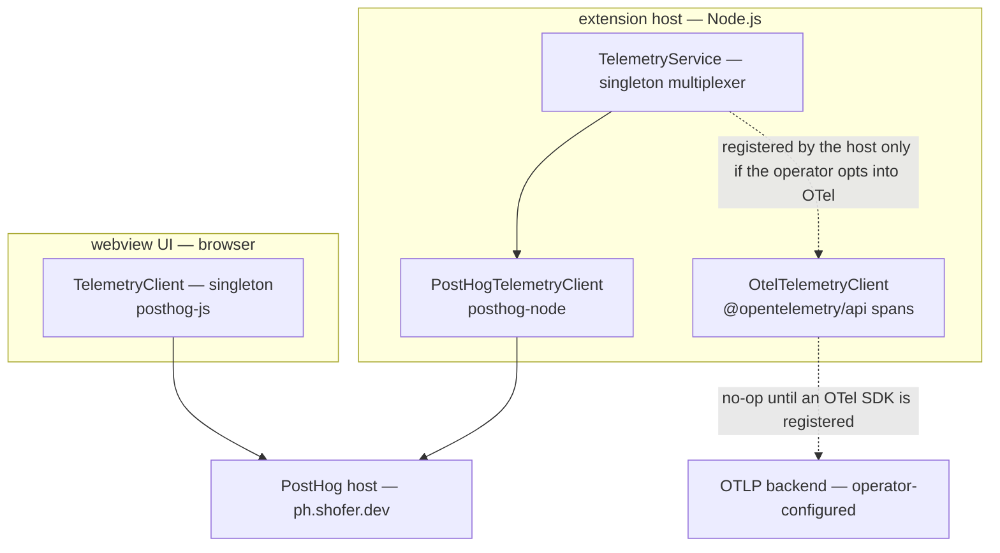
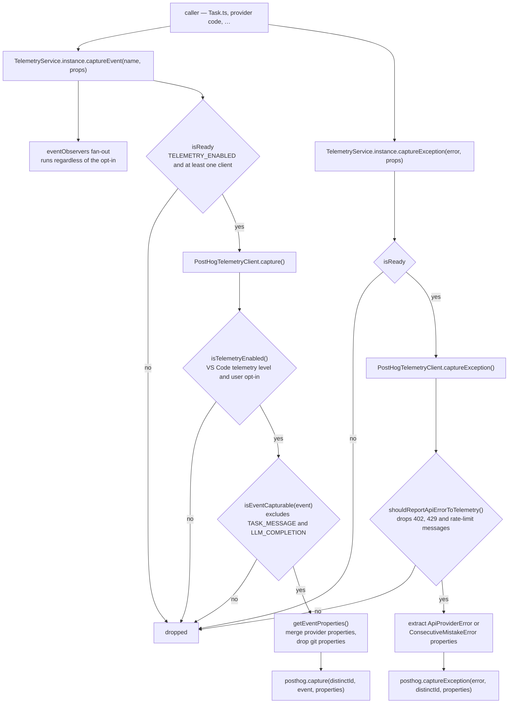
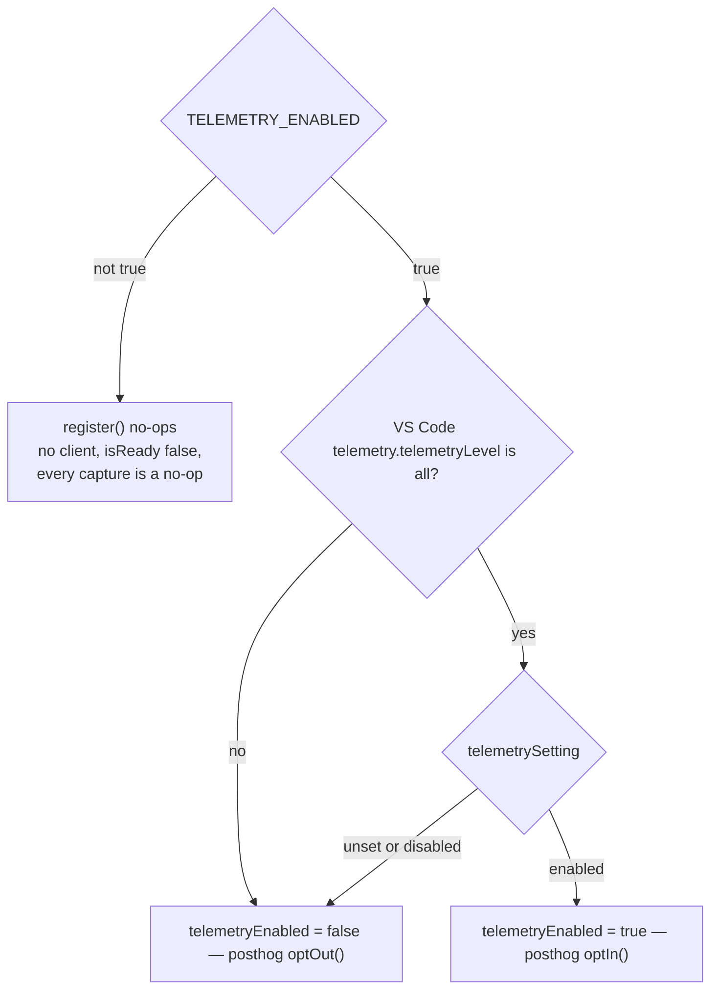
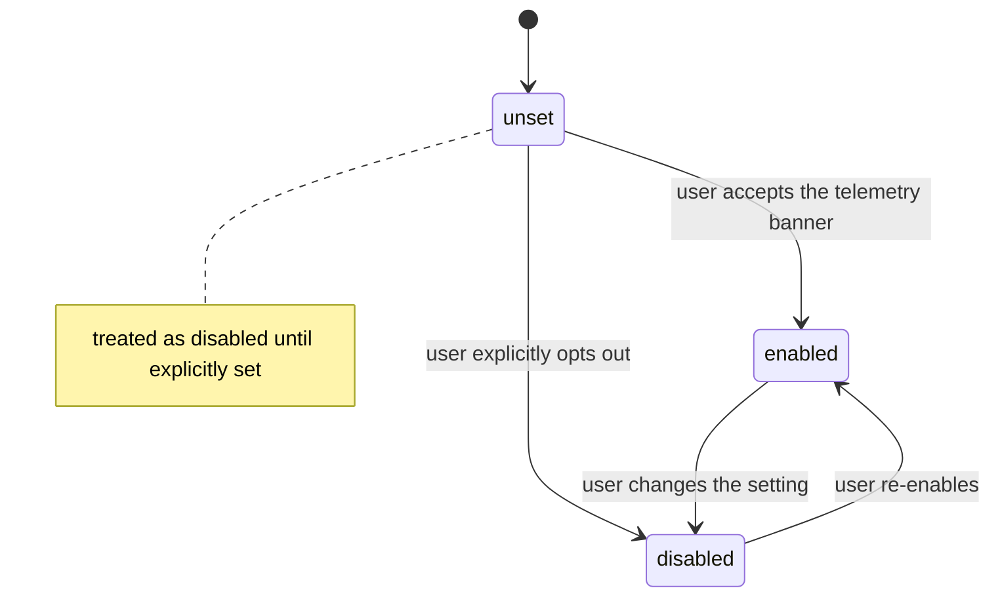

# Shofer Telemetry System

<!-- TOC -->

- [Architecture Overview](#architecture-overview)
- [Package: `@shofer/telemetry`](#package-shofertelemetry)
    - [`TelemetryService`](#telemetryservice)
    - [`PostHogTelemetryClient`](#posthogtelemetryclient)
    - [`BaseTelemetryClient`](#basetelemetryclient)
- [Package: `@shofer/types` — Telemetry Types](#package-shofertypes--telemetry-types)
    - [`TelemetrySetting`](#telemetrysetting)
    - [`TelemetryEventName`](#telemetryeventname)
    - [`TelemetryProperties`](#telemetryproperties)
    - [Error Utilities](#error-utilities)
    - [`ApiProviderError`](#apiprovidererror)
    - [`ConsecutiveMistakeError`](#consecutivemistakeerror)
- [Webview-Side Telemetry](#webview-side-telemetry)
- [Telemetry Flow & Initialization](#telemetry-flow--initialization)
- [Event Catalog](#event-catalog)
    - [Task Lifecycle Events](#task-lifecycle-events)
    - [Tool & Mode Events](#tool--mode-events)
    - [Context & Performance Events](#context--performance-events)
    - [UI & Interaction Events](#ui--interaction-events)
    - [Cloud & Marketplace Events](#cloud--marketplace-events)
    - [Error Events](#error-events)
- [Privacy & Data Filtering](#privacy--data-filtering)
- [Opt-Out Mechanism](#opt-out-mechanism)
- [Integration Points](#integration-points)
    - [Extension Host (`src/`)](#extension-host-src)
    - [Code Indexing Service](#code-indexing-service)
    - [AI Providers](#ai-providers)
    - [Webview UI](#webview-ui)
- [Testing](#testing)
  <!-- /TOC -->

---

## Architecture Overview

Shofer uses a **multi-client telemetry architecture** with a singleton [`TelemetryService`](../packages/telemetry/src/TelemetryService.ts) that acts as a multiplexer, fanning out all events to one or more registered [`TelemetryClient`](../packages/types/src/telemetry.ts) implementations. The system is split across two packages and two runtime environments:



| Component                                                                       | Runtime                  | Library              | Endpoint                   |
| ------------------------------------------------------------------------------- | ------------------------ | -------------------- | -------------------------- |
| [`PostHogTelemetryClient`](../packages/telemetry/src/PostHogTelemetryClient.ts) | Node.js (extension host) | `posthog-node`       | `https://ph.shofer.dev`    |
| [`OtelTelemetryClient`](../packages/telemetry/src/OtelTelemetryClient.ts)       | Node.js (extension host) | `@opentelemetry/api` | OTLP (operator-configured) |
| [`TelemetryClient`](../webview-ui/src/utils/TelemetryClient.ts)                 | Browser (webview)        | `posthog-js`         | `https://ph.shofer.dev`    |

### OpenTelemetry transport (§8)

[`OtelTelemetryClient`](../packages/telemetry/src/OtelTelemetryClient.ts) is an
additional `TelemetryClient` that emits each captured event from the typed event
catalog as an **OpenTelemetry span** (`@opentelemetry/api`). The taxonomy stays
the data; OTel is the transport, so any standards-based backend (incl. Prometheus
via the OTel collector) can consume it without a bespoke exporter.

`@opentelemetry/api` is a **no-op until an OTel SDK is registered** by the host
(e.g. `NodeSDK` + an OTLP exporter), so the client is zero-overhead and inert
unless telemetry is opted in _and_ an SDK is wired up — OTel adoption is an
operator choice. Register it alongside `PostHogTelemetryClient` via
`TelemetryService.register(new OtelTelemetryClient())`. Spend caps are kept (a
shofer advantage; Part E #6).

---

## Package: `@shofer/telemetry`

**Location:** [`packages/telemetry/`](packages/telemetry/)

**Dependencies:** `posthog-node@^5.0.0`, `zod@^3.25.61`, `@shofer/types`

### `TelemetryService`

**File:** [`packages/telemetry/src/TelemetryService.ts`](../packages/telemetry/src/TelemetryService.ts)

The central orchestration point for all telemetry. Implements a **singleton pattern** via `TelemetryService.createInstance()` and `TelemetryService.instance`.

#### Key Methods

| Method                                                                                            | Description                                                                            |
| ------------------------------------------------------------------------------------------------- | -------------------------------------------------------------------------------------- |
| [`createInstance(clients?)`](../packages/telemetry/src/TelemetryService.ts)                       | Creates the singleton. Throws if already created.                                      |
| [`instance`](../packages/telemetry/src/TelemetryService.ts)                                       | Static getter; throws if not initialized.                                              |
| [`hasInstance()`](../packages/telemetry/src/TelemetryService.ts)                                  | Safe check before accessing `.instance`.                                               |
| [`isGloballyEnabled()`](../packages/telemetry/src/TelemetryService.ts)                            | Returns whether `TELEMETRY_ENABLED` env var is set.                                    |
| [`register(client)`](../packages/telemetry/src/TelemetryService.ts)                               | Registers a new `TelemetryClient`.                                                     |
| [`setProvider(provider)`](../packages/telemetry/src/TelemetryService.ts)                          | Sets a `TelemetryPropertiesProvider` on all clients for automatic property enrichment. |
| [`updateTelemetryState(isOptedIn)`](../packages/telemetry/src/TelemetryService.ts)                | Toggles telemetry on/off across all clients.                                           |
| [`captureEvent(eventName, properties?)`](../packages/telemetry/src/TelemetryService.ts)           | Generic event capture; fans out to all clients.                                        |
| [`captureException(error, additionalProperties?)`](../packages/telemetry/src/TelemetryService.ts) | Exception capture (PostHog error tracking).                                            |
| [`shutdown()`](../packages/telemetry/src/TelemetryService.ts)                                     | Gracefully shuts down all clients.                                                     |

#### Convenience Event Methods

The service provides typed convenience methods for every event type. Each method internally calls [`captureEvent()`](../packages/telemetry/src/TelemetryService.ts) with the appropriate [`TelemetryEventName`](../packages/types/src/telemetry.ts) enum value:

| Method                                                                             | Event                        | Parameters                                                                        |
| ---------------------------------------------------------------------------------- | ---------------------------- | --------------------------------------------------------------------------------- |
| [`captureTaskCreated`](../packages/telemetry/src/TelemetryService.ts)              | `TASK_CREATED`               | `taskId`                                                                          |
| [`captureTaskRestarted`](../packages/telemetry/src/TelemetryService.ts)            | `TASK_RESTARTED`             | `taskId`                                                                          |
| [`captureTaskCompleted`](../packages/telemetry/src/TelemetryService.ts)            | `TASK_COMPLETED`             | `taskId`                                                                          |
| [`captureConversationMessage`](../packages/telemetry/src/TelemetryService.ts)      | `TASK_CONVERSATION_MESSAGE`  | `taskId`, `source`                                                                |
| [`captureLlmCompletion`](../packages/telemetry/src/TelemetryService.ts)            | `LLM_COMPLETION`             | `taskId`, `{inputTokens, outputTokens, cacheWriteTokens, cacheReadTokens, cost?}` |
| [`captureModeSwitch`](../packages/telemetry/src/TelemetryService.ts)               | `MODE_SWITCH`                | `taskId`, `newMode`                                                               |
| [`captureToolUsage`](../packages/telemetry/src/TelemetryService.ts)                | `TOOL_USED`                  | `taskId`, `tool`                                                                  |
| [`captureContextCondensed`](../packages/telemetry/src/TelemetryService.ts)         | `CONTEXT_CONDENSED`          | `taskId`, `isAutomaticTrigger`, `usedCustomPrompt?`                               |
| [`captureSlidingWindowTruncation`](../packages/telemetry/src/TelemetryService.ts)  | `SLIDING_WINDOW_TRUNCATION`  | `taskId`                                                                          |
| [`captureCodeActionUsed`](../packages/telemetry/src/TelemetryService.ts)           | `CODE_ACTION_USED`           | `actionType`                                                                      |
| [`capturePromptEnhanced`](../packages/telemetry/src/TelemetryService.ts)           | `PROMPT_ENHANCED`            | `taskId?`                                                                         |
| [`captureSchemaValidationError`](../packages/telemetry/src/TelemetryService.ts)    | `SCHEMA_VALIDATION_ERROR`    | `{schemaName, error}`                                                             |
| [`captureDiffApplicationError`](../packages/telemetry/src/TelemetryService.ts)     | `DIFF_APPLICATION_ERROR`     | `taskId`, `consecutiveMistakeCount`                                               |
| [`captureShellIntegrationError`](../packages/telemetry/src/TelemetryService.ts)    | `SHELL_INTEGRATION_ERROR`    | `taskId`                                                                          |
| [`captureConsecutiveMistakeError`](../packages/telemetry/src/TelemetryService.ts)  | `CONSECUTIVE_MISTAKE_ERROR`  | `taskId`                                                                          |
| [`captureMcpAsyncCallStarted`](../packages/telemetry/src/TelemetryService.ts)      | `MCP_ASYNC_CALL_STARTED`     | `taskId`, `{callId, serverName, toolName}`                                        |
| [`captureMcpAsyncCallCompleted`](../packages/telemetry/src/TelemetryService.ts)    | `MCP_ASYNC_CALL_COMPLETED`   | `taskId`, `{callId, serverName, toolName, isError, durationMs}`                   |
| [`captureMcpAsyncCallCancelled`](../packages/telemetry/src/TelemetryService.ts)    | `MCP_ASYNC_CALL_CANCELLED`   | `taskId`, `{callId, serverName, toolName, durationMs}`                            |
| [`captureMcpAsyncCallTimedOut`](../packages/telemetry/src/TelemetryService.ts)     | `MCP_ASYNC_CALL_TIMED_OUT`   | `taskId`, `{callId, serverName, toolName, timeoutSec}`                            |
| [`captureBudgetExceeded`](../packages/telemetry/src/TelemetryService.ts)           | `BUDGET_EXCEEDED`            | `taskId`, `{rootTaskId, limitUsd, spentUsd, action, modelId}`                     |
| [`captureTabShown`](../packages/telemetry/src/TelemetryService.ts)                 | `TAB_SHOWN`                  | `tab`                                                                             |
| [`captureModeSettingChanged`](../packages/telemetry/src/TelemetryService.ts)       | `MODE_SETTINGS_CHANGED`      | `settingName`                                                                     |
| [`captureCustomModeCreated`](../packages/telemetry/src/TelemetryService.ts)        | `CUSTOM_MODE_CREATED`        | `modeSlug`, `modeName`                                                            |
| [`captureMarketplaceItemInstalled`](../packages/telemetry/src/TelemetryService.ts) | `MARKETPLACE_ITEM_INSTALLED` | `itemId`, `itemType`, `itemName`, `target`, `properties?`                         |
| [`captureMarketplaceItemRemoved`](../packages/telemetry/src/TelemetryService.ts)   | `MARKETPLACE_ITEM_REMOVED`   | `itemId`, `itemType`, `itemName`, `target`                                        |
| [`captureTitleButtonClicked`](../packages/telemetry/src/TelemetryService.ts)       | `TITLE_BUTTON_CLICKED`       | `button`                                                                          |
| [`captureTelemetrySettingsChanged`](../packages/telemetry/src/TelemetryService.ts) | `TELEMETRY_SETTINGS_CHANGED` | `previousSetting`, `newSetting`                                                   |
| [`capturePeerMessageSent`](../packages/telemetry/src/TelemetryService.ts)          | `TASK_PEER_MESSAGE_SENT`     | `taskId`, peer-message metadata                                                   |
| [`capturePeerMessageReceived`](../packages/telemetry/src/TelemetryService.ts)      | `TASK_PEER_MESSAGE_RECEIVED` | `taskId`, peer-message metadata                                                   |
| [`capturePeerDiscovery`](../packages/telemetry/src/TelemetryService.ts)            | `TASK_PEER_DISCOVERY`        | `taskId`, discovery metadata                                                      |
| [`captureSubtaskSpawned`](../packages/telemetry/src/TelemetryService.ts)           | `SUBTASK_SPAWNED`            | `taskId` (parent), `mode`, `isBackground`                                         |
| [`captureTaskCancelled`](../packages/telemetry/src/TelemetryService.ts)            | `TASK_CANCELLED`             | `taskId`                                                                          |
| [`captureToolRejected`](../packages/telemetry/src/TelemetryService.ts)             | `TOOL_REJECTED`              | `taskId`, `tool`                                                                  |
| [`isTelemetryEnabled`](../packages/telemetry/src/TelemetryService.ts)              | —                            | Returns `true` if any client has telemetry enabled                                |

### `PostHogTelemetryClient`

**File:** [`packages/telemetry/src/PostHogTelemetryClient.ts`](../packages/telemetry/src/PostHogTelemetryClient.ts)

The primary Node.js-side telemetry client, backed by [`posthog-node`](https://www.npmjs.com/package/posthog-node).

#### Configuration

| Setting          | Value                                                      |
| ---------------- | ---------------------------------------------------------- |
| **PostHog host** | `https://ph.shofer.dev`                                    |
| **Distinct ID**  | `vscode.env.machineId`                                     |
| **API key**      | `process.env.POSTHOG_API_KEY` from [`.env`](.env.sample:1) |

#### Event Subscription

Uses an **exclusion list** pattern: subscribes to all events **except** `TASK_MESSAGE` and `LLM_COMPLETION` (line 30). These are excluded from PostHog because they contain high-cardinality payload data.

```typescript
// From BaseTelemetryClient constructor call (lines 37-43):
{
    type: "exclude",
    events: [TelemetryEventName.TASK_MESSAGE, TelemetryEventName.LLM_COMPLETION],
}
```

#### Privacy Filters

The client **filters out git repository properties** from all events via [`isPropertyCapturable()`](../packages/telemetry/src/PostHogTelemetryClient.ts). Properties excluded:

- `repositoryUrl`
- `repositoryName`
- `defaultBranch`

#### Two-Phase Telemetry Gating

[`updateTelemetryState(didUserOptIn)`](../packages/telemetry/src/PostHogTelemetryClient.ts) implements a two-phase check:

1. **VSCode global telemetry level** — must be `"all"` (reads `telemetry.telemetryLevel` from VSCode configuration)
2. **User opt-in** — the extension-specific `telemetrySetting` must not be `"disabled"`

If either check fails, telemetry is disabled and `posthog-node` is set to `optOut()`.

#### Error Filtering in `captureException`

[`captureException()`](../packages/telemetry/src/PostHogTelemetryClient.ts) applies the following filters before sending:

1. **402 Payment Required** — filtered out (billing issues are expected)
2. **429 Rate Limit** — filtered out (rate limits are expected)
3. **Messages starting with `429`** — filtered out
4. **Messages containing `rate limit`** (case-insensitive) — filtered out

For non-filtered errors, the method:

- Extracts structured properties from [`ApiProviderError`](../packages/types/src/telemetry.ts) instances (provider, modelId, operation, errorCode)
- Extracts structured properties from [`ConsecutiveMistakeError`](../packages/types/src/telemetry.ts) instances (taskId, counts, reason)
- Overrides the error message with the most descriptive nested message (e.g., upstream provider errors from OpenRouter metadata)
- Appends `$app_version` from the provider's telemetry properties
- Merges any additional properties passed by the caller

### `BaseTelemetryClient`

**File:** [`packages/telemetry/src/BaseTelemetryClient.ts`](../packages/telemetry/src/BaseTelemetryClient.ts)

Abstract base class implementing the [`TelemetryClient`](../packages/types/src/telemetry.ts) interface. Provides:

| Feature                 | Description                                                                                                                                                                   |
| ----------------------- | ----------------------------------------------------------------------------------------------------------------------------------------------------------------------------- |
| **Event subscription**  | Include/exclude event filtering via [`isEventCapturable()`](../packages/telemetry/src/BaseTelemetryClient.ts)                                                                 |
| **Provider reference**  | Weak reference to a [`TelemetryPropertiesProvider`](../packages/types/src/telemetry.ts) via [`setProvider()`](../packages/telemetry/src/BaseTelemetryClient.ts)               |
| **Property enrichment** | [`getEventProperties()`](../packages/telemetry/src/BaseTelemetryClient.ts) merges provider properties with event-specific properties, with event properties taking precedence |
| **Property filtering**  | Hook method [`isPropertyCapturable()`](../packages/telemetry/src/BaseTelemetryClient.ts) for subclass privacy filtering                                                       |

---

## Package: `@shofer/types` — Telemetry Types

**File:** [`packages/types/src/telemetry.ts`](../packages/types/src/telemetry.ts)

### `TelemetrySetting`

Three possible values:

```typescript
type TelemetrySetting = "unset" | "enabled" | "disabled"
```

| Value        | Meaning                                                                      |
| ------------ | ---------------------------------------------------------------------------- |
| `"unset"`    | User hasn't made a choice yet. Treated as **disabled** until explicitly set. |
| `"enabled"`  | User explicitly opted in.                                                    |
| `"disabled"` | User explicitly opted out.                                                   |

### `TelemetryEventName`

Complete enum of all telemetry event names:

```typescript
enum TelemetryEventName {
	// Task lifecycle
	TASK_CREATED = "Task Created",
	TASK_RESTARTED = "Task Reopened",
	TASK_COMPLETED = "Task Completed",
	TASK_MESSAGE = "Task Message",
	TASK_CONVERSATION_MESSAGE = "Conversation Message",

	// LLM
	LLM_COMPLETION = "LLM Completion",

	// Mode & Tool
	MODE_SWITCH = "Mode Switched",
	MODE_SELECTOR_OPENED = "Mode Selector Opened",
	TOOL_USED = "Tool Used",

	// UI / Settings
	TAB_SHOWN = "Tab Shown",
	MODE_SETTINGS_CHANGED = "Mode Setting Changed",
	CUSTOM_MODE_CREATED = "Custom Mode Created",

	// Context
	CONTEXT_CONDENSED = "Context Condensed",
	SLIDING_WINDOW_TRUNCATION = "Sliding Window Truncation",

	// Code Actions
	CODE_ACTION_USED = "Code Action Used",
	PROMPT_ENHANCED = "Prompt Enhanced",

	// UI
	TITLE_BUTTON_CLICKED = "Title Button Clicked",

	// Marketplace
	MARKETPLACE_ITEM_INSTALLED = "Marketplace Item Installed",
	MARKETPLACE_ITEM_REMOVED = "Marketplace Item Removed",
	MARKETPLACE_TAB_VIEWED = "Marketplace Tab Viewed",
	MARKETPLACE_INSTALL_BUTTON_CLICKED = "Marketplace Install Button Clicked",

	// Sharing
	SHARE_BUTTON_CLICKED = "Share Button Clicked",
	SHARE_ORGANIZATION_CLICKED = "Share Organization Clicked",
	SHARE_PUBLIC_CLICKED = "Share Public Clicked",
	SHARE_CONNECT_TO_CLOUD_CLICKED = "Share Connect To Cloud Clicked",

	// (Removed: AUTHENTICATION_INITIATED, ACCOUNT_*, FEATURED_PROVIDER_CLICKED,
	//  UPSELL_DISMISSED, UPSELL_CLICKED — dead entries with no emitter or UI.)

	// Errors
	SCHEMA_VALIDATION_ERROR = "Schema Validation Error",
	DIFF_APPLICATION_ERROR = "Diff Application Error",
	SHELL_INTEGRATION_ERROR = "Shell Integration Error",
	CONSECUTIVE_MISTAKE_ERROR = "Consecutive Mistake Error",
	PLUGIN_EVENT = "Plugin Event",
	TELEMETRY_SETTINGS_CHANGED = "Telemetry Settings Changed",
	MODEL_CACHE_EMPTY_RESPONSE = "Model Cache Empty Response",
	READ_FILE_LEGACY_FORMAT_USED = "Read File Legacy Format Used",
	BUDGET_EXCEEDED = "Budget Exceeded",

	// Async MCP tool calls
	MCP_ASYNC_CALL_STARTED = "MCP Async Call Started",
	MCP_ASYNC_CALL_COMPLETED = "MCP Async Call Completed",
	MCP_ASYNC_CALL_CANCELLED = "MCP Async Call Cancelled",
	MCP_ASYNC_CALL_TIMED_OUT = "MCP Async Call Timed Out",

	// Peer messaging (task-to-task)
	TASK_PEER_MESSAGE_SENT = "Task Peer Message Sent",
	TASK_PEER_MESSAGE_RECEIVED = "Task Peer Message Received",
	TASK_PEER_DISCOVERY = "Task Peer Discovery",

	// Task outcomes
	SUBTASK_SPAWNED = "Subtask Spawned",
	TASK_CANCELLED = "Task Cancelled",
	TOOL_REJECTED = "Tool Rejected",
}
```

### `TelemetryProperties`

Every event is enriched with properties from the [`TelemetryPropertiesProvider`](../packages/types/src/telemetry.ts) (implemented by [`ShoferProvider`](../src/core/webview/ShoferProvider.ts)):

#### Static App Properties (computed once at startup)

- `appName` — always `"Shofer"`
- `appVersion` — from `package.json`
- `vscodeVersion` — VSCode version string
- `platform` — OS platform
- `editorName` — editor name (e.g., `"vscode"`)
- `hostname` — optional machine hostname

#### Dynamic App Properties (computed per event)

- `language` — user's selected UI language (e.g., `"en"`)
- `mode` — current mode slug (e.g., `"code"`, `"architect"`)

#### Cloud Properties

- `cloudIsAuthenticated` — whether the user is signed into Shofer Cloud

#### Task Properties (present when a task is active)

- `taskId` — current task ID
- `parentTaskId` — parent task ID for subtasks
- `apiProvider` — provider name (e.g., `"anthropic"`, `"openrouter"`)
- `modelId` — model identifier
- `diffStrategy` — diff strategy name
- `isSubtask` — boolean indicating if current task is a subtask
- `todos` — optional breakdown of todo list state (`{total, completed, inProgress, pending}`)

#### Git Properties (filtered from PostHog)

- `repositoryUrl` — sanitized HTTPS repo URL
- `repositoryName` — repo name
- `defaultBranch` — default branch

### Error Utilities

The types package provides a suite of error classification utilities used by the telemetry system:

| Function                                                                                | File Location      | Purpose                                                                                            |
| --------------------------------------------------------------------------------------- | ------------------ | -------------------------------------------------------------------------------------------------- |
| [`getErrorStatusCode(error)`](../packages/types/src/telemetry.ts)                       | `telemetry.ts:335` | Extracts HTTP status code from OpenAI SDK errors                                                   |
| [`getErrorMessage(error)`](../packages/types/src/telemetry.ts)                          | `telemetry.ts:385` | Extracts most descriptive error message (prioritizes nested metadata → `error.message`)            |
| [`extractMessageFromJsonPayload(message)`](../packages/types/src/telemetry.ts)          | `telemetry.ts:350` | Parses JSON-embedded error messages (e.g., `503 {"error":{"message":"..."}}`)                      |
| [`shouldReportApiErrorToTelemetry(code?, msg?)`](../packages/types/src/telemetry.ts)    | `telemetry.ts:422` | Returns `false` for expected errors (402, 429, rate limit patterns)                                |
| [`isApiProviderError(error)`](../packages/types/src/telemetry.ts)                       | `telemetry.ts:461` | Type guard for `ApiProviderError`                                                                  |
| [`extractApiProviderErrorProperties(error)`](../packages/types/src/telemetry.ts)        | `telemetry.ts:475` | Extracts `{provider, modelId, operation, errorCode?}`                                              |
| [`isConsecutiveMistakeError(error)`](../packages/types/src/telemetry.ts)                | `telemetry.ts:513` | Type guard for `ConsecutiveMistakeError`                                                           |
| [`extractConsecutiveMistakeErrorProperties(error)`](../packages/types/src/telemetry.ts) | `telemetry.ts:527` | Extracts `{taskId, consecutiveMistakeCount, consecutiveMistakeLimit, reason, provider?, modelId?}` |

### `ApiProviderError`

```typescript
class ApiProviderError extends Error {
	constructor(
		message: string,
		provider: string, // e.g., "OpenRouter", "Anthropic"
		modelId: string, // e.g., "gpt-4", "claude-sonnet-4-5"
		operation: string, // e.g., "createMessage", "completePrompt"
		errorCode?: number, // HTTP status code
	)
}
```

### `ConsecutiveMistakeError`

```typescript
type ConsecutiveMistakeReason = "no_tools_used" | "tool_repetition" | "unknown"

class ConsecutiveMistakeError extends Error {
	constructor(
		message: string,
		taskId: string,
		consecutiveMistakeCount: number,
		consecutiveMistakeLimit: number,
		reason: ConsecutiveMistakeReason,
		provider?: string,
		modelId?: string,
	)
}
```

---

## Webview-Side Telemetry

**File:** [`webview-ui/src/utils/TelemetryClient.ts`](../webview-ui/src/utils/TelemetryClient.ts)

A **browser-side** singleton that uses [`posthog-js`](https://www.npmjs.com/package/posthog-js) for UI interaction tracking.

### Initialization

Called from [`App.tsx`](../webview-ui/src/App.tsx) after state hydration:

```typescript
telemetryClient.updateTelemetryState(telemetrySetting, telemetryKey, machineId)
```

### Configuration

| Setting            | Value                                                                                  |
| ------------------ | -------------------------------------------------------------------------------------- |
| **API host**       | `https://ph.shofer.dev`                                                                |
| **UI host**        | `https://us.posthog.com`                                                               |
| **Persistence**    | `localStorage`                                                                         |
| **Autocapture**    | Disabled (`capture_pageview: false`, `capture_pageleave: false`, `autocapture: false`) |
| **Identification** | `posthog.identify(distinctId)` on load                                                 |

### UI Events Tracked

| UI Component        | Event                                   | Source                                                                                                   |
| ------------------- | --------------------------------------- | -------------------------------------------------------------------------------------------------------- |
| Mode Selector       | `MODE_SELECTOR_OPENED`                  | [`ModeSelector.tsx`](../webview-ui/src/components/chat/ModeSelector.tsx)                                 |
| Marketplace Tab     | `MARKETPLACE_TAB_VIEWED`                | [`App.tsx`](../webview-ui/src/App.tsx)                                                                   |
| Marketplace Install | `MARKETPLACE_INSTALL_BUTTON_CLICKED`    | [`MarketplaceItemCard.tsx`](../webview-ui/src/components/marketplace/components/MarketplaceItemCard.tsx) |
| Error Boundary      | `error_boundary_caught_error`           | [`ErrorBoundary.tsx`](../webview-ui/src/components/ErrorBoundary.tsx)                                    |
| UI Settings         | `ui_settings_collapse_thinking_changed` | [`UISettings.tsx`](../webview-ui/src/components/settings/UISettings.tsx)                                 |
| UI Settings         | `ui_settings_enter_behavior_changed`    | [`UISettings.tsx`](../webview-ui/src/components/settings/UISettings.tsx)                                 |

---

## Telemetry Flow & Initialization

### Extension Activation Sequence

1. **Extension activates** → `extension.ts:activate()` (startup)
2. **Network proxy** initialized (debug mode only) → `extension.ts` (startup)
3. **Settings migrated** → `extension.ts` (startup)
4. **TelemetryService created** as singleton → `extension.ts` (startup)
5. **PostHogTelemetryClient registered** → `extension.ts` (startup)
6. **ShoferProvider created** → registered as properties provider via `TelemetryService.instance.setProvider(this)` → [`ShoferProvider.ts:268`](../src/core/webview/ShoferProvider.ts)
7. **User telemetry preference** sent from webview → `updateTelemetryState(isOptedIn)` called → [`webviewMessageHandler.ts:2462`](../src/core/webview/webviewMessageHandler.ts)

### Event Flow

Event observers registered through `onEvent` (the plugin registry, §10) are
fanned out _before_ the opt-in gate — plugins see agent events even when
telemetry is off — while everything downstream of `isReady` is gated.



---

## Event Catalog

### Task Lifecycle Events

| Event                       | Where Emitted               | Properties                                                                              |
| --------------------------- | --------------------------- | --------------------------------------------------------------------------------------- |
| `TASK_CREATED`              | Task constructor            | `taskId`                                                                                |
| `TASK_RESTARTED`            | Task resumption             | `taskId`                                                                                |
| `TASK_COMPLETED`            | Task completion             | `taskId`                                                                                |
| `TASK_CONVERSATION_MESSAGE` | Each user/assistant message | `taskId`, `source` (`"user"` \| `"assistant"`)                                          |
| `LLM_COMPLETION`            | After each API call         | `taskId`, `inputTokens`, `outputTokens`, `cacheWriteTokens`, `cacheReadTokens`, `cost?` |

### Tool & Mode Events

| Event                          | Where Emitted            | Properties                   |
| ------------------------------ | ------------------------ | ---------------------------- |
| `MODE_SWITCH`                  | Mode change              | `taskId`, `newMode`          |
| `TOOL_USED`                    | Each tool execution      | `taskId`, `tool` (tool name) |
| `CUSTOM_MODE_CREATED`          | Mode editor save         | `modeSlug`, `modeName`       |
| `MODE_SETTINGS_CHANGED`        | Mode settings panel      | `settingName`                |
| `CODE_ACTION_USED`             | Code lens / context menu | `actionType`                 |
| `PROMPT_ENHANCED`              | Enhance prompt button    | `taskId?`                    |
| `READ_FILE_LEGACY_FORMAT_USED` | Native tool call parser  | Legacy format indicator      |

### Context & Performance Events

| Event                       | Where Emitted             | Properties                                                          |
| --------------------------- | ------------------------- | ------------------------------------------------------------------- |
| `CONTEXT_CONDENSED`         | Context condensation      | `taskId`, `isAutomaticTrigger`, `usedCustomPrompt?`                 |
| `SLIDING_WINDOW_TRUNCATION` | Sliding window truncation | `taskId`                                                            |
| `BUDGET_EXCEEDED`           | Cost limit enforcement    | `taskId`, `rootTaskId`, `limitUsd`, `spentUsd`, `action`, `modelId` |

### UI & Interaction Events

| Event                                   | Where Emitted       | Properties |
| --------------------------------------- | ------------------- | ---------- |
| `TAB_SHOWN`                             | Settings tab change | `tab`      |
| `MODE_SELECTOR_OPENED`                  | Mode dropdown open  | —          |
| `TITLE_BUTTON_CLICKED`                  | Title bar buttons   | `button`   |
| `ui_settings_collapse_thinking_changed` | Webview UI setting  | `enabled`  |
| `ui_settings_enter_behavior_changed`    | Webview UI setting  | `behavior` |

### Cloud & Marketplace Events

| Event                                | Where Emitted             | Properties                                                                              |
| ------------------------------------ | ------------------------- | --------------------------------------------------------------------------------------- |
| `MARKETPLACE_ITEM_INSTALLED`         | Installation success      | `itemId`, `itemType`, `itemName`, `target`, `hasParameters?`, `installationMethodName?` |
| `MARKETPLACE_ITEM_REMOVED`           | Removal success           | `itemId`, `itemType`, `itemName`, `target`                                              |
| `MARKETPLACE_TAB_VIEWED`             | Tab switch to marketplace | —                                                                                       |
| `MARKETPLACE_INSTALL_BUTTON_CLICKED` | Install button click      | `itemId`, `itemType`, `itemName`                                                        |
| `SHARE_BUTTON_CLICKED`               | Share button              | —                                                                                       |
| `SHARE_ORGANIZATION_CLICKED`         | Share → org               | —                                                                                       |
| `SHARE_PUBLIC_CLICKED`               | Share → public            | —                                                                                       |
| `SHARE_CONNECT_TO_CLOUD_CLICKED`     | Share → connect prompt    | —                                                                                       |

### Error Events

| Event                         | Where Emitted                     | Properties                             |
| ----------------------------- | --------------------------------- | -------------------------------------- |
| `SCHEMA_VALIDATION_ERROR`     | Zod schema validation             | `schemaName`, `error` (formatted)      |
| `DIFF_APPLICATION_ERROR`      | apply_diff tool                   | `taskId`, `consecutiveMistakeCount`    |
| `SHELL_INTEGRATION_ERROR`     | Shell integration                 | `taskId`                               |
| `CONSECUTIVE_MISTAKE_ERROR`   | Mistake limit reached             | `taskId`                               |
| `PLUGIN_EVENT`                | Any plugin (`ctx.host.telemetry`) | `plugin`, `event`, scrubbed properties |
| `MODEL_CACHE_EMPTY_RESPONSE`  | Model cache                       | —                                      |
| `error_boundary_caught_error` | React error boundary (webview)    | `error` (message), `componentStack`    |

### MCP Async Call Events

| Event                      | Where Emitted                        | Properties                                                            |
| -------------------------- | ------------------------------------ | --------------------------------------------------------------------- |
| `MCP_ASYNC_CALL_STARTED`   | `call_mcp_tool_async` dispatch       | `taskId`, `callId`, `serverName`, `toolName`                          |
| `MCP_ASYNC_CALL_COMPLETED` | Async MCP call finishes              | `taskId`, `callId`, `serverName`, `toolName`, `isError`, `durationMs` |
| `MCP_ASYNC_CALL_CANCELLED` | `cancel_tasks` during async MCP call | `taskId`, `callId`, `serverName`, `toolName`, `durationMs`            |
| `MCP_ASYNC_CALL_TIMED_OUT` | Async MCP call exceeds timeout       | `taskId`, `callId`, `serverName`, `toolName`, `timeoutSec`            |

### Peer Messaging Events (task-to-task)

Emitted when running tasks exchange messages directly (`send_message_to_task`,
async peer delivery, and peer discovery via `list_background_tasks`).

| Event                        | Where Emitted                                 | Properties                   |
| ---------------------------- | --------------------------------------------- | ---------------------------- |
| `TASK_PEER_MESSAGE_SENT`     | `SendMessageToTaskTool.ts` (peer send)        | `taskId`, message metadata   |
| `TASK_PEER_MESSAGE_RECEIVED` | `Task.ts` (async peer-message delivery)       | `taskId`, message metadata   |
| `TASK_PEER_DISCOVERY`        | `ListBackgroundTasksTool.ts` (peer discovery) | `taskId`, discovery metadata |

### Task Outcome Events

Product-quality signals capturing how tasks branch and how users respond to tool prompts.

| Event             | Where Emitted                                                  | Properties                                      |
| ----------------- | -------------------------------------------------------------- | ----------------------------------------------- |
| `SUBTASK_SPAWNED` | `NewTaskTool.ts` (after approval, before child creation)       | `taskId` (parent), `mode`, `isBackground`       |
| `TASK_CANCELLED`  | `CancelTasksTool.ts` (per successfully-aborted task)           | `taskId` (the cancelled task)                   |
| `TOOL_REJECTED`   | `presentAssistantMessage.ts` (both `askApproval` denial paths) | `taskId`, `tool` (`use_mcp_tool` for MCP tools) |

> Coverage note: `TOOL_REJECTED` fires from the two central `askApproval`
> factories, which cover every tool that routes approval through them. A few
> tools (e.g. `ExecuteCommandTool`, `ReadFileTool`) set `didRejectTool = true`
> directly for granular per-item denials and do not yet emit `TOOL_REJECTED`.

---

## Privacy & Data Filtering

### What is NEVER collected

- **Code or file contents** — never sent in any telemetry event
- **AI prompts or responses** — excluded from telemetry
- **Personally identifiable information** — not collected
- **Git repository URLs/names/branches** — filtered out by [`PostHogTelemetryClient.isPropertyCapturable()`](../packages/telemetry/src/PostHogTelemetryClient.ts)

### What IS collected

| Data                | Source                 | Purpose                                |
| ------------------- | ---------------------- | -------------------------------------- |
| VS Code Machine ID  | `vscode.env.machineId` | Anonymous distinct user identification |
| App version         | `package.json`         | Feature adoption tracking              |
| VSCode version      | `vscode.version`       | Compatibility analysis                 |
| Platform            | `os.platform()`        | OS usage distribution                  |
| Language            | User setting           | Localization planning                  |
| Mode                | Current mode slug      | Mode usage patterns                    |
| Provider & Model ID | API configuration      | Provider/model popularity              |
| Tool names          | Tool execution         | Tool usage patterns                    |
| Token counts & cost | API responses          | Usage and cost analysis                |
| Error messages      | Exception capture      | Bug detection and fixing               |
| Task ID             | Task lifecycle         | Session correlation                    |

### Error Message Extraction

For better error grouping in PostHog, the system extracts the most descriptive error message:

1. First checks nested `error.metadata.raw` (upstream provider errors via OpenRouter)
2. Falls back to `error.error.message`
3. Falls back to `error.message`
4. Attempts to parse JSON-embedded messages (e.g., `503 {"error":{"message":"actual error"}}`)

### Expected Errors (Not Reported)

The following error types are **intentionally not reported** to telemetry to avoid noise:

| Error Type                         | Filter                                                           |
| ---------------------------------- | ---------------------------------------------------------------- |
| HTTP 402 (Payment Required)        | [`EXPECTED_API_ERROR_CODES`](../packages/types/src/telemetry.ts) |
| HTTP 429 (Rate Limit)              | [`EXPECTED_API_ERROR_CODES`](../packages/types/src/telemetry.ts) |
| Messages starting with `429`       | Regex pattern `/^429\b/`                                         |
| Messages containing `"rate limit"` | Regex pattern `/rate limit/i`                                    |

---

## Opt-Out Mechanism

Nothing is ever sent unless **both** gates are open: the `TELEMETRY_ENABLED`
build/env flag (without it `register()` no-ops, so no client is ever added and
`isReady` stays false) and the user's own opt-in, itself subordinate to VS
Code's global telemetry level.



### Three-State Model

Telemetry uses a three-state setting:



### User Controls

1. **Telemetry banner** — shown on first launch when `telemetrySetting === "unset"`. Accepting sets it to `"enabled"`. Dismissing keeps it `"unset"` (treated as disabled).
2. **Settings UI** — accessible through the extension settings panel.
3. **VSCode telemetry level** — respects the global `telemetry.telemetryLevel` setting. If set to anything other than `"all"`, extension telemetry is fully disabled regardless of the extension-specific setting.

### Implementation Detail

When telemetry is **turned OFF**, the `TELEMETRY_SETTINGS_CHANGED` event is fired **before** disabling — capturing the last event. When telemetry is **turned ON**, the event is fired **after** enabling — ensuring it's actually sent.

```typescript
// From webviewMessageHandler.ts:2462-2476
// If turning telemetry OFF, fire event BEFORE disabling
if (wasPreviouslyOptedIn && !isOptedIn) {
	TelemetryService.instance.captureTelemetrySettingsChanged(previousSetting, telemetrySetting)
}
await updateGlobalState("telemetrySetting", telemetrySetting)
TelemetryService.instance.updateTelemetryState(isOptedIn)
// If turning telemetry ON, fire event AFTER enabling
if (!wasPreviouslyOptedIn && isOptedIn) {
	TelemetryService.instance.captureTelemetrySettingsChanged(previousSetting, telemetrySetting)
}
```

---

## Integration Points

### Extension Host (`src/`)

| File                                                                                                                     | Integration                                                                                                                       |
| ------------------------------------------------------------------------------------------------------------------------ | --------------------------------------------------------------------------------------------------------------------------------- |
| [`extension.ts`](../src/extension.ts)                                                                                    | Initializes `TelemetryService` and registers `PostHogTelemetryClient`                                                             |
| [`core/webview/ShoferProvider.ts`](../src/core/webview/ShoferProvider.ts)                                                | Implements `TelemetryPropertiesProvider.getTelemetryProperties()`; registers as provider; CSP allows `*.posthog.com`              |
| [`core/webview/webviewMessageHandler.ts`](../src/core/webview/webviewMessageHandler.ts)                                  | Handles `telemetrySetting` message from webview; calls `updateTelemetryState`                                                     |
| [`core/task/Task.ts`](../packages/core/src/task/Task.ts)                                                                 | Emits task lifecycle events, tool usage, LLM completions, budget exceeded, consecutive mistakes, tool result ID validation errors |
| [`core/condense/index.ts`](../packages/core/src/condense/index.ts)                                                       | Emits `CONTEXT_CONDENSED` with automatic trigger and custom prompt flags                                                          |
| [`core/context-management/index.ts`](../packages/core/src/context-management/index.ts)                                   | Emits `SLIDING_WINDOW_TRUNCATION`                                                                                                 |
| [`core/config/importExport.ts`](../src/core/config/importExport.ts)                                                      | Emits telemetry for settings export/import                                                                                        |
| [`core/config/ProviderSettingsManager.ts`](../src/core/config/ProviderSettingsManager.ts)                                | Tracks provider settings changes                                                                                                  |
| [`core/webview/messageEnhancer.ts`](../src/core/webview/messageEnhancer.ts)                                              | Emits `PROMPT_ENHANCED`                                                                                                           |
| [`core/assistant-message/presentAssistantMessage.ts`](../packages/core/src/assistant-message/presentAssistantMessage.ts) | Emits `CONSECUTIVE_MISTAKE_ERROR` for tool repetition                                                                             |
| [`core/assistant-message/NativeToolCallParser.ts`](../packages/core/src/assistant-message/NativeToolCallParser.ts)       | Emits `READ_FILE_LEGACY_FORMAT_USED` for legacy read_file format                                                                  |
| [`core/tools/AttemptCompletionTool.ts`](../packages/core/src/tools/AttemptCompletionTool.ts)                             | Emits `TASK_COMPLETED`                                                                                                            |
| [`core/tools/ApplyDiffTool.ts`](../packages/core/src/tools/ApplyDiffTool.ts)                                             | Emits `DIFF_APPLICATION_ERROR`                                                                                                    |
| [`core/tools/ExecuteCommandTool.ts`](../packages/core/src/tools/ExecuteCommandTool.ts)                                   | Emits `SHELL_INTEGRATION_ERROR`                                                                                                   |

### Plugin events (`PLUGIN_EVENT`)

Everything a **plugin** reports arrives as one catalog entry,
`TelemetryEventName.PLUGIN_EVENT` ("Plugin Event"), with the plugin's name and its own
event name as properties:

| Property | Meaning                                          |
| -------- | ------------------------------------------------ |
| `plugin` | Which plugin sent it (`"rag-indexing"`)          |
| `event`  | The plugin's own event name (`"indexing_error"`) |
| …        | The plugin's properties, scrubbed to primitives  |

One entry rather than one per plugin event, because **the catalog is core's**: a plugin
cannot add to it, and a plugin that could name top-level events could also shadow one of
core's. Queries filter on `plugin`/`event` instead.

Plugins reach it through `ctx.host.telemetry.capture(event, properties?)`, gated on
`permissions.telemetry` ([`plugin_system.md` §5.12](plugin_system.md)) and routed through
the typed `TelemetryService.capturePluginEvent` wrapper — so the Telemetry Capture Rule
holds: no caller passes a raw event name to `captureEvent`.

**Properties are scrubbed at the boundary**: primitives only, strings truncated at 256
characters, at most 20 keys, and the reserved `plugin`/`event` keys dropped. A plugin sees
workspace content — paths, code, prompts — and telemetry leaves the machine, so an
`Error.stack` or a spread object is refused rather than trusted to each plugin author.

The bundled `rag-indexing` plugin is the current emitter (`indexing_error`,
`segment_dedup`), which is where the old `CODE_INDEX_ERROR` /
`CODE_INDEX_SEGMENT_DEDUP` events went when the indexer became a plugin. Those two
catalog entries — and `LIVE_MEMORY_ERROR` — now have no emitter in core.

### AI Providers

Provider implementations capture errors via `TelemetryService.instance.captureException()`:

| Provider                    | Error Capture Points                                                    |
| --------------------------- | ----------------------------------------------------------------------- |
| `anthropic.ts`              | API errors with `ApiProviderError` wrapping                             |
| `bedrock.ts`                | `createMessage` and `completePrompt` errors                             |
| `gemini.ts`                 | `createMessage` and `completePrompt` errors                             |
| `mistral.ts`                | API errors                                                              |
| `openai-codex.ts`           | API errors                                                              |
| `openai-native.ts`          | `createMessage`, stream processing, and `completePrompt` errors         |
| `openrouter.ts`             | Stream error responses, SDK exceptions (with upstream error extraction) |
| `poe.ts`                    | API errors                                                              |
| `xai.ts`                    | API errors                                                              |
| `fetchers/modelCache.ts`    | `MODEL_CACHE_EMPTY_RESPONSE` for empty API responses                    |
| `fetchers/error-handler.ts` | Consistent error formatting for telemetry                               |

### Webview UI

| File                                                                                                     | Integration                                      |
| -------------------------------------------------------------------------------------------------------- | ------------------------------------------------ |
| [`App.tsx`](../webview-ui/src/App.tsx)                                                                   | Initializes `telemetryClient` on state hydration |
| [`ModeSelector.tsx`](../webview-ui/src/components/chat/ModeSelector.tsx)                                 | `MODE_SELECTOR_OPENED`                           |
| [`MarketplaceItemCard.tsx`](../webview-ui/src/components/marketplace/components/MarketplaceItemCard.tsx) | Marketplace install events                       |
| [`UISettings.tsx`](../webview-ui/src/components/settings/UISettings.tsx)                                 | UI preference changes                            |
| [`ErrorBoundary.tsx`](../webview-ui/src/components/ErrorBoundary.tsx)                                    | React error boundary catches                     |

---

## Testing

### Backend (Extension Host)

Tests for the telemetry package are in:

- [`packages/telemetry/src/__tests__/PostHogTelemetryClient.test.ts`](../packages/telemetry/src/__tests__/PostHogTelemetryClient.test.ts) — covers event capture, exception filtering, property merging, git property filtering, telemetry state management, and error filtering (402/429)
- [`packages/types/src/__tests__/telemetry.test.ts`](../packages/types/src/__tests__/telemetry.test.ts) — covers all error utility functions, `ApiProviderError`, `ConsecutiveMistakeError`

Throughout the extension host test suite, `@shofer/telemetry` is mocked with a consistent pattern:

```typescript
vi.mock("@shofer/telemetry", () => ({
	TelemetryService: {
		instance: {
			captureEvent: vi.fn(),
			captureException: vi.fn(),
			// ... other methods as needed
		},
		hasInstance: () => true,
	},
	PostHogTelemetryClient: vi.fn(),
}))
```

### Webview

Tests for the webview telemetry client:

- [`webview-ui/src/utils/__tests__/TelemetryClient.spec.ts`](../webview-ui/src/utils/__tests__/TelemetryClient.spec.ts) — covers state management, PostHog init, event capture

### Running Tests

```bash
# Test the telemetry package
pnpm --filter @shofer/telemetry test

# Test telemetry types
pnpm --filter @shofer/types test -- src/__tests__/telemetry.test.ts

# Test webview telemetry
pnpm --filter webview-ui test -- src/utils/__tests__/TelemetryClient.spec.ts
```

---

## Gaps & Areas for Improvement

This section identifies known gaps, drift risks, and areas where the telemetry system or its documentation could be improved. These were discovered during a doc-to-code verification pass.

### Documentation Drift Risks

- **Line numbers are fragile.** The telemetry source files shift frequently as methods are added or refactored. All line numbers in this document are valid only at the time of the last audit (see `verify-telemetry-doc` task). Every convenience method added, removed, or reordered in [`TelemetryService.ts`](../packages/telemetry/src/TelemetryService.ts) will drift line references in the Key Methods and Convenience Methods tables. Consider documenting method contract (signature + behavior) without tying it to a specific line number, or adding a CI step that validates line-number anchors.

- **`ShoferProvider.ts` line numbers are unstable.** The provider's `getTelemetryProperties()` and `setProvider` call site have moved between versions. The anchor is currently [`ShoferProvider.ts:268`](../src/core/webview/ShoferProvider.ts).

- **`webviewMessageHandler.ts` opt-out/opt-in block moves.** The `telemetrySetting` handler (`captureTelemetrySettingsChanged` before vs. after `updateTelemetryState`) is sensitive to reordering. The current location is around line 2462.

### Missing Codebase Components

- **`packages/cloud/` does not exist.** The Cloud Telemetry Client section was removed from this document because `packages/cloud/src/TelemetryClient.ts` and `packages/cloud/src/retry-queue/` are not present in this version of the codebase. If cloud-side telemetry is planned, a new package must be created and this document updated.

- **`webview-ui/src/components/cloud/CloudView.tsx` does not exist.** The `cloud/` components directory under the webview is empty.

- **Eight dead enum events were removed (resolved).** `ACCOUNT_CONNECT_CLICKED`, `ACCOUNT_CONNECT_SUCCESS`, `ACCOUNT_LOGOUT_CLICKED`, `ACCOUNT_LOGOUT_SUCCESS`, `AUTHENTICATION_INITIATED`, `FEATURED_PROVIDER_CLICKED`, `UPSELL_DISMISSED`, and `UPSELL_CLICKED` had no emitter anywhere and no backing UI (the `cloud/`, `useCloudUpsell.ts`, and `DismissibleUpsell.tsx` sources the old tables cited do not exist). They have been deleted from both the `TelemetryEventName` enum and the `shoferTelemetryEventSchema` union. If cloud account / upsell UI is added later, re-introduce the events alongside their emitters.

### Missing from Documentation

- **`captureException(error)` mutates `error.message`.** In [`PostHogTelemetryClient.captureException()`](../packages/telemetry/src/PostHogTelemetryClient.ts), line 128 overwrites `error.message` with the most-descriptive error message extracted by `getErrorMessage()`. This is a side-effect callers should be aware of if they retain a reference to the error after calling `captureException`.

- **`TELEMETRY_ENABLED` env var gating.** All telemetry is gated behind `TELEMETRY_ENABLED=true`. Without it, `TelemetryService` never initializes, `PostHog` clients are never instantiated, and all `capture*` calls are no-ops. This is the primary kill-switch and should be documented prominently.

- **`TelemetryService` constructor is public, not fully private.** The singleton pattern is enforced by `createInstance()` (which throws if `_instance` already exists), but the constructor itself is `public`. A direct `new TelemetryService(...)` call would bypass the singleton guard.

### Structural Observations

- **No `captureException` for non-PostHog clients.** `TelemetryService` delegates `captureException` to all registered clients, but only `PostHogTelemetryClient` implements meaningful exception capture. If a second client is registered, it must also implement `captureException`.

- **The `shoferTelemetryEventSchema` union does not gate `captureEvent` at runtime, but enum↔union parity is now test-enforced.** `captureEvent(eventName: TelemetryEventName, properties?: Record<string, any>)` ([`TelemetryService.ts:75`](../packages/telemetry/src/TelemetryService.ts)) takes a raw enum value plus an untyped property bag and **never validates against the union**, so there is still no per-call compile-time safety net (a previous version of this doc wrongly claimed there was). However, a parity test in [`telemetry.test.ts`](../packages/types/src/__tests__/telemetry.test.ts) now asserts that **every `TelemetryEventName` appears in the union and the union references no unknown names**, so future drift fails CI.

### Coverage Gaps (features without telemetry)

These features currently emit **no** telemetry, leaving notable
product/operational blind spots. Listed for awareness; wiring them is tracked
separately. (Subtask spawning, task cancellation, and tool rejection — formerly
listed here — are now implemented; see [Task Outcome Events](#task-outcome-events).)

| Feature                       | Source (no emitter)               | Proposed signal                                                    |
| ----------------------------- | --------------------------------- | ------------------------------------------------------------------ |
| RAG / `codebase_search` usage | `core/tools/RagSearchTool.ts`     | `RAG_SEARCH_PERFORMED { resultCount, latencyMs }`                  |
| Skill load                    | `core/tools/SkillsTool.ts`        | `SKILL_LOADED { skillName }`                                       |
| Image generation              | `core/tools/GenerateImageTool.ts` | `IMAGE_GENERATED { model, success }`                               |
| liveMemory success/usage      | `services/live-memory/manager.ts` | `LIVE_MEMORY_INVOKED { success, turnCount }` (error already emits) |

Additionally, **only 9 of ~36 provider implementations call `captureException`**
(the AI Providers table above lists them). The remaining providers — including
`deepseek`, `openai`, `openai-compatible`, `vertex`, `anthropic-vertex`,
`vscode-lm`, `native-ollama`, `requesty`, `unbound`, `lite-llm`,
`vercel-ai-gateway`, `baseten`, `sambanova`, `moonshot`, `minimax`, `zai`,
`qwen-code`, `lm-studio`, `fireworks`, `shofer` — swallow API errors with no
telemetry. Provider error coverage is partial, not complete.
