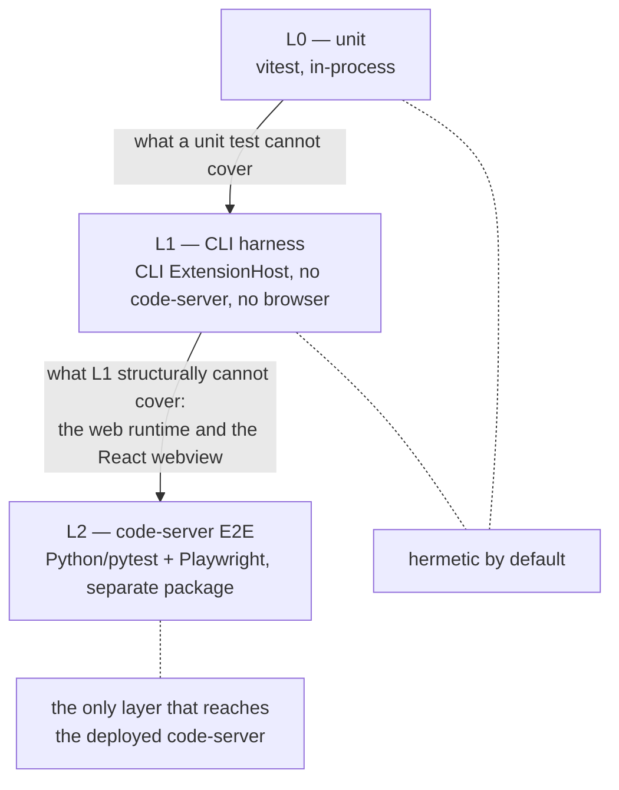

# Test Harness

Reference for the Shofer headless runtime test harness. This doc covers the
**L1 CLI harness** in detail and points to the **L2 code-server E2E harness**,
which lives in a separate package with its own docs.

## Where this fits — the test pyramid

The test suite is a three-layer pyramid; each layer is faster and more
deterministic than the one above, so you only pay the slow layer for what it
uniquely covers:

| Layer                    | What                                                                                                                                                                                               | Runtime                                            | Doc                                                                    |
| ------------------------ | -------------------------------------------------------------------------------------------------------------------------------------------------------------------------------------------------- | -------------------------------------------------- | ---------------------------------------------------------------------- |
| **L0 — Unit**            | `*.spec.ts` / `*.test.ts` via vitest                                                                                                                                                               | in-process                                         | (co-located with source)                                               |
| **L1 — CLI harness**     | **the subject of this doc** — drives Shofer core headlessly via the CLI `ExtensionHost`. Two parts (below).                                                                                        | headless CLI, no code-server, no browser           | this file + [`../TESTING.md`](../TESTING.md)                           |
| **L2 — code-server E2E** | Python/pytest runner driving Shofer **inside a real code-server** (orchestrator control endpoint + Playwright webview checks). Covers what L1 structurally can't: the web runtime + React webview. | code-server (Docker/native/k3s) + headless browser | **separate package** → `extensions/integration/README.md`, `DESIGN.md` |

L0 and L1 are the fast inner loop and run hermetically by default. **Only L2
touches the k3s-deployed code-server / Shofer** (or a local-Docker code-server) —
see [L2 — code-server E2E harness](#l2--code-server-e2e-harness) at the end of
this doc.



---

## L1 — CLI harness

The L1 harness has **two parts**, both sharing the same `ExtensionHost` /
`ShoferExtensionApi` infrastructure:

| Part                                     | What                                                                                      | Driver                                      | Default provider   |
| ---------------------------------------- | ----------------------------------------------------------------------------------------- | ------------------------------------------- | ------------------ |
| **1 — CLI smoke tests** (scenarios 1–24) | CLI surface + `ShoferExtensionApi`-as-library behaviour                                   | shell (`harness.sh`) + `api_test_runner.ts` | mock               |
| **2 — Integration protocol cases**       | stdin NDJSON stream protocol: cancellation, follow-ups, queue ordering, process lifecycle | `cases/*.ts` via `stream-harness.ts`        | real provider only |

> **Provider note.** L1 never touches a deployed Shofer or code-server — it runs
> the CLI from your working tree (`tsx src/index.ts`). Its only external
> dependency is the LLM endpoint, and only under the `ds` preset: that hits the
> k3s-deployed **llm-router** NodePort (`localhost:30081`), not Shofer itself.
> The default `mock` preset is fully hermetic.

### One command to run everything

[`scripts/smoke/harness.sh`](../scripts/smoke/harness.sh) is the single entry
point — it runs both parts in order against a chosen **preset** and prints a
per-part and overall PASS/FAIL summary (exit 0 iff everything passes):

```bash
cd extensions/shofer
pnpm --filter @shofer/cli test:harness          # = scripts/smoke/harness.sh mock
pnpm --filter @shofer/cli test:harness ds       # DeepSeek via local llm-router
pnpm --filter @shofer/cli test:integration      # SKIP_CLI=1 harness.sh ds (Part 2 only)
```

Two presets ship in-box; any other provider works via the `PROVIDER`/`MODEL`
env overrides:

| Preset           | Provider                                                                              | Notes                                                                                                                                                                                 |
| ---------------- | ------------------------------------------------------------------------------------- | ------------------------------------------------------------------------------------------------------------------------------------------------------------------------------------- |
| `mock` (default) | hermetic mock                                                                         | no network/credentials/GPU. **Skips Part 2** (those cases need a provider that actually executes slow multi-turn tool flows) and the real-provider-only Part 1 scenarios (2, 14, 21). |
| `ds`             | `shofer` → local llm-router (`http://localhost:30081/v1`, `deepseek/deepseek-v4-pro`) | runs both parts end-to-end.                                                                                                                                                           |

Key `harness.sh` knobs (env): `SKIP_CLI` / `SKIP_INTEGRATION` to skip a part;
`MATCH=<substring>` to filter Part 2 case names; `TIMEOUT` / `TIMEOUT_INT`
per-part timeouts; `INT_PARALLEL` concurrency (Part 2 runs process-per-case via
`xargs`; Part 1 is sequential by design — scenarios share session/FS state).
Part 2 failure logs persist under a `mktemp -d` dir (path printed inline).

The sections below document each part's scenarios and how to run them
standalone (outside `harness.sh`) for focused debugging.

---

## Setup

The harness runs against the hermetic **mock provider by default** — it requires
no network, no credentials, and no GPU, replaying canned responses keyed on
prompt substrings. Switching to a **real provider** (the llm-router, or any
other) is just a matter of changing the `PROVIDER` / `MODEL` pair below; nothing
else in the scenarios changes.

```bash
export CLI="pnpm --filter @shofer/cli exec tsx src/index.ts"
export WS="-w /home/alsterg/Projects/arkware.ai"

# Default — hermetic mock provider (no network, no credentials)
export PROVIDER="--provider mock --api-key x"
export MODEL="--model mock-model"

# To use a real provider instead, override the two lines above, e.g.:
#   export PROVIDER="--provider shofer --api-key x --base-url http://localhost:30081/v1"
#   export MODEL="--model deepseek/deepseek-v4-pro"
# (any provider/model the CLI supports works — only scenarios 2 and 14 below
#  require a real provider; everything else runs on either.)

# Convenience alias for CLI scenarios below
alias shofer-local="$CLI $PROVIDER $MODEL $WS"

cd /home/alsterg/Projects/arkware.ai/extensions/shofer/apps/cli
```

### Provider modes

The mock ([`packages/core/src/api/providers/mock.ts`](../packages/core/src/api/providers/mock.ts)) ships
built-in scenarios for every marker used by the CLI/API scenarios below
(`DEEPSEEK_OK`, `STREAM_OK`, `API_OK`, `TASK_ONE`, `SELECTOR_TEST`, `BANANA`, …),
including multi-turn scenarios that emit real tool calls for the tool-use cases
(`read_file`, `execute_command`, `write_to_file`, `new_task`). So **every
scenario except 2 and 14 runs unchanged against the mock**:

| Scenario(s)                                        | Why it differs under the mock                                                               | What to do                        |
| -------------------------------------------------- | ------------------------------------------------------------------------------------------- | --------------------------------- |
| **2** (missing model), **14** (connection refused) | Provider-specific: they assert `shofer`-handler error paths the mock has no equivalent for. | Run against a real provider only. |

The tool-use scenarios (**10, 11, 12, 20**) run on the mock via built-in
multi-turn scenarios that emit the real `tool_call_partial` streaming contract,
so the tool dispatch path is genuinely exercised (the tool runs; only the final
`attempt_completion` text is canned). Their prompts use fixed paths/commands
that the static mock tool arguments match verbatim — do not parameterize them
(e.g. keep the fixed temp path in scenario 12) or the mock match will drift.

Mock control knobs (highest priority first), all via env vars:

```bash
# 1. Force one specific tool call on every turn
MOCK_TOOL_NAME=read_file MOCK_TOOL_ARGS='{"path":"package.json"}' shofer-local --print "…"

# 2. Full multi-turn scenario file (tool turns + completion turn)
MOCK_RESPONSES_PATH=/tmp/scenarios.json shofer-local --print "…"

# 3. Simple canned text wrapped in attempt_completion
MOCK_RESPONSE="hello" shofer-local --print "…"
```

Rebuild the extension bundle after touching extension source:

```bash
cd /home/alsterg/Projects/arkware.ai/extensions/shofer && pnpm --filter shofer bundle
```

---

## Part 1 — CLI smoke tests (scenarios 1–24)

Run these against the mock (default) or any real provider configured in
[Setup](#setup). With a real provider the llm-router (or equivalent) must be
reachable; under the mock no network is needed. Only scenarios 2, 14 (and 21,
SIGINT) require a real provider — see the [Provider modes](#provider-modes)
table.

**Two execution surfaces.** The scenarios split into two groups by how they are
driven:

- **CLI scenarios (1–14, 20, 21, 22)** drive the `shofer` CLI as a subprocess.
  `harness.sh` Part 1 runs exactly these, sequentially. Each snippet below is
  also copy-pasteable standalone via the `shofer-local` alias from
  [Setup](#setup).
- **`ShoferExtensionApi`-library scenarios (15–19, 23, 24)** use `ExtensionHost`
  in-process. Scenarios **15–19** are automated by
  [`scripts/api_test_runner.ts`](../apps/cli/scripts/api_test_runner.ts), which
  emits one `Test NN: PASS|FAIL` line per scenario against the hermetic mock:

    ```bash
    cd extensions/shofer/apps/cli
    pnpm --filter @shofer/cli exec tsx scripts/api_test_runner.ts
    ```

    Scenarios 23–24 are documented as runnable snippets (paste into a `/tmp/*.ts`
    and run with `pnpm --filter @shofer/cli exec tsx <file>` from
    `extensions/shofer/apps/cli`); they are not yet wired into a runner.

> **Note on `console.*`.** `ExtensionHost.activate()` monkey-patches `console.*`
> and only restores it at `dispose()`. Any library scenario that needs to print
> assertions must write to `process.stdout.write` directly, not `console.log`
> (which the host swallows). The harness libraries already do this.

### 1. Basic print — roundtrip sanity

Verifies: provider routing, model resolution, completion, clean exit.

```bash
shofer-local --print "Reply with exactly: DEEPSEEK_OK"
# expect: [assistant] DEEPSEEK_OK, exit 0
echo "exit: $?"
```

### 2. Missing model — should error, not default

Verifies: `ShoferHandler.getModel()` throws instead of silently using Anthropic.

```bash
$CLI --provider shofer --api-key x --base-url http://localhost:30081/v1 $WS \
     --print "Hello"
# expect: error message "No model configured for the Shofer provider", exit 1
```

### 3. Text output format

Verifies: `--output-format text` (default) produces human-readable output and exits.

```bash
shofer-local --print --output-format text "What is 2+2? Reply with just the number."
# expect: "4", exit 0
```

### 4. JSON output format

Verifies: `--output-format json` produces a valid JSON object with `success`, `content`, `cost`.

```bash
shofer-local --print --output-format json "What is 2+2? Reply with just the number." \
  | python3 -c "import sys,json; d=json.load(sys.stdin); print('success=', d.get('success'), 'content=', bool(d.get('content')))"
# expect: success= True content= True
```

### 5. Stream-JSON output format

Verifies: `--output-format stream-json` emits NDJSON lines with typed events.

```bash
shofer-local --print --output-format stream-json "What is 2+2? Reply with just the number." \
  | python3 -c "
import sys, json
types = [json.loads(l)['type'] for l in sys.stdin if l.strip()]
print('event types:', types)
assert 'system' in types
assert 'result' in types
print('OK')
"
```

### 6. Stdin stream mode — single prompt

Verifies: the NDJSON control protocol (`start` → events → `result` → `shutdown`).

```bash
printf '{"command":"start","requestId":"r1","prompt":"Reply with exactly: STREAM_OK"}\n{"command":"shutdown","requestId":"r2"}\n' \
  | shofer-local --print --output-format stream-json --stdin-prompt-stream \
  | python3 -c "
import sys, json
lines = [json.loads(l) for l in sys.stdin if l.strip()]
types = [l['type'] for l in lines]
result = next((l for l in lines if l['type'] == 'result'), None)
print('event types:', types)
print('result success:', result.get('success') if result else None)
"
# expect: event types includes system, control(ack), assistant, result
# result success: True
```

### 7. Stdin stream mode — follow-up message

Verifies: `message` command sends a follow-up mid-session.

```bash
printf '
{"command":"start","requestId":"r1","prompt":"Remember the word BANANA. Reply with OK."}
{"command":"message","requestId":"r2","prompt":"What word did I ask you to remember? Reply with just the word."}
{"command":"shutdown","requestId":"r3"}
' | shofer-local --print --output-format stream-json --stdin-prompt-stream \
  | grep '"type":"assistant"' | python3 -c "
import sys, json
for line in sys.stdin:
    d = json.loads(line)
    print('[assistant]', d.get('content','')[:80])
"
# expect: second assistant message contains BANANA
```

### 8. Session persistence — resume

Verifies: `--session-id` / `-c` resume a previously created task from disk.

```bash
SESSION_ID="018f7fc8-0000-7000-8000-000000000001"
shofer-local --print --create-with-session-id "$SESSION_ID" \
  "Remember the number 42. Reply with: STORED"

shofer-local --print --session-id "$SESSION_ID" \
  "What number did I tell you to remember? Reply with just the number."
# expect: 42
```

### 9. Ephemeral mode — no persistence

Verifies: `--ephemeral` leaves no session files behind.

```bash
BEFORE=$(ls ~/.shofer/tasks/ 2>/dev/null | wc -l)
shofer-local --ephemeral --print "Reply with: EPHEMERAL_OK"
AFTER=$(ls ~/.shofer/tasks/ 2>/dev/null | wc -l)
echo "tasks before=$BEFORE after=$AFTER (should be equal)"
# expect: BEFORE == AFTER, exit 0
```

### 10. Tool use — read_file

Verifies: the agent can invoke the `read_file` tool to read a workspace file.

```bash
shofer-local --print \
  "Read the file extensions/shofer/package.json and tell me the value of the 'name' field. Reply with just the value."
# expect: shofer-code (under the mock; the real package name otherwise)
```

### 11. Tool use — execute_command

Verifies: shell command execution tool works end-to-end.

```bash
shofer-local --print \
  "Run the shell command 'echo SHELL_OK' and report the output. Reply with just the output."
# expect: SHELL_OK
```

### 12. Tool use — write_to_file + read back

Verifies: file write and subsequent read within a single task. The path is
fixed (not timestamped) so the mock's static `write_to_file` / `read_file`
arguments match it verbatim; against a real provider any path works.

```bash
TMP_FILE="/tmp/shofer_write_test.txt"
rm -f "$TMP_FILE"
shofer-local --print \
  "Write the text 'WRITE_OK' to the file $TMP_FILE, then read it back and confirm the content. Reply with: confirmed=<content>"
cat "$TMP_FILE" 2>/dev/null && echo "(file exists)" || echo "(file not created)"
rm -f "$TMP_FILE"
# expect: confirmed=WRITE_OK, file contains WRITE_OK
```

### 13. Mode switching — architect mode

Verifies: `--mode` flag is accepted and the agent operates in the requested mode.

```bash
shofer-local --print --mode architect \
  "Describe in one sentence what an architect agent does differently from a code agent."
# expect: a coherent description; no error about mode
```

### 14. exit-on-error flag

Verifies: `--exit-on-error` causes the CLI to exit non-zero on a provider error instead of retrying.

```bash
$CLI --provider shofer --api-key x --base-url http://localhost:9999/v1 \
     $MODEL $WS --print --exit-on-error "Hello"
echo "exit: $?"
# expect: exit non-zero (connection refused → API error → immediate exit, no retry loop)
```

### 15. ShoferExtensionApi library — task lifecycle via ExtensionHost

Verifies: using `ExtensionHost` and `ShoferExtensionApi` programmatically.

```typescript
// Save as /tmp/test_api.ts and run:
// pnpm --filter @shofer/cli exec tsx /tmp/test_api.ts
//
// Defaults to the hermetic mock provider. To use a real provider, swap the
// provider/model block for e.g.:
//   provider: "shofer", apiKey: "x", baseUrl: "http://localhost:30081/v1",
//   model: "deepseek/deepseek-v4-pro"

import { ExtensionHost } from "./src/agent/extension-host.js"
import { ShoferEventName } from "@shofer/types"

const host = new ExtensionHost({
	provider: "mock",
	apiKey: "x",
	model: "mock-model",
	workspacePath: "/home/alsterg/Projects/arkware.ai",
	exitOnComplete: true,
	autoApprove: true,
	disableOutput: false,
})
await host.activate()

const api = host.api

api.on(ShoferEventName.TaskCreated, (id: string) => console.log("[test] TaskCreated:", id))
api.on(ShoferEventName.TaskCompleted, (id: string, _tok: unknown, _tools: unknown, info: { isSubtask?: boolean }) => {
	console.log("[test] TaskCompleted:", id, "isSubtask:", info?.isSubtask)
})

const taskId = await api.startNewTask({ text: "Reply with exactly: API_OK", configuration: {} })
console.log("[test] startNewTask returned:", taskId)
await host.waitForTaskCompletion()

const item = api.getTaskHistoryItems().find((h) => h.id === taskId)
console.log("[test] history entry found:", !!item, "state:", item?.taskState?.lifecycle)

await host.dispose()
console.log("[test] DONE")
```

### 16. ShoferExtensionApi library — multi-task and task history query

Verifies: `getTaskHistoryItems`, `isTaskInHistory`, `deleteTask`.

```typescript
// continuation of scenario 15 setup (host already activated)...

const id1 = await api.startNewTask({ text: "Reply with: TASK_ONE" })
await host.waitForTaskCompletion()
const id2 = await api.startNewTask({ text: "Reply with: TASK_TWO" })
await host.waitForTaskCompletion()

console.log("id1 in history:", await api.isTaskInHistory(id1)) // true
console.log("id2 in history:", await api.isTaskInHistory(id2)) // true
console.log("total history items:", api.getTaskHistoryItems().length) // >= 2

await api.deleteTask(id1)
await api.deleteTask(id2)
console.log("id1 still in history:", await api.isTaskInHistory(id1)) // false
```

### 17. ShoferExtensionApi library — task export

Verifies: `getTaskMarkdownExport` and `getTaskJsonExport` return non-empty content.

```typescript
const taskId = await api.startNewTask({ text: "Reply with: EXPORT_TEST" })
await host.waitForTaskCompletion()

const md = await api.getTaskMarkdownExport(taskId)
const jsonExport = await api.getTaskJsonExport(taskId)

console.log("markdown length:", md.length, md.length > 0 ? "OK" : "FAIL")
console.log("json keys:", Object.keys(jsonExport))
// expect markdown > 0, json has keys like messages/cost/tokenUsage
```

### 18. ShoferExtensionApi library — configuration round-trip

Verifies: `getConfiguration`, `setConfiguration`, `exportConfiguration`, `importConfiguration`.

```typescript
const original = api.getConfiguration()
console.log("got config, provider:", original.apiProvider)

const exported = api.exportConfiguration()
console.log("exported keys:", Object.keys(JSON.parse(exported)).length)

await api.importConfiguration(exported)
const restored = api.getConfiguration()
console.log("round-trip provider matches:", original.apiProvider === restored.apiProvider)
```

### 19. ShoferExtensionApi library — provider profile management

Verifies: create, activate, read, and delete a profile.

```typescript
const profileName = `test-profile-${Date.now()}`

await api.createProfile(profileName, {
	apiProvider: "shofer",
	shoferBaseUrl: "http://localhost:30081/v1",
	apiModelId: "deepseek/deepseek-v4-pro",
})
console.log("profile created:", api.getProfiles().includes(profileName))
console.log("entry provider:", api.getProfileEntry(profileName)?.apiProvider) // shofer

await api.deleteProfile(profileName)
console.log("profile deleted:", !api.getProfiles().includes(profileName))
```

### 20. Subtask (new_task tool) — spawn, then wait for the result envelope

Verifies: the agent spawns a concurrent subtask and reads its result out of the mailbox.

```bash
shofer-local --print \
  "Spawn a subtask (using the new_task tool) with the prompt \
'Reply with: SUBTASK_OK', then call wait until its result arrives. Report that result \
prefixed with: PARENT_GOT:"
# expect: PARENT_GOT: SUBTASK_OK
```

### 21. Cancel — SIGINT during a running task

Verifies: SIGINT triggers clean shutdown (no hung process).

```bash
shofer-local --print "Count slowly to 100, one number per line." &
PID=$!
sleep 3
kill -INT $PID
wait $PID
echo "exit after SIGINT: $?"
# expect: exits cleanly (code 130), no zombie process
```

### 22. `list sessions` subcommand

Verifies: the `list sessions` subcommand reads the workspace task history.

```bash
shofer-local --print "Reply with: SESSION_MARKER"
$CLI $PROVIDER $MODEL $WS list sessions | head -5
# expect: at least one session entry listed, exit 0
```

### 23. ShoferExtensionApi library — TaskSelector parity (rename / pin / archive)

Verifies: `showTaskWithId`, `renameTask`, `pinTask` / `unpinTask`, `archiveTask` / `unarchiveTask`.

```typescript
const taskId = await api.startNewTask({ text: "Reply with: SELECTOR_TEST" })
await host.waitForTaskCompletion()

const findItem = (id: string) => api.getTaskHistoryItems().find((h) => h.id === id)

await api.renameTask(taskId, "Renamed Task")
console.log("renamed:", findItem(taskId)?.name === "Renamed Task") // true

await api.pinTask(taskId)
console.log("pinned:", findItem(taskId)?.pinned === true) // true
await api.unpinTask(taskId)
console.log("unpinned:", !findItem(taskId)?.pinned) // true

await api.archiveTask(taskId)
console.log("archived:", findItem(taskId)?.archived === true) // true
await api.unarchiveTask(taskId)
console.log("unarchived:", !findItem(taskId)?.archived) // true

await api.showTaskWithId(taskId, { keepCurrentTask: true })
console.log("show OK")

await api.deleteTask(taskId)
console.log("deleted:", !(await api.isTaskInHistory(taskId))) // true
```

### 24. ShoferExtensionApi library — logging: config + output retrieval

Verifies log-level / log-category configuration round-trips and `getOutputLogs`.

```typescript
const cfg = api.getConfiguration()
console.log("current logLevel:", cfg.logLevel)

await api.setConfiguration({ ...cfg, logLevel: "debug", logCategories: ["api", "task"] })
const updated = api.getConfiguration()
console.log("logLevel updated:", updated.logLevel === "debug") // true
console.log("logCategories updated:", JSON.stringify(updated.logCategories)) // ["api","task"]

await api.startNewTask({ text: "Reply with: LOG_TEST" })
await host.waitForTaskCompletion()

const logs = api.getOutputLogs(500)
console.log("log buffer length:", logs.length, logs.length > 0 ? "OK" : "FAIL")
console.log("contains [API]:", logs.includes("[API]"))

await api.setConfiguration(cfg)
console.log("logLevel restored:", api.getConfiguration().logLevel === cfg.logLevel) // true
```

---

## Part 2 — Integration protocol cases

Stream-protocol conformance for the stdin NDJSON control channel
(`--stdin-prompt-stream`): cancellation, follow-ups, queue ordering, and process
lifecycle. Each case in
[`apps/cli/scripts/integration/cases/`](../apps/cli/scripts/integration/cases/)
is a standalone script that drives the CLI as a subprocess via the shared
[`stream-harness.ts`](../apps/cli/scripts/integration/lib/stream-harness.ts)
driver and exits non-zero on assertion failure.

These cases drive genuinely slow multi-turn tool flows (e.g. `start-while-busy`
needs the first task to still be running when a second `start` arrives), so they
**require a real provider** — `harness.sh` skips Part 2 entirely under the
`mock` preset.

### How a case runs

`runStreamCase({ onEvent })` spawns `pnpm dev --print --stdin-prompt-stream
--provider $PROVIDER --output-format stream-json` as a child process, parses
each NDJSON line into a `StreamEvent`, and invokes your `onEvent(event,
context)` handler. The handler is a small state machine: it watches for events
(`system/init`, `control/ack`, `assistant`, `result`, …) and uses
`context.sendCommand({command, requestId, prompt, images})` to issue the next
`start` / `message` / `cancel` / `shutdown` command. Throwing inside `onEvent`
(or hitting `timeoutMs`) fails the case and `SIGTERM`s the child. Provider is
env-driven (`PROVIDER`, `MODEL`, `API_KEY`, `BASE_URL`) so the same cases run
under any preset.

### Run the cases

```bash
cd extensions/shofer/apps/cli
# all cases via the top-level runner (real provider, parallel):
SKIP_CLI=1 bash ../../scripts/smoke/harness.sh ds
# or one case standalone:
PROVIDER=shofer API_KEY=shofer MODEL=deepseek/deepseek-v4-pro \
  BASE_URL=http://localhost:30081/v1 TIMEOUT_MS=180000 \
  pnpm --filter @shofer/cli exec tsx scripts/integration/cases/start-while-busy.ts
```

### Case matrix

| Case                                                  | Verifies                                                                                                           |
| ----------------------------------------------------- | ------------------------------------------------------------------------------------------------------------------ |
| `start-while-busy`                                    | a second `start` while a task is running is rejected with a task-busy error (not silently dropped or interleaved). |
| `multi-message-queue-order`                           | queued `message` commands are delivered to the active task in FIFO order.                                          |
| `mixed-command-ordering`                              | interleaved `start`/`message`/`cancel`/`shutdown` are processed in protocol order.                                 |
| `message-without-active-task`                         | a `message` with no active task is handled gracefully (no crash).                                                  |
| `message-images-queue-metadata`                       | `images` payloads on `message` carry through with correct queue metadata.                                          |
| `followup-during-streaming`                           | an `ask_followup_question` raised mid-stream surfaces and can be answered.                                         |
| `followup-after-completion`                           | a follow-up ask after the task completed is handled.                                                               |
| `followup-completion-ask-response`                    | the completion ask/response handshake round-trips.                                                                 |
| `followup-completion-ask-response-images`             | …same, with image attachments in the response.                                                                     |
| `cancel-active-task`                                  | `cancel` stops the running task cleanly.                                                                           |
| `cancel-immediately-after-start-ack`                  | `cancel` right after the `start` ack (before streaming) is handled without a race.                                 |
| `cancel-without-active-task`                          | `cancel` with nothing running is a no-op, not an error.                                                            |
| `cancel-message-recovery-race`                        | a `cancel` racing a queued `message` recovers to a consistent state.                                               |
| `shutdown-while-running`                              | `shutdown` mid-task drains/terminates cleanly with no zombie.                                                      |
| `create-with-session-id-resume-loads-correct-session` | `--create-with-session-id` then resume loads the right session from disk.                                          |

---

## L2 — code-server E2E harness

Everything above (Parts 1–2) is **L1**: it drives Shofer core headlessly via the
CLI, with no code-server and no browser. **L2** is the layer above — a separate
**Python/pytest** package that drives the real Shofer extension **inside a
code-server instance** and checks both outcomes and the React webview. It is
**not** part of `harness.sh` and shares none of the TypeScript drivers above.

L2 is also the **only** layer that touches the k3s deployment: it reaches
code-server, the orchestrator control endpoint, and (gate lane) the in-cluster
mock-LLM over URLs/NodePorts deployed by `infra/`. L1 never does (see the
provider note under [L1](#l1--cli-harness)).

Full reference — run instructions, env matrix, lanes, and the test catalog —
lives in its own docs (the source of truth; not duplicated here):

- Package: `extensions/integration/`
- How to run + env + test catalog: `README.md`
- Architecture + pyramid rationale: `DESIGN.md`
