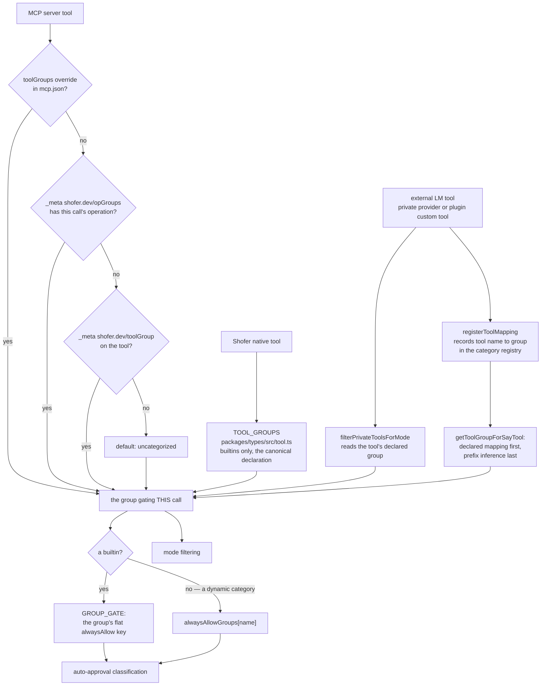
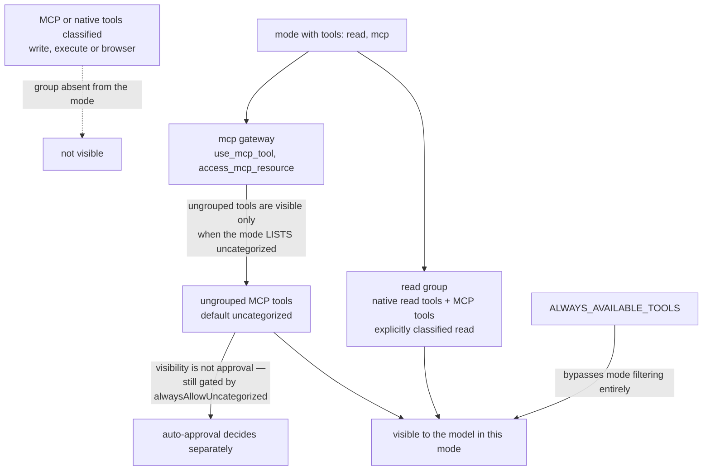

# Tool Categories

**Status:** Implemented  
**Last Updated:** 2026-09-01

## Overview

Shofer uses a single unified ToolGroup system as the **single source of truth** for mode-based filtering, auto-approval classification, and grouping of external language model tools. Every tool — whether native, MCP, or registered by another extension — falls into exactly one category.

The vocabulary is **open over a closed set of builtins**. Eight builtin
categories carry the native tools and the special approval semantics; every
other valid slug is a **dynamic category**, minted the moment something declares
it. Two types express that in [`tool.ts`](../packages/types/src/tool.ts):
`BuiltinToolGroup` is the closed union the exhaustive records are keyed by, and
`ToolGroup = BuiltinToolGroup | (string & {})` is what every declaration site
accepts.

> **Not to be confused with the host boundary's "Category I / II".** The
> ToolGroups here (`read`, `write`, …) classify _tools by capability_. The
> Category I / Category II terminology in [`host-boundary.md`](host-boundary.md)
> is unrelated — it classifies _host interfaces_ (portable seam vs. VS Code
> adapter).

## The 8 Builtin Categories

`toolGroups` in [`tool.ts`](../packages/types/src/tool.ts) — the reserved
vocabulary. Each has a flat `alwaysAllow*` settings key and a hand-rendered UI
row; nothing else does.

| #   | Category        | Purpose                                              | Example tools                                                                       |
| --- | --------------- | ---------------------------------------------------- | ----------------------------------------------------------------------------------- |
| 1   | `read`          | Read-only data access                                | `read_file`, `grep_search`, `list_files`, `ide_file_read`, `ide_get_viewport_state` |
| 2   | `write`         | Content mutations — file creation, editing, patching | `apply_diff`, `write_to_file`, `insert_edit`, `rename_symbol`                       |
| 3   | `execute`       | System command execution                             | `execute_command`, `read_command_output`, `ide_panel_open`                          |
| 4   | `mcp`           | MCP protocol tools                                   | `use_mcp_tool`, `access_mcp_resource`                                               |
| 5   | `mode`          | Mode switching                                       | `switch_mode`                                                                       |
| 6   | `subtasks`      | Delegated task management                            | `new_task`, `check_task_status`, `cancel_tasks`                                     |
| 7   | `questions`     | User-facing questions and follow-ups                 | `ask_followup_question`                                                             |
| 8   | `uncategorized` | Fallback for tools that declare NOTHING usable       | (empty by default; MCP tools that declare no group land here)                       |

`uncategorized` is deliberately narrow: it is the bucket for a tool that
declares nothing, or declares a string that is not a valid slug. A
valid-but-unknown NAME no longer folds into it — that name becomes its own
category.

## Dynamic Categories

Any slug that is not one of the eight is a dynamic category. It behaves exactly
like a builtin for mode filtering and auto-approval; what it does not have is a
flat settings key, a hand-written UI row, or an entry in any exhaustive record.

### The slug rule

`toolGroupNameSchema` validates every category name, builtin or not:
`/^[a-z0-9]+(-[a-z0-9]+)*$/`, 1–64 characters — the same grammar skill names
follow. Two consequences the callers rely on:

- **`*` is reserved and is not a valid slug**, so the `alwaysAllowGroups`
  wildcard can never collide with a real category. `TOOL_GROUP_WILDCARD` in
  [`category-registry.ts`](../packages/core/src/tool-groups/category-registry.ts)
  refuses it explicitly rather than relying on that coincidence.
- **Every builtin name is itself a valid slug**, so "builtin or slug" collapses
  to "slug" at every validation site.

A string that fails the rule is malformed input, not a name: it is dropped to
`uncategorized`.

### Where a category is minted

Registration happens at **discovery**, not at first approval — a toggle that
only appears after a call was already attempted is a broken affordance. Six
sites mint:

| Site                                                                   | What declares the name                                                                              |
| ---------------------------------------------------------------------- | --------------------------------------------------------------------------------------------------- |
| MCP `_meta["shofer.dev/toolGroup"]` and `_meta["shofer.dev/opGroups"]` | `resolveGroup` in [`McpHub.ts`](../packages/core/src/services/mcp/McpHub.ts), at `tools/list`       |
| `toolGroups` map in `mcp.json`                                         | the same `resolveGroup`, over the merged config layer                                               |
| The MCP group dropdown's free-text "New category…" entry               | `McpHub.setToolGroup`, which registers before it writes the file                                    |
| A private-tool provider's `group` (or its `toolGroups` config)         | `resolvePrivateToolGroup` in [`build-tools.ts`](../packages/core/src/task/build-tools.ts)           |
| A plugin's custom-tool `group`                                         | [`custom-tool-registry.ts`](../packages/core/src/custom-tools/custom-tool-registry.ts)              |
| `browser`-prefixed tool names, as a LAST RESORT                        | `getToolGroupForSayTool` in [`auto-approval/tools.ts`](../packages/core/src/auto-approval/tools.ts) |

### The registry

[`toolGroupRegistry`](../packages/core/src/tool-groups/category-registry.ts) is
the one place that knows which dynamic categories exist. It holds two things:

- **The set of registered names** (`registerToolGroup`, `getDynamicToolGroups`,
  `onDidChange`), which the UI renders one auto-approve toggle per, delivered as
  `ExtensionState.dynamicToolGroups`.
- **The declared tool-name → group mapping** (`registerToolMapping`,
  `groupForTool`), which `getToolGroupForSayTool` consults **before** prefix
  inference. Without it, visibility would read a private tool's declared group
  while approval inferred one from its name — so a `salesforce` tool would be
  visible as `salesforce` yet gated as `uncategorized`, its toggle on and the
  call still asking.

Registration grants nothing: a registered category's toggle defaults to ABSENT,
which means ask. Lifetime is the session, and there is deliberately no
deregistration — a stale name is an inert entry in `alwaysAllowGroups`, not an
error.

### `browser` is the worked example

`browser` is a dynamic category and has **no builtin toggle**. It holds no
native tools; every browser tool arrives over MCP, declared by the server or
inferred from the `browser_` prefix. It is gated by
`alwaysAllowGroups["browser"]` like any other dynamic name, and the built-in
modes that list `"browser"` in their `tools` array are simply listing a dynamic
name — `groupEntrySchema` in [`mode.ts`](../packages/types/src/mode.ts) validates
each entry with `toolGroupNameSchema`, so any slug is accepted.

### Declaring a category NARROWS visibility

A tool grouped `salesforce` is visible only in a mode whose `tools` array names
`salesforce`. That is the same rule every category obeys, but it bites harder
for a new one, because no existing mode names it: **a typo'd group in a mode
silently matches nothing**, and a category no mode exposes has a working toggle
in front of tools no model will ever see. The Settings UI says so per category,
via the `settings.json` locale key `autoApprove.dynamicSection.noModeHint`: _"No mode
currently exposes these tools: nothing runs under {{name}} until a mode lists
that category."_

## Where Each Tool Gets Its Group

Three origins, three resolution paths, one shared `ToolGroup` vocabulary:



The registry is what makes the visibility path and the approval path agree: both
read the DECLARED group, so prefix inference only ever runs for a tool nobody
classified.

### 1. Shofer Native Tools — Declared in Code

Each native tool is assigned to a group in [`TOOL_GROUPS`](../packages/types/src/tool.ts) in `packages/types/src/tool.ts`. This is the canonical source for all built-in tools, and it is keyed by `BuiltinToolGroup` — a dynamic category contributes no native tools and has no entry here.

```typescript
export const TOOL_GROUPS: Record<BuiltinToolGroup, ToolGroupConfig> = {
    read:        { tools: ["read_file", "grep_search", ...] },
    write:       { tools: ["apply_diff", "write_to_file", ...], customTools: [...] },
    execute:     { tools: ["execute_command", "read_command_output"] },
    mcp:         { tools: ["use_mcp_tool", "access_mcp_resource", "call_mcp_tool_async", "check_mcp_call_status", "wait_for_mcp_call"] },
    mode:        { tools: ["switch_mode"] },
    subtasks:    { tools: ["new_task", "check_task_status", "cancel_tasks"] },
    questions:   { tools: ["ask_followup_question"] },
    uncategorized: { tools: [] },
}
```

Read it through `getToolGroupConfig(name)`, never by direct index: a name coming from config (a mode's `tools` array, a server's `_meta`) is slug-validated but open, so a dynamic category — or a typo — reaches the lookup and `TOOL_GROUPS[name].tools` would throw.

### 2. External LM Tools — Declared by Whatever Registers Them

Extensions that register language model tools via `vscode.lm.registerTool()` declare each tool's group in their **VS Code configuration** under a `toolGroups` property. Shofer resolves it at runtime in `resolvePrivateToolGroup` ([`build-tools.ts`](../packages/core/src/task/build-tools.ts)), which takes the definition's own `group` first and falls back to the provider's `shofer.<providerId>.toolGroups` config. Either way the name only has to be a valid SLUG — a provider naming a category nobody has used before mints it, and only a malformed name falls through to `uncategorized`.

| Extension               | Config namespace                   | Tool prefix |
| ----------------------- | ---------------------------------- | ----------- |
| `arkware-vscode-tools`  | `arkware.vscodeTools.toolGroups`   | `ide_`      |
| `arkware-browser-tools` | (MCP server — declares in `_meta`) | `browser_`  |

**Example — vscode-tools** (`extensions/vscode-tools/package.json`):

```json
"arkware.vscodeTools.toolGroups": {
    "ide_file_read": "read",
    "ide_file_open": "execute",
    "ide_panel_focus": "execute",
    "ide_get_viewport_state": "read"
}
```

Accepting a group also records the tool-name → group mapping in the registry, which is what lets `getToolGroupForSayTool` gate the tool by what it DECLARED. Prefix inference in [`getToolGroupForSayTool()`](../packages/core/src/auto-approval/tools.ts) is only reached for a tool nothing classified, and guesses two things: a `browser`-prefixed name into the dynamic `browser` category (registering it on the way past), and `ide_` into `execute`.

### 3. MCP Tools — Server Declaration + User Override

MCP tools are classified via a four-tier priority system (highest first),
resolved **per call** by [`getMcpToolGroup`](../packages/core/src/auto-approval/mcp.ts):

1. **User Configuration** — `toolGroups` map in `mcp.json`. A statement about the
   WHOLE tool, so it wins outright; `McpHub.fetchToolsList` records that it was
   the source in the tool's `groupIsUserOverride` flag, and the per-operation
   tier below is skipped when it is set.
2. **Server Declaration, per operation** — `_meta["shofer.dev/opGroups"]`, keyed
   by the value of the call's `operation` argument (see the next section).
3. **Server Declaration, per tool** — `_meta["shofer.dev/toolGroup"]`.
4. **Default Fallback** — `uncategorized`.

**Server-side declaration** — in `_meta`, which is where MCP sanctions custom
metadata:

```json
{
  "tools": [
    { "name": "get_pull_request", "inputSchema": {...}, "_meta": { "shofer.dev/toolGroup": "read" } },
    { "name": "create_issue", "inputSchema": {...}, "_meta": { "shofer.dev/toolGroup": "write" } },
    { "name": "run_workflow", "inputSchema": {...}, "_meta": { "shofer.dev/toolGroup": "execute" } }
  ]
}
```

#### Verb-multiplexing tools: a group per operation

A tool named for a NOUN, taking the verb in an `operation` argument
(`argocd app_list | app_delete`, `vms list | create | delete`), cannot be gated
honestly by one group: the tool name says nothing about whether this call reads
or destroys. Such a server declares **both** keys:

```json
{
	"name": "argocd",
	"inputSchema": { "properties": { "operation": { "enum": ["app_list", "app_delete", "..."] } } },
	"_meta": {
		"shofer.dev/toolGroup": "write",
		"shofer.dev/opGroups": { "app_list": "read", "app_get": "read", "app_delete": "write", "app_sync": "write" }
	}
}
```

- **`shofer.dev/opGroups`** is the refinement: `operation` value → ToolGroup,
  surfaced on `McpTool.opGroups` after discovery-time sanitizing (unknown group
  strings are dropped entry by entry, exactly as an unknown tool-level group is).
- **`shofer.dev/toolGroup` is the FALLBACK, and a well-formed server sets it to
  the MAXIMUM over the operations** — `write` above, because `app_delete` is in
  the enum. A client that ignores `opGroups` entirely then over-gates rather
  than under-gates; a fallback below one of the operations would auto-approve
  that operation on every such client, which is the only unsafe state this
  design can produce.
- The verb is read from the ask envelope's own `arguments` — the same object
  handed to the executor — so **the verb that is gated is by construction the
  verb that runs**. Every way of failing to read it (absent arguments, an
  unparsable blob, a non-string `operation`) returns to the tool-level group.
  None of them widens.

The practical effect: under a posture with `alwaysAllowReadOnly: true` and
`alwaysAllowWrite: false`, `argocd app_list` auto-approves while
`argocd app_delete` raises an approval — same tool, same run, same server.

**It has to be `_meta`, and a top-level `group` field cannot replace it.** The
MCP SDK parses `tools/list` through `ToolSchema`, a plain `z.object`, and zod
strips every key the schema does not declare — so a top-level `group` is deleted
before `McpHub` ever sees it. That is not a cosmetic loss: the tool then
resolves `uncategorized`, and on a headless host (`shofer serve`), whose posture
must not auto-approve that group, **every call to it parks on a
`use_mcp_server` approval nobody is there to answer**. `_meta` is part of
`ToolSchema`, so it survives the parse.

Declaring the group is therefore what makes a tool usable headlessly, and each
group answers differently. A served node seeds only `autoApprovalEnabled: false`
and denies everything else by absence; an **unattended local run** seeds
`alwaysAllowReadOnly`, `alwaysAllowWrite`, `alwaysAllowExecute`,
`alwaysAllowModeSwitch`, `alwaysAllowSubtasks` and
`alwaysAllowGroups: { "*": true }` — the wildcard covering every dynamic
category — but never `alwaysAllowUncategorized`. So under an unattended run a
`read`- or `browser`-declared tool runs while an undeclared one still parks
([`configuration.md`](configuration.md#headless-hosts-the-approval-posture-is-configuration-not-a-flag)).

Which tier a server should use follows from whether its catalog is static: a
fixed set of tools can be described by a `toolGroups` map in the config that
declares the server, but a server whose catalog is **dynamic** (tools added
without anyone rewriting a config file) can only declare in-band, in `_meta`.
The config map is also per TOOL only — there is no per-operation form of it, and
setting it on a verb-multiplexing tool deliberately collapses that tool back to
one group for every verb.

**User-side override** (`~/.shofer/mcp.json` or `.shofer/mcp.json`):

```json
{
	"mcpServers": {
		"github": {
			"command": "npx",
			"args": ["-y", "@modelcontextprotocol/server-github"],
			"toolGroups": {
				"get_pull_request": "read",
				"create_issue": "write",
				"merge_pull_request": "execute"
			}
		}
	}
}
```

## Mode-Based Filtering

When a mode requests tools, each tool's group is checked against the mode's allowed groups. The `mcp` group itself is a **gateway** — the `use_mcp_tool` and `access_mcp_resource` gateway tools live in the `mcp` group, but individual MCP tools use their own assigned groups. This means a mode with `tools: ["read", "mcp"]` gets `use_mcp_tool` + all MCP tools classified as `read`.

**Visibility is per TOOL, approval is per CALL.** Mode filtering happens before
any verb is chosen, so it can only read the tool-level group; a verb-multiplexing
tool is therefore visible or not as a whole, at its maximum group. `opGroups`
refines the _approval_ decision once the model has named an `operation`. A mode
that omits `write` hides `argocd` entirely rather than offering it with only its
reading verbs.

| Built-in mode | Allowed groups                                                                                 |
| ------------- | ---------------------------------------------------------------------------------------------- |
| code          | `read`, `write`, `execute`, `browser`, `mcp`, `mode`, `subtasks`, `questions`, `uncategorized` |
| architect     | `read`, `write` (`.md` only), `browser`, `mcp`, `subtasks`, `questions`                        |
| debug         | `read`, `write`, `execute`, `browser`, `mcp`, `subtasks`, `questions`, `uncategorized`         |
| code-search   | `read`, `execute`, `browser`, `mcp`, `questions`                                               |
| web-search    | `browser`, `questions`, `mcp`                                                                  |
| reviewer      | `read`, `execute`, `browser`, `mcp`, `subtasks`, `questions`                                   |

`browser` in those lists is a **dynamic** category name, not a builtin — the mode
schema validates each entry as a slug, so a mode may list any category the same
way. A mode listing a category nothing has registered simply matches no tools.

Worked through for a mode declaring `tools: ["read", "mcp"]`:



### Always-available tools

These tools bypass mode filtering entirely, defined in the [`ALWAYS_AVAILABLE_TOOLS`](../packages/types/src/tool.ts) constant:

`attempt_completion`, `update_todo_list`, `run_slash_command`, `skills`, `set_task_title`, `give_feedback`, `list_background_tasks`, `send_message`, `reply`, `wait`, `describe_tools`

`describe_tools` is the one member with a further condition: it belongs to the constant so that a mode which tiers its tool schemas (`tools_full_schema` — see [`tool_access.md`](tool_access.md)) gets it without listing it, and `computeToolAccess` removes it again for a mode that declares no tiering, which has no stubbed tool to describe.

### MCP tools without group

Tools with no `_meta["shofer.dev/toolGroup"]` (and no `toolGroups` entry) default to `"uncategorized"` (see `McpHub.fetchToolsList`). `uncategorized` is an **ordinary group** for visibility — a mode sees ungrouped MCP tools only when it lists `uncategorized`, the same rule `filterPrivateToolsForMode` applies (one vocabulary, no gateway implication). Their _auto-approval_ is still gated by `alwaysAllowUncategorized` — visibility does not loosen the approval requirement. Tools explicitly reassigned to a different group (e.g. `"browser"`, `"read"`, `"write"`) are gated by that group's inclusion in the mode.

For example, a mode with `tools: ["read", "mcp"]` exposes:

- The `mcp` gateway tools (`use_mcp_tool`, `access_mcp_resource`)
- All MCP tools classified as `read` (explicitly assigned)
- But NOT tools classified as `write`, `execute`, `browser`, or `uncategorized` — the mode lists none of those, and the `mcp` gateway does not imply `uncategorized`

## Adding a New Extension's Tools

1. Declare each tool's group — in the definition's own `group`, or in a `toolGroups` configuration contribution in the extension's `package.json` (see `arkware.vscodeTools.toolGroups` for the existing pattern).
2. **Pick any slug you like.** The name does not have to be one of the eight builtins and does not have to exist anywhere first: a valid slug that is not a builtin becomes a dynamic category the moment the tool is discovered, with its own auto-approve toggle in Settings and in the chat Auto-Approve dropdown. There is no enum to extend and no settings key to add.
3. **Name it in a mode.** A category narrows visibility, so a tool grouped `salesforce` is invisible until some mode's `tools` array lists `salesforce`. Settings flags a category no mode exposes.
4. Prefix inference is a fallback for tools that declare nothing: `browser`-prefixed names resolve to the dynamic `browser` category and `ide_` to `execute`, in [`getToolGroupForSayTool()`](../packages/core/src/auto-approval/tools.ts). Prefer declaring — a declaration is a fact, a prefix is a guess, and a declared group is registered at discovery rather than at first approval.

## Gaps, Issues & Areas for Improvement

This section tracks known deficiencies in this document and in the tool-group system itself, discovered during verification against source.

### Document structure gaps

- **No coverage of `TOOL_ALIASES`**: The [`TOOL_ALIASES`](../packages/types/src/tool.ts) constant maps deprecated tool names to canonical ones (e.g., `write_file` → `write_to_file`, `search_and_replace` → `edit`). This document does not explain how aliases interact with tool groups — aliased tools inherit the group of their canonical form.
- **No coverage of `customTools`**: The `write` group has a `customTools` array (`["edit", "search_replace", "edit_file", "apply_patch"]`). These are legacy/alias edit tools that receive special handling in the parser. The document does not explain what `customTools` means or how they differ from regular `tools`.
- **No coverage of `filterPrivateToolsForMode`**: The document mentions `filterNativeToolsForMode` and `filterMcpToolsForMode` (implicitly), but the third filter — `filterPrivateToolsForMode` (for extension-registered private tools like `ide_*`) — is not discussed in its own right. Note it is module-private to [`build-tools.ts`](../packages/core/src/task/build-tools.ts), while `filterNativeToolsForMode` and `filterMcpToolsForMode` are exported from [`filter-tools-for-mode.ts`](../packages/core/src/prompts/tools/filter-tools-for-mode.ts) — the three are not co-located.

### Source-of-truth risks

- **No version pin in the doc**: The header carries a "Last Updated" date but no version number that can be correlated with the extension version that last changed `TOOL_GROUPS` or the `builtin-config` plugin's mode definitions. Consider adding a `Version` field that matches the extension version at the time of last verification.

### Tool-group system design observations

- **`alwaysAvailable` is not a group-level property**: The old doc erroneously showed `alwaysAvailable: true` as a field on the `mode` group entry in `TOOL_GROUPS`. In reality, `ToolGroupConfig` has only `tools` and `customTools`; always-availability is a separate constant `ALWAYS_AVAILABLE_TOOLS` that is checked independently of groups.
- **`new_task` lives in `subtasks`, not `mode`**: Although `new_task` is about task lifecycle, it belongs to the `subtasks` group (alongside `check_task_status` and `cancel_tasks`), not the `mode` group (which contains only `switch_mode`). The `subtasks` group is the correct home because `new_task` is a control-plane subtask tool that shares the `alwaysAllowSubtasks` auto-approval toggle.
- **`give_feedback` is always-available but not in any group**: [`give_feedback`](../packages/types/src/tool.ts) is in `ALWAYS_AVAILABLE_TOOLS` but does not appear in any `TOOL_GROUPS` entry. This is intentional — always-available tools are injected into every mode's tool set regardless of group membership.
- **A dynamic category is a name with no schema behind it**: nothing validates that the category a server declares means what a user's toggle assumes it means. The slug rule is the only check, so two unrelated servers may both declare `data` and share one toggle. That is inherent to a vocabulary anyone may extend; the containment is that a category grants nothing until someone turns it on.

## References

- [ToolGroup Type Definitions](../packages/types/src/tool.ts)
- [Mode Configuration](../packages/types/src/mode.ts)
- [External Tool Resolution](../packages/core/src/task/build-tools.ts)
- [MCP Hub — Tool Metadata](../packages/core/src/services/mcp/McpHub.ts)
- [Auto-Approval Tool Group Inference](../packages/core/src/auto-approval/tools.ts)
- [Per-Call MCP Group Resolution](../packages/core/src/auto-approval/mcp.ts)
- [Dynamic Category Registry](../packages/core/src/tool-groups/category-registry.ts)
- [Per-Group Approval Gates](../packages/core/src/auto-approval/group-gates.ts)
