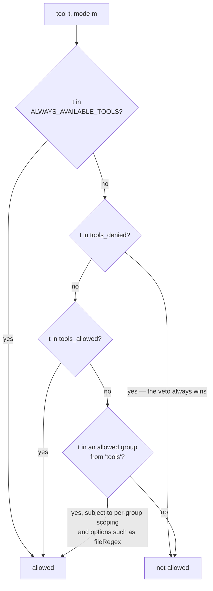
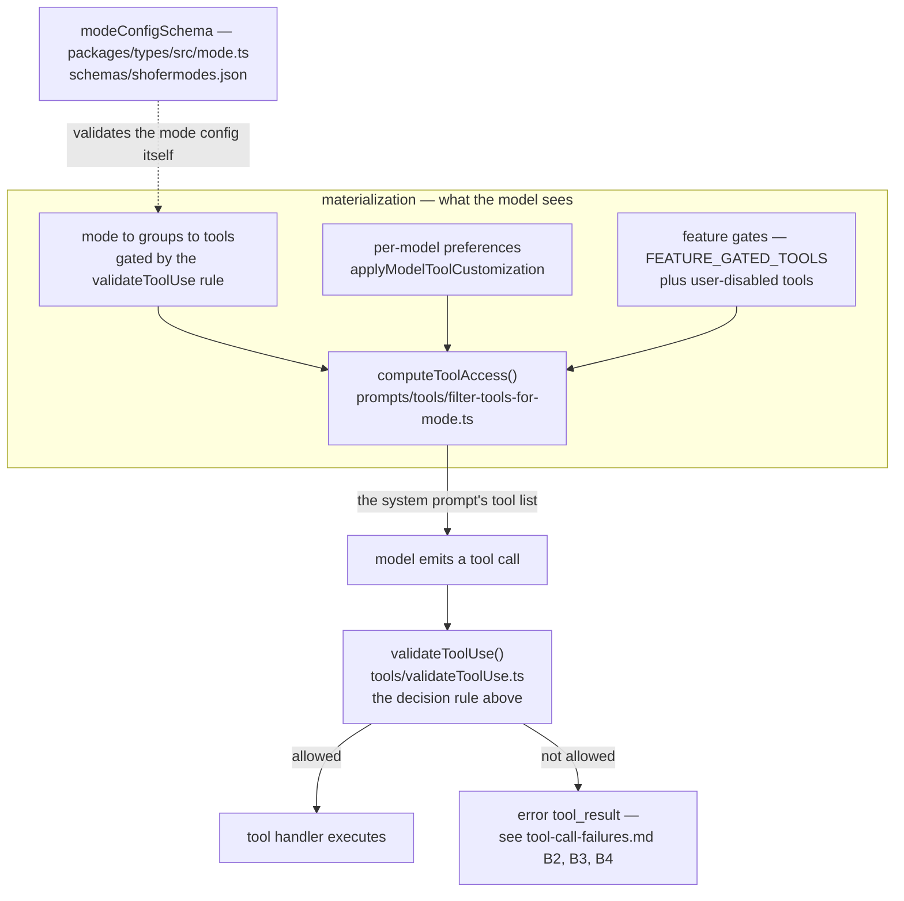

# Tool Access Control in Shofer Modes

This document describes how a mode's available toolset is computed at runtime
from its configuration. It is the authoritative reference for the three
mode-level fields that govern tool access:

- `tools`
- `tools_allowed`
- `tools_denied`

A fourth field, `tools_full_schema`, is on a different axis: it changes nothing
about which tools a mode HAS, only how much of each admitted tool's contract is
sent to the model (§`tools_full_schema`).

> **See also:** [`tool_preferences.md`](./tool_preferences.md) — how a specific
> **model** opts into/out of tools (`includedTools`/`excludedTools`, dialect &
> naming) across the three model-access paths, and where that metadata lives.
> Mode access (this doc) and per-model preferences are composed at runtime.

## Schema

Defined in [`packages/types/src/mode.ts`](../packages/types/src/mode.ts):

```ts
export const modeConfigObjectSchema = z.object({
	slug: z.string().regex(/^[a-zA-Z0-9-]+$/),
	name: z.string().min(1),
	roleDefinition: z.string().min(1),
	whenToUse: z.string().optional(),
	description: z.string().optional(),
	customInstructions: z.string().optional(),
	tools: groupEntryArraySchema.optional(),
	tools_allowed: z.array(z.string()).optional(),
	tools_denied: z.array(z.string()).optional(),
	tools_full_schema: z.array(z.string()).optional(),
	source: z.enum(["global", "project"]).optional(),
	provider: z.string().optional(),
})

export const modeConfigSchema = modeConfigObjectSchema.refine(
	(data) => data.tools !== undefined || data.tools_allowed !== undefined,
	{ message: "Either 'tools' or 'tools_allowed' must be provided" },
)
```

All three access-control fields are individually optional. The only structural
constraint is that **at least one of `tools` or `tools_allowed` must be
present** — `tools_denied` alone is not a valid configuration because there
would be no allow source for it to subtract from.

## Decision rule

For any tool `t` and any mode `m`, the runtime decision (in
[`packages/core/src/tools/validateToolUse.ts`](../packages/core/src/tools/validateToolUse.ts))
is:

```
allowed(t, m)  ⇔  ( t ∈ tools(m)  ∨  t ∈ tools_allowed(m) )  ∧  t ∉ tools_denied(m)
```

Where `groups(m)` includes per-group scoping: if a group entry uses the
scoped form `{ "groupName": { allowed: [...], denied: [...] } }`, only
tools matching the scope are included.

Equivalently, `tools_denied` is an unconditional veto applied on top of the
union of the two allow sources. The check order in code is:

1. **Deny check first.** If `t ∈ tools_denied`, return `false` immediately.
   The deny-list always wins; there is no override.
2. **Explicit allow.** If `t ∈ tools_allowed`, return `true`.
3. **Group allow.** Otherwise, walk `tools` and return `true` if `t` is in
   any allowed group (subject to per-group scoping and options such as the
   `edit` group's `fileRegex` restriction).
4. If none of the above match, return `false`.

So for the ultimate decision, allow sources combine with **OR** semantics
(union), and the deny-list combines with **AND-NOT** semantics (set difference).



> The `ALWAYS_AVAILABLE_TOOLS` fast-path shown first is **not** part of the
> four-step order written above — it precedes all of it in
> `isToolAllowedForMode()`. See
> [§Decision rule omits `ALWAYS_AVAILABLE_TOOLS` fast-path](#decision-rule-omits-always_available_tools-fast-path).

## Field-by-field reference

### `tools`

A list of broad capability groups (e.g. `read`, `write`, `execute`, `mcp`,
`browser`). Each entry can be one of three forms:

1. **Bare group name** (string): grants all tools in the group.

    ```yaml
    tools: [read, mcp]
    ```

2. **Tuple `[name, options]`**: group with metadata such as `fileRegex`.

    ```yaml
    tools: [["write", { fileRegex: "\\.md$" }]]
    ```

3. **Scoped group object** `{ name: { allowed?, denied? } }`: narrows the
   tool set the group normally provides.
    - `allowed`: exclusive list — only these tools from the group are available.
      Must be a subset of what the group normally registers.
    - `denied`: removes the listed tools from the group's normal set.
    ```yaml
    tools:
        - browser
        - mcp
        - read:
              allowed:
                  - mcp--shofer--web_search
    ```
    In this example the mode gets ALL `browser` and `mcp` tools, but from the
    `read` group it gets ONLY `mcp--shofer--web_search` — not `read_file`,
    `grep_search`, etc.

Group definitions are in [`packages/types/src/tool.ts`](../packages/types/src/tool.ts) as
`TOOL_GROUPS`, which maps each group name to the concrete tool IDs it grants,
and are re-exported from [`packages/types/src/tools.ts`](../packages/types/src/tools.ts).

### `tools_allowed`

A flat list of tool IDs that are explicitly granted, independently of any
group membership. Use this when:

- you want fine-grained tool selection without pulling in a whole group, or
- you want to add a single tool to a mode whose other permissions come from
  groups (the two compose with OR).

A mode may declare access purely through `tools_allowed` and omit `tools`
entirely (the schema requires _either_ `tools` or `tools_allowed`). This is the
pattern for a tightly-scoped read-only custom mode — e.g. a `.shofer/shofermodes`
mode that grants only `read_file`/`grep_search` and nothing else. (Note: the
built-in `reviewer` mode is **not** such a mode — it uses `tools`; see
[`plugins/builtin-config/docs/modes.md`](../plugins/builtin-config/docs/modes.md).)

### `tools_denied`

A flat list of tool IDs that are unconditionally forbidden, regardless of
whether `tools` or `tools_allowed` would otherwise grant them. This is the
right field for "subtract one tool from an otherwise broad permission set"
patterns — e.g. grant the `execute` group but deny `execute_command`.

### `tools_full_schema` — the presentation tier, not an access field

The three fields above answer _may the agent call this tool_.
`tools_full_schema` answers a different question: _how much of the tool's
contract is put in front of the model_. It grants nothing and forbids nothing,
and the decision rule above is untouched by it.

Every tool a mode admits is serialized into the tools array of **every** request
and re-attended on every turn, so a chat-shaped agent fronting a large MCP
catalog pays for the whole catalog to call two of it. Declaring
`tools_full_schema` splits the surface into three tiers:

| Tier            | What the model gets                                                                                                            |
| --------------- | ------------------------------------------------------------------------------------------------------------------------------ |
| **full schema** | the tools named in `tools_full_schema` — their definitions, unchanged                                                          |
| **stub**        | every other admitted tool: name, one line of its own description, and a schema declaring one string property, `arguments_json` |
| **discovery**   | `describe_tools(names[])`, which returns the real contracts of any of them                                                     |

```yaml
- slug: orchestrator
  tools: [mcp, questions, subtasks]
  tools_full_schema: [attempt_completion, ask_followup_question, new_task]
```

Semantics, all of which follow from "presentation, not access":

- **Absent ⇒ no tiering.** Every admitted tool carries its full schema and
  `describe_tools` is not offered, so a mode that says nothing about this field
  builds byte-for-byte the array it always built.
- **Present (including `[]`) ⇒ tiering is on**, and `describe_tools` is admitted
  and always carries its full schema — a stubbed discovery tool could describe
  nothing.
- **Names are matched as the MODEL sees them**, so an MCP tool is named
  `mcp--<server>--<tool>` and a plugin tool by its own name.
- **Denial still wins.** A name here that the mode does not admit stays absent;
  this field cannot re-admit it.
- **A stub is individually callable.** It is an ordinary entry in the tools
  array — no dispatcher, no routing tool.
- **A stub declares one property, `arguments_json`, and that is not cosmetic.**
  Moonshot/Kimi and MiniMax decode tool arguments under a grammar compiled from
  the DECLARED schema, so a stub declaring no properties admits exactly one
  output — `{}` — on every call, forever. The constraint outranks the stub's
  prose and outranks the `describe_tools` result riding the message stream, so
  the model reads the real contract and still cannot emit it, and there is no
  self-heal. The stub therefore declares one string property holding the real
  arguments JSON-encoded, which every constrained decoder can express.
  `additionalProperties` stays open and nothing is `required`, so a provider that
  lets the model emit direct arguments keeps doing that and a zero-argument call
  may still be `{}`.
- **The hatch never survives the parser.**
  [`NativeToolCallParser`](../packages/core/src/assistant-message/NativeToolCallParser.ts)
  unwraps `{arguments_json: "<json object>"}` back into ordinary arguments before
  anything validates them, so no handler, Zod schema or MCP server learns it
  exists. It unwraps on any tool, not only one stubbed in this request — a model
  that learned the pattern keeps using it — which is unambiguous because no real
  tool declares a parameter by that name, the property must be the SOLE key, and
  its value must decode to a JSON object. Alongside another key it is left
  untouched; unparseable, the model gets an error naming `arguments_json` and
  carrying the parse failure, which it can act on.
- **A stub weakens no validation.** It changes only what is shown; execution
  still runs the real contract, against the unwrapped arguments — a native tool's
  own missing-parameter error (or, for a required argument its parser guards on,
  the dispatcher's "arguments could not be parsed"), a plugin tool's Zod parse at
  dispatch, an MCP server's schema validation. That is also the recovery path
  when the model skips discovery: it gets the ordinary validation error,
  unchanged, and can react to it.

It is an ALLOW-list rather than a stub-list on purpose: the admitted set grows on
its own — an MCP catalog gains a tool, a plugin contributes one — and a stub-list
would silently let every newcomer back into the full-schema tier. Here a
newcomer arrives as a stub, which costs one `describe_tools` call.

**Set it per deployment, never per turn.** The tools array serializes into the
provider's cached request prefix, so a schema fetched mid-conversation is never
injected back into it — `describe_tools` answers through the message stream,
which is append-only and cache-safe. Varying the tiers between turns would cost
more in cold prefixes than the stubs save.

Implementation:
[`packages/core/src/prompts/tools/tool-stubs.ts`](../packages/core/src/prompts/tools/tool-stubs.ts)
(the tiers), applied in
[`packages/core/src/task/build-tools.ts`](../packages/core/src/task/build-tools.ts)
after mode filtering, with the pre-stub definitions recorded in
[`packages/core/src/tools/tool-schema-registry.ts`](../packages/core/src/tools/tool-schema-registry.ts)
for
[`describe_tools`](../packages/core/src/tools/DescribeToolsTool.ts) to answer
from. The TOOL USE and CAPABILITIES sections of the system prompt say so when a
mode tiers ([`system_prompt.md`](system_prompt.md)).

## Worked examples

### Example 1: groups only (built-in modes)

```yaml
- slug: code
  name: 💻 Code
  tools: [read, write, execute, mcp, browser]
```

Result: every tool in any of those five groups is allowed. No
`tools_allowed` overlay, no denials.

### Example 2: tools_allowed only (a hypothetical read-only custom mode)

```yaml
# A custom .shofer/shofermodes mode — NOT the built-in `reviewer` (which uses tools).
- slug: read-only-auditor
  name: 🔍 Read-Only Auditor
  roleDefinition: "You audit code; you never modify it."
  tools_allowed: [read_file, grep_search, list_files, lsp_search]
```

Result: only those four tool IDs are allowed. The mode has no `tools` array,
which is valid because `tools_allowed` is present.

### Example 3: tools + tools_allowed (additive)

```yaml
- slug: architect
  tools: [read]
  tools_allowed: [new_task]
```

Result: every tool in `read`, plus `new_task`. The two sources are unioned.

### Example 4: tools + tools_denied (subtractive)

```yaml
- slug: safe-coder
  tools: [read, write, execute]
  tools_denied: [execute_command]
```

Result: every tool in `read`, `write`, and `execute` **except**
`execute_command`. The deny-list applies on top of the union and cannot be
overridden.

### Example 5: deny wins over allow

```yaml
- slug: paranoid
  tools_allowed: [read_file, execute_command]
  tools_denied: [execute_command]
```

Result: `read_file` is allowed, `execute_command` is denied. Even though
`execute_command` appears in `tools_allowed`, the deny check runs first and
short-circuits.

## Where this is enforced

Two distinct moments: **materialization** decides what the model is ever shown,
**runtime enforcement** re-checks the call the model actually made.



- **Runtime enforcement (per tool call):**
  [`packages/core/src/tools/validateToolUse.ts`](../packages/core/src/tools/validateToolUse.ts)
  — the source of truth for the decision rule above.
- **System-prompt tool listing (materialization):**
  [`packages/core/src/prompts/tools/filter-tools-for-mode.ts`](../packages/core/src/prompts/tools/filter-tools-for-mode.ts)
  — `computeToolAccess()` is the single source of truth for which tools are
  _available_ (§4). It composes, as one ordered decision, the three historically
  separate systems: (1) mode → groups → tools (gated by the `validateToolUse`
  rule above), (2) per-model preferences (`applyModelToolCustomization`), and
  (3) feature gates (the `FEATURE_GATED_TOOLS` table — `rag_search`, `git_search`,
  `ask_live_memory`, `generate_image`, `run_slash_command`, `access_mcp_resource`,
  `update_todo_list`) plus user-disabled tools. It is pure (callers resolve the
  gate booleans from the runtime managers), so the model only sees tools it can call.
- **Schema validation:**
  [`packages/types/src/mode.ts`](../packages/types/src/mode.ts) and the
  exported JSON schema in
  [`schemas/shofermodes.json`](../schemas/shofermodes.json).

## Related tests

- [`packages/core/src/tools/__tests__/validateToolUse.spec.ts`](../packages/core/src/tools/__tests__/validateToolUse.spec.ts)
  pins the decision rule, including:
    - allows from `tools_allowed` whitelist alone (no `tools`),
    - additive OR semantics when both `tools` and `tools_allowed` are set,
    - `tools_denied` priority over `tools_allowed`.

## Known Gaps, Issues & Improvement Areas

### JSON Schema vs Zod Schema discrepancy — ✅ fixed

Previously the exported JSON schema in
[`schemas/shofermodes.json`](../schemas/shofermodes.json) listed `tools` in
`required`, contradicting the Zod `modeConfigSchema` `.refine` (which allows
`tools_allowed` without `tools`) and rejecting valid tools_allowed-only modes.
Corrected: the item `required` is now `["slug", "name", "roleDefinition"]` plus an
`anyOf: [{ required: ["tools"] }, { required: ["tools_allowed"] }]`, matching the
Zod "either tools or tools_allowed" constraint.

### Decision rule omits `ALWAYS_AVAILABLE_TOOLS` fast-path

The check order documented in §Decision rule describes
deny → tools_allowed → groups → false. The actual implementation in
[`isToolAllowedForMode()`](../packages/core/src/tools/validateToolUse.ts:200) has a
fast-path before any of those checks: `ALWAYS_AVAILABLE_TOOLS` (comprising
`attempt_completion`, `describe_tools`, `wait_for_message`, `update_todo_list`,
`run_slash_command`, `skills`, `set_task_title`, `give_feedback`,
`list_background_tasks`, and `send_message_to_task`) unconditionally returns
`true`. This means these ten tools always pass mode-level checks regardless of
`tools`, `tools_allowed`, or `tools_denied`. `describe_tools` is the one
qualified member: it passes the runtime check everywhere, but `computeToolAccess`
removes it from the tools a mode is SHOWN unless that mode declares
`tools_full_schema` — a mode with no stubs has nothing to describe. Disabling them requires the `disabledTools`
setting (checked earlier in `validateToolUse()` via `toolRequirements`), not
mode configuration.

### Schema code block omits Zod error messages

The code block in §Schema matches the structural shape of
`modeConfigObjectSchema` but omits the error-message arguments present in the
actual source (e.g. `z.string().min(1, "Name is required")` vs
`z.string().min(1)`). The "Defined in" link is sufficient for look-up, but
reproducing the exact source would prevent false-"it differs" impressions
during code reviews.

### Stale references from past tool deprecation

The removed `list_code_definition_names` tool (CHANGELOG PR #10005) was still
referenced in §Example 2 (replaced with `lsp_search` during this review).
There is no automated mechanism to surface stale tool-name references in docs
when a tool is deprecated. The existing "Native Tool Documentation Sync Rule"
in [`AGENTS.md`](../AGENTS.md) covers `docs/native_tools.md` but other
documentation files (like this one) are not covered. The
"Tool Deprecation Doc-Cleanup Rule" was added to `AGENTS.md` to address this.

### Stale group names from past renames

The `edit` and `command` groups were renamed to `write` and `execute`
(respectively) but four occurrences in this document's worked examples still
used the old names (corrected during this review). The "Group Rename Doc-Sync
Rule" was added to `AGENTS.md` to prevent this class of staleness.
