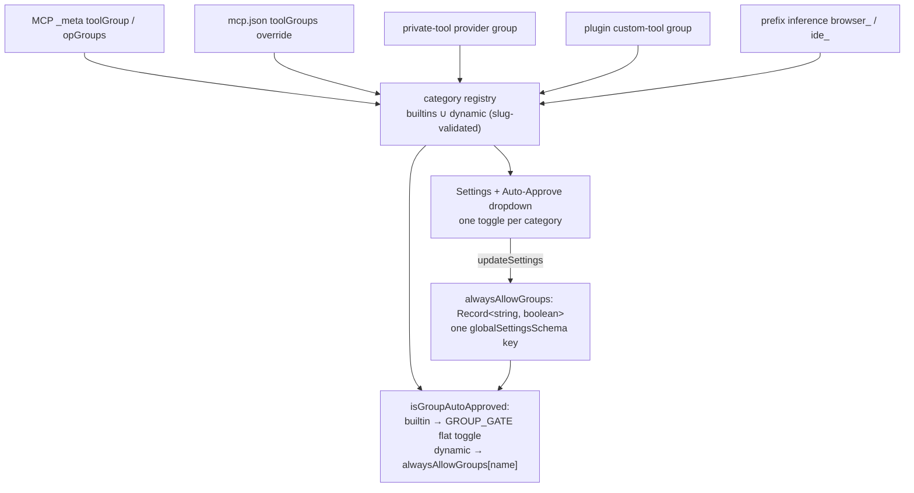

# User-defined (dynamic) tool categories

<!-- @review id=fuva3 by=human "categories": I'm thinking whether we should generalize and adopt the tagging mechanism that we already use in JustCEO for tool categories, meaning that a tool can have multiple tags (some reserved) and the UI hows them all docs/object_tags.md -->
<!-- @review id=k3nvp re=fuva3 by=agent "categories": Considered properly now (new first decision bullet). Recommendation: adopt the fabric's IDEAS, not multi-valued gating. (1) Approval over a tag SET needs a conjunction rule at every seam, which every server author must then understand; (2) the _meta shofer.dev/toolGroup key is a singular public wire contract (third-party MCP servers follow it, and the platform-side per-op derivation assumes one group per operation); (3) the two-dimension need it serves is already expressible per op via opGroups, e.g. list resolving read beside delete resolving salesforce, so read verbs ride the read toggle while the domain toggle gates mutations. Adopted from the fabric: builtins as the reserved vocabulary, meaning-lives-in-consumers, and a slug grammar that is a strict subset of the tag atom with colon excluded, so namespaced categories and a later widening to real tag sets stay open without renames. Revisit trigger: a tool needing a domain gate AND a danger gate on the same call. -->
<!-- @review id=x84fx re=fuva3 by=agent "categories": On the consistency motive specifically: the fabric's tags LABEL objects and meaning lives in the consumers, while a ToolGroup IS the gate, so matching the fabric's cardinality would change enforcement semantics rather than naming. The consistency worth having is grammar and vocabulary shape (slug as a strict subset of the tag atom, colon reserved for namespaces, builtins as the reserved set), and the design keeps exactly that. -->

The tool-category vocabulary is **open, over a closed set of 8 builtins**.
This doc is the design record — the decisions and their reasoning; the
consumer-facing references are [`tool-categories.md`](tool-categories.md)
(the category model) and [`auto_approval.md`](auto_approval.md) (the gates).
The model:

1. **The 8 builtin groups are fixed.** `read`, `write`, `execute`, `mcp`,
   `mode`, `subtasks`, `questions`, `uncategorized` carry native tools or
   approval semantics the static tables must encode; each keeps a flat
   `alwaysAllow*` toggle and a hand-written UI row. They are the
   `BuiltinToolGroup` type, keying the two exhaustive records
   (`TOOL_GROUPS`, `GROUP_GATE`).
2. **Any other category is created on demand.** When a tool is registered
   under a group name that is not a builtin — an MCP server declaring
   `_meta["shofer.dev/toolGroup"]: "salesforce"`, a `toolGroups` override in
   `mcp.json`, a private-tool provider's `group`, a plugin's custom-tool
   `group`, or a name typed into the MCP group dropdown — that name becomes a
   **dynamic category**: validated as a slug (`toolGroupNameSchema`),
   registered in the runtime registry, and from then on treated like a
   builtin for mode filtering and auto-approval. A string that fails the
   slug rule is malformed input and drops to `uncategorized`, absent-toggle
   = ask — the same fail-closed posture either way.
3. **UI and API support.** Every registered dynamic category appears in the
   Auto-Approve settings section ("Custom categories") and in the chat
   Auto-Approve dropdown with its own toggle. The toggle state lives in ONE
   settings key, `alwaysAllowGroups: Record<string, boolean>`, which flows
   through the layered `.shofer/` scopes, `ContextProxy`, the
   `updateSettings` webview message, the headless posture seed, and
   `ExtensionState` like any other setting — so a controller driving the
   ShoferApi can read and set it.
4. **`browser` is the first dynamic category.** It carries zero native tools
   — every browser tool arrives over MCP (declaring the group in `_meta`)
   or is classified by the last-resort `browser_` prefix inference — so it
   lives entirely on the dynamic path: registration, toggle storage, UI
   rendering, headless posture. There is no `alwaysAllowBrowser` key.

<!-- @review id=gqgui by=human "uncategorized": but given that any unrecognized category becames a new category, then why do we need &quot;uncategorized&quot;? -->
<!-- @review id=w7dqa re=gqgui by=agent "uncategorized": It stays because it is the bucket for a tool that declares NOTHING: a dynamic category is minted from a declared NAME, and an absent _meta or config entry has no name to mint from (a non-slug string is malformed input, not a name). Its posture is also deliberately special, meaning danger-unknown: excluded from BOTH headless seeds and special-cased by the integrator's manifest review, which no ordinary category toggle should casually cover. What changes under this design is that it SHRINKS to exactly the undeclared plus the malformed, since a valid-but-unknown name no longer folds into it. Added a decision bullet stating this in the body. -->

There is no compatibility path for the retired flat key: a stale
`alwaysAllowBrowser` in an old `settings.json` is stripped by
`globalSettingsSchema.partial()` like any unknown key (the repo's
no-backward-compatibility rule; the minor version was bumped for the
persisted-state shape change).

## Model

## Design decisions

- **One group per tool, not a tag set.** A multi-valued tag model (one
  store, reserved namespaces, meaning lives in the consumers — the shape
  some platforms use for object labels) was considered for consistency: a
  tool tagged `salesforce` AND `write` would express domain and danger at
  once. Rejected, on three grounds. (1) Tags of that kind LABEL objects; a
  ToolGroup IS a gate, so gating over a SET needs a conjunction rule at
  every seam (approval = every tag's gate passes; visibility = which?), and
  every server author must then understand it. (2)
  `_meta["shofer.dev/toolGroup"]` is a singular, public wire contract that
  third-party MCP servers follow, and per-op derivations on the server side
  assume one group per operation. (3) The two-dimension need is already
  expressible per operation: `opGroups` may map `list` → `read` beside
  `delete` → `salesforce`, so the read verbs ride the read toggle while the
  domain toggle gates the mutations. What IS adopted from the tag model:
  builtins as the reserved vocabulary, meaning-lives-in-consumers, and a
  slug grammar chosen as a strict subset of a tag atom with `:` excluded —
  so namespaced platform-stamped categories, and a later widening of
  `group` to a tag set, stay open without renaming anything. Revisit when a
  tool needs a domain gate and a danger gate on the SAME call.
- **`uncategorized` stays, and shrinks.** A dynamic category is minted from
  a declared NAME; a tool that declares nothing has no name to mint from,
  and a non-slug string is malformed input, not a name. Both land in
  `uncategorized`, whose posture is deliberately special — excluded from
  both headless seeds — because it means "danger unknown", which no
  ordinary toggle should casually cover. The bucket holds exactly the
  undeclared and the malformed; a valid-but-unknown name no longer folds
  into it.
- **Name validation** reuses the skill-name slug rule
  (`/^[a-z0-9]+(-[a-z0-9]+)*$/`, max 64) as `toolGroupNameSchema` in
  `packages/types/src/tool.ts`.
- **Toggle shape: one record key, not synthesized flat keys.** A dynamic
  `alwaysAllow<Something>` key can never be routed — `ContextProxy` routes
  by `GLOBAL_STATE_KEYS`, `globalSettingsSchema` strips unknown keys, and
  `parseScopeSettings` silently drops them. `alwaysAllowGroups` is
  consulted **only for non-builtin groups** — a builtin name inside the map
  is ignored, so each category has exactly one source of truth for its
  toggle.
- **Wildcard:** `alwaysAllowGroups["*"] === true` approves every dynamic
  category; an explicit per-category `false` beats the wildcard (same
  deny-by-exception shape as `allowedCommands`/`deniedCommands`). The
  wildcard exists for the unattended headless seed, whose rationale ("the
  person who typed the command is the author of that grant") covers
  categories nobody has met yet. `*` is not a valid slug, so it can never
  collide with a real category name; the UI's new-category entry refuses it
  by name rather than by accident.
- **The write is a per-entry PATCH, never the whole effective map.** The
  record the webview displays is deep-merged across scopes; posting that
  whole record back would copy org-scope entries into the user write-scope
  file, where they would shadow the org's later changes forever. So the
  `alwaysAllowGroups` value in an `updateSettings` payload is a patch —
  entries to set, `null` deletes — and the host merges it into the write
  scope's OWN map (`ContextProxy.getWriteScopeValue`), never the effective
  view.
- **Locking has per-entry granularity.** `alwaysAllowGroups/<name>` in
  `locked.json` locks one entry (the record-entry variant in
  `packages/core/src/config/layered-config.ts`); the bare key locks the
  whole map. Scopes can only ADD or OVERRIDE entries, so an org revokes a
  grant by locking an explicit `false`, never by deleting the entry.
- **Dynamic categories get no modifier toggles** (no outside-workspace /
  protected variants). Those modifiers are `read`/`write`-specific and
  `isPathAutoApproved` refuses other groups.
- **No danger ordering.** Group gates are independent booleans; a
  "maximum over operations" rule belongs to whatever derives a server's
  `opGroups`, not to this repo.
- **Declaring a category NARROWS visibility, and that is accepted.** A tool
  grouped `salesforce` is visible only in a mode that lists that name —
  where an undeclared tool would at least have been visible as
  `uncategorized` in modes listing it. This is the same containment logic
  that keeps a `write`-level tool family out of read-only modes, and
  auto-inheriting `uncategorized` visibility would conflate "declared
  something new" with "declared nothing". The Settings row shows a hint
  when NO mode currently lists a category. Side effect: a typo'd group
  name in a mode config validates (any slug does) and silently matches
  nothing — indistinguishable from a category whose server has not
  connected yet, which is why the surfacing is that UI hint rather than a
  load-time error. Builtin modes keep listing `"browser"`, now simply a
  dynamic name they happen to name.
- **The gate widens for dynamic groups only.** On the native say-tool path,
  `checkAutoApproval` approves exactly `read`/`write` (the modifier-bearing
  groups) and any group with no `GROUP_GATE` entry (a dynamic category,
  gated by `alwaysAllowGroups`); every other builtin keeps its intentional
  fall-through to a user prompt. Widening those would change real
  semantics — an `execute`-resolved say tool (the `ide_` inference) would
  auto-approve on `alwaysAllowExecute` alone, without the command-allowlist
  leg that toggle requires.

## Where it lives

- **Vocabulary and types** — `packages/types/src/tool.ts`
  (`toolGroups`/`BuiltinToolGroup`/`ToolGroup`/`toolGroupNameSchema`/
  `getToolGroupConfig`), `mode.ts`/`modes.ts`/`shofermodes-schema.ts` (mode
  group entries accept any slug), `global-settings.ts`
  (`alwaysAllowGroups`), `vscode-extension-host.ts` (`ExtensionState`
  carries the map and the `dynamicToolGroups` registry snapshot).
- **Registry** — `packages/core/src/tool-groups/category-registry.ts`
  (`toolGroupRegistry`: `register`, `registerToolMapping`, `groupForTool`,
  `getDynamicGroups`, `onDidChange`). Registration happens at every
  declaration site: `McpHub.resolveGroup`/`resolveOpGroups`/`setToolGroup`,
  `build-tools.ts` (`resolvePrivateToolGroup`,
  `restrictToolsToDeclaredGroups`), the custom-tool registry, and the
  last-resort `browser_` prefix inference in `auto-approval/tools.ts`. The
  declared tool-name → group mapping is what keeps the visibility filter
  and `getToolGroupForSayTool` in agreement (the Dual-Resolution Rule).
- **The gate** — `packages/core/src/auto-approval/group-gates.ts`
  (`GROUP_GATE` over builtins; a miss falls to `alwaysAllowGroups`) and
  `auto-approval/index.ts` (the three-way native rule above).
- **Settings plumbing** — `src/core/webview/webviewMessageHandler.ts`
  (`mergeAlwaysAllowGroupsPatch`), `src/core/config/ContextProxy.ts`
  (`getWriteScopeValue`), `packages/core/src/config/layered-config.ts`
  (per-entry merge + locks), `ShoferProvider` (ships the map and the
  registry snapshot; re-posts state on registry change).
- **Headless posture** — `apps/cli/src/agent/approval-posture.ts`
  (`APPROVAL_POSTURE_KEYS` carries `alwaysAllowGroups`;
  `unattendedApprovalSeed()` grants `{"*": true}`; serve seeds only
  `autoApprovalEnabled: false`, and the absent map denies).
- **UI** — `webview-ui/src/components/settings/AutoApproveToggle.tsx` +
  `AutoApproveSettings.tsx` (builtin rows + the data-driven Custom
  categories block with the no-mode hint),
  `chat/AutoApproveDropdown.tsx`, `mcp/McpToolRow.tsx` (the "New
  category…" entry that mints a category from typed input),
  `settings/ToolsSettings.tsx` (sections over builtins ∪ dynamic).

## For integrators

A platform that materializes `.shofer/` scopes from config bundles owns two
obligations here, stated without depending on any particular one: the
posture surface it reviews must treat `alwaysAllowGroups` as part of the
approval posture (declare it, refuse standing consent to acting categories,
lock entries per name where org policy pins them), and an MCP server it
ships should declare each tool's group in-band via
`_meta["shofer.dev/toolGroup"]` rather than in a config-side `toolGroups`
map — a map written at materialization is a snapshot that drifts as the
catalog grows, and every tool it misses parks headless runs on
`uncategorized` asks nobody can answer.

## Verified behavior

- An MCP tool declaring `_meta["shofer.dev/toolGroup"]: "salesforce"` (a
  name no config knows) yields a registered `salesforce` category, a
  toggle in Settings and the chat dropdown, and calls that ask until that
  toggle (or `"*"`) is on.
- `browser` behaves as before for a user who turns its toggle on — over
  MCP and via prefix-inferred say tools — with `alwaysAllowBrowser` gone
  from schema, seeds, UI, and docs.
- A `.shofer/settings.json` carrying `alwaysAllowGroups: { "salesforce": true }`
  survives `parseScopeSettings` and auto-approves.
- `shofer run` (unattended) auto-approves a dynamic-category tool via the
  `"*"` seed; `shofer serve` asks.
- Toggling one category writes exactly one entry into the write scope's
  own `settings.json`; entries contributed by other scopes never appear
  there.
- An `ide_`-inferred `execute` say tool still asks under
  `alwaysAllowExecute: true` with an empty allowlist — the builtin
  fall-through semantics are unchanged.
