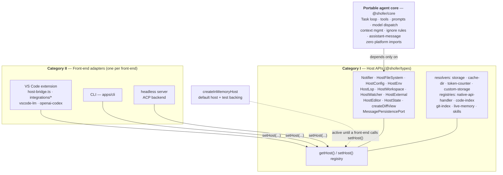
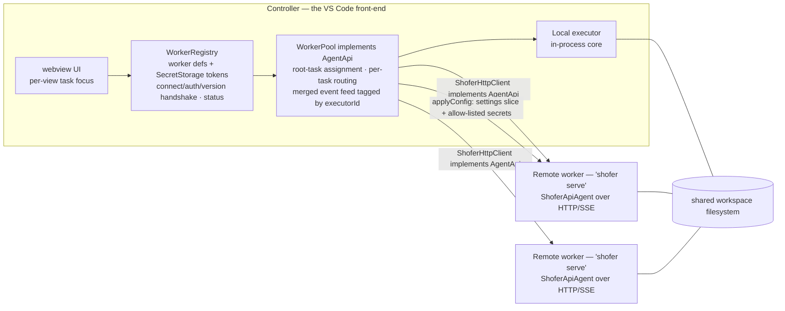
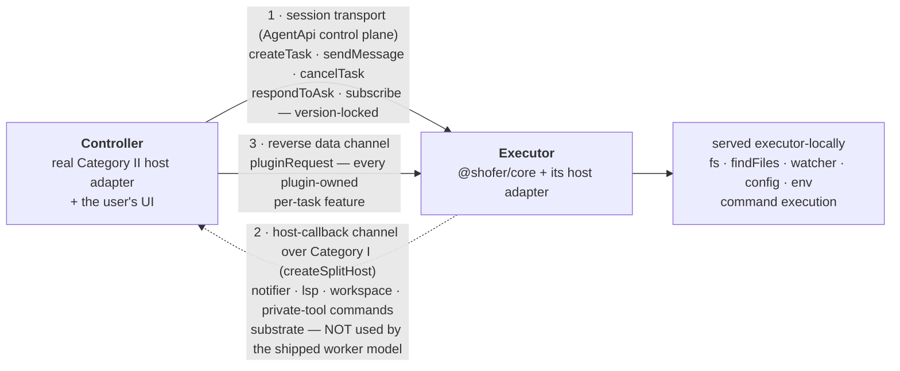

# Shofer v3 Architecture

> **Status:** active. This is the **single canonical** description of Shofer's v3
> architecture — the host-agnostic agent core, the front-end boundary around it, and
> the current implementation status of every initiative (below). It replaces the
> earlier evolution roadmap and the separate progress tracker.

## What this document is

Shofer's v3 architecture separates a **portable agent core** (the "brain" — task
loop, tools, prompts, model dispatch, context management) from the **front-end**
that hosts it (today the VS Code extension; tomorrow a CLI, a headless server, or an
editor-agnostic agent backend). The core is written against narrow, host-agnostic
interfaces and never imports any front-end SDK. Each front-end provides concrete
implementations of those interfaces.

Two governing principles:

1. **Strangler migration, not parallel rewrite.** Every change lands behind an
   interface/adapter and keeps Shofer shippable at each step. We lock a contract,
   migrate call sites onto it, then delete the old path. There is never a second,
   half-finished copy of a subsystem.
2. **The core is host-agnostic.** The core depends only on **Category I** host
   interfaces (below). Anything platform-specific — VS Code, a terminal UI, a diff
   viewer, an IDE's language server — lives in **Category II** front-end adapters
   behind those interfaces.

---

## The host boundary: Category I vs Category II

This is the central seam of the architecture.

### Category I — Host APIs (host-agnostic contracts)

Category I is the small set of capabilities the portable core needs from _whatever_
is hosting it, expressed as plain TypeScript interfaces with no platform types in
their signatures. They live in the **`@shofer/types`** package (vscode-free) and are
aggregated into one `HostBridge` object:

| Capability        | Interface                | What the core uses it for                                                                                    |
| ----------------- | ------------------------ | ------------------------------------------------------------------------------------------------------------ |
| Notifications     | `Notifier`               | info/warn/error messages + choice dialogs (`showChoice`)                                                     |
| Filesystem        | `HostFileSystem`         | read/write/exists/mkdir/delete + `findFiles` (glob)                                                          |
| Configuration     | `HostConfig`             | `get<T>(section, key, default)` settings reads                                                               |
| Environment       | `HostEnv`                | UI `language`, `appRoot` (locate bundled binaries), `machineId` (telemetry), `appInfo`                       |
| Language services | `HostLsp`                | diagnostics, references, workspace symbols, rename (DTO-based)                                               |
| Workspace actions | `HostWorkspace`          | open a folder, execute a command, workspace-folder change event, `visibleFiles`/`openTabs`                   |
| File watching     | `HostWatcher`            | watch a glob; create/change/delete callbacks                                                                 |
| Terminals         | `HostTerminals`          | integrated-terminal backend + shell-execution start/end events                                               |
| Diff view         | `createDiffView(...)`    | per-edit `DiffView` factory (open/update/save/revert)                                                        |
| External links    | `HostExternal`           | `openExternal` (open a URI in the OS/browser)                                                                |
| Editor surface    | `HostEditor`             | `revealInExplorer`/`openFile`/`focusPanel`/`showMultiFileDiff`/`readTerminalContents`/`getWorkspaceProblems` |
| Persisted state   | `HostState`              | `readModeOverrides` (mode/tooling overrides the front-end persists)                                          |
| Message storage   | `MessagePersistencePort` | durable api/UI message persistence (SQLite-backed)                                                           |

Category I interfaces are **DTO-based**: they pass plain data (paths as strings,
positions as `{line, column}` numbers, edits as `{startLine, …, newText}`), never
platform objects. That is what makes them implementable by any front-end and what
keeps the core's type graph free of platform SDKs.

The core reaches Category I through a single registry, also in `@shofer/types`:

```ts
import { getHost } from "@shofer/types"
getHost().notifier.warn("…")
getHost().lsp.getDiagnostics()
```

`getHost()` returns the active `HostBridge`. It defaults to an in-memory
implementation (so the core runs in tests and before a front-end is installed). A
front-end calls `setHost(myAdapter)` exactly once at startup.

Alongside the host capabilities, two further seam families let the core stay
platform-free:

- **Front-end resolvers** the host supplies at startup — storage / cache-dir /
  token-counter / custom-storage resolvers — so core code that needs a durable
  location or a tokenizer does not reach for a `vscode.ExtensionContext`.
- **Core-side registries** (mirroring the `mcp-hub-factory` pattern): the
  **native-api-handler registry** (`packages/core/src/api/native-handler-registry.ts`,
  which the 2 VS Code-only providers register into), and the **manager registries** for
  the code-index, git-index, live-memory, and skills subsystems. The core owns the
  portable half; the front-end registers its concrete VS Code manager against the
  registry. This is how the code-index _engine_ (embedders/vector-store/parser) lives in
  core while the VS Code `CodeIndexManager`/orchestrator/scanner stay in `src` behind the
  registry.

Finally, two **interface abstractions** replace the old value-level coupling of the core
to the concrete VS Code provider: `TaskProviderLike` and `TaskManagerLike`
(`packages/core/src/task-provider/` + `@shofer/types/task-manager.ts`). Every tool that
used to `import { ShoferProvider }` now `import type`s the interface, so `Task` and the
tools name only the contract — never the Category II class.

### Category II — Front-end adapters (platform implementations)

Category II is the concrete implementation of Category I for a specific front-end,
**plus** the platform-only surface that has no portable equivalent (rich editor UI,
diff views, terminals, a platform's own language-model API). Category II is the
_only_ place a platform SDK is imported.

**Category II is reimplementable per front-end.** The same core runs unchanged on
any of:

- **VS Code extension** (the current front-end) — `src/host/host-bridge.ts`
  implements every Category I interface (including `HostEditor`, `HostExternal`, and
  `HostState.readModeOverrides`) against the `vscode` API, and `integrations/*` provides
  the rich UI (decorations, diff view, terminal, theme). Installed via
  `setHost(createVsCodeHost())` at activation. The rest of Category II lives in `src`:
  `ShoferProvider` (implements `TaskProviderLike`), `TaskManager` (implements
  `TaskManagerLike`), `ContextProxy`, the webview handlers, the `vscode-lm` and
  `openai-codex` providers (`src/api/providers/`, registered into the core native-handler
  registry), `McpServerManager`, the concrete VS Code terminal, `integrations/editor`,
  and `activate/*`.
- **CLI** — a terminal front-end would implement `Notifier` as stdout prompts,
  `HostFileSystem.findFiles` via a node glob, `HostLsp` as no-ops or a standalone
  language server, `HostWatcher` via `chokidar`, and apply edits directly to disk
  instead of through a diff viewer. It installs its own adapter with `setHost(...)`.
- **Headless server / agent backend** — implements the subset it needs and no-ops
  the rest (e.g. dialogs auto-resolve, watchers are inert). This is what lets Shofer
  act as an editor-agnostic agent backend (see _HTTP API/SDK_ and _ACP_ below).

The in-memory reference implementation (`createInMemoryHost`, in `@shofer/types`)
documents the minimum a Category II adapter must provide and backs tests.

### The picture



The core points _down_ at Category I; front-ends point _up_, implementing it. The
core never references Category II.

### Where the line is drawn

A file belongs in the portable core only if it can be written with zero platform
imports. Three kinds of code legitimately stay in Category II and are **not**
abstracted away (doing so would just recreate the platform API as an interface):

1. **Front-end UI** — editor decorations, the live diff editor, the VS Code
   _integrated_ terminal, dialogs, theme (`integrations/*`). This is the adapter's job
   by definition. (Note: only the _presentation_ is Category II. Command execution
   itself is portable — the terminal registry + `execa` backend are Category I core;
   the integrated terminal is one optional backend behind `HostTerminals`.)
2. **Platform-bound configuration** — objects handed a platform context
   (e.g. a `vscode.ExtensionContext`) are inherently front-end-scoped.
3. **A platform's own model API** — e.g. the VS Code Language Model provider is the
   VS Code LM API; it is one _provider_ among many, available only on that front-end.

---

## The portable core today

The portable agent core now lives in its own package, **`@shofer/core`**
(`packages/core/src/`). Everything below runs with no runtime platform import, reaching
the host only through Category I (`getHost()` + the registries above):

- **`Task`** — the agent task loop (the core's heart), at
  `packages/core/src/task/Task.ts`.
- **All 56 tool implementations** (`packages/core/src/tools/`) — file ops, search
  (`find_files`, `grep`, `rag_search`, `lsp_search`), language-service tools
  (`get_errors`, `list_code_usages`, `rename_symbol`), `read_project_structure`,
  `generate_image`, `execute_command`, `attempt_completion`, `new_task`,
  `create_new_workspace`, … — plus `build-tools`, `BaseTool`, and the
  schema-as-contract primitive `defineNativeTool`.
- **Assistant-message dispatch** (`presentAssistantMessage`) and the native
  tool-call parser (`packages/core/src/assistant-message/`).
- **The whole model-dispatch subsystem** (`packages/core/src/api/`) — the 35
  host-agnostic providers, `transform/`, `buildApiHandler`, and the native-handler
  registry the 2 VS Code providers plug into.
- **Prompts** (`packages/core/src/prompts/` — `system.ts` + sections + native-tool
  descriptions), plus **`condense`** and **`context-management`**.
- **Language + indexing engines** — `tree-sitter`
  (`packages/core/src/services/tree-sitter/`) and the code-index engine
  (embedders/interfaces/vector-store/parser).
- **`slang`/workflow interpreter**, **`apply-patch`**, **`auto-approval`**, **`glob`**,
  the **`McpHub`**, **`shofer-config`**, **`extract-text`**, the **`diff`** strategies,
  tiktoken/token-counter, `safeWriteJson`, storage, live-memory leaves, and hundreds of
  utils.
- **Context tracking** (`FileContextTracker`, `getEnvironmentDetails`, `mentions`,
  `message-manager`), the **ignore controller**,
  and the model-dispatch core.

The core imports **no** front-end SDK: `Task.ts` has zero `vscode.` references and reaches
the platform only through `getHost()` and the host-agnostic `TypedEmitter`
(`@shofer/types`). The remaining VS Code importers are all genuine Category II adapters in
`src` (see below).

Persistence (Category I `MessagePersistencePort`) is SQLite-backed via Node's
built-in `node:sqlite` — no flat files, no native dependency.

---

## Distributed execution (horizontal scaling)

> **✅ Implemented — Shofer Workers.** Horizontal scaling ships end-to-end. Remote
> executors run as `shofer serve` (HTTP/SSE over `ShoferApiAgent`); the controller drives
> them with `ShoferHttpClient` (which implements `AgentApi`) through the **`WorkerRegistry`**,
> which owns the `WorkerPool`, persists worker definitions (+ tokens in SecretStorage), and
> handles the connect/auth/version handshake, live status, and load-balancing. Tasks run on
> remote workers and render in the webview with interactive approvals, token/context metering,
> and plugin-owned features like the changed-files panel and checkpoints (over the reverse data channel,
> below); focus is per-view so the sidebar and an editor tab can watch two different tasks at
> once. The Shofer Workers UI is wired in (Settings panel, header status, a composer
> worker-picker, and the load-balancer selector). The split-host RPC (`host-rpc.ts`) + session
> transport (`serveSession`/`connectSession`) remain available substrate for the future
> "executor uses the _controller's_ host over RPC" model; the **shipped** worker model instead
> assumes a **shared workspace filesystem** (each remote `shofer serve` has the same mounted
> workspace) and serves fs executor-locally, while worker-scoped **settings and the
> allow-listed credential slice are replicated from the controller** and gate pool
> eligibility on a config version ([`config_sync.md`](./config_sync.md)). With **zero remote workers registered,
> everything runs on the Local executor exactly as today**.

The Category I/II split is also what makes Shofer **horizontally scalable**: the
portable core can run not just in a different front-end, but on a different _machine_
from the user's UI. The vocabulary:

- **Executor** — a running instance of the agent loop for a task: the portable core
  plus a host adapter. The **Local executor** is in-process (today's behavior).
  **Remote executors** run the same core elsewhere (a server/headless adapter).
- **Controller** — the front-end that owns the user session: the UI, the executor
  registry, task→executor routing, and ownership of workspace-shared services (e.g.
  the code index). Always present.
- **Worker** — a registered executor (Local or Remote). With **zero remote workers
  registered, everything runs on the Local executor exactly as today** — the
  distributed machinery is dormant until a worker is added (backward-compatible by
  construction).

The shipped topology — the controller drives every executor through one
`AgentApi`, and every executor sees the same workspace filesystem:



With zero remote workers registered the pool holds only the Local executor, and
behaviour is identical to driving the core directly.

### Two seams — and why Category I pays off here

Distributing execution uses two boundaries that the v3 split already defines:

1. **Session transport (controller ↔ executor).** The high-level agent-session
   protocol — task lifecycle, streamed assistant output, approvals, task-tree state.
   This is the _same_ contract the HTTP API/SDK and ACP backend expose (initiatives
   10–11): a remote executor is simply a **headless front-end reachable over a
   transport** (WebSocket/HTTP/stdio). It is **version-locked** — the message
   contract is only guaranteed within one Shofer version, so a controller may only
   drive an executor on the exact same version.

2. **Host-callback channel (executor → controller), over Category I.** A remote
   executor runs on a machine that has the _workspace_ but not the _user's UI_. Its
   host adapter is therefore a **split adapter**:

    - **Workspace-scoped Category I capabilities** — filesystem, `findFiles`,
      watching, command execution — are served **locally on the executor** (it shares
      the workspace filesystem).
    - **Front-end-bound Category I capabilities** — interactive notifications/
      approvals, editor/tab context, language-service queries (`HostLsp`),
      provider-contributed (private-tool) commands — are **RPC'd back to the
      controller's real adapter**.

    Because Category I is **DTO-based** (plain serializable data — paths, positions,
    edits), it serializes over the wire directly, with no bespoke projection. This is
    the v3-native improvement over a coarse relay that runs the _entire_ platform mock
    remotely and special-cases the editor/LSP/private-tool divergences: in v3 those
    divergences are not special cases — they are exactly the front-end-bound slice of
    Category I, and the boundary is already drawn.

3. **Reverse data channel (controller → executor): one generic method.**
   A plugin-owned per-task feature — the file-changes panel, the checkpoints feature's
   shadow-git history — operates on state that lives on the **owning executor**. For a
   remote (shadow) task the controller therefore does not touch a local `Task`; it calls
   `pluginRequest(taskId, plugin, method, params)`, which round-trips to the executor
   over the same session/HTTP transport as the rest of the control plane and dispatches
   to that plugin's `handleRequest` there. A feature living in a plugin needs no wire
   method of its own; a plugin that rewinds the task reports `{ rewound: true }`, after
   which the controller **rebuilds the shadow** so its buffered conversation matches the
   executor's post-rewind state.

    The controller-side `WorkerRegistry` routes the call through the `WorkerPool` to the
    task's owner, and the routing gates **mutating** requests on "no other active task in
    this worktree" (shared-workspace safety — an executor `git clean -fd`/`reset --hard`
    must not race a local task's writes).

The three channels, and which of them the shipped worker model actually uses:



Channels 1 and 3 are shipped. Channel 2 — an executor borrowing the
_controller's_ host over RPC — remains available substrate (`host-rpc.ts` +
`serveSession`/`connectSession`); the shipped worker model instead assumes a shared
workspace filesystem and serves that whole slice executor-locally.

### Routing and invariants

- **Root-task-level routing.** Each new top-level task — and its entire tree (all
  child and peer tasks) — is assigned to a single executor. So the in-process
  multi-task coordination tools (`new_task`, `check_task_status`, `wait_for_task`,
  `send_message_to_task`) keep working unchanged; coordination never crosses the wire.
- **Single-owner invariant.** A whole root-task tree has exactly one executor owner,
  so per-task state (message queue, plugin state, file-change snapshots, cost
  aggregation) is never shared between machines.
- **Per-task working isolation.** Concurrent root tasks on different executors each
  operate in their own `.worktrees/<name>/` branch, so they don't collide on
  the shared working tree.

### Shared-resource reconciliation

A few subsystems are workspace-scoped singletons and must be reconciled across
executors. The governing principles:

- **Single-writer for shared indexes — enforced.** The code index has one writer,
  the controller: it shares the workspace filesystem and already sees every change
  (including those a remote executor makes), so a second indexer would only duplicate
  embedding work and race it as a writer. Executors are **search-only** against the
  shared store, and that is now structural rather than conventional: the controller
  stamps `codebaseIndexSearchOnly` on the code-index config **as it leaves** on the
  config-sync slice (it never imports its own outgoing slice, so it stays a full
  indexer), and `CodeIndexManager` honours the flag at both its `initialize()` and
  `startIndexing()` entry points. The same slice carries a controller-owned
  `codebaseIndexKey` — the logical index identity the collection name is hashed from —
  so a worker addresses the exact collection the controller indexed instead of hashing
  its own mount path, which would both miss the shared index and collide with
  unrelated hosts that happen to share a container path. The embedder/Qdrant
  credentials ride the synced-secrets slice of the same `applyConfig` call, since
  the config alone would describe a store the worker cannot open. Details:
  [`plugins/rag-indexing/DESIGN.md`](../plugins/rag-indexing/DESIGN.md#multi-node--search-only-workers) and
  [`config_sync.md`](./config_sync.md). (End state: extract the
  index/embeddings/memory into standalone services every worker queries — at which
  point even the controller is just a client.)
- **Serialize shared-repo mutations.** Worktree and shadow-git creation on the shared
  `.git` must be serialized and per-executor-namespaced to avoid ref/object races.
- **Network addressing, not loopback.** A remote executor cannot reach the
  controller's `localhost`; loopback-bound MCP/services must be addressed over the
  network.
- **Front-end-bound capabilities degrade or proxy.** Editor context, LSP, private
  tools, and output-channel reads either RPC back to the controller (the Category I
  callback channel) or return empty / "n/a" on a headless executor.

### Resilience

Two failure cases: the **controller restarts** (reattach to the executor and resync
its retained message stream) and an **executor restarts** (reschedule the task and
recover state). Task IDs are globally unique (uuidv7), so there are no cross-executor
collisions on reattach. (This supersedes, for the multi-_host_ case, the intra-process
worker-thread parallelism described in `multi_threaded.md`, which remains the
single-host story.)

---

## Architectural initiatives (status)

The v3 architecture is delivered as a set of initiatives. Current status (initiative
numbers are local to this document):

| #   | Initiative                                                                                     | Status                                                                                                                                                                                                                                                                                                                                                                                                                                                                                                                                                                                                     |
| --- | ---------------------------------------------------------------------------------------------- | ---------------------------------------------------------------------------------------------------------------------------------------------------------------------------------------------------------------------------------------------------------------------------------------------------------------------------------------------------------------------------------------------------------------------------------------------------------------------------------------------------------------------------------------------------------------------------------------------------------- |
| 1   | Strangler discipline + maturity hygiene                                                        | ✅ governing practice                                                                                                                                                                                                                                                                                                                                                                                                                                                                                                                                                                                      |
| 2   | Schema-as-contract for tools (one Zod schema → OpenAI def + arg type, golden-snapshot guarded) | ✅ all 56 tools migrated                                                                                                                                                                                                                                                                                                                                                                                                                                                                                                                                                                                   |
| 3   | One permission engine (tool access / categories / per-model prefs / auto-approval unified)     | ✅                                                                                                                                                                                                                                                                                                                                                                                                                                                                                                                                                                                                         |
| 4   | Durable, incremental persistence (SQLite, flat files removed)                                  | ✅                                                                                                                                                                                                                                                                                                                                                                                                                                                                                                                                                                                                         |
| 5   | Structured cancellation (process-tree teardown, partial-message reconciliation)                | ✅                                                                                                                                                                                                                                                                                                                                                                                                                                                                                                                                                                                                         |
| 6   | Data-driven model/provider catalog                                                             | ✅ abstraction; live/config data backing deferred                                                                                                                                                                                                                                                                                                                                                                                                                                                                                                                                                          |
| 7   | Standards-based observability (OpenTelemetry) + honest cost/limits; no bespoke metrics server  | ✅                                                                                                                                                                                                                                                                                                                                                                                                                                                                                                                                                                                                         |
| 8   | **Host-agnostic core (Category I/II split)**                                                   | ✅ complete — `Task` + all 56 tools + `presentAssistantMessage` in `@shofer/core`; every seam abstracted and shipped (below)                                                                                                                                                                                                                                                                                                                                                                                                                                                                               |
| 9   | Typed plugin API (tools, prompt transform, events)                                             | ✅ wired (`collectTools`, `transformSystemPrompt`, `dispatchEvent`), plus the seams a plugin needs to own a whole feature — lifecycle hooks, `ctx.task` timeline markers/rewind, `ctx.host.editor`, `handleRequest`/`pluginRequest`. Proven by extracting **checkpoints** out of core into a bundled plugin                                                                                                                                                                                                                                                                                                |
| 10  | HTTP API + SDK + headless parity                                                               | ✅ server + typed SDK + `shofer serve`; headless parity unblocked now the core move has landed                                                                                                                                                                                                                                                                                                                                                                                                                                                                                                             |
| 11  | Editor-agnostic agent protocol (ACP) backend                                                   | ✅ adapter + `shofer acp`; upstream SDK + live-client validation deferred                                                                                                                                                                                                                                                                                                                                                                                                                                                                                                                                  |
| 12  | **Distributed execution (controllers/executors, horizontal scaling)**                          | ✅ **shipped (Shofer Workers)** — remote `shofer serve` executors over HTTP/SSE, `WorkerRegistry`-wired `WorkerPool` (connect/auth/version, status, load-balancing: round-robin + load-average), interactive approvals + full-fidelity render + the plugin-request reverse data channel, per-view shadow focus, controller→worker config sync incl. search-only RAG (workers answer `rag_search` against the controller's index). Split-host RPC/session-transport substrate remains for the controller-host model; serializing shadow-git/worktree creation on the shared repo is the remaining hardening |

### What "done" means, per initiative

- **§2 tools** — every tool is one `defineNativeTool` Zod schema; golden snapshots
  are the drift/equivalence gate. No hand-written tool defs remain.
- **§3 permissions** — one `GROUP_GATE`/`isGroupAutoApproved` + `computeToolAccess`
  SSOT drives both MCP and native paths.
- **§4 persistence** — SQLite (`node:sqlite`) is the sole backend; `jsonlLog` and the
  flat-file/compaction machinery are gone.
- **§5 cancellation** — `terminateProcessTree` (SIGTERM→grace→SIGKILL); `abortStream`
  finalizes every partial message.
- **§6 catalog** — `STATIC_MODEL_CATALOG` + `lookupModel`/`getModelCapabilities` is the
  queryable surface; cost/limits consume `ModelInfo`. _Deferred:_ a live/`models.dev`
  data backing + routing `getProviderDefaultModelId` through it — gated on the
  vendor-snapshot-vs-live-fetch product decision.
- **§7 observability** — `OtelTelemetryClient` registered by default; the metrics
  registry emits via the OTel meter API; `prom-client`/Prometheus server removed.
- **§8 host split** — **complete.** The Category I seams + registry live in
  `@shofer/types` (`host.ts`, `host-registry.ts`); the whole portable core — `Task`,
  all 56 tools, `presentAssistantMessage`, the `api/` subsystem, prompts/condense/
  context-management, tree-sitter, the code-index engine, slang/workflow, McpHub,
  shofer-config, and the rest — lives in `@shofer/core` (`packages/core/src/`). `Task.ts`
  has **zero** `vscode.` references and reaches the platform only through `getHost()` or
  the host-agnostic **`TypedEmitter`** (`@shofer/types`, a `vscode.EventEmitter` drop-in
  for internally-consumed events; TreeDataProvider-style events fed back to VS Code stay
  in the Cat II adapter). Every seam is shipped: the host capabilities (incl.
  `HostEditor`, `HostExternal`, `HostState.readModeOverrides`, `HostWorkspace.visibleFiles`/
  `openTabs`), the storage/cache-dir/token-counter/custom-storage resolvers, the core-side
  registries (native-api-handler + code-index/git-index/live-memory/skills managers), the
  three Cat II subsystem abstractions (McpHub / DiffView / terminal), and the
  `TaskProviderLike`/`TaskManagerLike` interfaces that replace the concrete
  `ShoferProvider`/`TaskManager` value coupling. The transitive blockers are cleared
  (telemetry ✅ via `HostEnv.machineId`, i18n ✅ relocated into `@shofer/core/i18n` with
  static locale imports). The only remaining `vscode` importers are genuine Category II
  (host-bridge, webview handlers, the `vscode-lm`/`openai-codex` providers, save dialogs,
  editor reveal).
- **§9 plugins** — `pluginRegistry` hooks are load-bearing: `collectTools` feeds the
  tool assembly, `transformSystemPrompt` threads the system prompt, and
  `dispatchEvent` receives every captured event (via `TelemetryService.onEvent`).
- **§10 HTTP/SDK** — `createHttpServer` + a typed `ShoferHttpClient` that _implements
  `AgentApi`_ (so client/server can't drift) + a `shofer serve` entrypoint. The
  transport-agnostic surface, its full method set, and the HTTP/SSE routes are specified
  in **[`agentapi.md`](./agentapi.md)** (the source of truth for the control plane).
- **§11 ACP** — the full agent-side ACP (`AcpAgentServer` over `AgentApi` + mapping) and a
  `shofer acp` entrypoint. The method map, event/permission mapping, and how ACP differs
  from `AgentApi` are in **[`acp.md`](./acp.md)**; deferred items are tracked there.
- **§12 distributed** — see below; the Category-I-over-RPC split adapter, the session
  transport, and the controller-side `WorkerPool` (root-task routing + merged view)
  are built.

---

## Delivery status & remaining work

### The `@shofer/core` carve-out — ✅ complete

`@shofer/core` (`packages/core/src/`) holds the portable agent core, and the carve-out is
**done**. The transport layer (`transport/`: the HTTP/SSE server, `ShoferApiAgent`, the
full ACP stack) and the tool schema-as-contract primitive (`defineNativeTool`) moved out
early; **`Task` itself**, all 56 tool implementations, the prompts, and the
assistant-message dispatch loop (`presentAssistantMessage`) have since followed. The whole
vscode-free closure now lives in the package.

This was **not** a de-coupling problem — the agent core was already vscode-free **at the
call level** (`Task.ts` has zero `vscode.` references; it reaches the platform only
through `getHost()` and `TypedEmitter`). It was a **structural** one — a file in a
package cannot import from `src/`, so every module `Task` transitively imports had to
first live in `@shofer/core` (or `@shofer/types`). That relocation is complete.

**Seams — ✅ done.** The three VS Code-coupled subsystems `Task` depended on are
abstracted, their implementations staying Category II in `src`:

- `services/mcp/McpHub` routes through `getHost()` (config/watcher/fs + an
  `onDidChangeWorkspaceFolders` capability).
- `DiffViewProvider` sits behind the vscode-free `DiffView` interface, built via a
  `getHost().createDiffView(cwd, task)` factory. A live diff editor is intrinsically a
  front-end presentation, so `DiffView` stays a Category I _interface_ over a wholly
  Category II implementation.
- The terminal subsystem splits along the `ShoferTerminalProvider = "vscode" | "execa"`
  line: command **execution is Category I** (the registry + `execa` backend now live in
  `@shofer/core/terminal`), while the VS Code integrated terminal is one optional
  Category II backend, injected via a `HostTerminals.createTerminal` host factory so the
  core registry statically imports no vscode classes.

**Portable relocation — ✅ done.** Moved into `@shofer/core`: `utils/logging`,
`utils/path` (with its `String.prototype.toPosix` global), `services/blob-store`,
`ShoferIgnoreController`, `services/ripgrep`, `services/search`,
and the terminal core — plus a portable `fileExistsAtPath` helper, which let the tail
avoid moving the 62-consumer `utils/fs` (not on `Task`'s path; it stays in `src`).

**Provider circularity — ✅ done.** `Task` held `WeakRef<ShoferProvider>`, a hard
reference to the concrete Category II webview provider. Broken via a **generic
`TaskProviderLike<TTask>`** interface in `@shofer/core`: `ShoferProvider implements` it,
`Task.providerRef` is typed `WeakRef<TaskProviderLike<Task>>`, and because the interface
lives in the same package as `Task` it can name `Task` without re-introducing a cycle.

**Closure relocation — ✅ done.** `Task.ts`'s imports fan out across `api/`, `tools/`,
`prompts/`, `assistant-message/`, `context/`, `mentions/`, `shared/`, … and those
interdepend, so the whole vscode-free closure moved together, **leaves-first**, as
merge-and-verify rounds (each relocated a chunk, committed green). Every module has now
landed in `@shofer/core`, including `api/index` + the 35 host-agnostic providers,
`api/transform/*`, `context-tracking/FileContextTracker`, `getEnvironmentDetails`,
`mentions`, `message-manager`, `build-tools`, and
`presentAssistantMessage`. The systemic transitive-vscode blockers surfaced along the way
are all cleared:

- ✅ `@shofer/telemetry` — `PostHogTelemetryClient` used `vscode.env.machineId` + a
  telemetry-level config read; both now route through `getHost()` (a new
  `HostEnv.machineId` capability).
- ✅ `i18n` (`t`, imported by ~21 closure modules) — used to load locale JSON via
  `fs`/`__dirname` at module load; now lives at `packages/core/src/i18n` with static JSON
  locale imports.
- ✅ The Category II edges the closure reached are abstracted behind seams and stay in
  `src`: the VS Code LM + `openai-codex` providers (registered into the core
  native-handler registry), export-markdown save-dialog I/O (via `HostEditor`), and the
  webview handlers (behind `TaskProviderLike`).

`Task.ts` now lives at `packages/core/src/task/Task.ts`, which is what lets initiatives
10–12 run the core fully headless: a non-VS-Code front-end links `@shofer/core` and
supplies its own Category II adapter.

### Front-end adapters beyond VS Code

A **CLI** front-end is the first target: it links the core, implements the Category I
interfaces for a terminal (glob-based `findFiles`, `chokidar` watching, stdout
notifications, direct-to-disk edits, no-op or standalone language services), and
gets the full agent loop without any VS Code dependency.

### Distributed execution (initiative 12)

The horizontal model builds directly on the two tracks above and shares their
prerequisites:

- A **remote executor** is the headless front-end from initiatives 10–11 (linking
  `@shofer/core` + a server adapter) made reachable over the session transport. With the
  carve-out complete, `@shofer/core` is directly runnable this way: it exports
  `serveHttpOverShoferApi` and `runAcpAgentOverShoferApi` (`packages/core/src/transport/`)
  as the headless/ACP entry points.
- Its **split host adapter** is built: `@shofer/types` exposes
  `createSplitHost({ local, channel })` (executor side — notifier/lsp/workspace proxied
  over an `HostRpcChannel`; fs/config/env/watcher local) and `dispatchHostCall` +
  `serveSession`/`connectSession` (the **session transport** that carries both the
  agent channel and the host-callback channel). Category I is DTO-based, so it
  serializes for free.
- **Controller-side routing is built**: `WorkerPool` implements `AgentApi` over one
  or more executors — pluggable root-task assignment, per-task routing, and a merged
  event feed tagged by `executorId` (the unified view). Single-executor behaviour is
  identical to driving one directly.
    - **Load-balancing policy** (`LoadBalancerPolicy`, `setPolicy`/`getPolicy`): the
      default `round-robin` rotates evenly; the `least-load-1m`/`5m`/`15m` policies pick the
      assignable executor with the lowest **normalized** load average
      (`loadavg[window] / max(cpus, 1)`) for the chosen window, so a bigger-core worker can
      absorb more work. The load metric is an **injected accessor**
      (`PooledExecutor.load?: () => LoadSample`) — `@shofer/types` stays browser-safe and
      never imports `node:os`. The Node-side `WorkerRegistry` supplies it: the Local executor
      reads this host's live `os.loadavg()`/`os.cpus().length`; each remote reads the sample
      from its `WorkerConnection` (carried on the periodic `GET /health` ping, which now
      returns `loadavg` + `cpus`). Fallbacks keep it robust: executors with no sample are
      excluded from the comparison, an all-no-sample pool degrades to round-robin, and ties
      (including the all-zeros Windows `os.loadavg()` case) spread across the tied set via
      the round-robin cursor. The policy is selected by the `workersLoadBalancer`
      globalSettings key (read on init + re-applied when the setting changes).
- **Shipped**: the remote executor process (`shofer serve`, HTTP/SSE over
  `ShoferApiAgent`), the `WorkerRegistry` that wires the `WorkerPool` into the extension
  (worker registry + SecretStorage tokens, connect/auth/version handshake, live status,
  load-balancing), the full Shofer Workers UI (Settings panel, header status, composer
  worker-picker, load-balancer selector), interactive approvals (`respondToAsk`),
  full-fidelity remote render, per-view shadow focus, and the reverse data channel
  (plugin requests).

**Remaining hardening**: serializing shadow-git/worktree creation on the shared repo
(single-writer for the code index is enforced — see _Shared-resource reconciliation_
above), the split-host
session-transport model (an executor using the _controller's_ host over RPC, vs today's
shared-workspace executor-local host), and reconnect resilience / stream resync.

### Deliberately deferred (gated, not oversights)

- **§6 catalog data backing** — routing `getProviderDefaultModelId` and the API
  handlers through a live/`models.dev` catalog with config overrides is gated on a
  product decision (vendor snapshot vs live fetch vs both) and the accompanying network
  policy. The catalog _abstraction_ is done; the data backing waits on that decision.
- **§11 ACP** — swapping the direct JSON-RPC framing for the upstream SDK
  (`@zed-industries/agent-client-protocol`) is blocked (not in the current registry);
  `session/request_permission` needs an approval surface on `AgentApi`/`ShoferAPI`; and
  end-to-end validation needs a live ACP client (Zed). The adapter is complete and
  swap-ready.
- **Justified boundaries** — single-sourcing the `NativeToolArgs`/`toolParamNames`
  parser mirrors (§2) and a fully-abstract allow/ask/deny `Rule[]` model (§3) are
  intentionally _not_ done: the drift guard and the unified SSOT modules already remove
  the risk they'd address, so the extra indirection has no behavioural payoff.

---

## What we deliberately keep (Shofer strengths)

The v3 split preserves the things that make Shofer strong and that a generic
agent-backend design tends to lose:

- **Rich, typed tool catalog** with golden-snapshot contracts.
- **Spend caps and honest cost/limit accounting** driven by the model catalog.
- **Per-model tool customization** and a unified permission engine.
- **First-class editor integration** (the Category II VS Code adapter) — abstracting
  the core does not flatten the IDE experience; it just makes the IDE one front-end
  among several.
