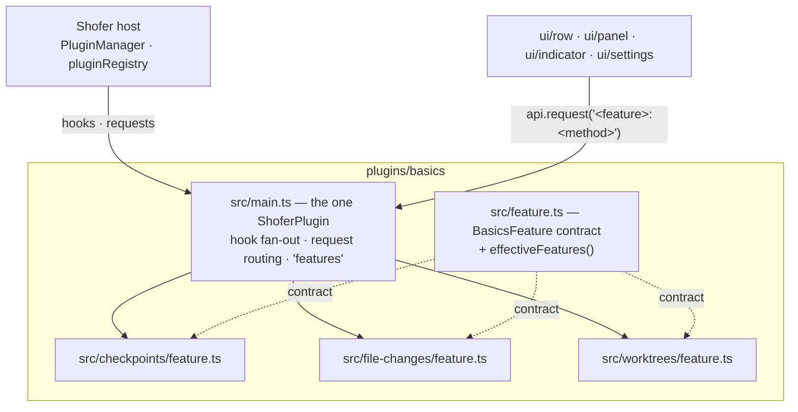

# Basics — Design

One plugin, three features: **checkpoints**, **file-changes** and **worktrees**. This
document covers the composition — why they share a plugin, how the features are wired
into one `ShoferPlugin`, and how one feature is switched off without the others. Each
feature's own design (what it does and why, unchanged by the merge) lives under
[`docs/`](docs/):

- [`docs/checkpoints.md`](docs/checkpoints.md) — the shadow-git undo history
- [`docs/file-changes.md`](docs/file-changes.md) — per-task edit tracking
- [`docs/worktrees.md`](docs/worktrees.md) — per-task worktrees and placement

## 1. Why one plugin

The three features are Shofer's _workspace basics_: they ship bundled, default-enabled,
and they are what a deployment reasons about as a unit ("give the pod a bare agent" /
"give it the full workspace UX"). They also overlap in fabric — checkpoints and
worktrees both key off `task.cwd`; checkpoints and file-changes both keep per-task
state in plugin storage and clean it up on `onTaskDeleted`; all three render into the
chat surface. Three separate plugins meant three manifests, three build scripts, three
storage roots and three entries in every enable-list for what is conceptually one
switch.

What the merge must NOT lose is per-feature granularity — a deployment that replaces
one feature (arkware's worktreed-backed worktrees + checkpoints, say) keeps the rest.
That granularity moves from plugin-level enablement to feature-level switches (§3).

## 2. Composition

Each feature is a `BasicsFeature` (`src/feature.ts`): a `ShoferPlugin` minus the
identity fields, plus a stable `id` and the list of core broadcast questions it
answers. `src/main.ts` is pure composition:

- **Lifecycle hooks** fan out to each enabled feature in fixed order — checkpoints
  first, so its pre-mutation snapshot exists before anything else reacts to the same
  event. `beforeToolCall` threads `modifiedArgs` and short-circuits on the first
  block, the same reducer semantics core applies across plugins.
- **`initialize`** runs for every feature, enabled or not: it re-runs on a config
  edit, and a feature just turned off must drop its process-lived state too.
- **`registerTools`** concatenates the enabled features' tools (today only
  file-changes' `get_changed_files`).
- **Storage** is one plugin dir shared by scoping: checkpoints under
  `<storage>/checkpoints/`, file-changes under `<storage>/file-changes/` — both keep
  per-task state under a `tasks/` subtree and would collide unscoped.

## 3. Feature switches

A feature is off when either

- its boolean in the plugin config is `false` (`checkpoints` / `file-changes` /
  `worktrees` in the Plugins panel), or
- `SHOFER_DISABLED_PLUGINS` names it as `basics:<featureId>`.

The env form is the deployment channel: governance env vars are how a pod is told what
to run (core's `governance.ts`), and a deployment that replaces one feature with its
own implementation must suppress exactly that feature while keeping the rest. Core's
`PluginManager` ignores `basics:<feature>` entries — they match no plugin name — and
this plugin reads the same variable and applies them at feature granularity. One
variable, two granularities, no second delivery channel.

A disabled feature contributes nothing: its hooks are skipped, its tools are not
registered, its requests throw, and its UI bundles render `null` (they ask
`local:features` on mount). Two things stay manifest-level and therefore cannot be
feature-gated: the worktree **slash commands** (a disabled worktrees feature leaves
`/merge-worktree` registered — it is a plain prompt operating on git, so it still
works; see TODO.md) and the four **UI regions** (mounted, but empty when off).

## 4. Request routing

The features' own method names collide (`list`, `diff`, `show-diff`), so the merged
request surface is namespaced. In order of processing:

| Form                                    | Meaning                                                                                                                                                                             |
| --------------------------------------- | ----------------------------------------------------------------------------------------------------------------------------------------------------------------------------------- |
| `local:` prefix                         | Core's ROUTING prefix — answer on the UI's host rather than the task's executor. Delivered verbatim by core; stripped here before dispatch.                                         |
| `features`                              | Answered by `main.ts`: the effective on/off map, `{ checkpoints, "file-changes", worktrees }`.                                                                                      |
| `<featureId>:<method>`                  | Dispatched to that feature's `handleRequest` with the **bare** method (`checkpoints:diff` → checkpoints' `diff`). Disabled feature ⇒ throw.                                         |
| bare (`task-stats`, `resolve-task-cwd`) | A core broadcast (`pluginRegistry.requestAll`) — core-defined names, routed to the feature that declared them. Anything else throws, which is how `requestAll` treats us as silent. |

The UI bundles therefore send `checkpoints:diff`, `file-changes:get`,
`local:worktrees:list`, `local:checkpoints:show-diff`, … — feature methods stay bare
inside each feature module, so a new method cannot collide across features by
construction.

## 5. What did not change

Everything below the composition layer is the pre-merge design, feature for feature:
the shadow-git model and its failure policy, the two-copies-per-file store and its
candidate/list semantics, the embedded worktree model, placement via the
`resolve-task-cwd` broadcast, and the core-side safety split (path confinement and the
`execute_command` sandbox stay in core). See the three documents under
[`docs/`](docs/).

## 6. Related

- [`README.md`](README.md) — usage, settings, packaging.
- [`TODO.md`](TODO.md) — known gaps, including what the merge itself cost.
- [`../../docs/plugin_system.md`](../../docs/plugin_system.md) — the seams all of this
  rides on.
