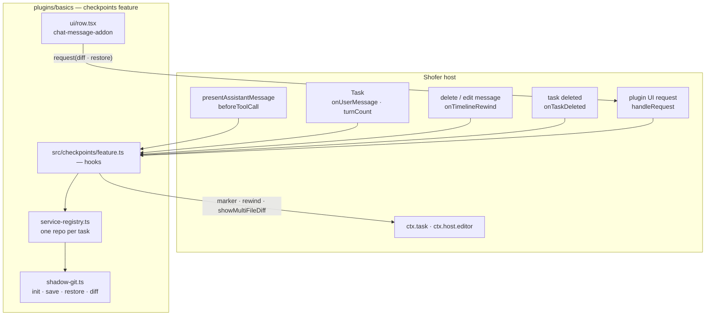
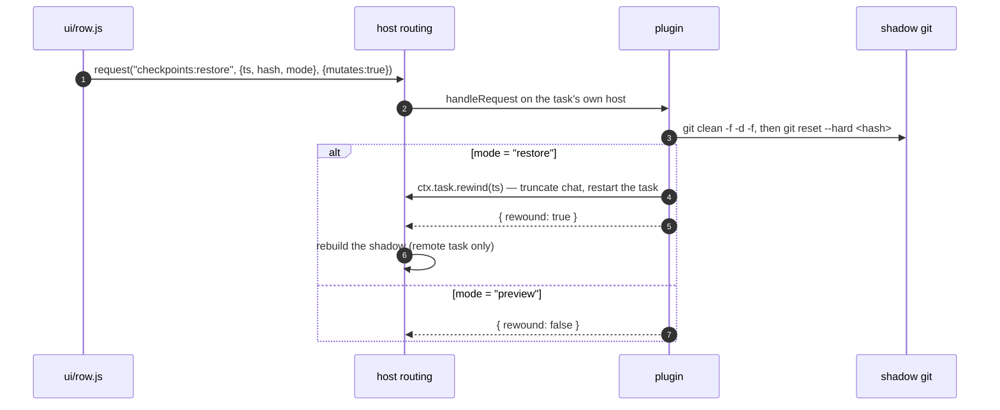

# Checkpoints — Design

## Purpose

Give the user a **per-task undo history** that is independent of the workspace's own
git repository. Each checkpoint is a commit in a _shadow_ repository whose working tree
is the workspace, capturing every file Shofer could have touched — including files the
workspace's `.gitignore` excludes, and including workspaces with no git repository at
all.

Checkpoints are **not part of Shofer core**. They are a feature of the bundled
**Basics** plugin ([`../DESIGN.md`](../DESIGN.md)), shipped with the extension and
enabled by default. They are also orthogonal to Basics' **file-changes** feature, which
tracks the individual files Shofer edited using verbatim copies and no git.

## Why a plugin

Shadow-git, commits and restore are knowledge nothing but this feature needs. Keeping
them out of core makes the feature one directory: disabling it (the `checkpoints`
switch in the Basics config, or the whole plugin) removes checkpoints entirely, leaving
nothing behind. Core carries only the _generic_ seams the feature rides on, each of
which is useful to any plugin that owns a feature.

## What core provides instead — the seams this plugin uses

Core knows nothing about shadow git, commits, or restore. It provides the generic plugin
seams the feature is built from, all documented in
[`plugin_system.md`](../../../docs/plugin_system.md):

| Seam                                                    | What checkpoints uses it for                                           |
| ------------------------------------------------------- | ---------------------------------------------------------------------- |
| `lifecycle.beforeToolCall` (+ manifest `hookTimeoutMs`) | Snapshot before a file-mutating tool, awaited so it precedes the write |
| `lifecycle.onUserMessage`                               | An anchor per user message                                             |
| `ctx.task.marker` / `listMarkers`                       | The timeline row that IS a checkpoint, and its ordering                |
| `ctx.task.rewind`                                       | The conversation half of a restore                                     |
| `lifecycle.onTimelineRewind`                            | Roll the workspace back when a message delete/edit asks for it         |
| `lifecycle.onTaskDeleted`                               | Drop the task's shadow repository                                      |
| `ShoferPlugin.handleRequest` + `PluginUIApi.request`    | Diff/restore driven from the row's UI, including for a remote executor |
| `ctx.host.editor.showMultiFileDiff`                     | Render a computed diff                                                 |

Every one of those is feature-agnostic: another plugin could implement a different undo
model on the same seams.

## Architecture



### Shadow git

```
<globalStorage>/plugins/basics/checkpoints/tasks/<taskId>/
  .git/
    config        ← core.worktree = <workspaceDir>, commit.gpgSign=false, user.*
    info/exclude  ← build artifacts, media, caches, databases, LFS patterns
    objects/ refs/
```

`core.worktree` points at the real workspace, so `git add .` inside the shadow
directory stages workspace files. The shadow repo is keyed by **task id**, so two
concurrent tasks in one workspace keep independent histories.

**`GIT_DIR` without `GIT_WORK_TREE`** is the load-bearing detail. Setting `GIT_DIR` to
the shadow repo's `.git` tells git it is the only repository, so a nested repository in
the workspace (a submodule, a child clone, a git worktree) is staged as ordinary files
rather than an empty gitlink (mode `160000`) whose contents no checkpoint would hold.
Leaving `GIT_WORK_TREE` unset lets `core.worktree` supply the working tree. The
inherited git environment is stripped first — both the repo-location variables
(so a Dev Container or a parent `git` process cannot redirect checkpoint
operations at the wrong repository) and the behavior-hijacking class
(`GIT_EDITOR`, pagers, askpass, ssh/proxy commands, config injection), which a
non-interactive snapshot never needs and which simple-git's unsafe guard
refuses outright: with `GIT_EDITOR` inherited (VS Code terminals and CI set it)
an unstripped env made `git.env()` throw `allowUnsafeEditor` and silently
disabled checkpoints for every task. The one unsafe knob enabled on purpose is
`allowUnsafeTemplateDir`, covering exactly our own `init --template=""` — an
empty value is the defense _against_ template-hook injection, not a use of a
template dir.

### When a checkpoint is taken

| Trigger                     | Hook                        | Notes                                                                                                                                                                                                              |
| --------------------------- | --------------------------- | ------------------------------------------------------------------------------------------------------------------------------------------------------------------------------------------------------------------ |
| Before a file-mutating tool | `lifecycle.beforeToolCall`  | **Awaited** — after the tool writes, the pre-mutation state is gone. Once per `ctx.turn`, so a turn issuing ten edits produces one checkpoint. `allowEmpty` so a turn that changes nothing still yields an anchor. |
| User sends a message        | `lifecycle.onUserMessage`   | Suppressed from the timeline (the row would be noise) but persisted, so delete/edit-with-restore has a point to restore to.                                                                                        |
| Task start                  | `lifecycle.beforeTaskStart` | Warms the repo so the first edit isn't the call that waits for `git init`.                                                                                                                                         |

The `beforeToolCall` hook runs inside the agent loop, so the manifest raises the
plugin's hook budget (the Basics manifest sets `hookTimeoutMs: 60000`, sized for the worktrees feature's create-and-seed) above the 500 ms default. Exceeding even
that skips the hook with a warning: the turn then has no snapshot, which is a lost undo
point but never a stalled agent.

### Restore



The delete/edit-message flows arrive the other way round: the host is already rewinding
the conversation and calls `onTimelineRewind` **first**, so the plugin restores while
its anchor still exists. `restoreState: false` (a chat-only delete) means the workspace
must not be touched.

### Diff

Four comparisons, resolved against the plugin's own markers (`ctx.task.listMarkers`),
which are the ordered checkpoint list:

| Mode         | from             | to                                              |
| ------------ | ---------------- | ----------------------------------------------- |
| `checkpoint` | this checkpoint  | the next one (working tree if it is the newest) |
| `from-init`  | first checkpoint | this checkpoint                                 |
| `to-current` | this checkpoint  | working tree                                    |
| `full`       | first checkpoint | working tree                                    |

`getDiff` stages everything first so untracked files appear. Computing the diff happens
where the repo is; **rendering** happens on the host with the editor, requested
separately as `local:checkpoints:show-diff` — an executor has no viewer to open.

### Remote (executor-hosted) tasks

A remote task's shadow repo lives on the executor that runs it. The UI's `diff` and
`restore` requests are routed there over `ShoferApi.pluginRequest`; `local:checkpoints:show-diff`
stays on the controller. A mutating request is refused while a local task is running,
because both hosts share the workspace and a `git reset --hard` would collide.

## Failure policy

Checkpoints are best-effort, and every failure is **loud but non-fatal**: no git, no
workspace, a relocated workspace, an init that exceeds the timeout, or a failing commit
disables checkpoints _for that task_ with a warning, and the agent keeps working. The
alternative — retrying silently — produces a history with holes in it, which is worse
than no history because the user trusts it.

## Deliberate limits

- **Submodule pointers.** Restoring returns file contents, not the commit a submodule
  was pointing at; `git reset --hard` in the shadow repo does not move it.
- **One repo per task, keyed by id.** Two tasks in one workspace do not share history,
  and restoring one does not consult the other.
- **Excluded files are not captured**, so restoring does not bring back a `node_modules`
  or a `.env` the exclude list drops.

## Related

- [`README.md`](../README.md) — usage, settings, packaging.
- [`TODO.md`](../TODO.md) — known gaps.
- [`file-changes.md`](file-changes.md) — the File Changes
  Panel, a separate per-file diff/revert system with no git dependency.
- [`worktrees.md`](worktrees.md) — how a per-task worktree
  scopes its snapshots.
- [`submodule-support.md`](../../../docs/submodule-support.md) — the nested-repository
  investigation behind this plugin's `GIT_DIR` isolation.
