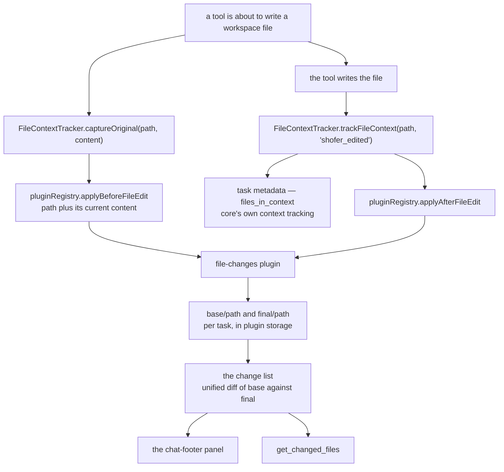
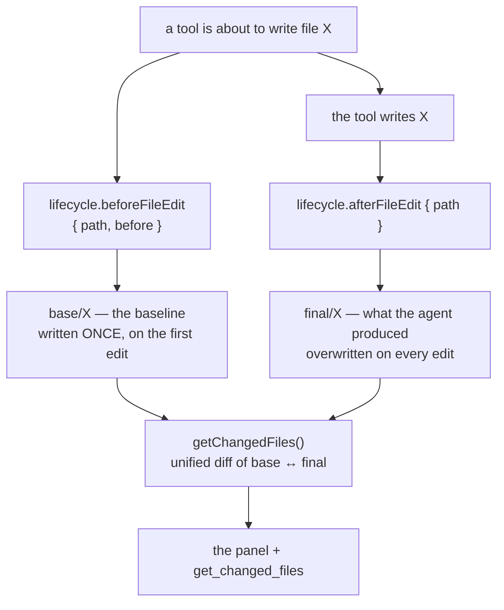

# File Changes — design

> A feature of the bundled **Basics** plugin — see [`../DESIGN.md`](../DESIGN.md)
> for the composition, feature switches and request namespacing.

## The question this answers

_What did this task do to my workspace, and can I undo it?_

Answering it needs two pieces of state that exist for only an instant: the file **before**
the agent wrote it, and the file **as the agent left it**. Everything else — counts,
diffs, revert, accept — is derived from that pair.

This document covers both halves of the feature: the seams core publishes, and what the
plugin builds on them. For what the plugin deliberately does not do, see
[TODO.md](../TODO.md).

---

## What core provides — the seams this plugin uses



The split is: **core says what happened**, the plugin decides what is worth keeping. Core
publishes two facts — "this path is about to change, here is its content" and "this path
changed" — and holds no copies, no diffs and no panel state.

### The two capture points

A tool that mutates workspace files makes two calls:

```ts
await task.fileContextTracker?.captureOriginal(relPath, contentBeforeTheWrite)
// … mutate the file …
await task.fileContextTracker.trackFileContext(relPath, "shofer_edited")
```

`captureOriginal` stores nothing in core: it publishes the pre-edit content to
`lifecycle.beforeFileEdit`. Both calls are required — a tool that only tracks appears in
the list with diffing disabled, and one that only captures does not appear at all.

| Core                                                | Plugin                                 |
| --------------------------------------------------- | -------------------------------------- |
| `FileContextTracker.captureOriginal(path, content)` | `beforeFileEdit` → write `base/<path>` |
| `trackFileContext(path, "shofer_edited")`           | `afterFileEdit` → write `final/<path>` |

`beforeFileEdit` is **awaited** (a baseline taken after the write is worthless);
`afterFileEdit` is fire-and-forget (the content is on disk either way). Neither can fail a
tool: the registry isolates errors and applies the plugin's hook budget.

### Which tools call them

| Tool                                                                                | How                                                                                                          |
| ----------------------------------------------------------------------------------- | ------------------------------------------------------------------------------------------------------------ |
| `apply_diff`, `write_to_file`, `edit`, `edit_file`, `apply_patch`, `search_replace` | via [`DiffViewProvider`](../../../src/integrations/editor/DiffViewProvider.ts) (`open()` / `saveDirectly()`) |
| [`file`](../../../packages/core/src/tools/FileTool.ts) (`rm`/`mv`)                  | manual, for the source and (for `mv`) the destination                                                        |
| [`insert_edit`](../../../packages/core/src/tools/InsertEditTool.ts)                 | manual, around the `WorkspaceEdit`                                                                           |
| [`sed`](../../../packages/core/src/tools/SedTool.ts)                                | manual, around the regex replacement                                                                         |
| [`rename_symbol`](../../../packages/core/src/tools/RenameSymbolTool.ts)             | manual, for each LSP-affected file                                                                           |
| [`generate_image`](../../../packages/core/src/tools/GenerateImageTool.ts)           | tracks only — the store is UTF-8 oriented, so a PNG has no usable baseline                                   |

`create_directory` and `create_new_workspace` create no file content; `execute_command`
runs arbitrary commands and is untrackable.

### Why the hooks, and not `beforeToolCall`

The plugin could in principle watch `beforeToolCall` and read the paths out of the tool's
arguments. It must not, because only the tool knows what it is about to touch: a path can
be embedded in a patch body, resolved by the language server (a symbol rename hitting a
dozen files), or be the destination of a move. Reimplementing each tool's semantics in the
plugin would be wrong the day a tool changes — and wrong _silently_, as a file quietly
missing from the list. So core publishes the fact instead, at the point where it already
tracks file context.

### What core keeps: `FileContextTracker`

[`FileContextTracker`](../../../packages/core/src/context-tracking/FileContextTracker.ts) is
context tracking for the **agent**, and that is all it is:

- the per-task `files_in_context` metadata (what the agent read, edited, or was told
  about, and when),
- the watchers that notice a file changing outside Shofer, feeding the
  "Recently Modified Files" section of the environment details,
- `getFilesReadByRoo()` / `getFilesEditedByRoo()` for prompt-time context,
- and the two dispatch points above.

It resolves every path against the **task's** cwd — the worktree subdirectory for an
embedded-worktree task, not the workspace folder — and passes that cwd in the hook
context, because a plugin resolving against the wrong tree is exactly how a change list
silently under-reports.

### The UI region and the routing

The panel is a `chat-footer` UI contribution, mounted by `ChatView` through
[`PluginSlot`](../../../webview-ui/src/components/plugins/PluginSlot.tsx). It talks to the
plugin over the scoped plugin-UI channel; there is no `changedFiles/*` webview message
type and no `ChangedFileEntry` in `@shofer/types` — the shape is the plugin's own.

Core also supplies the flag the mutating requests gate on: `ctx.taskStreaming`, which the
host sets when it builds a request context, because a plugin cannot see the agent loop.

### Task completion stats

The `+`/`−` badge on a task's history entry comes from
[`AttemptCompletionTool`](../../../packages/core/src/tools/AttemptCompletionTool.ts), which
broadcasts a `"task-stats"` request to **every** plugin (`pluginRegistry.requestAll`) and
sums the `{ insertions, deletions }` it gets back. Core does not know which plugin
answers, or whether any does: no answer simply means no badge, which is the correct
rendering of "nothing is tracking this".

---

## Two copies per file, owned by the task



The pair is deliberately **not** "the file then vs the file now":

- **The baseline is captured once.** A later edit in the same task must not move it, or
  reverting would restore something the agent itself wrote.
- **The right-hand side is the agent's copy, not the live file.** Two tasks editing one
  file in one worktree would otherwise report each other's work — and a formatter running
  on save would show up as the agent's change.
- **The live file is read for exactly two things**: capturing `final` after an edit, and
  deciding that a file whose content is back at the baseline is no longer a change (which
  is how "the user reverted it by hand" leaves the panel).

## The candidate set

"Which files did this task touch?" is answered by the plugin's own storage — every path
with a snapshot in `originals/` or `finals/`, newest first (the real path is stored inside
each snapshot; the file name is a hash of it). Deriving it from the store rather than from
core's task metadata means the list and the data behind it cannot disagree, and it keeps
core free of any notion of "tracked file".

A path with only a `final` — a tool that produced content without a readable baseline, like
a generated image — still appears, with diffing disabled.

## Reading the list

`getChangedFiles` walks the candidates and, per file:

1. Reads the baseline and the produced state. No produced state yet (the hook is
   fire-and-forget) ⇒ falls back to the live file for that one entry.
2. Drops it when the net effect is nothing: absent → absent, or `base === final`.
3. Drops it when the live file currently equals the baseline (you reverted it).
4. Counts insertions/deletions from a real unified diff of `base` ↔ `final`.
5. Derives `added` / `deleted` / `modified` from which sides exist — never from the live
   file.

Entries that end at `+0/−0` are filtered out: no diff worth showing.

## Requests

The panel talks to the plugin through `PluginUIApi.request`, which the host routes to the
plugin instance **on the task's own host** — so a task running on a remote executor behaves
exactly like a local one, with no branch in the UI.

| Method                                 | Mutates | What it does                                                                                                   |
| -------------------------------------- | ------- | -------------------------------------------------------------------------------------------------------------- |
| `file-changes:get`                     | no      | The change list for the focused task                                                                           |
| `file-changes:diff`                    | no      | The before/after pair for one file                                                                             |
| `local:file-changes:show-diff`         | no      | Opens that pair in **this** host's editor (an executor has none)                                               |
| `file-changes:revert`                  | yes     | One file back to its baseline (asks first if you edited it since)                                              |
| `file-changes:revert-all`              | yes     | Every file, behind one confirmation                                                                            |
| `file-changes:accept`                  | yes     | Promote this file's current disk state to the new baseline                                                     |
| `file-changes:accept-all`              | yes     | The same for every file                                                                                        |
| `task-stats` (bare — a core broadcast) | no      | `{ insertions, deletions }` — the question core asks every plugin when a task completes, for the history badge |

`accept` reads the **disk**, not the produced copy: after the agent's write the file may
have been reformatted on save or edited by you, and promoting a stale copy leaves a hash
mismatch that brings the entry straight back on the next refresh.

Two guards live on this side of the seam:

- **Revert asks first** when the file changed after the agent's last write, via
  `ctx.host.notifier.showChoice` (a modal).
- **A mutating request throws while the task is streaming**, on the `ctx.taskStreaming`
  flag the host puts on the request context.

## Keeping the panel current

- `afterFileEdit` schedules a debounced push (500 ms) over the plugin's UI
  channel, serialized so a burst of accepts cannot deliver a stale list last.

## Served tasks (ShoferApi)

For a task driven over ShoferApi, per-task plugin state is reachable through the
generic `pluginRequest(taskId, plugin, method, params)` wire method — there are
no changed-files methods on `ShoferApi` itself.

## What lives where

| File                                                                                                                            | Role                                                                                                                |
| ------------------------------------------------------------------------------------------------------------------------------- | ------------------------------------------------------------------------------------------------------------------- |
| `src/file-changes/snapshot-store.ts`                                                                                            | The two copies + their metadata, per task. Knows nothing about diffs.                                               |
| `src/file-changes/changed-files.ts`                                                                                             | The list, the diff counts, revert/accept. Knows nothing about the host.                                             |
| `src/file-changes/feature.ts`                                                                                                   | Hooks, requests, the tool, the UI push — the only file that sees `ctx` (composed into the plugin by `src/main.ts`). |
| `ui/panel.tsx`                                                                                                                  | The `chat-footer` bundle.                                                                                           |
| `src/vendor/diff.mjs`                                                                                                           | Pre-bundled `diff` (see `build-ui.mjs` for why it is vendored).                                                     |
| [`packages/core/src/context-tracking/FileContextTracker.ts`](../../../packages/core/src/context-tracking/FileContextTracker.ts) | Task metadata, watchers, and the two hook dispatch points                                                           |
| [`packages/core/src/plugins/plugin-registry.ts`](../../../packages/core/src/plugins/plugin-registry.ts)                         | `applyBeforeFileEdit` / `applyAfterFileEdit` / `requestAll`                                                         |
| [`src/integrations/editor/DiffViewProvider.ts`](../../../src/integrations/editor/DiffViewProvider.ts)                           | Captures the pre-edit content for every diff-view-based tool                                                        |
| [`webview-ui/src/components/plugins/PluginSlot.tsx`](../../../webview-ui/src/components/plugins/PluginSlot.tsx)                 | Mounts the `chat-footer` region and builds the UI context                                                           |
