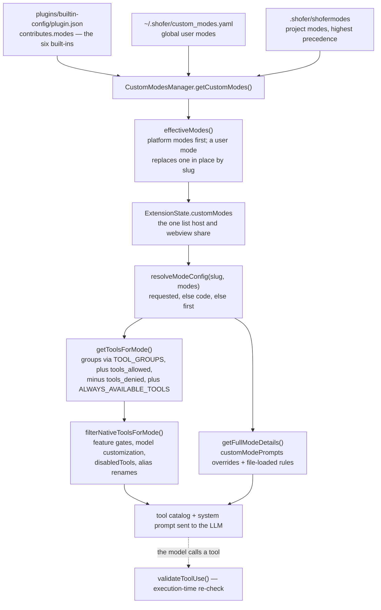

# Built-in Modes — Design

> The bundled **builtin-config** plugin — see [`../DESIGN.md`](../DESIGN.md)
> for why the built-in modes ship as a plugin.

## Purpose

Ship Shofer's six default modes — **Code, Architect, Debug, Code Search, Web Search,
Reviewer** — as data. Each is a role definition for the system prompt plus a tool-group
allow-list, and together they are what a user gets in the mode picker out of the box.

The definitions live in this plugin's manifest
([`plugin.json`](../plugin.json)), under `contributes.modes`. A user or project mode of
the same slug overrides one; an organization removes them all by suppressing the plugin.

## Why a plugin

There is **no built-in mode list in code**. Nothing in core falls back to a hard-coded
`code` mode: if no plugin and no file defines any mode, `resolveModeConfig()` throws
rather than inventing one. Making the defaults a plugin is what buys that — the modes
become one manifest that can be shipped, overridden, suppressed or serialized into a
config bundle, and core keeps only the generic machinery that resolves _any_ mode from
_any_ source.

Because the modes are a plugin contribution, plugin discovery must run **before**
anything enumerates modes; [`src/extension.ts`](../../../src/extension.ts) awaits
`provider.getPluginManager()` during activation for exactly that reason.

## What core keeps — the seams this plugin uses

Core knows nothing about Code or Architect. It owns the resolution chain a mode travels
through, and this plugin is one of its three input sources.

The host and the webview read the **same** list — `ExtensionState.customModes` — so a
mode is visible in the picker exactly when it is resolvable for a task.

### The mode contribution shape

Each entry in `contributes.modes` validates against `pluginModeContributionSchema`
([`packages/types/src/plugin.ts`](../../../packages/types/src/plugin.ts)) — a `ModeConfig`
minus `source`/`pluginName`, which the `PluginManager` assigns at discovery time:

| Field                | Type           | Purpose                                                    |
| -------------------- | -------------- | ---------------------------------------------------------- |
| `slug`               | `string`       | Machine-readable identifier (regex: `/^[a-zA-Z0-9-]+$/`)   |
| `name`               | `string`       | Human-readable display name (shown in Mode Selector)       |
| `roleDefinition`     | `string`       | The system-prompt role for the LLM agent                   |
| `whenToUse`          | `string`       | Guidance text shown in the mode selector tooltip           |
| `description`        | `string`       | Short description for mode picker UI                       |
| `tools`              | `GroupEntry[]` | Symbolic tool-group names with optional file-regex scoping |
| `customInstructions` | `string`       | Default custom instructions for the mode                   |

### The effective mode list: `effectiveModes()`

**File:** [`packages/core/src/plugins/plugin-modes.ts`](../../../packages/core/src/plugins/plugin-modes.ts)

One function decides what "all modes" means, and both readers use it:

- [`CustomModesManager.getCustomModes()`](../../../src/core/config/CustomModesManager.ts)
  — merges project (`.shofer/shofermodes`) over global (`custom_modes.yaml` in the
  settings directory), then folds in plugin contributions, caches the result and
  persists it to `globalState.customModes` (which is what `ExtensionState.customModes`
  carries).
- `HostState.readModeOverrides()` in [`src/host/host-bridge.ts`](../../../src/host/host-bridge.ts)
  — re-derives the plugin half from the persisted copy, so the system prompt's MODES
  section is correct even on the first read of a session.

Ordering and precedence:

1. **Platform modes** (unqualified slugs from a bundled plugin) lead the list.
2. A user or project mode with the same slug **replaces one in place** — so overriding
   `code` neither duplicates it nor moves it to the end of the mode picker. The
   override is **complete**: every field of the plugin's mode is replaced, with no
   partial merging of `tools` or `customInstructions`.
3. A user mode with a new slug is appended.
4. **Namespaced modes** from every other plugin come last; they cannot collide.

Precedence between the two user layers is resolved earlier, inside
`CustomModesManager`: project wins over global.

| Priority    | Source                                        | Scope                  |
| ----------- | --------------------------------------------- | ---------------------- |
| 1 (highest) | Project `.shofer/shofermodes`                 | Current workspace      |
| 2           | Global `custom_modes.yaml`                    | All workspaces         |
| 3           | `builtin-config` plugin (`contributes.modes`) | Shipped with extension |

A plugin mode is **not** user-editable in Settings → Modes: it is owned by the plugin,
and overriding it means authoring a mode of the same slug. `findAuthoredMode()`
([`packages/types/src/modes.ts`](../../../packages/types/src/modes.ts)) is the predicate
for that distinction.

### The namespacing exemption

Plugin contributions are normally namespaced (`<plugin>:<slug>` — `isNamespacedModeSlug()`
in [`packages/types/src/plugin.ts`](../../../packages/types/src/plugin.ts) is the exact test,
since a user- or project-authored slug can never contain the separator), which is what
makes cross-plugin collisions impossible. This plugin sets `unqualifiedContributions: true`
in its manifest, so its modes keep their authored slugs: `code`, not `builtin-config:code`,
registered at the built-in precedence tier.

The exemption is honoured **only for `bundled` scope** — a global or project plugin
cannot claim it, because an unqualified slug from a third party could silently shadow a
built-in. It exists for exactly this case: a plugin shipping the platform's own
defaults, whose names are a public contract (every user setting, mode link, `switch_mode`
call and doc names them).

### Tool groups: `TOOL_GROUPS`

**File:** [`packages/types/src/tool.ts`](../../../packages/types/src/tool.ts)

The `tools` field in each mode uses symbolic names. The actual tool membership is
defined in `TOOL_GROUPS` — a `Record<ToolGroup, ToolGroupConfig>`:

| Group           | Category              | Member Tools                                                                                                                                                                                                                                                   |
| --------------- | --------------------- | -------------------------------------------------------------------------------------------------------------------------------------------------------------------------------------------------------------------------------------------------------------- |
| `read`          | Read-only data access | `read_file`, `grep_search`, `list_files`, `rag_search`, `find_files`, `read_project_structure`, `view_image`, `list_code_usages`, `get_errors`, `get_project_setup_info`, `get_changed_files`, `lsp_search`, `fetch_web_page`, `ask_live_memory`, `git_search` |
| `write`         | Content mutations     | `apply_diff`, `write_to_file`, `generate_image`, `insert_edit`, `rename_symbol`, `create_directory`, `create_new_workspace`, `file`, `sed` (+ `customTools`: `edit`, `search_replace`, `edit_file`, `apply_patch`)                                             |
| `execute`       | System commands       | `execute_command`, `read_command_output`                                                                                                                                                                                                                       |
| `mcp`           | MCP protocol          | `use_mcp_tool`, `access_mcp_resource`, `call_mcp_tool_async`, `check_mcp_call_status`, `wait_for_mcp_call`                                                                                                                                                     |
| `mode`          | Mode switching        | `switch_mode`                                                                                                                                                                                                                                                  |
| `subtasks`      | Task orchestration    | `new_task`, `check_task_status`, `wait_for_task`, `cancel_tasks`, `answer_subtask_question`                                                                                                                                                                    |
| `questions`     | User interaction      | `ask_followup_question`                                                                                                                                                                                                                                        |
| `browser`       | Browser automation    | _(empty — browser tools are provided by the `browser-tools` MCP server)_                                                                                                                                                                                       |
| `uncategorized` | Fallback              | _(empty — for tools without explicit classification)_                                                                                                                                                                                                          |

The `customTools` array (currently only on `write`) lists tools that are **opt-in
only** — they are not included automatically by group membership. They only become
available when explicitly included via the model's `includedTools` configuration.

There are exactly **9** groups. Adding a 10th is a coordinated change affecting the
`toolGroups` const, the `TOOL_GROUPS` object, `toolGroupsSchema`, mode definitions,
auto-approval, and documentation.

### Always-available tools

**File:** [`packages/types/src/tool.ts`](../../../packages/types/src/tool.ts)

These tools are available in every mode — unless explicitly disabled via the
`disabledTools` setting or excluded by `tools_denied`:

| Tool                    | Purpose                                      |
| ----------------------- | -------------------------------------------- |
| `attempt_completion`    | Signal task completion with a rating         |
| `update_todo_list`      | Track and update the task todo list          |
| `run_slash_command`     | Execute built-in and custom slash commands   |
| `skills`                | Load skill instructions into task context    |
| `set_task_title`        | Set a descriptive title for the current task |
| `give_feedback`         | Send feedback to the Shofer developers       |
| `list_background_tasks` | List background tasks (children or peers)    |
| `send_message`          | Put an envelope in another task's mailbox    |
| `reply`                 | Answer a request in this task's mailbox      |
| `wait`                  | Read this task's mailbox                     |

### Tool list assembly: `getToolsForMode()`

**File:** [`packages/types/src/modes.ts`](../../../packages/types/src/modes.ts)

Assembles the final tool name set from a mode's `tools`, `tools_allowed` and
`tools_denied` fields:

1. Iterate `tools[]` → look up each in `TOOL_GROUPS` → collect tools
2. **Scoped group entries** (`{ "groupName": { allowed: [...], denied: [...] } }`) narrow the tool set:
    - `allowed`: exclusive list — only these tools from that group
    - `denied`: removes the listed tools from the group's normal set
3. **File-regex tuples** (`["write", { fileRegex: "\\.md$" }]`) restrict write
   operations to matching files at _execution time_ (not at tool-collection time —
   the tool is still listed but validated with `doesFileMatchRegex()` in
   `isToolAllowedForMode`)
4. Add explicitly whitelisted tools from `tools_allowed`
5. Remove explicitly denied tools from `tools_denied`
6. Add `ALWAYS_AVAILABLE_TOOLS`
7. Re-apply `tools_denied` to always-available tools (**denial always wins**)

### Runtime resolution: `resolveModeConfig()` and `getFullModeDetails()`

**Files:** [`packages/types/src/modes.ts`](../../../packages/types/src/modes.ts),
[`packages/core/src/modes/getFullModeDetails.ts`](../../../packages/core/src/modes/getFullModeDetails.ts)

`resolveModeConfig(slug, modes)` is the single fallback chain: the requested mode, else
`defaultModeSlug` (`"code"`), else the first mode that exists. With an empty list it
**throws** — a misconfiguration (built-ins suppressed, nothing supplied) the user has to
see, rather than a stub mode that would produce a system prompt with no role definition
and no tool restrictions.

`getFullModeDetails()` builds on it to produce the prompt-time configuration. It is
**host-only** because `addCustomInstructions()` transitively imports `fs/promises`,
`path` and `os`. On top of the resolved mode it applies:

1. **Prompt component overrides** — `customModePrompts[modeSlug]` can override
   `roleDefinition`, `whenToUse`, `description` and `customInstructions`. These apply to
   plugin-contributed modes (including these six); a mode the **user** wrote is taken
   exactly as written — see `getModeSelection()`.
2. **File-loaded rules** — `.shofer/rules-<mode>/*.md`, global custom instructions, and
   language-specific instruction files.

### Mode × tool filtering and execution-time validation

**Files:** [`filter-tools-for-mode.ts`](../../../packages/core/src/prompts/tools/filter-tools-for-mode.ts),
[`validateToolUse.ts`](../../../packages/core/src/tools/validateToolUse.ts)

`filterNativeToolsForMode()` produces the tool catalog sent to the LLM: resolve the mode
via `resolveModeConfig()`, take `getToolsForMode()` as the base set, apply
`isToolAllowedForMode()`, apply model-specific customization, then the feature gates
(`rag_search` without an initialized code indexer, `git_search` without a git indexer,
`ask_live_memory` without live memory, `update_todo_list` when `todoListEnabled` is
false, `generate_image` and `run_slash_command` behind their experiments,
`access_mcp_resource` with no MCP resources), then `disabledTools`, then alias renames.

`validateToolUse()` re-checks at execution time — defense in depth for a model that
calls a tool that is not in its catalog. It verifies the tool name is known, that the
user has not disabled it (a distinct message, so the model does not retry), and that
`isToolAllowedForMode()` still allows it, including file-regex scoping.

Every one of these seams is feature-agnostic: another plugin contributing modes travels
the same chain, differing only in that its slugs are namespaced.

## The six modes

In manifest order:

| #   | `slug`        | Name           | Role                                  |
| --- | ------------- | -------------- | ------------------------------------- |
| 1   | `code`        | 💻 Code        | Write, modify, and refactor code      |
| 2   | `architect`   | 🏗️ Architect   | Plan and design before implementation |
| 3   | `debug`       | 🪲 Debug       | Diagnose and fix software issues      |
| 4   | `code-search` | 🔎 Code Search | Search and explore the codebase       |
| 5   | `web-search`  | 🌐 Web Search  | Browse and extract web content        |
| 6   | `reviewer`    | 👀 Reviewer    | Review code and identify issues       |

Their tool grants:

| #   | Slug          | Name           | Groups                                                                                         | Default |
| --- | ------------- | -------------- | ---------------------------------------------------------------------------------------------- | ------- |
| 1   | `code`        | 💻 Code        | `read`, `write`, `execute`, `browser`, `mcp`, `mode`, `subtasks`, `questions`, `uncategorized` | Yes     |
| 2   | `architect`   | 🏗️ Architect   | `read`, `["write", { fileRegex: "\\.md$" }]`, `browser`, `mcp`, `subtasks`, `questions`        | —       |
| 3   | `debug`       | 🪲 Debug       | `read`, `write`, `execute`, `browser`, `mcp`, `subtasks`, `questions`, `uncategorized`         | —       |
| 4   | `code-search` | 🔎 Code Search | `read`, `execute`, `browser`, `mcp`, `questions`                                               | —       |
| 5   | `web-search`  | 🌐 Web Search  | `browser`, `questions`, `mcp`                                                                  | —       |
| 6   | `reviewer`    | 👀 Reviewer    | `read`, `execute`, `browser`, `mcp`, `subtasks`, `questions`                                   | —       |

Both tables are a convenience summary of the manifest; the manifest is authoritative.

**Key structural notes:**

- **`code`** is first in the manifest and matches `defaultModeSlug`, making it the
  fallback. It is the only mode carrying the `mode` group alongside write/execute.
- **`architect`** restricts the `write` group to `.md` files via a `fileRegex` tuple —
  writing a non-`.md` file throws a `FileRestrictionError`. It has **no `mode` group**,
  so `switch_mode` is not in its catalog (`switch_mode` lives only in `TOOL_GROUPS.mode`,
  which only `code` carries, and is not in `ALWAYS_AVAILABLE_TOOLS`). Architect therefore
  hands off by _asking the user_ to switch to an implementation mode (it has the
  `questions` group) — its `customInstructions` must not instruct it to call
  `switch_mode`, which it cannot.
- **`debug`** has near-full access (same as `code` minus `mode`).
- **`code-search`** has no `write`, no `mode` and no `subtasks`. **`reviewer`** has no
  `write` and no `mode`, but includes `subtasks`.
- **`web-search`** has no `read` — it works through the browser tools only.

## Org governance: suppressing the built-in modes

An organization can remove the six modes entirely so that ONLY user/project/bundle-provided
modes remain — letting a config bundle fully define the available mode set. This is
controlled by naming the plugin in the **`SHOFER_DISABLED_PLUGINS`** environment
variable (`SHOFER_DISABLED_PLUGINS=builtin-config`, comma-separated), delivered on the
executor / code-server pod (the same channel as `SHOFER_GLOBAL_DIR`). It is **not** a
persisted user setting: it never appears in `globalSettingsSchema` or the Settings UI
and cannot be toggled from the webview. Note the granularity: disabling
`builtin-config` removes the whole built-in mode set — a deployment that replaces the
defaults replaces all of it.

Because the built-ins are a plugin, suppression has exactly one expression:

- `governanceDisabledPlugins()` in
  [`packages/core/src/config/governance.ts`](../../../packages/core/src/config/governance.ts)
  reads the list (any bundled plugin can be named).
- `ShoferProvider` passes that list as the `PluginManager`'s `forceDisabledPlugins`. A
  force-disabled plugin contributes nothing and **cannot be re-enabled** from the Plugins
  panel; attempting to warns.
- Nothing else needs to know. The modes simply are not in the list, so the picker, the
  prompt's MODES section, skills' mode enumeration and tool filtering all agree with no
  separate flag to thread through — and the webview, which cannot read `process.env`,
  learns nothing new either.
- **Seeding:** the definitions stay reachable as data in the plugin manifest, so a
  platform tool can serialize them into a bundle regardless of the flag.

## Deliberate limits

- **The modes are not editable in Settings.** They are owned by the plugin; the
  supported customization paths are a same-slug user/project mode (a complete
  replacement) or `customModePrompts` (prompt components only).
- **Override is all-or-nothing per mode.** There is no partial merge of `tools` or
  `customInstructions` — a same-slug user mode replaces every field.
- **The unqualified slugs are a bundled-scope privilege.** A third-party plugin cannot
  contribute `code`; it gets `<plugin>:code`. That is the price of making these six
  names a public contract.
- **No fallback if they are gone.** Suppressing this plugin without supplying modes
  makes `resolveModeConfig()` throw. That is the intended outcome, not a gap.

## File index

| File                                                                                                                            | Role                                                                                              |
| ------------------------------------------------------------------------------------------------------------------------------- | ------------------------------------------------------------------------------------------------- |
| [`plugin.json`](../plugin.json)                                                                                                 | The six mode definitions (`contributes.modes`) — the canonical source                             |
| [`packages/core/src/plugins/plugin-modes.ts`](../../../packages/core/src/plugins/plugin-modes.ts)                               | `effectiveModes()` — merges plugin contributions with the user's and project's modes              |
| [`packages/core/src/plugins/plugin-manager.ts`](../../../packages/core/src/plugins/plugin-manager.ts)                           | `getContributedModes()` — tagging, namespacing and the `unqualifiedContributions` exemption       |
| [`src/core/config/CustomModesManager.ts`](../../../src/core/config/CustomModesManager.ts)                                       | Reads the mode files, merges, caches, persists to `globalState.customModes`                       |
| [`packages/types/src/modes.ts`](../../../packages/types/src/modes.ts)                                                           | `resolveModeConfig()`, `getAllModes()`, `getModeBySlug()`, `getToolsForMode()`, `defaultModeSlug` |
| [`packages/types/src/mode.ts`](../../../packages/types/src/mode.ts)                                                             | `ModeConfig` type + schema                                                                        |
| [`packages/types/src/plugin.ts`](../../../packages/types/src/plugin.ts)                                                         | `pluginModeContributionSchema`, `isNamespacedModeSlug()`, `PLUGIN_NAMESPACE_SEPARATOR`            |
| [`packages/types/src/tool.ts`](../../../packages/types/src/tool.ts)                                                             | `TOOL_GROUPS`, `ALWAYS_AVAILABLE_TOOLS`, `TOOL_ALIASES`, `toolNames`, `TOOL_DISPLAY_NAMES`        |
| [`packages/core/src/modes/getFullModeDetails.ts`](../../../packages/core/src/modes/getFullModeDetails.ts)                       | Host-only full mode resolution with prompt overrides + file-loaded rules                          |
| [`packages/core/src/prompts/tools/filter-tools-for-mode.ts`](../../../packages/core/src/prompts/tools/filter-tools-for-mode.ts) | LLM tool catalog filtering (`filterNativeToolsForMode`)                                           |
| [`packages/core/src/tools/validateToolUse.ts`](../../../packages/core/src/tools/validateToolUse.ts)                             | Execution-time tool access validation (`validateToolUse`, `isToolAllowedForMode`)                 |
| [`packages/core/src/config/governance.ts`](../../../packages/core/src/config/governance.ts)                                     | `governanceDisabledPlugins()` — the env flags that suppress bundled plugins                       |

## Related

- [`docs/plugin_system.md`](../../../docs/plugin_system.md) — the plugin seams, scopes and
  the `unqualifiedContributions` exemption in general.
- [`docs/tool-categories.md`](../../../docs/tool-categories.md) — what each tool group
  contains and why.
- [`docs/tool_access.md`](../../../docs/tool_access.md) — the full mode × tool access model.
